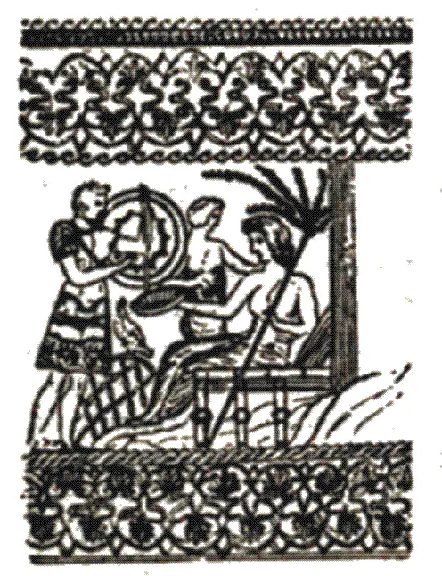

+++
title = "La Cábala de Predicción"
description = "La Cábala de Predicción es una de las obras clásicas del esoterismo en lengua española escrita por J. Iglesias Janeiro y publicada por Editorial Kier. El libro presenta un amplio sistema simbólico que relaciona la tradición cabalística occidental con el Tarot Egipcio, la astrología, la numerología y diversas disciplinas herméticas. A través del estudio de los arcanos, los símbolos y las correspondencias tradicionales, la obra propone un método de interpretación orientado al conocimiento de las fuerzas que influyen en la vida humana y al desarrollo de la intuición. Considerado un texto de referencia dentro de los estudios ocultistas hispanoamericanos, reúne enseñanzas sobre los 78 arcanos del Tarot Egipcio, principios cabalísticos y procedimientos de predicción simbólica, convirtiéndose en una pieza fundamental para quienes investigan la tradición hermética occidental."
weight = 9
template = "book.html"

[extra]
authors = ["J. Iglesias Janeiro"]
translators = []
original_title = "La Cábala de Predicción"
original_language = "es"
language = "es"
publication_year = 1947
publisher = "Editorial Kier"
cover = "portada.webp"
cover_alt = "Portada de La Cábala de Predicción de J. Iglesias Janeiro"
series = "Tradición Hermética y Ocultismo Occidental"

tags = [
  "La Cábala de Predicción",
  "J. Iglesias Janeiro",
  "Jesús Iglesias Janeiro",
  "Editorial Kier",
  "cábala",
  "tarot egipcio",
  "tarot",
  "arcanos mayores",
  "arcanos menores",
  "78 arcanos",
  "hermetismo",
  "ocultismo occidental",
  "esoterismo",
  "astrología",
  "numerología",
  "simbolismo hermético",
  "magia ceremonial",
  "adivinación simbólica",
  "tradición iniciática",
  "sabiduría antigua"
]

license = "CC BY-NC-SA 4.0"
license_url = "https://creativecommons.org/licenses/by-nc-sa/4.0/"
+++

<!--
La Cabala de Prediccion

J. Iglesias Janeiro
-->

## AL LECTOR QUE BUSCA SABIDURIA

> _Y aparecióse Jehová a Salomón una noche en sueños, y díjole Dios: "Pide lo que quisieres que yo te dé"._
> _"Soy mozo pequeño, que no sabe cómo entrar ni salir. Da, pues, a tu siervo corazón sabio para juzgar y discernir"._
> _'Porque has demandado sabiduría, conforme a tus palabras tendrás; y con el saber, también las cosas que no pediste, tal, que entre los reyes ninguno haya como tú, en todos los días". — SAGRADAS ESCRITURAS_

Es tradición que Pitágoras rechazó el dictado de sabio en razón de que sabio quiere decir "el que lo sabe todo", y no habiendo persona capaz de saber todas las cosas, es impropio atribuirle una suficiencia que no posee. Aceptó, en su lugar, el de filósofo, que queriendo decir "el que aspira a la sabiduría", explica por si mismo que si bien a nadie le es dable saber todas las cosas, constituye una virtud en cualquier persona aspirar y esforzarse por saberlas. Libro que anima a buscar saber, que orienta el esfuerzo para encontrarlo, es el que pongo en manos de usted para que cultive esa virtud en lo que a la predicción concierne.

Al poner el libro en sus manos, lo hago partiendo del principio de que la predicción es una necesidad natural —la necesidad que todos sentimos de conocer el resultado de lo que hacemos—, y como tal necesidad no sólo posee en nosotros las facultades que la satisfacen, sino que tiene en una ciencia el cuerpo de doctrina que la explica, siendo la ciencia y sus métodos las vías de acceso a las facultades que proporcionan los conocimientos, y esas facultades las fuentes que sacian la necesidad de conocer. Libro que explica la predicción a base de doctrinas cabalísticas, y justifica la efectividad de las doctrinas por la efectividad de las facultades, es el que le ofrezco como guía orientadora en la búsqueda de saber, no con la promesa de que doctrinas, métodos y facultades le den el conocimiento de todas las cosas, sino en procura de que le proporcionen el de algunas de ellas.

La efectividad de la virtud predictiva, que poseen las doctrinas y las facultades, tiene su fundamento en el hecho de que en el hombre existen todos los equivalentes del Universo, y en la mente todos los equivalentes del hombre, siendo las doctrinas especiales exponentes de los equivalentes mentales. y los métodos el particular coordenado a través del cual la mente hace inteligible el saber que perciben las facultades y el hombre se identifica con cuanto lo circunda. Por ese fundamento, estando en la mente de cada persona todas las virtualidades que posee la especie, y en la especie todas las virtualidades necesarias al vivir y evolución del individuo, las doctrinas y los métodos adquieren la virtualidad que la mente les comunica, constituyéndose, por ello, en las llaves maestras que abren y cierran nuestras moradas interiores y hacen posible que las facultades liberen en unos tiempos el saber con que el vivir de otros nos va llevando desde lo que fuimos a lo que seremos. El libro que pongo en sus manos cumple la misión de ofrecer a usted algunas de esas llaves.

Las llaves que el libro ofrece —como todas las llaves— sólo tienen el valor de la propiedad con que usted se sirva de ellas. Quiere decir, sólo tienen el alcance que usted mismo les comunica como instrumentos que abren y cierran sus moradas interiores y dan salida al saber que esas moradas encierran. Obra de los estudiosos de la más remota antigüedad, y surgida en respuesta a la necesidad que todos sentimos de conocer el resultado de lo que hacemos, estas llaves se convirtieron en una ciencia de las anticipaciones, que facilitando a cada persona hacer inteligible al propio saber, limitan esa facilidad a la capacidad que el interesado desarrolla para servirse de la ciencia y convertirla en la vía de manifestación a través de la que el propio conocimiento se pone de manifiesto. Con esta limitación, el libro que pongo en sus manos puede prestar incontables servicios.

Puede prestar incontables servicios, porque estando en nosotros todos los equivalentes y todas las virtualidades, además de sernos posible conocer infinidad de cosas, los métodos ayudan a que cada persona haga suyas las que particularmente le interesan, guiándola no sólo en lo que al conocimiento concierne, sino en lo que a la obtención y disfrute de esas cosas incumbe. Que con los bienes de las cosas a que aspira en lo presente, le sean dados los muchos otros a que el estudio del libro que pongo en sus manos lo haga merecedor, es el deseo de

EL AUTOR

## INTRODUCCION A LA QUINTA EDICION

No siempre el hombre atina a proyectarse como ser realmente trascendente. Su lucha cotidiana lo sumerge, sin sentirlo, en un marasmo de aportes materiales que lo substraen, como por encanto, de acudir a la esencia de la verdad misma que rige sus actos en forma sempiterna. Por fortuna, la civilización, más allá de sus limitativas vislumbres pragmáticas, permitió con una invención, reafirmar la esencia que es saber, que es doctrina, que en verdad es trascendentalismo puro. La humanidad existe y subsiste por dos abstractos: la mente y la palabra. Esta última, hermanada al sublime y divino Logos —que abarcan todas las religiones y corrientes filosóficas— hace que lo aprendido hace siglos resulte inmanente y que, gracias al prodigioso encuentro con esa obra artesanal de la impresión, nada de lo que se sabe se pierda para siempre. Así el hombre sigue, a su modo, zigzagueante, vacilante o temeroso, audaz, tímido o conturbado, creando, día a día, lo que es producto de sus ansias, de sus errores, de sus quimeras y, por sobre todo, de la apelación que sus semejantes ejercen sobre sus reservas más profundas. No estamos solos. Vivimos en sociedad. Obramos en conjunto. Luchamos, a nuestro modo, para rescatamos de esa "alienación" que, poco a poco, quiere ganamos por completo. LA CÁBALA DE PREDICCIÓN resulta, de por sí, en estos tiempos hiperbólicamente sometidos a la tecnocracia, un libro fascinante, por la profundidad de los conocimientos que prodiga, por la frondosidad de las disciplinas que abarca, y por el riguroso ensamble de unos con otros, siguiendo un orden lógico y natural que subyuga y atrapa al lector desde el principio al fin.

De esta manera, el hombre, inmerso en ese claustro de soledades compartidas puede, merced a la sabiduría de muchos otros milenarios y casi legendarios personajes, libar el néctar de la ciencia, introducirse en el meollo mismo de doctrinas ocultas, satisfacer su curiosidad de siglos, aprovechar esa experiencia ancestral que, en una fracción de tiempo de la historia de la humanidad, alguien, en este caso un ser de los quilates de J. Iglesias Janeiro, compendió, tomó comprensible y expuso por escrito.

Sobre el modo de leer este libro podría afirmarse que quien pretenda interiorizarse de una serie de conceptos interesantes, no ha, de obtener logros menos positivos. Más si lo que quiere es establecer contacto con este manantial de verdades rigurosas y exactamente ciertas, que proceden de los rincones más lejanos de la historia, muy distinto ha de ser el modo con que habrá de encararse la lectura, pues el tópico es muy complejo y la sabiduría milenaria no se asimila de pasada.

LA CÁBALA DE PREDICCIÓN en esta su quinta edición, constituye, por lo tanto, un manual en el que nada de lo que está escrito sobre la materia ha sido dejado de lado. J. Iglesias Janeiro vuelca aquí el producto de una larga y fecunda experiencia, de una medulosa confrontación de hechos, documentos y pruebas. Así, por un sendero en el que la anticipación se brinda como algo concreto, exento de fantasías y lirismos, el lector se internará en los secretos de la predicción como necesidad natural, en sus fundamentos, procedimientos y contribuciones; en la develación de incógnitas por razones matemáticas, por medidas interpretativas, por valores potenciales; en la numerología y astrología; en los arcanos del Tarot de los Bohemios; en videncia y clariaudiencia, etc., etc.

Pero por sobre todo quedará engarzado en la mente y en el corazón un mensaje de esperanza, de fe y de coraje para enfrentar los hechos que la vida nos depara. J. Iglesias Janeiro logra así, con su libro, perennizar su nombre y aventar ese escepticismo que subraya el arcaico adagio: _Nihil novum sub sole_... En verdad, cada día hay algo nuevo. Ese es milagro de la vida, de la belleza, del amor y, por encima de todo, de la insaciable sed de conocimiento, siempre a tono con la sublime especulación del infinito...

HÉCTOR V. MOREL

## AL LECTOR DE LA 4ª EDICION

La obra está dividida en lecciones, cumpliendo cada lección el doble cometido de suministrar determinados conocimientos y preparar la mente del lector para la buena comprensión de las lecciones que siguen, siendo, por ello, aconsejable leer todas las lecciones antes de dar aplicación a las enseñanzas y métodos contenidos en cualquiera de ellas. Las lecciones abarcan los siguientes temas;

Lección I: La predicción como necesidad natural, y forma en que los antiguos oráculos satisfacían esa necesidad.

Lección II: Existe una ciencia de las anticipaciones, y métodos religiosos y mundanos que integran esa ciencia.

Lección III: Fundamentos de la predicción, en lo que respecta al ordenamiento que rige la naturaleza.

Lección IV: Contribución de la aptitud personal a la predicción, a base de la acción refleja del automatismo mental.

Lección V: Procedimientos de predicción, basados en la capacidad de percepción que poseen las cinco facultades primarias.

Lección VI: Predicción por movimientos planetarios, a base del mes y hora de nacimiento, con el Mapa Psíquico de cada nativo.

Lección VII: Develación de incógnitas por razones matemáticas, con ejemplos de develación verdadera, revelación aparente y develación condicionada.

Lección VIII: Predicción por medidas interpretativas, a base de las del Año Divino de los antiguos egipcios y de la criptografía de la Gran Pirámide.

Lección IX: Predicción por valores potenciales, a base de las propiedades de los números como equivalentes de las letra de los nombres personales y fechas de nacimiento.

Lección X: Los números como guía diaria de orientación, en su triple aspecto de exponentes de la personalidad, tónica de los días y ritmo del tiempo.

Lección XI: Predicción por inspiración psíquica, a base del simbolismo universal, las facultades primarias y las claves herméticas.

Lección XII: El libro del saber y sabiduría que contiene, con la interpretación de los 78 Arcanos egipcios que formaron el _Libro de Thot_.

Lección XIII: Método para inferir el saber contenido en el libro, con la explicación de la preparación y ritual que exigen el planteo y solución de los problemas a base del _Libro de Thot_.

Lección XIV: Práctica del método y dedicación del saber, con ejemplos de mapas por factores fijos, factores móviles y factores progresados.

Aunque tratando las lecciones temas distintos, la utilidad de la obra tiene su razón de ser en la capacitación de conjunto que da a cada lector, dependiendo de esa capacitación el servicio que los distintos métodos pueden prestar. Comprenderlo así, es el primer aporte con que ese lector da efectividad a la ciencia de las anticipaciones.

## PRIMERA PARTE

## LECCIÓN I

## LA PREDICCION COMO NECESIDAD NATURAL

> "El alma que sabe algo se consume en el deseo de saber más. La que vislumbra a Dios se consume en el deseo de llegar a Él". — TORAH.

Predecir es anticipar, prever los resultados de un acto y anunciar sus consecuencias. Se predice el tiempo, el movimiento de los astros, los flujos de las mareas, la abundancia de las cosechas, el curso de las enfermedades, la evolución de los acontecimientos, el éxito de los negocios, las consecuencias de lo que obramos, la utilidad del saber que adquirimos, las situaciones a confrontar en los caminos que se siguen, el bien o el mal a que nos conduce cada paso que damos, y en fin, los probables efectos de cuanto hacemos o dejamos de hacer.

—"¡Sabes vencer, Aníbal" —dicen que dijo al general cartaginés su amigo Maharbal cuando después de la victoria de Cannas el célebre caudillo decidió invernar en Capua en vez de sitiar a Roma—. "Sabes vencer, pero no sabes sacar provecho de tus victorias y el resultado final será la derrota".

Ver por adelante lo que ayuda a vencer, seguir viendo lo que puede hacer útil el triunfo, prever los acontecimientos a que ese triunfo dará lugar, advertir las probables derivaciones que tal acción puede tener y en suma, mirar desde hoy lo que traerá mañana, no sólo es poseer el conocimiento que permite predecir los sucesos, sino prepararnos para confrontarlos. Por carecer de esa visión, Aníbal, el capitán más glorioso de sus tiempos, después de ver cumplida la predicción de Maharbal, perseguido por los romanos en todos los países en que se refugiaba, viejo y sin soldados, tuvo que utilizar el veneno que su amigo le legara a fin de evitarse la humillación de entrar en Roma uncido al carro del vencedor.

"Libertemos a Roma de sus temores" —dijo al tomarlo—," ya que los romanos no saben esperar la muerte natural de un anciano".

Prever, anticipar lo previsto y saber ver el tiempo en que tendrá efecto lo anticipado, son los tres elementos que concurren a toda predicción. En mayor o menor grado, esos elementos también entran en cuanto realizamos a lo largo de la vida, pudiendo decirse que

los conocimientos que adquirimos, los esfuerzos que realizamos, las empresas que acometemos, las asociaciones que cultivamos, los bienes que perseguimos, y en fin, lo mucho o lo poco que hacemos en cada minuto, tienen su razón de ser en esa propiedad de la naturaleza humana de mirar a lo lejos, prepararse para confrontarlo y seguir el curso del tiempo que lo actualiza. El interés, por ejemplo, que tiene el padre de que el hijo complete sus estudios a satisfacción, ¿no es una anticipación del mejor servicio que prestará el joven profesional? La profesión que ese joven escoge, ¿no es una anticipación de la clase de vida que aspira a vivir? Los éxitos o fracasos que obtiene en los primeros pasos que da en ella, ¿no son una anticipación de lo que ha de venir más tarde? Los cálculos de materiales que efectúa el ingeniero encargado de construir un puente, ¿no son hechos en base del tráfico que la obra tendrá que soportar? La mercadería que ofrece el comerciante, ¿no cumple la doble misión de prestar determinado servicio al que la compra y proporcionar una ganancia quien la vende. El inventor que dedica sus desvelos a producir un nuevo elemento de progreso, ¿no lo hace con la visión de la necesidad que ha de llenar? El investigador que se afana por arrancar a la naturaleza sus secretos, ¿no tiene una visión del cometido que esos secretos van a cumplir? Usted mismo, lector, ¿no anticipa en cada día mucho de lo que hace al siguiente?

Si apartándonos de las actividades individuales, inquirimos en la de las instituciones colectivas, grandes empresas anónimas o los organismos del Estado, ¿dejaremos de ver que existe en ellos el mismo espíritu de previsión, anticipación y conocimiento previo? Los programas que formulan los partidos políticos, ¿predicen o no la clase de gobierno que darán al pueblo cuando suban al poder? Los presupuestos que se aprueban anualmente por adelantado, ¿no indican la línea general de gastos que habrá durante ese lapso? Las asignaturas que se cursan en los centros docentes, ¿no son un anticipo de lo que ha de ser más tarde la vida ciudadana? Los planes secretos que rigen la estructuración del ejército, ¿no están hechos a base de las necesidades que ha de imponer la próxima guerra? El minuto de producción de cada empresa industrial, ¿no es una síntesis de la demanda que ha de haber en el mercado en un futuro próximo? La construcción de un salto de agua, ¿no indica por sí misma la actividad industrial que se ha de desarrollar? Los cimientos de una catedral, ¿no conllevan la idea del culto a que se dedica y la de la multitud de fieles que ha de atenderlos? Y en fin, la presente estructuración de la sociedad en que vivimos, ¿no es por ventura la realización de lo que previeron nuestros abuelos y un anticipo de lo que preverán nuestros nietos?

Todo lo que nos proponemos es una anticipación de lo que esperamos realizar, y lo realizado un efecto inmediato de causas precedentes y razón determinante de futuras realidades, tal vez no respondiendo siempre lo que es segundo a lo que hace esperar lo que es primero, pero sin que jamás ninguno de los dos deje de ser el resultado del móvil anterior en que cada cosa tiene su punto de partida. Estando formados esos móviles mitad por lo que sabemos por experiencia y mitad por lo que inferimos por intuición, querámoslo o no todo nuestro caminar es un constante predecir, que llevándonos de unas ideas a otras y de unos actos a los que los complementan, convierte el presente en el molde del futuro y la predicción en la necesidad natural de exigencias más perentorias en la existencia de cada individuo.

Como necesidad natural, ¿cuáles son sus fuentes de conocimiento? ¿A través de qué medios hace efectivas sus virtudes?

Predecir es anticipar los resultados de un acto y anunciar en alguna forma sus consecuencias. Al formar su nido, el pajarillo anuncia y anticipa el celo, la fecundación y la cría. Las investigaciones y cálculos que realiza el sabio, anticipa y anuncian el carácter y servicio que prestará su próximo descubrimiento. La semilla que deposita en la tierra el agricultor es un anticipo y anuncio de la cosecha que vendrá más tarde. Si la predicción es una necesidad natural para el pajarillo, el sabio y el agricultor, ¿por qué en cada uno sólo es efectiva para cierta cosa? Y si, por ejemplo, hay igual necesidad entre dos sabios, ¿por qué unos sabios aciertan y otros se equivocan? Y habiendo la misma necesidad en el mismo sabio, ¿por qué unas veces acierta y otras yerra? ¿Será por ventura que esa necesidad está vinculada a una _ciencia de las anticipaciones_, ciencia natural también, que, sólo es efectiva cuando con naturalidad recabamos su concurso?

### Vislumbres de una ciencia de las anticipaciones

La predicción o anuncio anticipado de una cosa por la presencia de otra, tiene en los seres de vida inferior sus más notables exponentes. Cuando la araña, por ejemplo, acorta los últimos hilos de su tela y los refuerza, se previene y anuncia vientos fuertes o lluvia; si se pone a trabajar mientras llueve, el anuncio es de próximo buen tiempo; si al ponerse el sol cambia la orientación de la tela y la dispone para la caza, anticipa una noche serena. ¿En virtud de qué saber infiere el tiempo que se aproxima? Se dice que es la dirección del viento en relación a la humedad atmosférica lo que guía sus actos. A los mismos agentes se atribuye el conocimiento anticipado que tienen los pájaros y las gallinas respecto a las tormentas. ¿De qué manera, sin embargo, aprenden a comportarse en la forma que lo hacen? ¿Por experiencia? Hay ciertas orugas que mueren antes de que nazcan sus crías, pero al morir dejan todo arreglado en forma de que sus hijuelos, que nacerán meses después, hallen a mano cuanto necesiten, incluso carne fresca, para lo cual hieren a sus presas de manera que no perezcan antes del tiempo conveniente y les almacenan suficiente alimento para que se nutran hasta la época en que las crías de las orugas estén en posición de devorarlas. Muertos los padres antes de nacer los hijos, ¿cómo aprenden previsiones tan minuciosas? ¿Será de esa ciencia de las anticipaciones que decimos es una necesidad natural? El gusano de seda que se afana en tejer el capullo que ha de servirle de mortaja, ¿no será de esa misma ciencia que extrae los conocimientos que lo guían a tejerlo en forma de que el sepulcro de los padres sea cuna protectora de los hijos?

En lo que a los irracionales se refiere, parece que esa ciencia de anticipar y anunciar está constituida por la _inteligencia instintiva_ que cada ser hereda al nacer a fin de que pueda cumplir la misión que le corresponde. Habiendo en el hombre una capacidad superior, ¿estaremos privados de esa inteligencia primitiva?

Se dice que cuando César llegó con su ejército al Rubicón, se detuvo vacilante antes de cruzarlo, pues dicho río marcaba los límites en los que todo general romano debía licenciar sus tropas so pena de ser declarado traidor y condenado a muerte. Largas jornadas había caminado César con la decisión de desobedecer esa ley y apoderarse de Roma, pero llegado el instante en que un paso más significaba la victoria o la muerte se sintió indeciso ante un pequeño cauce de agua. ¿Debía cruzar el río y avanzar sobre Roma? ¿Debía licenciar su ejército en obediencia a la ley que así lo mandaba? Si hacia lo primero ¿triunfaría? ¿Era ya tiempo para lo segundo? Honda tormenta agita el ánimo del vencedor de las Galias, y torbellinos de ideas contradictorias se agolpan en su mente con velocidad vertiginosa, inspirándole impulsos antagónicos y llenando su alma de inquietudes. Es el instante de las grandes decisiones, en que la voluntad individual se debate entre dos corrientes y no acierta a decidirse por ninguna: el instante en que, como abandonados por nosotros mismos, hacemos dejación de los recursos propios y, elevando los ojos al espacio, preguntamos, ¿qué hacer?

"¿Qué hacer? —se preguntaba César con afán en el preciso instante que tres pajarillos vuelan sobre su cabeza en dirección a Roma—. "¡La suerte está echada!", —dijo con alegría al verlos, y cruzó con decisión el río.

¿Fue, en realidad, el vuelo de los pájaros lo que animó a César a resolverse? ¿Lo fue el conocimiento subconsciente que el vuelo de las aves despertó en él?

También es tradición que cuando _El Cid_ salía desterrado, pobre y sin saber a dónde dirigirse, el vuelo de unos pájaros le indicó el camino del triunfo.

"¡Suerte nos anuncian las abubillas, por la derecha!" —dijo a los pocos que lo acompañaban. Y tomando resueltamente el camino que seguían las aves, agregó: "Arriba los corazones, y ¡adelante!"

¿Puede influir en los resultados de una empresa que las abubillas se dirijan en una dirección u otra? Las victorias alcanzadas por el Campeador, ¿pudieron tener su punto de partida en el conocimiento subconciente que esas aves despertaron en El Cid?

Cuando Alejandro invadió Persia, tan seguro se sentía Darío de su poder que le envió, en son de mofa, un irónico mensaje, acompañado de una cajita de oro, muestra de la gran riqueza que poseía un puñado de semillas de lirio, símbolo del numeroso ejército que Alejandro tendría que vencer; una bola, diciéndole que era para que el mozalbete jugara con los bandidos que le acompañaban y un látigo, para que se vapuleara a sí mismo y a los consejeros que lo animaran en su temeraria empresa. Recibió todo ello Alejandro, y contestó a Darío que "aceptaba el oro, como primicia anticipada de las riquezas que muy pronto le iba a arrebatar; las semillas, como adelanto de las partes en que iba a dividir el imperio persa; la bola, por ser símbolo del poder universal de que disfrutaría en breve; y el látigo, pues habría de servirle para castigar la insolencia de quien se lo mandara y hacerle comprender la fragilidad de las cosas humanas". Como se sabe, Darío erró y Alejandro acertó, el primero perdiendo cuanto esperaba conservar; y el segundo consiguiendo cuanto se había propuesto. ¿Hubo un conocimiento subconsciente en Darío al enviar a su oponente un anticipo de lo que habría de suceder? ¿Fue el sentido cifrado en los objetos ofrecidos lo

que inspiró a Alejandro el comportamiento que había de llevarlo a la victoria? Cuando, poco después, el rey sin reino, esposo sin esposa y padre sin hijos, Darío ofrecía el último oro que le quedaba en rescate de su familia, el general Parmenio, íntimo de Alejandro, dijo a éste:

"Yo aceptaría, si fuese Alejandro"."Yo también, si fuese Parmenio", contestó Alejandro.¿Qué había en el alma de uno que le indicaba el proceder que seguiría si se hallase en la posición del otro? ¿Qué había en Alejandro que le impedía comportarse en la forma que lo haría si fuese Parmenio?

Joven, rey de vidas y haciendas de un dilatado imperio, momentos antes de morir, con clara visión de que ninguno de sus familiares o colaboradores tenía cualidades para conservar sus conquistas y continuar su obra, al preguntársele a quién legaba el cetro, sólo acertó a contestar:

"Lo lego al más digno".

¿Fue dictada esa respuesta por su desgano de las cosas terrenas en el momento en que esas cosas pierden su valor? ¿Lo fue por la visión anticipada de lo que había de suceder poco después de fallecido? ¿Había en ella un reproche o un consejo?

Poco antes de iniciar una de sus grandes batallas, Alejandro consultó los augures acerca de lo que debía hacer para alcanzar la victoria.

"Sacrifica la vida del primer ser que veas al salir del templo", fue la respuesta.

Lo primero que vio fue un campesino montado en un asno. Empero, cuando Alejandro se disponía a sacrificar al hombre en obediencia al mandato de los augures, el campesino arguyó que la cabeza del pollino precedía la suya cuando los vio el rey, y que, por lo tanto, era el animal, y no el hombre, al que había que sacrificar. Aceptó Alejandro el razona miento, y sacrificado el pollino, al separar las grasas para quemarlas, se encontró en su vientre un mensaje que el general enemigo transmitía a otro jefe de su ejército dándole las órdenes convenientes para el combate, mensaje que al no llegar a su destino no solo ocasionó la desarticulación del ejército contrario, sino que ayudó a Alejandro a disponer el suyo en forma de que pudiese alcanzar la victoria. ¿Tenía el augur conocimiento del mensaje confiado al vientre del asno? ¿Sabía ese augur que lo primero que vería Alejandro al salir del templo era el asno que transmitía tan importantes informes? ¿Fue el razonamiento del campesino lo que decidió a Alejandro a sacrificar la bestia y no el

hombre? ¿Lo fue su conocimiento subconsciente del mensaje oculto en el vientre del animal? ¿Hay en todo ello una simple _coincidencia_ o la manifestación de una ley?

### Proyecciones que alcanzan las vislumbres

Cuando Alejandro cruzaba el desierto de Libia, le salieron al encuentro los sacerdotes del Templo de Ammón para mostrarle las profecías contenidas en sus libros respecto a la futura grandeza del hijo de Filipo. En esas profecías no sólo se afirmaba que Asia seria vencida por Europa, sino que, incluso, se especificaba la fecha, edad y carácter del vencedor, haciendo una relación detallada de los territorios que conquistaría. Se explica a este respecto que los sacerdotes de Ammón alteraron el sentido de los textos a fin de adaptarlos a la realidad y halagar a Alejandro, inclinándolo a su favor. Es el caso, sin embargo, que cuando el conquistador macedonio llegó a Babilonia, la ciudad le abrió las puertas sin lucha y rindió el ejército de que disponía en razón de que los libros sagrados así lo mandaban, por ser inútil toda resistencia, proceder que muchas otras ciudades imitaron por el mismo motivo y que contradice las suspicacias de los que ven en el proceder de los sacerdotes de Ammón una servil astucia para captarse las simpatías del joven guerrero. ¿Se puede aceptar, por lo tanto, que los libros sagrados de la antigua Persia anticiparon lo que habría de ocurrir centenares, tal vez millares de años después?

Como es sabido, los primeros conquistadores españoles de América suponían que los indios tenían la idea de que al perecer o caer prisionero el cacique o jefe que los dirigía, era preciso que cesaran toda resistencia, pues en el jefe caído estaba todo el poder del ejército que mandaba, y al ser vencido ese jefe, también lo eran, automáticamente, los soldados a sus órdenes. En consonancia con esta suposición, los conquistadores trataban de apoderarse del jefe contrario, unas veces por la astucia, como hizo Hernán Cortés con Moctezuma en México, y otras por la fuerza y la astucia, cual hizo Pizarro con Atahualpa, en medio de un poderoso y aguerrido ejército, treinta veces superior al suyo. La verdadera explicación de tal proceder de los nativos no está, sin embargo, en la idea que les atribuían los conquistadores, sino en el hecho de que los libros sagrados de los aztecas y de los incas profetizaban la llegada de los hombres blancos, "lo hijos del Sol, que vendrán por mar, empujados por el viento y fulminando el rayo, para dominar a todos, primero a los más fuertes". ¿Cómo pudieron esos libros predecir tales eventos? ¿A base de qué ciencia se hicieron predicciones de tal fidelidad?"

"¡Prended fuego a ese caballo fuera de las murallas" —gritaba Casandra, angustiada. a los troyanos—. "No lo introduzcáis en Troya, pues nos abrasará a todos".

¿De qué ciencia se sirvió Casandra para conocer lo que ocultaba un montón de madera en figura de caballo? ¿Qué había en la joven que le permitía ver los resultados finales del acto que se pretendía realizar?

"No escuches la voz del "_Malinche_" —aconsejaba la Princesa Papantzin a su hermano Moctezuma, emperador de México—. "Si la oyes una sola vez, serás encantado por ella y todos pareceremos, tú el primero". Prescott afirma que la ciencia de que se servia la bella Papantzin era la necromancia, y por su medio no sólo anunció a su hermano lo que ocurriría si se entrevistaba con Cortés, sino que con anterioridad le había predicho el próximo fin de su imperio. En este caso, al igual que en el de Casandra, la predicción fue cumplida. ¿Se puede atribuir a coincidencia?

"Los hijos de Nahua andarán peregrinos hasta encontrar el águila que devora la serpiente sobre un nopal" —decían los libros sagrados de los aztecas—. "El lugar en que la hallaren será el del esplendor de la raza" —agregaban dichos libros y la tradición. Los nahuas peregrinaron largos años hasta que encontraron a orillas del lago de Texcoco lo que sus escrituras les anunciaban y lo que el oráculo de Aztlán les prometiera al cruzar el Río Colorado: tierra feraz en qué fundar un gran imperio y levantar templos suntuosos a sus dioses. Fieles a la tradición, fundaron en ese lugar lo que llegó a ser la Gran Tenochtitlán, con más de 300.000 habitantes, que extendía su poder sobre un vasto imperio y alcanzó una civilización excepcional para aquellos tiempos. Esta ciudad, y el imperio de más de quince millones de habitantes sobre el que ejercía dominio, con una civilización en algunos sentidos superior a la de los conquistadores, la hizo suya Hernán Cortés con sólo el arrojo de 1,500 hombres y la influencia que logró ejercer sobre Moctezuma. ¿Se cumplió en este caso la predicción de los libros sagrados aztecas? ¿Fue fiel el augurio de la Princesa Papantzin a su hermano?

### Aspectos que abarca la cienciade las anticipaciones

Relata la tradición incaica que una noche, en sueños, Manco Capac sintió una voz que le ordenaba salir con su familia de la cueva que habitaba en _Yampu-Tocco_ (Casa de los Vientos) y seguir caminando hasta que la varilla de oro sobre la que posaba el _Inti_ (Sol), dios tutelar de la familia y consejero del jefe de ella, se hundiese por sí misma en el suelo, hecho que sólo ocurriría en el lugar que el destino le tenía reservado para ser cimiento de una raza poderosa y el más grande entre los suyos. Acompañaron a Manco sus hermanas Cachi (sal), Uchú (pimienta) y Anca (placer), y sus hermanos 0cllo, Huaco, Cura y Rana, y los ocho, guiados por Manco y éste por el Inti siguieron a la ventura hasta que la varilla de oro se hundió por sí sola en tierra, hecho que ocurrió en una colina, que más tarde llegó a ser la gran ciudad de Cuzco, pero que entonces era mirada con prevención por las tribus que habitaban la comarca debido que el jefe de una de ellas, llamado Huiracocha, había pronosticado, hacía mucho tiempo, que de esa colina vendría quien impondría su dominio sobre todos. Establecidos en ese lugar los hermanos Capac, Manco llegó a ser el jefe de las tribus de la comarca, y poco a poco, primero él y después sus descendientes o continuadores, extendieron su poder hasta crear uno de los imperios y civilizaciones más florecientes del continente, con tales adelantos que hasta se cree que sus sacerdotes poseían el secreto para transmutar en oro los metales groseros, conservar indefinidamente los cadáveres sin corromperse, oír los sonidos que producen los planetas en su movimiento y

predecir lo cercano y lo lejano. ¿De qué ciencia se sirviera Huiracocha pan indicar la colina que había de servir de asiento al trono del Inca? ¿Qué había en el Inti de la familia Capac para guiar a Manco hasta esa colina? ¿Dónde salió la voz, que instó en sueños al jefe de la familia para que abandonase Pacarí Tampú (Colina de la Aurora) y saliese de la "Casa de los vientos" en busca de las tierras que le tenía reservadas el destino?

"Divide el imperio en dos antes de que perezca" —aconsejó el Sumo Sacerdote a Huayna Capac, años antes del descubrimiento de América. Interpretando el consejo como una fórmula de conciliación en la rivalidad que existía entre sus hijos Huáscar y Atahualpa, legó al uno el reino de Quito y al otro el de Cuzco, esperando así evitar la lucha entre los hermanos y el derrumbe de la civilización existente. La realidad no respondió a la prudente decisión del viejo Inca, pues tan luego falleció el padre, los hijos se entregaron a una guerra fratricida y aunque cuando llegó Pizarro el dominio de Atahualpa era absoluto, la moral de los combatientes estaba tan deprimida, en parte por la lucha sangrienta que se había sostenido y en parte por la profecía que anunciaba la llegada de "los hijos del Sol", que Pizarro, casi impunemente, con menos de un millar de hombres, no tuvo gran trabajo en apoderarse de Atahualpa, que se hallaba rodeado de más de 30,000 guerreros. El consejo de dividir el imperio en dos ¿fue dictado por el buen deseo del Sumo Sacerdote de evitar la guerra civil entre los hermanos, o por una visión de lo que estaba para suceder?

"Los blancos vengarán mi muerte dentro de muy poco" —dijo Huáscar, instantes antes de ser arrojado al río Andamarca por orden de Atahualpa, agregando: —"Y mi hermano morirá de mi misma muerte, pero en terreno seco".

"Es inútil que entreguemos el oro de nuestros templos en rescate del Inca" —dijo el Sumo Sacerdote a la esposa de Atahualpa, cuando ésta lo instaba a enviar a Cajamarca los cargamentos del precioso metal ofrecidos a Pizarro a cambio de lo libertad del prisionero—. Con oro o sin oro, el destino de Atahualpa será el mismo. Mira..." Y dice la tradición que el sacerdote mostró a la reina, por medio de un espejo mágico, la visión del próximo fin de Atahualpa, muerto en el garrote, de acuerdo con la sentencia de Huáscar, que lo emplazaba a morir ahogado en terreno seco, visión que se realizó poco después, a pesar del oro entregado a los conquistadores, cumpliéndose así no sólo lo predicho por Huáscar, sino lo anunciado desde mucho antes en los libros sagrados de aquella gran civilización.

'Si Creso cruza el Halys será destruido un gran imperio" —contestó el oráculo cuando el rey de Lidia lo consultó acerca de si debía avanzar, contra Ciro. El oráculo se cumplió, aunque no en el sentido que supuso Creso, pues el imperio destruido fue el suyo.

"Naces rey, pero no morirás rey" —aseguran que sentenció una pordiosera al nacer, en Madrid, Alfonso XIII.

"Ya no puede haber gracia, pues la sentencia ha sido ejecutada"—informó la emperatriz de Austria a la madre de un noble húngaro que le pedía, de rodillas, el indulto de su hijo.

'Tampoco la habrá para ti ni los tuyos" —pronosticó, exasperada. la infeliz madre, agregando: —"Y el emperador vivirá bastante para veros caer a todos y derrumbarse el imperio", pronóstico que tuvo plena confirmación, pereciendo asesinada la emperatriz, fusilado en México el hermano del emperador, muertos por violencia los dos sucesivos herederos y destrozado el imperio austro-húngaro al estar agonizando Francisco José.

"Mis funerales serán los de la monarquía" —aseguró Mirabeau días antes de morir, y poco antes, también, de que fuese guillotinado Luis XVI.

"Mi muerte os anuncia la del Zar" —dijo Rasputín a los nobles que lo asesinaron. Meses más tarde era fusilada la familia imperial y se establecía un nuevo régimen en la Rusia zarista.

"Todos los aquí reunidos tendrán una cita con la misma dama" —dijo sonriente el conde de Saint Germain a un grupo de nobles, en un banquete, poco antes de la revolución. La dama seria la guillotina; en la que perecieron todos ellos años más tarde.

"Conserva tu doncellez, que ella te elevará al solio imperial" —aconsejó a Teodora una nigromante cuando la futura emperatriz, casi niña, era bailarina callejera.

"No desdeñes a ese abogadillo si quieres ser Primera Dama en la Casa Blanca" —

dicen que aconsejó a su nieta la abuela de la que más tarde fue esposa de Lincoln.

Los anteriores breves ejemplos, ¿autorizan a suponer que existe en el hombre alguna facultad equivalente a la inteligencia instintiva por la cual, pongamos por caso, la oruga de que hemos hablado prepara lo que han de necesitar sus crías sin que nadie se lo enseñe?

Desde los tiempos más remotos se cree que si. Gracias a ella, el hombre primitivo escogió las artes y ordenó sus actividades en forma de vencer las infinitas dificultades que lo circundaban; el moderno, arranca a la naturaleza sus secretos y crea las maravillas de la presente civilización. ¿A través de qué medios se manifiesta esa facultad?

### La predicción en laantigüedad

Establecida la necesidad de conocer por anticipado los resultados de un acto, el hombre se aplicó desde tiempos remotos a buscar medios de conseguirlo, para lo cual, parte por instinto y parte por experiencia, recurrió a los procedimientos más diversos, algunos de los cuales todavía se practican en las tribus alejadas de la civilización. ¿Es legitimo suponer que el hecho de tener que apelar a esos auxiliares demuestra por si mismo que no existe en nosotros la facultad de la que pretendemos servirnos?

No. La facultad de anticipar, al igual que todas las facultades, necesita los medios que facilitan su acción. Una paloma, por ejemplo, orienta su vuelo hacia el nido aunque se la prive de la vista. No lo orienta, sin embargo, si se la priva de ciertas glándulas, en este caso aunque tenga ojos. La misma araña pierde su virtud de ser sensible a los cambios de tiempo si se le amputan determinadas antenas, y en numerosos experimentos de laboratorio se ha modificado en tal forma el instinto de varios animales que, incluso, se ha conseguido que las ratas prohijen crías de gato, y las perras crías de conejo, comportándose ambas partes como si en realidad fuesen madres e hijos, sin que para lograrlo se precise otra cosa que unas sencillas inyecciones de foliculina. El hecho de recurrir a procedimientos especiales en la predicción no demuestra, por tanto, que se carece de la facultad. El procedimiento bien puede ser a la predicción lo que la foliculina a las ratas lactantes o las antenas a la araña. La condición que hace posible el fenómeno, tal vez no en todas las personas ni en todas las épocas en la misma forma, pero indispensable siempre para que se produzca el ordenamiento que actualiza momentáneamente la aptitud. El siguiente resumen da una idea general de las diversas prácticas a que se ha recurrido en lo antigüedad para conseguirlo.

_Inspiración por espíritus encarnados_: Está basado este procedimiento en la idea de que los seres, humanos o no, están poseídos, en ciertas condiciones, por un espíritu superior, que obliga al ser en que mora a expresar el saber que el espíritu posee. De acuerdo con los datos más fidedignos que se tienen acerca de estas prácticas, el cuerpo del ser que sirve de médium se agita violentamente, cubriéndose de espuma los labios, retorciéndose los brazos y 1as piernas, demudándose las facciones, brillantes los ojos con extraños fulgores, y cuando todo el organismo es presa de una convulsión irrefrenable, surge el augurio, barbotado en palabras entrecortadas o ruidos estridentes, cayéndose entonces en profunda letargia algunas veces y otras volviendo lentamente al estado normal, pero sin que ni durante el trance ni después el médium tenga la mínima noción de lo que dice o hace, siendo necesario que personas versadas en esos fenómenos interpreten el sentido de lo que el espíritu encarnado da a conocer. Los augurios que se obtenían en los templos de Grecia y Roma eran obra de esta clase de predicción, que aún sigue en vigor en muchas de las islas del Pacifico, para favorecer al cual se recurre a muy diversos medios auxiliares, entre ellos los licores, o los aromas tóxicos, que al disponer el médium para que el espíritu tome posesión de su cuerpo, hace a éste apto para expresar lo que el espíritu inspira.

_Inspiración por proyección del pensamiento_: Se basa en el principio de que, en determinadas condiciones, cualquier individuo puede proyectar su pensamiento a las regiones superiores y ver la imagen de lo que fue o será. En Bali, a fin de adquirir momentáneamente esa aptitud, todavía se recibe con respeto en el templo a la persona que se ofrece como inspirado, sometiéndola a un régimen alimenticio especial, y tratando de crear el estado de ánimo conveniente por medio de inhalaciones de incienso, cantos y danzas de grandes coros. Cuando el médium ha alcanzado la preparación necesaria, cae por sí mismo en éxtasis, desde cuyo instante las palabras que pronuncia se consideran inspiradas por el conocimiento trascendente que posee en tales instantes, pudiendo contestar las preguntas que se le hagan sobre los más variados temas, aunque sin recordar nada de lo dicho o hecho al volver al estado normal.

_Inspiración por manes familiares_: En Uganda existe la creencia de que cada familia tiene su ser en una especie de tronco espiritual, que es el mismo para todas las generaciones que se suceden. El tronco espiritual del pueblo en su conjunto está representado por el ley, que se supone dirigido por la entidad espiritual que gobierna las de las familias e individuos. De acuerdo con esta creencia, el soberano visita periódicamente los manes de sus antepasados a fin de que le inspiren las decisiones que le permitan resolver en justicia los asuntos de interés público, recabando las personas particulares de sus propios manes el consejo que les ayuda a acertar en lo que se proponen. En la práctica de esa creencia, los ugandeses aceptan que el espíritu familiar está adherido al ombligo y a la mandíbula inferior, motivo por el que se separan ambos antes de enterrar a sus muertos y los conservan cuidadosamente en templos especiales, siendo a través de la mandíbula y ombligo propios que el consultante espera recibir las inspiraciones que solicita. La actitud hierática con que se representa a Buda contemplándose el ombligo, parece tener su origen en una creencia parecida.

_Inspiración por animales posesos_: En la isla Victoria Nyanza se consideran los cocodrilos como cosa sagrada y se les alimenta con abundante pitanza, especialmente a los que pululan en los lagos que rodean el templo que se les ha dedicado con fines de predicción. Al emplear el cocodrilo como médium se supone que el cuerpo del animal es morada de un espíritu superior, y si se hace propicio el uno por medio de las ofrendas que se donan al otro, el cocodrilo se convierte en oráculo, capaz de indicar, por medio del movimiento de la cola y cabeza o el batir de las mandíbulas, la solución apropiada a los problemas más variados. Esta creencia es reminiscencia de otras que estuvieron muy extendidas en la antigüedad y que suponían que cada especie animal estaba animada por cierta clase de espíritus, que encarnaban en el lugar y animales que mejor les ayudaban a cumplir la misión que tenían asignada, surgiendo así el culto a las serpientes, los leones, los lobos, los leopardos, etc., con suntuosos templos dedicados a la predicción, y exaltados sacerdotes que, cayendo en trance, emitían los augurios rugiendo como el león, aullando con el lobo, silbando como la serpiente y, en suma, comportándose momentáneamente como lo hacia el animal de cuyo espíritu estaban poseídos.

_Inspiración por señales y objetos_: De acuerdo a las épocas y el carácter de las personas que habitan en diversas regiones esta clase de predicción abarca los procedimientos y objetos más variados. En la obra hindú _Brhat Samkita_, su autor enumera las siguientes: el curso que sigue el Sol y los planetas; el brillo de sus rayos y la posición de cada uno; la conjunción de los planetas entre si; las señales de preñez en las nubes; la aurora boreal; los halos; la línea de nubes que corta el Sol al salir y ponerse; el lugar de donde sopla el viento; la dirección que siguen los terremotos; los colores y posición del arco iris; los movimientos de los animales; las fechas en que se consagran los templos y las imágenes; el susurro del aire en árboles; la vista de ciertas aves; los signas trazados en las empuñaduras de las espadas y herramientas de trabajo; el color y canto de los gallos y gallinas; los residuos en las tazas, platos o vasos; los dibujos que adornan la caparazón de las tortugas; la figura de los cuernos del macho cabrío; los cascos de los caballos y la pezuña del elefante; la forma en que está torcido el calzado usado; la dirección que siguen los jirones rotos en los vestidos; el examen de los asientos; las joyas; las huellas de los pies; las marcas digitales; las chispas que despiden las lámparas; el vuelo de los pájaros; el color de las vísceras de los animales sacrificados; los latidos del corazón; la forma y color de las uñas; el examen de la palma de la mano, de la configuración del rostro, trazos de la escritura, iris de los ojos, imágenes de lo que se ha soñado primeras ideas al despertarse, y, en suma, casi cuanto abarca lo que el hombre es o puede percibir. En Japón todavía se consulta el augurio respecto a la cosecha que se debe sembrar en determinada tierra, para lo cual el sacerdote hace hervir en una olla diversos granos cultivados anteriormente en la misma parcela, y según el que sube a la superficie en el primer hervor, saca el pronóstico. Varias tribus de Brasil recurren a lo que a se denomina _paxiuba_, ceremonia que consiste en hacer orificios cerca de la copa de una palmera de la altura aproximada de un hombre y escuchar el sonido que se produce en cada uno cuando el viento agita el follaje. Los pieles rojas de Norteamérica toman sus grandes decisiones guiados por el chisporrotear de la hoguera en torno de la cual danzan en círculo hombres y mujeres al son acompasado del _Tam-Tam_. Y, en fin, hubo escuelas en Babilonia, Egipto Persia, India, Grecia, Cartago, Roma, Jerusalén, China, etc., que enseñaron múltiples maneras de obtener resultados del arte de predecir esto es: de provocar a voluntad el ordenamiento que dijimos es necesario para que lo físico y mental faciliten la actualización de la facultad que desde tiempos antiquísimos se cree que posee el hombre para conocer la trascendencia de los actos y poder anunciar sus resultados, objetivo éste que, persistiendo a lo largo de las edades, no sólo evidencia que la predicción es una necesidad natural, sino que hace suponer que existen medios para satisfacerla, ambas cosas dentro de los limites racionales de lo que el ser humano es en sí mismo, y las artes y ciencias por él creadas pueden proporcionarle.

### Necesidad de una ciencia delas anticipaciones

Los breves ejemplos de predicciones cumplidas que hemos expuesto demuestran que la urgencia que se siente por conocer anticipadamente los resultados de un acto, ha sido satisfecha en numerosas ocasiones; y la sintética reseña que acabamos de hacer de los procedimientos empleados en la antigüedad para el logro de ese fin, además, de probar la existencia en todas las edades de lo que podríamos llamar una _ciencia de las anticipaciones_, tiende a evidenciar que esa ciencia es de continua necesidad. ¿Pueden considerarse los procedimientos apuntados como exponentes de tal ciencia? ¿Habrá que aceptarlos como simples tentativas de alcanzar otros más meritorios? ¿Será, tal vez, que siendo erróneos para el hombre de nuestros días, eran los convenientes para la evolución física, mental y espiritual de quienes se sirvieron de ellos?

En todas las épocas ha habido aciertos y desaciertos, y en todas, el procedimiento que era efectivo unas veces, carecía de virtual en otras, y el que en ciertos instantes era auxiliar de gran valía en manos de determinada persona, perdía eficacia al ser aplicado por otras, o si, aplicándolo el mismo individuo, lo hacía en circunstancias distintas. ¿Autoriza ello a suponer que la predicción es un imposible como ciencia y que los aciertos logrados se debieron al azar?

En la creación no hay nada librado al azar, ni lo que es imposible un día continúa siéndolo al siguiente. ¿Sería posible la maravillosa armonía universal si en los millones de mundos que se mueven a velocidades vertiginosas en el espacio hubiese algo cuya existencia o presencia dependiese del acaso? Los tesoros científicos de que el hombre dispone en nuestros días, ¿no prueban a satisfacción que lo que para unos hombres es imposible para otros es sumamente fácil? En todos los descubrimientos realizados, ¿se ha encontrado la mínima insignificancia que no cumpla una misión especial o que no esté gobernada por una ley rigurosamente fija? Las leyes gobernadoras y las cosas gobernadas, ¿no siguen una evolución que en algunos casos es posible predecir?

Lo que llamamos azar no es otra cosa que la manifestación objetiva de un proceso que desconocemos, y lo que se considera imposible un mero exponente de las fronteras que limitan nuestra comprensión. Traspasadas esas fronteras —que se van traspasando con el esfuerzo de las generaciones— aparecen las leyes que ponen orden en lo que parecía no tenerlo, y los imposibles se convienen en las realidades de que disfrutamos en nuestros días. Es probable que muchas de las predicciones que anticiparon lo que había de ser no estén fundamentadas en principios claramente comprensibles para nuestra inteligencia, y que los procedimientos de que se sirvieron nuestros antepasados no respondan a lo que el hombre actual es o necesita. ¿Debemos abstenemos por ello de indagar en lo primero hasta esclarecerlo? ¿Será legítimo aceptar que no hay nada útil en lo segundo?

El acto de usted leer y yo escribir, lector, es la resultante forzosa de cuanto hemos sentido, pensado y obrado hasta este instante, y aunque es probable que ni usted ni yo imaginásemos que nos conduciría a lo que hacemos ahora, lo cierto es que no lo estaríamos haciendo si hubiésemos pensado o procedido en forma distinta a como lo hemos hecho. ¿No serían los procedimientos empleados en la antigüedad la consecuencia forzosa de otros anteriores? ¿No deberemos considerarlos como e! punto intermedio entre una ciencia primitiva y otra futura?

No hay ciencia totalmente vana ni arte completamente inútil. En el desenvolvimiento maravilloso de la vida todo cumple una misión y coadyuva al progreso. Los procedimientos antiguos cumplieron la suya, y si bien pueden carecer de valor como exponentes de la técnica que nos ayude a satisfacer la necesidad que todos sentimos de prever los resultados de lo que hacemos, es posible que sirvan para revelar los principios racionales en que está basada lo que hemos llamado ciencia de las anticipaciones. Esclarecida la forma en que eran empleados —como lo haremos en las próximas páginas —y aprovechados como base de conocimiento en el estudio del objetivo que nos interesa, además de representar el punto de partida del camino que tenemos que recorrer, tal vez nos conduzcan con relativa facilidad hasta el que aspiramos alcanzar al final de ese camino.

Pues es así como "el alma que sabe algo satisface su deseo de saber más, y la que vislumbra a Dios concluye por llegar a El".

### En el maravilloso mundo de correspondencias en que el Universo tiene todos sus equivalentes en el hombre, y el hombre tiene todos los suyos en la mente, la mente tiene todos sus equivalentes en las necesidades naturales, y esas necesidades tienen los suyos en una ciencia de las anticipaciones.

## LECCIÓN II

## EXISTE UNA CIENCLA DE LAS ANTICIPACIONES

"La imagen de todo lo que ha de ser, ya está hecha. Sólo falta la materia que la llene". — Escritos Sagrados de HERMES.

Explica Aristóteles que antes de que exista una cosa es indispensable que exista el principio por el cual esa cosa es posible y tiende a los fines que le son propios. El sabio griego llama entelequias a esos principios y hace depender de ellos la razón de ser de cuanto existe en el mundo, tanto en lo infinitamente grande como en lo infinitamente pequeño, lo que tiene existencia individual o forma conglomerados indiferenciados, lo que se mueve por sus propios medios o es movido por voluntades o fuerzas exteriores. De acuerdo con ese concepto del Universo, los frutos que penden del árbol están, en potencia, en la semilla, y ésta lo está en la entelequia que hace posible el árbol, la flor, los frutos y la misión que todo ello cumple en la evolución individual de quien los come, siendo, por lo tanto, perfectamente posible anticipar el resultado ulterior de una cosa si conocemos la progresión que sigue la entelequia en que esa cosa tiene su principio, y pudiendo saberse en el instante de partida lo que vamos a encontrar en el de la llegada. ¿Ha existido o puede existir una ciencia que provea tal conocimiento?

Los libros sagrados de todas las religiones afirman que sí, y los numerosos pronósticos que anticiparon con fidelidad lo que habría de ocurrir siglos más tarde, prueban su posibilidad. ¿Qué falta —o qué sobra— para que hasta ahora no se coordinasen los elementos y se estableciesen las reglas que capaciten a todos para servirse de esa ciencia con la misma efectividad que lo hicieron unos pocos?

Toda ciencia está supeditada a las aptitudes naturales de quien se sirve de ella, y no siempre produce los mismos resultados al ser aplicada por diferentes individuos, ni siquiera el mismo individuo logra iguales efectos si la utiliza en condiciones diferentes, ocurriendo, además, que no sólo no hay una ciencia que se baste a si misma, sino que no existe cerebro capaz de conocer todo lo que una ciencia abarca. En lo que a la de la predicción se refiere, es fama que Colón impresionó profundamente a los aborígenes de Santo Domingo al anticipar con rigurosa exactitud el instante en que tendría efecto un eclipse, pero en erró tiempo después cuando hizo un pronóstico similar a los nativos de la América Central. La ciencia y el hombre eran los mismos en ambos casos, pero en el segundo la diferencia de

latitud imponía variantes que, al no ser tenidas en cuenta, dieron por resultado que ciencia, científico y espectadores quedasen frustrados. ¿No ocurrirá algo parecido con muchos otros pronósticos, basados tal vez en una ciencia verdadera pero aprovechada en sentido erróneo? Esto es: los fracasos a que conducen muchas de nuestras previsiones y predicciones, ¿serán debidos a que ni hay ciencia para anticipar, ni poseemos disposiciones naturales para servirnos de ella, o a que empleamos la ciencia y las aptitudes en forma contraproducente?

Al ser la predicción una necesidad natural —y lo es por cuanto todo lo que ocurre en determinado instante se vincula a algo que ha ocurrido en el pasado y ocurrirá en lo porvenir— es evidente que tiene que existir un medio de satisfacer esa necesidad, medio que exigiendo el concurso de diversos factores y aptitudes, constituye una ciencia de las anticipaciones, viniendo a ser los diversos procedimientos empleados en la antigüedad simples variantes de un método único, que aunque diferentes en la forma, tenían su fundamento en el principio o entelequia de que la ciencia y los procedimientos son exponente, y proporcionando éxitos o fracasos no en la medida que el augur se esforzaba en aplicar su saber, sino —cual ocurre con todas las demás ciencias— en el grado en que lo hacía de acuerdo con las exigencias de la ciencia que utilizaba. Aunque tal vez sin que jamás se poseyese otra cosa que vislumbres de la ciencia de que hablamos, es perfectamente legitimo aceptar que ha existido y existe, y si bien no todas las personas disponen de aptitudes para lograr iguales resultados de ella, a todos presta un constante y valioso servicio. ¿A base de qué disciplina será posible mejorar el conocimiento de esa ciencia a fin de aumentar la utilidad que rinde?

### Utilidad de esa ciencia y motivosde su hermetismo

Con las entelequias, Aristóteles dio carácter científico al principio enunciado mucho antes por los sabios del antiguo Egipto de que "la imagen de lo que ha de ser ya está hecha, faltando únicamente la materia que la llene". En la semilla, por ejemplo, además de existir, en potencia, el árbol, la flor y el fruto, existen las medidas de tiempo que regulan la germinación de la una, el desarrollo del otro, el brote de la tercera y la madurez de los últimos, pudiendo aceptarse que si proveemos la materia que dé cuerpo a todo ello, no sólo podremos saber por adelantado la clase de árbol, flores y frutos que debemos esperar, sino el tiempo que demorará cada cosa. Aplicado el mismo principio a muchas otras actividades, ¿no ha sido como el hombre atesoró las inmensas facilidades de vida que ha acumulado a través de las edades? Siguiendo y aplicándolo cada día con mayor acierto, ¿no será como se alcanzan las maravillas que vislumbramos hoy? Sin que el hombre sea una planta, ni la ciencia de que tratamos suministre un saber tan matemático respecto a la vida humana como lo hace en relación a la semilla, la ciencia de las anticipaciones cumple un altísimo cometido, no únicamente en la orientación del esfuerzo individual, sino en el progreso de los pueblos y evolución de las razas. ¿Qué permitió a los judíos conservar su unidad y sobrevivir a las persecuciones de que han sido

objeto? ¿De dónde surgió el valor incomparable que mostraron los primeros cristianos para sufrir el martirio que trajo la comprensión de que todos los humanos somos iguales ante Dios? ¿Cuándo se han visto corazones tan inflamados como los de los árabes que llevaron a Europa, junto con El Corán, la maravilla de sus ciencias y artes? ¿Habrá mayor estimulo para el progreso que la noción que guía al inventor a buscar lo que cree que ha de encontrar? ¿Existe mejor lenitivo para las penas que la perspectiva de un próximo cambio de fortuna?

Es condición del alma humana esforzarse en perseguir los bienes que anhela, y anhelarlos con tanto más afán cuanto mayor es su seguridad de alcanzarlos. En la de los judíos ha estado la seguridad que le dan sus escrituras de que El Mesías ha de colocarlos en el puesto que les corresponde como pueblo elegido; también lo estaba en la de los mártires cristianos la promesa que dan los Evangelios de una dicha celestial; lo estaba, asimismo, en la de los árabes la visión del Paraíso que prometió Mahoma; y está, por último, en la del inventor o en la del que no inventa, la dulce esperanza de los bienes próximos a llegar. ¿Habría estímulo en el esfuerzo, perseverancia en los ideales, fe en lo que se emprende, confianza en los métodos que se emplean, decisión en las resoluciones, en fin, amor a los seres o cosas si no fuese porque vemos —o creemos ver— los resultados satisfactorios de lo que sentimos, pensamos o hacemos?

"Estos suntuosos palacios, grandiosos templos y floridos jardines que estamos viendo, serán un día árido desierto" —dicen los _Escritos Sagrados_ de Hermes que enseñaba un sacerdote egipcio a los discípulos de quienes era mentor.

"¿Y para qué tanto esfuerzo si todo ha de perecer?" —inquirió uno de los iniciados."¡Para que su esplendor y su decadencia sean fundamento de más altas realizaciones!"—contestó el sacerdote.

En la inmensa utilidad que presta la ciencia de las anticipaciones, y aunque fundamentalmente una necesidad y una virtud inherente a cada individuo, estribaron los motivos que obligaron a los legisladores de otros tiempos a hacer de ella una _Ciencia Sagrada_, propia únicamente para ser ejercida por personas de una vasta preparación moral y científica, que a la par que develan una incógnita, saben orientar a los menos preparados para que el conocimiento develado sea luz que los anime al bien. Las escuelas de augures que existían en los grandes templos egipcios, cumplían esa misión. Es probable que el olvido a que se llegó de la técnica a través de la cual dicha ciencia se ejercía, sea debido por partes iguales al riguroso secreto que imponían las escuelas a sus adeptos y al natural abandono del cultivo de las propias aptitudes por parte del pueblo, que teniendo libre acceso a los oráculos de los templos, recurría a éstos en los asuntos de gran trascendencia. Para inquirir nosotros los principios que regían esa técnica, y tener una mediana idea acerca de las facultades de que la ciencia se servía pera manifestase, será, por lo tanto, necesario que entremos a esos templos y busquemos en las prácticas que allí se ejercían la base del

saber que tan útil puede ser para orientar el propio vivir. Las breves incursiones que vamos a efectuar seguidamente en dichos recintos, tienden a facilitar ese objetivo.

### La predicción comociencia sagrada

Los datos más antiguos acerca de la predicción presentan esta ciencia como un atributo de la divinidad, que se manifiesta en los templos erigidos para ese objetivo cuando el fervor religioso de las multitudes que acudían a ellos para ese propósito hacía propicio el oráculo. Los medios empleados para emitir el augurio eran muy variados, existiendo el directo y el indirecto en el primer caso, manifestándolo la misma deidad, como dice Homero que ocurría en el Templo de Dolona, en el que el propio Zeus la pronunciaba, oyéndose su voz en el murmullo que producían tas hojas de la encina sagrada que existía en su recinto; el indirecto tenía lugar a través de sacerdotes o sacerdotisas, a los que se consideraba inspirados por la gracia divina, unas veces por la preparación religiosa que hablan recibido, y otras por virtud de nacimiento, emitiéndose, asimismo, por intermedio de animales, fenómenos de la naturaleza o cosas inanimadas, por ejemplo, el silbido de una serpiente, el mugido de un toro, las columnas de humo que se formaban al arrojar incienso en el fuego sagrado o, cual ocurría en el Templo de Venus, en Aphaca, arrojando diversos objetos al lago que rodeaba el oráculo y notando la forma en que sobrenadaban o se hundían. Así como podía manifestarse el atributo divino a través de distintos medios, la solicitud del conocimiento que se deseaba obtener también se hacía de múltiples maneras. Es tradición que en los buenos tiempos del oráculo de Ammón, en que acudían grandes multitudes desde tierras lejanas en busca del consejo del dios, los sacerdotes iniciaban la marcha precedidos de una barca dorada, armada con múltiples páteras de plata que pendían a sus costados y seguidos de una numerosa comitiva de matronas y vírgenes, que cantaban himnos especiales pera la ocasión y ejecutaban danzas sagradas. En otros templos, en cambio, la ceremonia era sumamente sencilla, reduciéndose en algunos a depositar la consulta por escrito y recibir la respuesta en igual forma.

Aunque todos los oráculos tuvieron su época de esplendor, los que adquirieron mayor fama fueron los directos, esto es, aquellos en que la propia deidad daba al consultante la respuesta que éste pedía. ¿En qué forma se producía el fenómeno? De múltiples maneras: unas veces moviéndose el brazo de la estatua que representaba al dios, otras declarando éste de viva voz lo que se le solicitaba, algunas haciendo movimientos afirmativos o negativos con la cabeza, muchas moviendo uno o ambos ojos, las más combinando los gestos y los movimientos, y todas proporcionando una respuesta explícita a lo que se le pedía. Es fama que Ammón, de viva voz declaró a los habitantes de Morea y de Apis que eran egipcios y no libios; de viva voz también advirtió a Mykerinos que sólo viviría seis años, y de viva voz dijo Latona a Psamético que seria vengado por hombres de color bronce, todo ello cumplido a su tiempo. De viva voz, el mismo Ammón ordenó a

Hatshopsuitus que enviase una expedición a reconocer la tierra de Puanit, y palabras pronunciadas de viva voz por dicha deidad son las que componen el augurio conservado en la estela encontrada en Karnack indicando a Tutmosis III las tierras que este faraón debía conquistar y las victorias que obtendría en sus luchas. Célebre es el veredicto dado por el mismo Ammón en el proceso que se siguió a Tutmosis por malversación de fondos mientras desempeñaba el cargo de tesorero real, esta vez, sin embargo, no de viva voz, sino por un movimiento de su brazo, escogiendo tres veces seguidas, en presencia del faraón y de los jueces, el escrito en que se declaraba la inocencia del acusado, inocencia que se comprobó más tarde al ser hallado el verdadero culpable. Por un movimiento del brazo de Ammón, se designaba también al nuevo soberano, para lo cual se reunían los hermanos reales en el Templo de Yebel Barkal y desfilaban, uno a uno, ante el dios, siendo proclamado el que Ammón tocaba con su mano al pasar. Oráculos de respuesta directa se consideraban, asimismo, las inspiraciones por sueños, en las que el consultante hacia la petición a la deidad y esperaba que ésta le diese la respuesta mientras dormía. De sueños, inspirados se servia Path para indicar a sus sacerdotes lo que debían hacer y revelarle el porvenir, y se dice que fue por virtud de una de esas inspiraciones que el Sumo Sacerdote de Ammón predijo la decadencia de Persia y la entrega, sin lucha, de Babilonia, detallando con riqueza de pormenores las conquistas de Alejandro y la época en que se efectuarían siglos más tarde.

Vista la forma en que se ejercía la predicción corno ciencia sagrada, ¿no es lógico suponer que las respuestas, tanto las directas como las indirectas, fuesen más bien obra de la acción humana que de la divina? Quiere decir: las maravillosas anticipaciones que llenaron los tiempos antiguos, ¿fueron debidas a lo que está por encima del hombre o a una virtud que éste hereda y puede desarrollar si se somete a determinadas disciplinas?

### La predicción a través de losoráculos en los templos.

El hecho de que fuesen huecas muchas de las estatuas de las deidades, estando articulados los diversos miembros en forma de que podían moverse mecánicamente, permitió afirmar a los materialistas del siglo pasado que la ciencia que se cultivaba en los oráculos sagrados era una farsa convencional, o cuando más una mentira piadosa, con la que no sólo se pretendía conservar el fervor religioso y estimular el patriotismo cuando así convenía, sino dar a cada persona las orientaciones que podían serle útiles en los problemas que confrontaba. Hubo, indudablemente, un tiempo en que así ocurrió, pero ello fue en la decadencia religiosa, cuando ni los consultantes ni los augures tenían la menor fe en la virtud divina, dándose el caso de que los mismos sacerdotes del Templo de Apolo reconociesen que el oráculo que declaró bastardo a Demarato había sido comprado a peso de oro por un competidor de este príncipe a fin de excluirlo del tono, sabiéndose, asimismo, que Lisandro corrompió con sus dádivas a la Pitia del mismo templo a fin de que emitiese un pronóstico favorable a los cambios que deseaba introducir en la Constitución de Esparta.

Las corrupciones y las farsas comprobadas no niegan, sin embargo, la virtud profética de los oráculos antiguos, ya sea la de los augurios directos en que el dios se expresaba por si mismo, o la de los indirectos en que lo hacia a través de sacerdotes, sacerdotisas o cosas inanimadas pues aunque tanto el mecanismo que daba la respuesta directa, como las interpretaciones que suministraba la indirecta, se prestaban aparentemente para el fraude, en rigor el ordenamiento que regía ambos sistemas no sólo tendía a evitar la mentira, sino que estaba fundamentado en principios ajenos a la superchería humana.

_Los oráculos directos_: Se consideran tales los que la respuesta era dada por la misma deidad, ya fuese por sonidos o movimientos que efectuaba la estatua que la representaba. Ocurría, sin embargo, que el oráculo visible no era otra cosa que el signo exterior a través del que se expresaba el verdadero, éste enteramente oculto a la mirada del público y desde el cual no podía verse al consultante. Se sabe que en el fondo del templo y a muchos metros de profundidad, existía una habitación rectangular, casi a oscuras, llamada _Santuario_, a la que sólo el Sumo Sacerdote podía penetrar. En esa habitación había una especie de capilla, en la que estaba un copia en grande de la estatua que se adoraba en el templo, las dos huecas y articuladas de manera que la que estaba a la vista repitiese con exactitud los movimientos de la que permanecía oculta. El verdadero oráculo estaba, pues, en ese recinto, y aunque la estatua visible emitía el pronóstico en virtud de los movimientos que le transmitía la invisible, lo cierto es que la respuesta era dada sin que el augur del Santuario pudiese ver al solicitante que se hallaba en el templo. ¿Quién era el augur y en razón de qué proceso la estatua hablaba unas veces, silbaba como serpiente otras, rugía como león, aullaba como lobo o crujía los dientes como el cocodrilo, etc., según los casos?

La estatua grande oculta en el Santuario era morada del médium —hombre o animal— a través del cual se suponía que la divinidad daba su veredicto, y cuanto ejecutaba la estatua visible tenía su origen en los movimientos o sonidos que ese médium producía en la del santuario. dándose lugar así a múltiples y variadas señales que, aunque emitidas a través del artificio mecánico que unía ambas, eran, en rigor, originadas por influencias extrañas a cualquiera de ellas y con pleno desconocimiento de quién fuese el consultante, por donde se ve que esta clase de predicción era obra de la más rigurosa sinceridad.

_Los oráculos indirectos_: En ellos la respuesta era dada por segundas personas, bien de viva voz o interpretando los signos en que estaba cifrada. Uno de los más famosos de que se tiene noticia fue el erigido por Zoroastro a orillas del Nilo, representando una pirámide de números, colocados éstos en tal forma que unos eran la suma de los anteriores, haciéndose la interpretación a base del primero que el consultante veía reflejado en las aguas. Se cree que la Esfinge sostuvo sobre su cabeza un templo similar, obteniéndose los pronósticos por la configuración que hacían el sol y los planetas sobre su cúpula en el instante de la consulta En diversos lugares de la India existen todavía templos dedicados a prácticas similares, con sistemas astrológicos y matemáticos propios y un cuerpo de intérpretes educados desde la infancia y consagrados al ejercicio de ambas ciencias. Los oráculos indirectos de que mejores noticias tenemos son, sin embargo los que ejercían la predicción por intermedio de sacerdotisas, que hacían voto de castidad, eran educadas para

dedicar su existencia a ese ministerio, vivían constantemente en el templo y sólo emitían pronósticos contadas veces al año y después de una larga preparación que las hacía caer en trance. Aunque tanto al interpretar el emitido de los números o de la configuración de los astros; como en las respuestas que se dan al estar en estado hipnótico, cabe la superchería. ¿puede suponerse que se habrían construido tan gigantescos edificios y establecido escuelas de disciplinas tan rigurosas con el único propósito de practicar el engaño?

### El oráculo visible y sufuente de inspiración

El ordenamiento que presidía las estatuas articuladas demuestra por sí mismo que había sinceridad en la predicción directa. El aprendizaje y penosas disciplinas a que tenían que someterse los augures que ejercían la indirecta, prueba asimismo, que también lo era esta segunda forma de anticipar. ¿Las numerosas generaciones de reyes, príncipes, sacerdotes e iniciados que se sometieron a las rigurosas pruebas que era necesario pasar para adquirir el saber que se impartía en las escuelas de cada templo, nos permiten suponer que se prestasen durante millares de años a perpetuar una farsa? Muy al contrario, todo lo que se conoce acerca de los métodos y disciplinas practicadas en esas escuelas tiende a demostrar la más leal sinceridad y un decidido empeño en evitar el contacto entre el consultante del oráculo y la fuente de inspiración que proporcionaba la respuesta, dificultando de esta manera que el primero pudiese influir en la segunda. Aceptada esta sinceridad, ¿de qué principios pretendían valerse los creadores de los oráculos para proporcionar un saber que las facultades ordinarias son incapaces de discernir?

A medida que se mira más lejos en la historia del hombre, más pegado lo vemos a la naturaleza, y más lo encontramos haciendo uso de las disposiciones primarias con que ésta lo agració para que pudiese vivir y prosperar. Es de suponer que, cual ocurre con la oruga a que repetidamente nos hemos referido, entre esas disposiciones hubiese alguna que lo guiase a hacer hoy lo que es conveniente a la perpetuación de la vida mañana, capacitándolo no sólo para satisfacer las necesidades individuales de cada día; sino las que hacen posible que la especie cumpla la misión que tiene asignada a lo largo del tiempo, ambas cosas por lo que llamamos instinto y sin un conocimiento de la trascendencia de lo que hacía, pero en los dos casos constituyendo esa facultad una especie de providencia que ve simultáneamente lo cercano y lo lejano. Anulada o reducida en grandes proporciones esta doble vista a medida que la vida en sociedad daba al individuo seguridades de que Mitos carecía, es probable que para revivirla y darle mayor efectividad surgiesen las escuelas y los oráculos, pasándose así de lo que antes era una necesidad natural en cada persona, a lo que llegó a ser una virtud excepcional en determinados individuos. Los creadores de los oráculos obtenían el saber que proporcionaban a los demás a base de esa virtud, y los artificios de que se servían para proporcionarlo eran, a la par que una condición necesaria para ejercer su ministerio, una valla que impedía adulterarlo.

Se puede convenir pues, que fundamentalmente las fuentes de inspiración de toda predicción están en esa virtud ancestral, y cualquiera sea el medio a que se recurra —ser humano, animal o cosa— no cumple otro objetivo que el de actualizar la facultad El breve resumen que hacemos seguidamente de los procedimientos que se emplearon más generalmente en los templos, confirma este parecer.

### Procedimientos empleadosen los templos

Aunque en la actualidad los pueblos incultos que habitan en diversas regiones recurren al empleo de animales en la predicción, haciendo suponer que lo mismo debió ocurrir en tiempos lejanos a los que hoy son civilizados, los oráculos más famosos de Egipto, Persia, Grecia, México, Perú, Roma, etc., se servían únicamente de seres humanos, hombres unas veces, mujeres otras, en algunos casos una mujer como médium inspirado y un hombre como intérprete, casi en todos actuando en presencia del consultante, pero en cada uno después de una preparación especial. ¿Qué objetivo perseguía esa preparación?

El largo proceso evolutivo que acompañó la estructuración de la vida en sociedad anuló progresivamente gran parte de las cualidades primarias que poseyó el hombre antes de los albores de la civilización, haciendo surgir las que convenían a su nuevo estado, llegamos al intelectual de nuestros días, que se guía por su raciocinio, minuciosamente calculado, y que ha creado ciencias y artes que desarrollaron en él gustos y cualidades totalmente diferentes. El corazón humano es, sin embargo, el mismo, y si bien nuestro comportamiento en las relaciones sociales da la impresión de que no queda en nosotros nada de lo que poseía el hombre de las cavernas, en el fondo de ese corazón continúan en estado latente las virtudes contenidas en la entelequia o principio de formación en que tiene su razón de ser la especie a que pertenecemos, y sólo es necesario que nos coloquemos en condiciones favorables para que esas virtudes se actualicen. Los augures que oficiaban en los oráculos de los templos, actualizaban las necesarias a la predicción por lo que se ha denominado trance o desdoblamiento de la personalidad.

Para provocar ese estado, los oráculos estaban situados en lugares cuyo clima, topografía, orografía, geología, etc., eran propicios. El de Delfos, por ejemplo que fue uno de los más famosos en tiempos relativamente recientes, se hallaba en Krisa, al pie del monte Parnaso, sobre una fuente cuyas aguas despedían vapores que incitaban el delirio y muy cercano a una laguna de aguas corrompidas, que la leyenda consideraba antigua morada de Pitón, el dragón hembra, monstruo que diera a luz Hera un día de cólera y que asoló la comarca hasta que Apolo le dio muerte a fin de que, en agradecimiento, los hombres le levantasen un templo y le rindiesen culto. Teniendo esa fuente por estrado, y por trono el brocal de un profundo pozo sobre el que se apoyaba el trípode de la Pitonisa, rodeado todo ello por las aguas sagradas y recibiendo las emanaciones que subían de lo profundo del pozo, la joven que actuaba de augur preparaba su ánimo por medio de abluciones y purificaciones, machacando hojas de laurel, tomando agua de la fuente y

sentándose en el trípode profético en estado extático, sin conocimiento de lo que hacía o decía, totalmente ajena a lo que ocurría a su rededor, y abstraída en tal grado que, cuenta Plutarco, una vez se arrojó desde el trípode, muriendo poco después a consecuencia del golpe y de la excitación nerviosa de que estaba poseída. Se cree que ese estado, al que se ligaba por la preparación disciplinaria, las emanaciones del agua y el olor del laurel, era el requerido para el desdoblamiento de la personalidad y la actualización de la virtud profética. Con ligeras diferencias, y aunque empleando medios distintos, la predicción en los demás templos era obra de un estado similar, incluso en Perú, de existencia desconocida entonces, en cuyos templos de Huanacauri y Pachacamac se hacían las predicciones en tétricas huacas y después que el augur caía en trance merced a las unturas con que esmaltaba su cuerpo y a la chicha sagrada con que alucinaba su mente.

### La consulta directa ysu interpretación

En los mejores tiempos de Apolo en Delfos, la Pitia era una joven, escogida entre muchas vírgenes que consagraban su vida al dios, y sólo subía al trípode profético un día del año, que era el del equinoccio de primavera. Más tarde, lo hizo una vez cada mes, llegando, por último, a hacerlo todos los días, excepto los considerados nefastos, habiendo tres pitias, dos que oficiaban alternándose y una que substituía a la que por indisposición no podía atender el ministerio. La gran aglomeración de público hizo necesario organizar el acceso al Templo, permitiéndolo únicamente por el orden que a cada consultante cabía en suerte, y haciendo que una gran parte de las consultas se efectuase por escrito, debiendo esperar en una habitación contigua la respuesta, dada por escrito también, con lo cual la labor del que escribía era una prolongación de la que realizaba la Pitia, y el pronóstico obra de los dos. Los inconvenientes que surgieron de tal proceder, desacreditando a los augures, pero no a la predicción, hicieron que se reviviese la antigua costumbre egipcia de la consulta directa y que el propio consultante se convirtiese en el sacerdote de sí mismo.

En rigor, al echar mano de este procedimiento, sus iniciadores no hicieron otra cosa que situar la predicción en su punto de partida, retrotrayéndola a las épocas lejanas en que el hombre rodeado de una naturaleza hostil, buscaba el auxilio de potencias superiores para solucionar sus problemas, y alegrándose cuando lo conseguía, repetía las prácticas con que la vez anterior obtuviera éxito. Con una inteligencia más desarrollada ahora y aplicando el mismo principio, fueron convirtiéndose en rituales específicos las prácticas que mejores resultados daban, y asociando esos rituales a una deidad y un objetivo, se concluyó por identificar la consecución de cierto bien con los poderes que propician los unos y las gracias que otorgan las otras, apareciendo así numerosos dioses y diosas como dadores de lo que se pide y múltiples rituales para demandarlo y conseguirlo. Los templos,

Fig 1.— Oráculo de Apolo, según está representado en una cista encontrada en Prenesta.

por ejemplo, dedicados a Venus como diosa del Amor, y las variadas ofrendas con que se trataba de propiciar las diversas concesiones que interesaban a cada solicitante, tuvieron su origen en esa necesidad de la naturaleza humana de recabar la asistencia de potencias superiores y crear rituales que, actualizando en nosotros ciertas facultades, o bien atraen la gracia de quien concede los dones, o crean las disposiciones físicas y mentales que ayudan a conseguirlos. Los cultos que se tributaron a muchos otros dioses y diosas, los misterios asociados a diversas disciplinas espirituales, los numerosos sistemas de predicción que se cultivaron en todos los tiempos y, en fin, las mismas ciencias positivas que hoy forman el tesoro de la humanidad, tienen el mismo punto de partida.

Es el punto en que el hombre se ve a si mismo solo en el Universo, rodeado de misterios insondables y de fuerzas maravillosas que lo llevan y lo traen en un constante ir y venir, y que necesitando saber hacia dónde va o por qué viene, recurre a todas las tentativas y recursos para averiguarlo, hoy con la misma ansiedad que en el pasado. No habiendo hallado una respuesta satisfactoria en los oráculos, y desacreditados éstos por el uso y abuso que augures y consultantes hacían de la que en un tiempo fuera ciencia sagrada, elevó su mente a más altas regiones en busca de luz y procuró encontrarla por si mismo en la consulta directa y en la propia interpretación, apareciendo entonces la profecía.

### La profecía como ciencia delas anticipaciones

Predecir es anunciar por revelación, ciencia o conjetura, algo que ha de suceder. Profetizar es predecir las cosas distantes o futuras en virtud del don de profecía. Cualquier persona puede predecir. Sólo lo profetas pueden profetizar. Fundamentalmente, el hecho es el mismo, pero en el primer caso el saber se obtiene por medio de una aptitud o un mérito, y

en el segundo por una gracia que según la define el diccionario, _es un don sobrenatural que consiste en conocer por inspiración divina las cosas distantes_. Aunque en la antigüedad se suponía que todo conocimiento anticipado en obra de la divinidad, el cristianismo delimitó los campos, considerando ciencia divina y virtud profética lo relacionado con la religión, y ciencia humana y aptitud predictiva lo referente a cosas mundanas, con lo cual, sin que haya diferencia esencial en el hecho en sí mismo, la hay muy notable en su origen y trascendencia, y atestiguando que un augur no es un profeta, deja evidenciado que la ciencia de que se sirve el primero no es la misma que emplea el segundo. Aceptada esa separación, el profeta es un ser excepcional. al que escoge la divinidad como intérprete de sus mandatos, vertiendo en él su palabra por propia voluntad, como ocurría con Moisés cuando oía la voz del Señor en pleno desierto o recibía las Tablas de la Ley en el Sinaí. Como tal intérprete, y aunque no haya diferencia esencial en el fenómeno, la misión del profeta es muy otra que la del augur, pues mientras que la obra que efectúa el primero es de interés general, la del segundo es de utilidad particular. Salvada, sin embargo, esa diferencia, y delimitados los campos en que se mueve la profecía y la predicción, ¿no será lógico suponer que, en el fondo, únicamente se trata de dos modalidades de una ciencia única, aplicables cada una a determinado aspecto del mismo objetivo? Queremos decir: ¿no será la profecía a la humanidad en su conjunto lo que es la predicción a cierta persona en particular?

En la sucesión de las generaciones y la evolución del hombre, lo general está compuesto por lo particular, de la misma manera que lo están los siglos por la adición de horas, no pudiendo haber progreso en el todo si no lo hay en la parte. Progreso de la humanidad —o progreso de una raza o de un pueblo—, es la profecía. Progreso de un hombre o de una familia, es la predicción. Es posible que para que tenga lugar lo primen sea necesario el concurso de un espíritu excepcional, por ejemplo, el de Moisés o de otros grandes legisladores, mientras que para lo segundo es suficiente el de un modesto augur, asistido por procedimientos sencillos que lo ayuden a actualizar la inteligencia primaria que existe en todos nosotros; pero sin que por ello lo grande excluya lo pequeño, ni el aspecto elevado de la ciencia de las anticipaciones sea opuesto a que se apliquen partes de esa ciencia al logro del bienestar individual.

En lo que a la profecía se refiere, todas las religiones tienen en ella sus cimientos, y aunque cada una aduce razones distintas para justificar sus puntos de vista, en rigor ni hay oposición en los fines ulteriores que cada una persigue, ni en las disciplinas morales que proponen para alcanzarlos. Hijas de un mismo sentir, y tratando de satisfacer la misma necesidad, hacen de la profecía una ciencia divina y atribuyen a sus fundadores la virtud de poseer esa ciencia, ya sea por gracias concedidas desde lo alto o por méritos debidos al esfuerzo personal. En vista de la diversidad de religiones existentes, ¿debemos suponer que solamente una de ellas está en lo cierto y que la predicción que es ciencia verdadera en unas no lo es en las demás?

La ciencia es una. Los medios a través de los que puede ser aplicada y los fines que favorece, pueden ser infinitos. Es principio de esa misma Ciencia que todo _está en todo_, teniendo lo grande su ser en lo pequeño, y estando ambos entrelazados en tal forma que por cada hilo puede desenrollarse la madeja, y cada acto de una persona servir de índice para conocer toda su vida. Es posible, pues, que en las profecías que sirven de cimiento a cada religión exista el mismo saber. Lo es, asimismo, que entre la profecía la predicción sólo exista una diferencia de propósito, y que si lo limitado de nuestra comprensión nos permitiese desentrañar integralmente el sentido de ambas, encontrásemos que proceden del mismo manantial y tienden a cumplir una finalidad similar. El breve examen que vamos a hacer de lo que es una profecía y los alcances que tiene, explicará por sí mismo los impedimentos que existen para una conclusión convincente. La profecía que tomamos como tema de estudio es la de San Malaquías acerca de los Papas, que desde hace algunos siglos parece haber ejercido gran influencia en la elección del Pontífice.

### La profecía de los Papas deSan Malaquías

Fue San Malaquías un docto varón, obispo de Armagh, Irlanda, o quien se atribuye el don do profetizar, muy amigo de San Bernardo y sumamente estimado por las autoridades eclesiásticas de su tiempo, y aunque no hay pruebas concluyentes de que la profecía de los Papas fuese suya, ni tampoco la Iglesia la ha aceptado o rechazado como documento profético, su vida de santidad y la obra que realizó justifican sobradamente que la escribiera, si es verídica, y cuenta con elementos predictivos muy apreciables, aunque no se cumplen en todas sus partes.

Dicha profecía está constituida por una lista de los Papas que se supone han de existir desde Celestino II que ocupaba el solio pontificio en 1143, hasta la segunda venida de Cristo, asignando a cada Papa una divisa e indicando el orden en que se sucederán, desde el mencionado año hasta la fin del mundo. Aunque la misma existencia de esta profecía tiende a evidenciar que fue escrita antes de 1143, se publicó por primera vez en 1595, habiendo sido el benedictino Arnaldo Wion quien la dio a conocer en su obra "Lignum Vitae", impresa en Venecia. La profecía sólo contiene la divisa de cada Papa, en latín, habiéndose agregado el nombre del pontífice reinante a medida que se fueron sucediendo, según el orden que tiene cada divisa en la profecía y la persona que ocupó el solio en la sucesión de los años. La lista que insertamos a continuación indica el número de orden en que están las divisas, el nombre del Papa a quien corresponde y el año de su proclamación, todo ello a partir del mencionado año 1143 y concluyendo con el Papa actual, faltando sin adjudicar nombre a tres divisas que, según la profecía en estudio, son los que han de existir hasta la segunda venida del Redentor.

## PROFECIA DE LOS PAPAS

| Divisa | Nombre | Año |
| ————————— | ——————————- | —- |
| 1. Ex castro Tiberis | Celestino II | 1143 |
| 2. Inimicus expulsus | Lucio II | 1144 |
| 3. Ex magnitudine montis | Eugenio III | 1145 |
| 4. Abbas Suburranus | Anastasio IV | 1153 |
| 5. De rure Albo | Adriano IV | 1154 |
| 6. Ex tetro carcere | Victor IV | 1159 |
| 7. De via transtiberina | Pascual III | 1164 |
| 8. De Pannonia Tuscine | Calixto III | 1168 |
| 9. Ex ansere custode | Alejandro III | 1169 |
| 10. Lux in ostio | Lucio III | 1181 |
| 11. Sus in cribro | Urbano III | 1185 |
| 12. Ensis Laurentii | Gregorio VIII | 1187 |
| 13. De schola exiet | Clemente III | 1187 |
| 14. De rure bonvesi | Celestino III | 1191 |
| 15. Comes signatus | Inocencio III | 1198 |
| 16. Canonicus de latereo | Honorio III | 1216 |
| 17. Avis ostiensis | Gregorio IX | 1227 |
| 18. Leo sabinus | Celestino IV | 1241 |
| 19. Comes Laurentius | Inocencio IV | 1243 |
| 20. Signum Ostiense | Alejandro IV | 1254 |
| 21. Jerusalem Companiae | Urbano IV | 1261 |
| 22. Draco Depressus | Clemente IV | 1265 |
| 23. Anguineus vir | Gregorio X | 1271 |
| 24. Concionator gallus | Inocencio V | 1276 |
| 25. Bonus comes | Adriano V | 1276 |
| 26. Piscator Tuscus | Juan XXI | 1276 |
| 27. Rosa composita | Nicolao III | 1277 |
| 28. Ex telonio liliacci | Martin IV | 1281 |
| 29. Ex Rosa leonina | Honorio IV | 1285 |
| 30. Picus inter escas | Nicolao IV | 1288 |
| 31. Ex eremo celsus | Celestino V | 1294 |
| 32. Ex undarum benedictione | Bonifacio VIII | 1294 |
| 33. Concionator Patereus | Benedicto XI | 1303 |
| 34. De fasciis aquitanicis | Clemente V | 1305 |
| 35. De sutore osseo | Juan XXII | 1316 |
| 36. Corvus schiasmaticus | Nicolao V | 1328 |
| 37. Frigidus abbas | Benedicto XII | 1334 |
| 38. De Rosa Atrebatensi | Clemente VI | 1342 |
| 39. De Montivus Pammachii | Inocencio VI | 1352 |
| 40. Gallus vicomes | Urbano V | 1362 |
| 41. Novus de virgine forti | Gregorio XI | 1370 |
| 42. De cruce apostolica | Clemente VII | 1378 |
| 43. Luna Cosmedina | Benedicto XIII | 1394 |
| 44. Schisma Barcinonicum | Clemente VIII | 1404 |
| 45. De inferno praegnante | Urbano VI | 1406 |
| 46. Cubus de Mixtione | Bonifacio IX | 1407 |
| 47. De meliore sidere | Inocencio VII | 1408 |
| 48. Nanta de ponte nifro | Gregorio XII | 1409 |
| 49. Flagellum solis | Alejandro V | 1409 |
| 50. Cervus sirenae | Juan XXIII (no reconocido Papa) | 1410 |
| 51. Corona veli aurei | Martin V | 1417 |
| 52. Lupa Caelestina | Eugenio IV | 1431 |
| 53. Amator crucis | Félix V | 1439 |
| 54. De modicitate lunae | Nicolás V | 1439 |
| 55. Bos pascens | Calixto III | 1449 |
| 56. De capra et albergo | Pio II | 1458 |
| 57. De cervo et leone | Paulo II | 1464 |
| 58. Piscator minorita | Sixto IV | 1471 |
| 59. Praecursor Sicilia | Inocencio VIII | 1484 |
| 60. Bos albanus in portu | Alejandro VI | 1492 |
| 61. De parvo homine | Pio III | 1503 |
| 62. Fructus Jovis juvabit | Julio II | 1503 |
| 63. De craticula politiana | León X | 1513 |
| 64. Leo Florentinus | Adriano VI | 1522 |
| 65. Flos pilae aegrae | Clemente VII | 1523 |
| 66. Hyacinthus Medicorum | Paulo III | 1550 |
| 67. De corona montana | Julio III | 1550 |
| 68. Frumentum floccidum | Marcelo II | 1555 |
| 69. De Fide Petri | Paulo IV | 1555 |
| 70. Aesculapii Pharmacum | Pio IV | 1559 |
| 71. Angelus nemorosus | Pio V | 1566 |
| 72. Medium corpus pilarum | Gregorio XIII | 1572 |
| 73. Axis in mediatate signi | Sixto V | 1585 |
| 74. De rore caeli | Urbano VII | 1590 |
| 75. Ex antiquitate urbis | Gregorio XIV | 1590 |
| 76. Pia civitas in bello | Inocencio IX | 1591 |
| 77. Cruz romulea | Clemente VIII | 1592 |
| 78. Undosus vir | León XI | 1605 |
| 79. Gens perversa | Paulo V | 1605 |
| 80. In tribulatione pacis | Gregorio XV | 1621 |
| 81. Lilium et rosa | Urbano VIII | 1623 |
| 82. Jucunditas crucis | Inocencio X | 1644 |
| 83. Montium custos | Alejandro VII | 1655 |
| 84. Sidus olorum | Clemente | 1667 |
| 85. De flumine magno | Clemente X | 1670 |
| 86. Bellua insatiabilis | Inocencio VI | 1676 |
| 87. Paenitentia gloriosa | Alejandro VIII | 1689 |
| 88. Rastrum in porta | Inocencio XII | 1691 |
| 89. Flores circumdati | Clemente XI | 1700 |
| 90. De bona religione | Inocencio XIII | 1721 |
| 91. Miles in bello | Benedicto XIII | 1724 |
| 92. Columna excelsa | Clemente XII | 1730 |
| 93. Animal rurale | Benedicto XIV | 1740 |
| 94. Rosa Imbriae | Clemente XIII | 1758 |
| 95. Urdus velox | Clemente XIV | 1769 |
| 96. Peregrinus Apostolicus | Pio VI | 1775 |
| 97. Aquila rapax | Pio VII | 1800 |
| 98. Canis et coluber | León XII | 1823 |
| 99. Vir religiosus | Pio VIII | 1829 |
| 100. De belneis Etruriae | Gregorio XVI | 1831 |
| 101. Cruz de cruce | Pio IX | 1846 |
| 102. Lumen in coelo | León XIII | 1878 |
| 103. Ignis ardens | Pio X | 1903 |
| 104. Religio depopulata | Benedicto XV | 1914 |
| 105. Fides intrepida | Pio XI | 1922 |
| 106. Pastor angelicus | Pio XII | 1939 |
| 107. Pastor et nauta | Juan XXIII | 1959 |
| 108. Flos Florum | Paulo VI | 1963 |
| 109. De medietate Lunae | Juan Paulo I | |
| 110. De labore solis | Juan Paulo II | |
| 111. De gloria olivae | | |

In persecutione extrema sacrae Romanae Eclesial sedebit Petrus Romanus, quit pascet oves in multis tribulationibus; quipus transactis, civitas septicollis diruetur; et judex tremendus judicabit populum.

(En la última persecución de la Santa Romana Iglesia ocupará el solio Pedro Romano, el cual apacentará sus ovejas en medio de grandes tribulaciones, pasadas las cuales, la ciudad de siete colinas será destruida; y el juez tremendo juzgará al pueblo).

Hasta aquí la lista de las divisas que corresponden a los Papas que se sucedieron desde 1143 hasta el presente, que ocupa el solio pontificio Paulo VI. ¿Tiende esa lista a indicar por anticipado la divisa que interpreta la personalidad de cada Papa? Así es. ¿Interpretaron, en realidad esas divisas la personalidad de los Papas que se fueron sucediendo por el orden en que se confeccionó la lista? En gran número de casos, la relación es exacta, en otros sólo se aproxima, y en algunos es dudosa. ¿Débense los aciertos al conocimiento anticipado que tenía el profeta de los Papas que serían elegidos? ¿Fueron obra, por el contrario, del que tenían los electores de la existencia de la lista y de la conveniencia de elegir el Papo cuya personalidad concordase con la divisa que le correspondía? Si es lo primero, la profecía está hecha a base de presciencia y no puede acertar unas veces y errar otras; si es lo segundo, los electores disponían siempre del mismo conocimiento y no es lógico suponer que lo aplicasen unas veces y dejasen de hacerlo otras. En el error o el acierto, ¿cuál es la misión trascendente que cumple la profecía? ¿Indicar, por ejemplo, que el Papa que ocupa el lugar 9, cuya divisa es _Ex Rosa leonina_, tendría en el escudo una rosa sostenida por dos leones? ¿Adelantar que el que ocupa el 49, con la divisa _Flagellum solis_, tendría en el escudo un sol azotando los planetas? ¿Se referirán, por el contrario, a la misión que cada Papa cumpliría, según las condiciones que prevalecerían durante el tiempo que rigiese la Iglesia?

La trascendencia de la profecía es mucho más extensa, pues no sólo señala la cantidad de papas que ha de haber, sino que da a conocer el próximo fin del mundo e indica el nombre del papa que ocupará el solio en la segunda venida de Jesús, como se infiere claramente por la afirmación de que *pasadas las últimas tribulaciones, la ciudad de las siete colinas (*Roma*) será destruida: y el juez tremendo (*Cristo*) juzgará a su pueblo*. ¿Debemos entender que se refiere al juicio final? ¿Podemos admitir que sólo se trata de una idea figurada?

Si la profecía de Los Papas de San Malaquías, una de las más asequibles en su fondo y forma, se presta a tantas interrogantes, ¿qué no ocurrirá con las contenidas en los Libros Sagrados de cada religión? ¿Serán todas ellas resultado de un solo saber? ¿Contendrán las mismas enseñanzas aunque expuestas en distinta forma y evocando imágenes diferentes? Queremos decir, los grandes legisladores que ha habido en el mundo. ¿son troncos individuales o ramas de un tronco único?

### La Cábala como clave de interpretación

Tanto por exigirlo así los misterios que revelan, como para evitar que mentes no preparadas pudiesen profanarlos o pervertirlos, es tradición que los Libros Sagrados están escritos en forma simbólica, inteligible únicamente para quienes sepan descifrarlos, ocurriendo que tanto el sentido de las profecías como el de las enseñanzas que esos Libros encierran no sólo está disimulado entre conceptos oscuros, sino que en muchos casos lo que se expone no tiene la más mínima relación con el verdadero significado de lo que se oculta.

Según los sabios hebreos, la clave para interpretar las Sagradas Escrituras y conocer el verdadero sentido del saber que atesoran, es la Cábala.

Fig. 2.- Elementos matemáticos y geométricos en que están cifradas algunas de las doctrinas de "La Cábala".

En hebreo, Cábala quiere decir tradición, esto es, conjunto de saber transmitido de padres a hijos, tal como es recibido, sin quitarle ni ponerle, como si se tratase de una reliquia precisa que se hereda y llega a lo largo de las generaciones aunque algunas de ellas desconozcan su valor. Según los más autorizados escritores judáicos, puestos los cimientos de una doctrina general por los primeros patriarcas que explicaron la formación del mundo y la relación que existe entre el creador y sus criaturas, los continuadores de su obra elaboraron las reglas que interpretan esas doctrinas y dan normas para orientar por ellas el gobierno del pueblo y de los individuos, sentándose así las bases de lo que más tarde se denominó _Torah,_ o sea la Ley escrita; que comprende por igual al que habla y al que escucha y hace de cada individuo el juez de sus propios actos y el sacerdote de sí mismo. A fin de que no hubiese desviaciones en la interpretación de los principios originales, la Ley fundamental fue complementada con comentarios y preceptos adicionales acerca de cómo se debe hablar y escuchar, cifrando todo ello en normas de conducta, ceremonias y símbolos y proporcionando la clave que permite conocer su significado, llamándose Halacáh y Haggadáh a los preceptos y comentarios, y Cábala a las enseñanzas que ayudan a interpretarlos, saber este último que a fin de evitar que cayese en manos perversas fue transmitido de viva voz a las personas más meritorias con la obligación de legarlo en la misma forma a los continuadores dignos de tal depósito, por cuyo motivo aunque La Cábala es muy antigua, sólo se ha publicado en forma de libro en época relativamente reciente.

Clave de interpretación, es pues, el conjunto de enseñanzas que componen La Cábala, que resumiendo los fundamentos de la doctrina original legada por los primeros patriarcas, proporcionan los métodos que facilitan el conocimiento de las Escrituras y el alcance de las profecías, creyéndose que a la par que encierra una síntesis de la formación del mundo y las leyes que lo rigen, declara la manera de conducirse para vivir de acuerdo con esas leyes y actualizar en nosotros las disposiciones primarias a que tal obediencia nos hace acreedores, dos de ellas la de ser jueces de los propios actos y ver por anticipado los resultados de lo que hacemos.

Fig 3.- Ideogramas cabalísticos, claves interpretativas,según se cree, de la Alquimia.

Aunque La Cábala es hebrea, y las doctrinas y claves que contiene se refieren a los escritos judaicos, las enseñanza de que se sirve y expone son universales, evidenciándose así que si bien algunas de ellas pudieron ser obra de los primeros patriarcas, la inmensa mayoría no sólo eran patrimonio de pueblos y civilizaciones anteriores, sino que estaban dedicadas a finalidades diferentes, posiblemente por los egipcios y babilonios a la astrología, y por los pobladores de la sumergida Atlántida a la magia, pero sin que los unos ni los otros hiciesen otra cosa que aplicar a ciertos fines los conocimientos que ya existían, y tal vez, convirtiendo en ciencias separadas lo que en épocas anteriores habían sido una ciencia única, siendo lógico concluir que así como existe un saber, transmitido por tradición, para interpretar las profecías y demás escritos sagrados, también existe otro que cumple el mismo cometido en lo que respecta a las demás ramas de la ciencia madre que guió los pasos del hombre anterior a los judíos, egipcios, babilonios, y en fin, a los padres y abuelos de cuanto se tiene noticia. En lo que concierne a lo que hemos llamado ciencia de las anticipaciones, es probable que los diversos sistemas empleados en los oráculos tengan su fundamento en claves derivadas de ese acervo, cual ocurre con La Cábala hebrea respecto a las Sagradas Escrituras, ofreciendo métodos distintos para alcanzar el mismo conocimiento, pero a diferencia de ese libro, supeditando los resultados a las disposiciones naturales de quien pretende alcanzarlo, que es lo que determinaba que el mismo oráculo acertase unas veces y se equivocase otras, y lo que establece la diferencia entre el profeta, que habla por revelación, y el augur que lo hace por ciencia o conjetura. Una de las particularidades que distinguieron a los cabalistas fue la de guardar celosamente durante siglos el secreto del saber de que eran depositarios. La misma norma fue ley inviolable en todas las escuelas y oráculos respecto a los procedimientos de que se servían en la predicción, disimulándose cuidadosamente las verdaderas prácticas por medio de otras de sentido opuesto. Es posible que existiendo una ciencia y métodos efectivos para servirse de ella, este proceder desvirtuase los principios en que se apoyaba la una y las reglas que regían los otros, concluyéndose por perder gran parte de las enseñanzas verdaderas y hallándonos al presente totalmente desorientados acerca del camino a seguir, no ya en lo que concierne al sentido de las profecías —que por ser ciencia divina sólo está al alcance de los escogidos—, sino en lo que concierne a la predicción, que por ser una necesidad natural debiera ser patrimonio de todos. Teniendo en cuenta, sin embargo, que las leyes universales son rigurosamente fijas, y que lo que Aristóteles llamó entelequias representan principios inalterables que no sólo confirman el postulado de Hermes de que la imagen de todo lo que ha de ser, ya está hecha, sino que pueden suministrar las medidas de tiempo en que la materia que las llene ha de darles realidad, es de confiar que, aprovechados los elementos dispersos que se poseen, pueda ordenarse un método racional, que si bien no tenga las virtudes del que guió los pasos del hombre primitivo, puedo prestar incontables y meritorios servicios al ayudarnos a guiar los nuestros y prevenir los resultados de mucho de lo que hagamos, ordenamiento de que vamos a tratar inmediatamente, comenzando por lo relacionado con sus fundamentos.

En el maravilloso mundo de correspondencias en que el Universo tiene todos sus equivalentes en el hombre, y el hombre tiene todos los suyos en la mente, la mente tiene todos sus equivalentes en la ciencia de las anticipaciones, y esa ciencia tiene los suyos en determinados fundamentos.

## LECCION III

## FUNDAMENTOS DE LA PREDICCION

> "Con medidas ha medido los tiempos, y con números los ha numerado, y nada cambia ni se mueve hasta que la medida está colmada" —Libro de Esdras.

Se sabe que han existido numerosos oráculos a lo largo de millares de años y en todas las latitudes; que esos oráculos emitían sus augurios a base de procedimientos especiales basados en principios fijos; que florecieron múltiples escuelas dedicadas a la enseñanza de esos procedimientos; que ha habido numerosas predicciones que se han cumplido; que los Libros Sagrados contienen profecías de gran trascendencia; que existen claves, no sólo las de La Cábala, que ayudan a interpretar y dar sentido a conceptos que parecen no tenerlo; y en fin, que desde los tiempos más lejanos el hombre ha cultivado la predicción y se ha servido de ella para resolver los más variados problemas. Como es lógico suponer, prácticas que han perdurado con tal constancia no pueden por menos que estar basadas en fundamentos sólidos, y a la par que satisfacer una necesidad de la naturaleza humana, derivar su eficacia de una ciencia que tenga sus bases en lo íntimo de esa naturaleza. ¿Se dispone, sin embargo, del cuerpo de doctrina que explique satisfactoriamente la razón de ser de esa ciencia y sus posibles vinculaciones con el hombre y el Universo?

La predicción es anterior a todos los lenguajes de que se tiene noticia, y lo único que conocemos de sus fundamentos está compendiado en algunos de los símbolos en que los sabios de la antigüedad cifraron las enseñanzas que poseían. Será, pues, en ellos que deberemos inquirir la doctrina y sus vinculaciones, y, desentrañando el significado de cada uno, traducir a conceptos asequibles a la mentalidad actual lo que mentalidades distintas inscribieron en esa forma, tal vez porque era el único lenguaje gráfico de que se disponía entonces, y es posible que por exigirlo así la multiplicidad del saber que encierran y la imposibilidad de hallar palabras que lo expresaran fielmente.

Como se sabe, símbolo es la imagen o figura con que se representa una idea, un concepto, un suceso, una fórmula, generalmente el símbolo interpretado en forma sencilla y expresando un significado más alto, de manera que teniendo semejanza con cosas fácilmente comprensibles por su materialidad, despierte en nuestro ánimo nociones espirituales, o constando de elementos breves, resuma conocimientos múltiples. En lo que a la ciencia que nos ocupa se refiere, su simbolismo está formado con tres elementos básicos, que son:

1. El círculo, que representa el alma, lo que anima.
2. El semicírculo, que representa el espíritu, lo que piensa.
3. La cruz, que representa la materia, lo que obra.

Fig. 4.- Signos astrológicos y matemáticos en que está compendiada la mecánica celeste.

Combinados esos elementos en figuras, los sabios de otros tiempos compendiaron en cada una un conjunto de profundos conocimientos cuya interpretación, si el lenguaje de que disponemos la hiciese posible, ocuparía numerosas páginas, pues no sólo los signos y las figuras tienen valor por las proporciones de alma; espíritu y materia de que están formadas, sino por la posición que cada elemento ocupa en relación a los demás, añadiéndose a esta dificultad la de que cada figura lo mismo se refiere al hombre que al Universo; a los procesos que se efectúan en nuestro interior, que a los que tienen lugar en el Cosmos; a los deseos que alimentamos en determinado instante, que a los principios inmutables que rigen la eternidad. El gráfico fig. 4 contiene algunos de esos símbolos, se cree que tal como estaban ordenados en el aula de un antiquísimo templo. Aun en el caso de poseer un conocimiento fiel del sentido de los trazos que les dan forma, ¿sería viable su interpretación como no fuese apelando, a nuestra vez, a una simbología similar?

Transmitida en símbolos la doctrina que abona la ciencia de las anticipaciones, y no habiendo llegado a nuestros tiempos otra cosa que fragmentos del caudal primitivo, fragmentaria e incompleta tiene que ser también la exposición que se haga, además de sujeta a error en la práctica, con extensas lagunas en la definición, y aprovechando para ello más bien los conocimientos fragmentarios conservados por las diversas escuelas ocultistas y los postulados de la ciencia moderna, que pidiendo a los símbolos que han llegado hasta nosotros la explicación completa del cuerpo de doctrina a que están vinculados. El breve resumen que vamos a ofrecer acerca de los fenómenos de la predicción, tiene esas limitaciones, estando basado en ambas clases de enseñanzas, y aunque tal vez no sea lo bastante explícito como postulado de una ciencia, creemos que proporciona una idea clara de la que estamos considerando y explica racionalmente los factores que intervienen en ella.

### La predicción como resultadode factores universales

Un factor universal es la suma de los elementos que hacen posible cierta cosa, por ejemplo, la existencia de la luz solar, el movimiento de rotación del planeta que habitamos y la propiedad que tiene nuestros ojos de ser sensibles a esa luz, que haciendo posible el día y la noche en lo que al hombre respecta, lo capacitan para establecer diferencias entre lo que está iluminado y lo que no lo está. Siendo la predicción el resultado congruente de una causa que obra y una inteligencia que ve, la primera actuando a través de las leyes naturales, y la segunda advirtiendo por el conocimiento consciente o subconsciente que tenga de esas leyes la consecuencia a que lo obrado ha de conducir, para saber si la ciencia de que estamos tratando es posible, no sólo será preciso averiguar si existen o no factores universales en el hombre y en el mundo que la hagan factible, sino que, una vez satisfecha esta condición, también será necesario determinar si el ordenamiento físico, mental y espiritual que gobierna al primero hace viable que pueda ver como completado lo que en el segundo está todavía en vías de formación, doble objetivo que nosotros vamos a tratar de lograr, estudiando en primer término lo relacionado con el mundo.

Fig. 5.- Zodíaco y hexagrama chinos, compendios de las doctrinas expuestas en el "Libro de las Mutaciones".

Cualquiera sea el origen del planeta que habitamos y cuanto hay en él, es indudable que su existencia y actual evolución de las formas de vida que lo pueblan tienen que estar regidas por la armónica intervención de ciertos elementos primarios, que contando en sí mismos con las asistencias que hacen posible cada cosa, mueven cada una a cumplir lso fines que convienen al equilibrio y finalidades a que tiene el conjunto. La antiquísima doctrina a que hace referencia la simbología esotérica, llama factores universales a esos elementos, y explica que cada uno está constituido por las siguientes concordancias:

1. La posibilidad de la cosa, o razón en que tiene su ser.
2. Una ley gobernante, o causa eficiente que la hace necesaria.
3. Un proceso operativo, o fuerza en movimiento que le da realidad.

Quiere decir que toda posibilidad está acompañada por una ley, la ley por un proceso y el proceso por un fenómeno, no pudiendo darse lo primero sin que se produzca lo último, y siendo cada cosa la resultante necesaria de la interacción de esos elementos a través del tiempo, el espacio y el movimiento cósmico, necesitándose únicamente la feliz consonancia de los agentes modeladores para que todo lo que es posible se convierta en realidad, esto es: para que la causa cree la necesidad, la necesidad se constituya en razón eficiente, y ésta ponga en acción los procesos formativos que dan existencia sensible a la cosa. Tanto de acuerdo con los postulados de la ciencia antigua como los de la moderna, los factores universales obran por partes y agrupaciones de parte, quiere decir: por átomos y agrupaciones de átomos en la integración o desintegración de la materia, concordancias y agrupaciones de concordancias en la formación, desarrollo y culminación de causas y efectos, y minutos y agrupaciones de minutos en la progresión del tiempo, no existiendo un ayer ni un mañana, sino un eterno hoy, que es la correlación necesaria entre el pasado y el porvenir y lo que hace de ambos un ininterrumpido presente, habiendo tanta mayor perfección en el conjunto de una cosa cuanto más completa es la que preside las partes que la constituyen.

Fig. 6.— Calendario azteca o "Piedra del Sol", ideograma con que está cifrada parte de la sabiduría de los antiguos nahuas.

En lo que respecta por ejemplo, a la progresión del tiempo, supongamos que la medida de un día está representada por el grupo mayor A — A (fig. 7). Como se sabe, las medidas inmediatas que forman ese grupo pueden dividirse en lapsos iguales de 8 horas, llamados mañana, tarde y noche (b — b, fig. 7), y considerarse como las partes alícuotas que forman el total y le imparten sus características de conjunto, haciendo, pongamos por caso, que el día sea claro o nublado, según el grado en que casa una de esas partes lo son. La contribución con que concurran esos grupos a dar carácter al día, está supeditada, a su vez, a la que cada uno recibe de las 8 unidades menores que llamamos horas, y la de éstas a la de otras más pequeñas llamadas minutos, que serán las que, en último término, hacen que el día sea nublado o claro, según brille el sol durante la mañana y la tarde y esté o no despejada la noche, y las que acumulando continuamente sus valores, convierten los días en semanas, las semanas en meses, los meses en años, los años en siglos, los siglos en milenios y éstos llenan la eternidad. En el supuesto de que deseemos saber por la mañana de cierto día si a la tarde lloverá o hará sol, ¿será legítimo suponer que existen los factores universales que proporcionen la respuesta? Hoy se obtiene ese conocimiento a base de reunir los datos que transmiten las estaciones meteorológicas distribuidas por ciertos territorios respecto a la dirección del viento, la velocidad de que está animado, el grado de humedad atmosférica, la topografía del terreno y las perturbaciones que existen en las altas regiones del espacio.

Fig. 7. — Gráfico ilustrativo de la progresión del tiempo.

Un meteorólogo norteamericano, Mr. Selby Maxwell, tomando como punto de partida las corrientes de lo que él llama Gulf Stream del Aire, contraparte aérea de la corriente marina que se forma en el Golfo de México, ha anticipado con admirable precisión los años húmedos o secos que son de esperar en determinadas regiones de la América del Norte, desde 1939 a 1951. Es tradición que Pitágoras proporcionaba el mismo conocimiento a los labradores de la cuenca del Nilo, pero sirviéndose para ello de la posición que ocupaba la Luna cierto día del año, y actualmente hay numerosos almanaques que dan indicaciones similares, muchas de ellas bastante precisas, y debiéndose los errores, tanto los de los meteorólogos como los de los astrólogos, más bien a deficiencia en el estudio de los elementos a tener en cuenta que a fallas de la ciencia de que se valen, pudiéndose, por lo tanto, contestar afirmativamente la respuesta que tenemos pendiente y admitir que existen factores universales que pueden revelar ese saber, y si de alguna manera nos identificamos con ellos, a la par que nos será dable conocer la ley que los gobierna, será perfectamente posible anticipar la medida de tiempo en que el fenómeno tendrá realidad.

Tal es la primera base de la predicción respecto al mundo. Veamos lo concerniente a la segunda.

### Los eventos como exponentes de leyes en movimiento

Una ley es la regla y norma invariable y constante de las cosas, nacida de la causa primera o de sus propias cualidades y tendiendo siempre hacia el mismo fin. Un evento es la suma de actos que concurren al mismo efecto y la consecuencia natural de los procesos a que dan lugar ciertas leyes, pudiendo aceptarse que los unos son el exponente forzoso de la acción que efectúan las otras, acumulándose por partes y agrupaciones de partes y adquiriendo realidad sensible cuando el proceso de formación lo hace viable. Supongamos, por ejemplo, que el grupo D — D (fig. 8) representa la suma de actos iniciales con que el proceso formativo da realidad a la acción de la ley, aceptemos que al acumularse esos actos y alcanzar ciertas proporciones aparece el grupo C — C, y que el total de ese grupo, complementando lo relacionado con B — B, concluye por llenar la medida representada por A — A, que es el evento consumado.

Fig. 8. — Gráfico ilustrativo de la progresión de los eventos.

La consumación, al igual que las horas, el día, el mes, el año, el siglo, es la resultante de la adición de las partículas pequeñas, y no importa el evento de que se trate sus características serán obra de las que poseen esas partículas, convirtiéndose en evento placentero o penoso según el predominio de unidades menores que tiendan a lo uno o lo otro. ¿Existirán en esos grupos indicaciones que revelen si el día lluvioso o claro de que hablamos antes favorecerá nuestro bien o nuestro mal?

Dijimos que Pitágoras pronosticaba las cosechas de la cuenca del Nilo por la posición que ocupaba la Luna cierto día del año, y que el Sr. Maxwell ha dado indicaciones acerca de las que pueden esperarse en determinadas regiones de la América del Norte, en esto último, valiéndose de las perturbaciones periódicas que sufren las corrientes de lo que él llama Gulf Stream del Aire. Afirman las Sagradas Escrituras que José predijo 7 años de abundancia y 7 de escasez a base de un sueño que tuviera el Faraón respecto a 7 vacas gordas y 7 flacas, 7 espigas lozanas y 7 raquíticas, las vacas flacas devorando las gordas, y las espigas raquíticas, consumiendo las pletóricas. Tolstoy predijo la primera guerra mundial por el estudio de la situación económica europea. Madame de Thébes, célebre quiróloga francesa, predijo esa misma guerra por el examen de la mano de oficiales franceses y alemanes. Numerosos astrólogos insistieron repetidamente que el hoy Duque de Windsor y antes Príncipe de Gales jamás sería coronado rey, pues en su natividad estaba ausente el signo de la realeza, pronóstico que se cumplió a su tiempo y en oposición a todas las probabilidades que parecían oponerse a lo afirmado. En oposición a lo que afirmaban las enseñanzas clásicas de su tiempo, el astrónomo Le Verrier predijo la existencia y próximo descubrimiento del planeta Neptuno, estudiando para ello las perturbaciones que sufría Urano; y asimismo, en oposición a las enseñanzas clásicas de hace medio siglo, el astrólogo Sepharial no sólo pronosticó la existencia y cercano descubrimiento de un nuevo planeta en nuestro sistema solar, sino que adelantó el nombre que habría de llevar, Pluto, y la revolución que se operaría en los procedimientos científicos, utilización de la energía atómica, etc., como consecuencia de la acción que ese astro ejercería en la mentalidad humana, pronóstico que los físicos de comienzos de siglo no tomaron en cuenta por estar fundamentado en lo que los sabios de la antigüedad llamaron armónica planetaria, pero que en este caso fue confirmado en todas sus partes. ¿Demuestran estos ejemplos que existen indicaciones en todo evento que está en vías de formación que permiten adelantar la índole de sus probables efectos al completarse?

El postulado general de los factores universales a que nos referimos antes explica por sí mismo que si logramos determinar la posibilidad de una cosa, es perfectamente viable conocer la ley que la gobierna y seguir el curso del proceso que ha de completarla. Ese postulado y los conocimientos que proporciona sólo autorizan, sin embargo, a inferir si el fenómeno tendrá o no realidad, en el caso, por ejemplo, de las corrientes del Gulf Stream del Aire en relación a las cosechas, si el año será húmedo o seco. Como es sabido, la cosecha abundante necesita tierra húmeda, y aunque si el año lo es, se puede esperar cosecha óptima, en que lo sea o no tienen que concurrir forzosamente otros factores, pues la humedad por sí sola también puede referirse a inundaciones y devastaciones, cual ocurre en ciertas regiones de la América del Norte alguno años en que la excesiva lluvia destruye las plantaciones. Los fundamentos de lo que llamamos ciencia de las anticipaciones hacen depender esos factores de las siguientes concordancias:

1. El ordenamiento geométrico que asumen los elementos primarios que representan la cosa.
2. La proporción matemática en que se combinan los de distinto orden.
3. La razón armónica que preside el todo en relación a sus partes alícuotas.

Quiere decir que existiendo en el mundo la posibilidad de infinitos fenómenos, y contando todos ellos con leyes operantes y procesos en movimiento que pueden darles realidad, sólo se hacen efectivos aquellos cuyos elementos geométricos, matemáticos y de consonancia propician su manifestación material, y si deseamos saber si cierto fenómeno está en vías de realización o el sentido en que ejercerá su influencia será en el estudio de esas concordancias que deberemos inquirirlo. Todo el saber cifrado en los símbolos en que dijimos que los sabios de la antigüedad compendiaron las enseñanzas que explican la doctrina y los métodos a emplear para prever y anticipar los acontecimientos, se refiere a ese estudio, pues siendo cada evento el exponente de determinada ley, depende de los factores que la propician o contrarrestan, no sólo que se haga efectiva en cierto tiempo, sino que las fuerzas que libera sean de carácter constructivo o destructivo en relación al tema de que se trate, y es la computación de esos factores, y no la ley en sí misma, lo que puede revelarlo. Consciente o subconscientemente planteado y desarrollado ese cómputo, ha sido y es el fundamento de toda predicción, tanto la que efectuaba José al interpretar los sueños del Faraón, como la que verifica el meteorólogo Mr. Maxwell por medio de las corrientes del Gulf Stream del Aire. La consideración de las leyes naturales como principios de conocimiento, va a explicarnos la razón de lo afirmado.

Fig 9.— Ideogramas cabalísticos exponentes herméticos de la magia natural.

### Las Leyes naturales como principiosDe conocimiento

Una ley natural es, fundamentalmente, una entelequia, que haciendo posible cierta cosa, concluye por formula, comenzando por lo más sencillo y concluyendo por lo más complejo, primero por átomos, agrupaciones de átomos después, partes y agrupaciones de partes por último, y allegando las asistencias que le hacen tender a los fines que le son propios, acaba por darle realidad sensible y poder ejecutivo, placentero o penoso según la relación de afinidad que exista entre la cosa y los seres a ella sometidos. Conocer es averiguar por medio de las facultades la naturaleza y cualidades de las cosas, percibiendo cada una como algo distinto de lo que no es ella, advirtiendo y entendiendo lo que la distingue y separa de las demás, en lo que respecta a las leyes naturales, conociendo su acción, la progresión que siguen los procesos a que está vinculada y teniendo una idea clara de los efectos a que conduce, por donde se ve que además de ser esas leyes principios de conocimiento invariables, todo lo que podamos conocer tiene, forzosamente, su razón de ser en ellas, sabiendo o no sabiendo lo concerniente a cierto asunto en la medida que nos identificamos o no con la ley y los procesos de que es fundamento. De acuerdo con las enseñanzas transmitidas por la simbología antigua —y que los postulados de la ciencia moderna no niegan— la identificación se produce por la relación de afinidad que existe entre los elementos primarios que componen la cosa y los que están activos en el propio entendimiento cuando la percibimos, según el siguiente orden:

- En primer lugar los que representan el principio de formación, que hemos relacionado con el alma.
- En segundo lugar, los vinculados a las causas en movimiento, que relacionamos con el espíritu.
- En tercer lugar, los asociados a procesos en formación, que relacionamos con la materia.

Aunque según la apreciación común, lo que se llama alma y espíritu sólo son propios del hombre, en la naturaleza y sus creaciones existen equivalentes que, conteniendo virtudes parecidas, actúan en forma similar, pudiendo decirse que en todo lo que existe, por el hecho de existir, hay partes proporcionales de lo que el hombre posee, tal vez en distintas modalidades de esencia y potencia, pero gobernado por el mismo principio fundamental y sujeto a la misma razón de consonancia, explicándose así que siendo las leyes universales principios de conocimiento y estando limitado el número de esas leyes, el hombre pueda identificarse con una cantidad casi infinita de cosas. Es opinión aceptada por las sucesivas generaciones de iniciados de las diversas escuelas esotéricas que han conservado los símbolos antiguos, que los procedimientos empleados en lo que llamamos ciencia de las anticipaciones cumple el cometido único de establecer la identificación de referencia.

Según esa opinión, aunque existiendo múltiples fórmulas que pueden servir de común denominador entre el entendimiento y lo que se entiende, todas ellas derivan su eficacia de la relación que tienen con los siguientes elementos primarios:

1. Los números, como medidas.
2. Las figuras, como coordenadas geométricas.
3. Los sonidos, como razones armónicas.
4. Los colores, como energía en acción.
5. El movimiento, como principio de relación.

Enseñan los símbolos que nos legaron los antiguos que en cada elemento primario hay partes proporcionales de todos los demás, por ejemplo, color en el sonido, sonido en las figuras, figura en el movimiento y números en todo, pudiendo el entendimiento identificarse con el total de la cosa por cualquiera de sus partes, y saber los efectos que ha de producir cierto proceso en formación antes de que se complete. Aceptando que las cosas son así, ¿se podrá convenir igualmente que existen las fórmulas que nos posibilitan para ello? Los siguientes ejemplos tienden a dar respuesta, no en lo que concierne a todas las cosas, sino en lo que respecta a la posibilidad de algunas.

### Los conocimientos como exponentes de fórmulas matemáticas

Una formula es "el modo ya estudiado para explicar, ejecutar o resolver una cosa, con palabras precisas y procedimientos determinados". Según ya dijimos, conocer es "el acto de averiguar la naturaleza de las cosas, advirtiendo y entendiendo lo que las distingue y separa de las demás". Como quiera que la naturaleza obra por partes y las cosas están formadas por agrupaciones de partes; lo que distingue una cosa de otras son las proporciones en que se combinan en ellas ciertos elementos, resultando así que el acto de entender no es otro que el de identificarse con esa proporciones, y todo conocimiento un simple exponente de la fórmula matemática que hace posible esa identificación.

Fig 10.— Anverso y reverso de un amuleto, que se cree comprendía una fórmula mágica.

Contrario a lo que hace suponer el sentido que se les asigna de ser "el modo ya estudiado de explicar, ejecutar o resolver una cosa", las fórmulas son anteriores a los conocimientos que tenemos de ellas. Quiere decir, por ejemplo, que antes de que Kepler enunciase su famoso principio de que "los cuadrados de los tiempos de las revoluciones de los planetas alrededor del sol son entre sí como los cubos de sus distancias", la fórmula estaba implícita en el movimiento planetario, y lo único que hizo Kepler fue identificarse con ella. También lo estaba en la gravedad la que años después de Kepler enunció Newton acerca de la gravitación universal diciendo que "los cuerpos se atraen entre sí en razón directa de sus masas y en razón inversa del cuadrado de sus distancias". Los estaba, asimismo, en las cuerdas y tubos sonoros la que enunció Pitágoras millares de años antes de Kepler y Newton de que la nota musical es una "función de la longitud de la cuerda que la produce en relación a la raíz cuadrada de su densidad e inversamente proporcional a la raíz cuadrada de su tensión". No lo estaba menos en la geometría dimensional el teorema del mismo Pitágoras acerca de que "el cuadrado de la hipotenusa de un triángulo rectángulo es igual a la suma de los cuadrados de los dos catetos" (Fig 11), y menos todavía dejaría de estarlo en el ordenamiento de la naturaleza el enunciado quantista de Planck de que "toda fuerza está representada por unidades completas y sólo puede ejercer su acción cuando alcanza las proporciones requeridas por el medio en que actúa, aunque ese medio puede asimilarla en cantidades menores", ocurriendo lo mismo con la infinidad de conocimientos que componen el tesoro de la presente civilización y que sólo se hicieron efectivos y adquirieron valor cuando la mente humana halló la fórmula de que el conocimiento es exponente y por su medio se identificó con el principio universal con que está relacionado. ¿Podremos suponer que así como existen las fórmulas, conozcámoslas o no, de todos los conocimientos que son posibles en lo que respecta a la parte mensurable del hombre y del Universo, también las hay para la inmensurable?

Las doctrinas trasmitidas por los símbolos antiguos afirman que sí.

Según esas doctrinas, todo es uno, manifestándose en infinitas formas, habiendo en cada cosa partes proporcionales de lo que hay en las demás y siendo la parte visible la resultante obligada de lo que hay en ella de invisible, las dos partes, sin embargo, regidas por el mismo principio elemental y obrando de acuerdo a cierta fórmula, que al identificarnos con ella no sólo hace luz respecto a cierto tema, sino a muchos otros, unos que atañen a lo que llamamos materia, otros a lo que dijimos espíritu, algunos a lo que se denomina alma, y todos actuando en la totalidad de que somos, abriendo nuestra inteligencia a mayor claridad respecto al mundo y a nosotros mismos, y haciendo que lo que se llama entendimiento en una persona no sea otra cosa que el acto de producirse en ella esa claridad y ser conciente de lo entendido.

Fig. 11. — Teorema del triángulo rectángulo, una de las frórmulas que propuso Pitágoras para explicar la correspondencia que existe entre la geometría y las matemáticas.

De conformidad con esa doctrina general acerca del hombre, del mundo, de lo mensurable y de lo que no lo es, en toda fórmula están implícitos los valores morales y materiales de las cosas con que se relacionan, y cuando nos hacemos aptos para determinar los unos, también lo somos para identificarnos con los otros, quedando así explícito que el mismo principio de conocimiento puede revelar incógnitas distintas, y las fórmulas que declaran lo que hay en la parte visible de las cosas, servir, asimismo, de común denominador para dar a conocer lo invisible. Los procedimientos y símbolos empleados en la predicción, tienen esa propiedad. Veamos la razón de su eficacia.

## Las fórmulas como coordenadas devalores morales y materiales

LIámase coordenada en geometría a la línea que sirve para determinar la posición de un punto y al eje o plano a que se refiere esa línea. En el caso de los valores morales y materiales que concurren en una fórmula, se considera como coordenada cualquier factor que sirve para determinar otros, por ejemplo, la longitud, densidad y tensión de una cuerda vibrante, que determinando el número de vibraciones que la cuerda emite por segundo, dan tono al sonido y ayudan a conocer su melodía y la clase de sensación que producirá en nuestro oído, placentera o penosa, según que la nota fundamental se descomponga en series consonantes o no. Si en este mismo ejemplo se hace el estudio a la inversa, o sea yendo desde lo moral a lo material, serán coordenadas la noción mental y la sensación que, dando a conocer la consonancia de la serie de vibraciones, indican la longitud, tensión y densidad de la cuerda, en cualquiera de los casos estando implícito en un factor todos los demás, y en ambos evidenciando que no sólo la misma fórmula sirve para explicar lo que hay de mensurable e inmensurable en cierta cosa, sino las causas que motivan lo uno y lo otro y los probables efectos a que tienden los dos. ¿Será posible que unas simples proporciones geométricas o matemáticas tengan la virtud de hacernos sentir bien o mal? ¿Es de aceptar que esas mismas proporciones o líneas sirvan de coordenadas entre el hombre y el mundo y expliquen lo que hay de moral y material en ambos?

La naturaleza, además de obrar por partes y agrupaciones de partes, lo hace siguiendo una progresión relativa entre el mundo y el hombre, esto es: no haciendo que el uno copie del otro, como dijo Wilde, sino creando simultáneamente la cosa, el ojo que la ve, la mano que la utiliza y la mente que la comprende, las tres cosas sirviéndose de fórmulas previamente existentes y en armonía con la línea de continuidad que sigue la evolución universal en su conjunto. En esas fórmulas estará por lo tanto, todo lo que el mundo es y el hombre puede saber, debiéndose los fenómenos que se efectúan en el uno y la comprensión que tiene lugar en la mente del otro, a la interacción de los elementos que la fórmula asocia, en el ejemplo de la cuerda vibrante, a la longitud, densidad y tensión de la misma, y a la clase de filamentos nerviosos que el sonido activa en nuestro aparato auditivo, la sensación que esos filamentos evocan y el estado mental a que la sensación da lugar, y así sucesivamente con infinitos fenómenos. En todos empero, debiéndose el efecto, no al elemento de por sí, sino a la razón geométrica o matemática que determina la combinación, por donde se ve que las líneas y las proporciones pueden, en realidad, cumplir la misión a que se refieren las preguntas pendientes y ser las coordenadas que, asociando los elementos vinculados a ciertos efectos, no sólo los determinan, sino que suministran la regla que nos ayuda a conocerlos antes de producirse. La fórmula matemática y geométrica que los sabios de la antigüedad llamaron Divina proporción explica una parte del tema.

## La Divina proporción como fórmula matemática de lo bello

Se sabe que el escultor griego Policleto esculpió, hace 2500 años, su Dorífero (conservado actualmente en el Museo del Vaticano) de acuerdo con cierta fórmula matemática, que tomando como unidad de medida cierta parte del cuerpo, indica las dimensiones que deben tener las demás para que la obra resulta estéticamente perfecta. También es fama que, guiados por la misma fórmula, Telecleo y Teodoro esculpieron separadamente las dos mitades de una estatua de Apolo, el uno trabajando en Samos y el otro en Efeso y aunque ninguno de los artistas pudo ver lo que hacía el otro, los trazos coincidieron con la misma exactitud que si fuesen obra de la misma mano. Según Plinio y otros autores antiguos, la medida-patrón que tomaron por base dichos artistas era la del dedo medio, y la fórmula de que se valieron para encontrar la relación que debían tener las demás partes del cuerpo a fin de que el conjunto fuese armónico, es la de la Medida áurea o "Divina Proporción".

Transmitida por Euclides y divulgada por Luca Paccioli en numerosas aplicaciones a la escultura, arquitectura, pintura. etc., la fórmula de la Divina proporción se pierde en la más remota antigüedad, habiendo evidencia de que fue empleada por los sabios de otros tiempos para la solución de múltiples incógnitas, muchas de ellas relacionadas con la predicción. Regida por la razón matemática y geométrica de que "la parte mayor debe ser al total como la parte menor es a la mayor", en geometría puede expresarse, aproximadamente, así:

A-----------------------B
Total
C---------------D
Parte mayor
E-------F
Parte menor

Quiere decir que, siendo A—B el total, C—D debe ser a A—B como E—F es a C—D. En el supuesto, por ejemplo, de que el total mida 10 centímetros, la parte mayor deberá medir 6,18, y la menor 3,82, valores que aunque no rigurosamente exactos, son los más cercanos que pueden obtenerse, y los únicos que en este ejemplo hacen que, en realidad, la parte menor sea a la mayor como la mayor es al total, todo ello representado por la siguiente fórmula:

6'18 : 10 : : 3'82 : 6'18

En la aplicación práctica de la Divina proporción toda división de la parte mayor multiplicada por si misma debe dar el mismo valor que se obtiene al multiplicar la parte menor por el total, en el ejemplo que estamos considerando, así:

6'18 3'82
X 6'18 X 10

---

3'819'24 3'820

Cuando la parte mayor es conocida, se puede averiguar la menor si se multiplica el valor conocido por 0,61812, en nuestro ejemplo, obteniendo 3,820 como resultado, o sea las dimensiones de la parte menor. Si, por el contrario, se posee el de la parte menor y se desea el de la mayor, es posible obtenerlo si se multiplica el valor que se conoce por 1'6178, que en el caso en estudio da 6'18. Ejemplo: el alto de este libro es 23 centímetros. Si se desea saber el ancho que corresponde a esa altura para que sus proporciones sean armónicas, multiplíquese 23 por 0,61812, y se obtendrá 14'216'76. En caso de conocerse el ancho, que en números redondos diremos que es de 14 centímetros, para saber el alto se multiplica 14 por 1'6178, obteniendo como resultado 22'6492. Mecánicamente pueden determinarse las dimensiones de la parte menor de la mayor por medio del compás de proporción, uno de cuyos lados mida 3'82 y el otro 6'18 o múltiplos de esos números, digamos 7'64 la parte pequeña y 12'36 la grande, siendo así posible averiguar a simple vista no sólo las dimensiones de una parte al conocer las de la otra, sino simultáneamente las de las dos. El famoso Pantheón de París, (Fig.12), conocido como uno de los monumentos arquitectónicos más bellos que existen, así como el Dorífero, aceptado como el exponente más perfecto de la belleza masculina, fueron planeados y desarrollados a base de esos compases, que teniendo en la fórmula geométrica de la Divina proporción la regla que determina su empleo en el arte, tienen en la diferencia que existe entre 500 y 809 la razón matemática que rige esa fórmula y permite aplicarla a numerosos propósitos, cual se cree que hacían los antiguos egipcios, en lo que al hombre concierne, combinando las propiedades de esa fórmula con las de su célebre Canon.

## El "Canon" egipcio como medida de lo que hay de visible e invisible en el hombre

Las primeras noticias que hay de la fórmula de la Divina proporción se deben a Euclides. Ha sido y es, sin embargo, opinión universalmente aceptada que la mayoría de los conocimientos que dicho sabio ha transmitido son muy anteriores a su época (C. 300 a J.C., correspondiéndole únicamente el mérito de haber recogido y explicado esos conocimientos y dado unidad a la doctrina que los abona. Como es natural, en esa labor de recopilador y expositor, ni le era posible detallar las aplicaciones que había tenido el saber que transmitía, ni tampoco remontarse a sus fuentes de origen, motivo por el cual, aprovechando sólo la parte de esa fórmula relacionada con la geometría, pasa en silencio las aplicaciones que se cree le habían dado los sacerdotes egipcios, éstos empleándola en combinación con el canon de que se sirviera Policleto para esculpir su Dorífero más de 200 años antes de que Euclides viniese al mundo.

Fig. 12. — El Pantheón de París, cuya arquitectura está regida por la fórmula de la "Divina proporción".

Está formado el canon en cuestión (fig. 13) por una figura humana, dividida en 21 sectores iguales, representando el airón de la parte superior los valores morales, y teniendo todos los sectores la medida del dedo medio de la mano, estando incluido en las rectas, curvas, círculos y semicírculos que forman la figura lo que hay de físico, mental y espiritual en el hombre, con lo que no sólo la figura se constituye en la medida-patrón que revela las dimensiones que deben tener las distintas partes del cuerpo para que el conjunto sea hermoso, sino en la que da la relación que es preciso que exista entre algunas de ellas para que haya una armónica correspondencia entre lo que el individuo posee de espiritual, mental y físico, las tres cosas evidenciadas por la regla de la Divina proporción de que la parte menor debe ser a la mayor como ésta es al total, y debiendo existir entre cualquiera de ellas y las demás la misma razón que existe entre el número 500 y el 809.

La dimensión del dedo medio como medida-patrón para determinar la correspondencia que debe existir entre el todo y sus partes, no ha sido aceptada por todos los maestros de la pintura y escultura. Miguel Angel, por ejemplo, considera la figura humana como un conjunto de 28 partes, siendo la unidad de medida un tercio de la cabeza. Leonardo de Vinci, por el contrario, estudiando las proporciones en las distintas edades, dice que en el niño la anchura de la espalda es igual a la longitud de la cara, y ésta igual a la distancia que media entre el hombro y el codo, dando iguales medida para muslo desde el pubis a la rodilla y desde ésta a la articulación del pie; y, opinando que si bien en el desarrollo se duplican en forma variable las longitudes, la del rostro es constante, da como regla la de que 10 de éstas componen la altura del hombre bien proporcionado. Con ligeras diferencias, la medida de los 10 rostros, que representa la de 8 cabezas, parece ser la seguida por los grandes maestros, las cabezas divididas en sectores, más o menos en la siguiente forma: desde lo alto de la cabeza a la punta de la barbilla representando una medida mayor dividida en 4 menores, que comprenden la frente hasta las cejas, desde las cejas hasta la punta de la nariz, desde ésta hasta la barba, desde la barba al nacimiento del pecho, y así sucesivamente, concediendo al brazo 4 medidas mayores contadas desde el hoyuelo de la garganta hasta el extremo del dedo medio; a la espalda 2 medidas contadas del hombro al hombro. Los artistas modernos, en vez de los 19 dedos egipcios o de las 8 cabezas de Leonardo, buscan la armonía tomando como unidad de medida la nariz y asignando 30 narices en la siguiente forma:

Parte del cabello mirada de frente .................................................1
Frente..............................................................................1
Nariz...............................................................................1
Boca y barbilla.....................................................................1
Barbilla y base del cuello..........................................................2
Base del cuello a la de los pechos..................................................3
Base de los pechos hasta el ombligo.................................................3
Del ombligo al pubis................................................................3
Del pubis a la rodilla..............................................................1½
Desde la rodilla al pie.............................................................6
Desde el empeine hasta la planta .................................................. 1½

Total 30

Pablo Richer, siguiendo a Leonardo, en vez de la nariz, toma como base la medida de la cabeza, y asigna al cuerpo bien proporcionado 8 cabezas, distribuidas así:

1º. — Cabeza hasta la barbilla.
2º. — Desde la barbilla hasta los pezones.
3º. — Desde los pezones hasta el ombligo.
4º. — Desde el ombligo al pubis.
5º. — Desde el pubis a la mitad del muslo.
6º. — Mitad del muslo hasta la parte baja de lo rodilla.
7º. — Parte baja de la rodilla a la parte inferior de la pantorrilla.
8º. — Desde la parte inferior de la pantorrilla hasta la planta de los pies.

Según este autor, las medidas del ancho, son: 2 cabezas, a nivel de los hombros; 1½ cabeza a nivel de la cadera. El brazo representa 3 cabezas, dos desde la juntura del hombro hasta la articulación de la muñeca, y una desde la muñeca hasta la extremidad del dedo medio. De acuerdo con esas medidas —propuestas originalmente por Vitrubio y explicadas geométricamente por Leonardo— el centro del cuerpo es el ombligo, y si a un hombre que está acostado con los brazos y piernas abiertos naturalmente (fig. l4) se le pone el pie de un compás en ese centro y se traza con el otro una circunferencia, la línea tocará la extremidad de los dedos de manos y pies, quedando, así, circunscrito en un círculo y sirviendo ese círculo para determinar las dimensiones del triángulo y cuadrilátero en que se descomponen los aspectos de su personalidad y los planos en que obra, que era la forma en que los egipcios representaban lo que hay de visible e invisible en e! ser humano y se servían de la fórmula de la Divina proporción en la ornamentación de sus templos, la consonancia de sus cantos litúrgicos, los movimientos de sus danzas sagradas, los misterios de sus escuelas iniciáticas y, en fin, en todo lo que de alguna manera tendía a expresar o conmover lo físico y lo que no lo es, por donde se ve que tanto el canon como la medida áurea, además de principios de conocimiento de valores materiales, también pueden serlo de los morales, tal vez esto último la verdadera misión que le asignaron sus creadores.

Lo que los antiguos llamaron Divina proporción, hoy se denomina "división en media y extrema razón". Según los principios que rigen la fórmula, la armonía perfecta entre el todo y sus partes menores y mayores sólo es posible si al dividir las grandes por las pequeñas se obtiene el mismo valor que cuando se divide 809 por 500. La relación de estas cantidades es 1'618, quiere decir, una unidad y 618 milésimos, así:

809 ÷ 500
———
1'618

Se considera belleza impecable aquella cuyas medidas mayores y menores están regidas por dicha razón, esto es: cuando al dividir el todo por la parte mayor se obtiene 1'618 como cociente, y a dividir la mayor por la menor se produce igual resultado. Parece ser que es sumamente difícil lograrlo, siendo únicamente dable obtener valores aproximados, como dicen que ocurre con la Venus de Milo, cuya cabeza no es matemáticamente proporcional al cuerpo, y las partes que lo son no están regidas por la razón 1'618, sino por la de 1'612. Viviendo, sin embargo, en un mundo en constante evolución y de valores relativos, esa fórmula ayuda a encontrar las medidas que más se acercan a lo perfecto, y aunque sin que tal vez jamás lo podamos hallar, sirve para situarnos en el camino en que es posible obtener partes proporcionales de lo deseado, en lo que a la predicción respecta, explicando su posibilidad por el ordenamiento que gobierna la naturaleza y la existencia de fórmulas que indican por adelantado algunos de los resultados a que ese ordenamiento conduce.

Fig. 14.— Paradigma de Leonardo, que da la medida vertical y horizontal del cuerpo de estatura normal.

Como se ha dicho, la regla de la Divina proporción es un exponente de lo bello, tal como la mente humana lo concibe y aprecia, y puede ser aplicada a las artes más variadas, en todas con la seguridad de que lo que se haga de acuerdo con sus razones ha de resultar armonioso a la vista, agradable al oído y placentero a todo nuestro ser. Se cree que hubo un tiempo en que se conocían muchas otras fórmulas de trascendencia parecida, aunque relacionadas con objetivos distintos, que no sólo daban una idea adelantada de lo que había de ser cierta cosa, sino que indicaban los elementos matemáticos y geométricos que podían formarla. Los tangramas mágicos que han llegado hasta nosotros, tienden a confirmar esa creencia. Veamos lo que pueden enseñarnos al considerarlos como los elementos de que se sirve la naturaleza en sus creaciones.

### Los "tangramas mágicos" como elementosgeométricos creadores

Llámase tangrama a la combinación de 7 elementos geométricos que se obtienen al dividir un cuadrado en 5 triángulos, un cuadrilátero y un rombo, y ordenarlos de manera que la unión de todos ellos forme la figura de cierta cosa. La división se hace según se ilustra en el gráfico 15, y es condición ineludible que todas las piezas así obtenidas estén presentes en la figura a que el tangrama se refiera, sin que ni en la misma figura haya piezas repetidas ni falta alguna de las que se producen al dividir determinado cuadrado. Siendo potestativo dividir cuadrados de distintas dimensiones, es lógico que las figuras pueden hacerse de muy variados tamaños, y aunque sirviéndose siempre de los mismos elementos geométricos, producir figuras que interpreten un número casi infinito de cosas.

El mérito de la fórmula de división tangramática del cuadrado no está, sin embargo, en que las piezas que se obtienen produzcan figuras de distintas dimensiones o que puedan interpretar cosas diferentes, sino en que los mismos elementos geométricos den forma y expresión a las infinitas posiciones que la misma cosa puede asumir, haciendo que para dársela sea necesaria la asistencia de los 7 elementos que componen cada tangrama. De ahí que esa fórmula, que se pierde en los tiempos más lejanos y nos fue transmitida como curiosidad científica y objeto de recreo, haya despertado el interés de los estudiosos más eminentes, y fuese empleada por diversas escuelas ocultistas para explicar numerosos fenómenos, entre ellos el de la creación a base de la matemática y la geometría.

Fig. 15.— Elementos geométricos que forman los tangramas.

El tangrama es una unidad, capaz de por sí de representar la figura de cualquier cosa o ser existentes, y hacerlo en las infinitas actitudes o formas que el ser o la cosa puedan asumir.

Fig. 16. Dos escenas formadas con el mismo tangrama.

La niñera y el carro del gráfico 16 están delineados con los mismos 7 elementos geométricos que los tres muchachos que aparecen jugando en el mismo gráfico; y con esos mismos elementos también están confeccionadas las seis piezas de ajedrez del gráfico 17. por la combinación de las mismas piezas en la misma figura pero colocadas en distinto orden se puede, incluso, relatar una historieta como la ilustrada en el gráfico 18, de autor anónimo, cuyo sentido es el siguiente:

"Éranse dos enamorados, Abelardo (1) y Eloísa (2), que al ser contrariados en su amor, deciden fugarse a las 8 (3) de la noche, dándose cita en el puente (4), y teniendo allí por testigos a un pez (5) y a un cisne (6), acuerdan ir en busca del herrero (7) para que los case. Contento éste de poder contribuir a la dicha de los jóvenes, abandona inmediatamente martillo (8) y yunque (9) y se dispone a unir a la pareja. Pero mientras tanto, el padre de la joven (10) al darse cuenta de la ausencia de su hija, ensilla un caballo (11), prepara su pistola (12), se pone un grueso chaquetón (13) y una gorra de montaña (14) y se lanza a todo correr en persecución de los enamorados, asustando en su carrera a las gallinas (15), las ocas (16), los cerdos (17), y llegando a la herrería cuando la ceremonia ha terminado. Hombre razonable, sin embargo, acepta los hechos consumados, se sienta en una silla (18), carga su pipa (19), acepta el vaso de cerveza (20) que le ofrece el herrero, y después de vivir largos años en compañía de sus hijos y nietos, encuentra descanso eterno bajo la losa funeral (21) en que éstos le testimonian su cariño".

Fig. 17.— Piezas de ajedrez formadas con los tangramas.

La historieta podría contener muchas otras figuras, que relatasen en detalle los pormenores de lo ocurrido, y asimismo estar relacionada con cualquier otro tema. Los elementos de formación serían, no obstante, los mismos, dependiendo únicamente del orden en que fuesen colocados.

Fig. 18 — Historieta relatada por medio de tangramas.

¿Autoriza esto a suponer que esos elementos tienen la propiedad de dar forma a cuanto el hombre puede conocer y tal vez ser una copia de los que la naturaleza emplea en sus creaciones?

Se sabe que cada mineral cristaliza y se esfolia formando una figura geométrica determinada; que las substancias químicas se combinan por el valor geométrico y matemático de las sales que las componen; que la mecánica está regida por la misma ley; que el sonido, el movimiento, la radiación, y en fin, cuanto hay de mensurable en el Universo, tienen su razón de ser y comportarse en la geometría y los números. Es perfectamente posible, pues que procediendo la naturaleza por partes y agrupaciones de partes, los seres y cosas existentes en el mundo no sean otra cosa que un agregado de los mismos elementos que entran en el tangrama, y que el acto de conocerlos y diferenciarlos esté determinado por nuestra identificación con la fórmula que hace posible la división del mismo cuadrado en piezas que dan realidad tangible e inteligible a las más variadas creaciones, llegándose así a la conclusión de que si bien las creaciones son infinitas, los conocimientos básicos son unos, y al poseerlos no sólo nos es dable reconocer unas cosas por otras, sino por un conocimiento alcanzar partes proporcionales de todos los demás, lo relacionado con la predicción, una de esas partes.

La figura de cada tangrama y la idea que expresa, es el resultado de la posición que ocupa cada pieza en relación a las demás, estando determinada la armonía de sus líneas y la belleza de su forma por la regla de la Divina proporción. Se puede aceptar, por lo tanto, que si aunamos el saber contenido en estas fórmulas, además de ser posible interpretar una cantidad casi infinita de cosas, podremos hacerlo de manera que sean gratas a quien las contempla, y sin que esto autorice a suponer que la sensación así despertada ha de ser para su bien o su mal, evidencia cumplidamente que se puede predecir uno de sus efectos inmediatos, en este caso, la sensación de agrado; y tal vez valiéndose de otras fórmulas, predecir, asimismo, las consecuencias trascendentales que esa sensación pueda tener en la vida de quien la sienta. La consideración de los factores conocidos como exponentes de los desconocidos de que vamos a tratar ahora, puede mostrar el camino a seguir para dar aplicación conveniente a lo que se sabe y buscar de aprender parte de lo mucho que se ignora.

## Los factores conocidos como exponentesDe los desconocidos

Es tradición que sospechando el rey Hieron que el joyero a quien entregara cierta cantidad de oro para que construyese una corona, había sustituido parte del oro por plata, pidió a Arquímedes que lo comprobara, pero sin deteriorar la corona, pues era una obra artística de alto valor. El factor conocido de que disponía el sabio geómetra para cumplir la tarea, era el representado por el peso del oro entregado al joyero, y el desconocido que pretendía averiguar consistía en saber si en la masa metálica había mezcla, ya que pesando la corona exactamente igual que el oro entregado, sólo por ese medio podría saberse si se había hecho la sustitución. ¿Cómo saberlo sin deteriorar la corona?

Arquímedes había dicho a Hieron: "Dame un punto de apoyo y levantaré el mundo". El punto de apoyo en el presente caso es la cantidad de oro que el rey entregara al joyero. Consecuente, pues, con lo prometido, el sabio busca en su sabiduría la solución del problema, y como consecuencia de los esfuerzos que realiza para resolverlo surge la hoy famosa ley de hidroestática de que un sólido sumergido en un líquido pierde su peso una cantidad igual al peso del agua que desaloja. Conocido el peso específico del oro entregado al joyero, y pesada la corona sumergida en el agua, pudo averiguarse si en el interior del metal había o no mezcla, todo ello sin dañar en la más mínimo la joya y sirviéndose de un procedimiento sencillísimo en nuestros días. ¿Será posible obtener los mismos resultados respecto a otros temas? Queremos decir: ¿todos los factores conocidos pueden ayudar a averiguar los desconocidos a que están vinculados?

Según el ordenamiento que hemos visto prevalece en la naturaleza, los principios universales que gobiernan ese ordenamiento, las fórmulas que lo interpretan y los procedimientos que nos permiten identificarnos con los principios y las fórmulas, no hay nada que se oponga a ello. Los descubrimientos que se realizan diariamente en todas las ramas de las ciencias y de las artes no sólo evidencian su posibilidad, sino que prueban que es una tarea relativamente fácil, cumplida a través de procedimientos comunes y por personas que no poseen ninguna facultad extraordinaria, existiendo numerosas obras que, en lo que respecta a múltiples ciencias, ponen esos procedimientos al alcance de cualquier estudioso.

De acuerdo con el saber cifrado en los símbolos de que hablamos antes, también hay métodos que facilitan esa tarea en lo que respecta a lo que llamamos ciencia de las anticipaciones, algunos de ellos, los siguientes, que los antiguos vinculaban a cierto planeta y recomendaban como más propios para las personas nacidas bajo la influencia del astro relacionado con la ciencia que se emplea:

Aeromancia
: Predicción por los fenómenos del aire. Se relaciona con Urano.

Alectoromancia: Predicción por las piedras que se hallan en el hígado de los gallos viejos. Se relaciona con Saturno.

Alquimomancia
: Predicción por reacciones químicas. Se relaciona con Urano.Aritmomancia: Predicción por combinaciones numéricas. Se relaciona con Mercurio.

Astragalomancia
: Predicción por la taba y los dados. Se relaciona con Neptuno.Astrología: Predicción por los movimientos de los astros. Se relaciona con Júpiter.Azinomancia: Predicción por metales incandescentes. Se relaciona con Marte.Belomancia: Predicción por el empleo de flechas. Se relaciona con Júpiter.Brizomancia: Predicción por los movimientos que se efectúan durante el sueño. Se relaciona con Neptuno.

Cartomancia
: Predicción por los naipes. Se relaciona con Júpiter.

Cefalomancia: Predicción por la contextura del cráneo. Se relaciona con Saturno.

Ceromancia: Predicción por cera derretida. Se relaciona con la Luna.

Cleidomancia: Predicción por las llaves. Se relaciona con Marte.

Cristalomancia: Predicción por bolas de cristal. Se relaciona con la Luna.

Dactilomancia
: Predicción por anillos. Se relaciona con Venus.

Eneptropomancia: Predicción por espejos. Se relaciona con Neptuno.

Esteloscomancia: Predicción por telas. Se relaciona con Júpiter.

Espodomancia: Predicción por cenizas y residuos. Se relaciona con Saturno.

Lampodomancia: Predicción por la luz de las lámparas. Se relaciona con el Sol.

Hidromancia: Predicción por el examen del agua. Se relaciona con Neptuno.

Lecanomancia: Predicción por el examen de las gemas sumergidas en agua. Se relaciona con Neptuno.

Libanomancia: Predicción por el incienso. Se relaciona con Venus.

Litomancia: Predicción por el examen de piedras. Se relaciona con Saturno.

Margaritomancia: Predicción por perlas y margaritas. Se relaciona con la Luna.

Metoposcopia: Predicción por las líneas de la frente. Se relaciona con Venus.

Necromancia: Predicción por el examen de los cadáveres. Se relaciona con Saturno.

Numeromancia: Predicción por valores numéricos. Se relaciona con Urano.

Numerología: Predicción por el valor cabalístico de los nombres y fechas. Se relaciona con Urano.

Oculomancia: Predicción por el examen de los ojos. Se relaciona con el Sol.

Oinomancia: Predicción por el examen del vino. Se relaciona con Neptuno.

Onicomancia: Predicción por el examen de las uñas. Se relaciona con la Luna.

Ornitomancia: Predicción por los pájaros. Se relaciona con Mercurio.

Patmoscopia: Predicción por los latidos del corazón. Se relaciona con el Sol.

Piromancia: Predicción por el fuego. Se relaciona con Júpiter.

Quiromancia: Predicción por los signos de la mano. Se relaciona con Mercurio.

Rabdomancia: Predicción por el movimiento de péndulos y varas. Se relaciona con Urano.

Sibilomancia: Predicción por los silbidos. Se relaciona con Urano.

Teomancia: Predicción por la Cábala y libros sagrados. Se relaciona con Mercurio.

Xilomancia: Predicción por el examen de madera. Se relaciona con Saturno.

Considerados los anteriores procedimientos como ramas de una misma ciencia y auxiliares especialmente adecuados a ciertas personas, prestaron durante millares de años incontables servicios, y aunque debido a la misma trascendencia de los problemas para que se los emplea no es posible aceptarlos como fórmulas que revelan matemáticamente todas las incógnitas, pueden ser, sin embargo, auxiliares de gran valor para alcanzar por medio de los factores conocidos el conocimiento de muchos que permanecen ocultos. ¿En qué forma han sido y deben ser empleados para que su servicio sea eficaz?

Cuenta una vieja leyenda árabe que, caminando cuatro sabios a la orilla del desierto, al ver las huellas de camello que había en la arena, dijo uno de ellos:

—El camello es cojo.

—Y tuerto del ojo izquierdo —agregó otro a los pocos instantes.

—Y no tiene cola —sentenció el tercer sabio poco después.

—Y está enfermo del estómago —concluyó el último, momentos más tarde.

—Si tan bien conocéis el camello que me robaron, también sabréis dónde está el ladrón —dijo un mercader que oyó lo que los sabios decían. Como quiera que éstos aseguraron que jamás habían visto el camello ni tenían la menor idea de quién podría haberlo robado, el mercader los hizo comparecer ante el rey a fin de que explicasen el conocimiento tan minucioso que poseían del animal.

—Si jamás habéis visto el camello —dijo el rey—, ¿cómo sabéis que es cojo, tuerto, no tiene cola y padece del estómago?

—Observé la huella de sólo tres patas, y de esa observación deduje que era cojo —dijo el primer sabio.

—Vi que las hojas del lado derecho del camino habían sido comidas, mientras que las del lado izquierdo estaban intactas, lo que me hizo suponer que el camello era tuerto —afirmó el segundo.

—De trecho en trecho —dijo el tercer sabio—había pequeñas gotitas de sangre, y supuse que se trataba de picadas de moscas y que el camello carecía de rabo para ahuyentarlas.

—Observé —dijo el cuarto sabio— que las huellas de las patas delanteras eran mucho más profundas que las de la pata trasera, y por ello deduje que el animal padecía del estómago.

El ordenamiento que hemos visto que prevalece en la naturaleza, las leyes universales que lo rigen, las fórmulas matemáticas y geométricas que lo interpretan y las diversas ramas de la ciencia de las anticipaciones que sirven desde la más remota antigüedad para averiguar los factores desconocidos por medio de los que se conocen, exigen una técnica de inducción y deducción similar a la empleada por los cuatro sabios árabes en el caso del camello. Gran parte de los procedimientos que tanto han hecho progresar las ciencias positivas de la presente civilización, deben su éxito a esa técnica, y es de presumir que tanto los aciertos como los desaciertos que hubo y hay en la predicción, se deban más bien al empleo propio o impropio de ese elemento, que a ala capacidad o incapacidad de la ciencia de las anticipaciones para producirlos.

Pues, como hemos visto, en lo que al mundo se refiere todo es una sucesión de causas y efectos, que progresa por partes y agrupaciones de partes, adquiere realidad en obediencia a leyes de acción inmutable y a través de fenómenos constantes, y una vez que se conoce lo que es primero, es perfectamente previsible lo que ha de ser segundo, pudiendo así concluirse que aunque las enseñanzas fragmentarias contenidas en los símbolos antiguos no autorizan a suponer que se dispone de una ciencia predictiva de seguridad absoluta, aportan, sin embargo, elementos valiosos para explicar los fundamentos que la abonan, y no sólo hacen meritorios los esfuerzos que se realicen por perfeccionarla y hacerla útil, sino que pueden producir resultados altamente satisfactorios en todos los casos en que la contribución personal de quien la aplica aporte fielmente el segundo elemento que dijimos es necesario para que cualquier individuo averigue las medidas de los tiempos, el número de cada cosa y el instante en que se colma la medida que la hace cambiar. Siendo esa contribución de tal importancia, y dando por suficientemente explicado lo relacionado con el mundo, pasaremos a considerar lo que concierne al individuo.

> En el maravilloso mundo de correspondencias en que el Universo tiene todos sus equivalentes en el hombre, y el hombre tiene todos los suyos en la mente, la mente tiene todos sus equivalentes en la ciencia de las anticipaciones, y esa ciencia tiene los suyos en una aptitud personal.

## LECCION IV

## CONTRIBUCION DE LA APTITUD PERSONAL

> "El saber consiste más bien en dar salida a la luz que hay en nosotros, que en abrir puertas para que entre la que viene de afuera". — PLATÓN

La oruga de que hablamos en la Lección 1 muere antes de que nazcan sus crías, lo que excluye la posibilidad de que los padres enseñen a los hijos a depositar las larvas y almacenar provisiones en la cantidad que conviene a los recién nacidos, evidenciando que no sólo la inteligencia previsora que guía sus actos es consubstancial a todos los individuos de la misma especie, sino que está infundida en la naturaleza de cada uno en el instante de nacer. Virtud del instinto se dice hoy a esa inteligencia, y arquetipo llamaban los antiguos al principio de formación que la infunde en el momento de crearlos, términos ambos que haciendo saber que hay una inteligencia inmanente en cada especie, prueba por sí mismo que existe la misma virtud, aunque sólo sea en potencia, en todos los individuos que la componen. En lo que al hombre y a la predicción se refiere, la contribución de la aptitud personal que dijimos es necesaria para identificarse con las medidas de los tiempos y los números que hacen cambiar las cosas, será, pues, función del grado en que liberamos partes proporcionales de esa virtud.

De acuerdo con el ordenamiento que hemos visto gobierna el mundo, y la idea general de las virtudes inherentes a la humanidad como especie de que tratamos ahora, el principio de formación que da vida a un sabio posee los mismos atributos que el que nos anima a usted y a mi, con la diferencia que el del sabio —por la razón que sea— actualiza mayor grado de saber que el de usted y el mío, poco más o menos como ocurre, por ejemplo, con dos árboles de la misma especie, el uno opulento en ramas y frutos y el otro raquítico en talla y cosecha, los dos poseyendo las mismas aptitudes potenciales, pero liberándolas en distintas proporciones y tal vez dedicando las que liberan a objetivos opuestos. ¿Cómo explicar que estando infundida en ambos la misma capacidad, las obras sean tan dispares?

En el caso de los árboles, se aceptan como factores favorables la mayor o menor fertilidad de la tierra, la abundancia de los riegos, las épocas de plante, trasplante, poda, laboreo de la tierra, calor de las estaciones, etc. Aunque sea posible que en lo que respecta al ser humano existan causas anteriores al nacimiento, también se admiten como factores determinantes de lo que somos o seremos el medio en que se nace, las influencias que nos afectan, las materias que nos nutren, la educación que recibimos, las facilidades de que

disponemos, y, en fin, la suma de contingencias que, instándonos a seguir determinada dirección, nos obligan a actualizar el saber que ayuda a seguirla, siendo esos factores la razón operante que establece la diferencia entre lo que es el sabio y quienes no lo somos, en cada caso no porque las virtudes originales sean dispares, sino porque no lo son los elementos actuales que las utilizan, y no porque en los elementos en sí mismos haya algo predeterminado, sino porque al conjugarse la vida exterior con la interior surgen los estados que animan al sabio a comportarse de acuerdo con su sabiduría y a usted y a mí en la forma que solemos hacerlo. Estando condicionada nuestra presente aptitud por la suma de contingencias que modelaron lo que somos, ¿Habrá posibilidad de que la contribución personal que debemos aportar en la predicción sea algún día lo suficiente eficaz como para permitir que nos identifiquemos con los principios universales en que esa ciencia tiene sus fundamentos y podamos hacer uso adecuado de las fórmulas que indican el instante en que cada cosa se le colma su medida? Antes de dar la respuesta, es preciso considerar lo que hay en nosotros que sabe.

### Lo que hay en nosotros"que sabe"

La vida del hombre se expresa en tres planos: el Físico, Mental y Espiritual. Por el primero obramos, por el segundo pensamos, por el tercero sentimos, siendo cada plano completamente indispensable a los otros dos, y expresando los tres partes proporcionales de los atributos contenidos en nuestro arquetipo o principio de formación. ¿Qué proceso se sigue para que cada plano adquiera realidad y, estando cada uno animado por la misma esencia, cumpla cada uno cometidos tan distintos?

Es probable que exista un ser anterior a la célula animal primitiva, esto es: un algo que coordina los elementos que forman la célula y la incita a evolucionar a través de las transformaciones que dan por resultado el ser humano. En lo que ha sido posible inquirir hasta el presente, nuestra existencia comienza, sin embargo, en dicha célula, elaborada en los testículos y próstata del hombre, decapitada al penetrar en el óvulo materno, creciendo por multiplicación de sí misma y asimilación de elementos nutritivos, y, pasando por la larga serie de transformaciones que la llevan desde la gestación al alumbramiento, concluye por convertirse en el infante, adolescente, joven, hombre maduro y anciano que conocemos. Toda vez que desde el instante que está formada, sabe utilizar los medios de que dispone y realiza por propio impulso los movimientos que le permiten alcanzar los fines a que tiende, se evidencia por sí mismo que en su vivir hay partes proporcionales de los tres planos, quiere decir, de lo que nos permite sentir, pensar y obrar, y aunque efectuando las tres cosas en forma distinta a como lo hacemos de mayores, haciéndolo animada por el mismo soplo de vida que nos da aliento a través de toda la existencia. A falta de otro nombre, y en consideración a que por elementales que sean los movimientos que la célula realiza exigen una coordinación inteligente, diremos que ese soplo es lo que hay en nosotros que sabe.

Esto que sabe, será, pues, lo verdaderamente primario, lo que es anterior al infante, al feto, al embrión, al óvulo, al espermatozoide y a la célula seminal; será, en fin, lo que elaboró la primera partícula de cromatina, tejió la primera cromosoma, ordenó el primer centro nuclear y transformó todo ello en una célula viviente, infinitamente pequeña, pero con poder de convertirse en hombre, nadar bajo el agua, volar por el espacio, dominar los elementos, explorar el Universo y dar realidad a infinitas maravillas. Algunas religiones explican que ese soplo de vida no está en el espermatozoide ni en el óvulo, sino que se lo comunican al nuevo ser el padre y la madre en el instante de procrearlo. La moderna fecundación artificial prueba, sin embargo, que no es así, pues conservado un espermatozoo en el elemento conveniente y puesto en la matriz en que hay un óvulo maduro, el primero busca con presteza su par, y si las demás circunstancias son favorables, hay fecundación, y feto, y niño, aunque los padres jamás se hayan visto, demostrándose así que lo que hay en nosotros que sabe, está en la célula seminal, esto es: en el principio de formación que da vida a la célula y hace que ésta posea, aunque sólo en potencia, todo lo que el ser humano es y será.

Fig. 20.- La unidad del hombre y sus tres planos de manifestación.

Se desconoce de dónde viene ni hacia dónde va ese principio. Tampoco sabemos qué fuerzas lo mueven, ni la manera en que las libera. Se supone que se trata de un gránulo refulgente, que proyecta sus rayos en tres direcciones (Fig. 20) y hace que la luz de una de ellas se refleje en las otras, y la de todas vuelva al punto de partida, dando así motivo a que lo mental se infunda en lo físico, éste en lo mental y ambos en lo espiritual, sin que jamás se modifique el caudal de su luz, pero reflejándola cada aspecto en las proporciones a que su disposición momentánea lo inclinan, en el sabio para expresar su saber, en quienes no lo somos para las trivialidades de la vida ordinaria, y en todos según que los estados físicos, mentales o espirituales establezcan la demanda y la luz se polarice en uno de los ángulos que vivifican cada aspecto. El saber cifrado en los símbolos antiguos considera que ese gránulo es el arquetipo que da aliento a nuestro ser, y explica su existencia a base de los siguientes principios generales:

1º Todos los seres de la misma especie están formados de acuerdo a determinado tipo-patrón, que se llama arquetipo.

2º. En el arquetipo de cierta especie está implícito todo lo que son o serán los individuos que la componen.

3º. El arquetipo de las especies es, forzosamente, anterior o posterior a los individuos a que da el ser.

Hay dos teorías que explican la existencia de los arquetipos, una que los diferencia en su origen, esto es, que presupone que existió desde siempre uno para cada especie; la otra, por el contrario, acepta que los de cada especie son emanaciones de un arquetipo único, que lo abarca e ilumina todo y que por descomposición de su luz crea los infinitos gránulos que forman las especies y los individuos, algo parecido a lo que ocurre con la luz del sol: una en su origen y esencia, pero infinitamente variada según el cuerpo en que se refleja. Las dos teorías aceptan, sin embargo, que, cual ocurre con la luz solar, hay arquetipos diferenciados, quiere decir, rayos o gránulos, que teniendo cierta frecuencia vibratoria, cumplen funciones especiales, la misma función los gránulos o rayos de la misma frecuencia, y funciones afines o dispares los gránulos de frecuencias consonantes o disonantes. De acuerdo con ambas teorías, la formación y desarrollo de una persona seguiría el siguiente proceso:

1º. Por fusión del germen paterno y materno, los dos gránulos de vida que proveen los progenitores, forman un molde arquetípico.

2º. Ese molde contiene, en estado potencial pasivo, todas las disposiciones que activó el vivir arcaico de ambas líneas de progenitores.

3º. Las disposiciones activadas por ese vivir, se asocian en la concepción, adquiriendo ciertas de ellas determinadas prevalencia y quedando las demás en estado recesivo.

4º. Las disposiciones prevalentes en la concepción, se organizan en la gestación, se fijan ene el nacimiento y se desarrollan merced a l vivir posterior del individuo.

5º. Según el desarrollo que alcanzan las disposiciones prevalentes, el individuo tiende a uno dados designios de finalidad.

6º. Por esa tendencia, el individuo se identifica con ciertos seres y cosas y busca las experiencias que actualizan determinado saber.

7º. Por ese saber, el individuo siente, piensa y obra conforme a los designios de finalidad a que tiende, y busca, desde los comienzos lo que ha de hallar al final.

La oruga que antes de morir almacena alimento para sus crías sin que nadie se lo enseñe, obra a impulso de un proceso similar, esto es: obra en obediencia a los designios de finalidad a que tiende, comportándose en su obrar en forma parecida a como nos comportamos nosotros, con la diferencia de que ella tal vez no es consciente en lo que hace y nosotros lo somos en cierto grado. Veamos las asistencias con que ese grado puede concurrir a hacer efectiva la ciencia de las anticipaciones.

### Cómo sabe y expresa su saber

Ya el arquetipo humano sea una especie de por sí o proceda de otras especies menos evolucionadas, puede aceptarse que el de todos los individuos posee las mismas virtualidades, dependiendo las características que cada uno pone de manifiesto, no de las virtudes del arquetipo, sino de la serie de disposiciones que prevalecen en la concepción y alcanzan su desarrollo en el vivir posterior, poseyendo, en rigor, todas las personas la misma virtualidad potencial, pero en cada una estando activas series de disposiciones diferentes. También existen dos teorías que explican esa actividad: la fatalista, que afirma que todo está escrito al nacer, y la de causa y efecto, que asegura que todo se va escribiendo a medida que se vive. Según la primera, nuestro camino está trazado al venir al mundo, y nacemos en las condiciones ambientales, telúricas y cósmicas que corresponden a lo que hemos de ser; según la segunda, el camino se traza por trechos, siendo cada trecho la resultante de los trechos anteriores y pudiendo trazarse el camino de infinitas maneras. Como quiera, sin embargo, que tanto para dar cumplimiento a lo que ya está escrito, como para dárselo a lo que se va escribiendo, es necesario aportar las asistencias que hacen posible lo uno o lo otro, dependerá de esas asistencias lo que las disposiciones prevalentes logran escribir, constituyéndose el grado en que cada uno somos conscientes de lo que hacemos en el ámbito que nos permite escribir lo que más convenga.

El grado en que somos conscientes de lo que hacemos es función de la particular organización psíquica que el vivir integra en los variados campos de la actividad mental a partir del nacimiento. En esa organización, todo comienza por ser subconsciente, de ese todo, lo más solicitado pasa al preconsciente, y de lo que más se solicita, únicamente pasa al consciente lo que se solicita con mayor urgencia y constancia. Eso que pasa a la tercera esfera del conocimiento, estando al arbitrio de la voluntad, es lo que establece la organización por la que somos conscientes de lo que hacemos y nos es posible influir en el contenido de lo que se escribe y en las disposiciones y saber que el arquetipo actualiza al escribirlo.

Cual ocurre con todas las organizaciones, la de lo consciente se va integrando por partes y agrupaciones de partes, desde lo más sencillo a lo más complejo, y constituyendo cada parte una especial vía a través de la cual lo que hay en nosotros que sabe expresa su saber, expresándolo no en proporción a lo que posee, sino a las vías que el vivir organiza para que exprese el de un dado orden, que será el del orden que solicitemos con mayor urgencia y más perseverante instancia.

En la persona que se abandona al libre juego de los factores de concepción, gestación, nacimiento y crecimiento, la urgencia y la instancia son función de las organizaciones mentales que el mismo vivir establece en la que busca en la predicción principios de conocimiento que orienten ese vivir, la organización lo será de los esfuerzos que realice para anticiparse a los acontecimientos y prepararse para confrontarlos, convirtiéndose cada esfuerzo en una organización, y lo organizado en una de las vías a través de las cuales lo que hay en nosotros que sabe conoce y obra.

### Medios a través de los cualesconoce y obra.

Dice el saber cifrado en los símbolos antiguos, que el acto de conocer se produce cuando la luz que emana de nuestro gránulo de vida se polariza en cierto plano, por ejemplo, en le Físico, si se trata de cosas materiales, en el Mental si se refiere a ideas, en el Espiritual si se relaciona con emociones. La polarización de luz, concentrando en un punto dado sus claridades, hace que fluyan hacia ese punto las fuerzas externas e internas que conllevan la imagen de la cosa, y poniendo en relación lo que hay en nosotros que ve con la

cosa vista, facilita que ambos se identifiquen. Tanto en el plano de lo Mental como de lo Espiritual y Físico, la identificación es obra del fenómeno ilustrado en el gráfico 21, conocido en el mundo científico por la Ilusión de Hering.

Fig. 21.- "Ilusión de Hering", fenómeno que explica la polarización de la atención y actualización de las ideas.

Consiste esa ilusión en que sugiere la idea de que el espacio que ocupa el plano inferior del grabado es más grande que el superior, impresión que se hace notar a primera vista, pero que si damos vuelta al libro y miramos el gráfico en sentido contrario, el fenómeno se repetirá a la inversa, esto es: será grande ahora lo que antes era pequeño, y aunque en realidad las líneas transversales que cortan ambos planos están a igual distancia del centro común, sugieren la misma idea por cualquiera de los lados que se miran. Explican los físicos que esta ilusión es obra del ángulo en que inciden en la pupila los rayos que transmiten la imagen. Al polarizarse la luz interior en cierto plano, se produce el mismo fenómeno, pero en este caso no por el ángulo de incidencia de la luz en relación a lo que hay en nosotros que ve, sino por la concentración de la atención en la cosa vista.

Lo que vemos en cierto instante —si por ver se entiende el acto de ser conscientes de lo que se ve— ocupa siempre el primer plano de la atención, lo que presupone que al ocuparlo en la nuestra determinada cosa no sólo se producirá una identificación más íntima entre la cosa y lo que hay en nosotros que puede verla, sino entre éste y todas las cosas relacionadas con el mismo plano o aspecto de nuestra personalidad. Quiere decir que ya esté todo escrito o se vaya escribiendo, la mayor o menor frecuencia con que nos identificamos con las cosas vinculadas a alguno de los tres planos en que se manifiesta nuestro vivir, será uno de los factores que más contribuyen a darle realidad. La sabiduría cifrada en los símbolos, afirma que también es el medio natural a través del cual lo que hay en nosotros que sabe, además de conocer, obra.

De acuerdo con esa sabiduría, el conocimiento no está determinado por lo externo, sino por lo interno, esto es: conocemos cierta cosa porque en lo íntimo de nuestro ser ya existe la noción que la interpreta, reduciéndose la acción externa a actualizar esa noción, y pudiendo ocurrir que la noción se actualice sin ninguna contribución exterior, cual ocurre con los inventos de cosas que no existían antes de ser inventadas, con los descubrimientos de lo que no se tenían noticias o con la concepción de principios universales totalmente nuevos. Considerada, por ejemplo, como una gota de agua en suspensión nuestra capacidad interior para conocer, la sabiduría de los símbolos explica que conocemos cualquier cosa

cuya imagen se forme a base de la luz que viene de fuera adentro, sino por la que emana de dentro a fuera, algo parecido a como ocurre con las fotografías al carbón que se obtienen en las capas profundas del papel sensibilizado y que después se hacen emerger hasta la superficie, en lo que respecta al conocimiento interno, sin embargo, no formándose las líneas de la imagen por ausencia de luz, sino a fuerza de más, cual si brotasen del interior al exterior en forma de destellos y lo que es oscuro en las demás imágenes fuese claro en éstas. El dicho de Platón de que "El saber consiste más bien en dar salida a la luz que hay en nosotros, que en abrir puertas para que entre la que viene de afuera", tiene su razón de ser en ese principio. Si agregamos que para dársela respecto a la actualización de determinada cosa es necesario colocar en primer plano la cosa en sí misma y el aspecto de la personalidad a que está vinculada la actualización que se pretende, tendremos la respuesta que inquirimos en páginas anteriores respecto a lo que se necesita para identificarnos con las fórmulas que indican el instante en que se colman ciertas medidas. Averiguando ahora lo que ocurre al colmarse y los agentes de que se vale lo que hay en nosotros que sabe para liberar su saber, se tendrá la segundo base del conocimiento que estamos buscando.

### Agentes de que se sirve para liberar su saber

La gota en suspensión en que decimos se reflejan las imágenes, ni forma éstas por propia voluntad, ni una vez formadas puede darles fuerza ejecutiva. Esta gota es en el ser humano lo que Aristóteles llamó entelequia, esto es: un principio de formación, que haciendo posibles las cosas en sus más perfectos detalles, carece de potestad para edificarlas por sí mismo o para oponerse a las imperfecciones que les comunican los agentes de que se vale. Esta condición explica por qué estando animado el sabio por el mismo arquetipo que lo estamos usted y yo, ni nosotros somos como el sabio, ni el sabio puede como tal en todas las cosas, y aclara asimismo por qué siendo potencialmente aptos para liberar una cantidad infinita de saber, sólo liberamos partes fragmentarias de esa potencia, y al hacerlo únicamente se libera en las proporciones precisas que las condiciones actuales hacen posible.

Las condiciones actuales están representadas por dos grupos de agentes, uno que abarca cuanto puede afectarnos desde el exterior, o sea el mundo que habitamos y el espacio en que se mueve, y el otro que comprende todo lo que constituye lo que somos, o sea lo que hay en nosotros de físico, mental y espiritual, habiendo en los dos grupos algunos factores conocidos, y en ambos una infinidad que ignoramos. Colocada la gota entre esos agentes, y posiblemente sirviéndose de todos los que componen ambos grupos para llegar a los fines que le son propios, utiliza unos para actuar en los demás, y creando en sucesión los vehículos necesarios a esos fines, sólo los alcanza, sin embargo, en la medido que los elementos a su disposición hacen posible crear los que le son convenientes.

Los vehículos que convendrían a la perfección de nuestro gránulo de vida serían los que formasen el hombre perfecto, que vive en un mundo de perfecciones, siendo capaz de saberlo y expresarlo todo. Como quiera que la misma naturaleza de las cosas hace imposible la existencia de tal hombre y de tal mundo, la gota que consideramos en estado de suspensión al iniciarse la formación de cada ser, aprovecha los materiales que tiene a su alcance, y fabricando con ellos su primer vehículo en una célula seminal, hace sufrir a ésta

sucesivas transformaciones hasta concluir en el anciano, en cada transformación dotando al vehículo de los órganos y procesos que le permiten actualizar cierta clase de saber y cruzar por determinadas experiencias, y en todas siguiendo una línea de continuidades la que unas cosas son la consecuencia necesaria de las anteriores y cada obra completada, el principio de otra que se inicia.

Aunque en los materiales de que están formados los dos grupos de agentes, los hay de muy diversa naturaleza, fundamentalmente son de dos clases: los que hemos llamado mensurables y los inmensurables. El gránulo de vida mora y actúa en los inmensurables, algo parecido a como mora el Sol en el espacio insondable, pero al igual que éste sirviéndose de lo que no tiene cuerpo para formar y actuar en lo que lo tiene, en la formación de un ser, por ejemplo, comenzando por lo que se llaman éteres intermoleculares, con esos éteres formando los fluidos, con los fluidos los líquidos, con los líquidos los semisólidos y con éstos los sólidos, procediendo en cada labor por partes y agrupaciones de partes, siendo, también, cada labor concluida el comienzo de la que sigue, desde el nacer hasta el morir.

Debiendo valerse de lo imponderable para actuar en lo que lo es, el vehículo que fabrica el gránulo de vida está constituido por numerosos procesos y una complicadísima red de centros de mando, siendo unos complemento de los otros y estando ordenadas las cosas en tal forma que ni es posible mover una pieza sin el consentimiento de ciertas otras, ni si se mueven unas es posible que dejen de hacerlo las demás que correspondan. Par atender al buen funcionamiento y conservación de su estructura, así como para responder a los fines que persigue el gránulo al formarla, el vehículo, entre otras muchas asistencias, dispone de las siguientes:

1º. Dos corrientes fluídicas: la dinámica y la nerviosa.
2º. Dos corrientes líquidas: la sanguínea y la linfática.
3º. Dos sistemas de centros vitales: el glandular de secreción interna y el de los plexos.
4º. Dos clases de neuronas: las sensitivas y las motoras.
5º. Dos procesos de renovación: al anabólico y el catabólico.
6º. Dos de nutrición: el de asimilación el de desasimilación
7º. Dos de transmutación: el acidósico y el alcalósico.
8º. Dos redes nerviosas: la simpática y la parasimpático.
9º. Dos centros de mando: el cerebral y el méduloespinal.
10º. Dos clases de materia en esos centros: la gris y la blanca.
11º. Dos clases de inteligencia en esa masa: la consciente y la subconsciente.
12º. Dos funciones en esa inteligencia: la voluntaria y la involuntaria.

La armónica interacción de esas 12 asistencias, poniendo en movimiento cada pieza y dando a todas lo que necesitan para cumplir sus funciones, hace que el vehículo cumpla la suya, al igual que ocurre en todos los demás procesos que efectúa la naturaleza, comenzando por lo primario, que es lo imponderable, y prosiguiendo por partes y agrupaciones de partes hasta lo más complejo, por ejemplo, desde la emoción a la idea en que cristaliza, o desde la idea al acto en que adquiere realidad. Como quiera que no puede haber inteligencia sin saber, es de presumir que lo que hay en nosotros de inteligente sea lo más cercano a lo que existe en nuestro interior que sabe, y toda vez que cualesquiera que fueren los demás agentes internos o externos a través de los cuales se completa el proceso que transmuta la emoción en idea y la idea en acto, se evidencia por sí mismo que no sólo tendremos en lo que se llamo inteligencia consciente y subconsciente los elementos que coordinan todos los demás, sino que dependerá de la propiedad con que se establezca esa coordinación la suma de saber que se libere en cada momento y la manera apropiada con que las demás asistencias lo utilizan para ciertos fines. El estudio de lo que son esas inteligencias, tareas que realizan y manera en que se comportan, al mismo tiempo que va a explicarnos por qué poseyendo todos la misma gota, ni nosotros procedemos como el sabio ni él lo hace como tal en todas las ocasiones, también es probable que aporte la tercera base de lo que se necesita, para que la identificación que se establece entre lo que hay en nosotros de inteligente y las fórmulas de que se vale la naturaleza en sus creaciones, se convierte en el conocimiento útil que permita saber por anticipado la clase de creación a que cierta fórmula tiende.

### Las dos inteligencias que utilizan el saber liberado

Las labores que efectúa la semilla para convertirse en árbol, y las que éste lleva a cabo para crecer, florecer y dar fruto, tienen, forzosamente, que ser dirigidas por una inteligencia. Las que dijimos que realiza la oruga para proveer alimento a las crías que han de nacer después que los padres mueran, es indispensable que sean coordinadas por un centro inteligente también, no sólo respecto a lo que hacen los padres antes de morir, sino en lo que harán los hijos desde el instante de nacer. El mineral que cristaliza y se esfolia de acuerdo de acuerdo a determinadas leyes; la gota acuosa que es gas en la nube, líquido en la fuente y cristal en el témpano; los procesos por los cuales esa partícula libera frío o calor según el estado en que se halla; y en fin, las infinitas transformaciones que se operan en la naturaleza, exigen, asimismo, la cooperación de un elemento parecido, lo que además de evidenciar que existe inteligencia en todo, prueba por sí mismo que cada cosa posee el mecanismo que le permite liberarla para un fin determinado. Según la doctrina de los símbolos que venimos tratando, en ese mecanismo está lo que hace la diferencia entre sabio y quienes no lo somos, y es por su virtud que estando animados ambos por el mismo principio de formación, ni el sabio se comporta siempre como tal, ni nosotros dejamos de hacerlo como sabios alguna vez en la vida.

Existiendo inteligencia en todo, pero supeditada al mecanismo que la libera en cada cosa, ¿se podrá aceptar que si se modifica el ordenamiento que regula el uno, cambiarán igualmente los fines a que tiende la otra?

Al igual que ocurre con el arquetipo, la inteligencia no puede hacer nada de por sí, sino que depende por entero de los medios a través de los cuales actúa, siendo a los seres y cosas lo que el agua de una represa o la energía contenida en un acumulador: una fuerza en potencia, que no sólo puede ser empleada para fines distintos, sino que se comporta de manera diferente según los elementos que la aprovechan, convirtiéndose, por ejemplo, en rayo en la nube, frío en el témpano, calor en una resistencia, luz en la bujía, movimiento en la locomotora, elemento fecundante en la gota de rocío y posibilidad indiferenciada en todo. Como tal posibilidad, aunque hay una teoría que explica que la eficacia con que se efectúan ciertas labores es función de determinados corpúsculos que moran en quien las ejecuta, necesario es convenir que siendo indispensable su existencia para que los seres, las cosas y los procesos obren, el acto de hacerlo depende por entero de los canales por donde fluye, y si se modifican éstos, también se modificará automáticamente el sentido de lo obrado. Que el sabio no lo sea siempre, o que nosotros nos comportemos alguna vez como si lo fuésemos, es consecuencia de esa modificación.

No se sabe si los canales están predeterminados por la suma o clase de inteligencia que debe fluir por ellos, estando predeterminadas, asimismo, las modificaciones que deben sufrir cuando se llenen ciertas medidas, o si canales y cambios se forman y tienen efecto en virtud de elementos materiales que contribuyen a dar consistencia a los primeros y llenar las medidas que demarcan los segundos. Se sabe, no obstante, que la presencia de ciertos canales está acompañada invariablemente por la afluencia de una inteligencia especial, y al ocurrir modificaciones en los unos, se producen también en la otra, llegándose así a la conclusión de que, ya esté todo escrito o haya que escribirlo, es obra de esos elementos, no sólo lo que se escriba, sino la trascendencia que puede tener.

En la dualidad que rige el organismo humano, hay dos clases de canales cada una cumpliendo una función específica, pero entrelazadas las dos en tal forma que, influyéndose mutuamente, ni se sabe dónde comienza lo voluntario o concluye lo involuntario, ni si la inteligencia que libera cierto canal en determinado momento es obra propia o si lo es de las condiciones en que se hallan todos los demás. Esta particularidad, limitando la diferenciación que se ha pretendido establecer entre lo que hay de consciente y subconsciente en nosotros, y confirmando la hipótesis de que por lejos que se halle el hombre moderno de lo que fue el primitivo no hay separación esencial entre ambos, es lo que permite no sólo conservar nuestra unidad, sino servirnos de unos canales para liberar el saber que, en lo normal, sólo fluye por otros, y haciendo así posible escribir las cosas de muchas maneras, apresurar o demorar que te colmen las medidas en determinados tiempos.

En lo que al ser humano concierne, aunque la fuente original es una par ambas inteligencias, los canales a través de los cuales fluyen sus aguas son dos, asociados unos a lo que denominaremos inteligencia primaria o subconsciente, y los otros a la secundario o consciente, cada una con centros especiales de mando y cierta misión que cumplir, pero sin que al cumplirla pueda hacer cualquiera de ellas lo que la otra no autoriza. El breve estudio que hacemos seguidamente acerca de ambas va a decirnos si es posible o no que proporcionen la tercera base que necesitamos para nuestra identificación con las fórmulas y las incógnitas que éstas pueden develar.

### Función de la inteligencia primariay su automatismo

Entendemos por inteligencia primaria o subconsciente a aquella parte de saber que es consubstancial a nuestra naturaleza y facilita las funciones que son propias del principio de formación que nos anima. En el caso de la oruga a que repetidamente hacemos referencia, es su inteligencia primaria la que la guía a buscar alimentos, reproducirse, depositar sus larvas en lugar adecuado y proveer cuanto éstas necesitan hasta alcanzar el desarrollo que les permita procurárselo por sí mismas. En el hombre, es inteligencia

primaria todo lo que hay en nosotros de fundamento, esto es: lo que mueve el organismo, atiende su economía, determina su desarrollo, perpetúa los instintos, conserva las inclinaciones, alimenta los deseos, coordina y da eficacia a los sentidos, y en fin, cuando siendo propio de la especie, nos hace iguales en atributos y nos obliga a tener las mismas necesidades y tratar de satisfacerlas en forma parecida. Como es sabido, tanto en los seres inferiores como en los superiores, esta inteligencia funciona automáticamente, siendo perfecta en las labores que realiza, pero incapaz de darse cuenta de los efectos que produce, quiere decir: con amplia capacidad para cumplir la misión que tiene asignada el ser de que se trate, pero sin la menor noción de la asistencia que presta para que los demás seres cumplan la suya. En el hombre tiene sus centros de mando en la parte inferior de la masa encefálica y a lo largo de la columna dorsal, cumpliendo sus funciones por medio de los procesos y sistemas a que hicimos referencia antes, y siendo, a la par que el lazo que los une a todos, el elemento que obliga a cada uno a modificar su acción de acuerdo con los estímulos que le imparten los otros.

Esta inteligencia libera su saber automáticamente, tal vez con un conocimiento efectivísimo acerca del acto que ejecuta, pero con total ignorancia de los efectos inmediatos a que es acto conduce, en forma parecida, por ejemplo, al esfuerzo animoso que despliega el zángano al tratar de fecundar a la abeja maestra, arrebatado de entusiasmo al buscar las nupcias, y sin la menor noción de que va a perecer en ellas. Según los estudios efectuados sobre el tema, ese automatismo no es originado únicamente por los centros directores, sino por la misma naturaleza de los órganos ejecutores, que además de tener la propiedad de responder con suma diligencia a los estímulos que reciben, poseen en sí mismos capacidad para desempeñar ciertas funciones sin estímulo alguno, como se ha demostrado en numerosos experimentos de laboratorio, en los que, por ejemplo, colocado en condiciones adecuadas el hígado de un animal recién sacrificado, no sólo se consigue que prosiga su renovación celular cual hacía antes, sino que segregue las mismas substancias con que contribuía a conservar la vida del animal de que formaba parte. Este hecho, corroborado por muchos otros, inclusa la conservación de un corazón que continuó latiendo rítmicamente durante largos años, demuestra por sí mismo que si bien la inteligencia primaria tiene sus centros directores en la médula espinal y el cerebelo, cuenta en todos los órganos con elementos secundarios, capaces de realizar sin auxilio exterior actos que exigen un esfuerzo inteligente, comportándose aisladamente cual lo hacen al estar unidos al principio vital en que alienta nuestra unidad. El viejo aserto de que todo está en todo que los antiguos aprovecharon en la predicción, está basado en ese principio.

El principio tiene su fundamento en el hecho, por demás conocido, de que todo es un agregado de partículas, las partículas están constituidas por elementos primarios de cierto orden y agrupadas por series de identidad según el orden a que pertenecen, realizando en cualquier estado en que se hallen una labor similar y comportándose en todos los estados según conviene a sus naturalezas. La labor que dijimos efectúa el arquetipo al comenzar la edificación de su vehículo, consiste en allegar los elementos de distinto orden que, por multiplicación de sí mismos, han de formar los diversos órganos, creyéndose que la edificación prosigue de conformidad con la imagen que el arquetipo aporta, pero llevada a término por la labor automática que efectúan esos elementos, unos, por ejemplo, dedicados a la tarea de edificar el sistema de nutrición, otros el de la circulación, una tercera clase el nervioso, una cuarta el muscular, la quinta el esqueleto, y así sucesivamente,

cada órgano y parte de órgano que realiza una función especial, bajo el cuidado de obreros especializados, y todo el vehículo dirigido por el conjunto de series que entran en la constitución de un hombre, sin que unos obreros intervengan en la labor que efectúan otros, pero realizando cada uno las que corresponden a su serie por el orden que conviene al vehículo en su total. Aunque es posible que al principio de la edificación tomen parte algunos elementos que no se hallan al final, y que tal vez en ciertas épocas de la vida haya en nosotros series que no se hallan en otras, en todos los estados y épocas poseemos partes proporcionales de partículas de cada orden, no sólo entregadas a la tarea de reedificar lo gastado, sino animando los procesos que alimentan la vida y dando cima a los actos que son propios de esos procesos, pudiendo decirse que cuanto ejecutamos o somos, si bien contenido en potencia en el arquetipo, es función de las diversas series de elementos que nos integran. La conservación del hígado y del corazón de que hemos hablado, así como la liberación subconsciente de saber en determinado instante, también lo son, y como quiera que por pequeña que sea cierta parte del cuerpo hay en ella cantidades proporcionales de todas las series primarias, no sólo se explica racionalmente que todo esté en todo, sino que prueba la posibilidad de que por cualquier fragmento de ese todo sea posible provocar los fenómenos de que es capaz el conjunto. El experimento de Galvani de que tratamos seguidamente tiende a demostrarlo.

### Las fuerzas actuantes y el automatismo vital

Cuando a fines del siglo XVIII los físicos de todo el mundo estudiaban los pocos fenómenos de electricidad que se conocían entonces y se afanaban por darles una aplicación útil, un sabio italiano, Luis Galvani, dio a conocer, en una extensa obra, los frutos de su experiencia, demostrando que existe una electricidad animal, que al circular por los diversos sectores del organismo, ya sea de seres vivos o muertos, da lugar a los mismos movimientos que realiza el cuerpo a impulso de la voluntad. Una de las pruebas con que el sabio corroboraba su aserto consistía en suspender por un alambre una rama muerta desollada y hacer que, al tocar diversos sectores del anca con un arco formado por dos varillas metálicas (fig. 22), se produjese el mismo movimiento que efectuaba el animal al estar vivo. Galvani explicaba el fenómeno comparando la rana a una botella de Leyden, y decía que unos filamentos nerviosos representaban la armadura interior y otros la exterior, siendo el movimiento consecuencia de la circulación de la energía y de la reacción a que se da lugar al poner en contacto las fuerzas de distinto signo, ya se actuase con el arco metálico desde el exterior o se estableciese una conexión entre los distintos elementos que se hallan en el interior.

A esta teoría y explicación del fenómeno, respondió Volta negando la existencia de la electricidad animal, y afirmando que el hecho en cuestión era originado por la corriente que se genera al estar en contacto dos metales diferentes, debiéndose la contracción no al contacto de filamentos nerviosos distintos, como suponía Galvani, sino a la irritación que producía en ellos la energía generada por los metales del arco, quedando así reducida la acción del animal a la de mero transmisor, y explicándose el fenómeno por la virtud que tienen dos metales diferentes de generar una corriente si se interpone entre ellos un elemento conductor, que puede ser un sólido o un líquido.

Más electrónico Volta que Galvani, buscó en su especialidad los fundamentos de un hecho que entonces era desconocido, y haciendo uso de los conocimientos que poseía atribuyó a la electromecánica lo que en rigor tenía más extensos alcances. Más fisiólogo Galvani que Volta, y mejor preparado en esta rama del saber, demostró que no solamente se puede excitar la contracción empleando arcos de metales iguales, sino prescindiendo de acción exterior alguna y con sólo poner en contacto inmediato los nervios lumbares y los músculos cruciales, lo que además de probar la existencia de la electricidad animal a que Galvani se refería, confirmó plenamente la teoría de los corpúsculos primarios que desde tiempos antiquísimos se propusiera para explicar la constitución del cuerpo y su funcionamiento. En lo que a las fuerzas actuantes y el automatismo vital del hombre, concierne, el experimento de Galvani evidencia los siguientes hechos:

Fig. 22: Experimento de la rana, que sirvió a Galvani para demostrar la existencia de la electricidad animal.

1º Todas las estructuras psicofísicas cuentan con corpúsculos primarios de distinto orden, capaces de ponerlas en movimiento.

2º Esos corpúsculos actúan automáticamente a impulso de estímulos adecuados, produciendo los movimientos de que la estructura es capaz.

3º Estímulos adecuados son aquellos que, de alguna manera, ponen en acción los corpúsculos, ya provengan los estímulos del interior o del exterior.

4º Tanto que provengan del exterior como del interior, todo estímulo adecuado es causa de numerosos movimientos reflejos.

5º En los movimientos reflejos los corpúsculos complementan su acción, y unas estructuras dan efectividad al automatismo vital de otras.

Quiere decir, por ejemplo, que la rana del experimento de Galvani posee cierta clase de corpúsculos en los nervios lumbares y otra en los músculos cruciales, cada clase encargada de contribuir con una parte a la ejecución del mismo movimiento, y cuando en cualquiera de ellas se produce una liberación de energía, automáticamente responde la otra, teniendo el movimiento efecto, en la rana viva por el estímulo transmitido desde el cerebro, y en la muerta por el que ocasiona el conductor metálico o el contacto de los nervios y los músculos. Este principio ha sido aprovechado en medicina para influir en el interior desde el exterior, no sólo produciendo un reajuste en el ordenamiento celular de ciertos órganos y alimentándolos con substancias que se suponen escasas en ellos, sino activando la vitalidad de unos por los estímulos que se imparten a otros, constituyendo ambos procedimientos dos ciencias separadas, la primera la _galvanoplastia_, y la segunda la _reflejocultura_. Como quiera que la sencillez de la última se presta para explicar el automatismo de la inteligencia

primaria y su posible aprovechamiento en la predicción, vamos a ofrecer un breve resumen de la misma.

### El automatismo vital y susactos reflejos

Centralizada nuestra unidad en el arquetipo o principio de formación que nos anima, el vehículo de que ese principio se sirve no pasa de ser un agregado de corpúsculos de distinto orden, que aunque dependientes todos de la potencia central que los sostiene unidos, forman colmenas individuales por afinidad y realizan sus labores específicas, no por la influencia directa que el arquetipo ejerce en esas colmenas, sino por la acción refleja que unas determinan en las otras. El hecho de que el anca de rana de Galvani se contraiga después de muerto el animal en igual forma que lo hacía cuando estaba vivo, tiene su razón de ser en ese ordenamiento. En el hombre se obtienen múltiples movimientos reflejos en unas partes al actuar directamente en otras, por ejemplo:

1º A todo movimiento amenazador ante el ojo, hay parpadeo.
2º Al masticar, hay secreción automática de saliva.
3º Al llegar el alimento al tubo digestivo se producen movimientos peristáticos en el esófago e intestino.
4º Al percutir en el costado, hay contracción del abdomen.
5º Al percutir en el dorso de la mano, hay flexión en los dedos.
6º Si se percute el mentón estando la boca semiabierta, ésta se cierra.
7º Si se presiona la base del pulgar en la muñeca, éste se flexiona hacia adentro.
8º Si se percute en el bíceps, hay flexión en el antebrazo y la mano.
9º Al comprimir los flexores profundos de la pantorrilla, hay extensión en el dedo gordo.
10º Si se presiona el globo del ojo, el corazón reduce los latidos.

Algunos de los anteriores reflejos pueden ser neutralizados en todo o en parte por la voluntad; otros, en cambio, son independientes de ella, pudiendo, además, intensificárselos o debilitarlos por medio de substancias químicas, como ocurre, por ejemplo, con el éter y el cloroformo, que reducen varios, mientras que la morfina, cafeína y atropina incrementan todos. Asimismo, la edad, el sexo y el ambiente influyen en el fenómeno, aunque no como causa determinante, sino como factor intermedio, si bien de importancia en algunos casos, en ninguno par anular totalmente los efectos. Esta propiedad del organismo es aprovechada en medicina para dos objetivos, uno de exploración clínica en el diagnóstico, que permite saber si cierto órgano está bien por la forma en que otro responde a los estímulos que se le imparten, por ejemplo, saber si hay impotencia orgánica por las contracciones uretrobulbares que se producen al excitar el glande, o si hay diabetes por el grado de sensibilidad al tacto que tiene las yemas de los dedos, etc.; el otro objetivo, sumamente útil y que ha tenido gran aceptación, busca la cura de dolencias localizadas en determinados órganos por estímulos que se imparten en ciertos sectores del cuerpo o de las vértebras de la columna dorsal, para esto último dividiendo la columna en los cuatro sectores ilustrados en el gráfico 23 y estableciendo entre las vértebras y los órganos la siguiente asociación:

Fig. 23: Sectores de la columna dorsal y vértebras que suscitan actos reflejos en determinado órganos.

### Sector Cervical:

1º La primera vértebra influye en la masa encefálica, cuero cabelludo, orejas, ojos, conductos interiores de las fosas nasales y el estómago.

2º La segunda influye en los ojo, oídos, ventanas nasales, cuero cabelludo y corazón.

3º La tercera influye en la nariz, dentadura, encías, lengua, diafragma y estómago.4º Influye en el plexo solar, corazón, estómago, diafragma, cerebro, dentadura, encías, ojos, oídos, nariz y pulmones.

5º Influye en la faringe, glándula tiroides, amígdalas, corazón, diafragma, hígado y estómago.

6º Influye en la tráquea, faringe, corazón, tiroides, amígdalas, esófago y brazos.7º Influye en las glándulas mamarias, tiroides, tráquea, bronquios, corazón y la voz.

### Sector Dorsal:

1º La primera vértebra dorsal influye en la laringe, faringe, glándulas mamarias, tráquea, corazón y tiroides.

2º La segunda influye en los ojos, corazón, pulmones, oídos, pleura, bronquios y la acción cardíaca.

3º La tercera influye en los pulmones, bronquios, diafragma, oídos y ojos.4º Influye en el cerebro, corazón, estómago, pulmones y la presión de la sangre.5º Glándula lacrimal, ojos, orejas, mamas, estómago, cerebro, diafragma, corazón y amígdalas.

6º Bazo, corazón, estómago y pulmones.7º Hígado, páncreas, estómago y riñones.8º Redaño, bazo, páncreas, hígado, estómago y riñones.9º Glándulas renales, redaño, riñones, bazo, hígado, bilis y estómago.10º Glándulas renales, riñones, páncreas, uréter, globo ocular y pestañas.11º Testículos, ovarios, diafragma, páncreas, vesícula biliar y riñones.12º Vejiga, intestino, próstata, glándulas salivales, encías, recto, testículos y ovarios.

### Sector Lumbar:

1º La primera vértebra del sector lumbar influye en el peritoneo, riñones, próstata, aorta, órganos genitales externos, uréter y cerebro.

2º La segunda influye en los órganos sexuales internos, vejiga, intestino, peritoneo y próstata.

3º Útero, vejiga, próstata, apéndice, intestino, recto y cerebro.4º Órganos sexuales, intestino, recto, próstata y vejiga.5º Vagina, trompas de Falopio, pelvis, recto y sistema linfático.

### Sector Sacro:

Influye en todo el sistema de la generación y en las extremidades inferiores.

El hecho de que la misma vértebra sirva para actuar en sectores distintos no presupone que los estímulos que se imparten desde diferentes lugares tengan las mismas propiedades, sino que, por el contrario, cada uno está asociado a una reacción especial y tiende a influir en corpúsculos de distinto orden, liberando cierta clase de energía y poniendo en movimiento las colmenas que pueden efectuar determinadas labores, tal vez coadyuvando todas las colmenas al mismo objetivo, pero cada una contribuyendo con un trabajo específico. El mismo principio es valedero para los reflejos que se logran al actuar en las zonas de simpatía ilustradas en el gráfico 24, en éstas, sin embargo, valiéndose de los dedos de las manos y pies, y en muchas otras merced a los estímulos que se imparten a la lengua y diversos sectores de la nariz, la cabeza y el rostro, que el lector se interese puede hallar en detalle en nuestra obra Signos reflejos y reflexoterapia y que por no ser necesarios al tema no incluimos en la presente, dando así por demostrada prácticamente la acción refleja del automatismo vital y pasando a considerar lo relacionado con su aprovechamiento en la predicción.

### Los actos reflejos y su acciónsubconsciente

Sabemos que existe una inteligencia primaria, que esa inteligencia libera su saber por automatismo y que al hacerlo mueve directamente unas partes y ese movimiento incita reacciones reflejas en otras, dando así motivo a un acto que exige el concurso inteligente de diversos órganos y logrando una fiel cooperación en todos, pero sin que para ello sea necesario establecer contacto inmediato más que con algunos. En el supuesto, por ejemplo, de que la rana de Galvani estuviese viva, la noción del movimiento del anca, que es consubstancial a su principio de formación, excitaría los centros cerebrales que actúan en las neuronas motoras que existen en las terminales, digamos, de los nervios lumbares, esta excitación pondría en tensión el nervio, tal tensión ocasionaría otra similar por acción refleja en los músculos cruciales, la del músculo incitaría varias más en diversas zonas de simpatía y, estableciéndose la necesaria coordinación en cada parte, el movimiento tendría efecto con la misma perfección que si el animal moviese por propia decisión cada uno de los reactores que toman parte en el mismo. ¿Sería posible que el proceso siguiese una línea de continuidad a la inversa? Queremos decir: ¿se puede influir desde la parte en el todo y conseguir, pongamos por caso, que al mover artificialmente el anca se despierte en el animal la noción de lo que hace?

Los corpúsculos de distinto orden que decimos constituyen el ser humano, aunque asociados por relación de identidad, forman una cadena cerrada, cualquiera de cuyos eslabones puede poner en movimiento toda la cadena tanto que la excitación parte del centro al extremo, como si se verifica en sentido contrario, creyéndose, incluso, que la acción refleja que se logra en algunas partes, por ejemplo, la lentitud cardíaca al presionar el globo ocular, no son debidas únicamente a los estímulos locales que una zona transmite a otra, como ocurre en el experimento de Galvani, sino a la que, en nuestro ejemplo, el ojo comunica el cerebro y éste modifica y reexpide a los músculos encargados de regular el ritmo del corazón, y en muchos otros casos no por la comunicación directa que hay entre dos sectores, sino por la indirecta que se establece a través de zonas distintas, principal entre ellas la del cerebro, que es la llave maestra que abre y cierra la comunicación con todas, evidenciándose así que a la par que es perfectamente posible incitar movimientos inteligentes sin auxilio de la voluntad, como hacía Galvani en la rana muerta, también lo es que el movimiento local despierte, por reflejo, la noción a que el mismo está vinculado en el cerebro de la rana viva. Se acepta que muchos de nuestros pensamientos tienen su causa inmediata en ese factor y que la virtud que poseen ciertos ejercicios físicos o respiratorios, así como la asignada a los talismanes, mantras y mudras respecto a ala actualización de poderes que posibilitan el logro de determinados objetivos, derivan su eficacia de una razón similar. Aunque haciendo intervenir otros agentes, la ciencia de los símbolos también hace depender de la misma circunstancia gran parte de la capacidad que nos ayuda a identificarnos con el saber contenido en las fórmulas y servirnos de los procedimientos que propone esa ciencia para liberarlo y aplicarlo a la predicción. La línea de continuidad que facilita ambas cosas, es la siguiente:

Fig. 24.--- Zonas de simpatía y vías que conducen la acción refleja a partir de los dedos de las manos.

1. La inteligencia primaria es el lazo de unión entre el arquetipo y los corpúsculos que dan forma a lo que somos.
2. Esa inteligencia está constituida por el mecanismo que hace posible la liberación de saber en cada momento.
3. La liberación tiene efecto automáticamente cada vez que entran en función las partes del mecanismo vinculadas a cierta clase de saber.

Quiere decir que aunque en nuestro arquetipo existe, en potencia, el saber que ha sido y será posible a la especie a que pertenecemos, para liberarlo no sólo es imprescindible que contemos con los elementos mecánicos de que se vale la inteligencia primaria para hacerlo, sino que entren en función los centro vitales que correspondan a la clase de saber a liberar. El funcionamiento puede ser obra de cualquiera de las siguientes contingencias:

1. Por la actualización subconsciente de cierta noción, que coordina por la misma los elementos a través de los cuales actúa.
2. Por estímulos exteriores que, influyendo directamente en ciertos centros vitales, actualizan las nociones que esos centros gobiernan.
3. Por la acción refleja que ejercen los centros internos o los estímulos externos en el mecanismo de la inteligencia primaria.

En los tres casos, la actualización y el ordenamiento son automáticos y se producen de conformidad con la ley que rige la asociación de las ideas, por ejemplo, haciendo que a cierta idea corresponda determinado movimiento de la mano, y que cuando ésta lo realice, surja en la mente la noción que lo identifica y el impulso que lo complementa, sin que pueda darse lo uno sin ser seguido por el otro, pero supeditados ambos a las nociones o movimientos de sentido contrario que establezcan un nuevo ordenamiento y detengan lo que está en curso para atender la nueva demanda, dándose así lugar a la actualización de infinitas nociones, con que por contar con asistencias preferentes en el mecanismo orgánico o repetirse con mayor frecuencia, están en posición de prevalecer sobre las demás. Aunque esas asistencias varían en cada individuo, en términos generales las más importantes son las siguientes:

1. El centro cerebral o nervioso que se ha sintonizado más íntimamente con la fuerza cósmica que prevalecía en el instante de nacer.

2. El que se ha sintonizado y responde en forma más consonante con la vibración del nombre y apellidos.

3. El que vibra en simpatía con el lugar en que se habita y las fuerzas cósmicas que inciden en ese lugar.

4. El que disponga de zonas de simpatía más prontas en responder y de conexiones más perfectas para incitar y ser sensible a los actos reflejos.

5. El que, como consecuencia de la actividad física y mental de la persona, está más continuamente activo.

6. El que, por virtud de la propia actividad, proporciona mayor suma de satisfacciones al individuo.

7. El que posee mayores facilidades para trasmutar las nociones subconscientes en actos conscientes.

En el misterioso laboratorio de la inteligencia primaria hay infinidad de otros factores que pueden tener capital importancia en ciertos instantes como la tiene, pongamos por caso, un milímetro de vuelta en el condensador de una radio, que facilita o no captar determinado programa y nos obliga a modificar nuestras decisiones de acuerdo con las noticias que se reciben o se dejan de recibir. A lo largo de la vida, sin embargo, aunque la emoción, idea, impulso, acto directo o reflejo más insignificantes quedan grabados en el mecanismo subconsciente y llega un momento que afloran y tienen su realidad, los siete de referencia son los que, por ejercer una acción más constante, han sido más estudiados y aprovechados en la predicción, no desde el punto de vista de lo que cierta persona ha sido o será en razón de lo que está escrito, sino por, el estudio, consciente o subconsciente, de las disposiciones que esa persona posee para escribirlo por sí misma. Veamos las causas que lo justifican.

### La acción subconsciente como fundamentode la vida consciente

Todo lo que nos rodea en el instante de nacer y los acaeceres que acompañan cada paso que damos, se constituyen en estímulo individual que, además de actualizar determinadas nociones en la inteligencia primaria, se impresiona en el mecanismo subconsciente y pone activos los centros vitales que vibran afines con la modalidad de energía radiante con que los seres, las cosas y las fuerzas en circulación están vinculados. Esa energía, actuando unas veces directamente y otras por acción refleja, no sólo contribuye a que se desarrollen en forma más preeminente los sectores orgánicos que determinan las características físicas, sino los centros cerebrales y nerviosos que modelan las morales, y haciéndonos especialmente aptos para liberar cierta clase de saber y cumplir una misión especial, además de decidir el carácter de la persona, la línea, de conducta que sigue y la suerte que conducta y carácter pueden hacer esperar, concluyen por ser cimiento de cuanto somos o dejamos de ser a lo largo de la vida.

Lo que somos o dejamos de ser, línea de conducta, el carácter, la suerte, en fin, tienen sus raíces en lo profundo de nuestra naturaleza, y aunque la inteligencia secundaria extiende su acción hasta ella, como quiera que ni puede detener su crecimiento ni anular las fuerzas que los animan, es obra exclusiva de lo que ocurre en esas profundidades, la clase de árbol y frutos que son de esperar, los de la suerte según la línea de conducta, los de ésta de acuerdo con el carácter, los del carácter de conformidad con la interacción de las fuerzas a que somos sensibles, y todo ello en consonancia con el flujo y reflujo de los procesos interiores, movidos a espalda de nuestra voluntad y sin el menor conocimiento del intelecto, la mayoría de las veces siendo producto de ese automatismo desconocido las mismas decisiones que consideramos fruto de la razón, y casi siempre surgiendo las ideas, los impulsos y los actos por la conjugación de factores que pasan inadvertidos al entendimiento.

A este respecto, es tradición que, avisado Layo, rey de Tebas, que el hijo que le acababa de nacer, Edipo, según las influencias astrales en que había nacido daría muerte a su padre y se casaría con la madre, ordenó que arrojasen el recién nacido al río a fin de evitar la consumación de tan funesto presagio. Ocurrió, sin embargo, que arrastrado el niño por la corriente, fue recogido por unos pastores que estaban al servicio del rey de Corinto, y enterado éste del feliz salvamento, adoptó al niño como hijo propio y le dio una esmerada educación. Crecido al amparo del rey considerando a Corinto como su patria, un buen día decidió aclarar el misterio de su nacimiento, para lo cual marchó a Delfos, a consultar el oráculo.

"Matarás a tu padre y te casarás con tu madre si vuelves al país natal", fue la respuesta.

Decidido el joven a evitarlo, se promete a sí mismo no regresar jamás a Corinto, no casarse con mujer de su tierra, ni matar a ningún compatriota, y en vez de volver a la corte de su padre adoptivo, toma el camino de Tebas. Traspasadas sus fronteras, encuentra en una encrucijada un hombre que guía un carro y que después de acalorada disputa, pretende agredirlo. Repetida la agresión, muere el del carro en la lucha, cumpliéndose así la primera

parte del augurio, pues el hombre del carro era Layo, el rey de Tebas que 20 años antes ordenara arrojar al río al recién nacido que ahora es hombre.

Ignorante de quien es el muerto, prosigue el joven su camino hacia Tebas, ciudad aterrorizada por un terrible monstruo, la Esfinge, que diariamente mata numerosas personas. Para librarse de ella, el nuevo rey, Creón, padre de la madre de Edipo, que por muerte de Layo ocupa el trono, ofrece su hija en matrimonio a quien libre la ciudad de tan espantoso azote. Debiendo resolver el enigma que plantea la esfinge o perecer devorado por ella a la entrada de Tebas, Edipo afronta sin vacilar el peligro:

"¿Cuál es el ser —le pregunta la Esfinge— que sin cambiar de forma camina sucesivamente en cuatro pies, dos pies y por último en tres pies, siendo menor su fuerza cuanto en más pies camina?

"El hombre —contesta Edipo— que de niño anda a gatas, en la edad viril sirviéndose, únicamente de sus dos piernas y en la ancianidad apoyándose en un bastón".

Aclarado el enigma de la Esfinge y vencida ésta por el inteligente y valeroso joven, Creón hace honor a su promesa y se celebran los esponsales de Edipo con la hija del rey o sea su propia madre, cumpliéndose así integralmente el vaticinio del nacimiento y el augurio del oráculo, no sólo en contra de la voluntad de los padres y del hijo, sino poniendo ambas partes cuanto estaba en su mano para evitarlo, algo parecido a lo que ocurre con el ciclista, que temiendo chocar contra un poste y haciendo todos los esfuerzos posibles por evitarlo, concluye por guiar la bicicleta hacia el punto que tanto teme. ¿Qué habrá en esos elementos primarios, que decimos tienen sus raíces en lo profundo de nuestras naturalezas, para que las cosas ocurran de tal manera?

### La vida consciente y elautomatismo mental

La vida subconsciente está formada por los elementos primarios de que dijimos se sirve nuestro principio de formación, para cumplir las funciones que le son propias. La consciente lo está por la suma de saber acumulado por experiencia y el mecanismo que el hombre ha desarrollado para liberar ese saber y comportarse en la forma que la experiencia aconseja. Por la primera somos, más o menos, como la oruga que muere antes de que nazcan su crías o el macho de la abeja que muere en las nupcias, quiere decir: hijos del automatismo que las fuerzas externas y los procesos internos ponen en movimiento y nos obliga a sentir y obrar de acuerdo a la forma en que las fuerzas y los procesos se conjugan y nos impulsan a realizar los actos que corresponden a lo conjugado. Por la segunda, al contrario, frenamos los apetitos cuando lo creemos conveniente, y sin dejar de sentir la tentación de que está animado el macho de la abeja, nos abstenemos de las nupcias en consideración al peligro que tal acto entraña, convirtiéndonos, así, de meros autómatas que éramos, en seres conscientes y voluntades libres, con capacidad para hacer o no hacer cierta cosa, y saber si lo que hacemos es bueno o malo. ¿Hasta qué punto, sin embargo, la voluntad es libre y lo que conoce la inteligencia secundaria está desligado de la primaria?

Fig. 25.--- Arcano XIV, en el que la doctrina de los símbolos cifró el misterio de "La Temperancia".

La inteligencia primaria actúa por precedentes y orden de relación, por ejemplo, la oruga de nuestro tema, aceptando el macho cuando siente el celo, formando el nido cuando está fecundada, acumulando víveres al depositar los gérmenes de sus crías y tapiando su propio cadáver la puerta por la que, una vez corrompido éste, han de salir las nuevas orugas en la próxima primavera, todo ello sin conocer la trascendencia de sus actos completando cada uno por el orden matemático que le corresponde y sabiendo lo que va a hacer por lo que ya tiene hecho. La teoría que dijimos afirma que todo está escrito considera que en la subconciencia del hombre los procesos se suceden en forma similar, en el caso de Edipo siendo la muerte del padre a mano del hijo la contraparte de la orden que diera el primero de que matasen al recién nacido, y el matrimonio con la madre y los sufrimientos que lo siguieron la consecuencia obligada del acatamiento voluntario de ésta a la cruel orden del esposo. La otra teoría que dice que todo se va escribiendo explica los hechos en forma similar, pero haciendo depender cada uno de causas anteriores, la primera la influencia planetaria que prevalecía en el nacimiento del padre, que al darle determinadas disposiciones, hizo que no vacilase en sacrificar a su hijo al nacer; la segunda, la que prevalecía en el nacimiento del hijo, que concediendo a éste ciertas aptitudes, le permitió vencer al padre cuando éste lo atacó, descifrar el enigma de la Esfinge, dar muerte a ésta, salvar a su ciudad natal de tal azote y completar, en suma, las demás hazañas que le atribuye la leyenda. ¿Cómo explican esas teorías la cooperación con que contribuyó la inteligencia consciente del joven a pesar de su honesto propósito de evitar los males que sus padres temían? Quiere decir: si al saber por el oráculo de Delfos que si regresaba a su patria

mataría a su padre y se casaría con su madre, el joven decide, con toda sinceridad alejarse de su país, no matar a ningún compatriota ni casarse con mujer de su tierra natal, ¿por qué su propia inteligencia, en contra de lo decidido, le da facilidad para consumar lo que le repugna?

Fig. 26.--- Arcano X, en el que la doctrina de los símbolos cifró el misterio de "La Retribución".

La inteligencia secundaria o consciente procede por orden de asociación, esto es: identifica unas cosas por otras según las características que las unen en el tiempo y el espacio, y les da importancia no por el valor que tiene cada una, sino por el asignado a las otras con las cuales está asociada, todo ello de acuerdo con la experiencia que se tenga de cosas o hechos similares y sin el menor conocimiento de la trascendencia ulterior que puedan tener. En el caso de Edipo, por ejemplo, la muerte del padre y el matrimonio con la madre que anunciara el oráculo está asociada a un hombre y una mujer de Corinto, que era la tierra considerada como suya, y como quiera que ni la lucha con el hombre del carro, ni el matrimonio con la hija del rey de Tebas respondían a esa asociación, su inteligencia no podía ofrecerle el más mínimo reparo respecto a los actos que consumaba, instándolo, por el contrario, a consumarlos, ya que según el saber que posee esa inteligencia ambos eran legítimos y convenientes En el ejemplo de la oruga, si ésta tuviese inteligencia secundaria, la identificación de cada labor se produciría por comparación con otras efectuadas anteriormente, y aunque tal vez el proceso general fuese el mismo, las labores sufrirían variadamente de acuerdo con lo que la previa experiencia aconsejase, pongamos por caso, proveyendo lo necesario para sus crías, pero sin sacrificarse a sí misma, y así sucesivamente todo lo demás, incluso las nupcias del macho de la abeja, que si contase con

esa inteligencia, procuraría consumarlas sin perecer en ellas. ¿Hasta qué punto, repetimos, le sería posible a la inteligencia secundaria hacer eso?

La inteligencia secundaria también actúa por automatismo. Quiere decir, por ejemplo, que al leer nosotros la leyenda de Edipo, además de que la mente asocia este nombre a la circunstancia de su nacimiento, adopción del niño por el rey de Corinto, consulta al oráculo de Delfos, muerte del padre en el camino de Tebas, solución del enigma de la Esfinge, matrimonio con la madre, etc., hace entrar en esa asociación el título de libro, el lugar en que lo leemos, la clase de luz que facilita la lectura y, en fin, las circunstancias especiales que acompañan el acto. Incorporadas las imágenes de cada cosa en una misma placa, la mente la conserva en uno de los recintos del cerebro en que se hallan otras que tengan relación con ésta, y cada vez que en lo futuro la memoria reviva algunos de los hechos apuntados, por cualquiera de ellos actualizará todos los demás, no sólo despertando la misma sensación que sentimos antes, sino disponiendo el ánimo pan obrar como lo hicimos la primera vez, con lo cual, si bien existe cierta libertad para que la inteligencia secundaria asimile determinado saber, una vez asimilado no hay prácticamente ninguna al liberarlo. La capacidad de que esa inteligencia dispone para cooperar o no con los dictados de los procesos subconscientes, tiene su límite en ese punto, que es, asimismo, el que sirviendo de puente entre lo primario y lo secundario, hace que el automatismo del uno influya en el del otro y que ambos liberen saber, no según queremos, sino de acuerdo a la forma en que los dos se conjugan.

### El automatismo mental y su acciónen los tres Planos

Considerada la masa encefálica como cuerpo del mecanismo cerebral, ese cuerpo está formado por dos clases de materia, y el mecanismo por una complicadísima red de filamentos nerviosos que se extiende en todas direcciones y en algunos sectores convergen en conglomerados más tupidos, de los que surgen nuevos filamentos en forma de coronas radiantes. Las dos clases de materia que componen la masa, gris una y blanca la otra, tienen propiedades distintas, la primera la de ser sumamente sensitiva, y la segunda ser buena conductora, correspondiendo a la materia gris el cometido de recoger las sensaciones, y a la blanca el de transmitirlas, constituyendo así las dos un cuerpo completo y estando el mecanismo ordenado en tal manera que contando cada conglomerado con células de distinta forma y tamaño y una red nerviosa que lo tiene en constante comunicación con los demás, todo lo que ocurre en cualquiera de ellos es percibido instantáneamente por los otros.

Vista la masa cerebral en su conjunto, parece dividida en dos mitades, una a cada lado; considerada en su estructura aparente, se divide en otras dos, la mayor, el cerebro, asiento de los sentidos ordinarios y de la inteligencia secundaria, y el cerebelo, mucho más pequeño, que es asiento de la primaria y de lo relacionado con el instinto. En el cerebro propiamente dicho están las facultades llamadas superiores que responden a la voluntad; en el cerebelo los centros que rigen la actividad subconsciente. No se sabe en virtud de qué principio se produce el pensamiento, ni ha podido localizarse el punto en que el entendimiento conoce lo pensado. Está, sin embargo, bastante estudiado el mecanismo de

las facultades, que, según las comprobaciones más recientes, es el que se ilustra en el gráfico 27, habiéndose localizado el centro de cada sentido, diferenciado las células que lo componen y la clase de nervios de que se sirve, la interacción que existe entre todos y la dependencia que guardan con un eje central llamado Centro Psíquico. ¿Qué conexiones tienen y qué funciones cumplen el eje y las ruedas que mueve?

Fig 27.--- Masa encefálica y centros de las facultades: (1) Lóbulos frontales; (2) Centro visual; (3) Centro auditivo; (4) Centro del olfato; (5) Centro neumogástrico; (6) Corona radiante de Varollo; (7) Arborización del cerebelo; (8) Médula oblongada.

Según los estudios de que hablamos, cuando, por ejemplo, el ojo percibe la imagen de una cosa, el nervio óptico transmite la sensación al centro visual, éste la reexpide instantáneamente a todos los demás y se graba en la placa que dijimos antes contiene la leyenda de Edipo con los pormenores que acompañan la lectura. Como quiera que al mismo tiempo que el ojo recoge lo que ve, el oído también transmite lo que oye, el olfato los olores que percibe, el tacto lo que palpa y el gusto lo que paladea, en la placa se incorporan las particularidades con que contribuye cada sentido, y conteniendo la suma de factores que concurren al acto de que se trate, se constituye en un caudal que la memoria atesora para futuros servicios. Tanto al atesorarlo como al darle empleo más tarde, la placa tiene dos valores, que son:

1º El que le corresponde por el acto de que se trate en sí mismo.2º El que tiene por su identidad con actos parecidos.

Estos valores se los da el Centro Psíquico, no únicamente de conformidad con las circunstancias ponderables que prevalezcan en el instante de grabar la placa o revivir más tarde el recuerdo, sino según las imponderables que lo afecten en esos instantes y los estados interiores que las previas experiencias hayan creado en el individuo, en cada uno según lo sentido, pensado y obrado anteriormente, y en todos en una acción automática, sin

que intervenga la voluntad y comunicando instantáneamente sus efectos a los tres Planos que hemos dicho componen la unidad de la persona.

Se desconoce la materia de que está formado el Centro Psíquico, el punto en que tiene su asiento y las ruedas que mueve para que lo consciente se propague a lo subconsciente. En repetidos experimentos se ha comprobado, sin embargo, que gobierna ambas inteligencias, prestándose por igual para actuar en la primaria por medio de la secundaria y viceversa, y haciendo suponer que la liberación de saber en cada una no es otra cosa que la feliz conjugación de los procesos y fuerzas que afectan simultáneamente ambas, y el particular estado en que se halla ese Centro para permitir que una exprese lo que la otra transmite. La cooperación que obtuvo Edipo para hacer conscientemente lo que su inteligencia secundaria rechazaba pero que la primaria perseguía, se debe al estado de dicho Centro. De estados similares, hace depender la doctrina de los símbolos nuestra capacidad para identificarnos con las fórmulas de que se sirve la predicción y conseguir que lo que hay en nosotros que sabe libere el saber que posee respecto a determinado asunto. Según las doctrinas de referencia, el ordenamiento que facilita el fenómeno está vinculado a los planos de manifestación.

### Los planos de manifestación yel automatismo psíquico

Dice Platón que _saber es recordar_. Explica la doctrina de los símbolos que, fundamentalmente, el hombre ha sido, es y será uno a través de todos los tiempos, poseyendo en cualquier etapa de su evolución, aunque sólo en potencia, la suma de conocimientos que actualizó y actualizará a lo largo del camino recorrido y el que le falta por recorrer, y contando, asimismo, en todas ellas, aunque en potencia también, con los elementos físicos, mentales y espirituales que han de permitirle dar empleo útil a esos conocimientos, lo que no sólo presupone que el acto de conocer es un proceso de recordar, sino que evidencia que en nosotros existe, además cuanto es preciso para recordar y conocer todo lo que es posible para el hombre de cualquier grado evolutivo. A la suma de saber de cierto orden que cada persona actualiza con preferencia en las variadas etapas de la vida, se le denomina plano de manifestación.

Llámase plano en geometría cada uno de los que cortan un punto del espacio y sirven para determinar la posición de los demás puntos merced a sus intersecciones mutuas. En psicología aplicada llaman plano al particular estado mental que hace que la persona considere las cosas desde cierto punto de vista y predominen en ella ideas de un definido sentido, por ejemplo, de amor en la persona que ama, de trabajo en la laboriosa, de arte en la artística, de codicia en la avara, de estudio en la estudiosa, y así sucesivamente, en cada individuo según su especial tendencia a sentir, pensar y obrar de cierta manera. En la doctrina de los símbolos llaman plano a cada uno de los aspectos en que se desdobla nuestra unidad: el Físico, relacionado con el cuerpo y las cosas materiales; el Mental vinculado al pensamiento y las cosas de la inteligencia; el Espiritual, vinculado a las emociones y las cosas del espíritu, cada uno, cual ocurre en geometría, sirviendo para delimitar los otros, y los tres para actualizar cierta clase de saber y desarrollar los vehículos físicos, mentales o espirituales que han de permitir la actualización de otras. Como ya se ha

indicado, los tres planos tienen en el Centro Psíquico su punto de intersección, y en el automatismo de ese Centro el elemento que regula la actividad de cada uno. Al grado en que el automatismo de cada persona favorece la preponderancia de lo relacionado con cierto plano, se le denomina _manera de ser_.

Es, pues, la manera de ser un estado particular de nuestro automatismo psíquico, que haciendo que las aguas madres fluyan con mayor frecuencia por ciertos canales, nos da la tendencia a liberar saber relacionado con determinado plano, es posible que en obediencia a leyes generales que regulen la evolución de la humanidad como especie, pero operando en cada individuo según los elementos que éste posee para ser sensible a las fuerzas a través de las cuales actúan esas leyes y dar cima a las tareas que tal identificación presupone. De acuerdo con las doctrinas d que nos estamos ocupando, esos elementos tienen su razón de ser en el siguiente mecanismo.

La unidad del hombre está representada por el _arquetipo_, que es el mismo para todos los individuos; esa unidad se expresa en los tres planos, unos también en todas las personas; cada plano dispone de dos inteligencias, la primaria y la secundaria, consciente una y subconsciente la otra, comunes, asimismo, a todos los humanos; cada inteligencia se expresa a través de un mecanismo cerebral, del cerebelo la primaria y del cerebro la secundaria, existentes igualmente en todos nosotros; cada mecanismo posee, a su vez, numerosas cadenas y centros nerviosos, encargados cada uno de una labor específica, y siendo las cadenas y las labores las mismas en todas las personas, pero desarrolladas y completadas en cada individuo únicamente en la medida que el automatismo psíquico activa las primeras y excita los centros nerviosos y potenciales a efectuar las segundas, por donde se ve que siendo 1 el arquetipo, 2 las inteligencias y 3 los planos de manifestación, gracias al automatismo psíquico nuestra capacidad para actualizar cierta clase de saber puede ser casi infinita. Según los estudios más autorizados de la psicofísica moderna, ese automatismo tiene en el llamado Puente de Varolio, uno también en todos los humanos, su centro regulador.

Fig. 28.--- Puente de Varolio, lazo de unión entre el cerebro y el cerebelo, entre la vida consciente y la subconsciente.

Es el Puente de Varolio (Fig. 28) un haz nervioso, compuesto por muy variadas clases de neuronas, que une el cerebelo al cerebro, y conectando la inteligencia primaria a la secundaria, hace que exista una constante comunicación entre la subconciencia y la conciencia y que la multiplicidad de cadenas y eslabones que se extienden por todo el cuerpo reciban simultáneamente los estímulos a la función que deben desempeñar. Como tal puente, siendo el punto a donde convergen las sensaciones que entran de fuera a dentro, es asimismo, el canal por donde fluye lo que sale de dentro a fuera, y constituyéndose en la puerta de entrada y salida de las moradas interiores, de su funcionamiento depende no sólo nuestra capacidad para percibir lo extrínseco, sino la aptitud que poseamos en cada instante para aflorar lo intrínseco. El proceso de saber o recordar cierta cosa, es obra de esa aptitud.

La aptitud —como todo lo que depende de un órgano— está condicionada por los elementos materiales que componen ese órgano en relación a las fuerzas que circulan por el mismo, en este caso las substancias que integran los filamentos nerviosos del Puente en consonancia con la energía a que dan paso. Hay un fenómeno en las centrales telefónicas conocido por diafonía, que consiste en oír por una línea la conversación que se intercambia por otra aunque no exista conexión alguna entre ambos circuitos, fenómeno que se explica por el debilitamiento de una línea patrón introducida entre el circuito perturbador y el perturbado y que ocasiona el paso de corriente de una línea a otra, ya sea por inducción electrostática o electromagnética, supeditadas ambas al grado de aislamiento que poseen los cables de las dos. Considerados los filamentos nerviosos que componen el Puente de Varolio como cables a través de los cuales nuestro interior conversa con lo exterior y la inteligencia primaria se comunica con la secundaria o viceversa, no sólo puede ocurrir —y ocurre— que lo que consideramos voluntario sea en realidad obra de lo involuntario, sino que, debido a un fenómeno similar al de la diafonía, lo uno y lo otro, más que exponentes diferenciados de dos distintas fuentes de origen, son la consecuencia de la capacidad que poseen unos filamentos para afectar o se afectados por la energía que circula por otros, los encargados de ciertas funciones voluntarias, por ejemplo, siendo excitados por los asociados a las involuntarias, y ambos por el cúmulo de fuerzas exteriores e interiores que circulan por ellos. Lo que llamaos automatismo psíquico tiene su razón de ser en ese factor, y de él dependerá, en último término, no sólo nuestra tendencia a ser de cierta manera y aflorar ideas y emociones relacionadas con un plano, determinado, sino la capacidad que poseemos para actualizar en un instante dado el saber que nos interesa. Las prácticas que propone la doctrina de los símbolos para desarrollar las virtudes humanas y conocer las necesidades de los tiempos, están basadas en dicho fenómeno. Veamos los principios en que esas doctrinas fundamentan la efectividad de tales prácticas.

### El ser y el saber como un proceso Automático de recordar

Todo el Universo es una escala de repeticiones progresivas en distinta forma, determinadas por leyes y fuerzas preexistentes y llevadas a cabo en virtud de procesos,

causas y efectos que tienen en lo anterior el molde en que se modela lo que sigue y aunque habiendo en cada una particularidades que no tiene las otras, al ser fundamentalmente las mismas en su esencia y potencia a lo largo de toda la escala, no sólo estará inmanente en el primer peldaño lo que han de ser los demás, sino contenidas en cada uno partes proporcionales de lo que ha de existir en los otros.

Supeditado el mundo que habitamos a esa ley universal, aunque esencialmente el mismo en todos los tiempos, aflora en cada edad las modalidades de vida que corresponden al período evolutivo en que se halla, si bien engalanándolas con ropajes variados en cada período, sirviéndose en todos ellos de las mismas semillas, de una de las cuales ha surgido el hombre. El hombre, uno en todas razas y tiempos, y síntesis más avanzada de la floración de todas las semillas, representa en la actualidad la suma de repeticiones efectuadas en el mundo que habitamos, y poseyendo en lo profundo de su naturaleza el vago recuerdo de lo que ha sido en todas ellas y la noción intuitiva de lo que será en las que han de venir, no sólo hace su presente con partes proporcionales de lo anterior y lo posterior, sino que, aprovechando lo uno para alcanzar lo otro, lo que considera su vivir y su saber no son otra cosa que un eterno intuir y recordar a cada instante lo que corresponde al momento en que vive, y en todos en obediencia a las leyes y fuerzas universales que lo instan a hacerlo, posiblemente de acuerdo todo ello a un plan del que el hombre como especie tiene algunas imprecisas nociones, pero sin que como individuo pueda ser o saber algo distinto de lo que es o sabe.

Fig. 29. Arcano XIII, en el que la doctrina de los símbolos cifró el misterio de "La Inmortalidad"

En esa escala de sucesivas repeticiones, lo que es y sabe cierta persona está condicionado por los elementos físicos, mentales y espirituales que componen su unidad, no en cuanto a lo que es la unidad en sí misma, sino a los canales a través de los cuales se expresa, principales entre ellos los que determinan el automatismo psíquico, existentes, como dijimos, en todos los individuos, pero en cada uno con particularidades diferentes, si bien propias para actualizar cierta clase de saber y diferenciar la vida de cada uno de nosotros, obligando a todos a nutrirnos de los mismos manantiales y aflorar las mismas aguas madres que existen en nuestro principio de formación desde los comienzos, con lo cual, habiendo diferencias de forma en las razas de cada época y en los individuos que componen esas razas, no las hay en lo que respecta a la humanidad en su conjunto, y poseyendo el hombre de las cavernas vicios y virtudes que no son tan ostensibles en el civilizado, los elementos básicos de que están formados los dos son esencialmente los mismos.

Poseyendo los mismos elementos básicos, estando animado por el mismo principio de formación y sometido a las mismas leyes universales, por mucha diferencia de forma que haya en el hombre de nuestros días, el fondo de su naturaleza sigue siendo el de las edades remotas, y si bien hay marcada desigualdad entre el sabio y quienes no lo somos, no se refiere a las virtudes esenciales o los elementos fisiológicos fundamentales que las expresan, sino que se circunscriben al mayor o menor desarrollo de algunas partes de la masa cerebral y las substancias fisicoquímicas que componen esa masa y la hacen más o menos sensible a determinados estímulos y frecuencias vibratorias, algo parecido, por ejemplo, a lo que ocurre con dos violines, ambos produciendo la misma nota al ser tocados por el mismo artista, pero con variada sonoridad y melodía, según la madera de que estén hechos, la clase de cola que une sus junturas, el barniz que los recubre, la concavidad de sus cajas de resonancia y, en fin, cuanto distingue un Stradivarius de un violín ordinario. Igualados esos factores —que en muchos casos pueden igualarse merced al cultivo— todos los violines emiten la misma nota, y todos los hombres poseen la misma capacidad para deleitarse con ella, los primeros produciendo los acordes que desde los albores del mundo tienen la propiedad de aflorar en nosotros determinados estados de ánimo, y los segundo aflorando los estados que, desde los albores del mundo también, identifican ciertas emociones y acordes con el saber inmanente en determinados principios universales, el contenido en la fórmula de la _Divina Proporción_, pongamos por caso, con el acorde que despierta en la mente la noción de lo bello, y esa noción con las particularidades asociadas al instante o la cosa a que la fórmula se aplica. Según la doctrina de los símbolos, los procedimientos empleados en la predicción son simples acordes musicales, que despertando los estados mentales que afloran ciertos conocimientos, tienen la virtud de favorecer el automatismo psíquico que nos permite ser conscientes del saber que esos estados liberan, no tanto porque el procedimiento en sí mismo represente un principio universal que la inteligencia secundaria conoce, sino porque pone activos los centros cerebrales a través de los que fluye lo subconsciente hacia lo consciente y lo que hay en todos los hombres de fundamental se hace inteligible a cada individuo. Aunque valiéndose de distintos elementos de relación, los cuatro sabios que decimos en la lección anterior que describieron las particularidades del camello sin jamás haberlo visto, intuyeron sus respectivas conclusiones a base de esa virtud. ¿Hasta qué punto podemos servirnos de ella voluntariamente y convertirla en el órgano más o menos eficaz que nos ayude a que nuestra contribución

personal a la predicción haga útiles las fórmulas y se actualicen en nosotros los estados que permiten saber cuándo se colman determinadas medidas?

### El proceso de recordar comocontribución personal a la cienciade las anticipaciones

Cuando los fisiólogos modernos ahondaron en el estudio de los factores que determinan la diferenciación de sexos, se quedaron confusos al comprobar que, tanto en el reino vegetal como en los animales inferiores y superiores la célula seminal primitiva contiene por partes iguales los elementos masculinos y femeninos, siendo la diferenciación obra, no de que una célula tenga lo que la otra no posee, sino de que en una alcancen mayor desarrollo los elementos de cierta clase. El proceso de recordar o actualizar saber, está supeditado a contingencias de un orden parecido, y la virtud que decimos antes que puede ayudar a que nuestra contribución personal haga útiles las fórmulas que revelan las medidas de los tiempos, tiene las limitaciones que le imponen dichas contingencias.

Según los estudios y experiencias más autorizados, y considerando los elementos primarios de la célula como productores de hormonas sexuales de cada género, la diferenciación se opera en virtud de la mayor actividad de que están animados los elementos que producen hormonas de cierta clase, por ejemplo, hormonas M al prevalecer los masculinos, y hormonas F si es más intensa la de los femeninos, en el primer caso dando por resultado un varón, y en el segundo una hembra, en ambos, sin embargo, estando acompañada la actividad de cada elemento por ciertas condiciones externas e internas, de grados de luz y temperatura en lo exterior, y de la presencia de determinados ácidos y sales minerales en lo interior, juntamente con el flujo de fuerzas vitales que tienen la propiedad de avivar la acción de unos elementos y conservar en equilibrio inestable los otros, los activos alimentando los procesos orgánicos propios del sexo que prevalece, y los que están en equilibrio sosteniendo una relativa pasividad, con lo cual, existiendo en la célula poder potencial para producir individuos de cualquier sexo, el ser resultante es más bien consecuencia de las fuerzas en movimiento y de los agentes materiales que las aprovechan, que de los elementos que forman la célula en sí misma.

Fig 30. Arcano XVII, en el que la doctrina de los símbolos cifró el misterio de "La Esperanza".

En el automatismo psíquico que dijimos gobierna la actualización de saber, los elementos primarios están representados por las nociones infundidas en el principio de formación, cual ocurre en la célula seminal, con capacidad para generar toda clase de ideas, pero generando únicamente las del orden que corresponde a las condiciones externas e internas que prevalecen en cada individuo, estando plenamente demostrado que los colores, al igual que las notas musicales e infinidad de otros agentes exteriores, tienen la propiedad de activar los canales a través de los cuales fluyen las nociones de cierto género, aunque para que lo hagan efectivamente es necesario que esos agentes estén complementados por la presencia en lo interior de los factores fisicoquímicos que lo hagan viable, ocurriendo así que, no obstante poseer todos los humanos la misma capacidad potencial para actualizar el mismo saber y responder en igual forma a determinados estímulos extrínsecos, cada uno sólo lo hace en la medida que los factores intrínsecos lo permiten. Más que de ninguna otra cosa, las limitaciones que confronta nuestra aptitud personal para utilizar las fórmulas que revelan las medidas de los tiempos, tienen, pues, en esos factores su verdadero fundamento.

Fig. 31. Arcano XIX, en el que la doctrina de los símbolos cifró el misterio de "La Inspiración".

En análisis cuantitativos y cualitativos de la masa encefálica se ha evidenciado que la proporción de fósforo está en relación de 0,80 en el niño, de 1,65 en el adolescente, de 1,80 en el adulto, de 1,0 en el anciano, de sólo 0,80 en los idiotas, lo que presupone que aunque el fósforo no sea un principio inteligente, su presencia en la masa encefálica en las proporciones debidas es de absoluta necesidad para que el idiota deje de serlo, tal vez para que el sabio se comporte como tal o que usted y yo lo hagamos unas veces como el primero y otras como el segundo, sin que entre lo uno y lo otro haya en nosotros otra diferencia que la representada por la presencia o ausencia de unas cuantas partículas de esa substancia en algunos de los millares de filamentos nerviosos que componen el Puente de Varolio o ciertos otros centros cerebrales. Se sabe, asimismo, que en la glándula tiroides hay —o debe haber— constantemente de 10 a 15 miligramos de yodo, y en todo el cuerpo entre 25 y 30, quiere decir, algo así como unas 3 millonésimas del peso total de la persona. Sin ese yodo, o cuando escasea en determinadas proporciones, el cerebro no alcanza su desarrollo normal, la mente es lenta en la volición, la memoria retarda las imágenes, el raciocinio las compara con dificultad y aunque tampoco esta substancia contiene un principio intelectivo, será imposible poseer una inteligencia brillante si la tiroides carece de ese elemento, estando plenamente probado que hay mayor excrecencia de yodo y fósforo después de una actividad mental intensa que sí esa actividad ha sido puramente física, y sabiéndose, además, que si bien ni fósforo ni yodo hacen o deshacen por sí mismos ninguna cosa, para hacerlas nosotros es indispensable que existan en nuestro organismo. Los fenómenos de diafonía que dijimos afloran o inhiben las nociones contenidas en la inteligencia primaria y secundaria, tienen en esos y otros parecidos elementos su causa determinante, estando así supeditada a ellos, a la par que el proceso que nos ayuda a recordar o actualizar cierto saber, la eficacia con que nuestra contribución personal hace útiles los procedimientos de que se sirve la ciencia de las anticipaciones, y quedando reducida esa contribución, por tanto, no sólo a la acción de los agentes exteriores que incitan a liberar cierto saber, sino a la capacidad que poseemos en ese momento para abrir las puertas interiores que permiten

liberarlo. Según la doctrina de los símbolos, los éxitos y los fracasos de los procedimientos empleados en la predicción poseen en algunos de esos factores, juntamente con su causa determinante, el arbitrio que puede guiamos al logro de lo primero y neutralizar gran parte de lo que nos conduce lo segundo. Veamos en que consiste el arbitrio de referencia.

### La ciencia de las anticipaciones comoguía personal en la vida

Se sabe que existen principios universales que siguen determinada evolución, que hay leyes y fuerzas que dan eficacia a esos principios, que se conocen algunas de las fórmulas que revelan la evolución a que tienden varias de esas leyes y fuerzas en lo que al hombre concierne. También se sabe que en el gránulo de vida en que alentamos está, en potencia, el conocimiento de esas fórmulas, y que la subconciencia y conciencia poseen los órganos físicos que permiten liberarlo, sabiéndose, además, los motivos generales que favorecen o se oponen a que cada uno como nosotros lo actualice y pueda servirse a voluntad de ese conocimiento como guía de sus actividades en la ida. ¿Qué falta o qué sobra, sin embargo, para que hasta el presente no se posea esa guía?

Los principios, leyes y fuerzas que gobiernan el Universo hacen que éste siga su evolución general automáticamente y sin que las peculiaridades de las partes modifiquen la marcha del conjunto, o algo así como las gigantescas olas de cada marea no son influidas por las marejadas que levantan los vientos locales, ni las nubes que obscurecen el sol en ciertos puntos impiden que la radiación solar cumpla su cometido en la vida global del planeta. En el hombre como especie, las fuerzas, leyes y principios siguen el mismo curso, quiere decir, se cumplen los fines evolutivos generales, actualizándose progresivamente el saber que corresponde a cada etapa y adquiriendo realidad los eventos asociados al saber liberado y al ciclo de progresión en que se hallan el hombre y el mundo en que habita, ambas cosas automáticamente también, surgiendo las razas y las civilizaciones en una línea de continuidad inconfundible, y adquiriendo preeminencia las artes y ciencias que representan los nuevos estados mentales y guían las civilizaciones y las razas a cumplir los cometidos que tienen asignados, todo ello sin que el modo de vivir de un grupo de hombres o las condiciones especiales que prevalecen en una región determinada desvíen el curso de esa línea o modifiquen la naturaleza de los seres y cosas, cual si lo particular fuese una modalidad del todo y los pueblos y acontecimientos meras lanzaderas con que se va tejiendo la vida en el gran telar del Universo. Dentro del movimiento de ese telar, el hombre como individuo es uno de los infinitos puntos que forman las incontables tramas de cada malla, que siguiendo automáticamente la marcha del conjunto en lo que respecta a lo general, tiene en lo particular un sendero diferenciado, aunque dependiente de los mismos principios y fuerzas que gobiernan la línea de continuidad de la especie propio, sin embargo, para que tratemos de recorrerlo con olvido de esas leyes y siguiendo los impulsos circunstanciales que emanan de lo que consideramos nuestra voluntad. Siendo que las fórmulas de que se sirve la predicción, como basadas que están en principios universales, sólo pueden ser efectivas para lo primero, el arbitrio que dijimos puede eliminar muchas de las causas de fracaso al aplicarlas a lo segundo, consiste en hacer que lo voluntario se inspire en lo que no lo es, que el sendero individual siga en lo posible el curso de la línea de continuidad de la especie, y que la persona que se sirva de ellas, antes de hacerlo, procure adquirir la aptitud física, mental y espiritual que favorezca ese propósito. Para el logro de ese triple objetivo, los sacerdotes y sacerdotisas que atendían los oráculos en los templos cuando la predicción era ciencia sagrada, recibían con anterioridad la siguiente preparación:

1º. _Disciplina física_: En primer lugar, el estudiante se sometía a un régimen de dietas y ejercicios musculares, hasta alcanzar un total dominio sobre sí mismo.

2º. _Disciplinas mentales:_ En segundo se le instruía en las ciencias humanas, enseñándole la unidad de la vida y la de las ideas con las formas, hasta hacerlo apto para comprender y hacerse comprensible.

3º. _Disciplinas espirituales:_ En tercero, se le revelaban los misterios de la creación, las leyes de causa y efecto, los procesos de transmutación y los vínculos que unen lo mental a lo espiritual, hasta hacer que se identificase y fuese uno con el todo.

Fig. 32.--- Arcano XX, en el que la doctrina de los símbolos cifró el misterio de "La Resurrección".

Estas disciplinas, activando todo el organismo, nutriendo cada centro vital, desarrollando a su máxima eficacia todas las facultades y estableciendo los nexos que permiten actuar desde lo voluntario en lo involuntario, daban al adepto la potestad de abrir conscientemente sus puertas interiores y hacer que su subconciencia liberase el saber que poseía respecto a determinado asunto, siendo el procedimiento de que se servía un mero auxiliar para actualizar los estados que ayudan a liberarlo. A fin de que en la liberación concurriese la mayor cantidad posible de factores favorables, el sacerdote o la sacerdotisa sólo ejercían su ministerio de acuerdo con los siguientes principios:

1º. Para fines esencialmente humanos, en busca del bien para el mayor número y sin daño para nadie.
2º. A base de fórmulas universales, que relacionasen lo individual con lo universal.
3º. Aprovechando las épocas propicias, en forma de que las fuerzas exteriores favoreciesen los procesos interiores.
4º. Especializando en el procedimiento más a sus disposiciones naturales.
5º. Poniendo en lo que hacían el ardiente deseo de servir y la dignidad de quien cumple una misión trascendente.
6º. Cumpliendo esa misión y efectuando el servicio sin ningún interés personal.7º. Cifrando en el ejercicio honesto de su sacerdocio la suprema aspiración de su dicha presente y futura.

Es posible que más que a ineficacia en los procedimientos, los motivos de error en la predicción tengan su causa cercana en la no observancia de algunas de las reglas apuntadas, echadas al olvido desde que lo material comenzó a primar sobre lo moral y el hombre buscó en la predicción, no el guía que le ayudase a alcanzar la propia dicha, sino el arma que le permitiese prevalecer sobre los demás. Se cree que la virtud que poseían los profetas consistía en hacerse dignos del don de la profecía merced al cultivo perseverante de alguna de esas reglas, y se ha afirmado que mucho de lo profetizado tiene sus cimientos en la aplicación de los principios universales vinculados a otras. Es probable que bien aprovechadas esas reglas y adaptadas a las condiciones especiales en que vivimos, restituyan a la ciencia de las anticipaciones su antigua eficacia, y aunque habiendo para cada persona un camino diferenciado, todos podamos encontrar en algunos de los procedimientos de que se vale esa ciencia, las orientaciones que guían nuestros pasos en la vida y nos indican por adelantado las medidas de los tiempos en que se colman muchas de las que nos interesa conocer, unas veces para evitar lo penoso y otras para favorecer lo placentero. El estudio que hacemos seguidamente respecto a los procedimientos que facilitan el logro de ese doble objetivo, tiende a proveer los elementos prácticos que pongan en servicio la contribución de nuestra aptitud personal a la predicción y conviertan esta ciencia en el asesor personal que todos necesitamos.

En el maravilloso mundo de correspondencias en que el Universo tiene todos sus equivalentes en el hombre, y el hombre tiene todos los suyos en la mente, la mente tiene todos sus equivalentes en la ciencia de las anticipaciones, y esa ciencia tiene los suyos en determinados procedimientos.

## SEGUNDA PARTE

## LECCION V

## PROCEDIMIENTOS DE PREDICCION

"Soy un gran templo sostenido por una columna;

esta columna está rodeada por 12 ciudades; en cada ciudad hay 30 arcos; junto a cada arco hay dos mujeres, una blanca y otra negra. Si me conoces, sabrás quién eres". — ENIGMA BABILONICO.

En el ordenamiento de la naturaleza están implícitas las medidas de los tiempos y las fórmulas universales que las revelan; en nuestro principio de formación lo está la capacidad para identificar las primeras merced al conocimiento de las segundas; en la inteligencia primaria tenemos las nociones en que está infundido ese conocimiento, y en la secundaria los equivalentes que permiten hacerlo inteligible; asimismo, en el cerebro y cerebelo poseemos los puentes que ponen en relación esas inteligencias, y en los demás elementos fisiológicos que componen nuestra unidad los mecanismos que conducen a cualquiera de las dos y permiten que lo involuntario se convierta en voluntario y las nociones primarias en que está infundido el conocimiento de las medidas universales se transformen en imágenes concretas, que el entendimiento conoce y el automatismo psíquico transmuta en las ideas de asociación o los actos de relación a que esas nociones están vinculadas. A la acción concordante de los agentes que facilitan llegar desde lo último a lo primero o hacer que lo primero se exprese a través de lo último, le llamamos _procedimiento_.

Son, pues, los procedimientos empleados en la predicción asistencias circunstanciales específicas, que estableciendo la coordinación de los agentes físicos y psíquicos, a la par que hacen posible que lo exterior actúe en lo interior, facultan a éste para manifestarse y convertir en imágenes comprensibles o en actos concretos las nociones subconscientes que dormitan en lo profundo de nuestras naturalezas, poseyendo virtud para hacer ambas cosas, unos porque avivan las correspondencias físicas en que actúan ciertas fuerzas, y otros porque influyen en las mentales que actualizan determinadas nociones, en el primer caso dando a conocer la acción a que las fuerzas tienden, y en el segundo sintonizando nuestra naturaleza con ellas y aflorando las disposiciones que las interpretan, ambas cosas a base de las cinco facultades fundamentales en que se subdividió una facultad única —la Omnisciencia— que guió la vida del hombre primitivo. Esas facultades son:

1º. La _presciencia_, que permite intuir lo cercano y lo lejano.
2º. La _clarividencia_, que nos faculta para visualizarlo.
3º. La _clariaudiencia_, que nos hace aptos para presentirlo.
4º. La _psicometría_, que nos capacito para calificarlo.
5º. La _omnisciencia_, que nos habilita para descifrarlo.

Aceptan los fisiólogos que hubo un tiempo en que los cinco sentido ordinarios estaban infusos en uno —en el del tacto— que hoy ocupa gran parte de la masa encefálica y tiene extensas ramificaciones en todos los centros cerebrales y nerviosos, no sólo incorporando a las sensaciones que transmiten los demás sentidos las particularidades que le son propias de éste, sino mejorando la labor de cada uno y substituyéndolos en muchos casos, como ocurre, por ejemplo, con los ciegos que distinguen los colores al tacto, los sordos que con el tacto perciben las vibraciones de los sonidos y, en general, infinidad de sensaciones y conocimientos que sólo son plenos cuando el tacto los complementa. De acuerdo con la doctrina de los símbolos, el tacto es a los demás sentidos lo que las cuatro facultades fundamentales son a la Omnisciencia, y cada uno de los sentido corporales es a esas facultades lo que todas ellas fueron a la facultad primitiva: el elemento especializado en que se prolongó su esencia, y el órgano ejecutor en que hoy está diferenciado, existiendo entre los unos y las otras la siguiente relación de continuidad:

1º. Onmisciencia, vinculada al gusto.2º. Presciencia, vinculada al olfato.3º. Clarividencia, vinculada a la vista.4º. Clariaudiencia, vinculada al oído.5º. Psicometría, vinculada al tacto.

Los procedimientos son los agentes de coordinación, que al mover los órganos físicos a través de los cuales las facultades se expresan, además de activar éstas, despejan las vías de que se sirven para cumplir sus respectivos cometidos, la clarividencia por medio de imágenes que el sentido visual identifica, la clariaudiencia por las que el oído conoce, la presciencia por las que el olfato intuye, la psicometría por la que el tacto clasifica, la onmisciencia por las que el gusto reconoce, clasifica, intuye y permite visualizar y presentir simultáneamente, constituyéndose como tales agentes en causas operantes de triple efecto:

1º. Por la acción que ejercen en los sentidos ordinarios.
2º. Por lo que comunican esos sentidos a las facultades fundamentales.
3º. Por la propiedad que tienen de favorecer cierta clase de automatismo mental.

Por lo primero, un procedimiento es un movimiento físico que pone en actividad determinados órganos; por lo segundo es una corriente energética que estimula cierta facultad; por lo tercero llega a ser la llave que abre o cierra las puertas interiores y permite o dificulta la liberación de saber. Como llave, como corriente o como movimiento, es un auxiliar valiosísimo en la predicción, y en utilizarlo en forma conveniente consiste la eficacia de la facultad que se active y la técnica de la rama de la ciencia de las anticipaciones a través de la cual esa facultad presta sus servicios. Veamos en qué consisten los fundamentos de esa técnica.

### Fundamentos y técnicade los métodos

Método es el modo de decir o hacer con orden una cosa; en las ciencias es el "orden que se sigue para hallar la verdad y enseñarla". En predicción, método es el procedimiento que se emplea para inferir los conocimientos y relacionarlos por su orden con el tema que se estudia. Aunque se han empleado y se emplean métodos muy distintos, fundamentalmente todos ellos pueden ser clasificados en tres grandes grupos, que son:

1º. Método de introversión o iluminación espontánea.
2º. Método de extroversión o iluminación dirigida.
3º. Métodos de cálculo o iluminación por medidas matemáticas.

_Introversión_ quiere decir "acción y efecto de penetrar en el alma humana en sí misma, abstrayéndose de los sentidos", propia tal vez de los estados proféticos, pero que también se da en personas que poseen determinadas disposiciones naturales. _Extroversión_, por el contrario, es la acción y efecto de que el alma se comunique con lo externo, identificándose con lo que no es ella misma o expresando algo de lo que ella es. Aunque los métodos de cálculo o iluminación por medidas matemáticas están vinculados a la extroversión, se diferencian de los que se sirven exclusivamente de esos estados en que requieren la asistencia de los conocimientos técnicos relacionados con los agentes que se toman corno bate de estudio, por ejemplo, el movimiento de los astros en Astrología, las matemáticas en numerología, etc. Las tres clases de métodos, sin embargo, y cualquiera que sea el medio de que se sirven las numerosas ramas en que se descompone cada grupo, persiguen únicamente los siguientes fines:

1º. Activar cierta facultad primaria.
2º. Ofrecer a esa facultad un medio de expresión.
3º. Hacer que lo expresado sea inteligible.

En los métodos de iluminación espontánea, la facultad se pone activa por sí misma, ya sea en respuesta a estados emocionales surgidos por la interacción de la vida interna o sugeridos por agentes externos entre los últimos de suma eficacia los colores puros, los sonidos fundamentales, los aromas que influyen con preferencia en determinados centros cerebrales, ciertos paisajes y todas las imágenes que tienen la propiedad de Conmover el ánimo. El medio de expresión lo hallan en la palabra de sentido simbólico, sonidos inarticulados, gestos y ademanes, escritura automática y, en general, una larga serie de signos, que sin tener en sí mismos un valor, lo tienen muy grande como exponentes de lo que la facultad expresa. Debido a esa ambigüedad en los medios de expresión, más propios para ser sentidos que declarados, la interpretación es obscura también, y no sólo exige en la mayoría de los casos un testigo que la declare, sino que debe ser más simbólica que explícita, como ocurría en los oráculos de 1os templos y ocurre en !as parábolas bíblicas.

La iluminación dirigida se diferencia de la espontánea en que hay una preparación previa y se cultiva determinada facultad, no sólo induciendo voluntariamente los estados que la activan, sino proveyendo los medios a través de los cuales ha de expresarse. Se diferencia, asimismo, en que mientras que la espontánea fluye en un total abandono de los poderes conscientes, en la otra ese abandono es solamente parcial y sigue un curso más o menos conocido, cual ocurre, por ejemplo, en los estados hipnóticos, regulados unas veces por el operador y otras por la previa autosugestión del sujeto, en ambos casos dependiente el fenómeno de prácticas específicas, que lo provocan y lo hacen cesar a voluntad. Por ser convencionales los medios de expresión, su interpretación es relativamente fácil, pero no habiendo constancia de si el estado alcanzó el suficiente grado de saturación y lo expresado tiene su origen en la conciencia o la subconciencia, su valor es relativo. Estos métodos de predicción son los más comunes, que sin exigir disposiciones naturales especiales ni una preparación cultural en rama alguna de las ciencias o las artes, están al alcance de cualquiera que desee servirse de ellos.

La iluminación por cálculo de medidas específicas es el resultado de nuestra identificación con determinados principios o fuerzas universales, fuerzas y principios que se expresan a intervalos fijos de tiempo y que tienen en la matemática y en la geometría sus exponentes, teniendo en nuestra inteligencia primaria los equivalentes que reconocen los unos y son sensibles a las otras, aunque para expresar ambas cosas lo que hay en nosotros de primario se valga de lo secundario. En esa identificación, si bien el agente representa un valor fijo que puede ser calculado a base de conocimientos convencionales, la subconciencia sólo le da el relativo que le corresponde por su interacción con otros que se le oponen o lo complementan, tomando en consideración no únicamente lo que viene de fuera a dentro, sino la forma en que reacciona lo que va dentro a fuera, resultando así que aunque el estudio esté fundamentado en la acción fatalista de los principios y fuerzas de sentido o movimiento periódico, las conclusiones pueden ser totalmente independientes. De esa independencia, producto del automatismo subconsciente, depende su efectividad, tanto en lo que se predice, como en los medios que lo expresan y hacen inteligible.

En los tres grupos de métodos, las conclusiones pueden ser obra de cualquiera de las cinco facultades primarias ya conocidas, activadas en cada persona merced a las prácticas que actúan sobre cierto sentido, no siendo siempre necesario, por ejemplo, servirse del oído para activar la clariaudiencia, de la vista para la clarividencia, etc., sino que es posible despertar las unas por la acción que se induce por cualquiera de los otros, y aunque, según veremos, en cada individuo hay tendencias por nacimiento que favorecen el empleo de cada facultad para un propósito especial, en rigor todas las personas pueden dedicar las suyas al logro de fines múltiples y poniendo en acción sentidos diferentes.

Cualesquiera que sean esos fines o la facultad que se activa, los métodos, sin embargo, cumplen un solo cometido, que es el de propiciar las tres finalidades que hemos considerado, propiciándolas al anular en lo posible la acción consciente y facilitar la subconsciente. La técnica que mejor logre ambas finalidades en cada persona será la que más cumplidamente ha de permitirle identificarse con los principios universales, liberar el saber contenido en su principio de formación y convertir, en suma, cualquier método en el guía orientador del camino que sigue en la vida.

### Vinculación de cada método aCierta facultad primaria

Al tratar de los actos reflejos en la lección anterior, hemos explicado que si se oprime el globo ocular se reduce el ritmo del corazón. En el supuesto, pongamos por caso, que la lentitud cardíaca tuviese la propiedad de despertar en nosotros nociones de angustia, sería sumamente fácil crear estados angustiosos con sólo presionar ambos ojos durante unos minutos. Si a su vez los estados de angustia despertasen alguna de las facultades primarias —como se cree que ocurre en los momentos apremiantes de la vida, y con particularidad poco antes de morir—, la opresión ocular no sólo serviría para reducir el ritmo del corazón y despertar cierta clase de ideas y emociones, sino para poner activa, por ejemplo, la clarividencia, y por obra de tal actividad ser capaces de conocer lo que los sentidos ordinarios no pueden advertir. Los procedimientos empleados en la predicción, ya sean de orden físico o mental, cumplen esa misión.

La misión es siempre la misma en cada procedimiento, inducida automáticamente en cada persona por las prácticas físicas o mentales que esta efectúa, y persiguiendo el fin único de despertar cierta facultad, una o varias según el procedimiento que se emplea, y no siempre llevada a feliz término debido, unas veces, a la interferencia de influencias externas, y otras a la particular disposición en que se hallan los elementos internos, que además de hacerse dúctiles o resistentes a los estímulos que se les imparten, el automatismo que los gobierna puede hacer que respondan en forma negativa a los fines perseguidos, cual ocurre en muchos de los estados que se pretenden inducir por medio de la sugestión.

Descartadas, sin embargo, las causas de nulidad, debidas más bien a factores circunstanciales que a deficiencia en los procedimientos, un método es el "orden que se sigue para poner activa una facultad y ser conscientes del conocimiento que esa facultad aflora". Como ya se ha dicho, en lo que llamamos principio de formación existen, en potencia, todos los conocimientos posibles, reduciéndose la acción del método a sintonizar alguna de las facultades con ese principio y hacer que lo que éste conoce en abstracto sea transmitido a la inteligencia secundaria, que es donde se hace inteligible y concreto para nosotros. Siendo que los procesos interiores son totalmente automáticos, y que si bien lo voluntario puede ejercer una acción en lo involuntario sólo lo hace en forma indirecta, el objetivo inmediato que persigue el método consiste en anular en lo posible la acción consciente y dar la máxima libertad a la subconsciente. Del grado de efectividad con que cumpla esa primera tarea depende la virtud que posee para dar cima a la segunda.

La tarea segunda consiste en hacer comprensible a los sentidos ordinarios lo que la actividad subconsciente ha transmitido y la pasividad consciente asimiló, por ejemplo, transformar en imágenes mentales lo que la clarividencia ha visto durante los estados angustiosos que dijimos pueden provocarse por la presión del globo ocular. Esas imágenes, síntesis del proceso puesto en marcha, y resultante del automatismo psíquico que dirige ambos mecanismos cerebrales, surgen, automáticamente también, en una instantánea luminosidad, la mayoría de las veces fugaz, en respuesta a los estímulos impartidos, en el presente ejemplo la presión ejercida sobre los ojos, pero incorporando las demás concordancias representadas por los elementos internos y externos y tanto más nítidas y fieles respecto al conocimiento que interpretan cuanto mayor independencia exista en la acción subconsciente y más completa sea la pasividad consciente. Con ligeras diferencias de forma, la actividad de cualquier otra facultad tiene las mismas necesidades y puede proporcionar el mismo saber.

El saber es siempre uno. Lo que hacen las facultades es diferenciar la forma en que se expresa, más o menos como ocurre con los sentidos corporales, en los que, por ejemplo, el ojo aprecia la calidad de las cosas por su forma, el oído por el sonido, el olfato por el aroma, el paladar por el sabor, el tacto por numerosas particularidades de aspereza o suavidad, dureza o blandura, pero sin que ello presuponga que lo que verdaderamente hay en nosotros que ve, oye, gusta, etc., desconozca algo de lo que existe en la cosa, sino que, conociéndolo todo, sólo transmite al consciente la parte relacionada con el sentido que lo expresa. Los métodos son a las facultades primarias lo que las ondas lumínicas son al sentido visual, las ondas sonoras al oído, los olores al olfato, lo dulce y lo amargo al gusto y la aspereza y suavidad al tacto: agentes diferenciales que activando ciertas vías hacen que unas veces el alma se recoja en sí misma, otras que perciba algo de lo que ella no es, y las más que exprese un poquito de la infinidad que conoce, no siempre en forma comprensible pera nuestro raciocinio, pero en todo lo que hace incluyendo el conocimiento total de la cosa que motiva el hecho. Como tales agentes, la ciencia de los símbolos los asocia a una técnica, de la que nosotros vamos a dar una idea general respecto a cada una de las facultades, comenzando por lo relacionado con la clarividencia, que es una de las más cultivadas desde la más lejana antigüedad.

### La clarividencia como cienciaDe las formas

En su sentido general, clarividencia es la propiedad que tienen algunas personas, ya sea en condiciones normales o en estado hipnótico, de ver a través de los cuerpos opacos, por ejemplo, ver lo que contiene una caja que está cerrada. Aunque los materialistas negaron muchas veces la existencia de tal facultad, modernamente no sólo se ha comprobado que hay personas que la poseen, sino que existen dispositivos que, merced a la emisión y reflexión de ciertas ondas parecidas a los Rayos X, además de detectar lo que hay en una caja cerrada, revelan con toda claridad lo que existe en el interior de las paredes que componen esa caja, demostrándose así que a la par que esa clase de clarividencia está fuera de toda duda, hay fundamentos que explican racionalmente lo que la doctrina de los símbolos vincula a la predicción, que es la que a nosotros nos interesa.

En esta segunda acepción, clarividencia es la propiedad de ver como actuales cosas del pasado o del porvenir, o ver como si estuviera al alcance de los ojos lo que en realidad no está. Sabiendo —como ahora se sabe— que cuanto ocurre en nuestro mundo se convierte en ondas que se transmiten al espacio y son reflejadas nuevamente a la tierra a determinadas frecuencias de tiempo según el agente que las refleja, puede explicarse científicamente lo primero. Asimismo, el conocido procedimiento, que tan satisfactorios resultados rinde, de transmitir las ondas de televisión a un avión que vuela a grandes alturas para que desde allí sean reflejadas a un área mucho más extensa que la que podría cubrir la transmisión en línea recta, también da carácter científico a lo segundo. Si después de esas comprobaciones aceptamos que el mecanismo más maravilloso que existe es el del cerebro humano, y que todo lo que ese mecanismo emite o percibe está formado por ondas de variadísimas frecuencias, la clarividencia no sólo pasa a ser una facultad totalmente normal en todas las personas, sino que es necesario aceptarla como la única posible base de explicación de lo que vulgarmente se llama golpe de vista y que los antiguos denominaban _ciencia de las formas_.

Fig. 33. Arcano XXI, en el que la doctrina de los símbolos cifró el misterio de "La Transmutación"

Es la ciencia de las formas un principio de conocimiento por el cual todos nos sentimos impresionados de cierta manera al contemplar por primera vez una persona, un animal o un objeto, impresión que incorpora el conocimiento _consciente_ de la apariencia exterior de lo que vemos, y el _subconsciente_ la influencia ulterior que lo vista ha de ejercer en nuestra vida, lo primero adquirido a base de las medidas proporcionales que perciben los ojos, y lo segundo en virtud de las iluminaciones que intuye la clarividencia.

En lo que respecta al conocimiento consciente, la impresión es obra del grado de armonía orgánica que posee la persona, puesta de manifiesto no sólo por la relación que hay entre sus partes menores y mayores de acuerdo con el canon egipcio y la regla de la divina proporción a que se hace referencia en la Lección III, sino por la consonancia que existe entre \]a forma geométrica de esas partes y la del conjunto, aceptándose que aunque no hay tipos puros, ni se puede esperar una matemática correspondencia en todas las partes de quienes lo son en mayor grado, fundamentalmente se participa de alguno de los siguientes:

1. Tipo oval, que predomina en formas curvas.
2. Tipo triangular, que predomina en formas puntiagudas.
3. Tipo cuadrado, que predomina en formas planas.
4. Tipo mixto, que siendo oval en lo plástico, es triangular o cuadrado en la configuración.

Acepta la moderna odontología que la forma y dimensión de los dientes está determinada por la de la cara, siendo el incisivo central superior una 16ª parte de la faz vista de frente, y teniendo ese incisivo alguna de las cuatro formas que corresponden a los cuatro tipos patrón, esto es: la ovoide, la triangular, la cuadrada o la mixta; admitiendo, asimismo, que cualquiera sea la forma y dimensión de los dientes, éstos predominan en uno de los tres colores fundamentales, que son: el amarillo, el azulado, el rosado o una combinación de dos de ellos, destacándose ese color no sólo por el grado de saturación que tiene la pieza, sino por su poder de reflexión; y estando conforme, además, en que el color de los dientes armoniza con el de los labios, ojos, cabello y piel en general, conocimientos que aprovecha dicha ciencia para escoger el tipo de dientes que corresponden a cada tipo de persona y proveerla de piezas dentales que, permitiéndole realizar con ellas las funciones que desempeñan las naturales, son un complemento armónico de la contextura en su conjunto, por donde se prueba que habiendo una íntima relación entre las partes y el todo, es perfectamente posible que en la impresión que recibimos al ver por primera vez una persona esté incorporado el conocimiento consciente de todo lo que el exterior de esa persona puede revelar a nuestro golpe de vista. La doctrina de lo símbolos explica que

El conocimiento subconsciente es obra de lo que nuestra clarividencia ve en lo que dicha ciencia llama _Libro Akásico_.

Llámase *Libro Akásico *al espacio interplanetario e intercelular ocupado por los 7 éteres o principios que constituyen la Materia madre que da forma a cuanto existe, éteres en que se reflejan las imágenes de lo que sentimos y pensamos y en los cuales toman forma etérea los seres, cosas y eventos antes de adquirirla en la realidad, algo parecido a lo que ocurre con una fotografía: que antes de impresionarse en la placa sensible es forzoso que tome forma en la luz que actúa en esa placa, en lo concerniente al Libro Akásico, sin embargo, teniendo los eventos, cosas o seres apariencia distinta de la que asumen al materializarse, pero no sólo perfectamente identificable el total por cualquiera de sus partes, cual ocurre con el organismo físico, sino incorporado en cada característica todo lo relacionado con la imagen completa. Sintonizada nuestra vista etérea o clarividencia con esas imágenes, por ejemplo, con la causa anterior y el efecto ulterior del acto que realizamos, además de facultamos para intuir la clase de influencia que el ser o la cosa han de ejercer en nuestra vida, también nos capacita para despertar la noción subconsciente que interprete ese conocimiento. En la vida ordinaria se llama _presentimiento_ a esa noción. La doctrina de los símbolos ha propuesto diversos métodos para aflorar tales nociones y hacer inteligible a la conciencia lo que la clarividencia ve en el _Libro Akásico_ y la visión directa en los rostros, principales entre esos métodos, los siguientes:

La _cristalomancia_, que consiste en fijar la vista en una bola de cristal y ver reflejada en ella la imagen, simbólica o no, del conocimiento intuído.

La _electoromancia_, que se sirve de in piedras que se hallan en el hígado de los gallos viejos en lugar de bolas de cristal para el mismo propósito.

La _eneptropomancia_, que emplea espejos en lugar de piedras o bolas de cristal para la consecución de los mismos fines.

La _lampadomancia_, que se sirve de la llama de lámparas en lugar de espejos o cristales.

La _lecanomancia_, que emplea gemas sumergidas en agua para ver reflejada en ellas la imagen de lo intuído.

Fig 34.--- Cristalomancia profesional, uno de los métodos que facilitan la actualización de la clarividencia.

Se dice que Rasputin tenía la clarividencia muy desarrollada, y fue por el ejercicio de esta facultad por medio de la bola de cristal que a mediados de 1916 anunció su próxima muerte, el cercano estallido de la revolución y el asesinato del zar y su familia. Más de cuatro siglos antes el Sumo Sacerdote inca se sirvió del mismo método para mostrar a la esposa de Atahualpa el próximo fin de su marido, a la sazón prisionero de Pizarro. Un ocultista inglés aseguró por medio del mismo procedimiento, que los aviadores españoles que volaban en el Dornier sobre el Atlántico en junio de 1929, estaban a la deriva cerca de las islas Azores, afirmación que se comprobó al intensificarse la búsqueda de los náufragos, no obstante haber sido dados oficialmente por perdidos días antes. Infinitas premoniciones de hechos que ocurren a variadas distancias en el tiempo y el espacio, incapaces los sentidos ordinarios para percibirlos, tienen su explicación racional en la clarividencia, facultad existente en todos los humanos y de la que el Radar y la televisión son meros exponentes mecánicos. Tal es, en síntesis, uno de los procedimientos de que se vale la predicción para aprovechar las virtudes primarias que poseemos y hacer inteligible al consciente lo que el subconsciente conoce y le transmite. Veamos el segundo, éste relacionado con la resonancia.

### La clariaudiencia como cienciade los sonidos

Un sonido es un movimiento vibratorio o estremecimiento del éter, que se propaga a través de un medio elástico, por ejemplo, el aire, y que tiene la propiedad de excitar de cierta manera nuestro órgano auditivo y ocasionar muy diversas reacciones en la materia que se halla dentro de su radio de propagación. Como tal vibración, está compuesta por ondas de distinta frecuencia, la mayoría totalmente inadvertibles para el oído humano, que sólo es capaz de ser sensible a las comprendidas entre 16 y 32,000 oscilaciones por segundo, aunque existen aparatos que detectan las comprendidas entre 0 y 16 y entre 32,000 y 16,000. lo que llamamos clariaudiencia o ciencia de los sonidos, aprovecha frecuencias inferiores y superiores a esa gama.

En términos generales, la clariaudiencia es la facultad de conocer, por medio de sonidos, lo que en la clarividencia se conoce por medio de imágenes, por ejemplo, la influencia que ha de ejercer en nuestra vida la persona que nos habla por primera vez, o el secreto designio por el que esa persona nos dice si con la lengua y no con el corazón, las dos cosas producto de la imagen mental que se ha formado el que habla y que nosotros percibimos, parte por las vibraciones audibles que emite al hablar, y parte por las inaudibles que difunde lo que calla, lo uno tan sonoro como lo otro, pero lo segundo a frecuencias inferiores o superiores a lo que el oído percibe, cual ocurre con la clarividencia también, con sentido para nuestro consciente o que se expresa de viva voz, y únicamente capatado y considerado por la subconciencia lo que la voz disfraza o el silencio oculta. La clariaudiencia se relaciona especialmente con lo último.

Fig. 35.--- Arcano 59, en el que la doctrina de los símbolos cifró el misterio de "La Revelación".

En lo que a la parte audible se refiere, habiendo en cada sonido ondas de variada frecuencia, también hay múltiples principios de conocimiento, por cada uno de los cuales además de ser posible conocer y expresar lo relacionado con cierta cosa, lo es inferir lo que con esa cosa está vinculado, constituyéndose así cierto sonido no sólo en el exponente del valor convencional que se le asigna, sino en la manifestación de muchos otros con los que parece no tener relación alguna. El sonido del nombre de una persona, un lugar, una acción o un objeto, está asociado a lo primero; el tono con que se pronuncia y se expresa la emoción que nos embarga y la forma en que apreciamos lo que ese nombre representa, lo está a lo segundo, las dos cosas comunicadas en una sola emisión de voz, pero conllevando un sentido totalmente diferente y estando destinada cada una a producir una reacción especial en quien la oye, no tanto por lo que se dice, sino por la manera de decirlo, que es lo que en último término da o quita valor a los sonidos convencionales y hace que por cualquiera de ellos puedan inferirse conocimientos opuestos.

Los conocimientos, opuestos o no, están en nosotros. Lo único que hace la palabra o el sonido es aflorarlos: aflorar en el consciente lo que la palabra o el sonido convencional interpretan; y en el subconsciente lo que la inteligencia primaria asocia a la vibración sonora que se emite, lo uno de acuerdo con la ley que rige la asociación de las ideas, lo otro con la que gobierna la de las emociones, y los dos en consonancia con lo que hay en nosotros de fundamental, esto es: las fuerzas que propiciaron nuestro desarrollo y las facultades que nos han conducido hasta lo que somos, una de ellas, la clariaudiencia.

Es la clariaudiencia una facultad por la cual nos sintonizamos con determinadas frecuencias vibratorias y se actualizan en nosotros los estados físicos y mentales que les son afines, no sólo convirtiendo esos estados en índices de conocimiento que expresan por sí mismos el sentido de lo que la vibración simboliza, sino determinando el automatismo mental que traduce ese sentido y lo hace inteligible para la inteligencia secundaria, en este caso por medio del sentido auditivo, y en cada persona a través de sonidos especiales, algunas veces con palabras claramente definidas sobre el tema, y las más por medio de susurros, voces que parecen venir de la lejanía, ráfagas de murmullos que surgen y se van con inusitada rapidez y ecos inquietantes que más que percibidos por el oído parecen serlo por el corazón. Las voces que creemos oír sin que en realidad nadie nos hable, los ruidos que escuchamos sin que se produzcan, los arpegios melodiosos que endulzan nuestro oído sin que haya música, son otras tantas modalidades de que se sirve la clariaudiencia para transmitirnos sus avisos. Sócrates afirma que "tenía un espíritu familiar que le decía al oído lo que debía hacer o no hacer, oyendo su voz con toda claridad y guiándose por ella en todos los asuntos importantes de la vida". Es probable que esa voz, que logró hacer de Sócrates tan gran sabio, no fuese otra cosa que un fenómeno de clariaudiencia. La ciencia de los símbolos propone los siguientes procedimientos para servirse de esta facultad en la predicción:

La _aeromancia_, que consiste en inferir por los sonidos que produce el aire el conocimiento que la clariaudiencia intuye.

La _cleidomancia_, que consiste en inferir ese conocimiento por medio del ruido que se hace con las llaves.

La _lampadomancia_, que aprovecha el ruido que produce el chisporroteo de las lámparas para el logro del mismo fin.

La _patmoscopía_, que se vale del sonido de los latidos del corazón para el mismo propósito.

La _sibilomancia_, que se sirve del sonido que emiten los silbidos e infiere por ellos el conocimiento de lo que se percibe subconscientemente.

El espíritu o demonio familiar de que habla Sócrates, decía a éste, de viva voz, lo que debía hacer o no hacer. Homero afirma que, de viva voz también, Zeus emitía el augurio en el Oráculo de Dolona, haciéndolo oír a través del murmullo que producían las hojas de la encina sagrada. Según Sir Norman Wallace, eminente escritor inglés, llamado a San Petersburgo, en 1910, el célebre ocultista español Dr. Gerardo Encausse Pérez (más conocido por el seudónimo de Doctor Papus), el Zar Nicolás, en una entrevista privada, le pidió que evocase el espíritu de Alejandro III y le suplicase consejo acerca de lo que debía hacer para cumplir su misión como gobernante. De acuerdo con Sir Wallace, el Zar Nicolás, de viva voz también, oyó a su antepasado que le decía:

"Aplasta la revolución a todo trance. Renacerá más tarde y será tan violenta como la represión de ahora. Pero ésa es tu misión".

Hay incontables ejemplos en la historia y en la vida diaria que confirman la realidad de las voces que se oyen sin cuerpos que las emitan, probablemente originadas todas ellas en esa facultad que llamamos clariaudiencia y que no sólo hace oír lo que se dice a grandes distancias en el tiempo y en el espacio, sin oque nos capacita para escuchar lo que todavía no se ha dicho. Tal es, en breve, lo relacionado con nuestra segunda virtud primaria. Pasemos a considerar la tercera, ésta asociada a la ciencia de los éteres y la presciencia.

### La presciencia como cienciade los éteres

En la mecánica celeste, éter es la substancia que llena el espacio interplanetario, haciendo posible la propagación de la luz, la de los campos electromagnéticos, la gravitación, etc., En fisiología, éter es la substancia imponderable que llena el espacio intercelular, dando unidad al organismo y permitiendo que las corrientes energéticas lo recorran en todas direcciones. En química, éteres son compuestos orgánicos de diversa naturaleza que se obtienen al separar, por ejemplo, 1 molécula de agua a 2 molécula de alcohol, haciendo éste más volátil. En tal sentido, los éteres están asociados a las esencias, pero sin serlo, pues mientras que éstas son cuerpos que se forman por la combinación proporcional de carbono, hidrógeno, oxígeno, azufre y nitrógeno, llegando a constituir materias aromáticas específicas, los éteres sólo son las bases en que tales materiales adquieren cuerpo y poder volátil, impregnando otras substancias y haciendo que, sin dejar de ser lo que son, participen de propiedades que no tenían. Lo que llamamos presciencia,

utiliza el éter en esas tres modalidades para intuir su saber y actualizar en el subconsciente y consciente el conocimiento que lo declara.

Como combinaciones químicas o bases de materias aromáticas, los éteres constituyen energías diferenciadas, que tienen en el olfato el mecanismo que las detecta, y en el Centro psíquico los equivalentes que incitan el automatismo que aflora los estados físicos y mentales vinculados a la acción de cada una, habiendo una escala de aromas, en todo similar a la musical y a la cromática, que no sólo vincula cierta esencia a determinado sonido y color, sino a las emociones e impulsos que esos colores y sonidos actualizan en el hombre. Desde ese punto de vista, un éter es una fuerza en movimiento, que actualizando las nociones primarias y secundarias a que el consciente y el subconsciente las asocian, además, de tener la propiedad de activar ciertos procesos fisicoquímicos y frenar otros, tiene la de sintonizar nuestra naturaleza con la modalidad de energía que la anima y poner en marcha la asociación de ideas que corresponde a esos procesos. La atracción entre seres de distinto sexo, así como el ordenamiento de las correspondencias físicas y mentales que satisfacen esa atracción, está basada en dicha propiedad. Muchos de los efectos de las medicinas también tienen su razón de ser en esa virtud, a tal grado que existe una ciencia, la Osmoterapia, que usa exclusivamente los aromas como materia medicamentosa. Se cree que las migraciones periódicas de muchas aves, que van de continente a continente en busca de alimento, son determinadas y dirigidas por fuerzas parecidas, que cruzan el espacio y guían esas aves en sus largos viajes; y se acepta, asimismo, que las que efectúan las ballenas, las focas, los salmones, etc., están orientadas por corrientes similares que se forman en el agua, en ambos casos, no por la materia aromática que despide el alimento que los emigrantes buscan, sino por los éteres en que los aromas tienen sus bases de difusión. Lo que llamamos presciencia deriva de ambos agentes su principio de conocimiento.

Fig 36. Arcano 43, en el que la doctrina de los símbolos cifró el misterio de "La Alucinación".

En sentido general, presciencia quiere decir "conocimiento anticipado de las cosas", por ejemplo, el que tiene la golondrina acerca de las condiciones favorables que ha de encontrar en otras latitudes, o el que tenemos nosotros hoy acerca de cierto hecho que ha de acontecer mañana. Como ocurre con la clarividencia —que intuye ese conocimiento por las formas—, o con la clariaudiencia —que lo intuye por las vibraciones sonoras—, la presciencia capta y libera su saber en virtud de la propiedad que tienen los éteres de ser vehículos transmisores, y la que posee el mecanismo en que anida esa facultad para ser sensible a las emanaciones que ese vehículo transmite y despertar las nociones que lo traducen e identifican, constituyéndose en una ciencia completa en sí misma, no sólo apta para comunicar lo que ocurre a distancia en el espacio, sino también en el tiempo, pues cualesquiera que sean las imágenes que producen las formas de los seres, las cosas, los pensamientos, los acontecimientos, o la frecuencia lumínica o sonora a que vibran, esas imágenes se infunden y difunden en el éter, y es por gracia de las cualidades que éste posee para transmitirlas y reflejarlas que las unas y las otras tienen realidad y duración y pueden ser detectadas por las facultades que son propias para ello. En predicción se recomiendan los siguientes métodos para intuir el conocimiento anticipado por medio de la presciencia:

_La alquiromancia_, que se sirve de reacciones químicas para actualizar en la conciencia el saber percibido por la subconciencia.

_La ceromancia_, que emplea cera virgen derretida para el logro del mismo propósito, parte por los aromas que despide, y parte por la figura en que se solidifica al enfriarse.

_La espodomancia_, que se vale de las cenizas y residuos de los seres y objetos para intuir el mismo conocimiento.

_La libanomancia_, que emplea el incienso como medio de inspiración para actualizar el mismo saber.

_La ornitomancia_, que consiste en lograr la misma inspiración por el examen del vuelo de las aves.

Respondiendo los irracionales más prontamente y de manera más fidedigna a las impresiones etéricas que lo hace el hombre, en los oráculos de la antigüedad se servían de animales para intuir el augurio, y de sacerdotes o de artificios para declararlo, siendo ése el motivo por el que se atribuía a "espíritus encarnados", manes familiares, etc., la transmisión de un saber que en realidad tenía en el mecanismo de que se vale la presciencia su natural explicación. Aunque el hombre moderno es relativamente menos apto para servirse de esa facultad primaria, no por ello deja de estar activa en la mayor parte de su existencia, debiéndose el desconocimiento que tenemos de sus virtudes no tanto a que no se manifiesten, sino a que gran parte de las veces no sabemos interpretarlas, y en otras atribuimos a causas o facultades distintas las inspiraciones que en rigor son obra de ésta. El célebre ocultista inglés Conde Hanon, conocido por el seudónimo de Cheiro, se valía de lo que llamamos ciencia de los éteres para intuir el pasado o el porvenir de las personas, para lo cual las tomaba de la mano y, levantando la vista al cielo, permanecía en esta posición unos momentos, totalmente ajeno a cuanto lo rodeaba, emitiendo entonces el pronóstico

con palabra rápida y emoción profunda, pronóstico tanto más fiel cuanto menos conocía la persona, más completa era su abstracción y mayor armonía existía entre el sentido de lo que expresaba y la emoción de que se sentía poseído al expresarlo. No a todos nos es dable tener un "conocimiento anticipado de las cosas" con igual facilidad. En menor o mayor grado, todos, sin embargo, tenemos en la presciencia un principio de conocimiento que puede ser sumamente valioso. Veamos la forma en que este tercer elemento de la predicción coadyuva a hacer efectivo el cuarto, que denominamos Psicometría o ciencia de las cualidades.

### La psicometría como cienciaDe las cualidades

"Cualidad es aquello por lo cual las cosas se llaman "cuales", dice Aristóteles, lo que presupone que cualidad es lo que hay en las cosas que determina su ser substancial en cuanto a su perfección en lo que obran, con exclusión de su forma, tamaño, dureza, color, fluidez, densidad, suavidad y, en fin, todo lo que representa cantidad y puede ser modificado en la naturaleza de la cosa sin que ésta deje de ser lo que es. A la facultad que nos permite intuir ese ser substancial y conocer su particular manera de obrar, le llamamos _psicometría_.

Aunque la moderna psicología aplicada da a la voz _psicometría_ el significado de "medida de la actividad intelectual", y comúnmente se sirve de ella para el estudio cuantitativo de los procesos mentales por medio de un aparato llamado _psicómetro_, etimológicamente esa voz viene del griego _psyché_, alma, y _métron_, medida, esto es, medida del alma, quiere decir medida de lo que hay en las cosas que no representa cantidad ni modifica su _cualidad_ al modificarse los elementos ponderables que las componen; y medida, asimismo, de lo que hay en nosotros que lo percibe y comprende, o sea, medida de lo que, percibiendo y comprendiendo las cualidades de las cosas, las diferencia y aprecia por su ser substancial, sin que al hacerlo haya modificación alguna en lo que comprende ni en lo comprendido. Lo que llamamos psicometría o ciencia de las cualidades, tiene esta última acepción, que es también la que le dieron los ocultistas al explicar por su medio, determinados fenómenos trascendentales, algunos de ellos relacionados con la predicción.Establecido el significado de ambos términos, diremos que _ciencia de las cualidades_ es aquella por la cual se puede conocer una cosa sin descomponer la materia que la integra, y _psicometría_ la facultad que nos permite obtener ese conocimiento por cualquiera de las particularidades que la cosa posee. La facultad y la ciencia han sido empleadas desde tiempos remotos para muy variados objetivos, entre ellos, el de averiguar, por ejemplo, el estado mental de una persona por los efluvios que emanan de una prenda de su uso, o conocer la probable influencia que ejercerá un objeto en nuestra vida por las condiciones especiales en que llega a nuestro poder, ambos conocimientos a base de la virtud que tiene la cualidad de los seres y cosas de transmitir su propia esencia, y la que poseemos nosotros, de identificarnos con ella y hacer surgir los estados conscientes y subconscientes que armonizan con su sentido, sin modificación esencial en el objeto que transmite ni en la facultad que percibe. En predicción se recomiendan los siguientes procedimientos para intuir y declarar ese conocimiento:

Fig 37.--- Arcano 60, en el que la doctrina de los símbolos cifró el misterio de la "Evolución".

_La dactilomancia_, que consiste en servirse de anillos para detectar los efluvios de que están impregnados y conocer las particularidades de la persona que los usó.

_La esteloscomancia_, que se vale de las telas que estuvieron en contacto con la persona que se estudia y obtener por sus emanaciones el mismo conocimiento.

_La litomancia_, que utiliza las piedras para intuir el mismo saber, ya se trate de personas o de eventos.

_La onicomancia_, que se sirve de recortes de uñas para inferir las condiciones físicas y mentales de la persona a que pertenecen.

_La xilomancia_, que se vale del examen de trozos de madera para deducir el carácter de los hechos y personas que impregnaron en ella sus emanaciones.

Por regla general, al emplear esos métodos el conocimiento se intuye poniendo en contacto el objeto que se examina con alguna parte del cuerpo, etc., pero también puede lograrse por intermedio de cualquiera de los demás sentidos, esto es: examinando el color, el sonido, el olor o el sabor del objeto, en todos los casos, sin embargo, entrando en actividad la misma facultad, esto es, la _psicometría_, que es la que, detectando la *cualidad *de la cosa a través de alguna de las formas consubstanciales a su naturaleza, incita el automatismo mental que corresponde al conocimiento percibido, siendo así posible, por ejemplo, que los cuatro sabios de la leyenda árabe a que hacemos referencia en la Lección III intuyesen sus respectivos conocimientos en la siguiente forma:

• El camello es cojo. Lo sé por el color que irradia la arena que ha pisado —dice el primero.

• Y tuerto. Lo conozco por el sabor que tienen las ramas que ramoneó —asegura el segundo.

• Y le falta el rabo. Me lo dice el olor de las gotas de sangre que hay en el camino —

afirma el tercero.

• Y padece del estómago. Lo noto por el sonido que emite la piedra en que puso el pie —concluye el cuarto.

Se dice que el Conde de Saint Germain —que era muy dado a concurrir a espléndidos banquetes, pero nunca probaba bocado en ellos— extraía de los manjares sus _cualidades esenciales_ por medio de la vista, el gusto y el olfato, siendo ése, según aseguraba, el secreto de su longevidad. A la misma propiedad de identificarse con las cualidades que emanan de los seres y las cosas, atribuía su virtud de predecir los eventos, entre ellos la decapitación de Luis XVI y de María Antonieta, augurada con mucha anterioridad a la invención de la guillotina y cuando nada hacía suponer que se adoptase tal instrumento como medio de ejecución, y mucho menos que los reyes, entonces en el apogeo de su poderío, pereciesen en ella, por donde se ve que esta cuarta facultad, constituyendo una ciencia en sí misma, es capaz de proporcionar iguales principios de conocimiento que cualquiera de las tres anteriores. Veamos las facilidades que sobre el mismo objetivo ofrece la quinta, ésta representada por la omnisciencia como ciencia de las medidas.

### La omnisciencia como cienciade las medidas

_Omnisciencia_ quiere decir "conocimiento de todas las cosas reales y posibles", esto es, ciencia que puede proporcionar el conocimiento que se obtiene por medio de todas las demás. _Medida_, en su sentido literal, quiere decir "lo que sirve para medir", o sea: lo que sirve para determinar la longitud, extensión, volumen o capacidad de las cosas. Poseyendo cuanto existe o puede existir alguna de esas propiedades, es evidente que las ciencias tienen que depender de medidas para colegir sus conocimientos, y si hay alguna que pueda proporcionar los relacionados con todas las otras deberá forzosamente ser aquella sin cuya auxilio las demás carecen de valor, de donde se infiere que así como es posible que los sentidos ordinarios sean una extensión diferenciada de un sentido único —el del tacto—, también puede serlo que todas las facultades y ciencias sean una extensión especializada de una primaria, y si relacionamos las posibilidades que ofrece la ciencia única con las disposiciones que contiene en potencia la facultad fundamental, además de sernos dable conocer por ambas la longitud, extensión, volumen y capacidad de todas las cosas reales y posibles, también lo será hallar en las dos los elementos que hagan inteligible y predictible ese conocimiento. La _onmisiciencia_ como ciencia de las medidas, tiende a ese fin.

Fig 38.--- Arcano 70, en el que la doctrina de la simbología cifró el misterio de la "Cooperación".

Se acepta que la omnisciencia como facultad sólo es propia de Dios, pues únicamente el creador de todo puede saberlo todo. Como ciencia de las medidas y facultad relacionada con esa ciencia, tiene en la mente humana y en el ordenamiento universal sus equivalentes, admitiéndose que es a la una y al otro como son los principios a las entelequias y éstas a los actos, quiere decir: el elemento que hace posible cuanto existe; o como es la inteligencia al conocimiento, esto es: lo que faculta para conocer. Teniendo su ser en lo infinitamente pequeño y en lo infinitamente grande, aunque sin participar de la naturaleza de ninguna cosa, es, sin embargo, la razón de ser de todas, algo así como una imaginación inconmensurable en la que todo está concebido, pero que sólo puede obrar en lo que concibe a través de sus potencias. De acuerdo con la doctrina de los símbolos, esas potencias son los números.

Los números, en lo que al ordenamiento universal se refiere, son principios potenciales en los que las medidas adquieren virtud y las fuerzas eficacia, lo relacionado con las primeras como consecuencia de la potencia pasiva y generativa que les dan, y lo vinculado a lo segundo como resultado de la potencia activa y ejecutiva que les infunden, lo uno y lo otro como un imperativo de la naturaleza misma de ese ordenamiento, y los dos no sólo instituyendo los números en la ley general que lo gobierna y hace obligatorio que las medidas y las fuerzas tengan en éstos sus exponentes, sino determinando que cuanto es

posible en el Universo o en cualquier ciencia, posea en los números la expresión que lo evidencia y declara.

En lo que a la mente se refiere, aunque los números sólo son valores relativos para el consciente, en el subconsciente son nociones absolutas, y como tales, si bien para la inteligencia secundaria únicamente representan signos convencionales, para la primaria significan principios universales y fuerzas actuantes, que moviendo el ánimo y el automatismo mental en consonancia con esas fuerzas y principios, además de coordinar las correspondencias físicas que nos impelen a ser y obrar de acuerdo con la noción absoluta que el número representa, actualizan las psíquicas que lo hacen inteligible. Lo que llamamos _omnisciencia_ es la facultad que, con su correspondiente mecanismo, realiza ambas labores.

En virtud de esas labores, y en consonancia con la ley general ya expuesta de que los principios, las fuerzas y, en suma, cuanto es posible en el mundo, está asociado a los números, éstos se constituyen en el fundamento de todo lo que se hace y de todo lo que se sabe, haciendo las cosas por medidas y conociendo lo hecho por cantidades, que si bien el consciente aprecia como algo transitorio, la subconciencia relaciona con lo que hay en nosotros de trascendente, pudiendo así decirse que cada ser es un número, un número también cada uno de los actos, y un número, asimismo, las inspiraciones que iluminan la mente, las experiencias que confrontamos, las virtudes que actualizamos, las causas que sembramos y los efectos que cosechamos, los efectos y las causas dice la doctrina de los símbolos formando números armónicos. Si de acuerdo con esta idea general de los números, del hombre, del mundo y de lo que existe en él, hubiese un quinto sabio árabe que cooperase con su saber a la descripción del camello que ninguna había visto, es probable que la conversación se desarrollase en los siguientes términos:

—El camello es cojo. Lo sé por clarividencia —dice el primero.—Y tuerto. Lo conozco por psicometría —agrega el segundo.—Y le falta el rabo. Lo percibo por presciencia —asegura el tercero.—Y está enfermo del estómago. Lo advierto por clariaudiencia —añade el cuarto.—Es cojo, tuerto, rabón y padece del estómago. Lo sé por omnisciencia —concluye el quinto.La doctrina de los símbolos ha propuesto muy diversos métodos para intuir y declarar el conocimiento relacionado con la omnisciencia, entre ellos, los siguientes:

_La aritmomancia,_ que se sirve de combinaciones numéricas para averiguar el número cabalístico de los seres y cosas y por ese número intuir su naturaleza y fines a que tienden.

_La astragalomancia_, que se sirve de la taba o los dados para el logro del mismo propósito.

_La astrología_, que toma por base el movimiento de los astros y deduce, por los aspectos que forman, la naturaleza de lo que se desea averiguar.

*La numerología, *que asignando valor numérico a los nombres y fechas de nacimiento, deduce por esos valores la manera de ser de los individuos.

_La geomancia_, que buscando el sentido oculto de los Libros Sagrados por medio de las reglas que para ello ofrece La Cábala, predice los acontecimientos a base de ese sentido.

Es tradición que Zoroastro construyó una gran pirámide cubierta de números, en la que sin repetirse ningún valor, unas cantidades eran la suma de las anteriores. Ese monumento estaba dedicado exclusivamente a fines de predicción, y se cree que las profecías que los sacerdotes de Ammón presentaron a Alejandro cuando el caudillo macedonio invadió Libia, habían sido enunciadas siglos antes por Zoroastro a base de dicha pirámide. También se asegura que Cagliostro se servía de los números para predecir eventos, uno de ellos la fecha exacta en que sería destruida la Bastilla, fecha que Cagliostro grabó en una de las piedras del calabozo que ocupara tiempo antes y que fue encontrada cuando el pueblo de París demolió la fortaleza. La misma Esfinge egipcia se supone que no es otra cosa que la base de un templo en el que estaban grabados los signos cabalísticos que interpretaban el saber que la Gran Pirámide de Gizeh todavía conserva en las medidas que rigen sus dimensiones, y que la ciencia moderna vincula a las distancias de los planetas y a los períodos de tiempo en que, según las Sagradas Escrituras, tendrán efecto determinados acontecimientos y el hombre habrá alcanzado la evolución material que haga posible el cumplimiento de muchas profecías, especialmente algunas de Daniel. Y hay, en fin, incontables ejemplos que no sólo prueban que los números son los exponentes de cuanto es posible en la mecánica universal, sino de todo lo que es dable en la vida de los pueblos y de los individuos; y si a ello agregamos que la omnisciencia como facultad humana es el fundamento de las aptitudes asignadas a todas las otras, además de ser legítimo aceptar que los unos pueden revelarlo todo, lo será asimismo convenir que por medio de la otra podemos aprenderlo y prevenirlo, poseyendo así en ambos cuanto se precisa para satisfacer la necesidad natural que sentimos de prever el resultado de lo que hacemos y disponer de la guía que oriente nuestra existencia hacia lo mejor. Las consideraciones que hacemos seguidamente respecto al buen empleo de los métodos y las facultades, están dedicadas a facilitar el logro de ese propósito.

### Los métodos y las facultades como Principios de conocimiento

Relata la leyenda que deseando Tales de Mileto corresponder en alguna forma a las deferencias que le prodigaban sus amigos en un banquete, les propuso que cada uno hiciese una pregunta acerca de lo que más le interesara saber, preguntas que Tales fue contestando, en la siguiente forma:

—Entre los seres, ¿cuál es el primero? —interroga uno de los amigos.—Dios, pues es ingénito —contesta Tales.—Entre lo creado, ¿qué es lo más hermoso? —interroga el segundo.

—El mundo, pues, es obra de Dios —afirma Tales.—Entre lo grande, ¿qué cosa lo es más? —inquiere el tercero.—El espacio, pues lo encierra todo —es la respuesta.—Entre lo veloz, ¿qué es lo más rápido? —interroga el cuarto.—El pensamiento, pues va instantáneamente a cualquier lado —declara Tales.—Entre lo potente, ¿qué cosa es más fuerte? —indaga el quinto.—La necesidad, pues lo vence todo —asegura el sabio.—Entre lo difícil, ¿qué cosa lo es más? —pregunta el sexto.—Conocerse a sí mismo —responde Tales.—En sabiduría, ¿qué es lo más sabio? —indaga el séptimo.—El Tiempo, que todo lo descubre y aclara —concluye el sabio.

Fig. 39. —Arcano 78, en el que la doctrina de los símbolos cifró el misterio del "Renacimiento".

Las siete preguntas representan otros tantos estados mentales, que suponen, a su vez, determinada aspiración en cada individuo, la aplicación de un método especial para conseguirla y el ejercicio de cierta facultad al aplicar ese método. En el supuesto de que todos dedicasen su saber a la consecución del mismo propósito, ¿sería posible lograrlo a través de métodos, aspiraciones y facultades tan diferentes?

Es fama que interrogados los siete sabios de Grecia acerca de la mejor forma de gobierno que convenía a la dicha del pueblo y grandeza de la nación, cada uno propuso la siguiente:

—Una en que gobierne el hombre honrado —dijo Potaco.

—Una en que la injusticia hecha a un ciudadano sea sentida por todos —afirmó Solón.—Una en que la ley ocupe el lugar del tirano —declaró Bias.—Una en que haya igualdad en las fortunas —aseguró Tales.—Una en que el temor al reproche sea más fuerte que el temor al castigo —declaró Cleóbulo.—Una en que hable la ley en lugar del orador —aseveró Kilón.—Una en que gobiernen los más aptos —concluyó Persiandro.

Las siete respuestas de los sabios, al igual que las siete preguntas de los amigos de Tales, representan un solo deseo, aunque para lograrlo sea preciso emplear métodos distintos y ejercitar facultades diferentes. Llevadas a feliz término esas propuestas y poniendo en cualquiera de ellas los elementos que corresponden, todos los gobiernos son buenos, y todos pueden labrar la grandeza de la nación y la dicha del pueblo. Sin esos elementos, o aplicándolos en forma contraproducente, ninguna dará resultados satisfactorios. El empleo de las facultades humanas y de los métodos existentes como principios de conocimientos en la predicción, tienen la misma virtud y las mismas limitaciones.

Los métodos y las facultades son meros instrumentos de óptica, que si bien nos ayudan a ver las cosas, es preciso hacer uso de ellos en forma adecuada. Satisfecha esa condición, no sólo pueden prestar un servicio efectivo a todas las personas, sino ser dedicados al logro de variados propósitos por el mismo individuo, pues aunque cada facultad percibe las cosas a través de un elemento distinto, y los métodos activan preferentemente ciertas facultades, en cualquier elemento pueden hallarse partes proporcionales de todos los otros, y por cualquier facultad intuir y declarar el saber que las demás declaran o intuyen. Según la doctrina de los símbolos, la utilización y buen servicio que pueden prestar esos instrumentos, está supeditada a los siguientes complementos personales:

1º _De_ _inclinación natural,_ que hace preferir ciertos métodos y facultades con exclusión de otros, generalmente determinada esa preferencia por influencia de nacimiento o valor musical del nombre.

2º _De aptitud ejecutiva, _ que permite realizar ciertas labores con mayor eficacia que otras, en unos casos como consecuencia de la inclinación, y en otros de la costumbre.

3º _De disposición momentánea, _ síntesis del estado físico, mental y espiritual en que nos hallamos al servirnos del método, generalmente obra de nuestro biorritmo o de las influencias que prevalecen en el lugar que nos hallamos.

4º _De motivos trascendentes, _ representados por la causa que nos mueve a inquirir cierta clase de saber, algunas veces en armonía con la inclinación, aptitud y disposición, y otras en oposición a cualquiera de esos factores.

La actualización de las cinco facultades primarias que describimos antes, así como el buen empleo de los métodos que las activan, tienen en estos cuatro complementos las condiciones que facilitan o dificultan sus respectivos cometidos, pudiendo decirse que si bien por los principios potenciales contenidos en los siete sabios griegos todos hubiesen

propuesto la misma forma de gobierno o todos los amigos de Tales hecho la misma pregunta, por la diferencia de los elementos personales que concurrían en cada uno, las preguntas y las respuestas, aunque tendiendo al mismo fin, todas fueron distintas. En las personas que utilizan los métodos y tratan de actualizar sus facultades con fines predictivos, ocurre igual. Veamos uno de los procedimientos que propone la doctrina de los símbolos para armonizar los cuatro elementos y conseguir que cualquier facultad y cualquier método se conviertan en el principio de conocimiento que aflore el saber que interesa sobre determinado asunto.

### Los principios de conocimientoComo índice de las aptitudes

Al explicar la omnisciencia de Dios, dice Santo Tomás que su _ser_ es su _entender_, y por lo mismo que somos y entendemos en muchas cosas, conocemos y somos cognoscibles a través de cualquiera de ellas. La regla que propone los principios de conocimiento como índice de las aptitudes, está basada en ese fundamento.

Un principio de conocimiento es una premisa a través de la cual se estudia y conoce cierta cosa. Una aptitud es la capacidad para el buen desempeño de un asunto o el ejercicio de cierta actividad. Las premisas pueden estar representadas por leyes conocidas, razonamientos evidentes, hechos aceptados, fuerzas individualizadas, etc. Las aptitudes lo están por la disposición natural o adquirida que se posee para el ejercicio de lo que se pretende, y son lo que imparte eficacia a las premisas y hace que por el estudio de las fuerzas, los hechos, las leyes o los razonamientos pueda alcanzarse el conocimiento buscado. Al tratar de armonizar los cuatro elementos que dijimos facilitan o dificultan el buen empleo que se da a los métodos y a las facultades, la regla de que venimos tratando y que parte de la base de que somos y entendemos en muchas cosas, consiste en tomar como punto de referencia una de ellas y coordinar los elementos restantes en forma de que la complementen. Aceptado, por ejemplo, que el signo zodiacal que ocupa la 8ª casa al nacer es un principio de conocimiento que indica el objetivo especial a que el nativo puede dedicar con mayor éxito las facultades y los métodos de predicción, el complemento se logra en la siguiente forma:

1º. Se averigua en que el signo que ocupa la 9ª casa desarrolla la intuición de la persona.

2º Se adopta el método que mejor pueda interpretar ese sentido.3º Se aplica ese método en las circunstancias de tiempo y lugar que más lo favorecen.

4º Se procura que los motivos que nos mueven a ejercitar la facultad e inquirir el saber armonicen con ambos.

Los motivos es lo fundamental, pues son ellos lo que aviva las facultades, desarrolla las aptitudes, crea la necesidad, determina los tiempos y hace, en fin, que infundiéndoles nuestra personalidad, concluyan por ser el exponente de cuanto somos o entendemos. Las siete reglas que decimos en la página 101 orientaban a los sacerdotes de los antiguos oráculos en el ejercicio de su profesión, pueden ser base de una línea de conducta apropiada respecto a os motivos. De acuerdo con los principios en que se fundamenta la Astrología, el

signo zodiacal que ocupa la 9ª casa da a los nativos disposiciones especiales para lo siguiente:

_Aries:_ Les otorga intuición para prever los cambios de localidad, mudanzas, iniciación de empresas y realización de descubrimientos.

_Tauro_: Les otorga intuición para prever los resultados de las inversiones financieras y encontrar la mejor forma de enriquecer la economía doméstica.

_Géminis:_ Les otorga intuición para prever las posibles consecuencias de lo relacionado con escritos, literatura y oratoria.

_Cáncer:_ Les otorga intuición para prever lo relacionado con la vida matrimonial y las propiedades urbanas.

_Leo_: Les otorga intuición par prever lo relacionado con la enseñanza primaria, el teatro, las probables consecuencias de las relaciones amorosas e inversiones en negocios de recreo.

_Virgo_: Les otorga intuición para prever lo relacionado con empleos, administración de negocios y logro de mejoras por medio del ahorro.

_Libra_: Les otorga intuición para prever lo relacionado con asuntos judiciales, casamientos, asociación de intereses y contratos públicos.

_Escorpio_: Les otorga intuición para prever lo relacionado con el prestigio, la reputación, la marcha de los negocios, el gobierno de los pueblos y la orientación de las profesiones.

_Sagitario:_ Les otorga intuición para prever lo relacionado con los deportes, movimientos religiosos, viajes y cuestiones internacionales.

*Capricornio *Les otorga intuición para prever lo relacionado con el prestigio, la reputación, la marcha de los negocios, el gobierno de los pueblos y la orientación de las profesiones.

_Acuario_: Les otorga intuición para prever lo relacionado con asuntos humanitarios, actos altruistas, inventos que benefician a la humanidad y acontecimientos inesperados.

_Piscis_: Les otorga intuición para prever la solución de los problemas personales contingencias que favorecen el bienestar de las familias y causas que determinan el aislamiento o reclusión de los individuos.

En la coordinación de los cuatro factores que venimos tratando, el signo zodiacal que ocupa la 9ª casa es únicamente el principio de conocimiento en torno del cual se acumulan los demás elementos de estudio, principales entre ellos, en lo que respecta a la rama especial en que cada nativo desarrolla más plenamente sus facultades intuitivas, la posición que ocupa el planeta Neptuno en el mapa de nacimiento, tema que tratamos seguidamente.

### Las aptitudes como condiciónEsencial en la predicción

En el hombre existe, en potencia, el germen de todas las aptitudes y ese germen puede desarrollarse a impulso de numerosas influencias, unas determinadas por el nacimiento y otras por la educación. Las preguntas que hicieran los amigos de Tales y las respuestas que dieron los sabios griegos, no son otra cosa que exponentes de las aptitudes

por ellos desarrolladas, y nuestra misma manera de considerar las cosas y perseguir determinados objetivos, exponentes a su vez de las que hemos desarrollado nosotros, ya sea por nacimiento o por cultivo. Cual ocurre con cualquier arte o ciencia, estando supeditada la predicción a la suficiencia de que disponemos en esa particular rama de actividad, es condición esencial para ejercerla, no sólo contar con las facultades potenciales que la hacen posible, sino con las aptitudes especializadas que la hacen eficaz. En lo que al nacimiento se refiere, el signo zodiacal que ocupa la 9ª casa en el mapa del nativo indica la disposición natural de la persona para desarrollar algunas de ellas. Dependiendo, sin embargo, el grado en que se desarrollan y el sentido en que las aplica el nativo de la posición que tiene en ese mapa el planeta Neptuno, además de ser indispensable considerar esa posición, también lo es conjugar la acción de ambos, pues si bien somos y entendemos en muchas cosas y cualquiera de ellas puede servir de principio para conocernos, es por la acción mutua que ejercen unas fuerzas sobre otras que puede determinarse el predominio de alguna sobre las demás y saber la proporción en que la predominante desarrolla en nosotros ciertas disposiciones. Según la ciencia astrológica, la posición de Neptuno en las diversas casas del mapa de nacimiento, tiende a dar al nativo las siguientes aptitudes naturales:

_Neptuno en la 1ª casa_: Otorga excepcional sensibilidad para intuir los misterios de la naturaleza, los cambios del tiempo, las buenas y malas cosechas, el sentido de los sueños y la finalidad ulterior de las esperanzas que se alimentan. Esta facultad se despierta por sí misma en el nativo en virtud de emociones inspiradas por el tacto, y cuando no lo hace es contraproducente tratar de revivirla artificiosamente.

_Neptuno en la 2ª casa_: Otorga aptitud para intuir lo relacionado con dinero, los triunfos y fracasos económicos, los probables resultados de los negocios de líquidos o industrias y negocios que estén vinculados al mar, la navegación, la compra o venta de fluidos. Esta facultad se revive por sí sola al ejecutar labores en que el nativo se beneficie con productos del mar.

_Neptuno en la 3ª casa_: Otorga aptitud para intuir lo relacionado con la palabra hablada o escrita, el probable resultado de lo que se expresa en sentido trascendente y de las ideas que surgen espontáneamente sin tener una aplicación inmediata. Las previsiones de estos nativos son incomprensibles para la mayoría de la gente y difícilmente aprovechables en la época en que se intuyen. Esta facultad se revive por sí sola cuando Neptuno está bien aspectado. Cuando no lo está, hay tendencia a la apatía mental.

_Neptuno en la 4ª casa_: Otorga aptitud para intuir lo relacionado con el bienestar de la familia, la prosperidad de la casa, la dicha de los deudos y buena orientación de lo que se considera propio, tanto personas como cosas. Por regla general las previsiones de estos nativos adolecen de exceso de optimismo o de pesimismo, según que Neptuno esté bien o mal aspectado, la facultad se revive en virtud de emociones vinculadas a la vida de hogar e inspiradas por el sabor de cosas silvestres.

_Neptuno en la 5ª casa_: Otorga aptitud para intuir lo relacionado con el amor, el recreo, la vida romántica, la educación primaria y las inversiones financieras. Estos

nativos son profetas de la esperanza, que adelantan lo que los demás esperan, muchas veces a impulso de las ideas que les transmiten subconscientemente las personas con quienes hablan. Reviven la facultad a impulso de emociones inspiradas por el amor.

_Neptuno en la 6ª casa_: Otorga aptitud para intuir lo relacionado con la salud, la ocupación y la vida psíquica, en los tres campos con previsiones sumamente fieles, con especialidad cuando el nativo se concentra en sí mismo y logra neutralizar las influencias externas, ya sean buenas o malas. Pueden ser excelentes médiums espiritualistas, psiquiatras y ocultistas, con la desventaja, sin embargo, de que al hallarse en un ambiente hostil o encontrarse Neptuno mal aspectado, pervierten sus facultades y lo mismo las emplean en sentido honesto que deshonesto. Reviven la facultad en virtud de emociones inspiradas por el silencio.

_Neptuno en la 7ª casa_: Otorga aptitud para intuir lo relacionado con el matrimonio, contratos públicos, cuestiones judiciales y asociación de personas o intereses, en todas las ramas mencionadas, con maravillosa exactitud en la previsión, pero en todas, también, con peligro de emplear esta facultad en sentido tortuoso y en beneficio de personas sin escrúpulos, según que Neptuno esté bien o mal aspectado en el nacimiento o en el momento de predecir. La facultad se revive en virtud de emociones inspiradas por la contemplación de los elementos naturales.

_Neptuno en la 8ª casa_: Otorga aptitud para intuir lo relacionado con la ciencia, la investigación de lo que permanece oculto y los valores en efectivo, en lo primero para dar aplicación útil a los conocimientos científicos, en lo segundo para hacer público lo que está secreto, en lo tercero para poner en circulación la riqueza estacionada y en los tres sirviendo a propósitos dignos o pecaminosos, según que Neptuno esté bien o mal aspectado en el mapa del nativo o en el momento de predecir. Se revive la facultad en virtud de emociones imprecisas inspiradas por la contemplación del firmamento.

_Neptuno en la 9ª casa_: Otorga aptitud para intuir lo relacionado con la evolución del mundo en general, los movimientos religiosos, los problemas de psicología aplicada, la visión de lo que ha de ser en el futuro lejano o que tiene efecto a gran distancia, en las cuatro ramas con gran eficacia en lo que intuye, pero en todas ellas interpretando lo intuido según que Neptuno esté bien o mal aspectado, si lo primero con confianza en las personas y en los motivos, si lo segundo con recelo y malicia en todo. Se revive la facultad en virtud de emociones inspiradas por cosas lejanas en movimiento.

_Neptuno en la 10ª casa_: Otorga aptitud para intuir lo relacionado con el gobierno de los pueblos, el poder moral, la autoridad, el prestigio, la evolución a que tienden los grupos de personas o asociaciones de intereses. Entre estos nativos se hallan los grandes conductores de multitudes y los falseadores de ideales elevados, el Papa Blanco y el Papa Negro, según que Neptuno esté bien o mal aspectado, ya sea en el nacimiento o en el instante de predecir. La facultad se revive en virtud de emociones inspiradas por masas compactas.

_Neptuno en la 11ª casa_: Otorga aptitud para intuir lo relacionado con la amistad, la lealtad, la devoción a personas, ideales o cosas, y ser sensible a los lazos invisibles que unen los sentimientos y los intereses y nos hacen dar sin que se nos pida, unas veces por la gratificación que recibimos al contribuir a la dicha ajena, y otras por el bien que creemos hacer nuestro al privar de su disfrute a quien lo poseía anteriormente. Todos los nativos que tienen Neptuno en esta casa sienten inclinaciones en ambos sentidos, con la diferencia que el que lo tiene bien aspectado resiste la tentación egoísta, y cuando está mal resiste la abnegada. La facultad se revive por emociones inspiradas al escuchar sonidos armónicos.

_Neptuno en la 12ª casa_: Otorga aptitud para intuir lo relacionado con cosas que pertenecen a lo pasado o lo porvenir, las causas y sus probables efectos, las compensaciones que corresponden a cada acto y los caminos ocultos a través de los cuales todo alcanza la debida compensación y el hombre evoluciona hacia lo mejor. Hay dos clases de nativos con esta influencia, unos que dedican sus mejores aptitudes a sanar enfermos y liberar oprimidos, y otros que las emplean en falsear la justicia, pervertir la medicina y beneficiarse por intermedio de ambas, la primera clase incrementando su virtud predictiva a medida que la ejercitan más, y la segunda anulándola a medida que la honran menos. Ambas clases avivan la facultad en virtud de emociones inspiradas por el deseo de servir.

En los _Mapas Psíquicos_ que se insertan en la Lección VI se indican algunos factores más, que a la par que revelan las disposiciones predictivas y condiciones en que cada nativo las actualiza, representan otros tantos principios de conocimiento merced a los cuales no sólo es posible coordinar más cumplidamente los cuatro elementos que ayudan a obtener mejores resultados de las facultades y de los métodos, sino desarrollar las aptitudes que interesen y, por gracia de ese desarrollo —cual ocurre con cualquier otra ciencia—, hacer más eficaz el servicio que puede prestar la de las anticipaciones, en todos los casos, sea cual fuere el método empleado, la facultad primaria que se ejercita, el motivo que nos mueve a ejercitarlo o el objetivo que perseguimos al buscar en la predicción la guía orientadora que ayuda a favorecer lo placentero y evitar lo penoso.

### La predicción como guía naturalde las actividades

Es condición de la naturaleza humana corresponder a lo que se espera de ella, esforzándose en alcanzar lo que se espera y esperar lo que en alguna forma consideramos posible conseguir. Los grandes descubrimientos de que hoy se enorgullece la ciencia son obra de hombres cuyas mentes correspondieron a la demanda que se le hizo, cuya voluntad supo perseverar en alcanzarlos y cuyo esfuerzo no desmayó hasta obtenerlos. Lo que hemos explicado respecto a la posibilidad de la predicción, efectividad de los oráculos de los templos, predicciones cumplidas, ordenamiento universal que hace posible esta ciencia, mecanismo físico y psíquico que permite identificarse con las fórmulas que interpretan ese ordenamiento y explican el sentido a que tiende su evolución, cumple el doble propósito de ayudar al lector a formarse una idea racional de los fundamentos en que tal posibilidad

tiene sus bases y llevar a su ánimo la moción de que esa posibilidad puede prestar un servicio, haciendo así viable no sólo que su naturaleza corresponda a lo que ese lector espera de ella, sino que persevere en lo que espera y se esfuerce por darle realidad.

Las ideas generales, principios básicos, conocimientos teóricos, hipótesis plausibles, proposiciones razonadas, y, en fin, cuanto nos ha servido para estructurar la tesis y darle continuidad en el tema, pertenecen a dos grandes fuentes de origen, que son:

En primer lugar, a lo que hemos llamado doctrina de los símbolos, que abarca lo conocido o intuido en la antigüedad y que ha sido transmitido por tradición, parte de ello conservado por numerosas escuelas ocultistas y declarado oralmente a sus adeptos, y parte cifrado en los monumentos y los Escritos Sagrados de diversas religiones y declarado únicamente por medio de fórmulas lo uno y de ritos lo otro, siendo La Cábala Hebrea el resumen más completo que existe del saber a que esa doctrina se refiere.

En segundo lugar, a las teorías relativamente modernas de Pitágoras, Platón, Aristóteles, Paracelso, Descartes, Espinosa, Leibnitz, Swedenborg, Flammarión, Mendeljev, Mendel, Planck, Einstein y, en fin, la pléyade de maestros que, buscando en el ordenamiento de la naturaleza y del Universo la razón de ser de las cosas, han hecho posible lo que poseemos al presente, no sólo en lo que respecta al conocimiento físico del hombre y del mundo, sino a la parte moral del uno y a la inmaterial del otro.

Reunidas las aguas de ambas fuentes en un solo caudal, hemos extraído de unas la parte que confirma la naturaleza de las otras, y pidiendo a las dos los postulados empíricos y las explicaciones racionales que abonan el tema, formamos con ese caudal, La Cábala de Predicción que presupone ser este libro, quiere decir: una síntesis general de las doctrinas que abonan lo que llamamos ciencia de las anticipaciones, y un resumen de los métodos a través de los cuales esa ciencia y sus doctrinas pueden prestar un servicio. Creyendo que lo dicha hasta aquí explica cumplidamente lo primero, vamos a tratar ahora lo relacionado con lo segundo, que siendo lo que da valor aplicativo a las facultades primarias y a los principios universales, puede convertirse en la guía orientadora que, a la par que justifica el título del libro, compense el esfuerzo que hemos dedicado a la explicación teórica y el que vamos a invertir ahora en la exposición práctica.

En la exposición práctica, aunque al existir cinco facultades primarias sería propio ofrecer los cinco métodos más íntimamente relacionados con ellas, nosotros sólo vamos a proponer los tres más importantes, pues estando vinculado cada uno a diversos principios universales, y entrando en la práctica de los tres el concurso de las cinco facultades, no sólo es posible obtener de uno el servicio que pueden prestar los demás, sino que cualquiera de ellos es igualmente efectivo para activar las facultades y hacer inteligible el saber contenido en los más variados principios de conocimiento. Los métodos a que nos referimos son los siguientes:

1º Predicción por movimientos planetarios.2º Predicción por razones matemáticas3º Predicción por inspiración psíquica.

Hay una extensión y variedad en la técnica de esos métodos que atentos nosotros más bien a hacer útil lo que llevamos expuesto que a especializar al lector en cualquiera de las ramas de la ciencia a que esos métodos se refieren, vamos a reducir a términos breves y orillar en lo posible, no porque esa técnica requiera conocimientos o disposiciones excepcionales, sino en procura de que la presente obra no sólo sea una Cábala de Predicción en lo que respecta a los elementos teóricos, sino a su parte aplicativa, que es lo que descifrando el enigma babilónico planteado en la primera página de la presente lección, permite saber que el gran templo es el mundo, la columna que lo sostiene es el Sol, las 12 ciudades que rodean la columna son los 12 signos zodiacales, los 30 arcos que hay en cada ciudad son los 30 grados de que se compone cada signo, y las dos mujeres, una blanco y otra negra, que hay en cada arco, las dos fuerzas, positiva la blanca y negativa la negra, que emanan de cada uno de los 30 grados en que está dividido cada signo. Y enseñándonos a la vez que si conocemos lo que es el mundo, también sabremos lo que somos nosotros, además de animarnos a estudiar lo relacionado con ambos y adquirir mejor conocimiento de sus fuerzas y principios universales que modelan los dos, dispondrá nuestra naturaleza en forma que responda más voluntariamente a lo que le demandamos, y de esta manera, dándonos aliento para alcanzar lo que esperamos y esforzarnos por lo que creemos posible, junto con el mejor conocimiento de nosotros y del mundo, concluirá por concedernos gran parte de los bienes que ese saber es capaz de proporcionar.

Pues en los inescrutables designios de lo que es superior a nosotros, ya esté todo escrito o haya que escribirlo, los bienes y las facultades son tierras de labradío, tanto más prolíficas y accesibles cuanto más se las cultiva, y si bien a nadie le es hacedero obtener o saber más de lo que la propia inteligencia abraca, en todos es meritorio servirnos de lo que sabemos o poseemos. La predicción como guía de las actividades diarias cumple ambos propósitos a través de cualquiera de los métodos que vamos a exponer en las páginas que siguen, y lo dicha hasta aquí cumple el de explicar los fundamentos en que esos métodos tienen su eficacia. Tal es, en breve, lo relacionado con la teoría. Veamos lo que corresponde a la práctica.

En el maravilloso mundo de correspondencias en que el Universo tiene todos sus equivalentes en el hombre, y el hombre tiene todos los suyos en la mente, la mente tiene todos sus equivalentes en la ciencia de las anticipaciones, y esa ciencia tiene los suyos en los movimientos planetarios

.

LECCION VI

## PREDICCION POR MOVIMIENTOS PLANETARIOS

"Enséñanos, Señor a contar nuestros días, de tal

Modo que traigamos al corazón sabiduría". SAGRADAS ESCRITURAS

La gestación, germinación, florecimiento y madurez de la vida en nuestro mundo, siguen el ritmo matemático de los movimientos que efectúa la Tierra en el espacio, siendo las transformaciones que se operan en esa vida no sólo coincidentes con tales movimientos, sino sincrónicas con la posición que ocupan determinados astros en el firmamento, lo que no sólo presupone que la gestación o madurez están supeditadas a las influencias astrales que la Tierra recibe, sino que evidencia que los movimientos que el mundo y los astros realizan dan lugar a influencias de distinta naturaleza. La predicción por los movimientos planetarios está basada en ese principio.

El Principio tiene su razón de ser en la ley de correspondencias que gobierna el maravilloso ordenamiento de la naturaleza, en la cual lo infinitamente pequeño tiene su equivalente en lo infinitamente grande, y cada cosa es simultáneamente causa y efecto de muchas otras, ocurriendo, por ejemplo, que cada flujo cósmico hace germinar cierto fruto, para ese fruto hay un estómago especial que lo digiere, ese estómago es exactamente adecuado para nutrir determinado ser, este ser cuenta con disposiciones para cumplir cierta misión, esa misión coadyuva a la evolución de muchos otros seres y cosas, y tal, evolución determina, por sí misma, la emanación de nuevos flujos que, sosteniendo activo el movimiento de cuanto existe, hacen , pongamos por caso, que mientras unos efluvios maduran los frutos, otros exciten el apetito de los estómagos, y mientras los estómagos cumplen sus funciones, los seres y las cosas cumplan las suyas, no como unidades independientes, sino como partes diferenciadas de un todo en el que flujos, manjares, estómagos, seres y misiones forman un complemento. Llámase _Astrología_ la rama de la ciencia de las anticipaciones que estudia las influencias planetarias y deduce por ellas la naturaleza de las personas, las cualidades que tienden a actualizar y el probable resultado de lo que se inicia en determinado instante, ambas cosas a base de los aspectos que forman los cuerpos celestes y la progresión que siguen en sus movimientos, partiendo para ello del principio ya enunciado de que las condiciones de vida en nuestro mundo son la consecuencia forzosa de la interrelación que existe entre esa vida y el Universo.

Fig. 40. — Hígado en bronce, con los signos zodiacales que rigen las diversas partes. Hallado en las ruinas de Placenza. Su antigüedad es remotísima.

Como tal rama de predicción, los orígenes de la Astrología se remontan a Seth, tercer hijo de Adán, de quien se dice que previendo el diluvio, erigió dos grandes pilares en Palestina en los que grabó los signos zodiacales y de los planetas a fin de transmitir esa ciencia a las generaciones venideras, pilares de los que el historiador hebreo Josefa afirma haber visto uno de ellos poco antes del nacimiento de Cristo, y de los cuales parece ser que los caldeos y egipcios aprendieron los principios de la ciencia que más tarde desarrollaron a su más alto esplendor. Asignada por la tradición tan remota e ilustre procedencia, fue la rama de la ciencia de las anticipaciones preferida por los jefes de Estado de todos los tiempos, creyéndose que los imperios más famosos debieron su gigantesco desarrollo a la previsión y orientaciones de eminentes sabios, que no sólo dirigían la vida de los pueblos en forma de contrarrestar las influencias nocivas, sino de aprovechar las beneficiosas, consiguiéndose con tal proceder que los daños fuesen menores y los beneficios mayores. El auge alcanzado por la civilización china, caldea, egipcia, hindú, persa, mahometana, maya, incaica, etc., fue acompañado por un esplendor similar de la Astrología, que contando con grandes monumentos y magníficas escuelas, era practicada por los sabios más destacados y considerada como el signo celeste con que el Creador advierte y guía a sus criaturas. El trabajo más antiguo que se conoce respecto a esta ciencia son las tablas de Sargon I de Akkad, fundador del imperio mesopotámico, que vivió 3,000 años antes de Cristo. Se sabe, sin embargo, que los egipcios tenían datos de eclipses que ocurrieran 40,000 años antes de la construcción de la Gran Pirámide, y que este mismo monumento, cuya antigüedad no ha podido determinarse, no es otra cosa que una Cábala de piedra en la que se cifraron los conocimientos astronómicos y astrológicos que poseía esa gran civilización, de la que dicho monumento es el único vestigio que llegó a nuestros días. La obra más notable en cuanto a predicciones es "Judicia Gjamaspis", de Al Hakim, sabio persa, en la que se describen las propiedades de las conjunciones de los planetas entre sí y las de los planetas con ciertas estrellas, merced a las cuales dicho sabio predice la venida de un Gran Maestro (Cristo), y la de un reformador (Mahoma), en las épocas en que ambos aparecieron, juntamente con cambios religiosos y políticos que tuvieron efecto en las fechas precisas que el autor señala.

La que contiene enseñanzas más fundamentales respecto a la Astrología como ciencia aplicada, es "Tetrabiblos", de Claudio Tolomeo, que con "Almagesto" del mismo sabio constituyen el punto de partida de cuanto se ha escrito sobre el tema durante los últimos 1,700 años. En la práctica de esta ciencia, ha habido numerosos maestros que obtuvieron de ella valiosísimas orientaciones y predicciones, entre ellos, William Lilly, astrólogo inglés que predijo con muchos años de anticipación el incendio y la peste que sufrió Londres en 1666; Plácido de Titus, monje romano que publicó 30 biografías de personas eminentes, indicando en cada uno por adelantado el curso que seguiría la vida de los biografiados; Nostradamus, astrólogo y alquimista francés, que fue el consejero íntimo de los personajes más encumbrados de su tiempo y legó predicciones que se han ido cumpliendo a lo largo de varios siglos; Pierre Le Clero, monje francés, que guió a Napoleón en sus más brillantes victorias y le advirtió de sus probables derrotas; y en fin, multitud de estudiosos anónimos que, valiéndose de la Astrología como ciencia reveladora del carácter y de los acontecimientos, además de prestar incontables servicios a los demás, supieron orientar su vida y su trabajo con un acierto que no hubiese sido posible si el método de que se valían careciese de fundamentos sólidos. Veamos si ciencia que tanto ha sido en el pasado puede hacer algo por nosotros al presente.

### La astrología como guía deconocimiento y previsión

Como es sabido, las mareas son ocasionadas por la fuerza gravitatoria de la Luna y el Sol a su paso por las distintas latitudes de la Tierra en movimiento, lo que evidencia por sí mismo que dichas luminarias ejercen cierta influencia en la materia de nuestro mundo. En el supuesto, por ejemplo, de que la fuerza que determina la marea ascendente en las aguas del mar, actúe en nuestra sangre y linfa en forma parecida a como lo hace en los demás líquidos, la mejor circulación a que tal estímulo de lugar no sólo acrecentará, pongamos por caso, nuestra aptitud para desplazar mayor esfuerzo, sino que inspirará en el ánimo deseos de desplazarlo, poseyendo así en esa fuerza gravitatoria dos influencias específicas: una que favorece el mayor esfuerzo cuando la marea sube, y otra de sentido contrario cuando la marea baja. Siendo perfectamente predictible el instante en que la Luna o el Sol ejercen cualquiera de esas influencias en determinado punto de la Tierra, también lo son los efectos que han de acompañarlo, en el presente ejemplo, la mayor o menor aptitud de que dispondremos para desplazar esfuerzo si nos hallamos en ese punto y hay igualdad en las demás condiciones que concurren al acto. El empleo de la astrología como ciencia que revela el carácter, las inclinaciones y los probables acontecimientos, tiene su fundamento en ese principio.

Apoyándose en dicha base, y aprovechando el fruto de la experiencia de millones de estudiosos que fueron acumulando los resultados de sus investigaciones, la ciencia que nos ocupa determinó la posición de cada astro, midió sus movimientos, examinó la materia de que está compuesto a través de la luz que despide, asignó un valor especial a cada grupo de constelaciones que forman el Zodíaco, relacionó cada planeta de nuestro sistema solar con ese valor y constelaciones, y asignando, asimismo, ciertas propiedades a la posición que ocupan y aspectos que forman todos ellos al acercarse o alejarse los unos de los otros, asoció los astros y sus posiciones a influencias específicas en la vida de nuestro mundo y dio reglas para saber por adelantado el instante en que esas influencias se harán efectivas en determinado punto de la Tierra. La predicción de las mareas y sus consecuencias, es otra de esas reglas. La revelación del carácter de cada persona, de sus inclinaciones naturales, probable camino que ha de seguir y acontecimientos que son de esperar, también lo son.

Al dar aplicación práctica a esas reglas, el astrólogo forma un mapa del cielo (fig. 41) para el instante que es motivo de estudio, y colocando los astros en el mapa según la posición relativa que ocupan en el firmamento, deduce la influencia que ejercen en la vida del mundo por la interferencia mutua de unos sobre otros y el ángulo en que incide sobre determinada región la fuerza gravitatoria de algunos de ellos. En el supuesto, pongamos por caso, que se trate de saber si en esa región habrá marea positiva o negativa y, por lo tanto, la disposición animosa en que se halla cierto individuo en lo que respecta a las propiedades asignadas a cualquiera de los flujos, los astros a tener en cuenta son el Sol y la Luna. Si, por el contrario, el tema en estudio se refiere a otro asunto, el procedimiento es el mismo, pero en procura de determinar la influencia que corresponda y la posición del cuerpo celeste que la produce, en todos los casos, sin embargo, considerando el astro y su posición como principios de conocimiento que señalan la preponderancia de cierta fuerza cósmica, y la naturaleza humana —con procesos físico-químicos y facultades morales y materiales— como la unidad viviente en que la fuerza actúa, ya sea para impregnarla de sus efluvios al nacer o incitarla a reaccionar de manera especial cada vez que la misma fuerza imparta el mismo estímulo a la misma persona, pudiendo así formularse predicciones de tres clases:

1º Características que posee el individuo, que se infieren por la fuerza que prevalece en el instante de nacer.

2º Forma en que se comportará en ciertas épocas, que se deduce por las influencias a que esa persona estará sometida periódicamente.

3º Acontecimientos probables que han de sucederle, que se coligen por aspectos que forman los cuerpos celestes en el instante de nacer y su repetición en épocas posteriores.

La astrología posee fórmulas para inquirir y deducir los conocimientos más variados respecto a la naturaleza de las personas, afinidades que tienen, experiencias que han de confrontar, probables resultados de lo que emprenden y, en fin, cuanto constituye la trama de las múltiples contingencias que componen nuestro vivir. Exigiendo la exposición de esas fórmulas un extenso estudio, y siendo nuestro objetivo más bien ofrecer ejemplos útiles de las previsiones que proporcionan algunas de ellas que detallar los procedimientos que se siguen para obtenerlas, dejaremos que el lector que se interese en el tema obtenga lo primero en las

numerosas obras que especializan en ese estudio y proseguiremos a considerar lo que respecta a lo segundo, comenzando por el Mapa Psíquico que es posible delinear a base del signo zodiacal que ocupa el Sol en cada uno de los 12 meses del año, que es lo que, dando una idea general de la utilidad de esta ciencia, ayuda a que todos los estudiantes se beneficien inmediatamente de ella.

### Mapa psíquico y afinidades de cada nativo

Siendo la astrología una de las ciencias más antiguas de que hay noticia, los conocimientos que se infieren al servirse de ella están basados en la relación establecida desde hace mucho tiempo entre los distintos cuerpos celestes, los movimientos que realizan, los aspectos que forman y los efectos a que dan lugar en la vida de nuestro muerdo, pudiendo decirse que si bien para establecer esa relación fue necesario hacer uso de las facultades primarias a que hicimos referencia en la lección anterior, en la actualidad sólo se precisa aprovechar las reglas existentes y asociar cada una al pronóstico que corresponda al factor y asunto en estudio. Las características, afinidades y predisposiciones que se asignan en los Mapas Psíquicos a los nativos de distintos meses del año, son producto de esa labor.

Al realizarla nosotros, hemos procurado incluir en cada Mapa partes proporcionales de las tres clases de conocimientos más indispensables para la buena orientación de cada nativo, no únicamente en lo que respecta a la mejor comprensión de la propia naturaleza y forma en que reacciona sino en lo que concierne a las disposiciones que posee y afinidades que conviene que cultive, haciendo así de esos mapas, a la par que breves exponentes de la personalidad general de los nativos, una guía que les ayude a desarrollar sus virtudes potenciales y emplearlas con provecho en la obtención de otros conocimientos, todo ello deducido del sentido que los sabios de la antigüedad asignaron al signo ocupado por el Sol el día que se nace y las disposiciones físicas, mentales y espirituales que tiende a desarrollar la persona por virtud de tal influencia. En el estudio y aplicación práctica de las enseñanzas, conviene, sin embargo, tener en cuenta las siguientes aclaraciones:

1º. El Sol está considerado como el dador de vida, y se acepta que las constelaciones que forman los signos zodiacales son las fuentes de que esa vida se alimenta y recibe color. Considerado el Zodíaco como una inmensa rueda, y cada signo como uno de los rayos que la componen, es evidente que al hallarse el Sol en el sector del espacio que corresponde a cada rayo, la vida que genera, siendo una en el sentido general, tiene particularidades que la diferencian y hacen única. Estando, sin embargo, el Sol en constante movimiento, y dependiendo de muchos otros factores la influencia que imparte cada día, no es menos evidente, asimismo, que si bien todas las personas nacidas en cierto signo es probable que posean algunas características que son comunes a todos los nativos de las fechas que se mencionan, no sólo cada uno las desarrolla en distinto grado, sino que unos cuentan con varias otras de que sus hermanos zodiacales carecen. Siendo, pues, fieles esos mapas en lo concerniente a lo general, tiene sus limitaciones en lo particular, y el lector debe tenerlo en cuenta al poner en práctica sus enseñanzas. Tal es la primera regla.

2º Siendo el Zodíaco la fuente de vida y el Sol el agente que la transmite en sus rayos, hay, no obstante, muchos otros cuerpos celestes que, actuando como reflectores de la luz del uno y de los efluvios de los otros, obstaculizan o coadyuvan a la labor que realizan ambos, haciendo así necesario el estudio de varios factores si se desea tener un conocimiento adecuado de las influencias que impresionan la naturaleza de cada nativo y mueven su

ánimo. En busca de proporcionar al lector esta segunda ayuda, insertamos un estudio compendiado de las predisposiciones inherentes a los nativos de cada día del mes, y otro de los que vienen al mundo en las distintas horas de cada día. Reunir en uno solo el contenido de los tres, y extraer la esencia del conjunto para compendiar en ella la síntesis de las características de la persona motivo de estudio, es la labor que le corresponde hacer al estudiante que desee obtener de dichos mapas el servicio que pueden prestar. Tal es la segunda regla.

3º El Zodíaco, el Sol, la Luna y los demás cuerpos celestes que influyen en la vida de nuestro mundo, no son otra cosa que gigantescos centros de fuerza, cuyas emanaciones cumplen la misión de animar esa vida e incitarla a actualizar determinadas características. Las características, sin embargo, no están en esas emanaciones, sino en nosotros mismos, en nuestro principio de formación, en nuestras facultades primarias, en el mecanismo que gobierna el automatismo mental y en cuanto, en fin, hace o deshace la unidad de lo que somos. En condiciones normales, es de esperar que, con ligeras diferencias, dos semillas cultivadas en igualdad de condiciones produzcan los mismos frutos. Estando influida la existencia de cada ser por múltiples factores circunstanciales, no sólo no es posible esperar que dos personas nacidas el mismo mes pero en distinto día y hora desarrollen las mismas características en igual grado, sino que muestren inclinaciones similares si, habiendo nacido en la misma hora, día, mes y año, vinieron al mundo en distintas regiones de la tierra. Considerar esto, y adjudicar el valor que corresponde al medio en que se nace, educación que se recibe y condiciones morales y materiales en que se vive, es el complemento con que cada estudiante puede hacer que los Mapas Psíquicos que ofrecemos a base del signo zodiacal ocupado por el Sol sea un exponente fiel de la naturaleza, afinidades, inclinaciones y características generales de las personas nacidas en el lapso que se menciona en cada uno. Tal es la tercera regla, y la condición que da eficacia a las otras dos. Veamos lo que los mapas de referencia declaran y aconsejan a cada nativo.

## MAPA PSIQUICO DE LOS NATIVOS DE ARIES

### Personas nacidas entre el 21 de marzo y el 20 de abril

Fig. 42. — "Tenacidad", símbolo de los nativos de Aries.

_Personalidad_: Está representada por un yunque, símbolo de tenacidad, voluntad, progreso y capacidad industriosa. La misión que estos nativos tienen en la vida es la de "iniciar". Para que puedan cumplirla, heredan por nacimiento las siguientes características predominantes:

_Características Predominantes_: Carácter emprendedor; mente vigilante; personalidad entusiasta; temperamento ambicioso y leal; emoción atrayente; disposición generosa y determinada; sentido práctico; capacidad para dirigir; disposición intrépida y desafiante; impulso rápido y persistente; expresión elocuente, afectos sinceros y ardientes, ánimo esperanzado y siempre dispuesto a la lucha; pasiones irascibles y violentas; recursos industriosos y capacidad inventiva._Sentido Místico_: Se manifiesta en forma de visiones esplendorosas que emergen entre llamas brillantes, con armadura de oro.

_Telepatía_: Mucho más apta para transmitir los pensamientos y emociones que para percibir los de otras personas.

_Poder Predictivo_: Tiene la facultad de predecir los eventos que parecen surgir en forma espontánea, y la de ver por anticipado los resultados que obtendrán los jóvenes en la carrera que siguen.

_Inspiraciones_: La conciencia recibe las mejores inspiraciones cuando está totalmente abstraída. Por regla general, sin embargo, esas inspiraciones la transfieren al raciocinio y se manifiestan en forma de proyectos relacionados con dinero o diversiones.

_Clarividencia_: Tiene la facultad de ser receptivo a las ondas etéricas y conocer el sentido de las imágenes que transmiten, especialmente en los momentos de ponerse el sol o en lugares iluminados con luz tenue. Por regla general, esas imágenes son de color púrpura.

_Clariaudiencia_: Se manifiesta a través de sonidos cristalinos, de tono lejano, cual gotitas menudas que caen de un surtidor sonoro, inspirando al nativo nociones bastante fieles de lo que ocurre a distancia.

_Omnisciencia_: La ciencia de los números puede ser una ayuda de gran valía para que estos nativos trasciendan el futuro y profeticen lo que ha de ser, con especialidad lo que les afecta directamente. Pueden lograr mejores resultados de ella en lugares de gran actividad y cuando la Luna ocupa el signo Aries.

_Presagios_: Son bastante acertados los que tienen acerca de asuntos de dinero y accidentes trágicos que ocurren en el agua o relacionados con cosas que la contengan.

_Psicometría_: Tienen sensibilidad especial para percibir lo impresionado en las prendas de adorno usadas en las manos y brazos, tales como sortijas, pulseras, guantes, manguitos, etcétera.

_Horóscopo Bíblico_: El aspecto positivo se halla expuesto en el versículo 19, Cap. 49 del Génesis. El complementario se halla en el vers. 20, cap. 33 de Deuteronomio. Día propicio de la semana: martes. Piedra de nacimiento: diamante. Color favorito: rojo brillante. Flor predilecta y perfume favorable: margarita silvestre. Signo zodiacal en que ha nacido: Aries. Planeta regente: Marte, dios de la guerra y divino mensajero de la energía vital.

_La Salud_: De constitución fuerte y grandes reservas de energía, el excesivo ardor que ponen estos nativos en sus deseos y empresas, es causa de demoras y contratiempos, que a su vez los hace impacientes, irrita su sistema nervioso, trae la postración mental y favorece el agotamiento prematuro, dando lugar a trastornos gástricos, afecciones al estómago, dolores agudos a distintas partes de la cabeza, tales como dentadura, oídos, ojos, frente y cráneo. Asimismo, las heridas a la cara o cabeza por accidente o agresión, las apoplejías, enfermedades del estómago, riñones, hígado, bilis y vejiga, son más frecuentes en estos nativos que en los de cualquier otra época del año. Sal bioquímica propicia, Calcárea Fluórica.

_La ocupación_: Son más propios para ocupar puestos en que tengan libertad de acción y puedan ejercitar la iniciativa, que para estar bajo la autoridad de otras personas. Disponiendo de un caudal casi inagotable de energía y una inteligencia clara y razonadora, tienen iniciativas muy brillantes para cualquier cosa que les interese, y aunque muchas veces pecan de obstinados, su tenacidad concluye por hacer que triunfen donde muchos otros fracasan.

_La mejora económica_: Poseen marcadas aptitudes para mejorar de posición y acumular una fortuna por medio del esfuerzo concentrado, especialmente si invierten su dinero o su trabajo en empresa industriales o comerciales cuyas utilidades no dependen de los golpes de la suerte. Para lograr esa mejora, hay dos cosas que estos nativos tienen que evitar: las iniciativas extravagantes y los juegos de azar, ambas cosas contrarias a las aptitudes que poseen, y cada una de ellas deprimente a su manera de ser.

_Localidad propicia_: En una esquina o cruce de caminos, en lugar alto, con la puerta de entrada hacia el Oeste, preferible en una gran ciudad industrial y en el sector de mayor movimiento, morando o trabajando en un piso con vista a la calle.

_Matrimonio y amistades_: Como hijos, difíciles de llevar, excepto por la bondad y tocando a sus sentimientos. Como padres, unas veces crueles y otras sumamente tiernos. Como amigos, siempre dispuestos a combatir en defensa de los que consideran sus adictos, siendo tan impulsivos en defender a los suyos como en atacar a quienes consideran sus oponentes. Por regla general, hay mayor afinidad con los parientes de sexo opuesto. Como esposos, ardientes en el deseo, imperativos en el mando y buenos protectores para su cónyuge. Si usted ha nacido en esta época del año, los nativos de los 12 signos zodiacales son afines con su manera de ser para los siguientes propósitos:

Los de Aries, para ayudarle a conquistar la gloria.Los de Tauro, para conseguir riquezaLos de Géminis, para viajes placenteros.Los de Cáncer, para la dicha familiar.Los de Leo, para un amor ardiente.Los de Virgo, para un trabajo útil.Los de Libra, para una asociación de intereses.Los de Escorpio, para la prosperidad.Los de Sagitario, para la realización de sus ideales.Los de Capricornio, para aumentar su prestigio.Los de Acuario, para una amistad duradera.Los de Piscis, para darle lealtad y tener fe en usted.

Síntesis y orientaciones: El yunque que simboliza su personalidad, es resistente a los embates que recibe, fuerte en su estructura, constante en el servicio que presta, industrioso al prestarlo, múltiple en la labor que realiza, útil y leal a quienes lo usan para los fines que es indicado. Sea, pues, usted yunque industrioso que da facilidades de vida y complementa el esfuerzo de las personas que lo necesitan. Si lo hace así, aunque su naturaleza un tanto impositiva despierta la oposición de los espíritus fuertes, no sólo puede crearse condiciones placenteras para usted y los suyos, sino que será un elemento de progreso en la comunidad donde resida y concluirá por hacerse admirar por sus mismos opositores y fraternizar con ellos.

## MAPA PSIQUICO DE LOS NATIVOS DE TAURO

### Personas nacidas entre el 21 de abril y el 21 de mayo

_Personalidad_: Está simbolizada por un arpa en el instante de ser afinada en medio de un paisaje nocturno, significando armonía, lealtad, paz, afectos recíprocos y sentimientos tiernos. Si usted ha nacido en ese lapso, su misión en la vida es armonizar los factores opuestos y facilitar la concordia. Para que pueda cumplir esa misión, su naturaleza ha sido agraciada con las siguientes características:

_Características predominantes_: Carácter íntegro y leal; mente práctica y creadora; personalidad atrayente y magnética; temperamento estoico y tranquilo; sentimiento contemplativo y humorístico; capacidad perseverante y esforzada; disposición cuidadosa y simpática; actitud reservada y persistente; expresión considerada y razonadora; afectos intensos y duraderos; profundo sentido religioso; apego a las cosas del hogar; deseo de paz y concordia; inteligencia brillante y un fondo de melancolía en todas sus cosas.

_Sentido místico_: La contemplación del firmamento llena su alma de sensaciones inexplicables, que despiertan en usted emociones profundas.

_Telepatía_: Difícil para compenetrarse de las ideas de los demás, es, sin embargo, muy efectiva para percibir lo que han sido o serán las personas.

_Fig. 47: —"Armonía", símbolo de los nativos de Tauro._

_Poder predictivo: Lo_ tiene para predecir eventos relacionados con la industria, las cosechas y el trabajo en general.

_Inspiraciones_: Los rituales y ceremonias tienen la virtud de despertar en usted emociones de alto sentido místico, que disponen su ánimo para identificarse con los más profundos misterios de la naturaleza.

_Clarividencia_: Se actualiza en usted esta facultad cuando siente llover, especialmente durante la noche.

_Clariaudiencia: Se_ manifiesta en forma de susurros dichas al oído confidencialmente. Aunque incapaz de darse cuenta de la causa que los motiva, al sentirlos su ánimo se alegra o entristece, según que el mensaje percibido sea motivo de lo uno o lo otro.

_Psicometría_: Las cosas antiguas tienen la propiedad de impresionar su ánimo y comunicarle las sensaciones de los hechos grabados en ellas.

_Omnisciencia_: La ciencia de los números puede ser un valioso auxiliar para descubrir múltiples incógnitas, especialmente si se sirve de ella cuando la Luna ocupa el signo zodiacal Tauro y se halla usted en un paraje solitario en que corra un arroyuelo.

_Presagios_: Son bastante fieles los que tiene acerca de los resultados que espera de la posición que ocupa, la labor que realiza o la ocupación que busca.

_Horóscopo bíblico_: El aspecto positivo de su personalidad se halla sintetizado en el Cap. 49, vers. 26 del Génesis; el aspecto negativo en el Cap. 33, vers. 17 de Deuteronomio. Día propicio de la semana: el viernes. Piedra de nacimiento: Esmeralda y ágata. Flor y perfume favorable: Flor de espino. Signo zodiacal en que ha nacido: Tauro. Planeta regente: Venus, diosa del amor y la belleza.

_La salud_: Hay superabundancia de vitalidad en estos nativos, que puede ser causa de muy variadas afecciones si no es dirigida hacia los canales que pueden emplearla para los fines que es indicada. La procreación física y la creación mental, pueden consumir con provecho esa vitalidad. Contrarrestar la fula del paladar y de la sensualidad, es regla a tener constantemente en cuenta por los nativos de Tauro. Las afecciones más probables son: hidropesía, apoplejía, inflamación de la garganta, amígdalas, pólipos, catarro nasal, debilitamiento de la parte superior de los pulmones, tumores y vegetaciones internos, especialmente en los centro de la generación, esto último favorecido si se vive en regiones húmedas y contrarrestado si se vive en secas. La temperancia, es la palabra de orden, tanto en la mesa como en el trabajo o en el recreo. Sal bioquímica propicia, Calcárea Phosphórica.

_La ocupación_: Pueden estos nativos tener éxito en variadas ocupaciones, pero con preferencia en aquellas que requieren aptitud para medir, pesar, contar, ya sea en el campo de las artes, las finanzas o el comercio. Por regla general, hay un intenso deseo de poseer bienes de fortuna u ocupar posiciones importantes, no tanto por los bienes materiales que el dinero o la posición conceden, sino por las facilidades que dan para hacer bien a los demás, muy especialmente a los seres queridos. La persistencia es una de las cualidades con que los nativos de Tauro pueden abrirse camino a través de cualquier ocupación a que se dediquen.

_La mejora económica_: La asociación con otras personas puede ser favorable a los nativos de Tauro. Desde el punto de vista de la mejora económica, esa asociación lo mismo es propicia en el matrimonio, que en la unión de intereses y esfuerzos, en el comercio, la minería o las explotaciones agrícolas, aunque no lo sea tanto en otros sentidos, especialmente en lo relacionado con los afectos. La administración de hoteles, restaurantes y, en general, lo que contribuye a la comodidad y bienestar de muchas personas, puede ser fuente de ganancias para los nativos de este signo zodiacal.

_Localidad propicia_: Ni en una esquina, ni muy lejos de ella; no en el mismo centro de la ciudad o poblado, pero tampoco en las afueras. Conviene que ocupe la parte Este de la calle o camino, con la puerta de entrada mirando al Oeste, habitando la parte central del edificio y disponiendo de ventanales que permitan ver el suelo. Si se vive en el campo, conviene hacerlo en la ladera de un promontorio, cerca de un arroyuelo. Una pequeña huerta y la vista de la tierra, son factores favorables a estos nativos.

_Matrimonio y amistades_: Como hijos, más seriedad de la que sus años demanda, y mayor afán de saber del que conviene a su edad. Como padres, de extremo a extremo, unas veces rigurosos en demasía, otras indulgentes hasta la saciedad. Como esposos, fáciles de llevar por las buenas, pero iracundos en sus explosiones de cólera y con tendencia a que esas explosiones se repitan, no siempre que hay motivo para ello, sino cuando el estado de ánimo exalta la incidencia del momento y "la gota hace rebosar el vaso". Poseyendo cualidades sumamente propicias a la dicha, no gozan ni la dan en la medida que corresponde a su aptitud, constituyendo esta manera de ser su más grave problema a resolver. Para resolverlo, la regla a seguir es: dar a cada uno la cooperación que demande, no menos ni más; y esperar de cada uno únicamente aquello para lo que es indicado por razón de afinidad natural, nada más ni nada menos. Los 12 nativos del año son afines con usted para los siguientes propósitos:

Los de Tauro, para ayudarle a conquistar la gloria.Los de Géminis, para conseguir la riqueza.Los de Cáncer, para viajes placenteros.Los de Leo, para la dicha familiar.Los de Virgo, para un amor ardiente.Los de Libra, para un trabajo útil.Los de Escorpio, para una asociación de intereses.Los de Sagitario, para la prosperidad.Los de Capricornio, para la realización de sus ideales.Los de Piscis, para una amistad duradera.Los de Aries, para darle lealtad y tener fe en usted.

_Síntesis y orientaciones_: El arpa que simboliza su personalidad, es un instrumento sonoro que puede producir las más dulces melodías o las más desagradables disonancias, dependiendo ello de la delicadeza con que están afinadas sus cuerdas y del gusto con que se tocan. Afinar con sumo cuidado cada una de las cuerdas que forman su carácter, y poner su ardiente interés en que haya perfecta armonía entre usted y las personas con quienes convive o trabaja, es regla que jamás debe descuidar. Es, también, principio que puede ayudarle al logro de los bienes a que aspira, pues no importan las cualidades que poseemos o la posición que ocupamos, los momentos dichosos que damos o recibimos no son tanto obra de lo que tenemos para dar o que nos dan, como lo son de la buena disposición de ánimo con que sabemos abrir el corazón de los demás para que nos den lo que tienen, y abrimos el nuestro para recibir y gozar lo que ellos nos dan.

## MAPA PSIQUICO DE LOS NATIVOS DE GEMINIS

### Personas nacidas entre el 22 de mayo y el 22 de junio

_Personalidad_: Está simbolizada por un campanil en el acto de tocar a gloria y despertar las fuerzas fecundantes de la naturaleza y las emociones placenteras en el ser humano, significando buena voluntad, comprensión, espíritu gozoso, capacidad para desentrañar los misterios de la naturaleza y hacer que se revele lo que está oculto. Si usted ha nacido este mes, su misión en la vida es estimular e idear. Para que pueda cumplirla, ha sido agraciado con las siguientes características:

_Características predominantes_: Carácter impulsivo, ambicioso y anhelante; mentalidad romántica, cambiable e inspirada; personalidad activa, alegre y efusiva; temperamento imaginativo, ingenioso y voluntarioso; sentimiento expresivo, simpático y atrayente; capacidad inventiva, intuitiva y diversa; disposición impaciente y amistosa; actitud inquisitiva y jovial; expresión elocuente y florida; afectos apasionados e idealistas; espíritu tolerante; mente abierta a las innovaciones; corazón vibrante y lleno de energía, generoso, estudioso, inquieto, cambiable e irritable.

_Sentido Místico_: La amistad tiene la virtud de despertar en usted los sentimientos más puros y hacer que su corazón sea todo ternura.

_Fig. 44. —"Emoción", símbolo de los nativos de Géminis._

_Telepatía_: La tiene bastante desarrollada para sintonizarse con los pensamientos de personas jóvenes.

_Poder predictivo_: Muy desarrollado para conocer por adelantado las grandes reformas sociales y los adelantos del progreso.

_Inspiraciones_: Las propias esperanzas hacen surgir en usted las más luminosas inspiraciones.

_Clarividencia_: Está activa en usted por la mañana al amanecer, muy especialmente si despierta poco antes de que salga el sol.

_Clariaudiencia_: Las hojas que se mueven y el susurro del viento en la arena y arenisca de los remansos, hacen que su ser se sienta inmerso en una especie de música lejana, que sintoniza su mente con los grandes misterios.

_Omnisciencia_: La ciencia de los números puede ayudarle a desentrañar las más curiosas incógnitas, con especialidad las que tiendan al regocijo del ánimo. Conviene que se sirva de ella a menudo, pero con preferencia cuando la Luna ocupa el signo Géminis o se le ve con claridad la cara que muestra al estar Llena.

_Presagios_: Son bastantes aproximados los que tiene acerca de los triunfos o fracasos económicos de su cónyuge o persona asociada a usted en cuestiones de intereses.

_Psicometría_: Los objetos artísticos tienen la propiedad de comunicarle las impresiones que han sido grabadas en ellos, muy especialmente al tenerlos en sus manos.

_Horóscopo bíblico_: El aspecto negativo se halla en el Cap. 49, vers. 27 del Génesis: el positivo, en el Cap. 33, vers. 12 de Deuteronomio. Día propicio de la semana, miércoles. Piedra de nacimiento, aguamarina y berilo. Color favorito, anaranjado y amarillo brillante. Flor predilecta y perfume favorable, Madreselva. Signo zodiacal en que ha nacido, Géminis, Planeta regente, Mercurio, dios de la sabiduría y mensajero celeste. _La salud_: Más que en ningún otro motivo, la mente tiene una influencia preponderante en el bienestar físico de estas personas, pudiendo decirse que la salud o la enfermedad son más bien obra de las ideas que alimentan, que de los cuidados que disfrutan. Llevar una existencia de placidez mental, en la que el entusiasmo sea constantemente renovado y cada día traiga una esperanza de vida ascendente, puede hacer más por la conservación o recuperación de la salud, que las comodidades o los tratamientos médicos a que se sometan. Aunque al carecer de ese ambiente propicio, las afecciones pueden manifestase en múltiples formas, fundamentalmente las que padecen los nativos de Géminis tienen su origen en un agotamiento del sistema nervioso, habiendo únicamente dos medios para contrarrestarlo, uno de ellos el ya mencionado de la atención a la parte moral, y el otro consistente en disfrutar de un sueño reparador. La pleuresía, afecciones a los pulmones, eczemas, enfermedades de la sangre, escorbuto y alteraciones en la digestión y evacuación, son las modalidades más corrientes en que se manifiesta su excesiva sensibilidad nerviosa. Sal bioquímica propicia, Calcárea Sulphúrica.

_La ocupación_: La que mejores probabilidades ofrece es una que requiera un constante empleo del ingenio, ya sea para realizar las labores materiales o simplificar las transacciones. El comercio, los inventos, las artes y las ciencias, tienen en estos nativos auxiliares de gran mérito, y a su vez estas personas encuentran en dichos campos de actividad el elemento que necesitan para actualizar sus mejores disposiciones y cosechar las debidas recompensas. En cualquier ocupación que se dediquen hay, sin embargo, el peligro de repetidas interrupciones, en unos casos porque el mismo entusiasmo con que trabajan los hace excederse en los esfuerzos, y en otros porque la depresión mental a que los conduce un ambiente negativo ocasiona en ellos crisis nerviosas que, además de desaliento en los desempeños, trae afecciones físicas que requieren descanso o cambio de labores.

_La mejora económica_: Debe buscarse a través del intelecto, con mayor actividad de la mente que de los brazos, cuidando no obstante, de que el exceso de ambición no malogre las magníficas disposiciones con que cuentan estos nativos para alcanzarla, y procurando que la actividad a través de la cual esperan conseguirla requiera la asistencia de ambos factores, el del cerebro como elemento director, y el de los brazos como ejecutor. Pueden enseñar o vender con buenos resultados; escribir, hablar o viajar con provecho; y saben servirse del método y de los procedimientos industriosos como ninguno, con especialidad para lograr mejoras rápidas por medio de especulaciones y golpes de suerte.

_La localidad_: Preferible residir a mitad de cuadra, en la parte Norte de una calle que vaya de Este a Oeste, o en el campo, en el centro de un valle, con amplio panorama a la vista, donde se pueda disfrutar de reposo mental y variedad de colorido.

_Matrimonio y amistades_: El éxito de las asociaciones es sumamente difícil para estos nativos, no tanto porque carezcan de cualidades para hacerse agradables, sino por la forma peculiar que tienen de expresar sus sentimientos e inspirar en los demás nociones contrarias al sentido que expresan. Comprender y hacerse comprensibles, es su más grave problema a resolver, tanto en la vida conyugal como en la de las amistades. Como hijos, están en cuerpo y alma en todo. Como padres, hay más comprensión para los hijos del mismo sexo. Como amigos, encantadores en el trato social, sinceros en el momento, generosos al recompensar los halagos de que son objeto, pero esquivos ante la menor indelicadeza. Como esposos, llenos de buena voluntad para corresponder a las atenciones del cónyuge en lo que respecta a la parte externa de las relaciones maritales, aunque con tendencia a que exista una profunda separación en ideas y sentimientos entre ambos. Si usted ha nacido en este mes, los nativos de los 12 signos zodiacales son afines con su manera de ser para los siguientes propósitos:

Los de Géminis, para ayudarle a conquistar la gloria.Los de Cáncer, para conseguir la riqueza.Los de Leo, para viajes placenteros.Los de Virgo, para la dicha familiar.Los de Libra, para un amor ardiente.Los de Escorpio, para un trabajo útil.Los de Sagitario, para una asociación de intereses.Los de Capricornio, para la prosperidad.Los de Acuario, para la realización de sus ideales.Los de Piscis, para aumentar su prestigio.Los de Aries, para una amistad duradera.Los de Tauro, para darle lealtad y tener fe en usted.

_Síntesis y orientaciones_: El alegre campanil que simboliza su personalidad es melodioso en el sonido, vibrante y variado en las cadencias que emite, jubiloso en el repiquetear, suave y placentero en las emociones que despierta, constante en despertarlas, dulce y riente en todo lo que inspira. Sea, pues, usted como ese campanil, dando y recibiendo alegrías con el corazón abierto y la mente sin recelos, en la seguridad de que cuanto mayores los bienes con que contribuya a la dicha de los demás, más gratas han de ser las satisfacciones que reciba, pues aunque no siempre el contento es retribuido con contento, a lo largo de la vida cosecha más el que más se esfuerza en proporcionarlo y disfrutarlo.

## MAPA PSIQUICO DE LOS NATIVOS DE CANCER

### Personas nacidas entre el 23 de junio y el 23 de julio

_Personalidad_: Está simbolizada por la rueda alada del progreso en el acto de dar impulso a las actividades que favorecen el bienestar físico y mental de las comunidades y ayudan al adelanto del hombre como individuo. La misión de usted en la vida es, por lo tanto, contribuir a ese adelanto por medio de la pericia y la prudencia. A fin de que pueda cumplirla, su naturaleza ha sido agraciada con las siguientes características:

_Características predominantes_: Carácter sincero y tierno, imaginación brillante, voluntad tenaz, temperamento sensitivo y comprensivo, emociones intensas, disposición generosa, juicio sereno, capacidad adaptable a las circunstancias, actitud sociable aunque tímida, expresión fluida y complaciente, afectos leales, devoción a los suyos, amor a las obras hijas de su esfuerzo, constancia en el hogar, prudencia en la economía, inteligencia en considerar los planes, industria en ejecutarlos, corazón abierto a los afectos y compasivo para todos, aunque no siempre tan comprendido como sabe comprender.

_Fig. 45. — "Inspiración", símbolo de los nativos de Cáncer._

_Sentido místico_: En el silencia y la contemplación, su alma es invadida por una sensación luminosa y serena, que le hace sentir como que todo ha de pasar y le inspira emociones inexplicables.

_Telepatía_: Tiene la facultad de sintonizarse mentalmente con las personas que están en peligro y necesitan ayuda de usted.

_Poder predictivo_: Lo tiene para predecir enfermedades de difícil diagnosis y eventos rodeados de misterio.

_Presagios_: Son bastante fieles los que tiene acerca de las personas, lugares o medios que pueden facilitarle dinero cuando lo necesita.

_Inspiraciones_: La admiración que le dispensan los demás y la aprobación que dan a sus esfuerzos, hacen surgir en usted las más valiosas inspiraciones.

_Clarividencia_: Se aviva esta facultad en usted cuando se halla cerca del fuego y escucha el chisporroteo de las llamas. Los mensajes llegan a su oído en forma de susurros tenues, despedidos por la combustión de lo que arde.

_Psicometría_: Los objetos antiguos y deteriorados tienen la virtud de impresionar en su ánimo los mensajes grabados en ellos.

_Omnisciencia_: La ciencia de los números, que es auxiliar de todas las demás, le permite identificarse con los más profundos misterios, especialmente al sentirse bañado por los rayos de la Luna Nueva.

- Horóscopo bíblico\*: Está sintetizado en Génesis, Cap. 49, vers. 14-15, y en Deuteronomio, Cap. 33, vers. 18-19. día propicio de la semana, lunes. Piedra de nacimiento, esmeralda. Color favorito, verde pálido o plateado. Flor predilecta y perfume favorable, Lila. Signo zodiacal en que ha nacido, Cáncer. Planeta regente, Luna, diosa de la noche y mensajera del misterio.

_La salud_: Está íntimamente relacionada con la vida emocional, pudiendo decirse que gran parte de las afecciones que padecen estos nativos tienen su origen en esa peculiaridad de sus naturalezas. Cultivar emociones placenteras es, además de un método para labrar la dicha, un régimen de gran valor para conservar o recuperar la salud, aunque no siempre la alcance de los nativos de Cáncer debido a lo excesivamente sensibles que son a las influencias externas. Por razón de esa misma sensibilidad, hay dos cosas que es necesario tener constantemente en cuenta*: lo que se come y cuándo se come*, lo primero para evitar posibles reacciones contrarias a la placidez emocional, y lo segundo para impedir probables desarreglos nocivos a la parte física. Afecciones a que estos nativos son inclinados: inflamación del estómago, ataques gástricos, tumores internos, úlcera, hidropesía, gota, dificultad en la circulación sanguínea, catarros y debilitamiento de los pulmones. Además de una dieta adecuada y un régimen de vida conveniente, la voluntad puede convertirse en un elemento de positivo valor medicamentoso para las personas nacidas en esta época del año. Sal bioquímica propicia, Ferrum Phosphoricum.

_La ocupación_: Cualidades excepcionales para convencer y enseñar, ambas cosas a base de facilitar el mejoramiento moral o material de sus oyentes. También las poseen para lo confidencial, prestar servicios secretos, con preferencia relacionados con restaurantes, hoteles, hospitales y, sobre todo, con personas del sexo femenino. Deben procurar estar en contacto directo con el público en posiciones de responsabilidad, que son las que mejor se prestan para actualizar las magníficas aptitudes que poseen. Cualquiera que sea el cargo que desempeñen, es preciso, sin embargo, que eviten en lo posible la ansiedad y la tendencia a cambiar de ocupación.

_La mejora económica_: Pueden lograrla estos nativos a través de medios sorprendentes, cuándo y dónde menos lo piensan o es de esperar. Aparte de que poseen cualidades excepcionales para explorar nuevos productos, explorar tierras, industrializar productos agrícolas y desarrollar la minería, las inversiones de capital o esfuerzo en petróleo, carbón, transporte marítimo, radio, platino, electricidad y antigüedades, pueden darles buenos resultados y contribuir a su enriquecimiento. Precaverse contra los fraudes y toda oferta que

prometa mucho a cambio de poco, es principio que deben tener constantemente en cuenta, pues debido a su excesiva emotividad, son propensos a perder en un instante el producto de lo que han acumulado a lo largo de muchos y laboriosos esfuerzos.

_La localidad_: En una gran ciudad, situada a orillas del mar, preferible en mar abierto, habitando en una esquina noreste o noroeste, con la puerta de entrada hacia el Sur y teniendo como residencia uno de lo pisos altos. Si se vive en el campo, conviene hacerlo en la cúspide de un promontorio, teniendo un extenso panorama en todas direcciones.

_Matrimonio y amistades_: Como hijos, son sumamente precoces, habiendo peligro de incomprensión por parte de sus progenitores. Como padres, se entienden mejor con los hijos del sexo opuesto, aunque con tendencia a fricciones con ambos. Como amigos, poseen más devoción de la que demuestran, pero se resienten con facilidad y se hacen hoscos, muchas veces sin motivo. Como esposos, la dicha no es muy completa, no por carecer de virtudes para labrarla, sino por su tendencia a restar mérito a lo que dan o reciben y su inclinación a vivir más en lo pasado que en lo presente o futuro. Si usted ha nacido en este mes, los nativos de los 12 signos zodiacales son afines con su manera de ser para los siguientes propósitos:

Los de Cáncer, para ayudarle a conquistar la gloria.Los de Leo, para conseguir la riqueza.Los de Virgo, para viajes placenteros.Los de Libra, para la dicha familiar.Los de Escorpio, para un amor ardiente.Los de Sagitario, para un trabajo útil.Los de Capricornio, para una asociación de intereses.Los de Acuario, para la prosperidad.Los de Piscis, para la realización de sus ideales.Los de Aries, para aumentar su prestigio.Los de Tauro, para una amistad duradera.Los de Géminis, para darle lealtad y tener fe en usted.

_Síntesis y orientaciones_: La rueda alada del progreso que simboliza su personalidad, estimula las ansias de mejoramiento de todas las personas por igual, y a todas proporciona nuevos elementos de vida para que satisfagan esas ansias y aporten su esfuerzo a elevar las condiciones que prevalecen en el mundo en que vivimos. Procure usted ser como esa rueda, y afánese por favorecer el bienestar de todos, sin tener en cuenta la parte que recibirá en retribución. Esa parte llegará tal vez no en el instante y en la forma que usted espera, sino por los caminos del merecimiento y cuando la mano derecha no sabe el consuelo que la izquierda ha derramado sobre almas que lo necesitan, pues es así como nuestra liberalidad al dar, acumula méritos para recibir, y la dicha se hace, no a base de lo que esperamos de los otros, sino por virtud de los sentimientos generosos que inspiramos con nuestro comportamiento.

## MAPA PSIQUICO DE LOS NATIVOS DE LEO

### Personas nacidas entre el 24 de julio y el 23 de agosto

_Personalidad_: Está representada por un ojo que contempla la tierra en movimiento y anima lo que hay en ella y a cuanto la rodea, simbolizando saber, voluntad, dominio, impulso y fe. Si usted ha nacido en ese mes, su misión en la vida es _aprender y hacer que los demás aprendan, _

ambas cosas para el mayor bien de la humanidad como especie y de cada individuo como ser independiente. A fin de que pueda cumplirla, su naturaleza ha sido agraciada con las siguientes características:

_Características predominantes_: Carácter impulsivo, recto y tenaz; modo de ser independiente, autoritario y enérgico; mentalidad despierta, intuitiva y arrogante; temperamento ardiente y sincero; corazón leal y demostrativo; juicio magnánimo y condescendiente; disposición determinada e inflexible; actitud firme y voluntariosa; sentimiento inspirado y pródigo; afectos intensos y generosos; ansias de saber y probarlo todo; caballerosidad y fidelidad en el comportamiento; rapidez en comprender; facilidad en violentarse; nobleza en la amistad y fogosidad en las pasiones.

_Fig. 46. — "Determinación", símbolo de los nativos de Leo._

_Misticismo_: Sus propias creencias tienen la virtud de exaltar su ánimo, y la fe que alimenta es una constante fuente de nuevas inspiraciones, con especialidad en los momentos que se siente animado por el fervor.

_Telepatía_: Esta facultad se activa en usted cuando está al aire libre, y realiza labores o ejercicios en los que tiene fe. Puede servirse de ella, con especialidad, para sintonizarse con los pensamientos que ocupan la mente de personas queridas que se hallan lejos.

_Poder predicativo_: Lo tiene para predecir guerras, riñas o desavenencias, y presentir las tragedias ocurridas en los lugares en que está.

_Inspiraciones_: La deferencia con que lo honran los demás tiene la virtud de hacer surgir lo mejor que hay en usted.

_Clarividencia_: La música y la contemplación de objetos artísticos despiertan en usted esta facultad y le permiten visualizar lo lejano.

_Clariaudiencia_: La agitación de la maquinaria industrial o el tronar de los elementos en la naturaleza, aviva esta facultad en usted y le permite percibir los mensajes psíquicos que transmiten esos ruidos.

- Psicometría\*: Las piedras preciosas tienen la propiedad de impresionar en su ánimo los mensajes grabados en ellas.

_Omnisciencia_: La ciencia de los números, que es auxiliar de todas las demás, puede ayudarle a resolver múltiples problemas, con especialidad durante la época que la Luna ocupa el signo Leo y declina hacia el norte.

_Presagios_: Son bastantes acertados los que tiene acerca de peligros de perecer ahogado y los probables resultados que se obtienen en los juegos de azar y especulaciones financieras.

_Horóscopo bíblico_: Está sintetizado en el Cap. 49, vers. 8 y 12 del Génesis, y en el Cap. 33, vers. 7 de Deuteronomio. Día propicio de la semana, el domingo. Piedra preciosa de nacimiento, rubí o circón azul. Color favorito, naranja. Flor predilecta y perfume favorable, Amapola o Adormidera. Signo zodiacal en que ha nacido, Leo. Astro regente, el Sol, dios del día, divino mensajero dador de la vida.

_La salud_: Hay tendencia a contadas afecciones en estos nativos, pero también la hay a que las pocas que padezcan sean de difícil diagnosis y difícil cura. El corazón es su parte más débil, no por carecer de vitalidad, sino por la acción que ejercen sobre este órgano las oposiciones que se confrontan y los desencantos que se reciben, ambas cosas debidas más bien al carácter fogoso y confiado del nativo, que a la premeditación de sus oponentes. Las fiebres tienden a ser altas, las crisis agudas, los dolores vivos, pero existe un gran poder recuperativo que hace irradiar vitalidad y reponerse prontamente de las depresiones mentales y las anormalidades físicas. Un poco de cuidado en no abusar de las especias, unido a un ambiente agradable a la vista, pueden hacer mucho por estos nativos. Los rayos directos del sol y abundancia de aire fresco, son sus medicinas naturales. Sal bioquímica, Kaki Muriaticam.

_La ocupación_: Los puestos de dirección y autoridad tienen la virtud de actualizar las mejores aptitudes de estos nativos, aunque a condición de que al ocuparlos no se vean obligados a tratar directamente con la gente común o reprimir sus impulsos. Generosos, honestos y sinceros por nacimiento, la ocupación más apropiada es aquella que les facilita ejercitar estas virtudes y que permite a las personas con quienes entran en contacto corresponder a ellas. Pueden organizar las labores y manejar las personas con maestría; tienen talento artístico para muchas cosas, incluso para el escenario. La publicidad, además de un buen campo de acción desde el punto de vista práctico, puede ser un excelente manantial de satisfacción moral y progreso personal.

_La mejora económica_: Hay dos campos igualmente propicios para lograrla: la especulación y los negocios de carácter general; la primera, obra de las "corazonadas" del nativo, y los segundos, dirigidos y administrados por juntas directivas y normas previamente establecidas, en ambos casos a base de proyectos en gran escala, relacionados más bien con grandes masas de público que con un número reducido de personas. Las inversiones en minas de oro, industrialización del cobre, mercado de diamantes, importación de productos y concesiones del Estado o los municipios, pueden serles beneficiosas.

_La localidad_: Cerca de una esquina o encrucijada de caminos, en la parte Norte de la calle, con la puerta de entrada hacia el Sur, viviendo en un piso intermedio, en un lugar en que pueda residir largo tiempo y que sea bañado lo más amplia y constantemente posible por el Sol de la mañana.

_Matrimonio y amistades_: Como hijo, obstinado, manejable únicamente por medio de la ternura. Como padre, indulgente y afectuoso si no se repelen sus mandatos. Como cónyuge, corazón ardiente y mente clara al opinar, aunque necesitando la asistencia moderadora de su otra mitad en las cuestiones prácticas. Como amigo, leal y paciente durante largo tiempo, pero avasallador ante cualquier amago de perfidia o humillación de lo que considera su dignidad. Si usted ha nacido en este lapso, los nativos de los 12 signos zodiacales son afines con su naturaleza para los siguientes propósitos:

Los de Leo, para ayudarle a conquistar la gloria.Los de Virgo, para conseguir la riqueza.Los de Libra, para viajes placenteros.Los de Escorpio, para la dicha familiar.Los de Sagitario, para un amor ardiente.Los de Capricornio, para un trabajo útil.Los de Acuario, para una asociación de intereses.Los de Piscis, para la prosperidad.Los de Aries, para la realización de sus ideales.Los de Tauro, para aumentar su prestigio.Los de Géminis, para una amistad duradera.Los de Cáncer, para darle lealtad y tener fe en usted.

_Síntesis y orientaciones_: El ojo vigilante que simboliza la personalidad de usted, es luz para el conocimiento, faro orientador para quien lo toma por guía, espejo leal para quien se mira en él, servidor fiel para todo el que demanda su favor. Cuatro cosas necesita usted si aspira a cumplir la misión que desempeña ese ojo: capacidad técnica en lo que hace; acierto al seleccionar sus colaboradores; concentración del pensamiento y la acción en el camino que sigue; indulgencia con las personas que acompañan a usted en el trayecto. En la medida que reúna esas asistencias, no importa las contrariedades a vencer o la carencia de medios para vencerlas, su vivir puede ser una escala de constantes progresos, pues cualesquiera que fueren la posición que ocupa o el objetivo que persigue, todo es posible para quien cuenta con un espíritu animoso como el suyo y se esfuerza perseverantemente en conseguir los complementos que necesita para triunfar.

## MAPA PSIQUICO DE LOS NATIVOS DE VIRGO

### Personas nacidas entre el 24 de agosto y el 23 de setiembre

_Personalidad_: Está representada por un libro abierto en el seno de la naturaleza, símbolo de castidad, servicio, comprensión e ideación. Si usted ha nacido en este lapso, su misión en la vida es conservar en su pureza los principios que facilitan la reproducción de los seres y las cosas y hacen útil la economía de los valores y los esfuerzos. A fin de que pueda cumplirla, heredó por nacimiento las siguientes disposiciones:

_Características predominantes_: Carácter recto y fundamentos rígidos; imaginación activa, calculadora y previsora; actitud seria, concisa y apegada a la tradición; temperamento leal, pero irritable, emotividad discreta y generosa; disposición sensitiva, preocupada e impaciente; juicio intuitivo, derecho en los medios y en los fines, pero variable; capacidad eficiente, moderadora y conservadora; valor cívico en las ideas, pero timidez en los sentimientos; actitud refinada, delicada y sumamente cauta; espíritu contemplativo, reservado y un tanto escéptico; intelecto muy bien regulado, con especial capacidad para identificarse con la parte utilitaria de las cosas; lenguaje decoroso, aunque hiriente; afectos delicados, serenos, aristocráticos y pudorosos; inclinaciones emotivas prudentes, de lealtad y responsabilidad; deseo de pureza, exclusividad y singularidad; costumbres metódicas, industriosas y adquiridoras; ánimo irascible, inconsistente en la manera de apreciar las cosas, pero perseverante en esforzarse por conseguirlas.

_Fig. 47. —"Previsión", símbolo de los nativos de Virgo._

_Sentido místico_: Su supremo deseo en la vida es alcanzar la máxima perfección espiritual, y cuando cree lograr algo de este deseo, su naturaleza se hace apta para percibir las influencias más excelsas.

_Telepatía_: La tiene muy desarrollada para darse cuenta de lo que piensan las personas con quienes habla, pero cuando trata de expresar en palabras lo que percibe intuitivamente, confunde las ideas y saca conclusiones erróneas.

_Presagio_: Son bastante acertados los que tiene acerca de cuestiones económicas y probabilidades de perder o conseguir empleo.

_Poder predictivo_: Lo tiene para predecir los posibles resultados de las inversiones de dinero y lo relacionado con finanzas, propiedades mineras e inmuebles.

_Inspiraciones_: Los objetos de arte clásico y la belleza del ambiente en que vive tienen la propiedad de inspirarle sus mejores ideas.

_Clarividencia_: La tiene muy desarrollada para percibir subconscientemente los triunfos o fracasos financieros de las personas con quienes habla._Clariaudiencia_: Muy activa para percibir lo que se habla a distancia, especialmente durante las primeras horas de la mañana, en días claros._Psicometría_: Al tocar las prendas de personas fallecidas, tiene la propiedad de percibir las impresiones que hay en ellas y darse cuenta de lo que esas personas han sentido, aunque no acierte a expresarlo._Omnisciencia_: La ciencia de los números le permite identificarse con su propia naturaleza y los misterios de la creación, con especialidad al recibir los rayos de la Luna Nueva en la época que este astro ocupa el signo Virgo y declina hacia el sur.

_Horóscopo Bíblico_: Está sintetizado en el Cap. 49, vers. 21 del Génesis, y en el Cap. 33, vers. 25 del Deuteronomio. Día propicio de la semana, miércoles. Piedra de nacimiento, zafiro. Color favorito, amarillo y sus combinaciones. Flor predilecta y perfume favorable, Gloria de la Mañana. Signo zodiacal en que ha nacido, Virgo. Planeta regente, Mercurio, mensajero celeste del ingenio laborioso.

_La Salud_: Por regla general, mejor poder recuperativo y resistencia a las enfermedades que los demás nativos, aunque con constantes temores de sufrir cualquier clase de dolencia acerca de la cual haya leído o escuchado su descripción. Los puntos más débiles son: los órganos de la digestión y el Plexo Solar, ambos como consecuencia de la ansiedad mental en permanente acción. La medicina natural de estos nativos es: comidas sencillas, abundancia de aire, agua fresca y sol y, sobre todo, dormir con tranquilidad largos sueños y a hora fija. Les conviene evitar, en lo posible, los productos químicos a base de sales minerales. La mente puede ser su principal factor de enfermedad....... o de cura. Sal bioquímica propicia Kali Phosphóricum.

_La ocupación_: Tienen tendencia a reformarlo todo a fin de introducir mejoras. Pueden ocupar un puesto de dirección, aunque son más útiles en uno secundario que les permita hacer cumplir órdenes superiores y ejercer autoridad en nombre de otros. La enseñanza, el secretariado, la contaduría, la distribución de mercadería, edición y distribución de libros o impresos, análisis y computaciones y, en general, lo que requiera atención al detalle y mayor esfuerzo mental que físico, son ocupaciones adecuadas para estos nativos.

_La mejora económica_: Con mayor probabilidad, puede ser el resultado de la inversión de dinero o esfuerzo en casas o tierras, siguiendo en orden decreciente la explotación comercial del servicio que prestan las primeras y los frutos que producen las segundas. El ahorro perseverante, y el acumulamiento progresivo de valores, es la principal fuente de riqueza de estos nativos, ya lo efectúen por sí mismos o se beneficien de lo que otros hayan acumulado en esa forma. Aunque la intuición de que disponen puede ayudarles a acertar en los golpes de suerte, los resultados que obtienen por esos conductos contribuyen más bien a proporcionarles amarguras que satisfacciones. Sienten un decidido atractivo por el dinero, de regocijo al ganarlo y de íntima satisfacción al conservarlo.

_La localidad propicia_: A mitad de manzana o lejos de un cruce de caminos, en terreno llano o en un valle, en la parte Oeste de la calle o del camino, con la puerta de entrada mirando al Este, residiendo en el entresuelo o primer piso, teniendo a la vista un jardín o huerta.

_Matrimonio y amistades_: Como hijos, obedientes, con buen sentido práctico y aprendiendo fácilmente lo que se les enseña. Como padres, criticones, aunque buscando el bien de sus hijos. Como amigos, excesivamente delicados en la amistad que dispensan, más prontos en retirarla que en concederla. Como esposos, buenos guardianes de la bolsa y de cuanto compone la parte exterior del hogar, aunque dando poco calor en la intimidad y siendo menos expresivos de lo que sienten. Si usted ha nacido en esta época del año, los nativos de los 12 signos zodiacales son afines con su manera de ser para los siguientes propósitos:

Los de Virgo, para ayudarle a conquistar la gloria.Los de Libra, para conseguir la riqueza. Los de Escorpio, para viajes placenteros.Los de Sagitario, para la dicha familiar.Los de Capricornio, para un amor ardiente.Los do Acuario, para un trabajo útil.Los de Piscis, para una asociación congenialLos de Aries, para la prosperidad.Los de Tauro, para la realización de sus ideales.Los de Géminis, para aumentar su prestigio.Los de Cáncer, para una amistad duradera. Los de Leo, para serle leales *y *tener fe en usted.

_Síntesis y orientaciones_: El libro abierto que simboliza su personalidad encierra todos los secretos de la naturaleza y los ofrece sin reserves a las almas que quieren aprender. Para cumplir a satisfacción la misión que le corresponde a usted en la vida, es necesario que sea como ese libro, y además de abrirse a fin de que los demás adquieran el saber que usted encierra, conviene que se esfuerce en facilitarles el aprendizaje, pues los momentos dichosos a que usted tiene derecho no dependen tanto de los valores que acumula para sus fines particulares, como de la asistencia que le prestan otras personas para alcanzarlos. El método, la prudencia, la persistencia, la lealtad y la ingeniosidad son sus mejores elementos de triunfo. Los lugares retirados, en contacto con la naturaleza agreste, comulgando sin reservas con todo lo que hay en ella, es el ambiente en que puede obtener mayores satisfacciones. Es, también, el que mejor abre su ánimo para proporcionárselas de manera más cumplida. Rodearse en lo posible de ese ambiente a fin de que surja lo mejor que hay en usted, será, por lo tanto, su camino a seguir. En la medida que lo siga, irá encontrando a su paso las satisfacciones a que su comportamiento anterior le da derecho a esperar, pues es así como el saber contenido en cada página ayuda a la comprensión del que encierran las siguientes, y el buen acto realizado en un instante es motivo de dicha en el futuro.

## MAPA PSIQUICO DE LOS NATIVOS DE LIBRA

### Personas nacidas entre el 23 de septiembre y el 23 de octubre

_Personalidad_: Está representada por una llave maestra, con un ojo formando las guardas y los elementos naturales en pleno equilibrio, símbolo de amor correspondido, ánimo gozoso, custodia de lo que es propio, ley a obedecer y libertad a medida que se obedece. Si usted ha nacido en este lapso, su misión en la vida es armonizar, embellecer y alentar. Para cumplirla, su naturaleza ha sido agraciada por nacimiento con las siguientes disposiciones:

_Características predominantes_: Carácter bondadoso, optimista y romántico; imaginación adaptable, entusiasta y ambiciosa; actitud condescendiente y amable; temperamento imparcial, aunque indeciso; emotividad compasiva y llena de ilusión; disposición simpática y conciliadora: juicio honorable y sin ideas preconcebidas; capacidad previsora mirando lo lejano; valor sagaz, generoso y amoldable; aspecto modesto y entusiasta; actitud persuasiva y un tanto locuaz; espíritu idealista e intuitivo; intelecto artístico, constructivo y creador; lenguaje suave y refinado, aunque ampuloso; afectos tiernos y decoro al manifestarlos; inclinaciones emotivas de sensualidad refinada; deseo de justicia y armonía, costumbres convencionales; ánimo alentador y ansioso de concordia.

_Sentido místico_: Percibe intuitivamente la belleza de la creación, y al estar en contacto con ella surgen en usted elevadas inspiraciones.

_Telepatía_: La tiene desarrollada para percibir las emociones que embargan el ánimo de los seres que están lejos.

_Poder predictivo_: Con especialidad para prever los triunfos o fracasos de sus hermanos, hermanas y allegados.

_Inspiraciones_: La poesía, la música de cuerda y las conversaciones placenteras, tienen la propiedad de inspirarle sus mejores ideas.

_Clarividencia_: Dispone de aptitudes naturales para visualizar lo que está ocurriendo en lugares lejanos.

_Presagios_: Son acertados los que tiene acerca de inventos, ya se relacionen con la solución técnica de los mismos, el servicio que pueden prestar, los beneficios que producirán o las consecuencias ulteriores *a *que conducen,

_Clariaudiencia_: Muy desarrollada para percibir los secretos y confabulaciones que ocultan los demás.

_Psicometría_: Los objetos de plomo tienen la propiedad de hacerle sentir las impresiones que hay en ellos al tocarlos con las manos o ponerlos sobre el entrecejo.

_Omnisciencia, La_: ciencia de los números puede revelarle los principios que resuelven los problemas relacionados con inventos, con especialidad durante el lapso de tiempo que la Luna ocupa el signo libra y se halla en Creciente.

_Horóscopo bíblico_: Está sintetizado en el Cap. 49, vers. 20 del Génesis, y en el Cap. 33, vers. 24 de Deuteronomio. Día propicio de la semana, viernes. Piedra de nacimiento, ópalo. Color favorito, rosa y azul pálido. Flor predilecta y perfume favorable, Narciso. Signo zodiacal en que ha nacido, libra. Planeta regente, Venus, diosa de la belleza y mensajera del amor.

_La salud_: Mucha agua fresca, mucho aire, respiración profunda. Unidos estos factores a la contemplación de paisajes verdes, constituyen la medicina natural de estos nativos. Los riñones son su parte más débil, siguiendo en importancia las afecciones al estómago, lumbago y proceso de asimilación. Conviene que eviten la gula y los alimentos ricos en azúcar. Aunque sin disponer por naturaleza de una vitalidad tan resistente como fuese de desear, cuentan, sin embargo, con un gran poder para recuperar las fuerzas perdidas, que les ayuda a equilibrar prontamente los desgastes y les permite vivir largos años, tal vez padeciendo muchas alteraciones, pero sin que ninguna de ellas constituya un peligro. Sal bioquímica propicia, Kali Sulphuricum.

Fig. 48: "Conciliación", símbolo de los nativos de Libra.

_La ocupación_: Cuentan con mejores aptitudes para comprar que para vender; son más propios para tratar con el público en general que para atender a una clase en particular; saben identificarse mejor con las necesidades y gustos de las mujeres que de los hombres, pueden ser mas útiles en servicios que requieran tacto, delicadeza, diplomacia, amor por lo bello y suavidad en las maneras, que en actividades que exijan esfuerzo, vigor, imposición o espíritu conservador.

_La mejora económica_: Más aptos para crear que para conservar, y más dados a los recursos de la mente que a los del esfuerzo perseverante, es posible que estos nativos ganen mucho, pero hay la tendencia a que difícilmente conserven largo tiempo lo que ganen, sabiendo cómo les viene el dinero, pero ignorando cómo y por dónde se les va de las manos. La liberalidad que rige su proceder, es motivo de contratiempos: la tendencia a las especulaciones no siempre conduce a los resultados satisfactorios que esperan. Con todo, ambos factores pueden contribuir —y contribuyen muchas veces— a mejorar la economía de estos nativos, no tanto como consecuencia directa de lo que planean, sino de los resultados indirectos con que se ven recompensados sus actos. Los lugares de gran actividad y regocijo pueden ser propicios a la mejora de estos nativos.

_La localidad propicia_: En una esquina de la calle o en una encrucijada de caminos en el campo. Si es esquina, conviene, en primer término, la Noroeste; en segundo, la Suroeste, con la puerta de entrada hacia el Este, viviendo en los pisos altos o en la parte superior de las colinas, con amplias vistas en todas direcciones. Los lugares en que se conglomera el público son propicios para estos nativos.

_Matrimonio y amistades_: Como hijos, sumamente activos, tanto física como mentalmente, dependiendo de las primeras enseñanzas el curso de las relaciones ulteriores que tienen con sus progenitores. Como padres, una constante oscilación entre la dureza y la indulgencia. Como amigos, pesan el pro y el contra de las cosas con excesiva frecuencia y rigor, y aunque conquisten muchas amistades, sufren numerosas desilusiones y concluyen por encerrarse en sí mismos. Como esposos, aprecian en lo que vale la cooperación, tienen un excelente sentido práctico respecto a la vida marital y tratan de embellecerla en todo instante que el cónyuge le da ocasión para ello. Si usted ha nacido en este lapso, los nativos de los 12 signos zodiacales son afines con su manera de ser para los siguientes propósitos:

Los de Libra, para ayudarle a conquistar la gloria.Los de Escorpio, para conseguir la riqueza.Los de Sagitario, para viajes placenteros.Los de Capricornio, para la dicha familiar.Los de Acuario, para un amor intenso.Los de Piscis, para un trabajo útil.Los de Aries, para una asociación de intereses.Los de Tauro, para la prosperidad.Los de Géminis, para la realización de sus ideales.Los de Cáncer, para mejorar su prestigio.Los de Leo, para una amistad duradera.Los de Virgo, para darle lealtad y tener fe en usted.

_Síntesis y orientaciones_: La llave maestra que representa su personalidad, es símbolo de conocimiento universal, custodia de lo íntimo, guardián de los afectos, protección de lo valioso, puerta de servicio secreto que se abre o se cierra según conviene al propósito de su dueño. Cumplir la misión que desempeña esa llave, es la labor que le corresponde a usted en la vida, y la dicha consiste en realizarla a entera satisfacción de todos. Cada nativo puede ayudarle a dar cima placentera a uno de los aspectos de esa misión, siendo potestativo de usted buscar los nativos y dar a cada uno las facilidades necesarias para que lo hagan. Es, también, potestativo de usted aprovechar esas asistencias y orientarlas en el sentido que le puedan ser más útiles, no sólo en la búsqueda del bien por usted ambicionado, sino en el de quienes le imparten la cooperación anhelada. La persona que equivoca el camino y el propósito, piensa únicamente en sí misma al recabar esas asistencias; usted, que aspira a no equivocar el suyo, debe pensar en los demás, pues si bien es cierto que en el dolor estamos solos, la dicha completa requiere compañía, y es tanto mas placentera la que disfrutamos, cuanto mas deleitosa sea la que gozan quienes comparten los instantes venturosos con que somos agraciados a lo largo del camino que recorremos.

## MAPA PSIQUICO DE LOS NATIVOS DE ESCORPIO

### Personas nacidas entre el 23 de octubre y el 22\* \*de noviembre

_Personalidad_: Está representada por una colmena con el enjambre en plena actividad, símbolo de laboriosidad, amor al trabajo, ardientes afectos y espíritu de cooperación. Si usted ha nacido en este lapso, su misión en la vida es colaborar con los demás al enriquecimiento del tesoro común, desentrañar los misterios de la naturaleza, adquirir aptitud para servirse de ellos y hacer que sean útiles a todos. A fin de que pueda cumplir esa misión, las condiciones cósmicas en que ha nacido le dan las siguientes características*: Características predominantes*: Carácter emprendedor e imperioso, mente despierta y sumamente sagaz; actitud reservada, concentrada y enérgica; temperamento tenaz y dominador; imaginación analizadora y penetrante; emociones ardientes, sumamente apasionadas, pero fugaces; discernimiento rápido, más instintivo que razonado, pero fiel a la realidad; ansias constantes de penetrar lo que hay en la parte oculta de las cosas; valor a toda prueba, más efectivo a medida que es mayor el peligro; lenguaje elocuente, amable y suave unas veces y sarcástico e hiriente otras; afectos profundos, pero callados;

inclinaciones amorosas hacia la familia; sentimiento tierno y cruel a la vez; exclusividad en lo que quiere, y reacio a manifestar su querer; corazón todo fogosidad, lleno de buenos deseos, pero retraído en expresar lo que siente por temor a no ser comprendido; naturaleza dual en todos sentidos, generosa hasta la liberalidad mas dispendiosa unas veces, sumamente mezquina otras, y concluyendo siempre por tener miel en las manos y aguijón en la lengua.

Sentido místico: Tiene disposiciones especiales para compenetrarse de las verdades primarias relacionadas con el tiempo, el espacio, el origen de las cosas, el infinito y lo eterno. Cuando estas disposi-ciones están activas, su mente es apta para identificarse con los más profundos misterios, aunque incapaz de expresar en forma inteligible para los demás lo que ve y comprende.

_Telepatía_: Muy desarrollada esta facultad en usted, especialmente eficaz para transmitir pensamientos de aliento a las personas que necesitan ser confortadas. Dirigida en ese sentido, puede prestar valiosos servicios.

_Poder predictivo_: En especial para indicar por anticipado los cambios que son convenientes a las personas de su familia. Al salir del círculo familiar, su poder predictivo es sumamente eficaz para ver por anticipado las calamidades que han de suceder en un futuro lejano, que muchas veces confunde creyéndolas en un futuro próximo.

_Inspiraciones_: La noción de responsabilidad con que embarga su ánimo el cuidado de su hogar es el mejor estímulo de su imaginación, a la par que el aliciente que hace surgir en usted las iniciativas más luminosas y los mayores sacrificios y aciertos.

_Clarividencia_: La tiene sumamente desarrollada para penetrar los misterios de la naturaleza y obtener de ellos un servicio útil a los fines especiales que le interesan.

_Clariaudiencia_: Tiene aptitud para percibir sonidos lejanos y el sentido de las palabras que se pronuncian en voz baja, ocurriendo muchas veces que comprende mejor lo que se habla en esa forma que lo que le dicen en la conversación normal.

_Presagios_: Presiente con fidelidad cuando los seres queridos están enfermos o en circunstancias apremiantes.

Fig. 49.— Laboriosidad. Símbolo de los nativos de Escorpio.

_Psicometría_: Puede ejercitarla por medio de objetos de plomo, cemento, marfil o piedras de apariencia poco brillante.

_Omnisciencia_: La ciencia de los números puede ayudar a usted a descubrir las más profundas verdades, con especialidad si hace uso de ella en la soledad de la naturaleza y cuando la Luna ocupa el signo Escorpio.

_Horóscopo bíblico:_ Está sintetizado en Génesis, Cap. 49, vers. 18 y 19, y en Deuteronomio, Cap. 33, vers. 22. Día propicio de la semana, martes. Piedra de nacimiento, topacio. Color favorito, el carmesí en sus variadas tonalidades. Flor predilecta y perfume favorable, Crisantemo. Signo zodiacal en que ha nacido, Escorpio. Planeta regente, Marte, dios de la guerra y mensajero de la divina energía.

_La salud_: Aunque de naturaleza sumamente enérgica, no siempre los nativos de esta época del año cuentan con la vitalidad que necesitan para sostener la laboriosidad a que son inclinados. Sus puntos más débiles son el intestino grueso, el sistema de la eliminación en general, el sistema glandular, el de la generación y la parte superior de los pulmones. Deben cuidarse de los accidentes o heridas a las manos y a los órganos sexuales. Por regla general, después de cumplir los 21 años tienen mayor resistencia a las enfermedades que antes de alcanzar esa edad. Sal bioquímica propicia, Magnesia Phosphórica.

_Mejora económica_: Hay aptitud en la iniciativa y en el esfuerzo para alcanzar posiciones económicas de considerable relieve, pero también la hay para malograr buena parte de lo que consiguen al dejarse arrastrar con facilidad por proposiciones deslumbradoras carentes de base sólida. Asimismo, la facilidad con que son persuadidos, y su tendencia a acceder a las demandas que se les hacen, con preferencia las personas del sexo opuesto, hace que el dinero se diluya en sus manos y que sus existencias sean una constante sucesión de altos y bajos, en los que no siempre el esfuerzo invertido y la posición alcanzada tienen la permanencia y conceden los bienes que serían de desear. La minería, el descubrimiento de riquezas ocultas y las herencias, pueden constituir fuentes de enriquecimiento para estos nativos.

_Localidad propicia_: En la ciudad, cerca de una esquina, en el campo, cerca de un cruce de caminos; en ambos casos en la parte Oeste de la calle o del camino, con la puerta de entrada mirando al Este, habitando en un piso intermedio o en la ladera de una colina, preferible cerca de un lago.

_Matrimonio y amistades_: Como hijos, blandos y soñadores unas veces, tercos y virulentos otras, y difíciles de dirigir las mas. Como padres, una contradicción para sus hijos, que no aciertan a comprenderlos. Como amigos, más llama que brasa, y casi siempre apegados en exceso al propio parecer, pero dispuestos a defender la causa del amigo con tanto calor como la propia, especialmente si es una causa que el amigo tiene medio perdida. Como esposos, pasiones intensas, emoción avasalladora, celo concentrado, ansia de posesión completa, aunque sin constancia para disfrutar de ella. Si usted ha nacido en este lapso, los nativos de los 12 signos zodiacales son afines con su manera de ser para los siguientes propósitos:

Los nativos de Escorpio, para ayudarle a conquistar la gloria.Los de Sagitario, para conseguir la riqueza.Los de Capricornio, para viajes placenteros.

Los de Acuario, para la dicha familiar.Los de Piscis, para un amor intenso.Los de Aires, para un trabajo útil.Los de Tauro, para una asociación de intereses.Los de Géminis, para la prosperidad.Los de Cáncer, para la realización de sus ideales.Los de Leo, para aumentar su prestigio.Los de Virgo, para una amistad duradera.Los de Libra, para serle leales y tener fe en usted,

_Síntesis y orientaciones_: La colmena laboriosa que simboliza la personalidad de usted es generosa en justicia para cada miembro de la comunidad que forma el enjambre, pero egoísta y astuta con las demás colmenas. Es, asimismo, opulenta en acumular y equitativa en repartir. Elaborar la mayor cantidad posible de miel, organizar sus labores de manera que cada una sea un complemento de las demás, y situarse en el ambiente en que halle lo que necesita para el desarrollo de su propia personalidad y el cumplimiento de la misión que le corresponde en la vida, debe ser su suprema aspiración. En la medida que logre esas tres finalidades irá surgiendo lo mejor que hay en usted, y una vez que aprenda a reprimir el aguijón y distribuir en justicia la abundante miel que elaboran sus manos, no importa la situación en que se halle al presente, podrá disponer de cuanto precisa para gozar de una existencia placentera y dar y recibir de cada nativo las asistencias que necesita para ver logradas gran parte de las muchas cosas buenas a que aspira.

## MAPA PSIQUICO DE LOS NATIVOS DE SAGITARIO

### Personas nacidas entre el 23 de noviembre y el 22 de diciembre

_Personalidad_: Está representada por un ramo de olivo con sus frutos, símbolo de la labor creadora de transmutación que efectúan las fuerzas ocultas de la naturaleza y clave de la trascendencia de los conocimientos y las cosas. Si usted ha nacido en esta época del año, su misión en la vida es transmutar e impulsar, ambas cosas más bien por medio de las ideas y estímulos que imparte a los demás, que por las labores materiales que efectúa para sí mismo. Para cumplir esa misión, su naturaleza ha sido agraciada por nacimiento con las siguientes características predominantes:

_Características predominantes_: Carácter idealista, imaginativo, atrevido y aventurero; actitud determinada y arrogante; temperamento generoso y dominador; emociones impulsivas, pródigas y ostentadoras; personalidad magnética y llena de atractivo; juicio sereno, justo y amable; capacidad lógica y con clara visión de lo que ha de ser; valor a prueba de contrariedades, animoso y un tanto brusco; apariencia próspera y magnificente intelecto vivaz, argumentador y calculador; afectos honestos, expresivos y\* \*un tanto ásperos; sentimientos religiosos reverentes y proféticos; lenguaje franco, algunas veces en demasía y con tendencia a excederse en las apreciaciones; pasiones sinceras, atrevidas y propias; ansias de saber siempre más y luchando constantemente no solo por adquirir más saber sino por hacer que los demás lo posean; costumbres ordenadas, aunque pecando unas veces por exceso de meticulosidad y otras por agresividad; alma inquieta, cuerpo lleno de vigor, corazón ardiente, pensamiento vivaz, no le atemoriza comenzar de nuevo ni buscar por nuevos caminos los bienes que ha perdido o que no ha podido encontrar en los que recorrió anteriormente.

_Misticismo_: En usted se efectúa un proceso constante de iluminación mental, que tiene su fundamento en influencias imperceptibles a los sentidos ordinarios. Esa iluminación hace que unas veces tenga grandes aciertos, y otras penosos errores, ambas cosas, sin embargo, conducentes al logro de bienes espirituales, ya disfrute de ellos usted o lo hagan otras personas.

_Telepatía_: La transmisión del pensamiento es espontánea en usted, muchas veces en contra de su propia voluntad y dando a conocer a otros lo que le interesa tener reservado.

_Poder de predicción_: Lo tiene para dar una respuesta fiel que revele la incógnita de problemas relacionados con el amor, el matrimonio o los hijos.

_Inspiraciones_: Viajar por lugares excepcionales y asistir a funciones de opera de gran fastuosidad en la presentación, tienen la virtud de avivar su inspiración.

_Clarividencia_: La tiene para ver por adelantado el triunfo o fracaso de los proyectos que dependan de la cooperación de muchas o variadas personas.

_Presagios_: Son muy acertados los que tiene acerca de la muerte de personas o de los peligros que amenazan a los demás.

**: Su sistema nervioso es especialmente apto para** \*\*percibir las sensaciones que transmiten las prendas novedosas y los objetos puntiagudos.

_Clariaudiencia_: La tiene muy\* \*desarrollada para percibir\*\* \*\*avisos de peligros por medio de voces misteriosas, que las demás personas no oyen.

_Omnisciencia_: La ciencia de los números puede ayudar a usted a descifrar profundos misterios espirituales, con especialidad si hace uso de ella\*\* \*\*cuando lo Luna ocupa el signo Sagitario.

_Horóscopo bíblico_: Está sintetizado en Génesis, Cap. 48, ver*s. *22-26. y Deuteronomio, Cap. 33, vers. 13**-**17**, **Día\** \*\*propicio de la semana, jueves. Piedra de nacimiento, turquesa. Color favorito, púrpura. Flor predilecta y perfume favorable, Hortensia. Signo zodiacal e*n \*que ha nacido, Sagitario**. **Planeta regente, Júpiter, dios de la fortuna y mensajero celeste de la sabiduría divina.

_La salud_: Una antiquísima tradición afirma que los únicos peligros que deben temer los nacidos en esta época del año\*\* \*\*son los que emanan de un exceso de actividad física y mental. El reposo del cuerpo y de la mente son las mejores medicinas que pueden ayudar a conservar o recuperar la salud a estos nativos. Los cambios bruscos de temperatura hacen probable que en alguna época de la vida padezcan bronquitis, ciática, mastoiditis, parálisis a las piernas y, en general, afecciones al sistema nervioso. Conservar la sangre con abundancia de hierro, evitar las drogas estimulantes, llevar una vida higiénica y compensar las fatigas con suficiente descanso, son las normas a seguir para conservar el cuerpo y la mente en perfectas condiciones. Sal bioquímica propicia, Natrum Muriáticum.

_Ocupación_: Buenos mecánicos por naturaleza, con pronunciadas inclinaciones a los deportes y el ejercicio al aire libre, los nativos de esta época del año son especialmente aptos para ejercer la iniciativa y obtener buenos resultados de las actividades relacionadas con los ejercicios atléticos, recreo del cuerpo o de la mente, literatura, oratoria, viajes, deportes, enseñanza. etc. En general, prosperan más en ocupaciones que los pongan en contacto con personas jóvenes.

_Mejora económica_: La originalidad en las ideas, el entusiasmo de que están animados para llevar a buen fin las propias iniciativas, y el acierto que tienen al seguir los impulsos de su intuición son los medios más propicios para que estos nativos mejoren su economía. Raramente son permanentes las asociaciones de intereses que puedan formar, pero en cambio tienen la virtud de hacerse querer y respetar por las personas bajo su autoridad. Aunque por regla general son propensos a recibir herencias y regalos, hay algo en la vida de estos nativos que hace que pierdan de manera misteriosa buena parte de lo que reciben o logran acumular, ocurriendo así que en los últimos años de la vida su economía no es mucho más próspera que lo fue en los primeros.

_Localidad propicia_: En la parte Sur de la calle o del camino, preferible en el campo o las afueras de ciudades, con la puerta de entrada mirando al Norte, habitando en pisos no muy altos y con vistas de montañas elevadas al frente. Estos nativos tienen tendencia a frecuentes cambios de residencia.

_Matrimonio y amistades_: Como hijos, mentalidad investigadora, ansiosa de conocer y de transgredir. Como padres, mas apegados a los hijos del mismo sexo, con excesiva indulgencia la mayor parte de las veces, algunas de ellas no por desconocer las faltas, sino como una especie de compensación a las que ellos mismos cometieron. Como amigos, impacientes en el trato, francos en el proceder, decididos al defender el derecho, con un alto concepto de la amistad, pero prontos en retirarla si el amigo no corresponde a esa altura de miras. Como esposos, un tanto extravagantes en su comportamiento, idealizándolo todo unas veces, materializándolo en exceso otras, buscando la verdad siempre y haciendo de la vida marital una\*_ **sucesión de nuevos comienzos. La mujer siente un intenso amor por su hogar aunque no lo sienta por el marido, y siendo sumamente independiente en la manera de considerar las cosas, el alto concepto que tiene del honor y del deber la inclina a someterse a las circunstancias y Fig.** \*\*50. — "Originalidad", símbolo de los nativos de_ \*Sagitario.

hacer de lo malo lo mejor a fin de sobrellevar la vida en la mejor forma posible. Si usted ha nacido en este lapso, los nativos de los 12 signos zodiacales son afines con su manera de ser para los siguientes propósitos:

Los de Sagitario, para ayudarle a conquistar la gloria.Los de Capricornio, para conseguir la riqueza.Los de Acuario, para viajes placenteros.Los de Piscis, para la dicha familiar.Los de Aries, para un amor intenso.Los de Tauro, para un trabajo útil.Los de Géminis, para una asociación de intereses**.**Los de Cáncer, para la prosperidad.Los de Leo, para la realización de sus ideales.Los de Virgo, para aumentar su prestigio.Los de Libra, para una amistad duradera.Los de Escorpio, para darle lealtad y tener fe en usted.

_Síntesis y orientaciones_: La rama con los frutos del olivo que simboliza la personalidad de usted, es promesa cumplida de lo que las disposiciones con que ha sido agraciado por nacimiento pueden hacer de su vivir. Procure, pues, desarrollar a su máxima capacidad esas disposiciones, y hacer de ellas el poder creador de que dispone el olivo para extraer de la **t**ierra y del aire los elementos primarios y transformarlos en frutos completos, tal vez modestos en la apariencia, pero gratos al paladar y útiles a múltiples propósitos. Dedicados esos frutos a satisfacer las necesidades de usted y de los suyos, pero sin daño para nadie, no sólo le ayudarán a ver logradas muchas de sus aspiraciones, sino que le facilitarán el cumplimiento placentero de su misión en la vida, que es lo que nos permite a todos dar empleo útil al poder creador de que disponemos y gozar de\* \*días venturosos por virtud del buen empleo que damos a lo que poseemos y del grado en que conseguimos que el bien propio contribuya a la dicha de los demás.

## **MAPA PSIQUICO DE LOS NATIVOS DE CAPRICORNIO **

### Personas nacidas entre el 23 de diciembre y el 20 de enero\*\*

_Personalidad_: Está representada por un búho en una noche de luna llena, símbolo de sabiduría, lucidez, ensoñación, agudeza de ingenio, valor\*_ \*\*moral, opinión acertada y_ _protección natural contra los peligros invisibles. Si usted ha nacido en esta época del año. Su misión en la vida es sondear los misterios de la naturaleza y favorecer los beneficios que se derivan del buen empleo de la cautela, la previsión y_ \*la meditación. A fin de que pueda cumplirla con eficacia, heredó por nacimiento las siguientes predominantes.

_Características predominantes_: Alma meditabunda, introspectiva y comprensiva; carácter práctico, cauto y concentrado; espíritu reverente**, **devoto y melancólico; imaginación vivaz, soñadora y creadora; juicio sereno, comedido y penetrante; temperamento ambicioso; actitud recelosa; emociones profundas; afectos austeros; capacidad de adaptación; lenguaje serio, aunque un tanto diplomático y variable en las expresiones; costumbres convencionales; gustos artísticos y amantes del ornato; ánimo de protección hacia los suyos y disposición arrogante contra las interferencias de personas ajenas en sus asuntos.

_Misticismo_: El pensamiento de estos nativos queda absorto con frecuencia en profundas meditaciones, aunque sin perder por ello la lucidez de las cosas cercanas. Durante esos instantes se sienten poseídos de una honda melancolía, que los hace considerarse como ajenos al mundo en que viven.

_Telepatía_: La tienen muy desarrollada para compenetrarse de las congojas que embargan el corazón de las personas con quienes hablan.

_Clarividencia_: Lo poseen en grado sumo para planear y resolver los problemas más curiosos e ingeniosos, tengan o no aplicación práctica.

_Clariaudiencia_: Esta facultad esta activa y adquiere sumo grado de agudeza durante la noche, especialmente al hallarse el interesado en lugares solitarios y bañado por la luz de la Luna llena.

_Omnisciencia_: La ciencia de los números puede ayudar a estos nativos a resolver los más ocultos misterios, con preferencia si se sirven de ella en las afueras de las ciudades y cuando la Luna brilla en todo su esplendor y ocupa el signo Capricornio.

_Inspiraciones_: El dolor ajeno tiene la virtud de conmover profundamente el ánimo de estos nativos y hacer surgir en ellos las más luminosas inspiraciones.

_Poder predictivo_: Lo tienen para conocer las enfermedades de difícil diagnosis y anunciar las conmociones sociales, las revoluciones y las agitaciones a que dan lugar los problemas económicos.

_Presagios_: Son bastante acertados los que tienen en el campo durante los meses de otoño, muy especialmente los relacionados con la economía.

_Psicometría_: La tienen muy desarrollada para averiguar lo que encierran las cajas cerradas con solo poner la mano sobre ellas.

Fig. 51. — "Sabiduría". Símbolo de los nativos de Capricornio

_Horóscopo bíblico_: Está sintetizado en el vers. 13, Cap. 49 del Génesis, y en el vers. 18-19 del Cap. 33 del Deuteronomio. Día propicio de la semana, el sábado. Piedra de nacimiento, el granate. Color favorito, verde y sus combinaciones. Flor predilecta y perfume favorable, Campánula Bianca o Flor de Leche. Signo zodiacal de nacimiento, Capricornio, Planeta regente, Saturno, padre del tiempo y divino mensajero de la eternidad.

_La salud_: Constitución vigorosa y enérgica, tiene, sin embargo, la tendencia a ser afectada por la humedad y las tierras bajas, estando predispuesta a\*\* \*\*los catarros, reumatismo, asma, afecciones a los bronquios. Asimismo, las frecuentes depresiones de ánimo y accesos de melancolía a que son inclinados, hacen muy probable las enfermedades a la bilis, úlcera al estómago, alteraciones en la digestión y dificultades en la evacuación. Hay tres cosas que deben evitar estos nativos: la vida solitaria, los terrenos pantanosos y fríos y los estados de ánimo pesimistas. Hay, también, tres cosas que pueden ser un elemento sumamente beneficioso en sus existencias, no sólo en lo que respecta a la salud, sino al éxito de sus vidas: vivir en lugares altos y secos; pasar temporadas en el campo, especialmente durante el verano, y tener siempre un interés inmediato por el que luchar. Sal bioquímica propicia, Natrum Phosphoricum.

_La ocupación_: Cuentan con espléndidas aptitudes para organizar las actividades, dirigir, educar y estimular a los demás, alcanzado el máximo de eficacia en labores independientes en las que puedan ejercitar la propia intuición y poner rápidamente en práctica sus inspiraciones. Pueden ser buenos maestros, predicadores y directores de empresas. Las ocupaciones en que se ven obligados a someterse a la disciplina impuesta por los demás no solo reduce su capacidad creadora, sino que los hace ser inquietos y cambiar con frecuencia de trabajo.

_La mejora económica_: Por lo menos en la primera parte de la vida, los nativos de esta época del año sólo pueden esperar el progreso económico a través de labores perseverantes, el ahorro, los trabajos industriosos y el propio esfuerzo, todo ello de manera lenta, aunque progresiva y constante. Las inversiones que pueden darles mejores resultados son las relacionadas con la adquisición de tierras, casas, explotaciones agrícolas, hierro, carbón, plomo y, en general, lo que sea sólido y difícil de transportar.

_Localidad propicia_: En una esquina, ya sea Suroeste o Sureste**, **con la puerta\*\* **hacia el Norte, a fin de que el visitante entre en dirección Sud. Si vive en el campo, conviene que lo haga cerca de un cruce de caminos; en la ciudad, en los pisos altos; en ambos casos en un lugar relativamente silencioso**, \*\*cómodo y teniendo a la vista un paisaje agradable.

_Matrimonio y amistades_: Como hijos, pueden ser dirigidos con suma facilidad por medio de la bondad y el cariño, muy especialmente si desde los comienzos se\*\* **les enseña y cultiva en ellos el amor a** **lo puro y lo bello. Como padres, un tanto rigurosos en las tareas que encomiendan, pero siempre ansiosos de ser justos con sus hijos. Como amigos, leales hasta el sacrificio, pero cautos** \*\*en conceder su amistad. Como esposos, por regla general el más práctico y esforzado en buscar el bienestar conyugal, aunque retraído en las manifestaciones ostentosas que lo demuestran, prefiriendo ser acusado de frialdad antes que de exceso de afectuosidad. Si usted ha nacido en esta época del año, los nativos de los 12 signos zodiacales son afines con su manera de ser para los siguientes propósitos:

Los\*\* \*\*de Capricornio, para ayudarle a conquistar la gloria. Los de Acuario, para conseguir la riqueza. Los de Piscis, para viajes placenteros.

Los de Aries, para la dicha familiar. Los de Tauro, para un amor ardiente.Los de Géminis**, **para un trabajo útil.Los de Cáncer, para una asociación de intereses.Los de Leo, para la prosperidad.Los de Virgo, para la realización de sus ideales.Los de Libra, para aumentar su prestigio.Los de Escorpio, para una amistad duradera.Los de Sagitario, para darle lealtad y tener fe en usted.

_Síntesis y orientaciones_: El búho que simboliza su personalidad, es concentrado en la meditación, escrutador del misterio, ojo vivaz en la noche, protector de su hogar durante el día y amante del silencio a toda hora. Aprovechadas esas características en usted, pueden ayudar a que los nativos de los distintos signos zodiacales le impartan las asistencias que necesita para prosperar y ser feliz, y favoreciendo la actualización de las virtudes que posee, convertir su existencia en una escala de logros ascendentes, en los que cada bien obtenido abre camino a la\*\* \*\*consecución de otros mas importantes, y la dicha que da o recibe en un día es fundamento de otra más completa a recibir o dar en lo futuro.

## **MAPA PSIQUICO DE LOS NATIVOS DE ACUARIO **

### Personas nacidas entre el 21 de enero y el 19 de febrero\*\*

_Personalidad_: Está representada por un surtidor, símbolo de emoción**, **armonía, espiritualidad, mentalidad vigilante, equilibrio psíquico y lucidez cósmica. Si usted ha nacido en esta época del año, su misión en la vida es buscar la verdad y contribuir al logro de los bienes derivados del conocimiento científico de los misterios de la creación y su aplicación práctica a las actividades humanas. A fin de que pueda cumplirla con eficacia, heredó por nacimiento las siguientes características predominantes:

Fig. 52.— "Espiritualidad", símbolo de los nativos de Acuario.

_Características predominantes_: Alma sensible a las fuerzas sutiles de la naturaleza y a los motivos que mueven los actos humanos; espíritu investigador; imaginación iluminada; juicio imparcial y firme; carácter honesto y positivo; temperamento independiente y práctico; actitud considerada y complaciente; emociones sinceras, desinteresadas y un tanto impacientes; afectos serenos, desapasionados, tibios en la expresión, pero cálidos en el sentir; compostura seria y paciente; actitud digna, comprensiva y acogedora; intelecto razonador, con buena memoria y siempre abierto a la comprensión; lenguaje cuidadoso, correcto y exacto en las expresiones; mente universalista, sin prejuicios y dispuesta a asimilar\*\* **ideas nuevas; gustos delicados y con preferencias hacia la originalidad; costumbres humanitarias, con libertad en la acción, pero hirientes y radicales si se despierta su encono**; **inclinación a buscar la sociabilidad** **y el** **ajetreo durante el día y la** **quietud** **durante** **la noche**.\*\*

\*Misticismo:** \***Concibe lo universal en su conjunto, tiene ideas propias acerca\** **de la** **vida** **y sus misterios y mira la creación más bien como un fenómeno** **único** **que como** **el resultado de fuerzas** **o factores separados**. **Este** **modo** **de apreciar** **las cosas hace que el nativo de esta época del año tenga** \*\*ideas religiosas *que \*se apartan de lo común.

_Telepatía_: Puede proyectar\*\* **el pensamiento** **con suma** **rapidez** y \*\*tener una visión fugaz de lo que ocurre a gran distancia.

_Clariaudiencia_: Se manifiesta a través de imágenes tenues, vistas\*\* **a mediodía**, **cuando** **brilla el sol, en forma** **de reverberaciones** \*\*de color rojizo.

*Clariaudiencia\*\*\*\*: *El murmullo pausado de los surtidores y arroyuelos tiene\*\* **la** **propiedad** **de transmitir a estos nativos el mensaje de lo que ocurre** **en lugares** **lejanos**.\*\*

_Omnisciencia_: La ciencia de los números\*\* **puede** **ser una ayuda de gran** **valía para identificarse** **con la parte** **oculta de las cosas y descubrir los principios** c**ientíficos que explican los fenómenos más complejos, especialmente** **al servirse** **de ella en lugares solitarios en que hay agua corriente y cuando la Luna llena ocupa** \*\*el signo Acuario.

_Inspiraciones_: Las más brillantes que tienen estos nativos surgen en ellos cuando están en contacto con grandes asambleas, ya sea en calidad de oradores o de oyentes.

_Poder predictivo_: Lo tienen para identificarse subconscientemente con los asuntos judiciales y las corrientes que mueven la opinión pública, pudiendo predecir con acierto los resultados de los primeros y el favor que dispensa la segunda.

\*Presagios**\*: **Por regla general, son acertados los que tienen acerca de manuscritos, cartas y lo relacionado con el contenido de la correspondencia\*\* \*\*o probables consecuencias de lo que se escribe.

_Psicometría_: Se manifiesta esta facultad a través de los objetos de hierro o que han sido atacados por el fuego. El contacto de las manos da\*\* \*\*a estos nativos una impresión verídica del sentir íntimo de la persona que estrecha la suya.

_Horóscopo bíblico_: Está contenido en Génesis, Cap. 49, vers. 3-4. y en Deuteronomio, Cap. 33, vers. 6. Día propicio de la semana, el sábado. Color favorito, verde pálido. Piedra de nacimiento, amatista. Flor predilecta y perfume favorable, Bellorita. Signo zodiacal en quo

ha nacido, Acuario. Planeta regente, Urano, dios del aire y divino mensajero de lo inesperado.

\*La salud***: *C\*onstitución fuerte y resistente, tiene, sin embargo, tres puntos débiles,** **que son: el sistema nervioso, la parte superior del estómago **y **el hígado. Como consecuencia de ello, hay tendencia a sufrir de pobreza en** **la circulación de la sangre, anemia, dolores de cabeza y la espalda, palpitación y debilidad de corazón, desórdenes en los riñones y vejiga, accidentes a los pies y tobillos y fractura de algún hueso en edad avanzada**. **Sal bioquímica propicia, Natrum Sulphúricum._La ocupación_: Hay** **un exceso de sensibilidad en estos nativos, fácil de herir en el trato diario, lo que no sólo demanda una ocupación en la que gocen de cierta autoridad, sino que exige que las personas con las que traten** **sean cultas en su maneras. Los empleos que requieran firmeza de carácter, investigación científica, ética profesional** y **amor a la parte sublime de los seres y cosas, son los más convenientes** **para** **ellos. Estos nativos tienen la virtud** **de ejercer una influencia** **sumamente** **beneficiosa sobre los enfermos**, **con especialidad** **los que padecen** **trastornos mentales**, **virtud que puede ser aprovechada para obtener una ocupación** **congenial en la que sean útiles a sus** **semejantes** **y placentera a\* \*sus propias** **naturalezas. Los inventos, transporte, distribución de mercaderías, pedagogía y, en general, lo que ayude al bienestar de un gran número de personas**, **son ocupaciones** **adecuadas** \*\*para estos nativos.

_La mejora económica_: Ganancias o sueldos por\*\* **concepto de inversiones de seguros**, **grandes empresas comerciales, bancos** **o sociedades cooperativas, empresas** **ferroviarias, de aviación, plantas de electricidad**, **inventos o nuevas aplicaciones de** **principios** **técnicos conocidos, son caminos adecuados para el enriquecimiento de la economía. A menos que sea sumamente prudente en el manejo de los bienes acumulados, la** **situación financiera de estos nativos tiene tendencia a ser incierta**, **perdiendo o ganando con suma facilidad y sin que haya causas ostensibles** **para ello**, **muchas veces cuando menos lo piensan y a través de los medios** **que menos** \*\*esperan.

_Matrimonio y amistades_: Como hijos, naturalezas\*\* **inquietas**, **con excesiva actividad, unas veces física, otras** **mental y las más en ambos sentidos. Como** **padres, dificultad** **en comprender a sus hijos hasta que éstos están totalmente** **desarrollados. Como esposos, sinceros en el propósito** **y la promesa, pero no siempre** **con el suficiente** **sentido práctico para** **alcanzar lo primero o dar cumplimiento a lo segundo, no por carecer de deseo o esfuerzo**, **sino** **por no contar con la** **suficiente** **habilidad y perseverancia**. **Si usted ha nacido** **en esta época del año, los nativos** **de los 12 signos zodiacales son afines con su manera de ser para los siguientes** **propósitos**:\*\*

Los de Acuario**, **para ayudarle a\* \*conquistar gloria**,**Los de Piscis, para conseguir la riqueza.Los de Aries, para viajes placenteros**,**Los de Tauro, para la dicha familiar**.**Los de Géminis, para un amor ardiente.Los de Cáncer, para\*\* **un trabajo útil.Los de Leo**, **para una asociación de intereses.Los de Virgo, para la prosperidad**,**Los de Libra, para** **la realización de sus ideales**.\*\*Los de Escorpio, para aumentar su prestigio.Los de Sagitario, para una amistad duradera.

Los de Capricornio, para darle lealtad y tener fe\*\* **en usted**,\*\*

*Síntesis\*\* **y orientaciones\*\***: *El agua que fluye del surtidor\*_ **que simbolizasu personalidad, es** **suave en el fluir, sonora al correr, mansa y confortanteen el** **aire que refresca y la** **tierra que riega. Las buenas** **disposiciones que usted posee adquieren una** **casi maravillosa eficiencia cuando son dedicadas a esos objetivos y se expresan con la misma mesura. Ser**, **pues, surtidor sonoro, que conforta y fertiliza, es su misión en la** **vida,** **así** **como** **el camino más propio para alcanzar** **la dicha. En sus afanes** \*\*por_ \*alcanzarla**, **no olvide que su exceso de sensibilidad hace posible la ofensa sin intención y el dolor sin motivo, y teniéndolo presente, es preciso reprimir el propio impulso, suavizar asperezas y no ver en el corazón de los demás la malicia que lastima el nuestro. Haciéndolo así, y dedicando el propio esfuerzo al logro del bien de los suyos, es muy probable que usted consiga la dicha que ansía, pues en los inescrutables designios de la creación unas cosas son la contraparte de otras y si bien no siempre las siembras abundantes producen abundantes cosechas, para cosechar es fatalmente necesario haber sembrado.

## **MAPA PSIQUICO DE LOS NATIVOS DE PISCIS **

### Personas nacidas entre el 20 de febrera y el 21 de marzo\*\*

_Personalidad_: Está simbolizada por un faro que proyecta su luz sobre un mar borrascoso y guía al navío que busca el abrigo acogedor de un puerto. Si usted ha nacido en ese período, su misión en la vida es *"servir". *Para que pueda cumplirla a satisfacción, su naturaleza ha sido agraciada con las siguientes características:

_Características predominantes_: Carácter intuitivo; mente serena en el juzgar; personalidad atrayente, honesta y cortés; temperamento idealista y afable; sentimiento amoroso y caritativo; capacidad receptiva y confiada; gustos delicados; profundo sentido místico; intelección iluminada, ansias de paz y soledad; continente modesto; disposición vigilante y sagaz para mirar lo lejano con mayor interés que lo cercano; aptitudes receptivas sumamente sensibles, con especialidad durante las tormentas o las inundaciones.

_Sentido místico_: Busca la serena contemplación de la naturaleza y siente un profundo deseo de penetrar los misterios que encierra.

_Telepatía_: Es más efectiva para percibir los pensamientos de los demás que para transmitir los propios, lo que hace que se equivoquen respecto a usted, incluso las personas de su intimidad, suscitando oposiciones\*\* \*\*emotivas.

\*Poder\*\* **predictivo:** **\*Lo tiene para conocer las probabilidades de nacimientos**, **defunciones**, \*\*intrigas y resultados ulteriores de situaciones confusas.

*Inspiración\*\*\*\*: *El dolor ajeno hace que su naturaleza vibre de emoción y surja en usted un manantial\*\* **de bondad, espíritu de sacrificio y ansias de bien, que** \*\*son motivo de sus más iluminadas inspiraciones.

\*Clarividencia**\*: **Los lugares históricos y las cosas antiguas despiertan en usted la facultad de ver lo pasado, dándole una noción clara de los hechos vinculados a esas cosas o lugares.

\*Omnisciencia**\*: **La**\* \***ciencia de los números puede ser una ayuda de gran valía para actualizar los poderes intuitivos en\* *usted y facilitarle el conocimiento\*\* **de cosas pasadas y el de los resultados de viajes por agua**, e\*\*specialmente si se sirve de ella cerca del mar y cuando la Luna ocupa el signo Piscis. *Clarividencia\*: Se manifiesta en forma\*\* **de** **palabras incomprensibles acompañadas de murmullos tenues, que parecen venir de muy lejos**.\*\*

_Psicometría_: Las huellas, el cabello, el yeso y las\*\* **prendas** **de materiales mezclados le transmiten** **los mensajes impresionados** \*\*en ellas, con especialidad al tocarlas con las manos.

_Horóscopo bíblico_: El aspecto positivo\** **de** **su personalidad** **se halla sintetizado** **en el Cap. 33, vers. 11 del Deuteronomio**; **el aspecto** **negativo en el** **Cap. 49, vers. 7, del Génesis. Su día propicio** **de la semana** \*\*e*s** \***el jueves**. **Piedra de nacimiento: crisolita. Color\*\* **favorito\***: \*azul intenso y púrpura**. **Flor\*\* **predilecta** **y perfume** **favorable: violeta. Signo zodiacal en que ha** \*\*nacido, Piscis. Planeta regente, Neptuno, divino mensajero de la inspiración por la fe.

\*La salud:** \***Hay cuatro\*\* **cosas que deben evitar** **estos** **nativos**, **que son: las afecciones al sistema nervioso, a los** **órganos** **de la** **digestión**, **la debilitación** **de** **los pulmones** **y las vegetaciones y tumores** **al intestino**. **Por regla general**, **la** **variedad** **de sus enfermedades** **tiene** **un origen** **común **c**uyo centro está** **en** **la mente**, **y si se evitan los estados** **de ánimo** **deprimentes**, **las ansiedades** **y los accesos** **de melancolía, es** **probable una vida larga, exenta** **de enfermedades graves, y las que padezcan pueden curarse con relativa** **facilidad**. **Sal bioquímica** **propicia. Silícea**.\*\*

_La ocupación_: La más adecuada es la que\*\* **requiere atención al detalle, decisiones intuitivas, discreción y lealtad, cambios** **de ambiente y más industria que fuerza. Aunque hay poca perseverancia, el decidido empeño** **que** **ponen en hacer** **las cosas bien**, **trae a estos** **nativos** **buenas** **oportunidades** **para prosperar** **y, por regla** **general, tienen** **las puertas** \*\*abiertas en todos lados.

\*La mejora económica**\*: **Las fuentes principales\*\* **en que pueden lograrla** **es en inversiones** **u ocupaciones relacionadas con el transporte**, **el intercambio** **comercial** **con países** **lejanos**, **la importación o exportación y, en general, lo que requiera movimiento. Personas previsoras** **por naturaleza, pero sin conceder mucho valor al dinero, se dejan guiar por sus sentimientos más que por** **la razón, y no sólo no se esfuerzan gran cosa en oponerse a los menos escrupulosos que** **tratan de arrebatarles el puesto o los bienes de fortuna, sino que, incluso, sienten placer en desprenderse de lo que tienen en beneficio de segundos**, \*\*especialmente si les demuestran afecto.

_Localidad propicia_: En la acera o lado Este del camino, a considerable distancia de la esquina o cruce de senderos, con la puerta\*\* **de entrada mirando al Oeste, residiendo en el entresuelo o primer** **piso**, \*\*en una localidad a orillas del mar o de un río caudaloso.

_Matrimonio y amistades_: Como hijos**, **sumamente\*\* **impresionables** **por las emociones que despiertan en ellos sus progenitores**, **tanto para** **el bien como para** **el mal**. **Como padres**, **inconsecuentes** **en el trato, con excesiva libertad unas veces** **y rigor** **otras, pero siempre ansiosos de** **que** **sus hijos se identifiquen plenamente con ellos y sigan su misma línea** **de conducta**. **Como amigos, capaces de darlo todo** **y ser leales hasta el sacrificio**, **no siempre por quien** **lo merece. Como esposos, hay peligro** **de que existan complejos de inferioridad, con complacencias depresivas unas veces, altanerías otras, desprecios hirientes algunas, y silenciosos resentimientos** **las más, dependiendo su dicha más bien** **del ambiente congenial que** **los rodea**, **que de los esfuerzos que realizan por merecerla y disfrutarla**. **Si usted ha nacido en esta época del** **año, los nativos de los** **12 signos** **zodiacales son afines** **con su** \*\*manera de ser para los siguientes propósitos:

Los de Piscis, para ayudarle a conquistar la gloria. Los\*_ **de Aries, para** **conseguir la riqueza**. \*\*Los de Tauro, para viajes placenteros. Los de Géminis, para la_ \*dicha familiar**. **Los\*\* **de Cáncer**, **para un amor intenso. Los** **de Leo**, **para un trabajo útil. Los de Virgo, para una** **asociación de intereses. Los** **de Libra, para la prosperidad**. **Los de Escorpio, para la realización de sus ideales**. **Los de Sagitario, para aumentar su prestigio**. **Los de Capricornio, para** **una amistad** **duradera. Los de Acuario, para** **darle lealtad y tener** \*\*fe en usted.

_Síntesis y orientaciones_: El faro luminoso que simboliza su personalidad\*\* **es** **acogedor sin distinciones, modesto en su apariencia, útil en el servicio** **que** **presta**, **constante en prestarlo, solitario al realizar su labor. Sea, pues, usted faro que ofrece abrigo seguro al navegante que busca puerto en la noche, y ponga en el servicio que presta las mejores disposiciones con que ha sido agraciado por la naturaleza para cumplir** **esa misión. Al hacerlo así, aunque haya tribulaciones en el corazón y espinas en el camino que recorre, su existencia será una escala ascendente de nuevas y más elevadas realizaciones, y permitiéndole situarse en el** **medio propicio a las aptitudes que posee, podrá recibir de cada nativo** **las asistencias que necesita y gozar** \*\*de los infinitos bienes a que sus merecimientos lo hacen acreedor.

### La misión específica *y *la norma de conducta de cada nativo\*\*

Simultáneamente con el viaje que efectúa la Tierra en el espacio a una velocidad de cerca de 105.000 kilómetros por hora, gira en rotación sobre sí misma a una de poco menos de 2.000 en el mismo lapso. Este segundo movimiento, situando la mitad de la superficie terrestre en dirección al Sol y la otra mitad en sentido contrario, no sólo es causa de que en las 24 horas que tarda en dar una vuelta completa sea de día y de noche en la misma región, sino que, debido a la progresión de ese movimiento, durante esas 24 horas presenta el mismo punto de su superficie a todos los signos zodiacales, dando así motivo a que si bien el Sol transmite\** **en** **su luz** **las** **emanaciones** **del mismo** **signo**, **las diversas regiones** **de la Tierra** **las reciben en diferente** **grado**. **Lo** **que** **se** \*\*llama *Astrología Horaria \*aprovecha ese principio de conocimiento para inferir la misión específica que le corresponde cumplir\*\* **a cada** **nativo**, **y determinar la norma de conducta** **a través** **de** **la** \*\*cual pueden cumplirla con mayor facilidad.

Para computar ese\* *Factor, los antiguos astrólogos consideraron dividida la Tierra en 12 regiones, que llamaron *Casas, *y asociando la *Casa 1 *al lugar en que se nace y al signo zodiacal que asciende en esa región a la *hora de nacer, *asignaron el sentido de la misión del nativo según el número de la Casa que ocupa el Sol en ese instante. Como quiera que la *hora \*de cada lugar está determinada por la posición relativa de dicho astro, si se sabe la hora de nacimiento, también se conoce el número de la Casa en que se halla el Sol. Los breves cómputos que ofrecemos seguidamente, son el resultado de esa posición.

En lo que al lector respecta**, **lo único que necesita\*_ \*\*es_ \*saber la hora\*\* **en que ha nacido, pues en cada cómputo se indica el que corresponde a cada período de dos horas. Ocurriendo, sin embargo, que hay muchos estudiantes que desconocen ese dato, o conociéndolo aproximadamente no saben qué período les pertenece, nos permitimos recomendar a los que estén en esa duda que lean con detenimiento todos los cómputos, estudien con calma el que crean que responde mejor** **a su manera de ser y a las experiencias** **del pasado, y una** \*\*vez convencidos de que poseen el que se conforma a sus naturalezas, ajusten a su contenido la norma de conducta.

_Nacidos entre las 4 y 6 de la mañana. _— _Casa 1_: El progreso\** **de** **estos nativos es lento, más bien resultado de un esfuerzo** **constante en el desempeño de una** **misión de confianza que obra de golpes de suerte o cambios bruscos en sus ideas o caminos que siguen**. **Si usted ha nacido** **bajo esta influencia, no dude en corresponder con buena** **voluntad a la llaneza con que lo distingan y el** **apoyo** **que le demanden los** **demás**, **ya** **que lo que dé** **en ese sentido, volverá a usted crecido y multiplicado, tal vez no por conducto de la misma persona, pero** \*\*sí cuando se halle en la misma necesidad, pues tiene el Sol en la Casa 1, y su misión en la vida es *Acrecentar**.\***

\*Nacidos\*\* **entre las 2 y las 4 de la mañana**. ***— *Casa** **2*: Hay* \*un camino para estos nativos que aprovecha** **mejor que ningún** **otro las aptitudes que poseen y los gustos a que son inclinados. Ese camino es el que conduce a la mejora económica por medio de labores relacionadas con el mundo de** **las finanzas, tan adecuado para ellos que si logran un empleo de porteros en un Banco es** **probable que concluyan por ser directores generales de la misma institución. Para llegar** **a serlo, es preciso, sin embargo, que tomen como punto de partida la idea de que el propio progreso está condicionado por el de la institución** **o personas a quienes sirven, y que sus éxitos financieros deben ser** **compartidos por otros. Si usted ha nacido en este lapso de tiempo, tiene el Sol en la casa *2, *y su** \**misión en la vida es *Destacar.\*

\*Nacidos entre media noche y las 2 de la mañana**. \*\*\***— **\*Casa** **\*3: El** **respeto hacia** **sus personas, el valimento de que gozan sus** **palabras** **y la atención** **que se** **presta** **a sus proposiciones. son los tres** **canales** **a través de los cuales** **puede** **labrar su prosperidad**. **Comenzando** **tal** **vez** **como corrector de pruebas en una** **imprenta, cualquiera** **de esos canales puede conducirlo** a **ser escritor** **de fama** **o director de una gran Editorial**. **Para ello, es necesario**, **no obstante**, **que tome como punto de partida la** **idea de que** **el poder** **de la palabra no está en lo que se** **dice, sino en la fe con que lo** **decimos**. **Si** **usted** **ha** **nacido en ese lapso, tiene el Sol en la casa** **3,\* \*y además** **de que es** **probable que se beneficie del esfuerzo o fama de que goza algún** **familiar, cuenta** **con disposiciones para crear por sí** **mismo una fortuna** **o un nombre** **ilustre, pues su misión en la vida** \**es *Expandir.\*

_Nacidos entre las 10 y media noche. _— _Casa 4_: No busque su progreso en tierras lejanas**, **ni la dicha en personas que no sean de su raza o abolengo, pues es por virtud de la devoción\*_ **con que cultive los bienes que recibe en heredad**, **y el amor que ponga en aumentarlos** **y hacer que** **sean útiles** a **las personas cercanas y a la comunidad en que vive**, **que su esfuerzo puede hallar** **las debidas** **compensaciones**, **hallando su vivir las complacencias** **que lo hagan** **dichoso. Hay un factor que usted debe tener más en cuenta que ningún otro nativo, que es el de poner su máximo interés** **en comenzar las cosas bien. Si las comienza bien, buenos** **serán** **los resultados**, \*\*aunque en el trayecto que_ *media entre el principio\*\* **y el fin haya momentos en que todo amenaza ruina.** **Los nativos** \*\*de este lapso de tiempo tienen el Sol en la Casa 4, y su misión en la vida es *Conservar.\*

_Nacidos entre las 8 y las 10 de la noche. _— *Casa *5: Las mejoras que logre en\*_ **la vida son obra de su propio talento** **y aptitudes**; **los éxitos financieros lo son de la prudencia inteligente con que sabe prevenir los resultados** **de sus inversiones**. **Aumentar** **en lo posible** **su propia capacidad**, **y alcanzar dominio sobre sus emociones e impulsos**, \*\*es el anhelo secreto que dirige sus actos_. _La fuerza que_ _mueve\*\* \*\*y da forma a_ _ese anhelo, no está**, **sin embargo**, **en la posesión de los bienes\*\* **materiales** **a que puede conducir el talento personal**, **sino en el gran amor que siente por sus creaciones, amor por los hijos** **de la** **carne, los** \*\*del intelecto o los de_ *su trabajo**. **Cultivar\*\* **ese amor, es el camino del éxito para usted pues** **tiene el Sol en la** \*\*casa 5 y su misión en la vida es *Procrear**.\***

_Nacidos entre las 6 y las 8 de la tarde. _— _Casa 6_: No importa la posición\** **que ocupa** **o la labor a que se dedica,** **su** **trabajo** **es meritorio** **de buena** **compensación**, **no tanto por** **las obras** **a que da cima en cada** **jornada, sino por el buen** **deseo que pone en realizarlas** **de la mejor** **manera posible. Hay un caudal de energía en usted** **para lograr** **éxito en actividades relacionadas con el bienestar físico de las familias, cultivo** **de buenas cosechas** **en las tierras** **de** **labradío**; **edificación de casas cómodas** **en la construcción; fabricación de artículos útiles para los hogares** **en la industria; hermosas** **combinaciones de colorido en la jardinería y decorado de interiores;** **buen sentido práctico** **para atender al mejoramiento de la salud en los hospitales. Aprovechado ese caudal en cualquiera de las** **ramas de actividad mencionadas,** **el éxito** **vendrá como** **consecuencia lógica de su natural** **deseo** **de hacer las cosas** \*\*bien, pues tiene el Sol en la casa 6, y su misión en la vida es *Perfeccionar. \*

_Nacidos entre las 4 y las 6 de la tarde. _— _Casa 7_: Aunque los nacidos en esta hora se sientan incomprendidos en sus anhelos y poco apreciados en sus méritos, siempre deben contar con un "compañero de viaje" en sus empresas y un consejero con el que intercambiar ideas, pues\*\* **de la asistencia que ese compañero les presta depende** **gran parte del acierto que tienen en sus iniciativas y la utilidad que pueden derivar de sus labores. Ese** \*\*compañero lo

mismo puede ser una persona, una institución o un ideal, pues su misión no consiste\** \*\*tanto en aportar los complementos de que estos nativos carecen, como en servir de motivo de inspiración para que sujan en ellos las iniciativas luminosas y hacer que el nativo que tiene el Sol en la casa *7 *disponga de un fondo que le ayude a reflejar su propia\*\* **Iuz y le estimule a hacerlo cada instante** \*\*con un mayor grado de intensidad, pues su misión en la vida es *Superar.\*

_Nacidos entre las 2 y_ _las 4 de la tarde. _— _Casa 8_: La existencia de los nativos que tienen el Sol en la casa 8 está dividida en dos trechos**, **aproximadamente iguales, que tienen un pronunciado contraste entre sí, laboriosa\** **y penosa la ascensión en el primero, y cómodamente transitable el segundo, lo uno como elemento** **meritorio y de aprendizaje, lo otro como compensación** **a lo aprendido** **y los esfuerzos realizados**. **En ambos casos, la herencia** **y el medio en que nacen y se desarrollan juegan** **un papel importante, unas veces para encumbrarlos, y otras para servir de muro** **de contención a sus empresas y afanes, y en cada uno sin que los méritos o deméritos del nativo sean causa directa de lo que ocurre**. **Si usted tiene el Sol en esa casa, su prosperidad depende de la rectitud** **que guía sus propósitos, la propiedad con que administra los valores a su cuidado** \*\*y la remuneración que da a cada uno por las asistencias que le prestan, pues su misión en la vida es *Retribuir.\*

_Nacidos entre mediodía\*\* \*\*y las 2 de la tarde. _— _Casa\*\* \*\*9_: Hay una gran capacidad\*_ **de imaginación, aptitud** **ejecutiva y sensibilidad en las emociones de estos nativos, que lo mismo pueden** **llevarlos a las cumbres** **más elevadas** **que a los abismos más profundos, dependiendo ello de la forma en que emplean los elementos de que disponen y del grado en que complementan las disposiciones que poseen por nacimiento con la preparación técnica que las hace** **útiles.** **Si usted ha nacido en esta hora, tiene** **el Sol en la casa 9 y puede** **obtener éxito en labores que se extiendan a un amplio** **territorio y lo pongan** **en relación** **con el mayor número posible de personas**, **ya** **sea personalmente** **o por medio de sus servicios**, \*\*directos o indirectos, relacionados con_ _la ciencia, el arte, la organización comercial o industrial o la exploración e investigación, pues su misión en_ *la\*\* \*\*vida es *Comulgar.\*

_Nacidos** e**ntre las 10 de la mañana y mediodía. _— _Casa\*\* \*\*10_: Honor y renombre, elevación en rango\*_ **y compulsa de posiciones** **elevadas,** **es el secreto deseo que mueve las aspiraciones de estos nativos.** A**l tener** \*\*el_ *Sol en la casa 10, hay muchas probabilidades de que cuenten con aptitudes para ver satisfecho ese deseo, no importa\*\* **lo modesta** **que sea** **su cuna o los elementos** **de que dispongan** **al iniciar** **sus empresas**. **Es** **indispensable, sin embargo,** **que al hacer uso de los unos o iniciar las otras** **no piensen tanto** **en el bienestar personal que pueden lograr, como** \*\*en las facilidades de vida con que su actuación contribuye a la dicha de los demá, pues si bien las disposiciones con que cuentan los hacen merecedores de las compensaciones a que aspiran, depende del grado en que hacen posible la dicha de sus semejantes el derecho que tienen al logro de la propia, pues su misión en la vida es *Transmutar.\*

_Nacidos entre las 8 y 10 de la mañana. _— _Casa 11_: Buscar lo mejor, y hacer el mejor uso posible de lo que se busca, es el secreto deseo de los nativos que tienen el Sol en la casa 11. Si usted lo tiene, es probable que sus esfuerzos por destacar y obtener posiciones elevadas se vean coro nados por el éxito, parte por lo que usted mismo hace, y parte por las asistencias que recibe merced a la natural simpatía que logra despertar entre los grandes en posición y las personas de gustos refinados. Hacerse merecedor de esa simpatía y de la asistencia amistosa con que lo distinguen, constituye su principal problema a resolver, pues si bien la hora de nacimiento inclina el ánimo de los demás en su favor, depende de su

comportamiento que esa inclinación sea fructífera. Si se lo propone con sinceridad y lo persigue con fe, es muy probable que todo se resuelva según su secreto sentir, pues su misión en la vida es _Inspirar._

_Nacidos entre las 6 y las 8 de la mañana. _— _Casa 12_: Hay un hondo sentido humano en el corazón de los nativos que tienen el Sol en la casa 12. También lo hay en las actividades a que se dedican, los medios de que se sirven y los ideales que alimentan, no tan acentuado en la apariencia exterior de lo que hacen, sino en el motivo íntimo que los mueve a hacerlo. Si usted ha nacido en ese lapso, la natural compasión que siente hacia el infortunio de los otros, puede rendir valiosos dividendos, tanto más lucrativos para usted cuanto menos se lo proponga. La filantropía desprovista de ostentación, el socorro confidencial al necesitado, la ayuda moral o material que conforta las congojas, la misma caridad organizada que honra a quien la ejerce y no lastima a quien la recibe, pueden ser vías a través de las cuales vea realizado mucho de lo que desea. Ya sea sirviéndose de esos medios o empleando otros, tenga siempre presente que su dicha depende del grado en que logra satisfacer ese sentir íntimo de su alma, pues su misión en la vida es _Iluminar._

### El movimiento de los astros como principio de predicción\*\*

Los conocimientos que hemos expuesto a base del signo ocupado por el Sol y la hora de nacimiento, son únicamente pequeños ejemplos de las enseñanzas que tal elemento puede proporcionar. Como ya indicamos antes, las asociaciones contenidas en los mapas y cómputos anteriores están establecidas desde hace millares de años, y al presente no es necesario el ejercicio de ninguna facultad primaria para inferirlas. En un horóscopo que se levante para el estudio de cierto tema, entrando en acción esas facultades, no sólo es posible colegir una variedad casi infinita de conocimientos, sino lograr que los que se obtengan interpreten con exactitud el problema a resolver y lo resuelvan en sus menores detalles. Tres son los elementos que se necesitan para ello:

1º. Tener\*\* **un** **profundo conocimiento** **del sentido** **que los sabios de la antigüedad asignaron a los cuerpos celestes y los aspectos que forman. 2º. Poseer la técnica necesaria para levantar el horóscopo de acuerdo con la posición real de los astros en el instante motivo de estudio. 3º. Identificarse plenamente con las indicaciones que provee** \*\*el horóscopo, y facilitar en lo posible la acción subconsciente al hacer las deducciones.

Reunidos los tres elementos en la misma persona, la astrología puede resolver infinitos problemas, pues si bien un astro solo representa una fuerza, y las fuerzas producen distintos efectos según\** \*\*el medio en que actúan y la cooperación que reciben, en la inteligencia primaria del hombre existen las nociones de cuanto es posible en el mundo, y si su inteligencia se identifica con la suma de factores que concurren al acto en estudio, no sólo es capaz de percibir todo lo que se relaciona con ese acto al presente, sino las causas cercanas de que precede y los efectos lejanos que ha de producir. Muchas predicciones efectuadas con siglos de anticipación y que se cumplieron con exactitud, estaban basadas en esa propiedad de la naturaleza humana. Los *mapas \*que hemos ofrecido en páginas anteriores, derivan su eficacia de la misma propiedad, no al delinearlos nosotros, pero\*\* \*\*sí al proveer los sabios de otros tiempos las enseñanzas de que ahora nos servimos. Es posible que si usted adquiere la técnica de referencia, reuniendo los tres elementos que decimos son necesarios para servirse de esa ciencia con eficacia, logre iguales o mejores resultados.

Creyendo haber dado una idea general de las posibilidades y servicio que puede prestar la astrología como una de las ramas de la ciencia de las anticipaciones, daremos por concluído el tema y pasaremos a considerar lo relacionado con la matemática como otro de los brazos que constituyen\*\* **el cuerpo** \*\*de doctrina que abona esa ciencia.

En el maravilloso mundo de correspondencias en que el Universo tiene todos sus equivalentes en el homhre, y el hombre tiene todos los suyos en la mente, la mente tiene todos sus equivalentes en la ciencia de las anticipaciones, y esa ciencia tiene los suyos en las razones matemáticas

.

## **TERCERA PARTE **

## **LECCION VII**

## **DEVELACION DE INCOGNITAS POR RAZONES MATEMATICAS**

"Nada se da\* \*sin razón suficiente - Nada se hace sin razón suficiente. — Nada se conoce sin razón suficiente.". — ARISTOTELES

Razón\* *es la facultad de discernir, y razonamiento el acto por el cual el entendimiento así lo verifica. *Matemática *es la ciencia que trata de la cantidad, y el saber por el que se establecen las medidas de relación. La predicción por *razones matemáticas, \*será, por lo tanto**, **aquella en que el entendimiento discierne el saber por medidas de relación basadas en la cantidad, ya sea considerada ésta en abstracto o por las vinculaciones que tiene con los fenómenos físicos. Habiendo considerado nosotros una parte del saber que es posible inferir por el movimiento planetario, ofreceremos ahora ejemplos del que es posible obtener por el segundo grupo de proce dimientos, en este grupo tomando las medidas como principios de conocimiento, y los números como las razones matemáticas en que las\*\* \*\*medidas adquieren sentido y nuestras facultades primarias lo identifican y hacen inteligible.

Cual ocurre con los movimientos astrales —en los que el astro\*\* **obra por los equivalentes mentales existentes en nosotros—, en este segundo **g**rupo de métodos las medidas y los números sólo son elementos de relación, quiere decir, principios potenciales, que despertando las nociones vinculadas a esos elementos, abren nuestra inteligencia a la comprensión, y no sólo facilitan el acto de entender por la asociación que establecen entre la cosa y la idea que la interpreta,** **sino por el automatismo con que unas ideas afloran otras y el mundo exterior hace surgir en el interior los equivalentes mentales que nos permiten percibirlo**, **reconocerlo y actuar de conformidad con las influencias que nos transmite, esto último no por la influencia en sí misma, sino por los estados interiores que evoca.** **Aunque como tales elementos en relación, tanto los números como las medidas son empleados en múltiples formas para develar una gran variedad de incógnitas, en nuestro deseo de simplificar el trabajo**, \*\*únicamente vamos a ofrecer ejemplos de tres clases, que son:

1º Develación de incógnitas por razonamiento matemático.2º Develación por medidas inter pretativas.3º Develación por valores poten ciales.

La mayoría de las incógnitas que incluimos en los tres grupos son clásicas en Geometría, Matemática y Lógica, debiéndose todas ellas al esfuerzo acu mulado por numerosas generaciones, y teniendo sus fundamentos científicos y morales en los siguientes principios:

1º El de la *Música geométrica, *de Pitágoras, por el que los números son principios absolutos en la Aritmética, principios aplicados en la Música, magnitudes en estados de reposo en la Geometría y magnitudes en movimiento en la Astronomía. Por ese principio, un número es una *razón, *la razón un *sonido, *el sonido una *forma *y la forma un *movimiento, *pudiéndose identificar tres estados por cualquiera que sea el cuarto, y averiguar, por ejemplo, la forma por el movimiento, el movi miento por el sonido, el sonido por la razón y ésta por el número con que se relaciona, todo ello por operaciones aritméticas.

2º El de las *Razones seminales, *de San Agustín, según el cual "todo ha sido creado en potencia y como envuelto en sus causas", alcanzando su plenitud de manifestación cuando la *razón seminal *de que procede completa su ciclo evolutivo, existiendo desde el principio *razones semi nales *para cuanto es posible que viva y ocurra en el mundo, pero sin LA PERSUASION

Fig. _54. _— Arcano Xl, en el que la

doctrina de los símbolos cifró el\* \*misterio de "La Persuación".

manifestarse hasta que la progresión de su causa hace posible lo uno o lo otro, no únicamente en lo que respecta al ser o la cosa en sí mismos, sino en lo que concierne a todo lo que está vinculado a la causa original, dando así motivo a que al manifestarse cierta cosa, lo hagan también muchas otras, por cualquiera de las cuales pueden conocerse las demás.

Separados esos principios, constituyeron las dos grandes escuelas que explican la formación del mundo; unidos en un solo cuerpo de doctrina que tiene la matemática pura como fundamento y la Geometría y Arit mética como exponentes, pueden explicar racionalmente todo lo que es posible en ese mundo después de formado, siendo los ejemplos prácticos que vamos a ofrecer meras aplicaciones de dicha doctrina en su forma más sencilla.

### Las razones matemáticas y sus cuatro vías de aplicación\*\*

Aunque por su amplitud la doctrina derivada del principio pitagó rico y del agustiniano ha sido aplicada a especulaciones de orden meta físico y problemas sumamente laboriosos que parecen estar totalmente desvinculados de la vida ordinaria, su esencia ha trascendido a todas las actividades del ingenio humano durante los últimos 1500 años**, **y a la par que sirvió para explicar la mecánica celeste y los postulados de la teología más sublime, también dio color a numerosas actividades mun danas y fue incorporada a muchas ramas de esa actividad que parecen no tener relación alguna con la trascendencia en que doctrina y principios tienen su origen. Ordenadas, sin embargo, en cuatro grandes grupos todas ellas, las principales vías de aplicación de la una y los otros, son las siguientes:

1º Como motivo de recreo, en juegos de suerte y destreza**.**

2º Como labores útiles, en las ciencias aplicadas.

3º Como educación del intelecto, en los métodos de Lógica.

4º Como disciplina moral**, **en los ritos religiosos.

Si bien la aplicación de los mencionados principios a esas cuatro vías está fundamentada en la propiedad que tienen los números de ser los exponentes más elementales y exactos que existen, en la práctica, tal vez en busca de hacer más accesible el procedimiento, en la mayoría de los casos\*\* \*\*se ha sustituído la Aritmética por la Geometría, y en vez de la tríada numérica como método de planteo y solución, se hace uso del triángulo como signo visible de la idea y valor matemático que la inter preta. Los siguientes cuatro ejemplos, cada uno relacionado con una de las ramas de actividad que hemos mencionado, siguen esa regla:

*La vía del recreo: Se *denomina "Juego del triángulo", y está consi derado como uno de los más divertidos de los de canicas, pues combina admirablemente la suerte y la destreza, pudiendo ser jugado individual mente o por pares. AI jugarlo, se hace un\** \*\*triángulo pequeño en lugar plano, los jugadores colocan dentro del mismo las bolillas que los representan, y el objetivo consiste en hacer salir del triángulo la mayor cantidad posible de bolillas al tirar, desde cierta distancia y rodando, una propia. Rodeado el triángulo de *casas, *y teniendo cada *casa \*cierto valor para el logro del objetivo final**, **este sencillísimo juego no sólo reproduce fielmente el ordenamiento del sistema solar y las influencias que irnparten los planetas según el lugar que ocupan, sino que en su planteamiento están cifrados los más profundos misterios de la metafísica**.**

_La vía de las labores útiles_: Llámase triangulación a un procedi miento empleado en Agrimensura y Geodesia para determinar las dimen siones de un terreno con sólo tomar algunos datos del mismo. El procedimiento consiste en levantar un croquis del área en estudio, señalando la altura relativa de los relieves y haciendo sobre el croquis tantos triángulos como sea posible. Sumadas, después, las áreas de cada triángulo se tienen las dimensiones exactas del terreno en cuestión. En Astronomía se miden las distancias de los cuerpos por el mismo procedimiento, y una de las contribuciones con que Pitágoras favoreció el progreso de la huma nidad fue la de su famoso teorema del triángulo rectángulo, que además de facilitar el conocimienta del área que circunscribe, proporciona la del cuadrado de la hipotenusa y de los catetos, los cuatro valores por la sola consideración de dos de sus elementos, principio que al ser aplicado a casi todas las artes y ciencias, resolvió y sigue resolviendo incontables incógnitas de positiva utilidad.

- La vía de la educación del intelecto\*: Dice Leibnitz que el primer principio de todo raciocinio es que nada hay o sucede sin que se pueda dar de ello razón. De éste primer principio, el sabio deduce dos más, uno por el que se afirma la verdad de lo que se dice, y el otro que la contradice y modifica lo afirmado. Representados los

tres principios por un triángulo, la línea

de la base representa las conclusiones, y las de los lados las premisas, alcanzándose la base con tanta mayor facilidad y justeza cuanto menos objeciones ponela Iínea que niega a la que afirma. Guiada la Dialéctica por ese gráfico,además de puntualizar los elementos positivos v negativos que entran en unatésis, disciplina el intelecto y le enseña a razonar con lógica, los dos factores quemás han contribuído al progreso de la humanidad en su conjunto y a la dicha de cada hombre como individuo.

Fig. 33.— Teorema pitagórico del triángulo rectánguloAplicado a la medición de áreas.

_La via de la disciplina moral_: "Triángulo de las tres Marías", se dice que es el formado por tres velas sobre una caña, que la Iglesia pasea en procesión el Sábado Santo, encendiendo una vela al entrar en el templo, otra en el medio y la última al llegar al altar. Este misterio, que general mente se cree que representa la piedad y constancia de las tres Marías que acompañaron a Cristo en su muerte y sepultura y que por ello merecieron ser las primeras en gozarse en su resurrección, está vinculado, en rigor, al simbolismo de la Santisima Trinidad y de la salvación, lo primero representado por las tres velas en triángulo, y lo segundo por la caña que las

sostiene, símbolo de Cristo al tomar la frágil forma humana a fin de ilumi narnos con la luz del Padre, del Hijo y del Espíritu Santo y revelarnos el misterio de las tres personas en un solo Dios. Este misterio, represen tado, asimismo, por el número 1 como Padre, el 2 como Hijo y el 3 como Espíritu Santo, es uno de los que mejor han contribuido a dar una idea de la Trinidad y sostener encendida la llama de la fe, no tanto en el dog ma, cnmo en la excelsa grandeza de lo que el dogma representa, consti tuyéndose, así, en un principio de disciplina moral de positiva eficacia.

Los cuatro ejemplos anteriores son muestras sencillas de las cuatro ramas de actividad a que pueden ser dedicadas las razones matemáticas en la vida ordinaria, como asimismo del sentido oculto y trascendente en que se basan muchos de los quehaceres que llenan esta vida. Tomando por norma esas cuatro vias de aplicación, aunque sirviéndonos únicamente de tres clases de procedimientos, vamos a ofrecer enseñanzas que, favoreciendo el recreo, lo útil, la educación intelectual y disciplina moral, ayu den a resolver incógnitas, muchas de ellas relacionadas con lo que hemos llamado ciencia de las anticipaciones, no sólo en el sentido de conocer lo que somos al presente, sino en el de *anticipar *parte de lo que seremos en lo porvenir, comenzando ahora por el recreo, que por ser lo más sencillo, abre camino para llegar a lo más laborioso.

### Develación de incógnitas por razonamiento \*\*

### Matemático\*\*

*Razonar *es discurrir con lógica, dando razones para probar lo que se expone o considera. El razonamiento consta, por lo tanto, de una serie de conceptos encaminados a demostrar la verdad de lo que se pretende, unidos entre sí mediante juicios que concuerdan con lo pretendido y evidencian su certeza, tanto por lo que la apoyan como por lo que anulan lo que se opone a evidenciarla, haciendo no sólo posible dar razón de cuanto hay o sucede, sino develar cualquier incógnita por la simple consideración de los factores conocidos que entran en ella. Llámase *raciocinio *a la facultad que convierte en claros los términos confusos, compara los juicios que _afirman_ con los que *niegan *y establece una nueva relación como consecuencia de lo comparado, permitiendo de ese modo pasar de lo conocido a lo des conocido y develar las incógnitas por series de razonamientos coincidentes y afloramiento de las nociones que identifican su verdad. Al proceso que se signe en ese afloramiento, lo denominamos _razonamiento matemático._

Es, pues, el razonamiento matemático una computación de premisas por las que el entendimiento infiere sus conclusiones, parte por lo que ya conoce, y parte por lo que aflora el subconsciente, lo primero representado por el factor que facilita la inducción, y lo segundo obrando a base del que proporciona la deducción, en ambos casos, sin embargo, surgiendo las soluciones con independencia de la voluntad y como siendo el fruto de una coordinación interior en la que los juicios son números y la razón el mecanismo que los combina y hace la suma. La develación de una incógnita se logra cuando esa suma está bien hecha.

Para hacerla con la debida propiedad, Leibnitz propuso "inventar una especie de alfabeto del pensamiento humano, y mediante la unión de sus letras y el análisis de las palabras, juzgar y descubrir todo lo de más*", *esto es: juzgar y descubrir el sentido de cada palabra por el valor matemático de las letras que la componen, y dar a cada acto el de la

palabra con que el pensamiento la relaciona, pudiendo, así encontrarse la solución de cada problema por el sentido de las palabras que lo plantean, y la verdad de un juicio por los términos que lo enuncian. No existiendo, empero, ese alfabeto, y aunque los cabalistas emplearon, hace mas de mil años, un procedimiento similar para descifrar el sentido oculto de las Sagradas Escrituras, la combinación y suma de valores sigue encomendada al mecanismo interior y parece ser el resultado del siguiente juego de factores: 1º La propiedad con que el consciente se identifica con la idea gene ral del problema a resolver. *2º *La asociación de ideas secundarias y nociones primarias que tal identificación determina. 3º La coordinación momentánea que existe entre el consciente que plantea el problema y el automa tismo subconsciente que suminis tra la solución. En ese juego de factores**, **la misión de la razón consiste en identificar el sen tido de la incógnita, poner en movimien to la asociación de ideas que concuerden con ese sentido y aceptar o rechazar las soluciones que surjan. La del automatis mo subconsciente estriba en poner en re lación los equivalentes primarios que con cuerdan con los secundarios que la razón revive, aflorar nociones adecuadas a lo revivido y facilitar que esas nociones sean comprensibles al entendimiento. Según la doctrina de los símbolos, basada en las *razones seminales *de San Agustín y la mú*sica geométrica *de Pitágoras, esta triple labor es facilitada en ambas mentes por tres coordenadas fundamentales: 1º Porque todo en el Universo está ordenado según los números. 2º Porque la mente lo identifica y asocia por cantidades. 3º Porque cantidades y números tienen en la mente la razón matemática de todas sus posibles combinaciones.

Las posibles combinaciones a través de las cuales la mente se identifica con un problema, pueden ser muchas; las que conducen a la solución de la incógnita, sólo son unas pocas. En el proceso de compenetrarse de las primeras e intuir las segundas, únicamente es posible, sin embargo, aflorar juicios y nociones que faciliten la solución, además de según el grado en que el raciocinio conoce alguna parte del problema, cuando la asociación que se establece parte de premisas verdaderas, aduce hechos o razones que armonizan con las premisas, y deduce conclusiones que concuerdan con el problema y su solución, pues si bien todo está ordenado según los números, las fórmulas en que éstos se combinan son infinitas, y habiendo en la mente nociones de todas ellas, cualquier desviación en alpuno de esos factoress conduce a asociaciones que dan por resultado tres distintas clases de soluciones para el mismo problema. o sea:

1º** \***La solución verdadera**, \***que se obtiene cuando la deducción con cuerda con las razones y éstas con la premisa.

2º *La solución condicionada, *que se logra cuando en la premisa o las razones se mezclan lo verdadero *y *lo falso.

3º\' *La solución engañosa, *que es el producto de premisas o razones aparentes y deducciones falaces.

Como quiera que en toda develación de incógnitas pueden entrar las tres clases de asociaciones, y teniendo en cuenta que los resultados a que conducen muchos procedimientos empleados en la predicción están supeditados a la accion concordante de las Fig 56. — Arcano 23, en el que la doctrina de los símbolos cifró el misterio de "El Labrador". — el hombre que cultiva su tierra y su conciencia.

condiciones apuntadas, vamos a ofrecer ejemplos de las tres clases de soluciones a fin de que el estudiante aprenda a diferenciarlas, y, poniendo empeño en discurrir con lógica y unir sus juicios de manera que concuerden entre sí, halle en la asociacion de sus ideas conscientes y nociones subconscientes la fuente de inspiración que lo guie a las soluciones acertadas, cualquiera que sea el problema que trate de resolver.

### Problemas de solución\*\* **verdadera**

En esta primera serie de ejemplos —-todos ellos clásicos en el mundo de las matemáticas

— procuraremos incluir los que por su sencillez se prestan a más rápida comprensión del razonamiento y menos laboriosa comprobación exigen por parte del estudiante. Una vez familiarizados con la solución verdadera*, *propondremos series de las otras dos clases.

### Problema de la travesía por permuta individual\*\*

Trátase de un barquero que, debiendo cruzar un\* \*río para llevar a la orilla opuesta un lobo, una cabra y una berza, su barca sólo tiene capacidad para uno de los tres en cada viaje, y queriendo evitar que el lobo quede a solas con la cabra o\*\* \*\*la cabra con la berza en ninguna de las orillas, aguza el ingenio para conseguirlo. El razonamiento es el siguiente:

El lobo se come la\* *cabra, pero no la berza, pudiendo por consiguiente, berza y lobo estar juntos en cualquier orilla. El barquero pasa, pues, la cabra, la deja al otro lado del rio y regresa al punto de partida. Si ahora lleva la berza y la deja con la cabra, la cabra come la berza; si lleva el lobo, el lobo come la cabra. El problema parece no tener solución, pero el barquero se la encuentra llevando la berza *y \*trayendo la cabra en el viaje de regreso, para después llevar al lobo, dejarlo con la berza, regresar en busca de la cabra y concluír hasta reunir los tres en la otra orilla, sin que en ningún momento hubiesen quedado solos ni la cabra con la berza ni el lobo con la cabra. Este problema es de razonamiento por permuta. El siguiente está basado en el mismo principio, pero es más laborioso, pues se trata de tres, y nada menos que tres maridos celosos.

### Problema de la travesía por permuta doble\*\*

Tres maridos celosos necesitan cruzar un río con sus respectivas esposas, pero no habiendo barquero y teniendo la barca capacidad únicamente para dos, no saben cómo hacerlo, pues ninguno de ellos quiere que su mujer quede a solas con cualquier otro hombre sin estar él presente. ¿C6mo será posible realizar la travesía *y *que se cumpla esta condición? El razonamiento en el primer viaje es el siguiente:

No pueden pasar dos hombres, pues sus mujeres quedarían con uno que no es su marido. Por consiguiente será necesario que pasen dos mu jeres o un matrimonio. Si pasa el matrimonio y el marido regresa con la barca, en el próximo viaje no puede llevar una mujer, pues le falta el marido, y si lleva un hombre, su mujer quedará acompañada

de un hombre que no es el suyo, que es contrario a la condición impuesta. Será pues, necesario que el cruce lo comiencen dos mujeres, se quede una en la opuesta orilla y regrese la otra por la tercera mujer. Reunidas las tres mujeres en una orilla del río y Ios tres hombres en la otra, regresá una mujer con la barca, se queda con su marido y cruzan dos hombres, que se reúnen con sus respectivas esposas. Ahora regresa un matrimonio, queda la mujer en la primera orilla y Ios dos hombres cruzan a la segunda. Desembarcados Ios tres hombres, la esposa que cruzó primero va en busca de una mujer, la desembarca y vuelve por Ia última, complándose así la travesía de los tres maridos celosos sin que en ningún caso deje de cumplirse la condición impuesta, pero necesitándose para ello efectuar seis vjajes, o sea:

_Primer viaje_: Pasan dos mujeres._Segundo viaje_: Regresa una mujer con la barca y lleva la tercera._Tercer viaje_: Vuelve una mujer, se queda con su marido y pasan los otros dos hombres._Cuarto viaje_: Un marido vuelve con su mujer, la deja en tierra y se lleva al otro hombre._Quinto viaje_: La mujer que pasó anteriormente vuelve con la barca y lleva la segunda mujer a la otra orilla._Sexto viaje_: Una de las mujeres vuelve a buscar a la última.

El problema de Ios tres maridos se ha querido extender a cuatro, pero sólo ha podido lograrse a condición de que la barca tenga capacidad para tres personas.

### Problema de Ios cuatro barcos en el canal estrecho\*\*

Hay un canal estrecho, por el que sólo puede pasar un barco a la vez, y a fin de facilitar el paso de dos que se crucen en la ruta existe, a uno de Ios lados, una ensenada en que puede refugiarse uno de ellos mientras el otro sigue la marcha. No cabiendo en la ensenada más de un buque. ¿Cómo deberá procederse cuando lleguen frente a la ensenada dos en una dirección y otros dos en la contraria? Para la solución aceptaremos que **□ ** es la ensenada, 1 y 2 los buques que navegan de Norte a Sur, y 3 y 4 los que van de Sur a Norte, o sea que la posición sería ésta:

Norte 1 2 **□ ** 3 4

Sur

El buque 2 entra en la ensenada; el 1 retrocede algo a\* \*fin de dejar espacio para que el 3 y 4 ocupen el lugar que antes tenían el 1 y 2; conseguido lo anterior, el 2, que está en la ensenada, sigue su ruta hacia el Sur, quedando la ensenada libre. A fin de que pueda ocuparla el 1, retroceden el 3 y 4, y una vez que dicho buque entra en ella, los otros dos continúan viaje hacia el Norte, dejando así paso para que el 1 salga de la ensenada y siga el suyo hacia el Sur.

### Problema de los dos trenes en el desvío pequeño\*\*

En una estación de ferrocarril de cuarto orden existe únicamente un pequeño desvío para dar paso a trenes de cinco vagones. Un día en que la vía está ocupada por un tren de 10 vagones**, **llega a la estación otro de iguales dimensiones que sigue dirección opuesta. ¿Cómo podrán cruzar en distintas direcciones 20 vagones con sus máquinas si en el desvío sólo hay capacidad para una máquina y cinco vagones?

_Solución_: La máquina del tren N\' 1 y 5 vagones pasan al desvío. El tren N\* 2 pasa por la vía directa hasta unirse con los 5 vagones res tantes del Nº 1. Seguidamente, la máquina y vagones del desvío pasan por la vía que dejó libre el tren N? 2. Ahora el tren Nº 2, unido a los cinco vagones de cola del tren Np 1, retrocede, deja en el desvío los 5 vagones que no le pertenecen y avanza, después, hasta la vía de donde procede, para seguir viaje en la dirección que le corresponde. Libre la vía del tren Nº 2, la máquina del Nº 1 con sus 5 vagones retrocede, engancha los otros 5 que están en el desvío y continúa, acto seguido, la marcha directa, haciéndose así posible que los dos trenes se crucen en la estación aunque en el desvío sólo hay capacidad para la mitad de uno de ellos.

### Problema de la verdad por la mentira\*\*

En una isla lejana habitan dos familias, ambas descendientes del mismo abuelo, pero una por parte masculina y orgullosa de decir siempre la verdad, y otra por parte femenina y haciendo punto de honor decir siempre la mentira. Sabedores de esta particularidad, dos exploradores que desembarcan en la isla, a fin de conocer la familia que miente *y *la que no lo hace, preguntan a uno de los miembros de una de ellas:

—¿A qué rama pertenece tu familia?

—A la masculina —es la respuesta.

¿Habra dicho la verdad? Para averiguarlo, preguntan a un miembro de la otra:

—¿Qué ha dicho tu compañero?—Dijo que pertenece a la rama masculina —responde.

¿C6mo se puede saber por las respuestas la rama a que en realidad pertenece cada uno? Sencillamente, porque uno de ellos ha dicho verdad, esto es: dijo con fidelidad lo que había expresado su compañero, quedando probado así que el que habló primero pertenece a la rama de los que mienten. **Problema de la verdad por deducción lógica**

Tres sabios toman la siesta en las inmediaciones de la escuela en que son maestros, y mientras duermen un travieso discípulo les pinta la cara de negro a fin de observar cómo cada uno de ellos reaccionará al despertarse. Cuando los sabios despiertan y cada uno ve la cara tiznada de los otros dos, los tres se echan a reír, pero de repente uno de ellos se pone serio y dirigiéndose a los otros les dice que no hay motivo, para reírse, pues los tres tienen la cara tiznada, ¿Cómo ha podido saber que también la suya lo está? Por el siguiente razonamiento:

"Mis compañeros tienen la cara tiznada —-se dice el sabio—, pero cada uno cree que sólo la tenemos los demás. Si la mía no lo estuviera, la risa sería únicamente del uno para el otro. Ya que ambos se ríen, es porque cada uno cree que la suya está limpia y tiznada la de los otros dos, prueba de que la mía también lo está".

### Problema de la partición exacta sin medidas adecuadas\*\*

Dos arrieros que para mejor combinar la carga habían distribuido 8 cántaros de vino en tres odres, tienen una disputa en el camino y deciden que cada uno se lleve el vino que le corresponde y atienda la carga como mejor se las entienda. Para hacer la repartición de los 8 cántaros por partes iguales, sólo disponen de los odres en que va el vino, uno de los cuales tiene capacidad para 3 cántaros, otro para 5 y otro para 8. Siendo que el vino pertenece a los dos por igual, ¿Cómo se las arreglan para separar los cuatro cántaros que pertenecen a cada arriero? Uno de los hombres afirma que no puede hacerse, pero el otro sostiene lo contrario, y poniendo manos a la obra, hace lo siguiente:

1º Echa todo el vino en el odre de 8 cántaros.

2° Con el de 8, llena después el de 5*,*

3º Con el de 5, llena el de 3, quedando así 2 en el de 5.

4º Vacía el de 3 en el de 8, y pasa los 2 que hay en el de 5 al de 3.

5º Del de 8, llena nuevamente el de 5*, *y con el de 5 acaba de llenar el de 3 que ya tenía 2, quedando así 4 en el de 5, y los 4 restan tes repartidos en los otros dos odres. "Escoge la parte que quieras" —-dice el arriero que acaba de hacer la repartición". Y puestos de acuerdo respecto a la división que parecía imposible, también se ponen en lo concerniente a la disputa, pues así como unas ofuscaciones traen otras, la evidencia de un error abre la mente a la comprensión de muchos más, y el corazón que se conturba en la querella, se apacigua rápidamente al ser bañado por la serena luz de cualquier verdad.

### Problema de la repartición satisfactoria entre herederos\*\*

Un padre, conocedor de la enredada trastienda de sus hijos Isaac y Jacob, les lega al morir una rica heredad, con la condición de que la división de la misma sea hecha a entera satisfacción de ambos. Malogránse las tentativas que hacen los dos herederos por dar cumplimiento a la condición paterna, pues la división que le agrada a Isaac, no la admite Jacob, y la que es del gusto de éste, no lo es del de su hermano. No pudiendo llegar a un acuerdo**, **deciden someter el problema al rey Salomón.

—Señor, las particiones que hace Jacob, no están bien —alega Isaac.—Señor, lo que quiere escoger mi hermano, no es justo —arguye Jacob.Después de escuchar los alegatos, el rey sentencia:

—Ya que Jacob no sabe partir en justicia, ni Isaac escoger con equidad, que Isaac haga las particiones a su gusto, y que Jacob escoja la parte que más le agrade. ¿Estáis satisfechos?

—Si —contestan ambos hermanos a la vez. Y es fama que al salir jubilosos del palacio del rey sabio, Isaac decía a su hermano, a modo de advertencia:

—¡Ya sabes que puedo hacer las partes a mi gusto!

—¡Y no olvides que puedo escoger la que más me convenga! —le advierte Jacob en el mismo tono.

El razonamiento del problema es obvio: si Jacob tiene derecho de escoger, las particiones que haga Isaac deberán ser hechas según convenga a ambos hermanos por igual, y partiendo el uno en forma beneficiosa para los dos, cualquier parte que escoja el

otro sera satisfactoria para ambos, que era, tal vez, el secreto objetivo que perseguía el padre al imponer a sus hijos tan sabia condición.

### Problema de la repartición por valores proporcionales\*\*

Un padre tiene seis hijos, y deseando hacer a todos el mismo regalo un día de fiesta, les propone lo siguiente:

"Tengo cierta cantidad de monedas de oro, que al ser repartidas equitativamente entre vosotros, el mayor recibirá una moneda más una séptima parte de lo que queda; el segundo en edad recibirá dos monedas más la séptima parte de lo que siga quedando; al tercero le tocarán 3 monedas más la séptima parte de lo que reste, y sucesivamente, hasta que el menor de vosotros, aunque sin derecho a retirar nada por edad ni proporción, recibirá tanto como cualquiera de los demás hermanos. El que de vosotros quiera recibir su parte tiene que decirme el total de monedas que hay que repartir y la cantidad que le toca a él individual mente, bien entendido que cada uno de vosotros debe resolver el problema sin consultar a los demás. y la parte del que no acierte a resolverlo será distribuída entre los que lo hagan".

Planteado el problema en estos términos, los seis hijos lo resolvieron satisfactoriamente y cada uno, inclusive el menor, reciben la misma cantidad de monedas. ¿Qué cantidad de monedas tenía el padre y cuántas le tocaron a cada hijo?

_Solución_: Había 36 monedas, que distribuídas de acuerdo con las condiciones impuestas, cada hijo recibió 6.

_Demostración: Primer hijo_: Saca 1 moneda y quedan 35; el séptimo de 35 es 5. Recibe 6 monedas y quedan 30.

_Segundo hijo_: Saca 2 monedas que le corresponden por edad y que dan 28; el séptimo de 28 es 4. Recibe 6 monedas y quedan 24.

_Tercer hijo_: Saca 3 monedas y quedan 21; el septimo de 21 es 3. Recibe 6 monedas y quedan 18.

_Cuarto hijo_: Saca 4 monedas y quedan 14; el séptimo de 14 es 2. Recibe 6 monedas y quedan 12.

_Quinto hijo_: Saca 5 monedas y quedan 7; la séptima parte de 7 es 1. Recibe 6 monedas y quedan otras 6 para el hermano menor.

Dice el matemático que propuso y resolvió este problema que es posible que exista algún otro número que no sea el 36 y que permita hacer una distribución proporcional tan exacta como la obtenida por los seis hijos, pero afirma que tal número sería excesivamente alto y no respondería a la probabilidad racional de un modesto regalo de día de fiesta, por lo cual el problema es tanto de álgebra como de lógica.

### Problema de la develación de incógnitas por sentido humano\*\*

Es fama\*\* **que dos mujeres**, \*\*alegando cada una ser la verdadera madre del mismo niño, apelaron a Salomón para que éste dirimiese la contienda y adjudicase el niño a la que en justicia le perteneciese.

—Señor —dijo una de las mujeres—, el niño es mío. Lo di a luz días antes de que naciese el de mi compañera. Las dos vivimos en la misma habitación, y habiéndose muerto el de ella durante la noche, puso a mi lado el niño muerto mientras yo dormía y se llevó el mío. Aunque hay poca diferencia entre recién nacidos, el amor de una madre nunca se engaña. ¡Falla en justicia, señor, pues digo la verdad!

—El niño es mío, señor —arguye la otra mujer—. Mi compañera tiene el sueño pesado y asfixió al suyo mientras dormía. No queriendo reconocer su descuido, al encontrar muerto el de ella, dijo que yo se lo había cambiado durante la noche. Aunque es cierto que no había mucha diferencia entre las dos criaturas, el amor de madre siempre reconoce a su propia sangre. Yo digo la verdad y confío en tu justicia, señor.

—Por lo que cada una decís, las dos sois la verdadera madre, y para fallar en justicia será necesario partir el niño a la mitad y dar a cada una de vosotras una parte. ¿Aceptáis? —-preguntó Salomón.

—Si —dijo una de las mujeres.—No —clamó la otra—. Aunque yo me quede sin hijo, no matéis el niño —suplicó acongojada.

—Tuyo es el niño —sentenciój el rey, entregándoselo a la que así prescindía de sus derechos para que el niño viviese**—,\*** \*pues aunque el amor de madre no se equivoca nunca, la evidencia que mejor demuestra ese amor es el sacrificio voluntario que hace la madre por el bien de su hijo.

Y asi fue como Salomón develó, por sentido humano, la incógnita en que ambas partes aducían las mismas razones y pedían el mismo derecho.

### Problemas de solución condicionada\*\*

Los problemas que hemos expuesto en páginas anteriores tienen su solución verdadera en el procedimiento que se ha seguido para hallár sela, sin que esa solución esté condicionada por ninguna circunstancia inherente al procedimiento en sí mismo, pudiendo decirse que, en igual dad de factores, todos los problemas similares pueden resolverse en la misma forma. Los ejemplos que vamos a ofrecer ahora son de *solución condicionada, *quiere decir que los resultados que se obtienen, si bien exactos en lo que al problema en sí mismo se refiere, pueden variar al modificarse las cantidades o haber una variante en el curso del proce dimiento que se emplea. Para mayor facilidad del estudiante, indicare mos en cada caso la condición\* \*asociada al planteo y solución de los ejem plos que expongamos.

### Problema del círculo matemático para averiguar el número o persona en que se piensa\*\*

De 10 números colocados en círculo por el orden progresivo en que se hallan en la esfera de un reloj (o asociando a cada número una per sona de las 10 que forman rueda en un salón, trátase de averiguar el número o la persona en que piensa nuestro interlocutor. En el supuesto de que los nombres de las personas comienzan con las iniciales ABCD EFGHIJ, se asocia una\*\* \*\*letra a cada número y se forma un círculo,

más o menos, así:

A

### 1\*\*

J10

2B

I9 3C

H8

4D

G7

5E

6 F

Aunque la incógnita lo mismo puede referirse a números, a perso nas, a prendas, a cartas de una baraja, etc., para mayor facilidad en la explicación aceptaremos que se trata de veriguar el número en que piensa nuestro oponente. Para averiguarlo, se procede en cuatro tiempos, por su orden: 1º Pedimos que el oponente piense, a voluntad, en uno de los 10 números (apuntándolo en secreto para evitar discusiones). 2º Hecho lo anterior, que toque con la mano, o que señale de viva voz, cualquiera de los números o personas que hay en el círculo.

*3° *Al número señalado por el oponente, le agregamos nosotros men talmente, 10.

4º Pedimos que el oponente cuente desde el número o\** \*\*persona que tocó pero asignándole el valor del *pensado, \*hasta completar la suma a que se refiere la regla 3". El lugar en que concluya de contar estará ocupado por el número o persona en que pensó al comienzo.

_Demostración_: Aceptemos que pensó en el número *7 *y señaló el 3. De acuerdo con la regla 3ª si sumamos 10 a 3 da un total de 13, y si se cuenta esta cantidad partiendo del lugar que ocupa el número señalando, en este caso 3, pero asignándole el valor del *pensado, *en el presente ejemplo *7, *al completar la cuenta de 13 estaremos, forzosamente, sobre el lugar que ocupa el número que se pensó o sea el 7. El procedimiento puede ser extendido a mayor o menor cantidad de números o personas, pero es condición que ocupen el mismo orden progresivo en la rueda y que la adición a que se refiere le regla 3ª represente el total de los números que entran en la combinación, esto es: adicionar 10 si hay diez minutos. 12 si la rueda está formada por 12, siete si sólo son 7 los números, per sonas, cartas, etc., que componen el círculo. También es condición que se comience a contar de *derecha a izquierda, *quiere decir: en sentido contrario al que sigue el movimiento de las agujas de un reloj, pues si se efectúa de izquierda a derecha no se resuelve la incógnita. La regla que facilita la solución está basada en el principio de que si estando dis puestas en círculo varias unidades se agrega cierta cantidad a una de ellas, el número agregado coincidirá en\* \*posición con el lugar que ocupa el número total, en el ejemplo anterior 13, que debe comenzarse a contar desde el número 3 pero asignando a este el valor de 7 (que es el pensado) y prosiguiendo de derecha a izquierda de manera que la cuenta 8 corres ponda a B, 9 a A, 10 a J, 11 a T, 12

a H y 13 a 7, que es el que devela la incognita. Una variante, pero más laboriosa, del mismo principio, facilita develar incógnitas similares por el procedimiento de La Escala Mágica que describimos seguidamente. **Problema de "La Escala Mágica" para averiguar incógnitas**

Compuesta una Tabla de 18 columnas con los números y letras que contiene la que insertamos a continuación, se puede averiguar por su media una larga serie de incógnitas, entre ellas el número en que se piensa, la edad que tiene una persona, el nombre místico o palabra creadora que corresponde .según los años cumplidos y, en fin, ser, incluso, motivo de inspiración para combinar una palabra o un nombre que resuelva\*_ **el problema** \*\*que nos preocupa, todo ello a base de las siguien tes reglas_: I\* \*Se pide al oponente que piense un número entre 1 y menos de 64.

2\* Que vea en la *Escala mágica *las columnas en que se halla ese número y que indique las letras que encabezan esas colúmnas. Completado lo anterior, se suma el total de esas letras, según el valor\*\* \*\*que se les asigna en la tabla siguiente:

Las letras ABC tienen un valor

de 1

Las letras D E F tienen\*\* \*\*un valor

de 2

Las letras G H I tienen *un *valor

de 4

Las lelras J L M tienen un valor

de 8

Las letras NOP tienen un valor

de 16

Las letras Q R S tienen un valor

de 32

A B C D E

F G H

I

J

L M N O

0

P Q R

S

1 3

5

2

3

6

4

5

6

8

9 10 16 17 13 32 33 34

7 9 11 7 10 11 7 12 13 11 12 13 19 20 21 35 36 37

13 15 17 14 15 18 14 15 20 14 15 24 22 23 24 36 39 4019 21 23 19 22 23 21 22 23 25 26 27 25 26 27 41 42 4325 27 29 26 27 30 28 29 30 23 29 30 28 29 30 44 45 46

3! 33 35 31 34 35 31 36 37 31 40 41 31 48 49 47 48 49

37 39 41 38 39 42 38 39 44 42 43 44 50 51 52 50 51 5243 45 47 43 46 47 45 46 47 45 46 47 53 54 55 53 54 5549 51 53 50 51 54 52 53 54 56 57 58 56 57 58 56 57 5855 57 59 55 98 59 55 60 61 59 60 61 59 60 61 59 60 6161 63 64 62 63 64 62 63 64 62 63 64 62 63 64 62 63 64

_Demostración_: Supongamos que el oponente pensó\*\* \*\*el número 25, que se halla en las columnas A J N. De acuerdo con la Tabla anterior, la A vale 1, la J 8 y la N 16. Sumados esos valores dan un total de 25, o sea el número pensado.

Partiendo del hecho anterior, esto es**; **partiendo de que la suma de las letras que encabezan cada columna dé\* \*el valor de cualquier número que se repita en todas ellas,

"La Escala Mágica" puede prestar muy variados servicios, para lo cual se procede en las siguientes fcrmas:

_Averiguar el número pensado_: Se procede en la forma ya descripta. Si la suma de las letras no diese el número es\*_ \*\*porque la operación no está bien hecha o porque el oponente no indica con precisión todas_ \*las letras que encabezan las columnas en que se halla el número a averiguar. El número pensado debe ser menor de 64.

_Averiguar la edad que tiene\*\* \*\*una persona_: Se procede en igual forma que para el número pensado, pero hay que tener en cuenta que la Escala sólo puede indicar edades inferiores a 64 años.

_Averiguar las letras del nombre místico_: Se pide que la persona vea el número que representa su edad actual en las 18 columnas y que indi que las letras que encabezan esas columnas. En el ejemplo anterior, que era 25, el nombre místico puede ser *Naj**, **Jan, Janaj, Anajaj, etc., *en todos los casos buscando las diversas combinaciones que pueden hacerse con las letras que encabezan las columnas en que se halle el número de referencia.

_Como motivo de inspiración_: Sosteniendo con el pulgar e índice un palillo de punta delgada, ciérrense los ojos y hágase con la mano un círculo sobre "La Escala Mágica" y nótese el número en que se detiene la punta del palillo. Consúltense, despues, las 18 columnas para ver en cuáles se repite el número así obtenido. Combinadas las letras que enca bezan esas columnas, pueden formarse palabras que den el sentido del problema a resolver, procedimiento en este caso como se indica al tratar del nombre místico y haciendo uso de las letras en todas sus posibles combinaciones, que es como la Escala puede convertirse en un manantial casi inagotable de luminosas inspiraciones por virtud de nuestro automatismo mental.

A excepción hecha de las incognitas que dependen del automatismo del operador, las propiedades de la Escala son consecuencia del ordena miento que preside la repetición del mismo número en determinadas co lumnas y la diferencia que hay entre los números repetidos y el valor asignado a las letras que encabezan las columnas en que se hallan, motivo por el cual, aunque siendo posible combinar escalas con números y letras diferentes, el procedimiento a seguir al hacerlo tiene que ser forzosamente el mismo, quedando así condicionados al orden de los des criptos los servicios que todas ellas pueden prestar**.**

### Problema del Rey sabio o develación de incógnitas por exclusión\*\*

Cuéntase que el Rey Alfonso el Sabio era admirador de la mate mática, y en cierta ocasión que un noble solicitó un puesto de importancia en el gobierno del reino, el soberano le dijo\*\* **que** \*\*para ocupar ese puesto era necesario que previamente resolviese el siguiente problema:

—Tengo **—**dijo\*\* **el rey— tres pajes de ojos azules que siempre dicen mentira, y dos de ojos negros que siempre dicen verdad. Para saber si eres meritorio del puesto que pretendes**, \*\*es necesario que, con los ojos vendados y valiéndote unicamente de un razonamiento a base de tres preguntas, averigues el color de los ojos de cada uno, para lo

cual podrás interrogar a tres de ellos.

Colocado el noble con los ojos vendados frente a los cinco pajes, preguntó al primero:

—¿De\* \*qué color son tus ojos?

—Mis ojos son negros\*\* \*\*—contestó el paje.

Negros o azules —paje que dice la verdad o la mentira—, el noble pareció no poner atención a la respuesta, y haciendo uso del derecho que se le había concedido, preguntó al segundo:

—¿Qué acaba de decir tu compañero?

—Mi compañero ha dicho: "Mis ojos son azules".

Tampoco pareció prestar gran aten ción a la respuesta, y dirigiéndose al ter cer paje, hizo la última pregunta a que tenía derecho:

—¿De que color son los ojos de los pajes que acabo de interrogar?

—-Señor —dijo el noble dirigiéndose al monarca—, el problema está resuelto. Los pajes de ojos negros son el primero y el tercero; los de azules, el segundo, cuarto y quinto.

—¿Cómo lo averiguaste? —inquirió el rey.

—Por lógica, el primero a quien pre gunté tenía que decir que sus ojos eran negros, pues a ello le obliga el decir la verdad si los tiene, o decir la mentira si !os suyos son azules. Eso me dio a cono cer una de las incógnitas. La respuesta del segundo afirmando que el anterior había dicho que tenía los ojos azules, me demostró que quien los tenía era é1; y la del tercero, confirmando la verdad del primero y la mentira del segundo, develó la segunda incógnita, o sea que dio a conocer los dos pajes de ojos negros, y por exclusión, los tres de ojos azules.

Fig. 57- —Arcano 24, en el que la doctrina de los símbolos cifró el misterio de "La tejedora" —mujer que cuida su casa y su honra.

### Problema de solución engañosa\*\*

Hasta aquí, los ejemplos ofrecidos corresponden a las series de so luciones verdaderas y condicionadas, y, con variantes en los procedimientos, es posible emplearlos para la develación de otras incógnitas. Los que vamos a insertar ahora entran en la serie de los que en matemática se llaman *falacias, *quiere decir problemas de base o desarrollo falso, que proporcionan una solución aparente, y que desarrollados a base de pre misas engañosas, conducen a conclusiones lógicas pero desprovistas de verdad. A fin de que el estudiante tenga una idea de los procedimientos que se emplean en esta clase de problemas, ofreceremos ejemplos de di versas clases, comenzando por la falacia del buen empleado que no trabaja.

### Falacia del buen empleado que no trabaja\*\*

Un buen empleado de una casa comercial, considerando que la re tribución que recibe no corresponde al esfuerzo\*\* **que invierte, solicita que el dueño le** \*\*mejore el sueldo.

—Mil quinientos dólares por año —dice el empleado— no es com pensación razonable para el trabajo\*\* **que tengo que realizar** \*\*durante ese tiempo.

—Puede ser —arguye el dueño— que si\*\* **echamos** **cuentas, las cosas no sean como a usted le parecen**. **Veamos** \*\*el tiempo que en realidad dedica a su trabajo durante un año, y entonces veremos si la retribución es proporcional:

Un año\*\* \*\*tiene 365 días. Apuntemos........................................... 365Dedica usted 8 horas diarias a dormir, que durante el año suman

122 dias. Restado ............................................................. 122

quedan solamente\*\* \*\*para trabajar ........................................... 243

Durante ese año dedica 8 horas diarias al descanso y recreo, que

suman.....................................................................................\*\* \*\*122

Restados\*\* \*\*esos días, quedan.................................................. 121

En el año hay 52 domingos, que restados................................... 52

quedan únicamente.............................................................. 69

El año\*_ \*\*también tiene 52 sábados, en los que sólo_ \*trabaja medio\*\* \*\*día.

Restados\*\* \*\*los 26................................................................... 26

43 Todos los días dedica usted\*\* **hora y media** **para** **comer, que** \*\*al final

del año\*\* \*\*suman 28 días....................................................... 28

Dias trabajados\*\* **durante** \*\*el año: 15

—Vista la\*\* **distribución de su tiempo y el sueldo** **anual que** **recibe, ¿le parece a usted que 1,500 dólares no es compensación razonable por 15 días de** \*\*trabajo?

### Falacia de las habitaciones y de los huéspedes\*\*

Llegan siete viajeros a una hostería\** **y piden habitación** **separada**. **El dueño, que sólo tiene seis habitaciones** **disponibles**, **trata** **de dar a cada uno lo que desea**, **para lo cual procede** **de la siguiente** **manera: lleva un huésped a la habitación Nº 1 y suplica** **a otro que espere en el pasillo**; **después** **conduce al tercer** **huésped a la habitación Nº 2; seguidamente baja **a \*\*buscar el cuarto huésped *y _lo lleva\*\* \*\*a la Nº 3_; _alojado al cuarto, lleva el quinto a la habitación Nº4; cuando éste tiene lo que desea, lleva al sexto huésped a_ \*la habitación Nº **5, **completado lo cual baja al pasillo\*\* **donde está esperando el que falta para acomodar y lo lleva a la habitación** \*\*Nº 6, complaciendo así a los 7 huéspedes aunque sólo disponía de 6 habitaciones,

### Falacia de la carrera entre Aquiles y la tortuga\*\*

Como demostración de la conclusión falsa a que puede conducir el planteo erróneo de un problema, Zenón el sofista propuso, hace cerca de 2,500 años, el siguiente:

Trátase de una tortuga que huye de la huerta de Aquiles, y éste, que desea retenerla, echa a correr tras ella. La tortuga le lleva un estadio de ventaja, pero como el hombre\*\* \*\*es mucho más rápido que la tortuga, es de suponer que la alcanzará muy pronto. Zenón, sin embargo, afirma lo contrario, y apoya su razonamiento en la siguiente lógica:

"Cierto es —dice Zenón— que Aquiles camina más ligero que la tortuga, pero también lo es que ésta le lleva un estadio de ventaja. Acep temos que Aquiles corre 10 veces más que la tortuga, y que cuando el hombre ha recorrido la distancia que ahora lo separa\** \*\*del reptil, éste sólo habrá avanzado una décima parte más. Mientras Aquiles recorre esa dé cima parte, la tortuga, sin embargo, que sigue caminando, habrá avanzado nuevamente una centésima de estadio, y si bien ahora el hombre se halla mucho más cerca de ella, todavía no la alcanza. Hay, pues, que seguir corriendo, pero si bien para Aquiles es cosa de poco recorrer una centési ma de estadio, resulta que en ese tiempo la tortuga avanzó una milésima más, y aunque una milésima de estadio carece de importancia para un hombre que como Aquiles le llaman *el de los pies ligeros**, \***lo cierto es que por pronto que la recorra, mientras\*\* **él lo hace**, **la tortuga habrá avanzado** **una diezmilésima de estadio más, y de esa manera la carrera podrá continuar hasta lo infinito**".\*\*

### Falacia del veredicto doblemente falaz\*\*

Cuéntase que Protágoras, célebre filósofo sofista griego, a fin de demostrar la eficacia de las enseñanzas que impartía en su escuela, tenía por\*\* **norma que los discípulos abonasen la mitad de los honorarios al inscribirse, y la otra** **mitad cuando, después de concluídos los estudios, ganasen el primer pleito**. **Entre los muchos que estudiaron dialéctica** \*\*bajo su

dirección, había un tal Euathlus, que una vez salido de la escuela ni se preocupó de buscar pleitos que ganar ni de abonar la segunda mitad de los honorarios, lo primero en razón de que era más grato\*\* **convencer a las damas que a los jueces, y lo segundo porque no habiendo ganado** \*\*ningún pleito, era ilícito pagar a Protágoras.

—Te equivocas —le dijo un día el maestro cansado de esperar el pago—. O saldas la deuda o te llevo a los tribunales, y entonces**, **ya sea porque los jueces fallen en mi favor, o porque fallando en el tuyo ganas el primer pleito, tendrás que pagarme de todos modos.

—El que se equivoca eres tú —repuso el discípulo— pues si me lle vas a los tribuuales y los jueces fallan\*\* \*\*en tu favor, no tienes derecho a cobrar, ya que pierdo el primer pleito; y si fallan en el mío, tampoco te pago porque los jueces asi lo mandan. De modo y manera que no cobras de ninguna forma.

### Falacia del veredicto imposible\*\*

Sobre un río que es frontera de dos señoríos, hay un puente, a uno de cuyos lados está la guardia encargada de no dejar pasar a nadie al otro señorío a menos que diga la verdad respecto a lo que va a hacer allí. Si la dice, la guardia tiene orden de no poner impedimento al cruce. Si miente, la orden es que la persona que lo haga sea ahorcada en una horca que para tal efecto hay al otro extremo del puente. Entre los muchos que pretenden cruzar, está un buen hombre que, al ser preguntado, dice que su único objetivo es ir a morir en la horca que hay al otro lado. Toda vez que para ser cierto lo que dice, el hombre tiene que ahorcarse, y si no lo es, la ley lo condena a morir en la misma horca, ¿qué debe hacer el jefe de la guardia para que la ley se cumpla? El razonamiento es el siguiente:

Si el hombre dice la verdad, tiene derecho a pasar, y hay que dejarlo libre. Si no la dice, no puede pasar, y hay que ahorcarlo. Como quiera que si se le ahorca ha dicho la verdad y la ley lo ampara, y si no se le ahorca ha dicho mentira y la ley lo condena, el prohlema parece no tener solución, ya que hay igualdad de razones para ambas cosas. Cervantes, con gran sentido humano, pronuncia el veredicto por boca de Sancho Panza, quien aconseja que se deje en libertad al hombre, pues cuando la justicia está en duda, la *misericordia es lo obligado, *principio que tam bién es efectivo para la solución engañosa que la razón da a los muchos problemas que contra toda razón le toca resolver.

### El razonamiento matemático\* \*como elemento de predicción\*\*

Predecir es anticipar una cosa, no a capricho, sino basándose en un factor de existencia real y que al progresar en sus causas y efectos traerá la realización de lo que se ha anticipado. Si bien los ejemplos de deve lación de incógnitas que hemos ofrecido no renresentan procedimientos por los cuales se pueda prevenir o adelantar ninguna cosa, constituyen, sin embargo, los métodos más comunes a través de los cuales los proce dimientos que lo hacen rinden sus resultados, pudiendo decirse que si bien por sí solos tienen escaso valor en la predicción, al ser empleados como auxiliares de las distintas ramas de esta ciencia son lo que da o quita eficacia a todas ellas, no únicamente en el sentido de aplicar cada una con propiedad, sino haciéndolo a base de partir de premisas y

razones verdaderas y desarrollar el tema con lógica matemática hasta la solución final. Como tales auxiliares, la cuádruple misión que les hemos asignado de recrear, educar, disciplinar *y *ser útiles, se refunde en una sola, que consiste:

1º En abrir la mente a la comprensión del problema a develar.

2º Favorecer la asociación de ideas que puede develarlo.3º Poner en marcha el automatismo mental que trae la solución.

La solución, cualquiera que sea el problema o el procedimiento, es siempre el resultado de la consonancia de esos tres elementos, pues si bien en el mundo de las razones seminales de San Agustín todo está envuelto en sus causas,\*\* **y en el de Pitágoras todo es número, en el de la mente**, **los números y las causas son nociones en la inteligencia primaria y juicios** **en la secundaria**, **y es tanto** **más fácil** **aflorar el saber que encierra la primera y los conceptos que lo interpretan en la segunda, cuanto mejor** **coordina cion exista** **entre ambas** **y más correlativa** **es la asociación de ideas que plantea el problema y la de las nociones que resuelven la incógnita**, **constituyen dose así** **las tres clases de ejemplos** **que hemos insertado, no en fórmulas aisla das que proporcionan el logro de** **ciertos fines, sino** **en normas** **de razonamiento que permiten alejarnos de las premisas falsas** **y las soluciones** **engañosas**, **y en su lugar**, **sabiendo** **que nada se da,** **nada se hace y nada se conoce sin razón sufi ciente, colocamos** **en el camino** **en que las razones pueden ser conocidas** **y el razonamiento matemático nos lleva** **de la mano** \*\*al terreno de la verdad.

El terreno de la verdad\*\* **está en nos otros. Está** **en las organizaciones aními cas que son equivalentes de las **25 EL ARGONAUTA\*\*

Fig. 58 — Arcano 25, en el que la doctrina de los símbolos cifró el misterio de "El Argonauta" —el espìritu animoso que afronta voluntariamente lo desconocido

razones seminales y de\*\* **las razones matemáticas. Está en el saber infuso, en el saber abstruso y en el saber difuso que llenan nuestro ser. Es un terreno en el que las causas son símbolos, los símbolos son sabiduría y la sabiduría puede ser cien cia de las anticipaciones**. **En ese terreno, lo fundamental** **es el motivo que pone en marcha el razonamiento** **matemático. Si el motivo responde** **a una necesidad hondamente sentida y en la necesidad ponernos toda nuestra verdad, el razo namiento matemático** **la devela**, **La de vela incluso a pesar de nuestros errores, pues es tal el fulgor de la propia verdad y tal la verdad del** **razonamiento matemático, que la mente que busca el conocimiento de las** **cosas por ese razonamiento, si bien algunas veces puede** **llegar** **al error por la verdad, en muchas otras llega a la verdad por el mismo error. En los métodos que ofrecemos en las páginas que siguen, siendo indispensable ese razonamiento,** \*\*también lo es partir de motivos que sean una necesidad y de una necesidad que sea toda nuestra verdad.

En el maravilloso mundo de correspondencias en que el Universo tiene todos sus equivalentes en el hombre, y el hombre tiene todos los suyos en la mente, la mente tiene todos sus equivalentes en la ciencia de\* \*las anticipaciones, y esa ciencia tiene los suyos en las medidas interpretativas.

## **LECCION VIII**

## **PREDICCION POR MEDIDAS INTERPRETATIVAS**

"Para todas las cosas hay razón, y todo lo que se quiere debajo del cielo, tiene su tiempo*. *Tiempo de nacer, y tiempo de morir; tiempo de plantar, y tiempo arrancar lo plantado". — ECLESIASTÉS

.

Una de las misiones que los egiptólogos modernos asignan a las pirámides de Egipto, es la de servir de tumba y monumento funerario al faraón reinante, comenzándose su construcción durante el mismo año en que éste ascendía al trono, y terminándose su fábrica en aquel en que el monarca fallecía. Siendo que una pirámide es una figura geométrica, cuyo volumen es el tercio del área de la base multiplicado por la altura, es imprescindible que al poner los cimientos de esas construcciones se supiese con precisión la altura y volumen que iba a tener, y aunque una vez dispuestos los materiales es posible apresurar o demorar la edificación, al planear sus dimensiones y completar cada grada, también sería indispensable conocer el tiempo de que se disponía para dar término a la obra. Estando determinada la medida de ese tiempo por la cantidad de años que media entre el de la ascensión al trono y el\* _de la_ \*muerte del faraón, ¿cómo podrían los arquitectos egipcios planear y construir obras tan monumentales y de tal perfección geométrica si no tenían una idea del tiempo con que contaban para darles cima?

La Gran Pirámide, llamada de Cheops, está\* \*formada por 203 gradas (más 2 que le faltan en la cúspide), hechas de sillares de roca, labradas y empotradas las gradas superiores en las inferiores y primitivamente rellenos los huecos de los peldaños y recubiertos con losas, de modo que las caras eran planos continuos, que emergiendo de una base de 233 metros, se eleva a una altura de 137.18 de alto, con un volumen de 2.187.184,94 en su estructura, compuesta por 2.300.000 bloques de piedra, y un peso de 6.000.000 de toneladas en su conjunto. Según datos recogidos personalmente por Herodoto al visitar Egipto hace 2.400 años, para edificar esa pirámide fue necesario traer mucha de la piedra que hay en ella desde los confines del entonces vasto imperio faraónico, debiendo construirse primeramente las calzadas que facilitaban el transporte de la piedra desde las canteras, trabajo inmenso en el que 100.000 hombres emplearon 10 años, relevándose los individuos cada tres meses. De acuerdo con el mismo historiador, y según informes que dice estaban grabados en el mismo monumento, para excavar los cimientos y la cámara subterránea fueron empleados 100.000 operarios durante 10 años, y en la obra de sillería se

emplearon otros 100.000 durante 30, habiendo, incluso, el dato de que en la manutención de esos obreros se gastó sólo en ajos, cebollas y rábanos la fabulosa —para entonces— cantidad de 1.600 talentos. ¿Se podrían haber hecho preparativos para obra de esas dimensiones si no hubiese una idea del tiempo de que se disponía para llevarla a cabo? Queremos decir: ¿se planearía, al ascender al trono Cheops, un monumento que necesita tantos años para construirse si los iniciadores no tuvieran indicios plausibles de que el monarca iba a vivir ese tiempo? La doctrina de los símbolos afirma que los egipcios obtenían ese conocimiento por medio de *medidas interpretativas, *exponentes milenarios de cuya ciencia parecen ser las dimensiones de la misma Gran Pirámide y el ordenamiento que tienen las galerías interiores que lo cruzan. Veamos de familiarizarnos con algunos de los elementos de que se vale esa ciencia, antes de considerar las aplicaciones que pueden tener en la predicción.

### Las medidas como exponentes de conocimientos\*\*

*Exponer *es declarar el contenido o la naturaleza de una cosa. *Medida *es lo que sirve para medir, esto es: lo que sirve para declarar la naturaleza o el contenido de la cosa. Aunque hay muy diversas medidas, cumpliendo cada una la misma misión en objetivos diferentes, todas ellas pueden reducirse a tres, que son:

1º Medidas de masa, cuya unidad es el gramo.

*2º *Medidas de longitud, cuya unidad es el centímetro.

3º Medidas de tiempo, cuya unidad es el segundo.

El segundo, el centímetro y el gramo, son puros, principios de cono cimiento, merced a los cuales es posible determinar y declarar el contenido o la naturaleza de las cosas, no únicamente en lo que respecta a los elementos materiales que las componen, sino a los morales con que se relacionan; y no sólo en lo que concierne a los fenómenos que los sentidos ordinarios aprecian, sino a las leyes que hay tras esos fenómenos y que la mente intuye, sirviendo simultáneamente para dar a conocer el efecto en la circunstancia y revelar la causa de que el efecto es la consecuencia visible. Se cree que las pirámides egipcias son unidades de medida que tienen las mismas propiedades, además de en lo que se relaciona con el ordenamiento universal, lo que se refiere a los grandes acontecimientos de la humanidad y la vida del individuo.

En lo que al ordenamiento universal atañe, recientes descubrimientos han venido a confirmar los antiguos postulados de un Universo que* res pira, *quiere decir: que tiene una época en que se *expande y *otra en que se *contrae, *representando la primera *el día y *la segunda *la noche *de la creación, esto es: la una la manifestación de la vida en sus infinitas formas, y la otra el descanso de esa vida en un reposo único, formando ambas épocas lo que los hindúes llaman un *Manvantara, *y contándose cada Manvantara como un *día de Brahma *en la infinitud del tiempo. Perteneciendo la época actual a la *expansión, y *poseyendo el hombre poderosos instrumentos que indican los movimientos que siguen las principales galaxias y la cantidad de cuerpos que las componen, los físicos más eminentes, entre ellos Eddington y Davidson, proponen la siguiente escala como unidad de medida para computar los tres elementos de masa, longitud y tiempo que entran en\* \*el ordenamiento del Universo de que formamos parte:

Cien mil electrones colocados uno al lado del otro dan la anchura de un átomo.

Cien mil átomos colocados uno al lado del otro dan el diámetro de un glóbulo blanco de la sangre.

Cien mil glóbulos\*\* \*\*blancos colocados uno al lado del otro forman una hilera de 13 pies de

longitud.

Cien mil veces\*\* **13 pies en línea recta equivalen al radio del asteroide Vesta**.\*\*

Cien mil veces el radio de Vesta\*\* **equivale a la tercera** \*\*parte de la distancia de Mercurio al centro del Sol.

Cien mil veces esta distancia representa la\*\* **décima** \*\*parte de la equivalente a un año-luz.

Cien mil veces una décima\*\* **de año-luz es igual a 10.000 años**-**luz**, **distancia que se supone equivale al diámetro de la** **\*Vía** **Láctea, \*que es la galaxia** **a** \*\*que pertenecemos.

Cien mil\*\* \*\*millones de estrellas forman una galaxia.Cien mil millones de galaxias forman un Universo.

El Universo se expande a una velocidad relativa al punto en que se halla el observador, las galaxias; que se hallan a un millón de años-luz de nosotros a una velocidad de 160 kilómetros por segundo, y las que se hallan a 5 millones de años-luz a una de 800 kilómetros, creyéndose que hace unos tres mil millones de años-luz esas galaxias\*\* **estaban cercanas** \*\*a nosotros y que pasarán otros tantos antes de que vuelvan a ocupar la

misma posición relativa, dando entonces comienzo a una** \***noche de Brahma, *en la que todo volverá al no ser y se repetirá nuevamente aquel estado en el que, según las *Sagradas Escrituras, \*"la tierra estaba vacía y desordenada, y las tinieblas estaban sobre la haz del abismo, y el espíritu de Dios se movía sobre la haz de las aguas" esto es, un estado en el que por no haber medidas, no hay concierto y todo duerme envuelto en sus causas a espera de la mano mensuradora que ponga orden y hálito de vida al llegar el nuevo amanecer, cual dice Moisés que ocurrió al formarse el mundo que habitamos y establecerse esa maravillosa correspondencia que permite conocer lo infinitamente grande por las dimensiones de lo infinitamente pequeño y calcular la duración del Cosmos por el diámetro de un glóbulo blanco de la sangre. ¿Hasta qué punto, sin embargo, las pirámides egipcias son

exponentes de esa correspondencia, y las medidas que rigen su estructura guardan una relación con la del átomo y la del Universo? Queremos decir: ¿tiene esa estructura su fundamento en una medida\*\* **patrón universal, que a la par que mide la masa y longitud de lo infinitamente grande por las dimensiones de lo infinitamente pequeño o viceversa, también puede medir el tiempo de duración de cualquiera de los** \*\*dos?

### El conocimiento de lo universal como medida de lo individual\*\*

De acuerdo con el concepto cósmico hinduísta, un *día de Brahma *está formado por 4.320.000 años terrestres, divididos en dos grandes períodos, uno de evolución y otro de involución, ambos subdivididos en cuatro épocas, que los hindúes llaman *Yugas *y\* *nosotros *Edades, *aunque de distinta duración cada *yuga, \*siendo los períodos de la misma medida, así:

_Evolución Edad o Yuga_

- Involución\*

  864.000

Edad de Oro o Satya

864.000

648.000

Edad de Plata o Treta

648.000

432.000

Edad de Cobre o Dvapara

432.000

216.000

Edad de Hierro o Kali

216.000

\_\_\_\_\_\_\_ \_\_\_\_\_\_\_ 2.160.000 2.160.000 Manvantara 4.320.000 Ciclo de Creación El Manvantara o día de *Brahma *está formado por el tiempo que transcurre entre una conjunción de todas las galaxias en cierto punto del espacio y el que se necesitará para que esa conjunción vuelva a repetirse. De acuerdo con la hipótesis de la expansión universal, el hecho de que haya galaxias que se alejan de la nuestra, tiende a evidenciar que hubo un tiempo en que estuvieron cerca, y como quiera que debido a la atracción universal los cuerpos tienden a unirse, es de suponer que llegue un día en que se repita el acercamiento, por donde se ve que la idea hinduísta de los días de Brahma tiene elementos científicos que los sabios actuales no han podido sobrepasar. ¿Dónde obtuvieron los hindúes esos elementos hace millares de años?

El Manvantara hindú es un equivalente del _Año Divino_ de los antiguos egipcios, calculado por éstos a base de la precesión de los equinoccios, que haciendo que coincida en el mismo signo zodiacal durante unos 2.160 años, al recorrer el Sol los 12 signos habrán transcurrido 25.920, o sea lo que se llama un *Año zodiacal, *en el que nuestro astro-rey ocupa la misma posición relativa que tenía 25.920 años antes. Un *Año Divino *está formado, aproximadamente, por 168** \***Años zodiacales, *que es, también, la duración de un día de Brahma, y tal vez la que necesitan las galaxias que hoy se alejan de la nuestra para volver a estar en conjunción con ella. La estructura de la Gran Pirámide, matemáticamente hacia los cuatro puntos cardinales y teniendo como unidad de medida una cuyos múltiplos indican la distancia al Sol, la del radio polar, la de la órbita de la Tierra, la de la precesión de los equinoccios y de la densidad de nuestro mundo, juntamente con galerías subterráneas y cámaras de determinadas dimensiones relacionadas con esas medidas, no sólo es un exponente de lo que representa el *Año Divino \*en la eternidad de la creación, sino que se cree constituye toda una ciencia de las anticipaciones. Merced a esa ciencia, además de ser posible conocer lo individual por lo universal, se pueden colegir las medidas de tiempo en

que tendrán lugar determinados acontecimientos en nuestra época o en la vida de cierta persona, facilidades las dos que, capacitándonos por adelantado para orientar\*\* **nuestro proceder** **en forma conveniente, es probable que indicasen a los arquitectos egipcios el tiempo de que disponían** \*\*para dar cima a tan gigantescos monumentos. A reserva de considerar más adelante lo relacionado con los períodos cortos en que se descomponen los ciclos de 2.160 años y el servicio que pueden prestar como principio de orientación personal, vamos a ofrecer algunos ejemplos de las enseñanzas que se cree están cifradas en la estructura y galerías de la Gran Pirámide según estudios hechos por eminentes hombres de ciencia durante los últimos 150 años.

### La estructura de la Gran Pirámide como cánon de medidas\*\*

En su sentido etimológico, *canon *quiere decir *regla, modelo, precepto. *Al considerar la Gran Pirámide como canon de medidas, será, pues, necesario aceptarla como el modelo que sirve de regla para determinar y preceptuar lo *que sirve para medir. ¿*Hay elementos en su estructura que autoricen a suponer que es así? escribir en clave, que es el sentido corriente que se da a la voz. *Criptos, *sin embargo, además de escondido, conlleva la idea de lugar cubierto, quiere decir, *subterráneo. *El libro profético que se cree existe en el interior de la Gran Pirámide responde precisa mente a los dos términos: está escrito en forma oculta y se halla en las galerías subterráneas de ese monumento. En su sentido más generalizado, criptografía es el arte de escribir de manera que lo escrito sólo tenga sentido para la persona a quien va dirigido. Su pongamos, por ejemplo, un cuadrado de 25 casillas en el que se colocan las letras del alfabeto en el orden que aparecen en la parte superior del gráfico Fig. 60. — Arcano _27, en el que la doctrina_

_de los_ símbolos cifró el misterio de "Lo inesperado" — lo que viene sin esperarlo

62, y aceptemos que se escribe un mensaje substituyendo las letras por líneas formando ángulos, más o menos como el que ocupa la parte inferior del mismo gráfico. Si la persona que lo recibe posee un cuadrado exactamente igual, o sea una copia de la clave que sirvió para escribirlo, no tiene más que colocar e1 mensaje al trasluz sobre ese cuadrado y tomar nota de las letras que coinciden en cada ángulo, comenzando por el principio de la línea y concluyendo en su terminal, en el ejemplo que estamos considerando comenzando en *A *y concluyendo en la casilla de la misma letra, y haciendo un recorrido que al terminarlo, da la palabra *Alegoría. *Valiéndose del mismo cuadrado alfabético, pero repitiendo los trazos de la línea, pueden combinarse mensajes extensos, si bien teniendo la línea todas las apariencias de garabatos sin orden ni concierto, con un sentido perfectamente claro al ser descifrados por el procedimiento indicado. El libro profético que eminentes investigadores modernos aceptan que está escrito en las galerías subterráneas de la Gran Pirámide, es de naturaleza parecida, con la diferencia que al escribirlo en vez\*\* \*\*de signos se han empleado medidas

Las medidas tienen la virtud de ser lenguaje universal\*\* **en todos los tiempos, pues aunque el progreso humano cambie los alfabetos y los sistemas de** **pesas y medidas, lo moderno, por exacto que sea, no puede hacer otra cosa que convertirse en equivalente** **de lo antiguo si éste estaba funda mentado** **en la verdad. Creyendo los sabios egipcios que sus doctrinas lo estaban, las transmitieron en el único lenguaje comprensible en todas las edades**, **y edificando un monumento cuya estructura exterior represen tase el canon general que permitiese interpretar esas doctrinas, escribieron** \*\*en el interior el mensaje que las declarase a los hombres de cada época, en lo que respecta a la nuestra, transmitiéndonos las siguientes enseñanzas:

1° *Existe un orden universal, *en el que cada ser, cada cosa y cada tiempo cumplen una misión específica. 2º* Existe una unidad cósmica, *en la que todo es Uno, y así como es arriba, también es abajo, y lo ponderable un reflejo de lo que no lo es. 3º *Existe una medida única, *de la que todas las demás son una repetición, y los seres, Fig. 62. — Clave criptográfica de\* \*la palabra "Alegoría" y su alfabeto.

las cosas\** \*\*y los tiempos meros exponentes de los múltiples y submúltiplos de esa medida. 4º *Existe una sola inteligencia, *que lo abarca, comprende y está en todo, siendo las inteligencias individuales simples reflejos de partes de lo que esa inteligencia es. 5º *Existe una sola Ley, *que es la que determina el orden universal y la unidad cósmica y se hace efectiva a través de la medida única. 6° *Existe un solo camino, _que es el de la obediencia a la Ley que rige el orden universal y determina la unidad de las\*\* \*\*partes con su todo. 7º_ Existe una sola realidad, \*que está formada por la repetición de la misma cosa en infinitos aspectos y se hace inteligible a diferentes medidas de tiempo.

De acuerdo con este cuerpo de doctrina, la realidad que se hace inteligible a la medida de tiempo que corresponde al actual ciclo evolutivo del hombre y del mundo, pertenece al final de un Año zodiacal y postrimerías del cuarto período de la raza adámica, que las Sagradas Escrituras hacen descender de Adán y Eva y cuya evolución está determinada por cuatro acontecimientos fundamentales, que son:

1º* Formación, *desde el comienzo del Año zodiacal hasta el Pecado, período que llenó los primeros 6.480 años. 2º *Pecado, *desde la expulsión del jardín edénico hasta la Tribulación, que comenzó en el Diluvio y llenó los segundos 6.480 años**. **

3º *Tribulación, *desde el Diluvio hasta la Redención, que comenzó en Abraham y culminó en Cristo, llenando los terceros 6.480 años. 4º R*edención, *iniciada por Abraham, hecha inteligible por Moisés y consumada por Cristo, que abarca los últimos 6.480 años.

Hallándose actualmente el Sol en los últimos grados de\* \*Piscis, el Año zodiacal toca al fin de su último Gran Período, y la raza adámica al de su redención y próxima liberación. Si bien es probable que en la Gran Pirámide haya medidas que señalen los acontecimientos de los tres ciclos anteriores, como quiera que ni nuestra mentalidad puede comprenderlas, ni si existen sería posible identificarlas en el tiempo, los estudios que se han hecho en este monumento han tendido más a descifrar lo relacionado con la época desde Abraham a nuestros días, que con lo que es anterior o posterior a ella.

Fig. 63. —- Galerías y cámaras de la Gran Pirámide, que se cree son medidas de tiempo y predicción de eventos.

De esos estudios, por consenso de investigadores eminentes. entre ellos, los señores Ralston, Parker, Bentley, Howard, Smyth, Taylor, Sepharial, Moreaux, Dimbley, etc., se acepta que su criptografía contiene conocimientos precisos acerca de los acontecimientos más trascendentales de dicho período, estando vinculado cada uno a determinada intersección de las galerías y cámaras subterráneas de esta gigantesca fábrica, y evidenciadas las medidas de las fechas en el número de pulgadas piramidales que separa esas intersecciones, lo primero teniendo como punto de partida la boca de entrada a la Pirámide, y lo segundo, el acontecimiento que señala el comienzo del ciclo en estudio, en nuestro caso, el de la *Redención, *que como ya dijimos, comienza en Abraham y abarca los siguientes sucesos fundamentales:

1º *Desde Abraham al Exodo, *representado por la galería descendente que va desde la intersección O hasta la cámara más profunda, llamada *Cámara de las Tinieblas, *según se ilustra en la Fig. 63.

2º *Desde el regreso del Cautiverio hasta la edificación del Templo de Salomón, *unos 1000 años antes de Cristo, señalado por la galería intermedia que comienza en B y conduce a la _Cámara de la Verdadera Luz._

3º *Desde la edificación del Templo hasta el nacimiento de Cristo, *interpretado este ciclo por la distancia que media entre la boca de entrada y la intersección A.

4° *Desde el nacimiento hasta el sacrificio de Cristo, *medida determinada por la distancia que media entre el ángulo A y el B.

5º *Desde Cristo hasta la Nueva Dispensación, *representada esta medida por la distancia que media entre E y la cámara F, llamada *Cámara de la Tregua, *que se supone corresponde al año 1953 de nuestra Era.

6º *Desde la Nueva Dispensación hasta la Liberación, *que se cree comenzó en 1844 en el ángulo D, se está manifestando en la época actual en E y será lograda al alcanzar la cámara G, llamada *Cámara de Vuelta a la Luz, *cuyo número de pulgadas piramidales la promete para poco después del año 2000, en que la precisión del equinoccio tendrá lugar en otro signo y el hombre habrá desarrollado una nueva mentalidad.

La criptografía de las medidas que demarcan los ciclos está complementada en la Gran Pirámide por dos factores más, uno de ellos el de las dimensiones de las galerías, cámaras y pasajes, y otro e1 de la cantidad de luz que los baña, pudiendo decirse que tanto es posible inferir el sentido de cada época por las distancias medidas en pulgadas, como por la amplitud de que se dispone al recorrerlas o el grado de luz que ilumina cada recinto, concordando los tres factores de tal manera que, sin necesidad de un conocimiento previo, y con sólo la sensación de lo fácil o penoso que es el paso, puede inferirse la época a que cada sector está vinculado, triple simbolismo que permitiendo interpretar unos factores por otros, ha hecho de lo que se creía un gigantesco monumento funerario, además de una clave mensuradora del tiempo, un método cabalístico de predicción. Veamos en que consiste ese método y las formas en que ha sido aprovechado por distintas escuelas.

### El libro profético de la Pirámide y su método cabalístico\*\*

Todo en la Gran Pirámide es un arpegio de medidas, que teniendo en el _Año Divino _

su nota fundamental, se descompone en una cantidad casi infinita de acordes, cada uno de

los cuales no sólo llena cierto espacio en la progresión del tiempo, sino que tiene asignada una labor específica en la obra general a que cada Año Divino da cima. El libro profético que decimos existe en dicho monumento, deriva su sentido de la labor especial que efectúa cada acorde, y en declarar\*\* \*\*la medida de tiempo en que ha de realizarla, consiste la misión del método cabalístico que la misma Pirámide tiene cifrado en su estructura. Como ya indicamos, ese método está constituido por tres elementos fundamentales, que son:

*1º La luz, *que sirve para declarar\** \*\*las señales de los tiempos. *2º El espacio, *que sirve para\*\* **enunciar el sentido de esas** \*\*señales. 3º *Las proporciones, \*que sirven para fijar las señales y las medidas de los tiempos.

Los tiempos**, **las señales y lo que enuncian, tienen su realidad en los tres aspectos de Duración, Mutación y Continuidad que constituyen la naturaleza misma del *Año Divino, *y el método los declara a\* \*base del siguiente plan general:

### Medidas del Año Divino\*\*

1º El *Año Divino *está formado por 3 *Divinos tiempos de labor, e*quivalentes a la mañana**, **tarde\** \*\*y noche del día ordinario. Divididos los 168 *años\** \*\*z*odiacales\** \*\*de que se compone el *Año Divino _entre esos 3 tiempos, se obtienen\*\* \*\*otros tantos ciclos de_ \*56 Años zodiacales cada uno.

2° Cada *Divino\*\* \*\*tiempo *de labor tiene 4 \*Estaciones seminales**, e\***quivalentes al invierno, primavera, verano y otoño del año ordinario. Divididos los 56 ciclos de la regla anterior entre esas cuatro estaciones, se forman 4 períodos de 14 Años zodiacales cada uno.

3º Cada *Estación seminal e*stá compuesta por 2 _Divinas semanas de gestación, _

*e*quivalentes al día y la noche de nuestro tiempo ordinario. Divididos los 14 Años zodiacales de la regla anterior entre esas semanas, dan 2 ciclos de 7 Años zodiacales cada una.

4° Cada *Divina semana de gestación *consta de *7 Días creadores, *equivalentes a los de nuestra semana y a los 7 que dicen las Sagradas Escrituras que se necesitó para la formación del mundo. Divididos los *7 *Años zodiacales de la regla anterior entre esos días, se obtienen otros tantos períodos de un Año zodiacal cada uno, o sea 25.920 años comunes por período.

5º Cada Día *creador *consta de 12 *Horas diferenciales, *equivalentes a los 12 signos de que se compone el Zodíaco. Divididos los 25.920 años comunes de la regla anterior entre esas 12 horas, se obtienen 12 ciclos de 2.160 años comunes cada uno, que corresponden al espacio de tiempo en que la precesión equinoccial tiene lugar en el mismo signo.

6º Cada *Hora inferencial *está formada por 60 *Minutos de razón, *equivalentes a la virtud creadora que poseen los 30 grados de que está compuesto cada signo. Divididos los 2.160 años de la regla anterior entre esos 60 minutos, se obtienen 36 períodos iguales de otros tantos años comunes cada uno.

7º Cada *Minuto de razón *tiene 36 *T*a*reas específicas, *correspondientes a las 36 décadas de que se componen los 12 signos zodiacales. Divididos los 30 minutos de la regla anterior entre las 36 tareas, se obtienen otros tantos períodos de un año común de 365 días y minutos.

8º Cada *Tarea específica *requiere la asistencia de *7 Aptitudes creadoras, *que corresponden a las emanaciones con que los 7 planetas mayores de nuestro sistema solar bañan periódicamente el mundo que habitamos. Divididos los 365 días y minutos de la regla anterior entre las *7 *aptitudes, se obtienen otras tantas medidas de tiempo de 52 días y horas cada uno.

9º Cada *Aptitud creadora *necesita la cooperación de alguna de las *7 *virtudes humanas, infundidas estas últimas en el alma del hombre al ser creado y teniendo su equivalente en las *7 *notas musicales, los *7 c*olores que componen la luz, los 7 flujos cósmicos y en las 205 (2 + 5 = 7) gradas que era preciso ascender en la Gran Pirámide para alcanzar la espiritualidad de la cúspide a partir de la materialidad de la base. Divididos los 5*2 *días y minutos de la regla anterior entre las virtudes, notas y colores, se obtienen otros tantos períodos de 7 días y horas cada uno, medida que es un submúltiplo del *Año Divino, *de las 4 *Estaciones seminales y *los *7 Días creadores *de que está compuesto ese año.

En el anterior plan, los tres elementos de\* *Duración, Mutación y Continuidad del *Año \*

*Divino, *tienen en la luz, espacio y proporciones de las galerías\** **y cámaras de la Gran Pirámide las medidas que los definen, no sólo en el grado** **de claridad y espacio con que cuentan las cámaras y los distintos sectores de las galerías, sino en el curso** \*\*que es preciso seguir para recorrerlas a partir de la más profunda, que representa *la noche *de la creación, y prosiguiendo hasta la\*\* \*\*última, que está relacionada con la *tarde *del día creador y *el otoño *de las cuatro E*staciones seminales**, \***otoño que según hemos visto comenzará cuando poco después del año 2000 el Sol abandone el signo Piscis y los hijos de Adán entren en la Era de la Liberación, ahora nuevamente "hechos a la imagen y semejanza de su creador", limpios de pecado por la Redención y aptos para el ejercicio venturoso de las 7 virtudes que ese creador infundió en el gránulo de vida en que alientan. El mérito del método que permite interpretar ese plan en lo infinitamente grande y en lo infinitamente pequeño, consiste en proveer las reglas que indican las medidas que gobiernan ambos, además de en lo que respecta a nuestro\*\* **planeta en relación al Universo**, **en lo que concierne** **a cualquier** **individuo respecto** **a la humanidad y al planeta en que habita. Los principios que rigen esas reglas son los siguientes**:\*\*

Fig. 64- — Arcano 29, en el que* la *doctrina de los _símbolos_ cifró\*\* **el** \*\*misterio de la "Domesticidad".

1ª Todo está hecho de acuerdo a un\** \*\*solo plan, que es el de la *Creación. *2ª Todo está gobernado por una sola ley, que es la de la *Continuidad. *3ª Todo está animado por un solo impulso, que es el de la *Duración.*4ª Todo persigue un solo objetivo, que es el de la *Mutación. *5ª Todo está mensurado por una sola medida, que es la del *Año Divino \*de la cual las demás son múltiplos o submúltiplos.

En el plan de la Creación\*\* **están inmanentes** **todas las cosas posibles**; **en la ley de Continuidad lo están todas las leyes**; **en el impulso de la Duración tienen su aliento todos los impulsos; en la Mutación de los seres, condiciones y cosas, hallan su plenitud todos los objetivos; y en los múltiplos o submúltiplos del Año Divino están las medidas de que se vale el plan creador para que las leyes gobiernen, se evidencie la duración de las cosas y haya señales** **en las mutaciones a que todo lo creado está** \*\*sometido.

Veamos el servicio práctico\*\* **que reglas y métodos pueden prestar** \*\*en la vida ordinaria.

### Método de medidas naturales para señalar la duración de los tiempos\*\*

Los egipcios tenían dos medidas**, **que son las que rigen la estructura de la Gran Pirámide. Una de ellas, llamada *Medida Natural, *estaba basada en la duración del *Año Divino, *dividido éste\* *en los *7 *grandes períodos que comienzan en el ciclo de 168 Años zodiacales y concluyen en el *Minuto de sazón. *La otra medida, llamada *Medida Sagrada y _conocida únicamente por el grupo de hierofantes que_ *rodeaban\*\* **al Sumo Sacerdote, estaba basada** \*\*en la misma duración del *Año Divino, *pero descompuesto éste en 10 períodos, considerándose el\*\* **período** **10 como culminación de un ciclo y comienzo** **de otro**, **quedando** **así reducida esa medida** \*\*a la escala de los 9 peldaños que ya conocemos y que comienza en los 168 Años zodiacales y culmina en la *Aptitud creadora, _asociada esta última a un lapso de tiempo correspondiente a una semana ordinaria. Aunque basadas ambas en el_ \*mismo principio, y siendo exponentes las dos del mismo saber, cada una era aplicada a objetivos especiales**, **que en términos generales, son los siguientes:

1º *La medida natural, *a señalar la *duración *de los tiempos en lo que a los elementos físicos se refiere. *2º La medida sagrada, *a señalar la *mutación *de esos tiempos en lo que concierne a cosas del espíritu.

Habiendo en la vida del hombre duración y mutación, y estando compuesta esa vida por lo físico y por lo espiritual**, **las dos medidas cumplían un solo propósito, que era el de prever\*\* **el curso de los tiempos y ofrecer normas para aprovechar en bien propio las influencias a que están sometidos los tiempos y el curso que siguen, no sólo en lo que a la naturaleza se refiere, sino teniendo en cuenta los elementos que concurren en cada individuo y la forma especial en que esos elementos hacen que cada persona reaccione en forma distinta ante las mismas condiciones. Siendo** **igualmente útiles las dos medidas, vamos a ver el servicio que las dos pueden prestar, comenzando por la natural**.\*\*

La medida natural de los tiempos está representada por los múltiplos y submúltiplos de la del *Año Divino, *pero no a base\*\* \*\*de la duración a perpetuidad de esos años, sino tomando como punto de partida cualquiera de las unidades que lo componen, por ejemplo, un año común, una semana o un día, en todos los casos dividendo esa unidad en los 7 días de la creación, que según las Sagradas Escrituras, a contar del primero, es como sigue:

### Sentido de los días creadores\*\*

_Primer período_: "Y dijo Dios: Sea la luz: y la luz fue hecha", denotando que es período de voluntad, creación, impulsión, luminosidad, singularidad, originalidad, etc., el del primer día creador.

_Segundo período_: "Y dijo Dios: Haya expansión en medio de las aguas, y separe las aguas de las aguas", denotando que es período de dualidad, diversidad, equilibrio, armonía, pasividad, ductilidad, etc., el del segundo día creador.

_Tercer período_: "Y dijo Dios: Produzca la tierra hierba que dé si miente: árbol que dé fruto según su género**", **denotando que es período de producción, abundancia, fructificación, manifestación. formación, etc, el del tercer día creador.

_Cuarto período_: "Y dijo\*\* **Dios: Sean lumbreras en la expansión del cielo para apartar el día de la noche; y sean por** **señales para las estaciones, y para días y años**", \*\*denotando que es período de concreción, cimentación, seguridad, realidad, conocimiento, previsión, el del cuarto día creador.

_Quinto período_: "Y dijo Dios: Produzcan las aguas reptil de ánima viviente, y aves que vuelen sobre la tierra. Y Dios los bendijo, diciendo: Fructificad y multiplicad", denotando que es período de ordenamiento, actividad, libertad con disciplina, expansión, multiplicación, prosperidad, etc., el del quinto día creador.

Fig. 65. — Arcano 30, en el que la doctrina de los símbolos cifró el misterio del "Intercambio".

_Sexto período\*\*\*\*: _"Y dijo Dios: Hagamos al hombre a\* \*nuestra\*\* \*\*imagen y semejanza; y señor en toda la tierra. Y Dios lo bendijo, diciendo: Fructificad y multiplicad", denotando que es período de fertilidad, gene ración, estabilidad. concordia, reciprocidad, adaptación, etc., el del sexto día creador.

_Séptimo período_: "Y acabo Dios en el día séptimo su obra, y bendijo ese día, y santificolo, porque en él reposó de toda la obra que había creado", denotando que es período de contemplación**, **meditación, reposo, concentración, sosiego, calma física, iluminación interior, etc., el\*\* **del séptimo** \*\*día creador.

En la aplicación a la vida ordinaria del sentido asignado a cada período, las medidas se determinan a base de la unidad de tiempo en que se vive, dividida ésta en *7 *espacios iguales, por ejemplos, dividida la semana en 7 espacios de un día a partir de la mañana del domingo, o el día de 24 horas en *7 *períodos de 3 horas y minutos a partir de las 12 de la noche del día anterior. Hecha esa distribución, como quiera que toda\** \*\*unidad de tiempo está formada en pequeño por los mismos elementos que contiene el *Año Divino _en grande, y toda vez que la sucesión de unidades de igual medida no es otra cosa que la repetición de idénticas influencias primarias, no sólo es posible saber si, de acuerdo con esa medida natural, el instante en que estamos viviendo es favorable, pongamos por caso, para labores relacionadas con la abundancia, fructificación, formación, etc., sino que también podremos determinar por adelantado la época futura en que se repetirá la misma concordancia, conocimientos ambos que si se complementan con el segundo factor _—\*las medidas naturales del individuo—, además de constituir un valioso método de orientación personal, pueden dar excelentes resultados en la predicción.

### La duración de los\*\* **tiempos en relación al individuo**

La idea general del *Año Divino *con sus estaciones seminales, tiempos de labor, semanas de gestación, días\*\* **creadores, etc., se extiende a cuanto existe, incluso el hombre y sus obras, con la diferencia** **que así mismo al estudiar una Era sería necesario partir del principio del Año zodiacal, o al estudiar un día de 24 horas lo es ordenar los períodos a partir del instante en** **que ese** **día tiene su comienzo, para determinar si el instante que vamos viviendo corresponde al amanecer, al** **mediodía o al atardecer del día creador**, **es indispensable computar el tiempo a partir del día en que se vino al mundo. Los** **egipcios, considerando que el ciclo de 168 Años** **zodiacales** **estaba** **dividido** **en 84 en que era día y otros tantos noche, asignaron a la vida** **Humana una** **duración normal de 84 años comunes, divididos** **en 7 períodos** **de 12 cada uno, explicando que se excedía o no se alcanzaba** **esa edad** **según que el nacimiento tuviese efecto en un minuto correspondiente al amanecer o atardecer de un día creador, regla que tal vez emplearían para calcular el tiempo con que se contaba para construir la pirámide funeraria a partir de la edad que tenía el faraón cuando ascendía al trono. Los 7 períodos de vida normal los** **relacionaban con el** **\*Año Divino**, \*\*\*en la siguiente forma:

_Ciclos de 12 años._

I**º \***Hasta\** \*\*los 12 años, *con el amanecer de un día\*\* **creador, luz y fundamento de cuanto se ha de ser en la vida**, \*\*

2º *De 12 a 24 años, *con el mediodía, **"**separación\** \*\*de las aguas madres" en la semana creadora, y separación de esas mismas aguas en el impulso de que estamos animados. 3º *De 24 a 36 años, *con la tarde del día creador, en que el "árbol da fruto según su género", y el hombre\*\* **según** \*\*su valía. 4º *De 36 a 48 años, *con la primavera de las estaciones seminales y el cuarto día creador, en el que se ponen\*\* **"lumbreras en el** **cielo y se aparta** **el día de la noche**", **tanto** \*\*en la creación del mundo como en las relaciones mundanas. 5º *De 48 a 60 años, *con el verano de las estaciones seminales y el 5" día creador, en el que las aguas "producen reptiles y aves de ánima viviente" y el hombre "crece y se multiplica**" **en sus obras. 6º *De 60 a 72 años, *con el\*\* **otoño** **de las** **estaciones seminales y el sexto día creador, en el** \*\*que Dios hizo al hombre a su "imagen y semejanza", y el individuo hace las cosas a la suya. *7º De 72 a 84 años, \*con el invierno de las estaciones seminales y el séptimo día creador, en el que "Dios acabó su obra" y el ser humano concluye la suya.

En el estudio de una existencia, los 7\* *ciclos de 12 años\*\* \*\*se descomponen en 12 de 7, que corresponden a lo que en el plan del *Año Divino *se denomina *Horas diferenciales, _y que alcanzan desde el nacimiento hasta\*\* **los 7 años**, **de 7 a 14, de 14 a 21, de 21 a.28, y así sucesivamente, hasta** \*\*concluir en el que abarca desde 77 a 84, relacionándolos a su vez con los mismos elementos primarios y tomando nota de las épocas en que coinciden dos ciclos de influencia similar, que ya sea_ \*para ánimo o des ánimo, representan épocas cruciales, disponiendo así de dos principios de conocimiento, que al ser computados con los períodos cortos del año en curso a que nos referimos antes, podrán dar indicaciones valiosas respecto a lo que en esas épocas puede\*\* **esperar la persona de que se trate. La coordinación** **de los dos ciclos se ordena en** \*\*la siguiente

_Ciclos de 12 años_

- Ciclos de 7 años\*

*Ciclo 1: *Primeros\** \*\*12 años ......*Mañana *Primeros *7 *años\*\* \*\*..................... *Mañana\*

De 7 a 14 años.................._Mediodía_

_Ciclo 2_: De 12 a 24 años** ......\***Mediodía *De 14 a 21 años ................ *Tarde\*

De 21 a 28 años. . . . . . . . . . . . . . . . . . _Mañana_

_Ciclo 3_: De 24 a 36 año.......*Tarde *De 28 a 35 años . ................ _Mediodía_

De 35 a 42 años .................._Tarde_

_Ciclo 4_: De 36 a 48 años......P*rimavera *De 42 a 49 años....................._Mañana_

*Ciclo 5: De *48 a 60 años.........*Verano *De 49 a 56 años ...................._Mediodía_

De 56 a *63 añ*os......................_Tarde_

_Ciclo 6_: De 60 a *72 *años........._Otoño De_ 63 a 70 años......................_Mañana_

De 70 a 77 años....................._Mediodía_

_Ciclo 7_: De 72 a 84 años . . . . *Invierno *De *77 *a 84 años....................._Tarde_

_Períodos cortos del año en curso_

*Período 1:......*Desde el cumpleaños hasta 52 días después.........*MañanaPeríodo 2:......*Desde los primeros 52 días hasta 104.................._Mediodía_

*Período 3:......*Desde los primeros 104 días hasta 156................_Tarde_

*Período 4:......*Desde los primeros 156 días hasta 208..............*PrimaveraPeríodo 5:......*Desde los primeros 208 días hasta 260............*VeranoPeríodo 6:......*Desde los primeros 260 días hasta 312............_Otoño_

*Período 7:......*Desde 312 días hasta el nuevo natalicio.........._Invierno_

Tanto en los ciclos largos como en los períodos cortos, el sentido de las estaciones y tiempos del día, es el asignado, por su orden, a los 7 días creadores, o sea:

_Mañana_: Simboliza la voluntad creadora, el poder de hacer, los elementos que permiten hacerlo, la causa en actividad. Es el fundamento sobre el que se edifica**. \***Mediodía*: Simboliza la dualidad, lo que separa y une, el* _fruto y la_ _semilla, lo que se siente y lo que se piensa. Es el material que_ *permite edificar. *Tarde*: Simboliza la manifestación gozosa de la vida**, **la coordinación\*\* **de** **los elementos dispersos** **en una imagen inteligible**. \*\*Es el* *plan para la edificación. *Primavera*: Simboliza la concreción material de* \*la causa en su efecto, los procesos de creación en el acto de crear, la luz que desvanece la sombra, la vida que florece\*\* **y se perpetúa**. **Es la** **mano de obra** **que edifica**. **_Verano_: Simboliza la fructificación** **en\* \*sazón, lo que alcanza plenitud, lo que se multiplica a sí mismo, lo que siente, piensa y obra según lo pensado y sentido. Es la misión que cumple lo edificado**. **_Otoño_: Simboliza la concordia de elementos**, **la identidad** **de** **lo que se siembra y da** **lo que se cosecha, lo** **material** **y lo espiritual, la evolución natural de la vida hacia su causa**. **Es el servicio inmediato** **que presta** **el edificio. \*Invierno\*\***: \*Simboliza\*\* **la involución de los procesos naturales**, **la transmutación de los elementos, el desdoblamiento** **de lo material** **en espiritual,** **el conocimiento oculto** **de las cosas en su labor** **de creación trascendente**. **Es el designio secreto que le toca cumplir a la fábrica** **a que se ha** \*\*dado cima.

En la aplicación utilitaria de cada período, el sentido simbólico asignado a cada estación\* _se traduce a estados físicos, mentales y espirituales asociados a cierta tendencia, por ejemplo\*\*\*\*: a_ _la iniciativa**, **la unidad de pensamiento y acción, espíritu creador**, **etc., en_ *el primero; a la asociación de factores y esfuerzos, coordinación de actividades, etc., en el segundo, y así sucesivamente los demás ciclos, que es como se propone\*\* \*\*su utilización en nuestra obra *La Conciencia de\*\* **los Números**, **\*señalando**, **además**, **las labores** **especializadas** **para las que esos estados** **son propios**. **Siendo la vida** **una constante evolución** **en la que si bien se repiten las mismas medidas, el hombre las llena con distinto contenido, al dar** **aplicación** **práctica a cada período, además** \**de ser necesario conocer la *duración *de los tiempos, con viene tener en cuenta el sentido a que tiende su *mutación \*respecto a cada persona, factor éste que puede determinar se por medio del método cabalístico de que tratamos seguidamente.

### Método de medidas cabalísticas para inferir la mutación del individuo en relación al tiempo\*\*

Las medidas naturales que regulan el desarrollo físico, mental y espiritual de una persona a partir\** **del día de su nacimiento, representan una escala de valores fijos, en la que la sucesión de las estaciones sigue un ritmo constante y los períodos** **se repiten con sincrónica periodicidad. Como ya se ha explicado, esa** \*\*escala se refiere exclusivamente a los tiempos en cuanto a su *duración. *¿A través de qué\*\* \*\*medio es posible inferir lo relacionado con su *mutación?\*

En un período de cierta medida hay infinidad de otros de dimensiones diferentes, si bien todas ellas múltiplos o submúltiplos de una patrón, siendo motivo de que cada ciclo tenga\*_ **características que** **no posee ningún otro, no porque no se dé la misma influencia** \*\*en_ *el período que se repite, sino porque al repetirse la segunda vez contiene elementos que no poseía antes. La mutación de los tiempos en lo que a la naturaleza se refiere, es obra de ese factor; la que se efectúa en la vida de las\*\* \*\*personas, lo es de la misma causa, pero complementada por lo que hemos llamado en lecciones anteriores *automatismo** \***del individuo.

Está formado el automatismo\*\* \*\*individual por procesos que se completan a determinadas medidas de tiempo, y que sintonizando nuestra naturaleza con cierta frecuencia vibratoria, además de hacer que vibremos a un ritmo que nos es propio, nos da una particular afinidad Fig- 66. - Arcano 31, en el que la doctrina de

los\*\* \*\*símbolos cifró el misterio de los "Impedimentos".

para responder espontáneamente a los estímulos que se repitan a la misma medida, resultando así que aunque los períodos evolutivos tienen la misma duración para todas las personas, dentro de ellas surgen cambios que son privativos para\*\* **cada individuo. Determinar las medidas en que tales cambios se producen** **en cierta** **persona, es** **la misión que cumple el método cabalístico que ha** **propuesto** **la** **doctrina** **de los símbolos para inferir la mutación de los tiempos a base de los procesos** **interiores** **de que el propio** \*\*automatismo de esa persona es el elemento regulador.

Al cumplir\** **esa** **misión**, **el método** **parte del principio** **de que el automatismo individual está determinado por la suma** **de factores que concurren al nacimiento, por un lado** **los representados** **por el sincronismo de los ciclos mayores** **y menores** **del tiempo** **en la fecha** **que se nace**, **y por el otro los correspondientes al individuo que comienza** **a vivir. Por lo primero, una persona viene al** **mundo**, **por** \*\*ejemplo, en la *mañana** \***de un ciclo de 36 años, en el \*mediodía** \***de\** **uno** \*\*de 12, en la *tarde** \***de uno\** \*\*de 1 y en la *primavera *de un período de 52 días. La convergencia de esos elementos, infundiéndose en el ánimo del recién nacido, le inspira un automatismo muy distinto al que tendría\*\* \*\*lugar si el nacimiento ocurriese en el *invierno *del primer ciclo, el *otoño *del segundo, el *invierno *del tercero y la *tarde del cuarto**, \***y si\* _bien en el momento de nacer los períodos individuales serían los mismos\*\* \*\*en ambos casos, la diferencia en lo concerniente al tiempo haría_ _que la persona tuviese afinidades muy distintas en cada uno. Las características que unen a los nativos del mismo siglo, de la misma década, del mismo año_, \*del mismo\*\* **día o de la misma hora, tienen su** **explicación** **racional** **en ese factor. Los cambios individuales** **que se operan en personas que se** **hallan en idénticos ciclos de edad pero que nacieron** **en fechas** **distintas**, **también** **la tienen, y el mérito** **del método consiste en determinar las fechas** **en que son de esperar** \*\*esos cambios.

Un cambio es la consecuencia natural de múltiples factores en movimiento, unos relacionados\** **con la mutación de los tiempos en sí mismos, y otros con los procesos interiores que gobiernan la evolución física**, **mental y espiritual de las personas, y que actualizando ideas o impulsos, hacen que nos coloquemos** **en las situaciones que han de traer la serie de mudanzas** **que vamos** **sufriendo** **en la vida**. **Siendo muchos los factores a considerar, es lógico que por** **previsores que seamos se den sorpresas que nuestra** **previsión no calculó, pero también lo es que a mayor número de factores en estudio correspondan** **anticipaciones** **más verídicas, y cuanto más metódico** **sea el plan que sirve de principio orientador en la vida, mejores resultados son de esperar a lo largo del tiempo. El que propone la** \*\*doctrina de los símbolos a base de la *Medida Sagrada \*de los antiguos egipcios, tiene la ventaja de haber resistido las mellas del tiempo y ser meritorio de que lo pusieran en práctica\*\* **numerosas generaciones de estudiosos**. \*\*En ese plan, los factores tiempo e individuo se estudian en la siguiente forma:

1º *El tiempo, *representado por la fecha de nacimiento, a base del año en que se nace.

2**º \***El individuo**, \***representado por el nombre y ambos apellidos, a base de la herencia.

3º *La mutación, *representada\*\* **por la progresión del** **individuo y el tiempo**, **a base del automatismo** \*\*de ambos.

En el método, la interacción de los dos primeros factores da lugar al tercero, y la reunión de los tres, a una escala de la misma longitud para todos\*\* **los nativos, pero** **cuyos peldaños tienen** **diferentes medidas para cada uno**, \*\*cual ocurre generalmente en la vida

ordinaria. Coordinando tiempo e individuo\*\* **en esa escala, y progresando ambos a lo largo de la misma línea de continuidad, no sólo las distancias de los peldaños pueden indicar las mutaciones que son propias del primero, sino que la razón que rige las dimensiones de cada grada** **es posible que evidencie la duración de los procesos interiores que de terminan el automatismo del segundo**, **los** \*\*dos elementos básicos a tener en cuenta en toda previsión. Veamos la manera de proceder para construir esa escala.

### La mutación de los tiempos a través de la "Escala Cabalística" de cada persona\*\*

Llámase *Escala Cabalística *a una sucesión de fechas, que comenzando en una radical, progresa con intervalos regulares\*\* **a lo largo de una línea de continuidad hasta** **su culminación, si bien repitiéndose los mismos valores en los distintos** **sectores de esa línea, haciéndolo** **a distintas medidas de tiempo. Al aplicar esa Escala al estudio de los tres factores de que venimos tratando, la longitud de la línea está representada por tres trayectos largos de 27 años cada uno, que son los mismos para todas las personas, pero divididos en otros más cortos, de diferentes dimensiones para quienes nacen en distintas fechas radicales. Asignadas las letras que componen el nombre a los peldaños que forman la Escala**, **se tiene una doble vía cuyas paralelas comienzan en el año de nacimiento y en la primer letra del nombre y continúan unidas indefinidamente, representando las** **fechas y letras sub siguientes otras tantas estaciones a cruzar**, \*\*y las distancias que separan esas estaciones, medidas específicas de los años en que el automatismo individual aflora estados de cierto carácter y la mutación de los tiempos sigue determinado curso. Computado el tramo del camino en que se halla el interesado en determinada fecha. no sólo es posible inferir los estados que aflora su automatismo en los trechos del camino que transita, sino las probables épocas en que Fig, 67. — Arcano 32, en el que la doctrina de los símbolos cifró el misterio de la "Magnificencia".

esos estados sufren modificaciones y hay mutación\** **en el curso de los acontecimientos que llenan** **su existencia, ambos conocimientos en virtud** **de las indicaciones que proveen** \*\*las medidas y fechas de que está compuesta la *Escala Cabalística**.\***

Esta Escala, que ha llegado a nosotros desde la más remota antigüedad, está fundamentada en lo que los egipcios llamaban *Medida Sagrada, *y tiene su explicación cabalística en los tres elementos geométricos de que la Gran Pirámide es símbolo, o sea:

1º *El triángulo, *representado por el número 3 en la matemática, y la \*longitud** \***en los planos dimensionales de la Pirámide. *2° El\*\* \*\*cuadrilátero, *representado por el cuadrado del número 3 (3 X 3 9) en la matemática**, **y la *extensión *en los planos dimensionales del monumento**. **

3º *El cubo, *representado por el cubo del número 3 (3 X 3 X 3 = 27) en la matemática, y el *volumen *en los planos dimensionales de la Pirámide.

Infundidos los 3 elementos geométricos en cada plano dimensional, la longitud adquiere extensión y ésta volumen\*_ \*\*en la aritmética y en el monumento, y dispuestos los valores de esas dimensiones (27 + 27_ \*+ 27 = 81) en una escala de 3 gradas iguales, se obtiene una en la que las tres primeras potencias de dicho número representan la razón matemática de cada grada, y la cuarta potencia la suma del total, así:

Primera potencia, 3.Segunda potencia, 3 X 3 = 9.Tercera\** \*\*potencia, 3 X 3 = 9 X 3 = *27.\*Cuarta potencia, 3 X 3 \*\* **= 9 X 3**= **27 X 3** \*\*= 81.

El\** \*\*número 81 es la segunda potencia del 9 y la 320º parte del Año zodiacal, este unidad astronómica del *Año Divino, *y aquél unidad de la Medida sagrada**, **que dividiendo la\*\* \*\*existencia del hombre en 3 *Divinos tiempos de labor, \*los vincula a los elementos geométricos y al día creador. en la siguiente forma:

1º Desde\*\* \*\*el nacimiento a los 27 años, con el triángulo y el amanecer. 2º Desde los 27 años a los 54, con el cuadrilátero y el mediodía. 3º Desde los 54 años a los 81, con el cubo y el atardecer del día creador.

Amanecer, mediodía, y atardecer —triángulo, rectángulo y cubo— son, pues, planos dimensionales en la *Escala\*\* \*\*Cabalística, *que representado la longitud, la extensión y el volumen de la Gran Pirámide, tienen en las potencias del número 3 su exponente matemático, y en los tres grandes ciclos de la vida\*\* **humana las medidas de tiempo que señalan la evolución que sigue el automatismo de cada persona y los tres campos de acción en que predomina en cada ciclo**:\*\*

*1º Amanecer, *relacionado con el *Plano Físico *del hombre y el triángulo. Predomina en la gratificación del cuerpo hasta los 27 años.

2° *Mediodía, *relacionado con el *Plano Mental *y el cuadrilátero. Predomina en la gratificación de la mente hasta los 54. 3º *Atardecer, *relacionado con el *Plano Espiritual *y el cubo. Predomina en la gratificación del espíritu hasta los 81, en que la persona normal evoluciona hacia un nuevo amanecer.

Cual ocurre con los elementos geométricos que componen cada plano dimensional de la Pirámide, infundido lo mental en lo físico y lo espiritual en lo mental del hombre, en cada ciclo mayor de la existencia hay partes proporcionales de amanecer, mediodía y atardecer, y respondiendo a todas el automatismo, la Escala puntualiza la misión que cumplen y el objetivo a que tienden a base de la medida natural —el número 7—, ahora, sin embargo, transmutadas sus propiedades en las del 9, y haciendo que en cada ciclo mayor de 27 años haya 6 períodos cortos de diferentes dimensiones cada uno, los ciclos mayores progresando en medidas rítmicas, y los períodos cortos en frecuencias alternas, que vinculando las de los primeros a los 9 *Divinos tiempos de labor, *y las de los segundos a las 4 *Estaciones seminales, *no sólo señalan los planos en que el automatismo está activo en cada trecho del camino que se sigue, sino que indican las medidas de tiempo que tardamos en recorrer esos trechos y las fechas cruciales en que salimos de unos y entramos en otros, doble facilidad que, permitiendo prever las mutaciones que han de producirse en los tiempos y en nuestra naturaleza, además de convertir esta Escala en un principio general de conocimiento aplicable al planteo y solución de variados problemas, la constituye en uno de los métodos de previsión individual que más íntimamente relacionan y estudian los tres factores que concurren a todo acto y hacen que las mismas fechas tengan distinto sentido para diferentes personas. Como ya indicamos, los factores a considerar son:

1º La acción de las características individuales en relación a la progresión del tiempo. 2º La acción del tiempo en relación a la progresión natural del individuo. 3º La conjugación de ambos factores en relación a la progresión cabalística del individuo y del tiempo.

La Progresión cabalística del tiempo está determinada por las medidas del \*Año Divino**, \***

infundidas en nuestra naturaleza y hechas efectivas a través de los flujos cósmicos que nos afectan periódicamente y hacen que el desarrollo físico, mental y espiritual\** **siga** **la línea de continuidad a que hicimos referencia al tratar de las medidas naturales; la de la persona lo está por el signo místico del año en que se nace y la vibración de las letras que componen el nombre y ambos apellidos, los dos factores progresando en la misma línea de continuidad, pero cada uno cumpliendo una misión específica: la del año, a través de las condiciones cósmicas que corresponden a la sucesión del tiempo según el signo místico que lo preside; y la del nombre, en virtud del automatismo que la resonancia de cada letra va poniendo en movimiento, no sólo en el sentido de hacer que respondamos física, mental y espiritualmente a las condiciones exteriores que nos afectan, sino en el de hacerlo de acuerdo con las características especiales que son propias de la raza, nación y familia a que pertenecemos**, **lugar** **en que habitamos** **y** \*\*tiempos del *Año Divino \*en que vivimos. Tales son los fundamentos de l**a \***Escala Cabalística \*que permite el estudio de los tres factores\*\* **de referencia** \*\*respecto a cada nativo. Veamos la manera de servirnos de esa Escala.

### La "Escala Cabalística" como método de orientación personal\*\*

Los tres\*\* **elementos** **matemáticos** **y\*** **\*geométricos —triángulo, cuadrilátero y cubo**; \*\*

primera, segunda\*\* \*\*y tercera potencia del número 3— que sirven de fundamento a esta Escala, se han prestado para dedicar la misma a muy variados propósitos, entre ellos

conocer la progresión y periodicidad de los eventos en la historia, alternativas en las cosechas y mercado de valores, resolver incógnitas en los juegos de azar, etc., en cada caso ordenando escalas que, aunque fundamentadas en el mismo principio, tienen variantes que facilitan el objetivo especial a que se las dedica. Su empleo más generalizado ha sido, sin embargo, el de servir como método de orientación personal para conocer la interacción de la progresión del tiempo y del individuo y averiguar las fechas probables en que tienen lugar los acontecimientos importantes de la vida, no sólo en busca de prepararse para confrontarlos, sino en procura de sacar el mejor partido posible de ellos, que es la finalidad para la que nosotros la pro ponemos, a base de los siguientes principios generales:

1º *Todo tiempo tiene un ritmo, *que puede ser conocido por el número potencial que interpreta la fecha de que se trate.

*2º Todo ritmo tiene una\*\* \*\*medida, *que abarca el lapso de tiempo re presentado por el número potencial que le sirve de exponente.

3° *Toda medida tiene un equivalente mental, *que vibra al unísono del tiempo mientras está activo\*\* \*\*el ritmo asociado a esa medida

Quiere decir, por ejemplo, que el año 1947, cuyo valor potencial es 3 (1 + 9 + 4 + 7 = 21 = 3), tiene un ritmo de tres años, y las personas que nazcan\** **durante los 365 días que componen dicho lapso de tiempo, además de sintonizar sus naturalezas con el ritmo en cuestión, actualizan los equivalentes mentales que sostienen activo el mismo ritmo hasta completar dicha** **medida, en el presente ejemplo, hasta 1950, en que la vibración de este año**, **6 ( 1 + 9 + 5 + 0 = 15 = 6), substituirá a la anterior y actualizará** **el equivalente que corresponde a la nueva vibración. El mismo principio es aplicable a cualquier otra fecha**, **ritmo y nativos. La tabla** \*\*de *Progresión de la Edad, \*insertada en la página 224 está basada en ese principio.

En procura de hacer esa tabla lo más útil posible, la comenzamos en el año\** **1850 y hacemos que progrese hasta sobrepasar el 2000, facilitando así que cualquier nativo pueda mirar tanto hacia su pasado** **—para constatar los cambios sufridos— como hacia lo venidero, en éste a fin de inferir los que le esperan. La tabla está dividida en 5 columnas, diferenciadas por letras, que corresponden a los 5 ritmos fundamentales del tiempo, en alguno de los cuales se puede hallar el de los nativos** **de cualquier fecha. En el supuesto, por ejemplo, que se desea estudiar la progresión** **de Manuel Pérez Duval, nacido en 1850, una vez encontrado el ritmo en que comenzó a vibrar, o sea 5, que se halla en la columna A, se** **procede a asignar una letra del nombre a cada año** \*\*subsiguiente, según aparece en la *Escala Cabalística Individual**.\***

Esta *Escala *es eminentemente personal del individuo nacido en la fecha\** \*\*mencionada y que lleva el nombre de referencia. Para otros nombres o fechas se ordenan escalas similares, pudiendo el estudiante ordenar la propia aprovechando las facilidades que ofrece para tal fin la tabla de *Progresión de la Edad, *en cuyo caso debe asignar la primera letra del nombre al año de nacimiento, la segunda a la fecha que sigue en sentido descendente\*\* **de la misma** **columna**, **y así hasta** \*\*agotar las letras del nombre —repitiendo las primeras si es necesario— hasta formar una escala de progresión que, teniendo su primer peldaño en el año que se nace, en la primer letra del nombre y en la *Primavera, *tiene el último en el *Otoño *al cumplir los 81 de edad En esa Escala, los factores *tiempo, individuo, mutación, \*se estudian a base de las siguientes reglas**:**

\*1º Ritmo del tiempo:** \***Está representado por el valor potencial del año en que se nace, y progresa en ciclos cuya duración se determina por el valor de las fechas subsiguientes. En el ejemplo de que venimos tratando, 1850 tiene un valor potencial de 5. A este valor le llamamos *ritmo y medida, *lo primero porque esa es la frecuencia a que vibra el año en sí mismo, y lo segundo porque representa el espacio de tiempo en que esa vibración estará activa para una persona que comenzó a vibrar con ella. Quiere decir, pues, que Manuel Pérez Duval, que vino al mundo en una vibración 5, tendrá activos los equivalentes mentales que vibran a ese ritmo hasta completar la medida, o sea, desde 1850 hasta 1855, fecha en que, agotada la vibración anterior, se identifica con la nueva, ahora con una de 1, pues ese es el número potencial del año en curso, sosteniendo tal ritmo hasta 1856, época en que cambia la vibración 1 por la 2, más tarde por la 4 en 1858, por la 8 en 1862 y, por último, por la *7 *en 1879, que continuará activa hasta 1877, en que completa su primer ciclo de *27 *años y entra en el segundo con la misma vibración 5 que comenzó el primero, repitiéndose entonces la misma escala de 5, 1, 2, 4, 8, 7, hasta 1904, en que cumplidos los 54 años, y dando por transitados el *amanecer *y *mediodía, *relacionados con el Plano Físico y el Mental, entra en el *atardecer *de la vida y en las reconditeces del Plano Espiritual, siempre, sin embargo, tal mismo compás de 5, 1, 2, etc., que culmina en 1931 al cumplir los 81 años de edad y llegar al *Otoño *de su existencia, ahora apto para comenzar de nuevo con las mismas vibraciones que en 1850, pero no en un ritmo 5 de *Primavera *cual hizo al nacer, sino en uno de *Invierno, *según le corresponde por el camino que lleva transitado. Tal es la regla que determina el *ritmo del tiempo. *Veamos la que se relaciona con el individuo.

_2º El ritmo del individuo_: El año que se nace pone activos los equivalentes mentales que representan medidas de tiempo. La letra del nombre asociada a ese año aflora las disposiciones que utilizan esas medidas. Un ritmo es un movimiento. Una disposición es la aptitud que poseemos para ejecutarlo. Por nacimiento, Manuel Pérez Duval tiene el mismo ritmo hasta los 5 años, que ha de conservar desde los 27 a los 52, desde 54 a 59 ó desde 81 a 86, etc., etc. Las disposiciones con que se utiliza ese ritmo son, sin embargo, muy distintas, pues mientras que las de los primeros 5 años están asociadas a la M, las de 27 a 32 lo están a la P, las de los 54 a 59 a la U y las de los 81 a 86 a la N, letras de resonancia diferente, que favoreciendo un automatismo especial, hacen que Manuel Pérez Duval aproveche sus ritmos de tiempo en forma tal vez opuesta a como lo hace una persona nacida en el mismo año pero que tiene un nombre en el que las letras no guardan la misma relación. La *Escala del Ritmo de los Nombres, *de la página 225, indica las disposiciones que tiende a actualizar cada letra, según que su resonancia coincida con un período de Primavera, Verano, Otoño o Invierno, debiendo entenderse que si bien todas las letras que entran en un nombre ejercen su acción en el lapso que les corresponde, la acción es más intensa cuando están activas las iniciales, la primera vocal o una letra que se repite varias veces:

"L" equivale _a _"letra del nombre"; "Año" indica el "año del nacimiento"; "Es" significa "Estación seminal"; "Rt." quiere decir "ritmo del año y del nativo". Búsquese en la columna de Años el\* *que corresponde al de nacimiento. La Escala Cabalística de cada persona comienza en ese año, al que debe asignársele la primen\*\* **letra del nombre en el espacio blanco de la izquierda, y la primera "Estación Seminal**", **comenzando por la Primavera, en el de la derecha. La Escala completa abarca 81 años** \*\*de edad, divididos en 3 ciclos de *27.\*

### Escala interpretativa del ritmo de los nombres\*\*

El orden de progresión de esta Escala corresponde a la posición que ocupa cada letra en el alfabeto, y facilita encontrar fácilmente la vibración que interese. El estudiante, sin embargo, debe prescindir de este orden y adoptar en su lugar el que esté de acuerdo con la posición que ocupan las letras en su nombre, cual se muestra en el ejemplo\*\* \*\*de Manuel Pérez Duval. Las letras inducen el siguiente automatismo subconsciente:

A. Inspiración y creación, en *Primavera, *Expansión y fogosidad, en _Verano._

Iniciativas que se demoran en *Otoño. *Renomhre y resultados cercanos, en*Invierno. *En las cuatro estaciones, favorece la originalidad.

B.

Asociación y cooperación, en *Primavera. *Dualidad en el pensamiento y losactos, en *Verano, *Melancolía y tendencia al misterio. en *Otoño. *Equilibriode factores, en Invierno*. *En las cuatro estaciones, complicaciones y negligencias.

C.

Aptitud para idear, en *Primavera. *Aptitud para expresar, en *Verano. *Aptitud para ejecutar. en *Otoño, *Aptitud para disfrutar de los bienes obtenidospor el propio esfuerzo, en *Invierno. *En las cuatro estaciones, frecuentescambios.

Ch. Impaciencia por bienes materiales, en *Primavera. *Impaciencia por logros morales, en *Verano. *Impaciencia por disfrutar de lo que se posee, en *Otoño. *Impaciencia por desprenderse de lo que parece atarnos, en *Invierno. *En las cuatro estaciones, esperanzas.

D. Beneficios en finanzas, en *Primavera. *Beneficios en la posición que se ocupa,

*en Verano. *Beneficios en lo relacionado con el adelanto espiritual, en *Otoño.*Beneficios o perjuicios en el prestigio, en *Invierno. *En las cuatro estaciones,inquietud.

E. Alternativas en asuntos amorosos, en *Primavera. *Alternativas en el camino que se sigue, en *Verano. *Alternativas en la posición que se ocupa en *Otoño. *Alternativas en asuntos de familia, en *Invierno. *En las cuatro estaciones, deseo de estabilidad.

F.

Ilusiones y desilusiones, en *Primavera. *Inspiraciones y realizaciones, en*Verano. *Nuevas perspectivas en lo que se busca, en *Otoño. *Aprendizajespor la experiencia, en *Invierno. *En las cuatro estaciones, algo de verdad ymucho de engañoso.

G. Confianza en sí mismo, en *Primavera. *Confianza en los elementos de que

se dispone, en *Verano. *Confianza en la cooperación que se espera recibir,en *Otoño. *Confianza en el tiempo, en *Invierno. *En las cuatro estaciones,avances y retrocesos.

H. Aptitud inventiva, en *Primavera. *Aptitud para disponer de lo que se posee, en *Verano. *Aptitud para excederse ante los oponentes y obstáculos, en *Otoño. *Aptitud para confrontar las oposiciones, en *Invierno. *En las cuatro estaciones, riesgos.

I. Tendencia a nuevos comienzos, en *Primavera. *Tendencia a repetir pasadas experiencias, en *Verano. *Tendencia a retribuir y ser retribuido por méritos o deméritos. en *Otoño. *Tendencia a las ganancias y las pérdidas, en I*nvierno. *En las cuatro estaciones, algo nuevo y mucho que se repite.

J. Capacidad para mejorar las cosas del sentimiento, en *Primavera. *Mejorar las relacionadas con la economía, en *Verano. *Mejorar las vinculadas a lo espiritual, en *Otoño. *Mejorar lo que ha de traer dicha en lo porvenir, en I*nvierno. *En las cuatro estaciones, fe en lo que se espera.

K. Interés en el progreso de uno mismo, en *Primavera. *Interés en el progreso del medio en que se vive, en *Verano. *Interés en desprenderse del pasado, en *Otoño. *Interés en crearse un porvenir, en *Invierno. *En las cuatro estaciones, sacrificios.

L. Pericia en persuadir, en *Primavera. *Pericia en el obrar, en *Verano. *Pericia en corregir deficiencias, en *Otoño. *Pericia en labrarse nuevas condiciones de vida, en *Invierno. *En las cuatro estaciones, esfuerzo vigilante en busca de seguridad.

Ll. Aciertos en buscar la satisfacción del propio deseo, en *Primavera. *Aciertos en lo relacionado con la posición que se ocupa, en *Verano. *Aciertos y des aciertos respecto a los ideales que se persiguen, en Otoño*. *Aciertos en el cumplimiento de lo que se estima el propio deber, en *Invierno. *En las cuatro estaciones, ansiedades.

M. Deslumbres por sensualidad, en *Primavera. *Deslumbres por exceso de generosidad. en *Verano. *Compensaciones por lo que se pierde, en *Otoño. *Un precio demasiado caro, por lo que se consigue, en* Invierno. *En las cuatro estaciones, ganancias, unas materiales y otras morales.

N. Ansias de libertad en lo que se siente, en *Primavera. *Deseo de independencia en lo que se obra, en *Verano. *Independencia en lo que se planea, en *Otoño. *Independencia en las aspiraciones, en *Invierno. *En las cuatro estaciones, afirmación de la personalidad, sin muchos resultados prácticos.

Ñ. Intercambio de pasiones, en *Primavera. *Intercambio de bienes materiales, en *Verano. *Intercambio de afectos, en *Otoño. *Intercambio de lo moral por lo material o viceversa, en *Invierno. *En las cuatro estaciones, muchas expectativas y algunas compensaciones.

O. Mentalidad despierta para la iniciativa, en *Primavera. *Excesivamente despierta para el impulso, en *Verano. *Realizaciones morales, en *Otoño. *Realizaciones materiales, en *Invierno. *En las cuatro estaciones, interés por lo lejano.

P. Animo emprendedor, en *Primavera. *Aptitud ejecutiva, en *Verano. *Aptitud inventiva, en *Otoño. *Concreción de realidades, en *Invierno. *En las cuatro estaciones, éxito en lo que depende del propio esfuerzo.

Q. Atención vigilante hacia los detalles, en *Primavera. *Aprecio por lo material, en *Verano. *Por lo espiritual, en *Otoño. *Por la concordia. en *Invierno. *En las cuatro estaciones, deseo de paz, algunas ganancias, y pérdidas irreparables.

R. Entusiasmo para las empresas, en *Primavera. *Esfuerzo animoso por lo material, en *Verano. *Intuición acertada para lo espiritual, en *Otoño. *Coincidencias afortunadas, en *Invierno. *En las cuatro estaciones, integridad de carácter y división en el esfuerzo.

S.

Cambios imprevistos, en *Primavera. *Logros imprevistos, en *Verano. *Encuentros imprevistos, en *Otoño. *Regresos imprevistos, en *Invierno. *En las cuatro estaciones, sorpresas.

T. Ingenio afortunado en manualidades, en *Primavera. *Afortunado en creaciones mentales, en *Verano. *Afortunado para la coordinación de elementos espirituales, en *Otoño. *Para el mejoramiento de la economía, en *Invierno. *En las cuatro estaciones, lucidez en la mano de obra.

U. Afectos creadores en *Primavera. *Pasiones fogosas, en *Verano. *Idolatrías platónicas, en *Otoño. *Apego a la vida del hogar, en *Invierno. *En las cuatro estaciones, intensidad en las emociones, no siempre para el propio bien.

V. Ganancia en las transacciones, en *Primavera. *Ganancia en el esfuerzo mate rial, en *Verano. *Ganancia en el favor público, en *Otoño. *Ganancia en las lecciones que se reciben, en *Invierno. *En las cuatro estaciones, frutos, unos dulces y otros amargos.

X. Tendencia a los riesgos personales, en *Primavera. *A los riesgos en la economía, en *Verano. *A los riesgos relacionados con cosas del pasado, en *Otoño. *A los riesgos respecto a cosas del porvenir, en *Invierno. *En las cuatro estaciones, impulsos peligrosos, generalmente de buenos resultados.

Y. Firmeza en lo que se inicia, en *Primavera. *Solidez en lo que se logra, en *Verano. *Estabilidad en la posición que se ocupa, en *Otoño. *Respecto hacia lo *que *se propone, en *Invierno. *En las cuatro estaciones, entereza.

*Z. *Nociones que ayudan a crear, en *Primavera. *Que ayudan a concretar, en *Verano. *Que ayudan a evolucionar espiritualmente, en *Otoño. *Que fructifican en lo porvenir, en *Inviemo. *En las cuatro estaciones, más aciertos por inspiración que por raciocinio.

La anterior equivalencia es propia únicamente para interpretar el sentido a que tiende el automatismo que inspira la vibración de las letras, según coinciden con las diferentes estaciones de la *Escala Cabalística Individual. *Las correspondencias que determinan ese automatismo, se infieren por medio de la siguiente relación de afinidades:

### Interpretación de la Escala Cabalística Individual\*\*

Ordenada una Escala Individual a base del nombre\*\* **y fecha de nacimiento de cualquier persona, se obtiene una parecida a la** \*\*de Manuel Pérez Duval que nos ha servido de ejemplo, aunque con una progresión de letras y fechas distintas. Cualquiera que sea esta progresión, la interpretación de las concordancias que la componen se hace de acuerdo con las siguientes reglas:

1ª Toda medida de la Escala señala un cambio en la vida de la persona, que puede inferirse por el sentido de las letras y estaciones\* \*que están activas durante el período en estudio.

2ª Lo que se comienza al iniciarse un ritmo vibratorio tiene tendencia a perseverar mientras dura ese ritmo, hallando su culminación material en el último período de la vibración actual, y su trascendencia moral al repetirse el mismo ritmo 27\* \*años más tarde.

3ª La repetición del mismo ritmo en las fechas, presupone\** \*\*igualdad en las in fluencias exteriores; la repetición en las letras del nombre, indica igualdad en las disposiciones internas. El pronóstico debe hacerse a base de la mutua interacción de ambas y de la *estación \*en que coinciden.

4ª Las fechas que\* _no_ _se_ _mencionan_ _en la Escala son los espacios_ _de_ _tiempo_ _que dan realidad a las que se mencionan; las letras que no entran en el nombre son los espacios_ _de_ _silencio_ \*que dan sonoridad a las que entran. El poder realizador de las fechas y letras activas se incrementa o reduce según la forma en que el nativo utiliza esos espacios; hacia un mayor poder, si ejerce una acción concentrada; hacia una reducción, si procede a la inversa.

5ª A partir del año de nacimiento, las medidas subsiguientes que forman la Escala representan otras tantas fechas\* _cruciales_, \*de importancia extrema si coincide el cambio en los tres elementos (año, letra y estación), o de importancia media si la coincidencia es menor. La interpretación debe hacerse a base de la regla 3ª.

6ª Todas las personas cuya fecha de nacimiento se hallan en la misma columna, están sujetas a influencias similares, en primer término, si nacieron el mismo año, en segundo si coinciden en el ciclo de 27\* _años, en tercero si sólo coinciden en la estación_.\*

7ª La vibración del nombre, establece la siguiente relación de afinidad entre las personas: de primer grado si la sucesión de las letras es la misma y su resonancia coincide en las mismas fechas; de segundo si sólo coincide en el comienzo del nombre o de los apellidos y en los comienzos o finales de los ciclos de 27 años; y en tercero si la coincidencia es ocasional en los períodos cortos.

8ª La coincidencia en la vibración de la misma letra, representa idéntica disposición interior, que tiende hacia el mismo fin si ambos nativos también coinciden en la misma estación\* _y en el_ _mismo ciclo de 27_ \*años, o en sentido diferente si las concordancias son dispares.

9ª La vibración de la letra que cada\** \*\*nativo tiene activa en determinada fecha, representa las asistencias con que cada uno puede complementar la labor del otro. La de la *estación \*en que esos nativos se hallan, simboliza los fines trascendentes a que esas asistencias propenden.

10ª En toda medida de la Escala hay dos valores: uno el representado por la concordancia en sí misma; otro por la relación que guarda\** **ton el sector de la línea de progresión en que se halla el nativo**. **Refundir** \*\*los dos en uno, y estudiarlos en su acción inmediata y en la trascendente, es la regla a seguir por toda persona que busque en su *Escala Cabalística \*los principios de cono cimiento que le ayuden a orientarse en la vida.

Por *inmediato *entendemos lo próximo, lo vecino, lo que está cerca; por _trascendente _

concebimos lo que se difunde a lo distante y se pro longa en el tiempo y en los actos y hace que unas cosas comuniquen sus efectos a otras, algunas veces habiendo identidad entre lo que es primero y lo que es último, y otras sin que nuestro ojo acierte a ver equivalencia alguna entre ambos, aunque la haya íntima. Veamos la manera de refundir esos valores y servirnos de ellos como principios de conocimiento en la predicción y en la previsión.

### La orientación personal como elemento de predicción y de previsión\*\*

Las reglas que facilitan la interpretación de las medidas de la Escala son de dos clases, una clase que se refiere a la acción del tiempo en el individuo, y otra que está vinculada a la que ejerce el individuo en sí mismo y en sus semejantes. De dos clases son también los principios de conocimiento que proporciona, unos principios que ayudan a

orientar el propio esfuerzo, y otros que facilitan orientar el de los demás y prestar y recibir la cooperación que toda obra y todo ser necesitan. De dos variedades es, asimismo, la acción que ejerce en nosotros el ritmo del tiempo, la resonancia de las letras del nombre y la progresión de las *estaciones seminales, *una variedad\*\* **cuyos efectos sólo actúan en la vida interior, y otra en la que se manifiestan al exterior, la primera relacionada con lo trascendente, la segunda con la inmediato, y las dos conjugando su labor de manera que la línea de continuidad que comienza en el instante de nacer y culmina en el de morir, vaya modelando en cada etapa lo que han de ser las siguientes, estando inmanente lo que es último en lo que ha sido primero. Esa dualidad de las medidas de la Escala es lo que permite su empleo para dos fines, aunque complementarios, esencialmente distintos: la predicción y la previsión**. ***Predecir *es anunciar una cosa. *Prevenir *es preparar con anticipación la ejecución de esa cosa, apercibiéndonos para que no nos tome de sorpresa ni ocurra en nuestro daño. Se puede** **predecir sin prevenir. No se puede, sin embargo, prevenir si no se predice, esto es: no podemos preparar la ejecución de cierta cosa si no tenemos un conocimiento anticipado de ella. Los elementos que componen la Escala Cabalística, computados de acuerdo con las reglas propuestas**, **facilitan** **la** **predicción y la previsión, lo primero como fundamento de lo segundo,** **y éste como herramienta de trabajo que hace útil el saber y no sólo dificulta que las cosas ocurran en nuestro** **menoscabo, sino que facilita que** **vengan para nuestro bien. Al servirnos de la Escala y sus reglas, conviene, empero, tener en cuenta que así** **como hay dos clases de medidas, dos principios de conocimiento en cada clase, y dos variedades** **de acción en los principios**, **también poseemos dos vías de identificación y dos** **de manifestación, y si bien reglas** **y Escala** **se prestan para predecir** **y prevenir por medio de cualesquiera ellas, se obtienen mejores** **resultados** **si se armoniza** **la labor de las dos** **vías** **que *identifican *en forma de que cada una coopere a facilitar la tarea** **de las dos que expresan*. *Según el estudiante ya sabe, las vías a través de las cuales nos identificamos** \*\*con las cosas, son:

1ª \*La inteligencia primaria**, \***que sirviéndose de una o varias de las 5 facultades superiores descriptas en la Lección V, intuye lo que ha de ser y precave según conviene a los fines trascendentes del momento actual.

2ª *La inteligencia secundaria, *que identificándose con los principios de conocimiento a su alcance, infiere los acontecimientos por asociación de ideas, y predice y precave según conviene a la realidad inmediata.

Las medidas de la *Escala Cabalística *proveen elementos que actúan en ambas vías, en las de la inteligencia primaria a base de los principios universales que gobiernan el ritmo del tiempo, la resonancia de las letras y la progresión de las estaciones; y en las de la secundaria en virtud de la asociación de ideas que esas mismas con cordancias ponen en movimiento, unas veces en respuesta a los estímulos sub conscientes que imparte la inteligencia primaria y otras como consecuencia de los que nos transmiten las fuerzas su tiles que dan sentido particular a cada estación del año, una característica a cada sonido y un hálito inconfundible de vida a cada fracción de tiempo. La labor del estudiante consiste en iden tificarse plenamente con esos elemen tos, dar amplitud al concepto que ten ga de cada uno y desentrañar, con la mayor claridad posible, el significado de todos ellos, no como si fuesen con tingencias transitorias que vamos dejan do atrás, sino como expresiones de lo eterno que siempre tenemos adelante, que es como lo que hay en nosotros de fundamental sabe verlos, y nuestra naturaleza responde a sus medidas, esto último, sin embargo, de dos maneras en todas las personas, pero en algunas coincidiendo más armónicamente la acción de ambas, quiere decir:

1° En unas, siendo rápida\*\* \*\*la respuesta de la vida emocional y lenta la de la material, lo que hace que el individuo intuya, pero demore en concretar lo intuido.

2º En otras, habiendo una estrecha correspondencia entre la acción interior y la exterior, lo que hace que a la emoción responda inmediatamente el acto.

El acto es siempre el resultado de un laborioso proceso interno, en unas personas completado con mayor diligencia que en otras, y sólo evidenciado en la realidad exterior después de haber dado cima a todas sus fases en la anterior. En el caso de los dos grupos de nativos que estamos considerando, aunque poseyendo ambos una inteligencia primaria y una secundaria, el segundo grupo tiene mejores disposiciones que el primero para concretar en actos materiales los estímulos emocionales que esos elementos hacen efectivos en cada lapso de tiempo, y como consecuencia de ello, siendo más nítida la separación de cada período y habiendo una correspondencia mas íntima entre las fechas y los cambios que anuncian. La identificación que recomendamos antes tiende a disminuir esa discordancia, no únicamente en lo que respecta al servicio que puede prestar la *Escala Cabalística *como método de predicción y previsión, sino el muy útil que rinde el de las medidas naturales descrito anteriormente al ser empleado para el mejoramiento personal en todas las actividades de la vida, cual hacían los antiguos egipcios, y justifican las *Sagradas Escrituras *al aseverar por boca del profeta que "Para todas las cosas hay sazón, y todo lo que se quiere debajo del cielo, tiene su tiempo". Veamos nosotros si lo que vamos a considerar en las páginas que siguen acerca de los valores potenciales como elementos de predicción, puede ayudarnos en alguna forma a determinar la *razón *de alguna de las muchas cosas que deseamos.

Fig. 68. — Arcano 33, en el que la doctrina de los símbolos cifró el misterio de "La alianza".

En el maravilloso mundo de correspondencias en que el Universo tiene todos sus equivalentes en el hombre, y el hombre tiene todos los suyos en la mente, la mente tiene todos sus equivalentes en la ciencia de las anticipaciones, y esa ciencia tiene los suyos en los valores potenciales.

## **LECCION IX**

## **PREDICCION POR VALORES POTENCIALES**

"Con todo lo que aprendas, hijo mío, aprende que el número 1 es el *conocimiento, *el número 2 es *lo que sabe, *y\* *el número 3 es *lo que se sabe; \*y si reúnes los tres números posees la síntesis de ti mismo y de cuanto puedes\*\* \*\*saber". — MAIMÓNIDES.

Llámase *valor potencial *al que se obtiene al reducir a sus integrales cualquier cantidad, por ejemplo reducir a 9 la cantidad de 4.354.560 años comunes que integran un _Año _

_Divino _(4 + 3 + 5 + 4 + 5 + 6 + 0 = *27 = *2 + _7 _= 9), o a 3 los integrales de 1947 ( 1 + 9 + 4 + 7 = 21 = 2 + 1 = 3), procedimiento que al ser extendido a las letras de los nombres y palabras, planetas del sistema solar, figuras geométricas, notas musicales, elementos químicos, etc., no sólo permite representar por números las cosas, principios y procesos más variados, sino cifrar en unos pocos guarismos los conocimientos más complejos y los problemas de la más elevada metafísica. La* Cábala *hebrea se vale de ese\* *sistema para descifrar el sentido de las *Sagradas Escrituras, \*y afirma que es el que emplearon los antiguos patriarcas para transmitir a las generaciones venideras gran parte del saber que poseían, aunque cuidando de que no pudiera ser develado por quienes no fuesen meritorios de ello, algo\*\* \*\*parecido a lo que se supone ocurre con la estructura de la Gran Pirámide y las medidas y simbolismo del Año Divino; lo mismo, también, que es tradición hicieron los antiguos astrólogos al cornpendiar en una sencilla figura geométrica el nombre y atributos de un planeta, y en ese nombre toda una doctrina de la mecánica celeste y de los principios universales de que el planeta es símbolo. Como es natural, método que tiene tales antecedentes y posee tan amplios alcances, no podría por menos que ser aplicado en muy variadas formas a la predicción, habiendo llegado a nosotros muchas de ellas, todas, sin embargo, basadas en tres principios únicos, que son:

1º La propiedad que poseen los números como símbolos interpretativos de los principios universales.

2° La que tienen como medidas contingentes de cuanto existe. 3º La que encierran como equivalentes de relación entre la mente y el Universo

Por esos principios, los números son magnitudes, que representando cuerpos, fuerzas, causas y efectos en movimiento, combinan sus respectivas propiedades por medio de la adición, las separan en la substracción, y, coordinando automáticamente los elementos de que cada magnitud está constituida, los declaran por medio de determinadas operaciones aritméticas, en las que, sumando, restando, multiplicando o dividiendo unos factores por otros, la operación de la medida de lo coordinado, sin que si la suma, resta multiplicación o división están bien hechas, sea posible obtener ninguna otra, cual ocurre, por ejemplo, cuando en la regla de la *Divina Proporción, *si los valores están representados por 809 y 500, la incógnita lo estará, forzosamente, por 1,618, así:

809 ÷ 500\_\_\_\_

3090

1,618

900 4000 0000

Como se ve, el resultado es consecuencia natural de la operación en sí misma, y se obtiene en virtud de las propiedades que poseen ambas magnitudes para proporcionarlo, ya se compute la media y extrema razón de 809 y 500, o se reduzcan esas cantidades a su valor potencial y se busque la de 5 a 8,9 así:

8,9 ÷ 5\_\_\_\_\_\_\_\_

30

1,618

9 40 00

Aprovechadas esas propiedades de los números, como magnitudes, y asignando un sentido a cada una de las nueve cifras a que puede ser reducida cualquier cantidad, en el que se asigna a 1-2-3-4-5-6-7-8-9 no sólo estará implícito el de las cantidades de que cada cifra es valor potencial, sino el de las partes proporcionales de elementos de que las magnitudes estén compuestas y que a la suma, la resta, la multiplicación o la división ponen de manifiesto. Aunque el sentido asignado varía un poco según\* \*el método que se emplea, en

todos está fundamentado en las virtudes que poseen las medidas de unos números para contener las de otros y declarar el valor diferencial que la adición o la substracción en las operaciones determina, virtud que comunicando a cada cantidad atributos especiales, hace que los números que las representan tengan, entre otras las siguientes propiedades:

### Propiedades de los números\*\*

1º *La de ser amigos, *cuando cada uno es igual a la suma de los divisores del otro.

2º *Abundantes, *cuando la suma de sus partes alícuotas es mayor que la epresentada por el número en sí mismo. 3º *Articulados, *cuando se pueden dividir en decenas. 4º *Circulares, *cuando sus potencias terminan en la misma cifra que la raíz.

5º *Cósicos, *cuando son potencia exacta de otros. 6º *Cuadrados, *cuando son el resultado de la multiplicación de un número por sí mismo. 7º *Cubos, *cuando son el resultado de la multiplicación repetida del mismo número tres veces.

8º *Deficientes, *cuando son inferiores a la suma de sus partes alícuotas.

9º *Impares, *cuando no son exactamente divisibles por dos. 10º *Pares, *cuando son exactamente divisibles por dos. 11º *Perfectos, *cuando son iguales a la suma de sus partes alícuotas. 12º *Piramidales, *cuando están formados por la suma de series consecutivas a partir de 1 y asumen la forma de pirámide. 13º *Planos, *cuando proceden de la multiplicación de dos enteros. 14º *Principales, *cuando sólo son exactamente divisibles por sí mismos. 15º *Proporcionales, *cuando son términos de dos razones semejantes. 16º*Semejantes, *cuando los cubos pueden ordenarse de modo que formen rectángulos similares.

17º *Sólidos, *cuando proceden de la multiplicación de tres enteros. 18º *Sordos; *cuando no tienen raíz exacta. 19º *Socios, *cuando dos enteros dan por resto la unidad al ser divididos por un módulo determinado.

20º *Trascendentes, *cuando no son raíz de ninguna ecuación algebraica.

De la anterior serie de propiedades, surgen muy variadas armonías y disonancias, que cumpliendo, por ejemplo, en el estudio de un nombre o de una fecha la misión que cumple

la afinidad química en el análisis de una fórmula medicamentosa, ayudan a inferir los probables efectos a que la fecha o el nombre tienden a dar realidad, parte por lo que al tratar de la Escala Cabalística denominamos *ritmo del tiempo, *y\* \*parte por el automatismo que la resonancia de las letras y la progresión de las medidas determina en el individuo, esto último asociado también a la segunda propiedad que decimos poseen los números de ser signos inter pretativos, no sólo de las medidas, sino de los principios y elementos con que la mente los relaciona.

### Los números como signos interpretativos\*\*

### de los elementos naturales\*\*

La propiedad que decimos que como medidas poseen los números de ser amigos, abundantes, articulados, circulares, etc., hace de los nueve guarismos a que puede ser reducida cualquier cantidad otras tantas escalas piramidales, que partiendo de una sola cifra, además de crecer en magnitud, sus peldaños establecen relaciones de resonancia, que combinándose en la suma o substracción de las operaciones, no sólo indican automáticamente las dimensiones del valor que se considera, sino la armonía que preside los elementos que la componen. Asignado un sentido a esos elementos, al mismo tiempo que las nueve cifras son otras tantas medidas capaces de declarar las dimensiones de una cantidad infinita de cosas, se constituyen en los signos que interpretan su significado. El mérito de los métodos que han llegado a nosotros consiste en haberles asignado ese sentido.

*Fig.. *60. — Arcano 34, en el que\* \*la doctrina de los símbolos cifró el misterio de "La innovación".

Cual explicamos en la Lección V al tratar de la omnisciencia como ciencia de las medidas, el sentido asignado a cada número tiene dos valores, uno el que les corresponde como signos representativos de ciertos principios universales, y otro el que les concedemos como medidas de relación, el primero con significado únicamente para nuestra inteligencia primaria, y el segundo dependiente del que les otorga la secundaria por las ideas a que los asocia. Por los dos, sin embargo, un número es una potencia, que estando vinculada en lo exterior a determinados flujos cósmicos, fuerzas, planetas, colores, sonidos, metales, elementos químicos, figuras geométricas, frecuencias vibratorias, etc., también lo está en lo interior a ciertos centros vitales, procesos orgánicos, circunvoluciones cerebrales, estados emotivos, planos mentales, etc., y sirviendo de lazo de unión entre lo que viene de fuera y lo que está dentro, además de hacer surgir en nosotros las ideas e impulsos momentáneos que son afines con los estímulos que transmiten esos agentes, abre nuestro ánimo a la comprensión de un dado saber y pone en marcha el automatismo físico, mental y espiritual que nos guia a seguir una específica línea de conducta a lo largo de la vida. Aunque hay algunas diferencias en la relación que dichos métodos establecen entre los nueve números y sus correspondencias en el Universo y el hombre, la siguiente homología es un breve compendio de la más generalmente aceptada:

### Homologías de los números potenciales\*\*

*1. *Es símbolo de la *Mónada, *en la Creación principio de\* _unidad, elemento masculino creador, limitado en sí mismo e ilimitado en su potencia. En lo universal se relaciona con el Sol, el signo zodiacal Aries, la nota musical Do,_ *el rayo blanco de la luz, el mineral diamante, el metal oro, la esencia de lavándula, el elemento geométrico punto y la sustancia química fosfato de potasio. *En el hombre \*está asociado el Plexo cardíaco, el corazón, la cabeza en su conjunto, las ideas de firmeza, originalidad, voluntad, iniciativa y ánimo emprendedor.

2.

Es símbolo de la *Dúada, *en la creación principio de dualidad, diversidad,

elemento femenino de diferenciación. *En lo universal *se relaciona con la Luna, el signo

zodiacal Tauro, la nota musical *Re, *el color violeta, el metal plata, la esencia de vainilla,

el mineral esmeralda, la substancia química sulfato de sodio y el elemento geométrico

línea. *En el hombre *está asociado al Plexo laríngeo, linfa y estómago, sentido del

gusto, las ideas de concordia, asociación, adaptación, pasividad y domesticidad.

3.

Es símbolo de la *Tríada, *en la creación principio de transmutación, manifestación, renovación. *En lo universal *se relaciona con Júpiter, el signo zodiacal Géminis.

la nota musical *Mi, *el color púrpura, el metal estaño, la esencia de tuberosa, el mineral

aguamarina, la substancia química potasio clorhídrico y el elemento geométrico triángulo. *En el hombre *está asociado al Plexo esplénico, hígado, tensión muscular, las ideas

de expansión, moderación, ánimo gozoso, ideación y comunión de pensamiento.

4*. *Es símbolo de la *Tétrada, *en la creación principio de concreción, realidad y

permanencia. *En la universal *se relaciona con el planeta Urano y la fase negativa del

sol, el signo zodiacal Cáncer, la nota musical *Fa, *el color rojo-obscuro, el metal platino,

la esencia de azahar, el mineral ónix negro, la substancia química calcio fluorhídrico

y el elemento geométrico cuadrilátero. *En el hombre *está asociado a los *Nadis *ascendentes, el fluido nervioso, la acción de las hormonas, las ideas de materialidad, pericia,

orden *y *autoridad.

5.

Es símbolo de la *Péntada, *en la creación principio de\* _lo_ \*andrógino, de lo que

es en sí mismo masculino y femenino y tiene acción circular. *En lo Universal *se relaciona con el planeta Mercurio, el signo zodiacal Leo, la nota musical *Sol, *el color

amarillo, el mineral circón azul, el azogue, la esencia de verbena y el triángulo piramidal. *En el hombre *está asociado al Plexo solar, la acción de la bilis, las ideas

ingeniosas, la persuasión, investigación, selección y comprensión.

6.

Es símbolo de la *Héxada, *en la creación principio de reposo y movimiento, de lo que es propio e impropio, lo suficiente en sí mismo. *En Io universal *se relaciona con el planeta Venus, el signo zodiacal Virgo, la nota musical *La, *el color azul, el metal cobre, el mineral jaspe, la esencia de geranio, el sulfato potásico y el hexágono. _En el hombre _

está asociado al Plexo sacro, el sistema glandular, las voliciones eróticas y las ideas de ornato, reciprocidad, fertilidad, amorosidad y método.

7.

Es símbolo de la *Héptada, *en\* \*la creación principio de tiempo y espacio, de lo

que resume en sí mismo lo material y es causa operante en lo moral. _En lo universal_

se relaciona con el planeta Neptuno, el signo zodiacal Libra, la nota musical *Si, *el color

magenta, el metal bronce, el mineral ópalo, la esencia de heliotropo, el fosfato de sodio

y el heptágono. *En el hombre *está asociado a los *Nadis *descendentes, la cohesión de los

órganos y procesos vitales, la receptividad psíquica y las ideas de suficiencia, integridad.

concentracion. clemencia y ansias de vida ascendente.

*8. *Es símbolo de la *Octada, *en la creación principio de evolución e involución de la luz y la sombra, de la existencia elemental y de la trascendental. *En lo universal *se relaciona con el planeta Saturno, el signo zodiacal Escorpio, la nota musical *Sostenido, *el color índigo, el metal plomo, el mineral topacio, la esencia de sándalo, el sulfato de calcio y el octógono. *En el hombre *está asociado al Plexo frontal, la formación de aminoácidos, el proceso de la desasimilación y las ideas que requieren cálculo, coopera ción, moderación y repartición en justicia.

9. *Es *símbolo de la *Eneágona, *en la creación principio de lo bueno y de lo malo, de la suma y de la resta, de la comunión del pensador con su pensamiento y la cosa pensada. _En lo _

*universal *se relaciona con el planeta Marte, el signo zodiacal Sagitario, la nota musical *Bemol, *el color rojo, el metal hierro, el mineral carbunclo, la esencia de almizcle, el

silicato de hierro y el elemento eneágono. *En el hombre *está asociado al Plexo coronal, el metabolismo, el proceso de la combustión y asimilación y las ideas que\* \*requieren devoción, sabiduría, genialidad y generosidad.

Aunque la anterior relación entre cada número y\* \*los principios universales, fuerzas, planetas, objetos, elementos, procesos vitales, nocionese ideas, se limita a unas pocas homologías, prácticamente se extiende a una variedad casi infinita, pues no sólo por cualquiera de las apuntadas se pueden establecer muchas otras, sino que cada una extiende su vinculación a múltiples propósitos. Siendo, sin embargo, nuestro objetivo ofrecer únicamente una idea general de los fundamentos del método que vamos a aprovechar, y extender lo más posible el servicio que ese método presta, daremos por explicado lo primero y entraremos en lo segundo, en éste en busca de tres clases de conocimientos, que son: 1º\' El de las disposiciones de la persona, según la herencia. 2º El de su urgencia interior, según la fecha en que nace. 3º El de su automatismo actual, según los tiempos en que vive. Para inferir el primer conocimiento es necesario disponer de la equivalencia numérica del alfabeto; para el segundo se precisa computar el valor potencial de las fechas; para lo tercero es indispensable, además de saber computar las fechas, conocer su progresión y el sentido en que el automatismo sigue su curso. Reunidos los tres conocimientos, el estudiante tiene en los números una guia orientadora de amplios alcances. Veamos, en primer término, lo relacionado con el alfabeto.

### El alfabeto universal y su relación con los idiomas\*\*

En su sentido general, *idioma *es la lengua de una nación o de una comarca, esto es: la manera particular de hablar en determinada\*\* **región o pueblo. Hablar es emitir sonidos articulados, quiere decir: emitir sonidos** **que expresan y conllevan un sentido, tanto para el que los emite como para el que los escucha. Un idioma será, por lo tanto, el modo especial de servirse de los sonidos articulados para expresar lo que se desea y hacérselo entender a los demás, no importa la forma en que se combinen los sonidos** **o la particular manera de interpretarlos, lo que evidencia por sí mismo que siendo el sonido molde y materia de todos los idiomas, y un fenómeno universal la resonancia, cualquiera que sea la lengua de que nos sirvamos** **o la consonancia de los sonidos a través de los cuales expresamos la misma cosa, la materia y el molde de que nos valemos tienen carácter universal también. La relación que existe entre los números y las** \*\*letras, deriva su razón de ser de ese principio.

En lo que es anterior —y posterior— a las lenguas y a los hombres que las hablan, un número sólo es una medida en espera de la materia que la llene. La resonancia universal, infundida en cuanto existe, provee la materia que llena y anima esas medidas. En la misma noche\* *de la creación, cuando todo estaba envuelto en sus aguas, dicen las *Sagradas Escrituras \*

que "el Espíritu de Dios, el Verbo, se movía sobre la haz de las aguas", esto es: cuando en esa noche "la tierra estaba desordenada y vacía, y las tinieblas moraban sobre la haz del abismo", la resonancia cósmica continuaba en su alentar infatigable. Es posible que esa resonancia, diferenciando los elementos por su afinidad vibratoria, concluyese por darles hálito de vida al someter a medida su ritmo y hacer que éste fuese consonante con el de las fuerzas que modelan la creación. También lo es que los idiomas, fundamento del progreso humano y síntesis de Fig. 70. — Arcano 35, en el que la doctrina de los símbolos cifró el misterio del "Desconsuelo".

cuanto hay en nosotros de material y espiritual tengan en esa resonancia primaria la virtud que les da cuerpo y alma, y aunque haya diferencia en el sonido de las palabras con que en cada uno se expresa la misma cosa, en su esencia todos emiten la vibración a que la cosa está vinculada, siendo el número asociado a ese sentido el molde en que palabra y cosa adquieren sentido en todos ellos. La relación que decimos existe entre números y letras, cumple la misión de hacer inteligible ese sentido.

La relación que estamos considerando se remonta a la más lejana antiguedad, cuando las letras, además de valores fonéticos, eran números, y éstos símbolos interpretativos de principios, fuerzas, magnitudes y, en fin, tenían la extensa vinculación a que hicimos referencia en otras páginas. Desde entonces, el progreso de los idiomas y de las ciencias, separando los números de las letras, hizo que se dedicasen los primeros a representar cantidades, y las segundas a expresar ideas, y aunque en lo que hay en nosotros de fundamental ideas y cantidades tienen el mismo equivalente, nuestra inteligencia secundaria no lo reconoce así. Reintegrar a su unidad primitiva letras y números en lo que al hombre respecta, es la misión que cumplen los métodos que propugna la predicción por valores potenciales. Explican esos métodos que aunque un número es una medida y la palabra un conjunto de sonidos, no sólo las facultades humanas son las mismas en todos los pueblos, sino que todos los idiomas están ordenados a base de tres sonidos fundamentales, que si bien se combinan en distintas proporciones en cada lengua, en ninguna dejan de incluir los elementos primarios a que palabra y cosa están asociadas, debiéndose la diferencia en el sonido y el número que lo interpreta, no a desigualdad en la natu raleza de la cosa o del idioma, sino a la

manera particular que tiene de apreciar esa cosa el pueblo que lo habla. En aprovechar los sonidos fundamentales de cada idioma, dando a cada pueblo un medio especial de identificarse con los principios universales, consiste el mérito de la relación que esos métodos han establecido entre los números y los distintos alfabetos, en lo que respecta al español, la que se detalla en las cuatro escalas del gráfico 71. Veamos los equivalentes y sentido asignado a cada letra.

### Equivalente en español del alfabeto \*\*

### universal\*\*

Los tres sonidos fundamentales que decimos son el cuerpo\** \*\*de todo idioma, en el alfabeto español están representados por el de la A-I-U, que tienen sus equivalentes en las tres notas musicales *Do-Mi-Fa**, \***en los tres colores *Rojo-Amarillo-Azul, *en los tres elementos geométricos *Punto-Línea-Superficie, *en los tres atributos humanos \*Emoción-Imaginación-Raciocinio**, \***en los tres flujos cósmicos que producen *Luz-Color-Movi miento, *en los tres principios elementales que dan a los cuerpos** \***Gravedad-Dimensión-Cohesión, *en los tres que comunican a cuanto existe virtud de *Evolución-Involución-Conservación *y, en fin, en la propiedad que tienen los números *1-2-3 *de generar todos los demás. Combinados esos tres sonidos, cual ocurre con los colores, notas musicales, atributos humanos, etc., surgen las 28 letras, merced a las cuales puede expresarse en idioma español todo el saber que la mente humano es capaz de concebir. Hay métodos que ofrecen fórmulas para inferir el saber contenido en una palabra por la forma en que se combinan las letras en ella y el valor numérico a que letras y palabras están asociadas. Siendo, sin embargo, nuestro objetivo circunscribir el empleo del alfabeto a los nombres personales, prescindiremos de hacer\*\* **una exposición de esos métodos, y en su lugar concentraremos nuestro interés en los elementos que vamos a aprovechar, para lo cual daremos, en primer término, una sintética relación del simbolismo de cada letra, la propiedad que comunica** \*\*a los nombres y la influencia que éstos imparten a las personas que los llevan, pasando, después, a ofrecer el procedimiento a seguir para determinar el *Talento \*Natural de cada individuo y el servicio útil que ese conocimiento puede prestar.

### Equivalentes de las letras\*\*

*A. *Se relaciona con el número 1 y el Sol. Está simbolizada por *el padre, *cabeza de familia. Si es la primera vocal, promete fama; si es la letra central, augura éxito*; *si

es la final, pronostica sacrificios; si es la letra predominante en el nombre, anuncia

aventuras y empeños heroicos, no todos afortunados. Imparte inspiración, poder creador,

ambición, autoridad y originalidad.

*B. *Se relaciona con el número 2 y la Luna. Está simbolizada por _la madre,_

cabeza del hogar. Si es la primera letra del nombre, en combinación con la\*\* \*\*A, atrae

popularidad; con la E, contratiempos; con la I, negligencias; con la O, triunfos; con la U, complicaciones judiciales, no todas de resultados satisfactorios. Como letra predominante, hace a la persona introspectiva, sensitiva, amorosa y de afectos duales, favoreciendo la cooperación, la unión, la concordia y el equilibrio de factores.

C. Se relaciona con el número 3 y el planeta Júpiter. Está simbolizada por el

triángulo, la ley del amor. Si es la primera letra del nombre, en combinación con la A,

imparte pericia; con la E, trae ansiedades; con la I, aptitud artística; con la O, excesos

emocionales; con la U, confusión en cuestiones económicas. Como letra predominante

en el nombre, da a la persona intuición, aptitud creadora, facilidad de expresión, impulso

ejecutivo y una naturaleza sumamente emotiva, no siempre controlable ni utilizable.

*Ch. *Se relaciona con el número 4 y el planeta Urano. Está simbolizada por el *cuadrilátero, *elemento de concreción. Si es la primera letra del nombre, en combinación con la\* \*A. da versatilidad; con la E, augura cambios periódicos; con la I, impaciencias; con la O, esperanzas que se realizan; con la U, repetición de eventos. Como letra predominante en el nombre, imparte pericia, resistencia, integridad y poder constructivo, destructivo y reconstructivo, no siempre, sin embargo, para la dicha del interesado.

*D. *Se relaciona con el número 5 y el planeta Mercurio. Está simbolizada por un

ca*duceo, *atributo de ingenio y concordia. Si es la primpra letra del nombre, en combinación con la A, otorga beneficios en las finanzas; con la E, da voluntad de perseverancia; con\* \*la I,

augura problemas amorosos; con la U, da fe y aptitud para persuadir. Como letra predominante, imparte versatilidad, genialidad. impaciencia, aptitud inventiva y deseo de aprender por propia experiencia.

*E. *Se\* *relaciona con el número 6 y el planeta Venus. Está simbolizada por *la tierra,\*

madre de todo lo que fructifica. Si es la primera vocal del nombre, promete acierto en

discernir; si es la letra central, da amor al ornato; si es la final, inspira deseo de vida de hogar; si es la letra predominante, anuncia deberes y derechos, no siempre los segundos proporcionales a los primeros. Imparte deseo de domesticidad, comunidad de vida y de esfuerzo y gusto por lo bello y lo útil.

_F._

Se relaciona con el número 7 y el planeta Neptuno. Está simbolizada\*\* \*\*por una

*esfera de cristal, *atributo de poderes psíquicos. Si es la primera letra del nombre, en combina

ción *con *la A, otorga cooperación; con la E, da poder moral; con la I, anuncia desilusiones; con la O, agresividades; con la U, aprendizajes dolorosos por la propia experiencia. Como letra predominante, imparte conocimiento intuitivo, poder de inspiración, inclinación mística y profundo deseo de identificarse con los misterios de la naturaleza. *G. *Se relaciona con el número 8 y el planeta Saturno**. **Está simbolizada por una escala, atributo de poder ascensional. Si es la primera letra del nombre, en combinación, con la A, imparte confianza en sí mismo; con la E, atención a la economía; con la I, opinión recta; con la O, sensibilidad; con la U, previsión. Como letra predominante, comunica al nombre poder de raciocinio, sentido práctico y aptitud para organizar el esfuerzo, unas veces hacia el éxito y otras hacia el fracaso.

*H. *Se relaciona con el número 9 y el planeta Marte. Está simbolizada por un _fanal, _

atributo de luminosidad. Si es la primera letra del nombre, en combinación con la A, da aptitud para inventos; con la E, pronostica luchas; con la I, confrontamientos penosos; con la O, promete comodidades; con la U, sorpresas. Como letra predominante, comunica al nombre aptitud para servir, deseo de hacerlo y capacidad para que el servicio prestado produzca resultados satisfactorios a ambas partes.

/. Se relaciona con el número 10 y el Sol. Está simbolizada por un _molino de viento, _

atributo de periodicidad. Si es la primera vocal del nombre, favorece la simpatía y la comprensión; si es la letra central, ayuda al logro de lo que se persigue por medio del esfuerzo industrioso; si es la final, augura cambios. Como letra predominante anuncia situaciones difíciles, aptitud para salir de ellas con éxito si se conserva la serenidad de ánimo y poder para confrontar la adversidad y convertida en un elemento de progreso en la vida.

Fig. 72. — Arcano 39, en el que la doctrina de los símbolos cifró el misterio

del "Testimonio".

*J. *Se relaciona con el número 11 y la Luna. Está simbolizada por un *escudo, *atributo de protección. Si es la primera letra de nombre, en combinación con la A, promete ganancias; con la E, progresos; con la I, aptitud para mejorar las cosas; con la O, abundancia de amistades; con la U, destreza. Como letra predominante, comunica al nombre intuición, idea lidad, amorosidad, dinamismo y poder de realización, esto último con preferencia para el bien de los demás.

*K. *Se relaciona con el número 12 y el planeta Júpiter. Está simbolizada por un *roble, *atributo de creación natural. Si es la primera letra del nombre, en combinación con la A, inspira ansias de explorar; con la E, comportamien to atento; con la I, buena conversación; con la O, valor para afrontar los peligros; con la U, destreza para salir de ellos. Como letra predominante, comunica al nombre juicio sereno, equilibrio razonador, honestidad, moralidad y aprecio. *L. *Se relaciona con el número 13 y el planeta Urano. Está simbolizada por _una pirámide, _

atributo de transmutación. Si es la primera letra del nombre, en combinación con

la A, da poder ejecutivo; con la E, inspira desatinos; con la I, torpezas; con la O, discordias; con la U, sagacidad. Como letra predominante, comunica al nombre amor a la tradición, aprecio por las cosas del hogar, confianza en los frutos del trabajo, y un constante anhelo por más luz\*\* \*\*y escalar mayores alturas.

*LI. *Se relaciona con el número 14 y el planeta Mercurio. Está simbolizada por _un _

*escriba, *atributo de interpretación. Si es la primera letra del nombre, en combinación con la A, anuncia incertidumbre al escoger; con la E, fervor en el deseo; con la I, acierto en el cumplimiento del deber; con la O, inconstancias; con la U, fe y caridad. Como letra predominante en el nombre, le comunica poder para expresar por medio de la palabra los conceptos más inspirados, convertir\*\* **en hechos las creaciones de la imaginación, y sintetizar en términos breves y claros las ideas** \*\*más luminosas.

*M. S*e relaciona con el número 15 y el planeta Venus. Está simbolizada por un *hierofante, *maestro de cosas recónditas. Si es la primera letra del nombre en combinación con la A, da sensualidad; con la E, generosidad; con la I, bondad; con la O, indecisión; con la U, criticismo. Como letra predominante, comunica al nombre tendencia a asumir numerosas Fig. 73. — Los tres sonidos fundamentales del del alfabeto y combinaciones a que dan lugar.

responsabilidades, aptitud para desempeñarlas a satisfacción, y mayor poder de desempeño a medida que las responsabilidades crecen en importancia y se asumen más voluntariamente.

*N. *Se relaciona con el número 16 y el planeta Neptuno. Está simbolizada por un *logo en reposo, *centro potencial de fuerza. Si es la primera letra del nombre, en combinación con la A, da dureza de carácter; con la E, deseo de libertad; con la I, amor al placer; con la O, duda en el camino que se sigue; con la U, ganancias, muchas veces impensadas. Como letra predominate, comunica al nombre aptitud para idear, autoridad al ejecutar, prudencia al decidir y juicio despierto para aquilatar valores, aunque dificultad para expresar el propio sentir íntimo.

*Ñ. *Se relaciona con el número *17 y *el planeta Satumo. Está simbolizada por una *espada en alto, *atributo de misterio. Si es la primera letra del nombre, en combinación con la A, indica excentricidad; con la E, impaciencia; con la I, cautela excesiva; con la O, cooperación placentera; con la *U, *intercambio venturoso. Como letra predominante, comunica al nombre poder místico, aptitud para identificarse con las fuerzas secretas de la creación y capacidad para servirse de ellas.

O. Se relaciona con el número 18 y el planeta Marte. Está .simbolizada por _una _

*esfera, *atributo del mundo manifestado. Si es la primera vocal del nombre, concede mentalidad despierta; si es la letra central, favorece los eventos placenteros; si es la final, da poder para convencer, mayor para disuadir que para persuadir. Como letra predominante, comunica al nombre tolerancia, generosidad, deseo de ayudar a los demás y prudencia en la ayuda que se presta.

*P. *Se relaciona con el número 19 y el Sol. Está simbolizada por *una rueda, *atributo de mudanza. Si es la primera letra del nombre, en combinación con la A, da carácter emprendedor; con la E, amor a la riqueza; con la I, atenciones y regalos; con la O, idoneidad en el proceder; con la U, frugalidad en los hábitos. Como letra predominante, comunica al hombre triple poder creador; creación por la emoción, por la idea y por la mano de obra.

*Q. *Se relaciona con el número 20 y la Luna. Está simbolizada por *un acólito, *atributo de servicio espiritual. Si es la primera letra del nombre, en combinación con la A. da carácter imprudente; con la E, buen comportamiento; con la I, docilidad; con la O, atención al detalle; con la U, penetración psíquica. Como letra predominante, comunica al nombre tendencia a las situaciones tensas, capacidad para suavizarlas e inclinar los resultados en favor propio.

*R. *Se relaciona con el número 21 y el planeta Júpiter. Está simbolizada por _un médico, _

atributo de medicación. Si es la primera letra del nombre, en combinación con la A, da aptitud para los negocios; con la E, entusiasmo; con la I, disgustos por pequeñeces; con la O, intuición para los cosas que convienen; con la U, confianza en lo que se espera. Como letra predominante, comunica al nombre fluidez de expresión, aptitud para materializar lo

ideado y relativa "buena suerte" para triunfar en los empeños.

*S. *Se relaciona con el número 22 y el planeta Urano. Está simbolizada por un _maestro _

*de obras, *atributo de edificación. Si es la primera letra del nombre, en combinación con la A, da sentido místico; con la E, cambios imprevistos; con la I, honores; con la O, excentricidad; con la U, ideas indefinidas. Como letra predominante, comunica al nombre aptitud receptiva, capacidad para dar aplicación práctica a lo percibido y valor para confrontar animosamente toda clase de riesgos.

*T. *Se relaciona con el número 23 y el planeta Mercurio. Está simbolizada por _un _

*relámpago, *atributo de las fuerzas naturales en el acto de manifestarse. Si es la primera letra del nombre, en combinación con la A, da intelectualidad; con la E, amor a la justicia; con la I, turbulencia; con la O, disposición artística; con la U, deseo de triunfo. Como letra predominante, comunica al nombre aptitud para servirse con eficacia de todos los sentidos corporales, capacidad para obtener beneficios por concepto de ese servicio, y cálculo para que cada beneficio recibido contribuya a la recepción de otros.

*U. *Se relaciona con el número 24 y el planeta Venus. Está simbolizada por _un cáliz _

*de oro, *atributo de comunión física y espiritual. Si es la primera vocal *del *nomhre, concede discernimiento; si es la letra central, abre el entendimiento a los caminos rectos; si es la final, inspira afectos legítimos, tanto más dichosos cuanto más legítimos sean. Como letra predominante, comunica al nombre amor a la familia y a la humanidad, capacidad para expresar ese amor en obras beneficiosas, y aptitud para que esos beneficios sean compartidos por numerosas personas.

*V. Se *relaciona con el número 25 y el planeta Neptuno. Está simbolizada por _una _

*varita adivinadora, *atributo de predicción. Si es la primera letra del\* \*nombre, combinación con la A, concede ganancia en las transacciones; con la E, favor público; con la I, progreso en los negocios; con la O, carácter independiente; con la U, afán de lucro. Como letra predominante, comunica al nombre deseo de saber, aptitud para recrearse en la belleza, capacidad para identificarse con los misterios más recónditos, y suficiencia para expresar la vida interna por medio de afectos delicados.

Fig. 74. — Arcano 57, en\* _el que la doctrina de_ \*los símbolos cifró el misterio

de 1a "Rivalidad"

*X. *Se relaciona con el número 26 y el planeta Saturno. Está simbolizada por las *tablas de la ley, *atributo de poder moral. Si es la primera letra del nombre, en combinación con la A, da carácter arriesgado; con la E, extravagancia en el proceder; con la I, entusiasmo; con la O, alegría; con la U, reciprocidad en los afectos. Como letra predominante, comunica al nombre poder de percepción, capacidad de concreción y aptitud de realización, todo ello acompañado de una discreta reserva mental.

*Y. *Se relaciona con el número 27 y el planeta Marte. Está simbolizada por _un arco _

*iris, *atributo del poder vivificante de la luz. Si es la primera letra del nombre, en combinación con la A, inspira generosidad y liberalidad; con la E, tendencia a la argumentación; con la O, afición al dispendio; con la U, ánimo vigilante. Como letra predominante, comunica al nombre amor a lo lejano, aptitud para intuir lo que ocurre a distancia, y capacidad para prever sus consecuencias.

*Z, *Se relaciona con el número 28 y el Sol. Está simbolizada por la _cruz gamada, _

atributo de poder místico en acción. Si es la primera letra del nombre, en combinación con la A, inspira emociones comtrapuestas; con la E, da tendencia a los beneficios por sorpresa; con la I, fervor en los sentimientos; con la O, exceso de confianza, unas veces en uno mismo y otras en los demás; con la U, favorece la iluminación interna. Como letra predominate, comunica al nombre viveza de ingenio, gusto artístico, tolerancia y amor a lo nuevo.

Hasta aquí el sentido y simbolismo asignado a las 28 letras que integran el alfabeto español por su relación con los tres sonidos fundamentales que dijimos forman el alfabeto universal. Veamos el procedimiento a seguir para estudiar las propiedades de los nombres a través de las letras que los componen.

### Como\*\* **determinar las propiedades de los **

### nombres\*\*

Un nombre está integrado por un conjunto de letras, las letras por sonidos, y los sonidos por una suma de vibraciones que representan fuerzas en movimiento y tienen en la naturaleza humana los elementos físicos, mentales y espirituales que las detectan y responden a sus

estímulos, lo que presupone que para conocer las propiedades de ese nombre, lo primero será determinar las letras que entran en el mismo, y amalgamando las características de todas ellas, formar un cómputo que incluya, aunque sólo sea sintéticamente, el sentido de cada una. En el ejemplo de Manuel Pérez Duval a que hicimos referencia al tratar de la _Escala _

*Cabalística, *ese cómputo debe abarcar las particularidades asignadas a la A-D-E-L-M-P-R-U-

V-Z, pero no como valores aislados que obran por sí mismos, sino como elementos consonantes cuya diversidad forma la unidad, unas letras ejerciendo mayor influencia que otras debido a la posición que\* _ocupan y al número de veces que se repiten, aunque hallándose presente la de todas en la síntesis final. Estudiado\*\* **en esa forma, un nombre** **es** \*\*un horóscopo de la natividad, que vinculando la posición de ciertas letras a la que ocupan determinados astros en el mapa del nativo, revela la armonía que existe entre el nombre y las condiciones cósmicas en que se nació o se vive al presente, principio éste de conocimiento que no sólo ayuda a inferir los elementos armónicos y desarmónicos que existen en nosotros, sino que representa una valiosa guía de orientación que va indicando por adelantado las disposiciones que conviene cultivar para favorecer lo placentero y contrarrestar lo penoso. Según los métodos de computación más generalmente aceptados, las letras de los nombres tienen la_ \*siguiente relación con la posición de los planetas en el\*\* \*\*instante del nacimiento:

1º La inicial del nombre está vinculada al signo ascendente y a la 1ª Casa. 2º La primera vocal lo está al planeta que rige ese signo y al que lo ocupa. 3º La última letra del nombre completo refleja las influencias de la Casa 4ª y 8ª

4º Las demás letras, por el orden que se hallan en el nombre y apellidos, están vinculadas a las demás casas y sus influencias. 5º La vocal central del nombre completo**, **indica la hora planetaria en que la naturaleza\*\* \*\*del nativo está a tono con la influencia cós mica que prevalece cada día de la semana.

_Ejemplo_: Aceptemos que Manuel Pérez Duval, nacido el *1º *de enero de 1850, vino al mundo en el instante y en la localidad en que el signo Piscis ascendía a Oriente. En la mencionada fecha, Neptuno, regente de ese signo, se hallaba en su propia morada, y los demás planetas en la posición que se les señala en el siguiente gráfico. Asignada una letra del nombre, partiendo de la primera y del ascendente, a cada Casa, el mapa de la personalidad de este nativo tendría las relaciones que se detallan a continuación:

Conocido ahora el sentido de cada Casa, planeta y signo zodiacal, y relacionado ese sentido con el de las letras, el nombre se convierte en una cuerda vibrante, que emitiendo distintas notas en cada medida de tiempo según progresan los astros en la región en que se habita, además de favorecer cierta clase de automatismo en la\** **persona que lo lleva, su resonancia crea en el medio en que la persona** \*\*vive o se pronuncia su nombre la *tonalidad \*

*propicia *a los fines particulares a que ese automatismo tiende. La virtud que poseen ciertos nombres personales para conmover las multitudes, en muchos casos sin que esas multitudes hayan visto jamás al individuo que así las conmueve, deriva parte de su eficacia de ese factor. Los llamados *mantras *o nocioncs creadoras, que en rigor no tienen sentido inteligible para el *consciente, *pero cuya resonancia lo tiene muy claro para la *subconciencia, *también\** \*\*adquieren poder por obra del mismo elemento. La *Escala del Ritmo del Tiempo *que ofrecemos en la Lección VIII para interpretar la *Escala Cabalística Individual, *aunque completa en sí misma para los fines a que está circunscripta, adquiere un poder orientador insospechable si además de ordenarla en la\*\* \*\*forma propuesta, se incluyen los factores de nacimiento que estamos considerando y se hace la interpretación, no sólo a base de la progresión de los años, sino de la posición real que ocupan los astros en relación al individuo, creyéndose que ése era el procedimiento de que se valían los sacerdotes egipcios para determinar la medida de la vida del Faraón, que ellos parece hacían depender de la coincidencia en la 8º Casa de determinado sonido del nombre en conjunción con una dada *Estación seminal *y fuerza cósmica. Por si el estudiante desea incluir en su *Escala Cabalística Individual \*este factor, a continuación se indica el significado de cada Casa y, seguidamente, el de los nueve cuerpos celestes a que están asociadas las letras del alfabeto.

### Significado de las casas:\*\*

_1ª Casa_: (vinculada al signo ascendente y a la inicial del nombre): Abarca lo relacionado con la individualidad en su conjunto, constitución física, temperamento,

costumbres y duración de la vida. _Se modifica a través de la primera vocal y el planeta a _

_ella asociado._

_2ª Casa_: Abarca lo relacionado con la posición económica, posesiones, comercio y empresas. _Se expresa a través de la letra que sigue a la primera vocal._

3ª _Casa_: Abarca lo relacionado con la familia, parientes y allegados de ambos sexos. Se _expresa a través de la letra que sigue en orden correlatiuo._

4ª _Casa_: Abarca lo relacionado con propiedades, bienes inmuebles, herencias, valores ocultos y beneficios que son de esperar. _Se expresa a través de_ _la última letra del nombre._

5ª _Casa_: Abarca lo relacionado con asuntos amorosos, diversiones, nacimientos y correspondencias de la vida doméstica. _Se ezpresa a través de la letra que sigue en el orden _

_correlativo._

_6ª Casa_: Abarca lo relacionado con enfermedades, sus causas, tratamiento y probables resultados. _Se expresa a través de la letra que sigue._

_7ª Casa_: Abarca lo relacionado con el\* _matrimonio, sentido oculto de la unión conyugal, carácter del cónyuge y enemistades que influirán en su vida íntima y_ *en la pública. *Se \*

_expresa a través de la letra que sigue en orden correlativo._

_8ª Casa_: Abarca lo relacionado con el propio fallecimiento y el de otras personas que tengan influencia importante en la vida del nativo Se _expresa a través_ _de la última letra del _

_nombre._

_9ª Casa_: Abarca lo relacionado con las ciencias, artes, oficios y ocupaciones en general. Se *expresa a través de la letra que sigue *en o*rden correlativo.*

_10ª Casa_: Abarca lo relacionado con asuntos de Estado y las vinculaciones del individuo con los representantes del gobiemo del país en que habite. _Se expresa a través _

_de la letra que sigue._

_11ª Casa_: Abarca lo relacionado que las amistades, benefactores y sentimientos generosos que inspira a las personas con quienes entra en contacto. _Se expresa a _

_través de la letra que sigue._

_12ª Casa_: Abarca lo relacionado con persecuciones, pasiones, amarguras que ha de padecer y pesares que entristecen su vida. Se _expresa a través de la letra que _

_sigue en orden._

Al asignar letras a las *casas, *se comienza por la inicial y se prosigue con las demás por orden correlativo, pero sin repetir la misma letra ni alterar el orden que ocupan en el nombre. Si hubiese exceso de letras en relación a las *casas, *se toma el planeta a que las letras excedentes están asociadas y se adiciona a las *casas *ocupadas por letras que tengan la misma vinculación; por ejemplo, se asignan a la *casa *ocupada por la A las letras sobrantes que se relacionan con el Sol, y se anotan en esa *casa *tantas *x *como letras asignadas. El mismo procedimiento debe seguirse con las letras repetidas. En caso de que el nombre no posea

suficientes letras para llenar las 12 *casas, *se\* *dejan en blanco las últimas. En el ejemplo de Manuel Pérez Duval hay dos *casas _que no tienen letra, lo que presupone que el nativo no posee en su_ *nombre las disposiciones que ayudan a expresar las actividades a que las *casas \*

vacías están vinculadas. Cuenta, sin embargo, con varias letras repetidas, que, multiplicando la eficacia de cada una por el número de veces que se repite, no sólo evidencia los campos de acción en que esa persona es más competente, sino las vías a través de las cuales puede hacer que esos campos le rindan los mejores frutos y las probables épocas de la vida en que le es más fácil obtenerlos. Incluidas las adiciones de referencia en el gráfico de la natividad, el de Manuel Pérez Duval aparecería así:

En este gráfico hay dos casas sin letras y cuatro letras que se repiten. Las repeticiones más importantes son las de la A y la E, que cuentan con planetas que intensifican su vibración, la A indicando que las dispo siciones asociadas a esta letra se harán evidentes a través del automatismo mental que inspira Neptuno, y las de la E por medio del que\** \*\*inspira Marte. De las *casas \*sin letra, la 11, ocupada por el Sol y Mercurio, tiene en la A y en la D los canales por donde fluye lo relacionado con este departamento de la vida. La casa 12, sin letra ni planeta, deja al nativo y nacimiento lo traen al mundo, señala las cualidades que debe desarrollar y las experiencias, tal vez dolorosas, a través de las cuales completará su aprendizaje. La acción de los planetas se interpreta a base de la siguiente Escala:

### Equivalentes de los planetas\*\*

*Sol- *Es de naturaleza caliente, expansiva y regenerativa. Influye en el corazón y activa la circulación de la sangre. Inspira ideas de firmeza, estabilidad y voluntad para perseverar. Propicia la iniciativa sobre ascensos, honras, mejoras y asuntos de dignidad y gobierno.

_Luna_: Actúa en el sistema nutritivo**, **influye en el estómago, el sentido del\*\* \*\*gusto y los líquidos del cuerpo. Inspira emociones de ternura, sentimentalismo, romanticismo y amor a las cosas fáciles. Propicia las iniciativas relacionadas con la vida de la familia, cambios de residencia, viajes e intercomunicación entre grupos.

_Mercurio_: Influye sobre las voliciones que determi nan los movimientos del sistema nervioso y rige la bilis y el recto. Despierta el ingenio, la persuasión y la comprensión en los asuntos comerciales. Propicia la iniciativa acerca de escritos, libros, contratos, publicidad, comercio y correspondencia.

_Venus_: Influye sobre las voliciones eróticas, los senos, el sistema glandular y renal. Da inspiraciones amo rosas, artísticas y de convivencia social. Propicia la iniciativa acerca de diversiones, deleites, relaciones maritales y placeres de los sentidos.

_Marte_: Imparte calor, favorece el metabolismo del hierro y los procesos inflamatorios. Inspira ideas arriesgadas, impulsos precipitados, cólera y antagonismos. Propicia la iniciativa sobre asuntos marciales, especulaciones, lo dependiente del azar y el\*\* \*\*confrontamiento de oponentes.

_Júpiter_: Favorece el\*\* \*\*desarrollo celular, la tensión vascular y las funciones del hígado. Inspira ideas de moderación, justicia, generosidad y expansión. Propicia lo relacionado con créditos, asuntos monetarios, cuestiones judiciales y religiosas y el propio bienestar.

Fig. 75*. *— Grafía mística de un n o m b r e y ambos apellidos.

_Saturno_: Es de naturaleza fría, reduce la circulación sanguínea y favorece la acumulación de ácidos y substancias morbosas. Inspira reserva, tendencia a la soledad, a\* \*la obstinación y a los trabajos laboriosos. Propicia la iniciativa acerca de lo que\*\* \*\*da permanencia, firmeza, duración, solidez, consejo y respeto.

_Urano_: Rige el sistema nervioso, favorece la acción de las hormonas y activa la renovación vital. Inspira ideas excéntricas, espíritu de contradicción y acierto inventivo. Propicia la iniciativa acerca de la aeronáutica, la investigación científica, las cosas ocultas**, **

las reformas sin precedente y todo lo concerniente a la electricidad y libertad de movimiento.

\*Neptuno**\*: **Influye en la cohesión de los órganos y procesos vitales para diferen ciarlos y disipar la energía funcional. Aviva la imaginación, favorece la receptividad psíquica y da inspiraciones brillantes, unas veces verdaderas y otras engañosas. Propicia la iniciativa acerca de las cosas del mar, productos químicos y medicinales, divulgación de la ciencia, aplicación de los poderes psíquicos y estudio de los misterios de la naturaleza.

Asociadas a cada letra las propiedades asignadas a los nueve cuerpos planetarios de la anterior Escala, la resonancia de su sonido, además de influir en determinado proceso vital\*_ \*\*y favorecer un dado automatismo, hace propicio el ambiente_ \*para cierta clase de actividades, pudiendo así decirse que un nombre es, en realidad, una fuerza que, modelando la estructura física y la mentalidad del individuo, concluye por dar realidad a cuanto la persona es o consigue en la vida. Como tal fuerza, si se desea interpretar por medio de los signos astrales que la componen, puede hacerse en forma parecida a como se ilustra en la fig. 75; si, por el contrario, se prefiere concretarla en un número, se procede en la siguien te forma:

MANUEL 6 1 7 6 6 4

P E R E Z 1 6 3 6 1

DUVAL 5 6 7 1 4

30

17

23

3

8

16

7

5

Fig. 76. — Grafía mística de un nombre de pila.

El número 7 es el valor potencial de las letras que componen el nombre y de las disposiciones a que esas letras están asociadas por sus vinculaciones con los planetas del sistema solar. En el caso\*\* \*\*espe cífico de Manuel Pérez Duval nacido el 1º de enero de 1850, en una región en que ascendía el planeta Neptuno, es, también, el valor potencial de la natividad, así:

1 enero 1850

1

1 14

16

7

Quiere\** **decir que en el caso especial de este nativo, el número 7 representa** **la herencia** **y el nacimiento, y si se considera que también es la suma de las letras asociadas a la lª Casa y el símbolo del planeta que la ocupa, es indudable que debe aceptarse como una de las influencias predominantes en la existencia** **de ese individuo, no sólo en lo que respecta a las disposiciones** \*\*de su naturaleza, sino en lo que concierne a las fechas importantes de su vida, según se detallan en la *Escala Cabalística\*_ \*\*Individual _

insertada en la Lección VIII. Veamos si es así y en caso afirmativo, consideremos el servicio que presta lo que llevamos expuesto acerca de las letras, los planetas y los números como medio de determinar su influjo y elemento a interpretar a través de las fechas que forman la mencionada _Escala._

### Los valores potenciales y su acción en la vida de \*\*

### las personal\*\*

En acústica se sabe que la nota que emite una cuerda vibrante es proporcional a la longitud de la cuerda, a la raíz cuadrada de su densidad e inversamente proporcional a la raíz cuadrada de su tensión. Se sabe, asimismo, que esa nota no está formada por una vibración única, producida por el resonar de la cuerda en su total, sino por una serie de sonidos, cada uno de los cuales es emitido por un sector, por ejemplo, según se ilustra en el gráfico 77*, *un sonido generado por la oscilación de toda la cuerda otro por sus dos mitades, otro por sus terceras partes, y así sucesivamente hasta una cantidad de sectores que no ha podido ser determinada pero que se sabe pasa de 20, estando plenamente comprobado que la melodía de la nota no

depende de la variedad de vibraciones emitidas, sino de que éstas sean con sonantes, aceptándose que lo son cuando el número de oscilaciones emitido por cada sector está en la relación de 1 a 2, de 2 a 3, de 3 a 4, etc. El sonido de un nombre y su melodía están regidos por el mismo principio.

El nombre, cual ocurre con la cuerda vibrante emite el sonido que representa la suma de las vibraciones individuales de las letras que lo componen, siendo melódico o no según la consonancia que presida la relación que hay separadamente entre las partes y la de éstas con el conjunto. En acústica, llámase *nota fundamental *a la producida por el resonar de toda la cuerda, sabiéndose que cuando se emite esa nota, vibran simultánea y forzosamente todas las partes alícuotas de la misma. En el estudio de un nombre o de una fecha, llámase, asimismo, *nota fundamental *al número que se obtiene al reducir a su valor potencial las letras o las cifras que componen el uno o la otra, pongamos por caso, el reducir a 7 el nombre de Manuel Pérez Duval o 1º de enero de 1850. Como hemos vislo, el estudio hecho hasta aquí está basado exclusivamente en los factores individuales, quiere decir, en las partes alícuotas de la cuerda vibrante, en este caso las letras que entran en el nombre o las cifras del nacimiento. Si ahora deseamos incluir el valor de la *nota fundamental, *es necesario proceder en la siguiente forma:

### Coordinación de los factores personales:\*\*

*19 *Hágase la suma de las letras que componen el nombre, reduciéndola a una cifra. A esa cifra le llamamos _Talento Natural,_

2º Hágase lo mismo con las cifras que componen el nacimiento, teniendo en cuenta que los meses están representados por el número de orden que ocupan en el año*, *

comenzando por enero y el número 1, febrero 2, marzo 3, y así, hasta diciembre, que es el 12. Al número resultante de la suma del día, mes y año, le llamamos _Urgencia Interior._

*3º *Determínese el grado de armonía que hay entre la *Urgencia Interior *y el _Talento _

*Natural. *Los\* *números armonizan entre sí en la siguiente forma: el 1 armoniza con e1 4 y el 8; el 2 con el *7 *y 9; el 3 con el 5, 6 y 9; el 4 con el 1 y e l 8; el 5 con el 3, *Fig. 7\*7. — Resonancia simultánea de las partes alícuotas de

una cuerda vibrante.

pero tiene consonancia con todos; el 6 con el 3, 7 y 9; el 7 con el 2 y 6; el 8 con el *7 *y 4; el 9 con el 2, 3 y 6. A la armonía resultante se la denomina _Tono _

_Personal._

4° Compútese la armonía que cxiste entre la *nota fundamental *del nombre o del nacimiento y el planeta que ocupa o regenta la *la Casa. *Al grado de consonancia que se obtenga se le llama _Indice de fechas._

*5º *Búsquense en la *Escala Cabalística Individual *los años cuyo\** \*\*valor potencial es el mismo que el del *Indice de Fechas. \*Esos años se consideran como factores predominantes en la vida de la persona, interpretándose su sentido a base de la letra del nombre que los preside.

6º La interpretación de la letra debe hacerse de acuerdo con la escala del _Ritmo de los _

_nombres _(página 225) y la de _Equivalentes de las Letras _(página 239). La coordinada fusión de ambos valores indica el sentido de la influencia que prevalece para el nativo durante esa medida de tiempo.

7º El número asociado a la vocal central del nombre representa la hora planetaria de cada día de la semana en que la naturaleza del nativo está sintonizada con esa influencia, debiendo interpretarse a base del sentido asignado al planeta a que la letra está asociada. Habiendo 7 horas planetarias y 9 planetas, Neptuno se considera como octava de Venus, y Urano como la de Mercurio, determinándose su hora por la de estos cuerpos celestes, pero el sentido se infiere por la relación que se establece en la escala de _Equivalentes de los planetas _(página 246).

En el ejemplo de Manuel Pérez Duval, la nota fundamental del nombre y del nacimiento es 7, lo que hace innecesario considerar lo relacionado con la regla 3. Ocupando la 1ª *Casa *el planeta Neptuno, asociado al número 7, tampoco es preciso tener en cuenta la regla 4, con la particu laridad de que las dos letras que llenan dicha *Casa, *la M y la A, dan, asimismo, el valor de 7*, *coincidencia que fortalece la vibración y le da mayor poder ejecutivo. En cuanto a la regla 5ª, el *Indice de fechas *de este nativo comprende los años 1870, 1879 y 1924, presididos respectivamente por las letras L-D-A, y culminación de los tres ciclos mayores. Si ahora obtenemos el séptimo elemento, asociado a la vocal central del nombre, que en este caso es la E de Pérez. tendremos un gráfico completo, que mostrándonos la armonía y sentido de las disposiciones naturales que concede la herencia y el nacimiento a esta persona, señala la evolución que esas disposiciones siguen a lo largo del tiempo, el automatismo que afloran en distintas fechas y la hora de cada día en que la naturaleza del nativo se halla sintonizada con la influencia del planeta y letras del nombre que gobiernan ese instante, triple principio de conocimiento que, dando una idea adelantada de los estados físicos, mentales y espirituales a que se tiende, avisa los cambios y situaciones a que esos estados es probable que conduzcan, y aconsejando la línea de conducta que más conviene, señala la hora de cada día en que es más

fácil el logro de deter minados propósitos, ya se refieran éstos a la propia persona o a las cosas del medio en que vive. Como quiera que el último factor es de suma importancia, vamos a dar un método para determinarlo.

### Como determinar la Hora planetaria\*\*

Llámase *Hora planetaria *a cierta medida de tiempo en que diariamente prevalece la influencia asociada a cada uno de los siete planetas mayores del sistema solar, comenzando a hacerse efectiva al salir el sol la del astro que rige el día, y prosiguiendo la de los demás en sucesión, hasta que al día siguiente se repite el mismo proceso, pero comenzando en\** \*\*la del planeta que acompaña el sol en su salida. Teniendo el día y la noche distinta duración en cada época del año y latitud de la tierra, es preciso determinar la de las *Horas\** \*\*planetarias *de acuerdo con el lugar y el mes de que se trate, lo que puede conseguirse por medio del siguiente método:

1º Divídase el tiempo que media entre la salida y puesta del sol en 12 períodos iguales. A estos períodos les llamamos _Horas diurnas._

2º Divídase en otros 12 períodos el tiempo que media entre la puesta del sol un día y su salida al siguiente. A estos les llamamos _Horas nocturnas._

3° Asígnese la primera *Hora diurna *al astro *Gobernante del día *de la semana de

que se trate. Los astros son gobernantes de los días, en el siguiente orden; domingo, *Sol; *lunes, *Luna; *martes, *Marte; *miércoles, *Mercurio; *jueves, _Júpiter; _

viernes, *Venus; *sábado, _Saturno._

*4º *A partir de la primera *Hora diurna *y del astro gobernante, se asignan los períodos restantes a los demás planetas, según se indica en la adjunta tabla de *Horas Diumas *y \*Horas Noc turnas**, \***entendiéndose que los 24 signos que componen cada columna vertical representan la progresión de los astros en el día de 24 horas.

De acuerdo con dicho ordenamiento, los períodos y los planctas se suceden en rotación constante, de manera que al gobernante\** \*\*de cada día le corresponda el primer período, y aunque variando los espacios de tiempo de cada *Hora planetaria, *éstas se suceden por el mismo orden en iguales días de diferentes semanas. Como quiera que la duración de los períodos depende de la hora que sale y se pone el sol cada día, y ésta es variable en las diferentes\*\* **regiones y épocas del año, para obtener dimensiones** **exactas** **es necesario tomar ese** \*\*dato de un calendario local, pero teniendo en cuenta que la hora que se toma por base sea la verdadera, esto es: que no esté adaptada a lo que se llama *horario de verano. *La siguiente tabla\*\* **indica el tiempo aproximado de salidas y puestas del sol en los diferentes** \*\*meses de cada año para las latitudes 30°, 40° y 50º, así como la duración de los períodos de las *Horas planetarias, \*debiendo entenderse que estos datos se refieren al hemisferio Norte, y si se habita en el del Sur es necesario hacer la corrección que indicaremos después:

_Salida del sol_

- Puesta del sol\*

_Sale_

- Duración\*

- Puesta\* _Duración_

- Hora diurna Hora nocturna\*

Mes

- -

30º 40° 50° 30° 40º 50º 30º 40" 50°

AM AM AM PM PM PM

Enero y Dic. 6: 8 7:25 8:05 :50 :46 :39

5:02 4:35 3:55 1:10 1:14 1:21

Febr. y Nov. 6:38 6:56 7:20 :54 :46 :39

5:22 5:04 4:40 l:06 1:09 1:13

Marzo y Oct. 6:19 6:27 6:39 :57 :56 :54 5:42 5:33 5:21 1:03 :04 l:06

Abril y Sept. 5:41 5:33 5:21 l:03 1:04 1:06 6:19 6:27 6:34 :57 :56 :54

Mayo y Agost.5:22 5:04 4:40 1:06 1:09 1:13

6:38 6:56 7:20 :54 :54 :47

Junio y Julio 5:02 4:35 3:55 1:10 1:14 1:21 6:58 7:25 8:05 :50 :46 :39

Las salidas y puestas del sol en la anterior tabla se refieren a los meses y latitudes que se mencionan. La duración de los períodos diurnos y nocturnos está calculada a base del espacio de tiempo que dura el día y la noche en estas épocas y regiones en el hemisferio Norte. Para aplicar esos datos al hemisferio Sur es necesario tomar el *mes opuesto *al que se menciona. Los meses opuestos son:

Enero ..................................................... .... Julio

Febrero........................................................ .. Agosto

Marzo .................................................. ........ Septiembre

Abril.................................. ................ . . . . . Octubre

Mayo........................................................ ..... Noviembre

Junio............................................ ................. Diciembre

Quiere decir que en lugar de enero y diciembre, se debe tomar julio y junio, y en vez dc febrero y noviembre, se toma agosto y mayo, y así sucesivamente. Con esta corrección, los datos son efectivos para ambas latitudes y se posee una norma que permite calcular las _Horas _

*planetarias, *no al minuto, pero sí con la suficiente aproximación para obtener de ellas un servicio práctico. Las horas de salida y puesta del sol se refieren al día 1º del mes que se menciona. Con pequeñas diferencias, el sol adelanta su salida un minuto por día, en el hemisferio Norte a partir del 21 diciem bre al 21 de junio, y en el Sur a partir del 21 de junio al 21 de diciembre, retrasándola desde junio a diciembre en el Norte, y de diciembre a junio en el del Sur, datos únicamente aproximados, pero que conviene tener en cuenta al computar la duración de las *Horas planetarias *durante los últimos 15 o 20 días de cada mes, no sólo en lo que respecta a la salida, sino también a la puesta, pues de ambos factores depende\** **que los períodos sean más cortos o más largos y que el espacio de tiempo local que en unas épocas corresponde, por ejemplo, a Saturno, en otras esté gobernado por Júpiter. Asignados los períodos por ese orden, puede saberse lainfluencia que prevalece en cierto instante, y una vez** **que se conoce el planeta asociado a la letra central del nombre, también se sabe el instante en que la naturaleza del interesado está sintonizada con la fuerza cósmica que predomina ese día y es más apto para acometer determinadas empre sas o se halla más propenso** \*\*a confrontar cierta clase de eventualidades. Si se desean incluir en una *Escala Cabalística\** \*\*Individual *los factores que acabamos de considerar, la de\* \*Manuel Pérez Duval aparecería así:

Coordinados los factores de la anterior Escala en un todo homogéneo, el estudiante posee tres principios de conocimiento: un principio que revela las disposiciones con que cuenta el nativo y las ramas de actividad para que son propias; otro principio\*\* **que evidencia** **las que lo faltan por actualizar**, **los campos** **de acción** **en que es deficiente y los elementos con que cuenta para compensar lo que le falta en unos a base de lo que abunda en otros; el tercer principio, marcando el ritmo del tiempo por medio** **de la progresión de las fechas y de las letras del nombre, además de señalar los trayectos del camino** **en que es probable que se manifieste lo que abunda o lo que falta**, \*\*

diferencia, por ejemplo,\*_ **las primaveras** \*\*que se dan en_ \*Piscis de las que se dan en Júpiter**, **y advirtiendo con antelación la clase de influencia a confrontar**, **dispone el ánimo, tal vez por medio de alguna de las facultades\*\* **primarias descriptas en la Lección V, para confrontarlas de manera** **que lo que ocurra sea para\*** **_nuestro_** **_mayor_ _bien_. \*Hay un** **cuarto** **factor** **en** **esta** **Escala**, \*\*

que es el\** \*\*del *Cómputo\** \*\*Progresado *y que permite determinar, merced a la posición actual que ocupan los cuerpos celestes en un dado instante**, **la diferencia que hay entre el *hoy *y el *ayer *y el momento en que coinciden en cierta \*Casa** \***las vibraciones del nombre y las de las fuerzas cósmicas que favorecen o se oponen a resultados específicos. Exigiendo una técnica laboriosa ese factor, y considerando que en los elementos ya ofrecidos —si se estudian

con detenimiento— hay material\** \*\*para ordenar una *Escala Cabalística Individual \*que responda a las necesidades generales dc cualquier estudiante, prescin diremos de ese factor, y en su lugar vamos a dar normas para servirse de los valores\*\* \*\*potenciales como guía orientadora en las actividades de cada día.

En el maravilloso mundo de correspondencias en que el Universo tiene todos sus equivalentes en el hombre, y el hombre tiene todos los suyos en la mente, la mente tiene todos sus equivalentes en la ciencia de las anticipaciones, y esa ciencia tiene los suyos en los números.

## **LECCION** **X**

## **LOS NUMEROS COMO GUIA DIARIA DE **

## **ORIENTACION**

"Lo que fue, será. Lo que ha de ser, ya ha sido. Y todo ocurre como si la lluvia que cae del cielo lo hiciese en respuesta a la plegaria del jardín sediento"**.**— ZOHAR.

Las medidas del \*Año Divino**, \***repitiéndose incesantemente en el tiempo, y dando lugar en el espacio a los mismos\*_ **movimientos planetarios y manifestación de idénticos fenómenos, hacen plausible la vieja** \*\*teoría del eterno retornar_, *y explicando los acontecimientos por el desdoblar de las causas en sus efectos\*\* **merced a la interacción de principios, leyes, fuerzas y medidas que son siempre unos a lo largo de la eternidad, declara, asi mismo, que si en alguna forma se conoce la naturaleza de cualquiera de esos elementos, también podrán conocerse los acontecimientos que tienden a producir. Las indicaciones que provee** \*\*la *Escala Cabalística \*estudiada en páginas anteriores, están basadas en la interacción de algunas\*\* **de esas leyes, fuerzas o medidas. Las que vamos a tratar de obtener** \*\*ahora por medio de los números potenciales, lo están en otras.

Como hemos visto, en la medida mayor del *Año Divino *hay infinitas otras, que estando vinculadas a diferentes fenómenos universales, fuerzas, astros, etc., son causa de que dentro de esa medida\*_ **mayor**, **relacionada** **con un acontecimiento único, se produzcan incontables eventos menores, no sólo cada uno movido por cierta causa, sino circunscripta** \*\*su acción a determinados efectos, que aunque fatalmente los mismos en todos los tiempos, en cada uno tienen características que no poseen en los demás. La coincidencia de las mismas medidas en distintas estaciones_ \*y letras del

nombre, hace posible que las indicaciones que provee la _Escala\*\* \*\*Cabalística _

evidencien esa variedad. Las que pueden obtenerse a base de los números potenciales, si bien siempre las mismas en cada factor, también participan de la misma virtud, no por la propia naturaleza de cada una, sino por su conjunción con otras, ya sea en la modificación que sufren las medidas grandes al coincidir con determinadas pequeñas, o ya\*\* **por la que se imprime** \*\*a éstas cuando se dan en los ciclos de ciertas otras. El mérito del buen estudiante consiste en establecer esa diferenciación, juzgando cada valor, no únicamente por lo que es en sí mismo, sino por las propiedades que le comunican las partes de que está formado o el conjunto a que pertenece.

Las partes y el conjunto, como expresiones que son de leyes, fuerzas y fenómenos distintos, poseen características propias no siempre coincidentes. Un nombre, por ejemplo, puede tener concordancias individuales que tiendan en determinado sentido y su total tender a otro. Una fecha, poseyendo el año, mes y día ritmos específicos, tiene variantes unas veces que no se dan en otras, y aunque como tal fecha deba ser interpretada a base del valor que la representa, lo legítimo es Fig.\*_ \*\*79. — Arcano 67, en el_ \*que la doctrina de los símbolos\*\* \*\*

cifró el\* \*misterio de la "Amistad \'\'**.**

incluir en la interpretación las particularidades asociadas a las concordancias que la forman. Seguido ese método, si bien los valores potenciales de que vamos a valernos para proponer una guía diaria de orientación personal, poseen únicamente el sentido restringido que puede darse a una escala de nueve peldaños, en la práctica, peldaños y sentido pueden ser ilimitados. Habiendo tomado el nombre personal, las medidas de las fechas y la situación planetaria de la natividad como fundamento de las previsiones que pueden\*\* **obtenerse por medio de la Escala Cabalística, vamos a aprovechar el valor potencial del día, mes y año en que se nace y vive, como exponentes** **de la línea de conducta que conviene seguir para que lo previsto preste** **un** **servicio** **beneficioso, y ayude a que el estudiante ordene** **por sí mismo la** \*\*guía que oriente sus actividades diarias, no sólo de acuerdo con lo que las previsiones aconsejan, sino en forma de que el esfuerzo que invierta le vaya proporcionando compensaciones inmediatas. Los elementos que constituyen esa guía, son:

1º El valor potencial del *día que se nace, *como exponente de la virtud cardinal del individuo y compendio de los motivos fundamentales que lo animan y dan color a su existencia.

2º El valor potencial de la *fecha completa de nacimiento, *como\* *índice de la *Urgencia Interior _y síntesis\*\* \*\*de las inclinaciones que concede la vibración de_ \*esa fecha.

3º El valor potencial\** \*\*del *día, mes y año en que se vive, _como elemento indicador del automatismo que despierta la_ \*conjunción de esos factores, y guía personal de las actividades para las que ese automatismo es más propio en cada persona.

Cual ocurre con todo lo relacionado con lo que llamamos ciencia de las anticipaciones, el servicio útil que prestan estos tres elementos, depende**, **

por lo menos en gran parte, de las siguientes condiciones:

1º *El Plano Mental del nativo, *que incitándolo a actualizar\*\* **determinadas ideas, favorece o contrarresta las asociadas** \*\*a determinada vibración.

2º \*La identificación del nativo con sus propias vibraciones**, \***que inspirándole nociones fieles o erróneas acerca de sí\* \*mismo, abre o cierra su mente a las de cierto carácter.

3º *La perseverancia con que se aplica el método, *que desarrollando determinados centros nerviosos, les imparte mayor\*\* \*\*eficacia a medida que se repite más frecuentemente la misma cosa.

4º *La confianza que se deposita en los elementos que se\*\* \*\*emplean, *que actuando en el subconsciente, concluye por modificar los planos mentales, la identificación y la perseverancia, y, creando las emociones e impulsos convenientes, hace que el individuo reciba, en realidad, según piensa en su corazón*.*

Pues aunque "lo que fue, será, y lo\*_ **que ha de ser, ya ha sido**", **todo ocurre en verdad "como si la lluvia que cae del cielo lo hiciese en** \*\*respuesta a la plegaria del jardín sediento", y si falta en nosotros esa plegaria, ya sea consciente o subconscientemente dirigida, ni lo que fue puede ser para nosotros al presente, ni siéndolo, lo gozaríamos o sufriríamos si no somos meritorios para ello. La_ \*guía que proponemos tiene esas limitaciones. Al utilizarla, lo primero es adquirir una idea del día de nacimiento**, **no importa el mes o el año que vinimos al mundo.

### Motivos fundamentales y virtud cardinal de cada nativo\*\*

En el viaje anual de unos\* \*mil millones de kilómetros que efectúa nuestro mundo en torno del Sol, cada día avanza en el espacio un trayecto de unos dos millones y medio de kilómetros, no sólo recibiendo en\*\* \*\*cada jornada las emanaciones de cuerpos celestes distintos, sino cruzando por campos siderales que impregnan el aire que respiramos de efluvios diferentes y hacen que cada trecho y cada día comuniquen a las personas que nacen en ese lapso de tiempo y región sideral disposiciones naturales que les son propias. El bosquejo de los motivos fundamentales y virtud cardinal de los nativos de cada fecha de que se trata seguidamente, está basado en ese principio.

Aunque sabiéndose que todo el sistema planetario se desplaza a una velocidad vertiginosa hacia la constelación de Hércules y que por lo tanto, jamás la Tierra cruza dos veces por el mismo punto del espacio, el hecho de que conserve la misma posición dentro de ese sistema y que, en consecuencia, su viaje anual se efectúe a través de la misma ruta en lo que respecta al Sol, hizo aconsejable dividir esa ruta en trayectos de dos millones y medio de kilómetros —que es la distancia que recorre en un día a razón de 140.000—, y además de tomar nota\*\* **de las características que imparte a las personas** **que nacen en ese trayecto, buscar la relación que existe entre** **las 365 jornadas que** \*\*componen el año común y ver si había similitud entre algunas de ellas. El sentido asignado a los

días que tienen el mismo valor potencial a lo\*\* **largo de todo** **el año, es consecuencia de esas medidas y observaciones, y si bien sufre variantes al incluir otros factores en el estudio de la natividad, la gran mayoría de las disposiciones que se consideran en los cómputos que insertamos a continuación, siguen constantes, pudiendo el estudiante aceptarlas como un principio de conocimiento valioso en lo que respecta** \*\*a sí mismo.

## **VIRTUD CARDINAL "CONFIANZA"**

### Nativos del 1, 10, 19 ó 28 de cualquier mes\*\*

_Motivos fundamentales_: Están representados por un ardiente deseo de creación, originalidad al crear e independencia\*\* **de criterio al considerar sus creaciones. A impulso de estos motivos, su naturaleza desarrolla un profundo sentido práctico, tiene perseverancia en las empresas y seriedad en los medios que emplea, pudiendo decirse que tras de cada paso hay un propósito, y antes de cada** **esfuerzo una decisión consciente de realizarlo, sin que sea** **fácil desviar a usted del camino previamente trazado**.\*\*

Fig. 80.— Arcano I, símbolo de los

nativos de la\* \*virtud cardinal "\'Confianza".

_El camino a recorrer_: Está formado por una trayectoria claramente definida en los comienzos, pero imprecisa a medida que se avanza en ella, denotando que tendrá que abrir usted mismo su propio camino antes de progresar en la vida. La constancia, la determinación y la concentración del pensamiento y del esfuerzo, son los elementos que pueden ayudarle, no sólo a abrirse\*\* **camino** **sino a alcanzar** **la meta, por regla general con la promesa** **de que llegará a ella**, **y con indicaciones de que, no importa lo modestos que sean los comienzos, es** \*\*probable que ocupe una posición sobresaliente y se encumbre más de lo que lo hacen sus hermanos o miembros de la familia.

_Las\*\* \*\*finanzas_: De naturaleza\*\* **cauta** **y frugal en cuestión de finanzas, su mejora económica está asociada** **a la inversión de dinero** **o esfuerzo en negocios; o industrias** **que favorecen el progreso de las artes y las ciencias. Desde el punto de vista personal, también** \*\*puede lograrla en puestos que requieran capacidad para convencer, aptitud de creación y disposiciones para influir en los demás.

_La fama_: Dice una antigua leyenda que los nativos de su día de nacimiento "ejercen la caridad en la soledad". Dar más de lo que reciben, y hacerlo sin provecho para sí mismo ni gratitud de los otros, es una de las pruebas que tendrá que confrontar. Hay indicios de fama en alguna época de su existencia, parte de esa fama obra de la calumnia, contra la que debe estar constantemente precavido.

_La salud_: Para conservar el rico caudal de vitalidad heredado por nacimiento, es necesario evitar el exceso de drogas y excitantes de cualquier clase. La tendencia al reumatismo, escalofríos y artritismo a que son inclinados estos nativos puede contrarrestarse si viven en lugares altos y climas secos.

_Fechas propicias_: Debe procurar iniciar o impulsar sus empresas, en general, los días 1, 4, 10, 13, 19, 22, 28 y 31 de cualquier mes, y en particular cuando el valor del día, mes y año sumen 1 ó 4.

_Años climatéricos_: Lo son el 10º, 19º, 28º, 37º, 46º, 55º, 64º y 73º En menor grado también lo son el 4º, 13º, 22º, 31º, 40º, 49º, 58º, 67º* y *76º.

_Atractivo_: Lo inspiran y siente por personas nacidas el 1, 4, 10, 13, 19, 22, 28 ó 31 de cualquier mes, pudiendo intensificarlo si usan colores bronceados y azul obscuro en la indumentaria, o diamantes, zafiros y ámbar en las joyas.

_Virtid cardinal_: Hay una palabra que tiene suma importancia en la vida de usted, y que puede convertirse en su virtud cardinal, complementando lo que tiene, depurando lo que le sobra y substituyendo

lo que le falta. Esa palabra se denomina *Confianza, *y al incorporarla a su diario vivir contribuye a hacer- fácil lo que es difícil, placentero lo penoso, útil lo que parece inservible, y abriendo su alma a la inspiración no sólo concluye por crear las obras a que su naturaleza es inclinada sino que le da la aptitud que se necesita para recrearse en ellas, que es la más alta compensación que todo creador puede esperar de sus creaciones.

## **VIRTUD CARDINAL "CONSTANCIA" Nativos del dia 2, 11, **

### 20 ó 29 de cualquier mes\*\*

_Motivos fundamentales_: Están representados por un ardiente deseo de armonía, paz interior y concordia exterior. A impulso de estos motivos, su naturaleza hace de usted un\* \*alma sumamente sensitiva e introspectiva, siempre dispuesta a encerrarse en sí misma para recrearse en sus propias ensoñaciones o lastimada por la más leve indelicadeza de que la hacen víctima los demás, especialmente aquellos a quienes ama. En condiciones favorables y animosas, es probable que el poder creador de que dispone su imaginación concluya por hacer real una gran parte de los sueños que alimenta.

_El camino a recorrer_: Mitad real y mitad imaginario, los trechos que forman su camino están sembrados de espinas, unas veces porque las pone la incomprensión de los demás, y otras porque su excesiva sensibilidad hace que las vea donde no existen. Con todo, hay dos cosas que pueden ayudarle\*\* **a alcanzar** \*\*la meta, una de ellas el aliento y halago que le imparten las persoaas cercanas, y otra los esfuerzos que usted hace por merecer ese aliento, en algunos casos por medio de la suavidad, en otros por la imposición, aunque casi siempre con amargas huellas en su espíritu en cada paso que avanza.

*Las\*\* **finanzas\*\***: *Aunque**, **por regla general, para usted el dinero sólo es un medio para alcanzar un fin, en muchas ocasiones realiza esfuerzos supremos para conseguirlo, casi siempre guiado\*\* **más bien por el deseo instintivo de ejercitar sus** **facultades internas**, **que por la ambición de los bienes que el dinero proporciona. Las ocupaciones** **e inversiones que requieran** **más esfuerzo** **mental que físico, son las más propicias** **al logro de la mejora económica, así como** **también lo son para actualizar** **las aptitudes que posee y vivir** **una existencia** \*\*relativamente feliz.

_La fama_: Dice una antigua leyenda que los nativos\*\* **de su día de nacimiento son **"**ricos** **sin dinero**", **quiere** **decir, más ricos en la fama** **que en bienes de fortuna. Hay, pues**, **dos factores** **que contribuyen** **a darle renombre, uno de ellos los esfuerzos que usted realiza para lograrlo**, **y otro la facilidad** **con que los demás** \*\*le atribuyen méritos o deméritos.

_La\*\* \*\*salud_: El\*\* **exceso** **de actividad mental —constructiva** **unas veces y destructiva** **otras— hace probables** **repetidos agotamientos** **nerviosos**, **aunque el gran** **poder** **recuperador** **de que dispone durante el descanso se convierte en un reconstituyente** **eficaz para neutralizar** **los efectos.** **Hay tendencia a la gota**, \*\*

reumatismo**, **enfermedades a la vista y curvatura de la espina dorsal. La llamada medicina espiritual puede hacer mucho por usted.

_Fechas propicias_: Debe procurar iniciar o impulsar sus empresas**, **en general**, **los días 2, 7, 11, 16**, **20, 25 y 29, y en particular cuando el valor del día, mes y año sumen 2 ó _7._

_Años climatéricos_: Lo son el 7º, 11º, 16º, 20º, 25º, 29º, 34º, 38\', 43º, 47º, 52º, 61º, 65º, 70º y 74º.

_Atractivo_: Lo inspira y lo siente por personas\*_ **nacidas** \*\*el_ _2, 7, 11, 16, 20, 25 ó 29 de cualquier mes, y\*\* \*\*puede_ \*ser intensificado\*\* **por el uso de colores blancos, crema y verde pálido** \*\*en la indumentaria y perlas o piedra luna en las joyas.

Fig.81. — Arcano II, símbolo de los nativos de la virtud cardinal "Constancia".

_Virtud cardinal_: Hay\** **una palabra que tiene suma importancia en la vida** **de usted, y que puede** \*\*convertirse en su virtud cardinal, complementando lo que posee, depurando lo que le sobra y reemplazando lo que le falta. Esa palabra se denomina *Constancia. \*Al incorporarla a su diario vivir contribuye a hacer fácil lo que es dificil, placentero lo penoso, útil lo que parece inservible, y abriendo su alma al sosiego, no sólo permite que fluya lo mejor que hay en usted, sino que abre camino para que goce de lo mejor que hay en los otros; que son los dos elementos que hacen la dicha completa y ayudan a que todos la gocemos alguna vez en la vida.

## **VIRTUD CARDINAL "CONDESCENDENCIA"Nativos del 3,12, 21 ó 30de cualquier mes**

_Motivos fundamentales_: Están representados por un gran deseo de expansión y una decidida inclinación hacia el imperio de la ley, con marcadas aptitudes para imponerla, aunque no tantas para obedecerla. De carácter emprendedor e impulso decidido, busca elevarse por el propio esfuerzo, seguro de contar con fuerzas para alcanzar la cima y tratando de adelantarse a los demás a fin de ser el primero en alcanzarla.

Fig. 82. — Arcano III, símbolo de los nativos de la virtud cardinal "Condescencia".

_El camino a recorrer_: Ambicioso sin codicia, con opiniones propias irreductibles, su camino está sembrado de una larga serie de\* _oposiciones y oponentes, incluso en su vida doméstica, sin que las magníficas cualidades que posee logren una victoria total debido al esfuerzo que debe malgastar en vencer las primeras y_ \*contrarrestar los segundos. Los trechos más placenteros de ese camino son los que recorre acompañado de personas que consideran a usted superior en capacidad o dignidad y se someten voluntariamente a su autoridad.

_Las finanzas_: Hay ambición. Hay, también, aptitud para verla satisfecha, especialmente en lo que depende de su espíritu emprendedor y ánimo resuelto, pudiendo decirse que se elevará progresivamente en cualquier rama de actividad a que se dedique o posición que ocupe. Los puestos de autoridad en los que usted tenga poder sobre otros, ya sea al servicio del Estado, de empresas particulares, en negocios propios o capacidad profesional, son canales propicios para el logro de la mejora económica. Debe precaverse, sin embargo, contra su tendencia a querer mucho y pronto y quererlo sin tener en cuenta el poder de quieues lo disputan.

_La fama_: Dice una antigua leyenda que los nativos de su día de nacimiento ansían "mejorar la hornada sin tocar los panecillos". Se infiere de ello que la fama que usted logre se relaciona más bien con la opinión general del público, que con el aprecio particular de las personas, debiendo esperarse gloria a lo lejos y desvío a lo cerca.

\*La salud:** \***De buena constitución orgánica y grandes reservas\*\* \*\*de energía, la salud tiende a resentirse por exceso de actividad mental y esfuerzo físico, habiendo tendencia a diversas formas de parálisis y afecciones al corazón.

_Fechas\*\* \*\*propicias_: Debe procurar iniciar sus empresas o impulsarlas los días 3, 12, 21, ó 30 de cada mes, o cuando la\* _suma del día, mes y año dan un_ \*valor singular de 3.

\*Años\*\* **climatéricos:** _\*\*Lo son el 3º, 8º, 12º, 17º, 21º, 26º, 30º, 35°, 39º, 44º, 48º, 53º, 57º_, _62º, 66º, 71º,_ \*75º y 80º.

_Virtud cardinal_: Hay una palabra\*\* **que tiene suma\*** **\*importancia** **en el éxito de su vida y que puede ser el complemento de lo que posee**, **el depurador de lo que le sobra y el substituto de lo que le falta.** **Esa palabra se denomina *Condescendencia, *y puede constituirse en\* \*su virtud cardinal, que haga fácil lo que es difícil y placentero lo penoso, limpiando de obstáculos su camino y abriendo su corazón al amor de sus semejantes y goce de** **los bienes que logre con su esfuerzo, sin** **cuyos** \*\*elementos no hay triunfo

verdadero ni dicha posible.

## **VIRTUD CARDINAL "PERSISTENCIA" **

### Nativos del 4, 13, 22 ó 31 de cualquier mes\*\*

_Motivos fundamentales_: Están representados por un ardiente deseo de independencia personal, tan exclusiva\*\* **que hace difícil la adaptación al medio o a las personas, y tan celoso que o bien obliga a que el nativo se someta voluntariamente a un régimen rutinario que proteja esa independencia**, **o lo conduce a la osadía más extremista, en ambos casos convirtiendo estos** **seres en almas solitarias**, **incomprendidas** \*\*en sus ideas, lastimadas en sus afectos y teniendo que vencer una larga serie de oposiciones en cada paso que dan.

_El camino a recorrer_: El objetivo fundamental de usted consiste en la conquista de poder, ya sea material o espiritual, sobre\*\* **las personas o las circunstancias. Para ver** **logrado ese objetivo, está dispuesto** **a todos los sacrificios** **y se siente animado a todas las tentativas, en primer** **lugar empleando** **la palabra hablada**, \*\*en segundo, sirviéndose de la escrita, y en último término apelando a la espada.

Los tres medios pueden ser, en el caso de usted, factores decisivos para conseguir lo que desea, pero cada uno de ellos también puede convertirse en causa determinante para perder lo que le interesa conservar.

*Las finanzas\*\*\*\*: *Hay capacidad para ganar dinero**; **también la hay para perderlo, ambas cosas por caminos imprevistos y dónde y cómo menos\*\* **lo espera**. **Las ideas nuevas, los negocios** **relacionados con la electricidad, la mecánica, los transportes**, \*\*la cura de enfermedades por procedimientos originales, son buenos campos de inversión o actuación.

_La fama_: Dice una antigua leyenda que los nativos\*\* **del día de nacimiento de usted son "monumentos sin fecha", dando a entender que se recordarán sus nombres durante largo tiempo, pero se olvidará con presteza el lugar en qua reposan sus cuerpos. Es de esperar, por lo tanto, que habrá fama para lo que usted** **haga**, **pero carencia de calor y aprecio** **para quien lo hizo**.\*\*

_La\*\* \*\*salud_: Una vitalidad\*_ \*\*de sólidos fundamentos, provee con constancia a las necesidades de un organismo activo y_ \*resistente**, **pudiendo\*\* **decirse que los padecimientos son más bien ocasionados por los percances que puede sufrir, que por debilidad de su estructura física**. **Conviene**, \*\*pues,

que se precava de los accidentes y agresiones, pues hay tendencia a ambos, especialmente heridas en las\*\* \*\*piernas y pies.

_Fechas propicias_: Debe procurar iniciar o estimular sus empresas, en general, los\*\* **días 1, 4, 10, 13, 19, 22, 28 ó 31 de cualquier mes, y en particular** \*\*cuando la suma del día, mes y año dan un valor de 4.

_Años climatéricos_: Lo son el 4º, 10º, 13º, 19º, 22°, 31º, 37º, 40º, 46º, 59º, 55º, 58º, 64º, 67º\* \*y 73º.

_Atractivo_: Lo inspira\*_ **y lo siente por personas nacidas el 4, 10, 13, 19, 22, 28 ó 31 de** \*\*cualquier mes, pudiendo intensificarlo por medio de colores derivados del amarillo y el dorado en la indumentaria, y los_ \*diamantes y zafiros en las joyas.

*Virtud cardinal\*\*\*\*: *Hay una palabra que tiene suma importancia en el éxito de su vida y que puede ser el complemento de lo que posee, el depurador de lo que le sobra y el substituto de lo que le falta. Esa palabra se denomina *Persistencia, *y al incorporarla a sus actividades diarias se constituye\*_ **en** \*\*su virtud cardinal, haciendo fácil lo que es difícil, placentero lo penoso y útil lo inservible, y además de dar a usted ánimo en la medida que lo necesita, abre su alma al encanto de sentirse uno con los demás, que es la forma en_ \*que todos labramos la dicha propia al favorecer la de\*\* \*\*otros.

*Fig. *83. — Arcano IV, símbolo de los

nativos de la virtud cardinal "Persistencia".-

## **VIRTUD CARDINAL "MERECIMIENTO" **

### Nativos del 5, 14 ó 23 de cualquier mes\*\*

_Motivos fundamentales_: Están\*\* **representados por una gran capacidad de adaptación al medio y un intenso deseo de ver, aprender y gustar cosas nuevas. A impulso de esos motivos, su naturaleza** \*\*busca constantemente nuevas experiencias, todas ellas provechosas en alguna forma, pues aun al fracasar en sus empeños o perder lo que posee, gana en conocimiento y atesora saber, del que se sirve en lo futuro, no sólo para no cometer los mismos errores, sino para adquirir valiosos elementos de vida.

_El camino a recorrer_: Variado en panoramas, rico en experiencias, constantemente cambiante en los terrenos que cruza, su camino está formado por una sucesión inacabable de mudanzas. El espíritu de adaptación que posee, le ayuda, sin embargo, a obtener de cada trecho lo mejor que hay en él, y conservándose siempre el mismo a través de las alternativas que lo afectan, avanza con paso decidido, casi siempre para mejor.

_Las finanzas_: Es difícil determinar su verdadera vocación, pues cuenta con aptitudes para hacer bien muchas cosas, hacerlas durante largo tiempo o sacarles el provecho que pueden dar. El tacto, la diplomacia, la literatura, la química, las nuevas aplicaciones científicas, los descubrimientos y la aplicación práctica de las ciencias espiritualistas, son medios que pueden contribuir a mejorar su economía. Su excesiva versatilidad, impide, sin embargo, que disfrute largo tiempo de lo que su esfuerzo produce, aunque por regla general nunca padece escasez.

_La fama_: Dice una antigua leyenda que los nativos de su día de nacimiento aunque no las posee para perseverar en son "cabezas viejas sobre hombros jóvenes", denotando que habrá una fama dual, de prestigio hacia lo que piensa, de desapego hacia el pensador, tal vez tan merecido lo primero como lo segundo.

_La salud_: De constitución sana en los fundamentos, la constante tensión nerviosa en que se hallan estos nativos trae frecuentes depresiones, tanto físicas como mentales, afectando con preferencia los órganos de la digestión y causando acidez de sangre y trastornos en las articulaciones y huesos, con especialidad en las pantorrillas. El reposo mental y un razonable dominio sobre sus emociones, es una de las mejores medicinas para estas personas.

_Fechas propicias_: Debe procurar iniciar o dar impulso a sus empresas, en general los días 5, 14 ó 23 de cualquier mes, y en particular cuando la suma del día, mes y año da un valor de 5.

_Años climatéricos_: Lo son el 5º, 14º, 23º, 32º, 41º, 50°, 68º, 77º*; *en menor grado el 8º, 17°, 26º, 35º, 44º, 53º, 62º y 71º.

_Atractivo_: Lo inspira y lo siente por nativos del 5, 14 ó 25 de cualquier mes, y en menor grado por los nacidos el 8, 17 ó 26. Hay, sin embargo, una gran adaptación y, por regla\*\* **general, lo sienten e inspiran a una gran variedad de personas. Los colores claros en la indumentaria y el uso de diamantes y piedras brillantes en las joyas,** \*\*estimula el atractivo, tanto al sentirlo como al inspirarlo.

\*Virtud cardinal**\*: **Hay una palabra que tiene suma importancia en la vida de usted\** **y que se constituye en su virtud cardinal, complementando lo que posee, depurando** **lo** **que le** s**obra** \*\*y sustituyendo lo que le falta. Esa palabra se donomina *Merecimiento**, \***y al incorporarla a sus actividades diarias no sólo le hace fácil lo que es difícil, placentero lo penoso y permanente lo Fig. 84. - Arcano V, símbolo de los

nativos de la virtud cardjnal \' Merecimiento".

que de por sí es mudable, sino que, cicatrizando\*\* **las heridas** **que recibe, abre constantemente su alma a la esperanza, y dándole nuevo ánimo para seguir buscando, lo va conduciendo hacia lo mejor, tal vez en procura de la misma cosa**, **pero a cada esfuerzo con mejor conocimiento** \*\*y más probabilidades de alcanzarla.

## **VIRTUD CARDINAL "AGRADO"Nativos del 6, 15 ó 24 de cualquier mes**

_Motivos\*\* \*\*fundamentales_: Están\*\* **representados por un deseo intenso** **de gustar** **y embellecer la vida de hogar y el atractivo de los sexos. A impulso de esos motivos, su naturaleza busca el amor** **conyugal, la experiencia del matrimonio y las lecciones derivadas de la fusión o choque** **de** **los afectos**, \*\*esforzándose en acertar con el mejor camino y apresurándose a recorrerlo lo más pronto posible, no con intención de llegar a su fin, sino con la de constatar que ha escogido el mejor.

_El camino a recorrer_: Está sembrado de experiencias relacionadas con el sexo opuesto y la vida en común, muchas\*\* \*\*de ellas que hacen desviar a usted de la dirección que espera seguir, y otras que lo impulsan a Fig. 85. — Arcano VI, símbolo de los nativos de la virtud cardinal "Agrado".

reintegrarse a esa dirección y lo animan a seguir buscando, siempre con esperanza, pocas veces con satisfacción, y en la mayoría haciendo que busque siempre\*\* \*\*lo mismo, pero con mayor conocimiento y voluntad para conseguirlo.

_Las finanzas_: Hay dos clases de nativos en esta vibración, una que aprovecha las oportunidades, pero no muestra\*_ \*\*interés en_ \*acumular los frutos;\*\* **otra que tiene decidido enpeño** **en acumular, pero carece de interés en aprovechar. La primera clase es rápida** **en la acción**; **la segunda es lenta en lo que obra. Las dos ven intervenida su economía por** **influencias de personas del sexo opuesto**, **unas** **veces para su mejor y otras para lo peor. Las actividades que contribuyen a la comodidad de la vida de hogar, ornato de las personas**, **progreso artístico individual y recreo público, pueden ser propicia a las finanzas de estos nativos**.\*\*

_La fama_: Dice una\*\* **antigua leyenda que los nativos de su día** **de nacimiento son **"**campanas** **nuevas en busca de campanario", denotando que habrá fama en sus vidas**, **pero no cuando la merecen, y menos cuando la buscan**, \*\*

sino cuando las circunstancias derivadas de la acción de las personas\*\* \*\*del sexo opuesto la hagan posible.

_La salud_: Hay probabilidades de buena salud a lo largo de la vida, aunque también las hay de accidentes, especialmente\*\* **relacionados con el fuego**, **ya sea directo o indirecto, en forma** \*\*de incendios, quemaduras, etc., o como resultado de la combustión en los motores, carruajes de transporte, por exceso de velocidad, etc. En términos generales, la infancia y adolescencia parecen más propensas a alteraciones internas y peligros externos que el resto dc la existencia.

*Fechas propicias\*\*\*\*: *Debe procurar iniciar o impulsar sus empresas, en general, los días 6, 15 ó 24 de cualquier mes, y en particular cuando la suma del día, mes y año dan un valor singular de 6*. *Cuidese de accidentes los días 4, 8, 13, 17, 22, 26 y 31.

_Años climatéricos_: Lo son el 6º, 15º, 24º, 33º, 42º, 51º, 60º y 69º.

_Atractivo_: Lo inspira y lo siente por personas nacidas el día 6, 15 ó 24 dc cualquier mes. Las nacidas el 4, 8, 13, 17, 22, 26 y 31 son propensas a influir en la vida de usted, pero no tanto para su placidez, sino para dejar sobre sus hombros parte de la gran carga que ellas llevan.

_Virtud cardinal_: Hay una palabra que tiene suma importancia en la vida de usted y que puede constituirse en su virtud cardinal, complementando lo que posee, depurando lo que le sobra y substituyendo lo que le falta. Esa palabra se denomina \*Agrado**, \***y al incorporarla a sus actividades diarias hace fácil lo que es difícil,

placentero lo penoso y útil lo que parece inservible**, **y dándole el ánimo que necesita para elevarse sobre lo que es, le abre camino para alcanzar lo que desea, no siempre para disfrutarlo, pero en cada vez para su mejor.

## **VIRTUD CARDINAL** **"DEVOCION"**

### Personas nacidas el 7, 16 ó 25 de cualquier mes\*\*

_Motivos\*\* \*\*fundamentales_: Están representados por un ardiente deseo de actualizar sus facultades internas y conocer las fuerzas misteriosas que mueven las cosas externas. A impulso de esos motivos**, **su naturaleza tiende a lo ideal y lo romántico, elabora ideas propias, ejercita la intuición, admira la creación y siente un profundo respeto hacia lo oculto. Encerrado constantemente en su mundo mental, trata de adaptar\*\* **a ese mundo el de la realidad en que vive, y a falta de una religión que le satisfaga plenamente, modifica** **la** **que le han enseñado o crea una adaptable a su temperamento**.\*\*

_El camino a recorrer_: Comienza en usted, recorre tierras lejanas y concluye, por regla general, bastante apartado del punto de nacimiento. Los viajes son uno de los incentivos en que se recrea su naturaleza, y si no pue de efectuarlos materialmente, procura colocarse en las situaciones que le den las enseñanzas y emociones de que disfrutan los que los realizan, ocurriendo así que aunque permanezca siempre en el mismo sitio, es un extranjero en su casa y peregrino ante sí mismo.

_Las finanzas_: Hay dos cosas que tienen capital importancia en la economía de usted: las alianzas y las ideas políticas o religiosas. Es probable que las primeras le deparen un matrimonio ventajoso, pero con más amarguras que placeres. También lo es que las segundas le den popularidad y un cierto grado de prosperidad.

_La fama_: Dice una antigua leyenda que los nativos de su día de nacimiento son "surtidores sin agua", denotando que habrá fama en sus vidas, pero soledad en sus almas, lo primero debido a la posición que ocupan, lo segundo como consecuencia de los medios empleados para ocuparla y las circunstancias que los rodean después de estar en ella.

_La salud_: No de constitución tan fuerte como parece, en los primeros años hay tendencia a ser delicado, y en el resto de la vida la hay a padecer

enfermedades de difícil diagnosis por los procedimientos ordinarios. Los órganos de la digestión, los pulmones y el corazón son los centros más vulnerables.

_Fechas propicias_: Debe procurar iniciar o impulsar sus empresas, en general, los días 2, 7, 11, 16, 20, 25 y 29 de cualquier mes, y en particular cuando la suma del día, mes y año dan un valor de 7.

_Años climatéricos_: Lo son para usted el 2º, 7º, 11º, 16º, 20º, 25°, 29º, 34º, 38º, 43º, 47º, 53º, 56º, 61º, 65º y 70°.

_Atractivo_: Lo inspira y lo siente por personas nacidas el 2. 7, 11, 16, 20, 26\* \*ó 29 de cualquier mes, debiendo precaverse contra las nacidas el 4, 8, 13, 17, 22, 26 ó 31, pues si bien hay la tendencia a que jueguen un papel importante en su vida, los resultados finales no son deseables para usted. El atractivo puede ser estimulado por el uso de colores gris-claro, crema y verde-claro, así como por el uso de joyas en que estén engarzadas perlas, piedraluna o jade.

_Virtud cardinal_: Hay una palabra que tiene suma importancia en la vida de usted y que puede convertirse en su virtud cardinal, completando lo que posee, depurando lo que le sobra y substituyendo lo Fig**. **86*. *— Arcano VII, símbolo de los nativos de la virtud cardinal "Devoción".

que le falta. Esa palabra se denomina *Devoción, *y al incorporarla a sus actividades diarias hace fácil lo que es difícil, placentero lo penoso y útil lo que parece inservible, y dándole el ánimo que necesita para sobreponerse a las tribulaciones que hieren su alma, ayuda a usted a elevarse sobre lo que es, sirve de guía para alcanzar lo que desea y, abriendo su corazón a la ternura le permitirá gozar de muchas de las cosas buenas que hay en el mundo, no siempre, pero si una gran parte de las veces que se lo proponga.

## **VIRTUD CARDINAL "PREVISION" **

### Personas nacidas el 8, 17 ó 26 de cualquier mes\*\*

_Motivos fundamentales_: Están representados por un ardiente deseo de adquirir propia suficiencia y ejercer dominio sobre usted mismo, el mundo que lo rodea y las circunstancias que confronta. A impulso de esos motivos, su naturaleza tiende a conseguir los fines a que aspira por medio de la paciencia, la perseverancia y la determinación, afanándose por completar las labores en la forma más perfecta posible y confiando más bien en usted mismo y en la obra del tiempo que en la buena voluntad de las personas.

_El camino a recorrer_: Está sembrado de oposiciones de individuos y dificultades en las circunstancias, en algunos casos contribuyendo las primeras a actualizar en usted los poderes que necesita para triunfar en las segundas, y en otros sirviendo las luchas que se ve obligado a sostener para darle un mejor conocimiento de usted mismo, del mundo en que vive y de la futilidad de las ambiciones materiales. El dolor por la pérdida de seres queridos, la amargura que proporcionan los desengaños, tienen la virtud de purificar su alma y, sintiéndose más fuerte en la segnnda\*\* **etapa** \*\*de su vida, es probable que en ella su camino sea más placentero que lo es en la anterior.

_Las finanzas_: Hay un camino que no favorece la mejora económica de usted: es el de los golpes de suerte, las especulaciones y las decisiones apresuradas**. **El esfuerzo laborioso\*\* **y lento, la acumulación** **perseverante de pequeños valores, las inversiones que dependen del ahorro son, por el contrario, los medios propicios para conseguirla. Los puestos** **de responsabilidad**, **las explotaciones mineras**, **la agricultura industrializada**, **la construcción** **o administración** **de edificios**, **los negocios** \*\*de carbón, leña, plomo

y, en general, que tengan solidez, pueden contribuir a crear su fortuna.

_La fama_: Dice una antigua leyenda\*_ **que los nativos de su día son "profetas** \*\*en tierra extraña", quiere decir, buenos orientadores en lo que respecta a las actividades de_ *los demás, pero inconsistentes en el consejo al tratarse\*\* \*\*de las propias. Pueden esperarse, por lo tanto, dos clases de fama: una por lo que hace en bien de los otros, y otra por lo que hace en mal de sí mismo. *La\*_ \*\*salud_: La\*\* \*\*ansiedad y angustia del ánimo ejercen una acción deprimente en la salud de usted. Conservar serenidad mental, vivir en climas secos y estables, ordenar por sí mismo su régimen alimenticio y ser su propio médico, es el camino a seguir para evitar gran parte de sus dolencias. Aunque hay indicaciones de largos pe ríodos de salud, son de esperar enfermedades repentinas, operaciones quirúrgicas y contusiones por efectos de caídas y accidentes.

_Fechas propicias_: Debe procurar iniciar o impulsar sus empresas los días 4, 8, 13, 17, 22, 26 ó 31 de cada mes, así como cuando la suma del día, mes y año dan un valor potencial de 4 u 8.

_Años climatéricos_: Lo son para usted el 4º, 8º, 13º**, **17º, 22º, 26º, 31º**, **35º, 40º, 44º, 49º, 53º, 58°, 62º, 71º y 80º.

_Atractivo_: Lo inspira y siente por personas nacidas el 4, 8, 13, 17, 22, 26 ó 31 de cualquier mes. Contribuyen a estimular ese atractivo los colores azul oscuro, negro, violeta oscuro, así como las joyas que tengan engarzados dia mantes negros, perlas y zafiros.

_Virtud cardinal_: Hay una palabra que tiene suma importancia en su vida y que puede convertirse en su virtud cardinal, complementando lo que posee, depurando lo que le sobra y substituyendo lo que le falta. Esa palabra se denomina *Previsión, *y al incorporarla a sus actividades diarias puede hacerle fácil lo difícil, placentero lo penoso y útil lo que parece inservible, y dándole lo que necesita para orientarse por caminos seguros**, **

abrir su alma a la esperanza y darle ánimo para confrontar todas las pruebas y conseguir, en realidad, una buena parte\*\* \*\*de la dicha que otorga la posesión de lo que su naturaleza anhela.

## **VIRTUD CARDINAL "BENEVOLENCIA" Personas nacidas el 9, 18 ó 27 de cualquier mes**

_Motivos\*\* \*\*fundamentales_: Están representados por un ardiente\*\* **deseo de poner** **a prueba el propio valor, elevarse sobre lo que es y sobrepujar los seres y las circunstancias. A impulso de esos** **motivos, su naturaleza actualiza** **un flujo** **constante de energía**, **siente** **placer en los peligros**, **es infatigable** **en el esfuerzo y pone tanto ardor en buscar** **el bien propio como en facilitar** \*\*el de las personas que son del agrado de usted.

_El camino a recorrer_: Está formado por una trayectoria\*\* **ascendente, abrupta unas veces, florida otras, llena de sorpresa casi siempre, y cada vez más** **cuesta arriba, Especialmente hasta eso** **de los 35 años, esa trayectoria tiene penosos accidentes, muchos de ellos contrarios** **al objetivo que persigue y al deseo momentáneo que alimenta. Alcanzada** **esa edad, unos nativos moderan las cualidades combativas que poseen y buscan en la cautela el factor que decide sus triunfos; otros,** **en cambio, intensifican esas cualidades y buscan ese factor en el riesgo y la extravagancia. Ambas clases de nativos concluyen, sin embargo, por** \*\*conseguir mucho de lo que desean, pues además de contar con una intuición muy desarrollada para buscarlo, disponen de persistencia para perseguirlo.

*Las finanzas\*\*\*\*: *Hay más interés en ejercitar\*\* \*\*el poder que concede el dinero, que en disfrutar de las cosas agradables que proporciona; más satisfacción en sobrepujar a los oponentes que disputan la posición que usted desea alcanzar, que en hacer suyas las ganancias a que tal posición da Fig. 87. — Arcano VIII, símbolo de

los nativos de la virtud cardinal "Previsión".

derecho. Poseyendo aptitudes de organización y dirección sumamente efectivas, los puestos de autoridad y responsabilidad son los más adecuados para estos\*\* **nativos. También lo son las labores de carácter profesional. En ambos casos es probable que, pasando por sus manos valores de consideración, los** \*\*últimos años no sean muy prósperos, no sólo en ganancias, sino en conservar lo adquirido.

- -

_La _

_fama_: Dice una antigua\*\* **leyenda que los nativos de su** **día de nacimiento** **son "faros flotantes", quiere decir, luces de tanta** **mayor claridad cuanto más cercano es el peligro, y tanto más útiles cuanto más se las** **necesita. Se infiere, por lo tanto, que habrá fama para el nombre de usted, pero soledad para su persona, lo primero por los servicios que** **presta a los demás; lo segundo por la forma peculiar que tiene al prestarlos**.\*\*

_La\*\* \*\*salud_: Hay indicación\*\* **de largos años de salud resistente, tal vez interrumpidos en ocasiones** **por los excesos que usted mismo cometa, pero de** **efectos** **pasajeros. A medida** **que avance en edad, es de temer, sin embargo**, **que el corazón se canse de resistir las pesadas** **cargas a que lo somete**, **y un buen día deje de funcionar sin previo aviso**.\*\*

_Fechas propicias_: Debe procurar iniciar o impulsar\*_ \*\*sus empresas, en general, los días 9,_ \*18 y 27 de cualquier mes, y en particular cuando la suma del día,\*\* **mes y año** \*\*dan un valor de 9.

_Años climatéricos_: Lo son el 9°, 18º, 27º, 36°, 45º, 54º, 63°, 72° y 81º.

_Atractivo_: Lo inspira y lo siente por personas nacidas el 9, 18 ó 27 Fig. 88. — Arcano IV, símbolo de los

nativos de la virtud cardinal "Benevolencia".

de cualquier mes, pudiendo estimularlo con el uso de colores derivados del rojo y joyas que tengan engarzados rubíes o granates.

_Virtud cardinal_: Hay una palabra que tiene suma importancia en la vida de usted, y puede convertirse en su virtud cardinal, complementando lo que tiene, depurando lo que le sobra y substituyendo lo que le falta. Esa palabra se denomina *Benevolencia, *y\* \*al incorporarla a sus actividades diarias hace fácil lo que es difícil, placentero lo penoso, útil lo que parece inservible, y dando a su mente la luz que necesita para comprenderse a sí mismo y a los demás, no sólo abre su alma a la comunión con seres y cosas, sino que franquea su espíritu a los goces puros del amor humano, que es el fundamento de la dicha y el medio obligado a través del cual la damos y la disfrutamos.

### La Urgencia Interior como aptitud creadora\*\*

Los anteriores bosquejos de las nueve clases de nativos que pueden existir en cada mes, son expresión de la influencia que comunica el día de nacimiento según su valor potencial y la relación que existe entre esos valores y los distintos trayectos en que se halla la Tierra en su recorrido anual alrededor del sol. Ocurre, sin embargo, que el sistema planetario entero se desplaza en un movimiento vertiginoso de traslación hacia la constelación de Hércules, y si bien el día de nacimiento indica la posición relativa de nuestro mundo en relación al Sol, no lo hace en lo que respecta a los demás astros que pueblan el espacio, siendo preciso, si se quiere incluir este segundo factor en el estudio de una natividad, recurrir a otros elementos. Tal vez basándose en las medidas del _Año _

*Divino *y el movimiento estelar que se efectúa en cada una de ellas, los métodos de predicción que han llegado a nosotros determinan ese segundo factor a base del valor potencial de las tres concordancias de _día, mes y _

*año *que concurren en toda fecha, llamando *Urgencia Interior *del nativo a ese valor y asignándole la misión de constituirse en su _aptitud creadora. _

Según se ha explicado en páginas anteriores, la *Urgencia Interior *es el resultado de la suma de los números que componen la fecha en su conjunto, reducida esa suma a su valor potencial, lo que da nueve clases de nativos y hace que cada uno posea las siguientes disposiciones:

_Urgencia Interior 1_: Es símbolo de *Responsabilidad, *elemento creador, propulsor, animador. Imparte poder para dirigir, originalidad en

el pensar, interés en lo nuevo y unidad de pensamiento y acción. Demanda fortaleza de ánimo, confianza en sí\* \*mismo, fe en los medios de que se vale y en los fines que se persiguen. El anhelo secreto de estos nativos propende a desarrollar la propia suficiencia de manera que brille por sí misma e irradie luz y calor por medio de obras que contribuyan al progreso moral y material de quien las utilice. Realizan con eficacia cualquier labor que requiera iniciativa, aptitud ejecutiva y espíritu inventivo.

_Urgencia Interior 2_: Es símbolo de *Cooperación, *elemento coordinador, metodizador y concordante. Imparte poder para armonizar, ductilidad de ánimo, interés en lo útil, suavidad en las maneras y deseo de servir**. **Demanda congenialidad, sagacidad, comprensión, cordialidad, atención a los detalles, paciencia y complacencia. El anhelo secreto de estos nativos propende a desarrollar la propia suficiencia de manera que armonice los factores opuestos, favorezca la concordia y contribuya a la dicha de las personas con las que convive o se relaciona. Realizan con eficacia cualquier labor que requiera adaptación, tacto, asociación de ideas eficaces y espíritu comprensivo.

_Urgencia Interior 3_: Es símbolo de *Expresión, *elemento modelador, armonizador, reanimador. Imparte poder para manifestar, capacidad para interpretar, interés en lo bello y emoción para apreciarlo y declararlo. Demanda ánimo gozoso, buen sentido para juzgar los valores, fe en los ideales que persigue y una técnica artística para plasmarlos. El anhelo secreto de estos nativos propende a desarrollar la propia suficiencia de manera de poder cristalizar en obras inteligibles la vida emocional que bulle en lo íntimo de su ser. Realizan con eficacia cualquier labor que requiera capacidad emotiva, facilidades de expresión y agudeza de ingenio.

_Urgencia Interior 4_: Es símbolo de *Fundamento, *elemento de construcción, reconstrucción, duración. Imparte poder para edificar, capacidad para planear, interés en la economía y esfuerzo persistente. Demanda pericia, aptitud técnica, firmeza, autoridad y control. El anhelo secreto de estos nativos propende a desarrollar la propia suficiencia de manera que favorezca la economía universal y se plasme en obras prácticas de utilidad inmediata. Realizan con eficacia cualquier labor que requiera método, disciplina, sentido positivista y perseverancia en el esfuerzo.

_Urgencia Interior 5_: Es símbolo de *Diferenciación, *elemento de

selección, investigación, experiencia. Imparte poder para inquirir, capacidad para juzgar, interés en lo oculto y lo manifestado. Demanda intenso deseo de saber, juicio sereno al juzgar, libertad de acción y disciplina en el comportamiento. El anhelo secreto de estos nativos propende a aprender por propia experiencia los misterios de la vida y plasmar lo que aprenden en obras que coadyuven al adelanto espiritual, con especialidad de personas del sexo opuesto. Realizan con eficacia cualquier labor que requiera actividad, independencia de criterio y comprensión rápida de la naturaleza ajena.

_Urgencia Interior 6_: Es símbolo de *Opción, *elemento selector, aquilatador y calificador. Imparte poder para decidir, capacidad para escoger, interés en lo bello, útil y fácil y amor a las tres cosas. Demanda discernimiento, comprensión para la trascendencia de los actos, gusto artístico y comedimiento en los impulsos. El anhelo secreto de estos nativos propende a desarrollar la propia suficiencia de manera que se plasme en obras útiles y bellas que contribuyan a mejorar la vida social y el encanto de los hogares. Realizan con eficacia cualquier labor que requiera espíritu conciliador, deseo de estabilidad, preferencia por las cosas de la educación y gusto para el ornato.

_Urgencia Interior 7_: Es símbolo de *Superación, *elemento de diversidad, dilucidación, exaltación. Imparte poder para sobrepujar el esfuerzo, capacidad para exceder los pasados logros, interés por conocer la parte oculta de las cosas y amor a lo desconocido. Demanda iluminación interior**, **serenidad de espíritu, gusto depurado y ánimo conciliador. El anhelo secreto de estos nativos propende a adquirir ciencia, desarrollar la propia suficiencia de manera que plasme en obras superantes la ciencia adquirida y desentrañe cada día más profundos misterios. Realizan con eficacia cualquier labor que requiera inspiración, fidelidad, identificación mental y deseo de perfección en los detalles.

_Urgencia Interior 8_: Es símbolo de *Estabilidad, *elemento de permanencia, asociación, cooperación. Imparte poder para concretar las ideas en obras prácticas, capacidad para distribuir con eficacia los elementos materiales, interés en los adelantos técnicos y amor a las creaciones del intelecto. Demanda tolerancia, distribución en justicia, previsión, confianza en el tiempo y sentido de proporción. El anhelo secreto de estos nativos propende a planear en grande, desarrollar la propia suficiencia de manera que se plasme en logros duraderos y utilizar lo que poseen en nuevas empresas. Pueden realizar con eficacia cualquier labor que requiera tacto, cálculo, aptitud ejecutiva y deseo de

expansión.

_Urgencia Interior 9_: Es símbolo de _Culminación_, elemento de identificación, comunión, inspiración. Imparte poder para influir en lo cercano y lo lejano, capacidad para alcanzar preeminencias, interés por las cosas sin precedentes y amor a lo difícil. Demanda inteligencia clara, gusto por lo bueno, suavidad en las maneras, cautela en las decisiones y altruísmo en el proceder. El anhelo secreto de estos nativos propende a identificarse con cuanto existe, desarrollar la propia suficiencia de manera que se plasme en obras geniales y hacer que estas obras sean útiles y admiradas por el mayor número posible de personas. Pueden realizar con eficacia cualquier labor que requiera identificación mental, facilidad de expresión comunión de ideas y sentimientos y un intenso deseo de superar obstáculos.

En la anterior escala hallan su puesto los nativos de todas las fechas, pues cualesquiera que éstas sean pueden ser reducidas a uno de los nueve números potenciales. Si se asocian los datos que provee\** \*\*el *día de \*

*nacimiento *a los de la *Urgencia Interior, *se dispone de un mapa bastante completo de las disposiciones que da el nacimiento. Complementado ese mapa con lo que vamos a exponer respecto al *Talento Natural, *además de contar con un resumen de las disposiciones que confiere la herencia a través del nombre, se poseen dos de las tres bases que se necesitan para ordenar la guía de orientación personal que hemos propuesto.

### El Talento Natural \*\*

### como artífice realizador\*\*

En la *nota fundamental *que dijimos emite toda cuerda vibrante, están implícitas las vibraciones de sus partes alícuotas, lo que presupone que siendo la sonoridad de un nombre el resultado de los sonidos individuales de las letras que lo componen, en ese nombre también estarán implícitas las virtudes de cada una de ellas. A la suma\** \*\*de esas virtudes le llamamos *Talento Natural.\*

Es, pues, el *Talento Natural *un conjunto de disposiciones, que actualizando en el individuo cierto automatismo, lo hacen especialmente apto para el desempeño de determinado cometido, pudiendo decirse que así como la *Urgencia Interior *representa la *aptitud creadora *que facilita nuestros logros**, **el *Talento Natural *provee las asistencias de que esa aptitud necesita disponer para lograrlos, y siendo la primera el _alma _

*inspiradora *de lo que hacemos, el segundo es el *artífice *que da realidad a

lo inspirado.\** \*\*Reducidos a su valor potencial los números asociados a las letras que componen un nombre (según la *Escala *de la página 237 *y \*

ejemplo de página 247), los nueve talentos naturales que pueden obtenerse, son los siguientes:

_Talento Natural\*\* \*\*1_: Está relacionado con el Sol. Es símbolo de *Necesidad, *principio que insta para que las cosas sean. En lo\*\* \*\*espiritual, inspira; en lo mental, da unidad de pensamiento; en lo físico, da unidad de acción; en lo mundano, mueve a iniciar. Hace que la persona sea pensador independiente, original, interesada en lo nuevo y siempre abierta a la iniciativa. Su progreso depende de la forma en que aplique sus disposiciones naturales a la creación de elementos materiales. Su misión en la vida es contribuir a que lo necesario sea posible.

_Talento Natural 2_: Está relacionado con la Luna. Es símbolo de *Posibilidad, *principio que insta a armonizar los factores opuestos que concurren al mismo acto. En lo espiritual, da equilibrio a las emociones; en lo mental, ordena la asociación de las ideas; en lo físico, regula la cooperación del esfuerzo; en lo mundano imparte trascendencia a los actos. Concede a la persona tacto, comprensión, espíritu analítico, capacidad para adquirir conocimientos, sentido práctico y tendencia a armonizar, justificar y servir. Su progreso depende de la forma en que aplique sus cualidades de adaptación al medio en que vive y a\*_ \*\*las personas con quienes está_ \*en contacto. Su misión en la vida es contribuir a que lo que es posible sea fácil.

_Talento Natural 3_: Está relacionado con Júpiter. Es símbolo de *Facilidad, *principio que insta a dar forma y expresión a la vida interna. En lo espiritual, inspira emociones gozosas; en lo mental, incita la imaginación a crear; en lo físico, concede estímulo para esforzarse; en lo mundano, da satisfacción por el esfuerzo realizado. Concede a la persona sentido humorístico, tacto, originalidad, apego a las cosas de la familia y liberalidad. Su progreso depende de la generosidad con que hace uso de los elementos de que dispone y del grado en que esos elementos colaboran a la dicha de los demás. Su misión en la vida es contribuir a que lo que es fácil sea concordante.

_Talento Natural 4_: Está relacionado con Urano. Es símbolo de *Concordancia, *principio que insta a dar realidad inteligible a las creaciones. En lo espiritual, da aliento; en lo mental, concreta las imágenes; en lo físico, es experiencia; en lo mundano otorga perfección a las cosas. Concede a la persona mentalidad analítica, lógica, pericia, previsión y sentido práctico. Su progreso depende de la habilidad que

despliegue en sus labores y la economía con que gobierne sus actos. Su misión en la vida es contribuir a que lo que es concordante sea útil.

_Talento Natural 5_: Está relacionado con Mercurio. Es símbolo de *Utilidad, *principio que insta a dar realidad sensible a lo creado. En lo espiritual, es volición; en lo mental, imagen; en lo físico, impulso; en lo mundano hace apetecibles las cosas. Concede a la persona naturaleza sensitiva, receptiva, inquieta, muy observadora, con capacidad para percibir lo que piensan los demás antes de que lo expresen. Su progreso depende del\*\* \*\*acierto con que seleccione sus asociaciones y actividades. Su misión en la vida es contribuir a que lo útil sea conveniente.

_Talento Natural 6_: Está relacionado con Venus. Es símbolo\** \*\*de *Con \*

*veniencia, *principio que insta a determinar la conducta.\*\* **En lo espiritual, inclina el ánimo hacia lo que** **es propio; en lo mental, da discerniniiento; en lo físico, oportunidad para** **escoger; en lo mundano, otorga ornato a las cosas. Concede a la persona devoción, espíritu observador, sentimien tos apegados a la vida en común y capacidad** **para desempeñar** **los come tidos que se le confíen o las responsabilidades** **que asume. Su progreso depende de la lealtad con que persevere en el logro de lo que se propone. Su misión en la vida es contribuir a que lo conveniente** \*\*sea agradable.

_Talento Natural 7_: Está relacionado con Neptuno. Es símbolo de *Agrado, *principio que insta a la orientación del esfuerzo. En lo espiritual**, **

da intuición; en lo mental, comunica suficiencia; en lo físico, imparte aptitud; en lo mundano, hace apetecibles las cosas. Concede a la persona criterio independiente, autoridad, lealtad**, **reserva, amor a los métodos científicos y un constante deseo de superarse a sí misma y mejorar cuanto le concierne. Su progreso\*\* **depende del grado** **en que** **logre perfeccionar** **su régimen de vida y dar trascendencia** **a sus labores. Su misión en la vida es hacer** **que lo agradable** \*\*sea provechoso.

_Talento Natural 8_: Está relacionado con Saturno. Es símbolo de *Provecho, *principio que insta a la concreción de los planes en obras. En lo espiritual, ilumina el entendimiento; en lo mental, ordena las ideas; en lo físico, coordina\*\* **los esfuerzos**; **en lo mundano**, **organiza la cooperación de la mano de obra. Concede a la persona** **espíritu crítico, calculador, razonador y excelente sentido práctico, que lo mismo aplica a la creación que a la demolición. Su progreso depende de la forma en que aplique** \*\*sus disposiciones intelectuales al logro de valores materiales. Su misión en la vida es hacer que lo provechoso sea estimable.

_Talento Natural\*\* \*\*9_: Está relacionado con Marte**. **Es símbolo de

*Estimación, *principio que insta a la comunión del pensador con su pensamiento y la cosa pensada. En lo espiritual, es concierto; en lo mental, aprecio; en lo físico, satisfacción; en lo mundano, compenetración de la mano de obra con la misión que cumple. Concede aptitud para identificarse con personas y cosas, comulgar con ideas y sentimientos, facilidad de expresión, deseo de conocer nuevas tierras y condiciones de vida y capacidad para manifestar lo aprendido y dar impulso a lo que se propone. Su progreso depende del servicio desinteresado que preste con sus labores y la buena voluntad en que estén inspiradas sus palabras, ideas y obras. Su misión en la vida es contribuir a que lo estimable sea merecible.

Asociado un** \***Talento Natural *a una *Urgencia Interior \*—un nombre a una fecha—, cada nativo tiene en el primero las asistencias que precisa para dar realidad a\*\* \*\*lo infundido en la segunda, haciéndose así posible que no sólo todas las personas posean en sí mismas cuanto precisan para alcanzar la propia plenitud y cooperar a que también la alcancen los demás, sino a que se forme la cadena interminable del progreso humano, en la que, en menor o mayor grado, lo que es necesario se va haciendo posible; lo posible, fácil; lo fácil, concordante; lo concordante, útil; lo útil, conveniente; lo conveniente, agradable; lo agradable, provechoso y lo provechoso estimable. La posesión de estas facilidades es lo que hace viable que las dos bases con que ya contamos encuentren en la tercera que vamos a proponer el complemento que se precisa para aprovechar los principios que rigen esa cadena y convertirlos en la guía de orientación personal que faculte a cada persona para coordinar su conducta en consonancia con el ordenamiento que preside la evolución de la especie y obtener en sus asuntos particulares resultados parecidos a los que logra la naturaleza en sus creaciones.

### Guia del artífice realizador \*\*

### para utilizar su aptitud \*\*

### creadora\*\*

En esencia, cualquiera que sea el logro a obtener, tanto en lo general como en lo particular, todo está precedido y acompañado por las nueve etapas de realización vinculadas a los nueve números y disposiciones asignadas al Talento Natural y Urgencia Interior de los nueve nativos, y cualesquiera que sean las disposiciones con que cuenta determinada persona, para que alguna de ellas rinda los resultados prácticos que le son propios, es indispensable que sea asistida por la cooperación de todas las

demás, esto es: de manera que lo necesario se haga posible; lo posible, fácil; lo fácil, concordante; lo concordante, útil, y así sucesivamente, hasta que lo estimable concluya por ser merecible. Cultivar el logro de determinado propósito a base de las disposiciones naturales que lo favorecen, y proveer a esas disposiciones las asistencias que le dan eficacia, será, por lo tanto, el camino que sigue "el artífice realizador" al servirse de su "aptitud creadora" para la consecución de sus fines en lo universal, y tendrá que ser, asímismo, el que deba transitar cualquier persona para alcanzar los suyos. El procedimiento que proponen y que han cultivado los métodos de predicción para tal objetivo, es el siguiente:

1º Determínese el número a que está asociada la Urgencia Interior. A ese número súmese el valor potencial del Talento Natural, Reducido el valor que se obtenga a una cifra, le llamamos Nota Fundamental del nativo.

2º Determínese el valor de la fecha en curso, incluyendo día*, *mes y año*, *y redúzcanse los tres a una cifra. Súmese a esa cifra la _Nota _

*Fundamental. *El valor\** \*\*que se obtenga, reducido a su valor potencial, representa la *Tónica del Día \*para cada nativo

3° La *Tónica del Día *está asociada a una aptitud creadora y un elemento realiza dor, que son distintos en cada fecha para cada nativo Cultívense con preferencia las actividades vinculadas a esa _Tónica, _

poniendo en ello\*\* \*\*las aptitudes y disposiciones que se indican en la correspondiente escala.

Ejemplo:

Urgencia Interior de Manuel Pérez\*\* \*\*Duval........................... 7

Talento\*\* **Natural (nombre y apellidos**) ..........\*\*....... 7

Nota Fundamental . . . 14

### Valor \*\*potencial . . . . 5

*1º *de enero\*\* \*\*de 1850.................................................... ........ 7

12

Tónica del día . . . . 3 Aptitud creadora asociada al número _3_:

**"**Expresión"

Elemento realizador: . "Facilidad"

La "Expresión" y la "Facilidad" son *la tónica *de este día especial para la persona en cuestión. Si en vez del *1º *de enero de 1850, se toma

por base, pongamos por caso, el 2 de febrero de 1900, *La Tónica *sería 1, así:

Fecha en curso........................................................ 2 febrero 1900

2 2 1

Vibración de la fecha..............................................

5

Nota fundamental ...............................................

5

Tónica del Día ......................................................

10

Aptitud creadora asociada al número 1: . . "Responsabilidad"

Elemento realizador: .....................................

"Necesidad"

La *Tónica del Día *sigue una progresión de valores crecientes de 1 a 9, repitiéndose los mismos.números dentro de cada mes, pero formando estas unidades diferenciadas cuyas escalas comienzan y terminan con cada unidad, siendo, por lo tanto, necesario confeccionar escalas individuales para cada mes y nativo. La tabla que insertamos en la página 278 incluye la *Tónica *de todos los nativos durante el mes de enero de 1945; la de página 279 es un exponente de la que le corresponde a esos nativos durante febrero del mismo año. Siguiendo el procedimiento ya apuntado, el estudiante puede confeccionar la propia, que constando de una sola columna, los números que la forman se asocian al cultivo de las aptitudes y disposiciones que se indican en la escala de _Tónica de los _

*días, *insertada en la página 281. En lo que respecta a la determinación de la *Nota Fundamental, Urgencia Interior *y *Tónica de los días, *el mes se computa a base del número de orden que le corresponde dentro del año comenzando por enero y el número 1 y concluyendo en diciembre y el número 3 (1 X 2 = 3). Para determinar la *Tónica del mes *en lo que concierne a cada nativo, se prescinde de ese número de orden y se considera como número 1 aquel en que nació la particular personas, progresando, después, la escala hasta que el mes anterior al cumpleaños es el número 12. Ejemplo; Manuel Pérez Duval nació el 1º de febrero. Febrero será, pues, número 1, marzo 2 y así sucesivamente, hasta que enero es número 12. Por el mismo procedimiento se determina la _Tónica _

*mensual *de cualquier otro nativo.

### Tónica de los meses:\*\*

_Tónica mensual 1_: Está cifrada en la palabra *Iniciación. *Ocupa el primer asiento en la mesa redonda de los 12 meses del año*, *asiento que está reservado para las personas de iniciativa, que tienen unidad en sus pensamientos y obras,

son constantes en buscar la manera de mejorar lo que tienen y conseguir lo que desean, poseen espíritu empren dedor, se esfuerzan por destacar y procuran el bien a través de ideas originales que coadyuvan al progreso del mundo en que viven. Es el mes\* *de la *Esperanza.\*

_Tónica mensual 2_: Está cifrada en la palabra *Coordinación. *Ocupa el segundo asiento en la mesa redonda de los 12 meses del año, asiento que está reservado para las personas que sirven con lealtad, acumulan saber, se compenetran de las razones que mueven los actos de los demás, se esfuerzan por armonizar los intereses y los sentimientos, aman la concordia, son tolerantes y ponen en lo que hacen el ardiente deseo de\* *que sea útil. Es el mes de la *Buena voluntad.\*

## **TONICA DE LOS 9 NATIVOS **

(Mes de enero de 1945)

_Tónica mensual 3_: Está cifrada en la palabra *Simplificación. *Ocupa el tercer asiento en la mesa redonda\*_ **de los 12 meses del año, asiento que está reservado** \*\*para las personas que saben concretar en formas inteligibles sus ideas, están animadas por un constante deseo de_ _materializarlas, cuentan con estímulos que\*\* \*\*las impulsan a hacerlo y muestran ánimo gozoso cuando lo logran ellas o ayudan a que lo_ *consigan los demás. Es el mes del *Entusiasmo.\*

## **TONICA DE LOS 9 NATIVOS **

(Mes de febrero de 1945)

_Tónica mensual 4_: Está cifrada en la palabra *Aplicación. *Ocupa el cuarto asiento en la mesa redonda de los 12 meses del año, puesto que está reservado para los que saben dar realidad tangible a\* *sus creaciones, disponen de pericia, tienen firmeza, se esfuerzan con constancia y ponen en todo lo que hacen orden, voluntad y autoridad. Es el mes de la *Suficiencia.\*

_Tónica mensual 5_: Está cifrada en la palabra *Impulsión. *Ocupa el quinto asiento en la mesa redonda de los 12 meses del año, asiento que está reservado para las personas activas, ingeniosas, vehementes, que buscan mejorar de posición por el perfeccionamiento y mejor servicio de sus labores, y saben lograr ambos fines a través del usufructo de los dones de la libertad dentro de una razonable disciplina. Es el mes de la _Inquietud._

_Tónica mensual 6_: Está cifrada en la palabra *Metodización. *Ocupa el sexto asiento en la mesa redonda de los 12 meses del año, asiento que está\* *reservado para las personas de discernimiento, que dominan sus emociones, observan método en sus trabajos, son estables en los puestos que ocupan, embellecen los lugares en que viven o laboran y saben corresponder a los afectos y atenciones de que son objeto. Es *el *mes de la *Determinación de conducta.\*

*Tónica mensual *7: Está cifrada en la palabra *Perfección. *Ocupa el séptimo asiento en la mesa redonda de los 12 meses del año, asiento que está reservado para las personas íntegras, que se esfuerzan en enriquecer la propia capacidad, buscan en sí mismas la inspiración que ilumine sus aciertos, concentran su pensamiento y acción en el propósito que se proponen, son clementes con los demás y ponen en lo que hacen el ardiente deseo de hacerlo cada día mejor. Es el mes del _Conocimiento intuitivo._

_Tónica mensual 8_: Está cifrada en la palabra *Expansión. *Ocupa el octavo asiento en\* _la mesa redonda de los 12 meses del año, asiento que está reservado para las personal progresistas, que saben calcular las posibilidades, son sagaces en sus propósitos, buscan la cooperación de_ *los demás, tienen moderación en sus pretensiones, cumplen con rigor sus deberes y procuran repartir y compartir con justicia. Es el mes de la *Multiplicación del esfuerzo.\*

_Tónica mensual 9_: Está cifrada en la palabra *Identificación. *Ocupa el noveno asiento en la mesa redonda de los 12 meses del año, asiento que está reservado para las personas que saben identificarse con los sentimientos y pensamientos de los demás, comulgan en cuerpo y espíritu con cuanto las rodea, guían sus actos por la prudencia, la discreción y la caridad y saben diferenciar lo verdadero de lo falso. Es el mes de la _Multiplicación de responsabilidades._

_Tónica mensual 10_: Está cifrada en la palabra *Compensación. *Ocupa el décimo asiento en la mesa redonda de los 12 meses del año, asiento que está reservado para las personas de iniciativa, que tienen originalidad, saben aplicar lo moral a la consecución de lo material, confrontan con buena voluntad los deberes diferidos, no se desaniman en los contratiempos, no se vanaglorian de sus triunfos y saben que para alcanzar una cosa es necesario merecerla. Es el mos de la _Multiplicación de testimonios._

_Tónica mensual 11_: Está cifrada en la palabra *Retribución. *Ocupa el undécimo asiento en la mesa redonda de los 12 meses del año, asiento que está reservado para las personas que aman la concordia, armonizan los intereses en conflicto, emplean la persuasión con sus oponentes, tienen fe\* _en las ideas y las personas, se asocian voluntariamente al_ *esfuerzo de los demás y buscan el bien propio a través del que esperan obtener para sus asociados. Es el mes de la *Multiplicación de veredictos.\*

_Tónica mensual 12_: Está cifrada en lo palabra *Reconsideración. *Ocupa el duodécimo asiento en la mesa redonda de los 12 meses del año, asiento que está reservado para las personas que son delicadas en sus gustos, suaves en\* _la maneras, atentas en el trato, inspiradas en la iniciativa, diligentes en dar cima a_ _los deberes que asumen, esforzadas en favorecer el contento y salud de los seres con quienes conviven, clementes al estimar las deficiencias ajenas, animosas en dar aliento, infaligables en mejorar los elementos de que se valen y corregir la_ *propia insuficiencia. Es el mes del *Exámen de conciencia.\*

Reunidas las disposiciones asociadas a los 12 meses en la anterior escala, se tiene un conjunto de elementos, que al ser cultivados sucesivamente a\* *partir del cumpleaños del nativo, hay muchas probabilidades de que al llegar al nuevo natalicio, ese nativo se halle en mejor posición que la que disfrutaba un año antes. Si además se complementa lo relacionado con el mes con la *Tónica de los días, \*es indudable que esa mejoría alcanzará más extensas proporciones. Veamos lo que falta para poder hacerlo.

### La "Tónica de los días" coma guía diaria de \*\*

### orientación\*\*

Cualquiera que sea el mes en que se nace, ordenada una escala a base de la _Nota _

*Fundamental *sumada a la vibración de la fecha según indicamos en páginas anteriores, esa escala está compuesta por los números 1-2-3-4-5-6-7-8 y 9, que se repiten dentro de cada mes y ocupan distinto lugar en los 12 del año. Cultivadas las disposiciones asignadas a esos números por el orden en que se suceden, a los nueve días se habrán cultivado todas ellas, y volviéndose a repetir la misma cosa\* *en los siguientes, antes de terminar el mes se habrá recorrido la escala varias veces. Proseguido el mismo método en los meses y años sucesivos, no sólo el nativo recibe los beneficios inmediatos que tal práctica concede, sino que, sintonizando su naturaleza con el ritmo del tiempo y de la escala, concluye por actualizar y desarrollar sus aptitudes creadoras y realizadoras a un grado insospechable. La gran eficacia de lo que llamamos *hábitos, _deriva su virtud de ese_ \*factor. La confección de la escala de referencia permite efectuar ese cultivo metódicamente, y el sentido que se asigna a continuación a cada peldaño convierte la escala en una guía completa de orientación personal.

### Tónica de los días:\*\*

_Tónica diaria 1_: Está asociada a la aptitud creadora *Responsabilidad *y a la noción realizadora *Necesidad. *Inclina el ánimo a la iniciativa, la originalidad, la unidad de pensamiento y acción y el buen empleo de lo moral para la consecución de lo material. Conviene cultivar la independencia de

criterio, el ingenio inventivo, las iniciativas creadoras, la firmeza de ánimo y todo lo que tienda al ascenso en dignidad de la persona y de las cosas. _Es el día en que lo que es necesario puede _

_hacerse posible._

_Tónica diaria 2_: Está asociada a la aptitud creadora *Cooperación *y a la noción realizadora *Posibilidad. *Inclina el ánimo a la asociación de personas e intereses, la dualidad de pensamientos y actos y el buen empleo de los modales sencillos y suaves como medio de resolver los conflictos o favorecer el logro de lo que se desea. Adquirir datos, escuchar con atención opiniones contrarias y esforzarse en prestar un servicio útil, puede resultar altamente beneficioso. _Es el día en que lo que _

_es posible puede hacerse fácil._

_Tónica diaria 3_: Está asociada a la aptitud creadora *Expresión *y a la noción realizadora *Facilidad. *Inclina el ánimo a la manifestación de la vida interior, lo que hay de fundamental en nosotros, las ideas que representan el sentir íntimo, las cosas de la familia, lo que da gozo al espíritu, el arte\** \*\*como expresión de lo bello. Conviene esforzarse en dar forma práctica a las aspiraciones más recónditas, plasmar en imágenes las nociones confusas, exteriorizar los sentimientos agradables y conservar ánimo gozoso. *Es el día en que lo que es fácil puede hacerse concordante.\*

_Tónica diaria 4_: Está asociada a la aptitud creadora *Fundamento *y a la noción realizadora *Concordia. *Inclina el ánimo a la pericia, el esfuerzo ordenado, el conocimiento aplicado, el método en la economía, la imposición de la autoridad, la previsión en las cosas de azar. Conviene esforzarse en atender los detalles de las labores que se realizan, poner sistema en el trabajo y en la vida, dar seguridad a las pertenencias y poner con cierto en los elementos que nos rodean. _Es día en que la _

_Concordia puede hacerse útil._

_Tónica diaria 5_: Está asociada a la aptitud creadora *Diferenciación *y a la noción realizadora *Utilidad. *Inclina el ánimo a la selección, la investigación, las\* *nuevas experiencias, la búsqueda de lo oculto, el afán de lo velado, el anhelo por gustar y descifrar lo que se ignora. Conviene inquirir sobre nuevos elementos de vida, nuevas fuentes de conocimiento, nuevas vías de mejorar las actividades y la economía y descubrir nuevos valores en nosotros, en los demás y en los elementos que poseemos. *Es día en que lo que es útil puede hacerse conveniente.\*

_Tónica diaria 6_: Está asociada a la aptitud creadora *Opción y *la noción realizadora *Conveniencia. *Inclina el último al ordenamiento de las actividades, el ornato, la fructitificación, la afinidad conyugal, las cosas que facilitan la vida en común. Conviene mejorar el hogar, atender a las necesidades de la familia, contribuir al embellecimiento y progreso de la comunidad en que se reside, favorecer los sentimientos placenteros de las personas con quienes entramos en contacto y tratar de lograr nuestros fines a través de la complacencia. _Es día en que lo que es conveniente _

_puede hacerse agradable._

_Tónica diaria 7_: Está asociada a la aptitud creadora *Superación *y a la noción realizadora *Agrado. *Inclina el ánimo a superar los pasados logros, exceder los propios esfuerzos, elevarse sobre lo que se es, alcanzar lo que se aspira a ser, mejorar las pertenencias, subir en dignidad, crecer en eficiencia. Conviene meditar, abrir el entendimiento a la inspiración, dejar que fluya la intuición, enforzarse en comprender los misterios de la naturaleza y realizar obras que aunque no tengan utilidad inmediata poseen trascendencia para el futuro. _Es día en que lo que es agradable puede _

_hacerse provechosa._

_Tónica diaria 8_: Está asociada a la aptitud creadora *Estabilidad *y a la noción realizadora *Provecho. *Inclina el ánimo a la organización del esfuerzo, la cooperación de las personas, la expansión de las actividades, el planeamiento de empresas y la asociación de intereses. Conviene ampliar el radio de acción, buscar la colaboración de los demás, someter a cálculo nuestras decisiones y servirse del tacto, la sagacidad y el razonamiento como medios únicos de alcanzar lo que nos proponemos. La tónica 8 tiene íntima afinidad con el tiempo, y es para el\* *tiempo y confiando en el tiempo que debemos edificar en este día. *Al hacerlo así, lo que es provechoso puede \*

_hacerse estimable._

_Tónica diaria 9_: Está asociada a la aptitud creadora *Culminación *y a la noción realizadora *Estimación. *Inclina el ánimo a la comunión de pensamiento, la identificación de seres y cosas, la comprensión de los motivos, la trascendencia de las causas, el conocimiento intuitivo de lo cercano y de lo lejano. Conviene favorecer la fraternidad, los actos abnegados, la liberalidad, lo que de alguna manera exprese los atributos superiores de la humanidad como especie y de la persona como individuo, procurando que cuanto se piense, hable o haga traiga satisfacciones morales y materiales al que habla y al que escucha. _Es día en que lo que es estimable debe hacerse merecible._

Cual ocurre con el cultivo de la tónica de los meses, la de los días tiene dos efectos: uno inmediato y el otro trascendente. Por el primero damos a cuanto hacemos las asistencias que necesita para florecer; por lo segundo hacemos que lo que florece lleve en sí mismo la semilla que ha de permitirle reproducirse cada vez en mayor abundancia; y por ambos no sólo se facilita que la *Urgencia Interior *y el *Talento Natural *actualicen las mejores disposiciones que concede la herencia y el nacimiento, sino que se multiplique la acción combinada de ambas vibraciones, y siendo cada día más armónicas y eficaces, produzcan resultados más ostensibles y placenteros a medida que se persevera en el cultivo. Aunque lo ya expuesto puede constituir una meritoria guía de orientación personal, vamos a hacerla más específica incluyendo en ella la tónica de las horas.

### La "Tónica de las horas" como influencia \*\*

### específica\*\*

Dividido el año en 12 períodos, se obtiene la tónica de los meses; dividido el mes en las unidades que lo forman, se determina la tónica de los días; dividido a su vez el día en las 24 horas que tarda la Tierra en dar una vuelta completa sobre sí misma, apareccn las _24 _

*Horas Planetarias *de que hablamos en la página 250. Habiendo indicado el procedimiento que permite determinarlas, daremos a conocer ahora las actividades específicas para las que la tónica de cada una es favorable.

Durante el trayecto de dos millones y medio de kilómetros que recorre la Tierra en un día en su viaje anual en torno del Sol, gira sobre sí misma a una velocidad de unos 1,600 kilómetros en igual espacio de tiempo, lo que hace que, presentado los diversos sectores de su superficie a cada astro que puebla el firmamento, en el día de 24 horas reciba la influencia de todos ellos en sucesión, no únicamente la directa al culminar determinado astro en cierto meridiano, sino la indirecta que se produce al hallarse ese astro en la región antípoda, más o menos como ocurre con los dos flujos de marea que ocasiona la Luna, uno al elevarse en el horizonte, y otro cuando está en el punto opuesto. La repetición de la misma *Hora Planetaria *en el día de 24 horas que describimos antes, tiene su razón de ser en ese hecho, y aunque la mayor o menor efectividad del poder de cada planeta está condicionada por los aspectos que forma en ese lapso de tiempo, en términos generales, en unos días más y en otros menos, en todos su acción es lo suficiente intensa como para ser tomada como guía de orientación para favorecer el logro de los propósitos relacionados con los 7 cuerpos mayores que componen nuestro sistema planetario. La siguiente escala de *Tónica de las horas *cumple ese fin.

### Tónica de las horas:\*\*

_Hora del Sol_: Propicia lo relacionado con el honor, prestigio, honras, mejoras, asuntos de dignidad y gobierno. Atender lo que favorece la elevación de la persona o los negocios, el aprecio de los grandes y cuanto concierne a la alcurnia. Es hora adecuada para tratar con autoridades, jefes que rinden decisiones, superiores en posición, solicitar empleo, ascensos, favores, buscar lo perdido, dar regalos, inclinar en nuestro favor los sentimientos rnagnánimos y favorecer el propio desarrollo espiritual. No es hora tan propicia para iniciar una empresa*, *como para dar expansión a lo ya establecido. Su tónica es _Elevar._

_Hora de Venus_: Propicia lo relacionado con el recreo, los deleites, las relaciones maritales, las diversiones, los placeres de los sentidos. Atender lo que favorece el matrimonio, el arte, la música, las relaciones sociales, la cultura de la belleza, el regocijo, las ideas placenteras, las emociones agradables, la vida animosa, la popularidad, lo que contribuye al adorno de la persona o realza sus cualidades. Es hora adecuada para iniciar amistad con personas del sexo opuesto, conseguir el apoyo de señoras de alta posición, asistir a fiestas, tratar con joyeros, decoradores, sastres, músicos, cantantes, floristas, etc. Su tónica es _Complacer._

_Hora de Mercurio_: Propicia lo relacionado con el estudio, escritos, libros, contratos, publicidad, correspondencia, comercio, y en general cuanto está asociado a la memoria y el raciocinio. Atender lo concemiente a la adquisición de conocimientos, acopio de datos, firma de obligaciones, escribir cartas, considerar proposiciones comerciales, tratar con impresores, arquitectos, editores, maestros, estudiantes, periodistas, anunciantes, tenedores de libros,

comerciantes al detalle, notarios, abogados y gente joven. Es hora adecuada para todo lo que exige mentalidad vigilante, fluencia de palabra y rapidez de movimiento. Su tónica es _Persuadir._

_Hora de la Luna_: Propicia lo relacionado con el hogar, la vida en familia, los cambios de residencia, viajes, líquidos, servicio doméstico, artículos de primera necesidad y, en general, lo que no exige estabilidad. Atender lo vinculado a las necesidades de la casa, higiene de los niños, comodidad de la familia, progreso de\* *las comunidades, desempeño de comisiones en grupos, asuntos vinculados a cambios temporales, preparar conservas alimenticias, amasado de pan, elaboración de cerveza, la natación, etc. Es hora adecuada para todo lo que tiene una naturaleza dual y cambia con frecuencia. Su tónica es *Impresionar.\*

_Hora de Saturno_: Propicia lo relacionado con la estabilidad, lo que es permanente, tiene firmeza, duración, solidez, gravedad, consejo y respeto. Atender lo concerniente a la agricultura, laboreo de la tierra, minería, construcción de edificios, alquiler de los mismos, compra de propiedades inmuebles, tratar con plomeros, zapateros, talabarteros, mineros, constructores, excavadores, agricultores, propietarios de casas y en general, con personas de edad cuyos servicios tiendan a dar duración a las casas. Es hora adecuada para dar y recibir consejos de acción trascendente, atender a los ancianos, cumplir sus últimas voluntades y edificar para lo porvenir. Su tónica es _Perseverar._

_Hora de Júpiter_: Propicia lo relacionado con favores, asuntos monetarios, créditos, cuestiones judiciales y religiosas, el propio bienestar, la expansión del valimento personal. Atender al cobro o pago de cuentas, consultas médicas, deberes religiosos, petición o concesión de favores, comprar, vender, inaugurar establecimientos comerciales, tratar con jueces, banqueros, maestros, directores de asociaciones filantrópicas, institutos científicos y, en general, con toda clase de personas vinculadas a asuntos de justicia, honestidad, moralidad, amistad, sociabilidad y caridad. Es hora adecuada para inclinar en nuestro favor la bondad humana. Su tónica es _Favorecer._

_Hora de Marte_: Propicia lo relacionado con el azar, asuntos marciales, especulaciones, confrontamiento de oponentes, el esfuerzo físico y lo que implica riesgo. Atender lo relacionado con operaciones quirúrgicas, dentistas, militares, mecánicos, constructores, ingenieros, maquinistas, herreros, carpinteros, ferreteros, soldados, farmacéuticos, con tratistas y, en general, personas cuyos servicios impliquen riesgo, energía muscular y cierto grado de intrepidez. Es la hora en que la energía está en plena efervescencia y las ideas son positivas. Su tónica es _Confiar._

Durante el día de 24 horas, la influencia de cada planeta se hace sentir durante dos períodos, uno entre la salida y puesta del sol, y otro desde la puesta en un día y el amanecer del siguiente, como ya hemos indicado, unos días y en unas épocas con mayor fuerza que en otros, pero en todos con la suficiente intensidad para ser aprovechada diariamente y convertida en un eficaz auxiliar de orientación, que no sólo indica por adelantado lo que conviene hacer o no hacer en cierto tiempo, sino la trascendencia que lo

hecho o dejado de hacer pueden tener en la vida de la persona, según se explica seguidamente.

### La "tónica" del individuo y del tiempo como \*\*

### factor de progreso personal\*\*

En la suma de la fecha de nacimiento —que llamamos _Urgencia Interior_— están incorporadas las vibraciones del día, mes y año, junta mente con las propiedades que esas vibraciones pueden tener por su asociación con determinados principios universales, fuerzas cósmicas, nociones mentales, etc. En el valor potencial del nombre y apellido —que llamamos _Talento Natural_— lo están las disposiciones que transmite la herencia a través de las letras que lo componen. Refundidos ambos valores en lo que hemos llamado _Nota _

*Fundamental, *se tiene la síntesis de la persona y la tónica especial a que vibra, primer elemento a considerar y una de las dos bases en que tiene su ser toda realización.

La segunda base está representada por el tiempo. El tiempo, además de noción de continuidad, es conjunto de fuerzas en movimiento, que coexistiendo simultáneamente todas ellas, cumplen misiones específicas en la creación, una de ellas la de actualizar en las personas las disposiciones que les concede la herencia, el nacimiento y, en fin, cuanto da carácter a lo que somos o hacemos. Reducidos a un número los valores que interpretan la suma de fuerzas en movimiento en determinada fecha, se tiene la tónica del tiempo en ese particular instante, que es la segunda base sobre la que toda realización adquiere plenitud. Las tablas insertadas en las páginas 250, 252, 278, etc., así como lo expuesto respecto al cultivo de la Urgencia Interior, Talento Natural, mes en curso, día en que se vive y hora en que se trabaja, descansa o recrea, son simples procedimientos para sintonizar metódicamente\*\* \*\*e1 individuo con el tiempo y favorecer que el segundo actualice en el primero las disposiciones que conviene a determinada actividad.

En la actualización de esas disposiciones, como ya indicamos, hay dos valores: uno inmediato, por el que al hacer o no hacer una cosa se logra cierto beneficio, y otro trascendente, por el que lo hecho o dejado de hacer disponen el ánimo para efectuar actos complementarios, y Ilevándonos desde lo poco a lo mucho, además de acumular frutos y mover el ánimo a repetir la misma cosa, desarrollan en nosotros mayor capacidad para hacerla. Si se hace un minucioso estudio de las normas de conducta que guiaron a los grander hombres a dar cima a sus obras, es indudable que en el fondo de esas normas habrá un método idéntico al que dejamos expuesto, con la diferencia de que tal vez muchos de esos hombres lo siguieron intuitivamente y sin proponérselo, y en cambio nosotros tenemos

que poner vuluntad para ordenarlo, más voluntad para iniciarlo y muchísima más para proseguirlo hasta alcanzar los frutos a que tanto usted como yo creemos ser merecedores.

Pues así es como la tónica del tiempo y del individuo, vibrando sin crónicamente unas veces y en disonancia otras, modela el progreso personal, y en realidad todo ocurre "como si la lluvia que cae del cielo lo hiciese en respuesta a la plegaria del jardín sediento". Al estudiar en las lecciones que siguen lo relacionado con la "Predicción por inspiración psíquica" puede el lector identificarse más cumplidamente con este principio y darse mejor cuenta de los fundamentos y servicios que puede prestar la guía que acabamos de proponer.

En el maravilloso mundo de correspondencias en que el Universo tiene todos sus equivalentes en el hombre, y el hombre tiene todos los suyos en la mente, la mento tiene todos sus equivalentes en la ciencia de las anticipaciones, y esa ciencia tiene los suyos en la inspiración psíquica.

## **CUARTA PARTE**

## **LECCION XI**

## **PREDICCION POR INSPIRACION PSIQUICA**

En tu cama subieron los pensamientos por saber lo que será en lo porvenir; y el que revela los misterios te mostró en las visiones de tu cabeza lo que ha de ser. — DANIEL.

Esfuérzase la moderna Psicología aplicada por explicar el fenómeno muy generalizado de la transformación instantánea de unas impresiones sensoriales en otras, por ejemplo, impresiones percibidas a través del tacto, del olfato, del gusto, etc., que se convierten en imágenes auditivas, esto es: sonidos que se transmutan en colores, colores que se cambian en aromas, aromas que toman la forma de sensaciones táctiles, etc., siendo el fenómeno tanto más frecuente cuanto menor es la concentración de la atención, y produciéndose especialmente en personas cuya actividad mental se orienta en rededor de determinado campo de acción, pongamos por caso, la creación artística, la investigación científica, el interés religioso, etc., en todos los casos teniendo mayor nitidez las imágenes producto de esa transformación a medida que lo que hay en nosotros de voluntario permite que fluya más libremente lo que hay de involuntario. Aunque la misrna naturaleza del fenómeno no permite seguir el curso del proceso que se investiga —ni las investigaciones realizadas proporcionan conclusiones coincidentes en todas sus partes—, los psicofísicos de las diversas escuelas están acordes en aceptar esa transmutación como consecuencia del automatismo interior, que actualizando unas facultades a base de los estímulos que se imparten a otras, convierte en imágenes inteligibles para algunas de ellas la energía que circula por las vías de acceso que poseen las demás, y haciendo de cada sensación y de cada imagen un símbolo*, *compendia en éste la suma de saber que imagen y sensación han actuali zado en nosotros. La predicción por inspiración psíquica tiene su fundamento en esos símbolos.

### Los símbolos\*\* **como** **fuente de inspiración y claves de conocimiento**

"Los símbolos y las acciones simbólicas —dice Ihering— son el lenguaje del espíritu en su infancia, que no obedece sólo a la necesidad de la expresión, sino a una satisfacción del sentimiento". Como satisfacción y como necesidad, el simbolismo tiene sus raíces en lo más hondo del espíritu humano, en los más recónditos misterios de la naturaleza y en los esfuerzos más clarividentes que realizó el hombre por\*\* \*\*desentrañar esos misterios, pues siendo todo símbolo la representación de las propiedades, virtudes y atributos de cierta cosa, es lógico que sólo se buscase simbolizar aquello que de por sí no se manifestaba a los sentidos ordinarios, y siendo indispensable conocer al hombre y el mundo para encontrar en el primero los equivalentes de lo que había oculto en el segundo, sólo se pudo llegar a lo uno y lo otro cuando hubo inteligencias capaces de abarcar ambos conocimientos. La simbología de hoy, es el resultado de ese saber.

Aunque en las condiciones de vida de nuestros tiempos parece que muchos de los símbolos que han llegado a nosotros no tienen el sentido y eficacia que tuvieron en los antiguos, el hombre es fundamentalmente el mismo, y si bien en lo superficial puede que no responda a la acción evocadora de muchas de las imágenes que tuvieron poder ejecutivo en nuestros antepasados, lo íntimo de su naturaleza continúa siendo igual mente sensible a las formas, posturas del cuerpo, fuerzas primarias en circulación, movimientos interpretativos de ciertos actos, correlación de agentes externos e internos y, en fin, a la suma de factores básicos que transforman unas sensaciones en otras y hacen de cada símbolo un particular estado mental. Como breves ejemplos de la necesidad que se ha tenido de cifrar en símbolos el sentido de atributos, sentimientos y actos que de otra manera no tenían expresión adecuada, a continuación ofrecemos 12 de los más generalmente conocidos y empleados por el Cristianismo, Derecho Jurídico, Heráldica y Mitología, esta última la más directamente vinculada a la rama de predicción que estamos considerando.

### Símbolos de la fe cristiana\*\*

1º — *Orfeo pulsando la lira, *símbolo del poder de la palabra divina en su virtud de

acallar la fiereza salvaje. 2º — *Ulises cruzando sereno por entre las sirenas, *símbolo del poder del justo en la

rectitud de sus actos. 3º\* *— *Alfa y Omega, \*primera y última letras del alfabeto griego, símbolo de lo limitado

y transitorio de la vida humana. *4º — EI áncora, *símbolo de la esperanza; en las relaciones humanas, esperanza por lo

mejor; en la fe cristiana, por una vida futura. 5º — *La corona de laurel, *símbolo siempre de victoria: en lo humano, victoria por lo

temporal; en lo divino, por lo imperecedero. 6º* — La estrella, *símbolo de genio: en lo intelectual, genio creador; en lo divino, genio

salvador. 7º\* *— *La rama de olivo, \*símbolo de la paz; en las cosas humanas, paz corporal; en las

de lo divino, reposo del alma en la etemidad del Señor. 8º — *La Palma, *símbolo de triunfo; en lo humano, triunfo sobre lo que nos rodea; en

lo divino, triunfo sobre nosotros mismos. 9° — *La nave, *símbolo de travesía: en lo humano, travesía por las mares de la vida;

en lo divino, travesía hacia lo eterno.

10º —*El palomo, *símbolo del Espíritu Santo, unas veces como tercera persona de la Trinidad; otras, como aspecto, de lo que hay en nosotros de inmortal.

11º —*El pescador, *símbolo de apostolado, el apostolado a que se refería Cristo cuando decía a sus discipulos*\*\*: *"Os haré Pescadores de hombres".

12º —*La cruz, *símbolo de redención por haber padecido en ella el Divino Redentor, es siempre símbolo de sufrimiento: sufrimiento que purifica el\* \*cuerpo, o sufrimiento que exalta el alma, según que se padezca por cosas materiales o espirituales.

### Simbolismo en los emblemas\*\*

1º— *Flor de lis, *símbolo de divinidad en las cimeras, lo es de realeza si se halla en

los escudos. 2º —*Aguila, *símbolo de autoridad suprema y dominio universal. 3º — *Gallo, *símbolo del valor vigilante y del combatiente que no se rinde. 4° — *Búho, *símbolo de sabiduria y meditación. 5º — *Abejas, *símbolo de castidad, hacendosidad y orden en la paz. 6º\* *— *Serpiente, *símbolo de prudencia y sagacidad. 7º — *León, *símbolo de valor fogoso que no mide los peligros. 8º — *Cigiieña, *símbolo de piedad, caridad y agradecimiento. 9º — *Golondrina, *símbolo de providencia, auxilio, buena dirección. 10º— *Caballo, \*símbolo de osadía, ligereza, imperio y mando.

11º — *Perro, *símbolo de lealtad vigilante. 12*º *— *Elefante, *símbolo de dulzura y poder de dominio.

### Simbolismo mitológico\*\*

1º — *Adán, *símbolo *del *entendimiento.

2º — *Eva, *símbolo de la emoción y la sensibilidad. 3º — *Serpiente del paraíso, *símbolo de la pasión vehemente y triunfante.

4º — *Atenea o Minerva, *diosa de la sabiduria, símbolo de la pureza celeste. 5º—*-Afrodita, *diosa de la belleza, símbolo del amor sensual. 6º — *Apolo, *dios juvenil, símbolo de la luz como fuerza renovadora. 7º — *Proserpina, *diosa de la agricultura, símbolo de la espiga y de las fuerzas fecundantes.

8º — *Baco, *dios del vino y de Ios placeres, símbolo de la vegetación exuberante. 9º — *Hércules, *símbolo del poder del Sol en su obra de ahuyentar lo que se opone a

la luz y a la vida. 10º — Siva, en su doble aspecto de día y noche, símbolo de la dualidad de fuerzas que gobiernan el Universo, las fuerzas que crean y las que destruyen. 11º — *Anú, *águila y pez a la vez, símbolo del caos primordial. 12º — *Agni, *dios del fuego celeste, símbolo del poder de la inspiración en lo humano, y

del de la iluminación en lo divino.

Fig. 89. — Arcano 66, en el que la doctrina de los símbolos cifró el misterio de la "Perplejidad".

### Símbolos del derecho jurídico\*\*

1º —*Themis, *símbolo griego de la justicia, es símbolo del Derecho en todos los pueblos.

2º — *Puñado de tierra, *símbolo de propiedad; entregarlo, traspaso del derecho que se tenga sobre el suelo. 3º— *Musgo y rama, *símbolo del derecho sobre la tierra; entregarlo, traspaso de esos derechos. 4º— *Pedazo de metal y balanza, *símbolo de equivalencia y pago conmutativo entre el precio y la cosa. 5º —*Una vuelta sobre sí mismo, *símbolo de sumisión por el cual el esclavo hace dejación de la propia personalidad en beneficio del nuevo amo.

6º\* *— *Anillo de sellar, *símbolo de atestación y de veracidad, privilegio del hombre libre. 7° —*Fuego y agua, \*símbolo de comunión, religiosa en el templo y comunión de fe en el hogar.

8°— *Una silla y un banco, *símbolo de rango y diferenciación de jerarquías. 9º* — La lanza, *símbolo de poder y de combate; arrojada a través de una frontera, declaración de guerra; apresada por una mano, signo de la propiedad derivada del botín y no del trabajo.

10º — *Encender fuego en una casa, *símbolo del derecho de propiedad sobre la misma. 11° — *La espada, *símbolo de potestad suprema y derecho a imponer penas. 12º — *Apretón de manos, *acto por el que se da eficacia contractual a lo convenido, y gracia de olvido en el perdón de la ofensa.

Los anteriores ejemplos son breves y sencillos exponentes de la necesidad que dijimos sintió el hombre de cifrar en símbolos el sentido inherente a determinados principios universales, fuerzas cósmicas, poderes creadores, estados emocionales, planos mentales, actos trascendentes, etc., no únicamente como el medio más fiel, conciso y fácil de incluir en una imagen un variado conjunto de conocimientos, sino como el único posible que existe para convertir esa imagen en una clave que transmite, conserva y declara esa suma de saber y despierta en cualquier persona las emociones primarias que lo interpretan y le dan realidad. La siguiente sucinta relación de correspondencias que se ha hallado entre el simbolismo del *Apocalipsis *de San Juan y los centros intelectivos y potenciales del ser humano, así como la vinculación que tienen la actividad de esos centros con las doctrinas del más puro cristianismo, dan una idea de los alcances que los símbolos tienen como tales claves de transmisión e interpretación.

### El simbolismo del "Apocalipsis" como clave de doctrinas herméticas\*\*

Llámase *Apocalipsis *al último de los libros del Nuevo Testamento, según la Iglesia dedicado a trazar un diseño general de la historia religiosa de la futura humanidad hasta el fin, prediciendo el cristianismo una vida de tribulaciones y oposiciones, hasta lograr la victoria final. En el sentido más generalmente aceptado, _Apocalipsis _

quiere decir *Reve*lación*. *Por el sentido etimológico del vocablo, significa, sin embargo, manifestación\* \*de lo que estaba oculto, y es desde este punto de vista\*\* \*\*que ha sido estudiado y comentado a lo largo de los últimos 1800 años, en todas las épocas habiendo estudiosos que le asignan los siguientes significados:

1º *Como libro histórico, *por el cual puede conocerse la historia de la

Iglesia desde el primer siglo de fundada hasta el fin de los tiempos. 2º *Como libro de predicción, *cuyas revelaciones fueron cumplidas

cuando el cristianismo triunfó sobre el judaísmo y el paganismo. 3º *Como libro profético, *cuyas revelaciones se refieren especialmente

a los últimos tiempos y la segunda venida de Cristo. 4º *Como libro de doctrinas herméticas, *cuyo simbolismo es una clave

de conocimientos respecto al hombre, el mundo y los poderes que

gobiernan ambos.

Parece ser que hay legítimas dificultades para aceptarlo como exponente de los tres primeros objetivos. No hay tantas en lo que respecta al cuarto. El libro está escrito en forma simbólica y desarrolla un plan simétrico y perfectamente estudiado, hasta alcanzar la finalidad que enuncia desde los comienzos, que en términos generales es la de mostrar al hombre el camino de su perfección y hacerle conocer su propia naturaleza, tanto para lo primero como para lo segundo, valiéndose el autor de imágenes sabiamente escogidas y de valores cabalísticos que declaran, por la suma de las letras que componen cada palabra, lo que la imagen es y significa. Su argumento y desarrollo es, en síntesis, el siguiente:

Fig- 90. — "Los 7 candelabros ante el tronco", interpretación alegórica del Apocalipsis por Durero

El autor, desterrado en Patmos, saluda a las 7 Iglesias de Asia y les anuncia la misión que cada una debe cumplir, instándolas a cumplirla, reprochando lo malo y dándoles sabios consejos que favorecen lo bueno. Iluminado por poderes superiores, le es permitido contemplar el _Alfa y _

*Omega *de lo que es primero y último, y transportado en espíritu al cielo, ve al Eterno en su trono y oye los cantos que le alaban por los siglos de los siglos, siéndole, entonces, mostrado lo que ha de ser a medida que el *Divino Cordero *abre los 7 sellos con que está sellado el *Gran Libro *y van emanando de éste las escenas que han de formar la realidad del futuro. Después de describir escena por escena, presentando en una maravillosa sucesión de imágenes los crírnenes y castigos de la humanidad, asiste al juicio final y ve descender del cielo la _Nueva _

*Jerusalén, *en la que Dios habitará entre los hombres y habrá eterna gloria y vida inmor tal, recibiendo, por último, el testimonio de Cristo de que los sucesos que ha visto son la verdad y han de cumplirse.

Consideradas las visiones que forman el *Apocalipsis *como alegorías en que han sido cifrados determinados conocimientos, ¿qué hay en lo escrito que autorice a suponer que es más bien un libro de doctrinas herméticas que de historia o de profecía?

El _Apocalipsis_ fue escrito originalmente en griego, idioma en que cada letra tiene un valor numérico y, por lo tanto, cada palabra, a la par que grafía que representa una idea, es un conjunto de números que representan una cantidad. La clave para interpretar lo escrito la da el mismo San Juan al decir; "Aqui hay sabiduría. El que tiene entendimiento, cuente el número de la bestia; porque es el número del hombre; y el número de ella, es 666". Computado el valor de los nombres con que San Juan distingue las principales alegorías de que se sirve en sus escritos, y representado en el gráfico 91 lo que el mismo santo llama *Divino Cordero, *varios investigadores, entre los más modernos Mr. James Pryse, hallan la siguiente relación:

_Luz del mundo _

(Planetas regentes)

La blanca cabellera de _Kronos _(Saturno).

Los ojos flamígeros de _Zeus _(Júpiter).

I.a aguda espada de _Ares_

(Marte).

La cara resplandeciente

de _Helios _(Sol).

La diadema y cinturón de _Afrodita _(Venus).

Los veloces pies de _Her _

_mes _(Mercurio).

La voz susurrante de _Selene _(Luna).

*Fig. *91. — La doctrina hermética del\* \*Apocalìpsis y sus vinculaciones con el hombre y el Universo.

_Número de la bestia _

(Centros vitales)

_Ho Nigón............ _

1000

(El Vencedor).

*Epistemón........... *999

(Subconciencia).

_Iesous ..............._ 888

(Superconciencia).

_Stauros .............. _

777

(La cruz, elemento redentor).

_Hè Phren .........._ 666

(Mente del instinto y los apetitos).

_Epithumia............_ 555

(Deseo).

_Speiréma............._ 444

(Fuego serpentino).

*Akrasia.............. *333

(Sensualidad).

Aunque en la\* _anterior relación de correspondencias hay 8 centros vitales y solamente 7 planetas, el mismo San Juan explica la diferencia al decir que "La bestia que era, y no es, es también el octavo, y es de los 7_, _y va a perdición", estableciéndose así una perfecta reciprocidad entre el mundo y el hombre, ambos regidos en lo natural por el número 7, y en lo intelectual por el 10, y los dos supeditados al flujo y reflujo de fuerzas superiores, que los van llevando, paso a paso, hasta su final liberación, representada en_ *el *Apocalipsis \*por la Nueva Jerusalén, en la que —según el profeta— "la muerte no será más; y no habrá más llanto, ni clamor, ni dolor". De acuerdo con los estudiosos que ven en San Juan un maestro de doctrines herméticas, todas las imágenes de que se vale en su exposición tienen su equivalencia en la simbología de esas doctrinas, principales entre esas imágenes, las siguientes:

Las 7 lámparas ante el trono, en los *7 *centros de iluminación.

Las *7 *Iglesias de Asia, en las *7 *virtudes.

Las 7 visiones de asolación, en los *7 *vicios.

Los *7 *sellos que cierran el libro, en los *7 *centros vitales.

Las *7 *trompetas anunciadoras, en las *7 *notas musicales.

Las 7 copas\*\* \*\*de perfumes, en los 7 colores.

Las 7\* \*cabezas de la bestia, en las 7 pasiones.

Las 12 puertas de Jerusalén, en los 12 signos zodiacales.

Los 12 fundamentos del mundo, en los 12 meses del año.

Las 12 piedras de los cimientos, en las 12 sales biológicas.

Los 12 ángeles**\* \***que guardan las puertas, en las 12 horas astrales.

Las 12 tribus,en\* \*los 12 nativos.

Las 12 perlas que forman las puertas, en las 12 casas de la natividad.

Los 12 nombres de las puertas**, **en las 12 misiones que cumplen las casas.

Los\*\* \*\*24 ancianos ante el trono, en las 24 letras del alfabeto griego.

Los 10 cuernos del dragón que arrastran las estrellas, en los 10 números.

La espada de dos filos que sale de la boca del Cordero, en la palabra hablada.

El Cordero redentor, en la conciencia humana.

Las doctrinas herméticas a que los investigadores del simbolismo del *Apocalipsis *se refieren son, en términos generales, las mismas que hemos expuesto sucintamente en las lecciones IV y V, incluyendo, sin embargo, dos elementos que no estudiamos entonces y que vamos a considerar ahora: los 10 Centros de Intelección y los 7 Plexos Vitales, fundamento del

*hombre arquetipo *de los cabalistas.

### Las claves de los símbolos y sus equivalentes en el hombre\*\*

Todo símbolo está asociado a una doctrina, toda doc trina a una ley de correspondencias entre el hombre y el mundo, y toda ley al cumplimiento de determinado propósito, para alcanzar el cual mundo y hombre poseen en sí mismos cuanto necesitan para darle realidad, y se la van dando por partes y agrupaciones de partes, en unos tiempos poniendo los cimientos de lo que ha de ser en otros, y en todos actualizando las disposiciones y cruzando por las experiencias que convienen al objetivo final. Según las doctrinas hinduístas, ese objetivo es el de la unión de las partes con su todo, esto es: la unión de las chispas en la llama, de los brahmanes en Brahma. De acuerdo con el cristianismo, es el de la unión de las almas en la gloria del Señor, quiere decir, la unión de lo que hay en nosotros de inmortal con lo que es Eterno en sí mismo. Conforme a los cabalistas, en la unión de todos los números en el _Uno_, potencia en la que todos están contenidos, San Juan, resumiendo los tres conceptos en una imagen, dice que es la unión de los pueblos en la Nueva Jerusalén, la ciudad en que "no habrá noche, y no tiene necesidad de lumbre de antorcha, ni lumbre de sol; porque ella misma es todo luz, y el árbol de vida de cada mes un fruto". A juzgar por el sentido asignado al _Apocalipsis _

como libro de doctrinas herméticas, la humanidad como especie podrá convivir en esa ciudad cuando haya actualizado el poder potencial contenido en los 7 *Plexos Vitales, *y cada individuo tenga igualmente activos los 10 _Centros de Intelección._

Fig. 92. — Los 7 Plexos, y sectores

del cuerpo en que se hallan.

En la diversidad de elementos que dijimos en las lecciones IV y V forman nuestra unidad y constituyen los vehículos a través de los cuales lo que hay en nosotros *que sabe *conoce y obra, llámase *Plexos *a una cadena de centros fluídicos, que teniendo su asiento en determinados órganos, activan las corrientes vitales que nos bañan, y ocasionando un mayor flujo y reflujo de energía primaria en ciertos sectores, hacen que la persona se sienta inclinada a los actos con que la función de esos sectores está vinculada, creyéndose que si bien función y actos son la consecuencia directa de los elementos fisiológicos que los ejecutan, la ejecución tiene su razón de ser en la mayor o\* *menor actividad del *Plexo \*

que anima esos elementos, ocurriendo así, por ejemplo, que somos activos o pasivos para una dada cosa no porque nuestra voluntad nos mueva a lo uno o lo otro, sino porque la energía en circulación incita la voluntad y el órgano a hacer lo que hacemos. Se cree que es a través de esa cadena que nuestro gránulo de vida siente*. *Aunque hay numerosos *Plexos, *según los ocultistas de todos los tiempos, los principales son, con ligeras diferencias, los 7 a que alude San Juan y que cumplen en nosotros la misión de activar las 7 virtudes (fig. 92), o sea:

1**º**—_-Plexo coronal_: Tiene su asiento en la glándula pineal; es atributo de Forta leza; genera la Ira o la Paciencia, según la frecuencia a que vibra.

2º — _Plexo frontal_: Tiene su asiento en la hipófisis; es atributo de Respeto**; **

genera la Gula o la Templanza, según la frecuencia a que vibra

3º —_Plexo laríngeo_: Tiene su asiento en la garganta; es atributo de Entendimiento; genera la Esperanza o el Recelo, según su frecuencia vibratoria.

_4º_—_Plexo cardíaco_: Tiene su asiento en el corazón; es atributo de Sabiduría; genera la Soberbia o la Humildad, según el ritmo a que vibra.

5º —_Plexo solar_: Tiene su asiento detrás del estómago; es atributo de conoci miento**; **genera la Diligencia o la Indolencia, según el ritmo a que vibra.

_6º — Plexo esplénico_: Tiene\*\* \*\*su asiento en el bazo; es atributo de Consejo; genera la Justicia o la Parcialidad, según el ritmo a que vibra.

7º- _ Plexo sacro_: Tiene su asiento en los ganglios de su nombre; es atributo de Piedad; genera la Castidad o la Lujuria, según que su ritmo tienda a lo uno o lo otro.

*Los Plexos *son los centros que regulan la vida elemental, esto es, lo

que hay en nosotros de primario, lo que, de acuerdo con San Agustín, está envuelto en sus causas, y que para San Juan representa los 7 sellos que sellan el *Gran Libro, *al rasgar cada uno de los cuales se desatan las pasiones y las pestes que tan maravillosamente describe en sus visiones, mientras que el rítmico vibrar de todos ellos en consonancia hará posible la vida en la Nueva Jerusalén. Para desatar esos sellos y alcanzar tan alta finalidad, el hombre posee otra cadena de centros, llamados de _intelección, _

que son los que\* *representan la suma de virtudes infundidas en el *hombre-\*

*arquetipo, *a través de los cuales nuestro gránulo de vida conoce. Los ocultistas llaman a esa cadena _Arbol cabalístico _(fig. 93), vinculando cada centro a uno de los 10 principios absolutos representados por los números, y asignando\*\* \*\*a la normal actividad de esos principios la propiedad de expresar sus atributos a través de la observancia de determinados preceptos. La relación entre los centros y los números que integran ese árbol, es la siguiente:

Número 1: Su centro se llama *Corona. *Representa el Verbo Divino en el acto de animar nuestra unidad. No se expresa\** \*\*por medio de ningún precepto especial, sino que lo hace a través de la acción de los demás centros. Contiene el mundo architípico y el angélico. Es la *Natura Naturante.\*

Número _2_: Su centro se llama *Sabiduría. *Tiene 32 sendas, y en cada una 50 puertas que las cierran. El sabio lo es en la medida que abre _—o _

entreabre— alguna de ellas. Contiene la Ley eterna. Es la \*Natura Naturada**.\***

Número 3: Su centro se llama *Inteligencia. *Tiene 50 puertas de acceso y 50 luces que lo iluminan. Somos inteligentes en la medida que percibimos destellos de esa luz. Contiene la Ley de Moisés. Es el _Espíritu Manifestado._

Número 4: Su centro se llama *Magnificencia. *Tiene 72 puertas para administrar justicia, y la administra por medio de 35 principios de misericorda. Somos magnificentes en\* \*la medida que procedemos de acuerdo con alguno de esos principios. Es la realidad tangible e inteligible.

Número 5: Su centro se llama *Fortaleza. *Tiene 72 puertas de acceso, y cada puerta está guardada por 35 principios de severidad. Somos fuertes en la medida que acatamos algunos de ellos. Es el fuego viviente que se infunde y difunde.

Número 6: Su centro se llama *Ornamento. *Tiene\** \*\*72 puertas a cada lado y 7*2 \*intermedias. La persona que las atraviesa todas puede entrar en el mundo de la realidad y en el sidéreo, Nosotros entramos en la medida que atravesamos alguna. Es Ia causa operante, la idea y el acto en su manifestación.

Número 7: Su centro se Ilama *Victoria. *Está guardado\*\* \*\*por 248 preceptos afirmativos. La persona que los guarda alcanza la victoria sobre sí misma y puede ver la luz astral. Nosotros la vemos en la medida que los guardamos. Es

el esfuerzo del ánimo, y el acto reflejo a que da lugar.

Número 8: Su centro se llama *Gloria. *Está guardado por 365 preceptos negativos. La persona que no los vulnera, goza de una gloria inmenoscabable y penetra todos los misterios. Nosotros los penetramos en la medida que no vulneramos alguno de esos preceptos. Es el agua primordial.

Número _9_: Su centro se llama** \***Fundamento. _Con tiene el mundo de los elementos, y la persona que penetra en ese mundo puede moverse libremente en lo insondable. Nosotros nos_ \*movemos en la medida que vislumbramos ese mundo. Es la causa unida a su efecto.

Número 10: Su centro se llama *Reino. *Representa el principio plasmante que es raíz de todas las leyes. La persona que las obedece, ve el retornar de las cosas. Nosotros lo vemos en la medida que obedecemos volun tariamente los dictados que emanan de esa raíz**. **Significa el verbo en su triple función de poder creador, conser vador y renovador.

El simbolísmo de San Juan vincula la acción de los Plexos a las emanaciones que transmiten los 7 cuerpos celestes y el\* *predominio que ejercen en nosotros los *7 *vicios y las *7 *virtudes que los contrarrestan.\*\* **El** \*\*de los cabalístas asocia el despertar de cada *Centro intelectivo** \***a la\*\* **observancia de determinados preceptos y la actua lización de ciertos poderes**.\*\*

Acatados los preceptos y actualizados los poderes**, **todos los _Plexos _

vibran rítmicamente en consonancia, y sintiéndose el hombre libre de "todo clamor y dolor", halla en la Nueva Jerusalén la plenitud de cuanto su creador ha infundido en su gránulo de vida, no sólo _por un tiempo, y _

*tiempos, y la mitad de un tiempo *como dice San Juan que ocurre ahora, sino *para siempre\*\* \*\*jamás, *como dice que será "cuando las primeras cosas Fig. 93. — Los Centros de Intelección, y su valor cabalístico.

sean pasadas, y la esposa esté ataviada y dispuesta para recibir al esposo". ¿A través de qué proceso, los plexos\*\* **y centros de** \*\*intelección pueden guiar nos si no a esa realidad, por lo menos a la fraccionaria actualización en pequeño de alguna de las muchas virtudes y poderes que han de hacerla posible en lo grande? Según arcaicas doctrinas, el simbolismo de los antiguos egipcios ofrece claves para lograrlo.

### El simbolismo egipcio como \*\*

### exponente del mundo oculto y del \*\*

### manifestado\*\*

Los maravillosos campos de *lalu, *paraíso egipcio\** \*\*en el que las almas de los bienaventurados gozan de una dicha plena bajo el gobierno paternal de Osiris y la acción fecundante de las aguas del *Río sagrado, *son una reproducción fiel de la topografía del Alto, Medio y Bajo Egipto, y aunque en el reino de Osiris tierras, frutos y seres poseen virtudes que no se hacen tan evidentes en el vasto imperio que gobierna el Faraón**, **en ambos reinos, con diferencia de grados, existe el mismo ordenamiento, las mismas necesidades, los mismos elementos para satisfacerlas y es indispensable la misma cooperación jerárquica para que almas y hombres obtengan el supremo bien, dependiendo éste de factores tan idénticos que no se sabe si los antiguos egipcios crearon su paraíso a base de los elementos y organización que poseían, o si estructuraron el gobierno de la nación de acuerdo con la visión que tenían de lo que había tras las fronteras del más allá. Parece ser que esa dualidad de mundos, consecuencia tal vez del prinripio enunciado por *Thot *(el Hermes griego) de que *lo que es abajo, así es arriba; lo que está arriba, también \*

*está abajo, *fue causa de que toda la vida del imperio se rigiese por símbolos, y éstos llegasen a poseer tal fuerza ejecutiva entre las diversas clases que componían la sociedad, como jamás pueblo alguno se la diera antes ni poseyeron después. Siendo la civilización egipcia la cuna de la que nos rige al presente, es legítimo aceptar que, en el fondo, nuestro simbolismo está fundamentado en aquél, y como tal, posee la misma capacidad para interpretar la vida externa y mover la interna, creyéndose que, hoy como ayer es el proceso natural a través del que *Plexos *y centros intelectivos actualizan sus virtudes, la de la predicción por inspiración psíquica una de ellas.

De acuerdo con el principio de que el mundo de la realidad no es otra cosa que una réplica del que permanece oculto, y de que ambos son regidos por leyes equivalentes, los egipcios, tomando como fundamento de la estructura de la vida política, económica y religiosa los números 3, 7 y 10, dividieron el Imperio en 3 grandes regiones: el Alto, Medio y Bajo Egipto, la primera considerada como la tierra del éxtasis, la segunda la de las realizaciones espirituales, la tercera la de las materiales, las tres, sin embargo, regidas por una sola deidad, que expresando en cada región distintos atributos, hacía del Imperio una unidad indisoluble, y de las partes y seres que lo formaban simples canales a través de los cuates lo oculto y lo manifestado cumplían equivalentes misiones. En esa división, los 3 aspectos de la deidad estaban representados por la misión que tenía asignada cada casta; la de los gobernantes, dirigir; la de los sacerdotes, enseñar; la del pueblo, ejecutar, las castas y misiones teniendo su unidad en el Faraón, y éste ejerciendo su autoridad en cada región por intermedio de 4 gobernadores militantes, 7 agregados civiles y 10 jefes eclesiásticos, estos últimos bajo la advocación de 30 deidades, que no eran otra cosa que el triple aspecto de las 10 emanaciones en que se descomponía la trinidad del dios *Innominado, *y uno de los tres principios de formación que hacían alentar, renovar y conservar la vida. En el mundo visible y en el invisible, en el del imperio faraónico representado lo visible por las labores materiales que contribuían al bienestar de todos sus habitantes, y el invisible por los *Misterios sagrados *que era necesario ministrar diariamente en procura de que lo oculto se manifestase y el bienestar fuese compartido por lo que hay en los individuos de las tres castas de físico, de mental y de espiritual. Aunque los atributos de las 30 deidades variaban no poco dc región a región y de

comarca a comarca, en térninos generales todos ellos estaban encarnados en las 10 siguientes divinidades:

1º — _Ammon-Ra_: Simboliza el poder oculto, el misterio, el\* _espíritu invisible, que se hace evidente _ *a través de lo visible. En la "Letanía de Ra" se Ie llama "el gran señor creador de los dioses, el maestro de las ocultas\*\* \*\*esferas, el espíritu que habla a las divinidades". Junto con *Ptah *y *Osiris,*preside la generación de los seres visibles. 2º — *Ptah*: Simboliza el artífice cósmico, el formador del huevo del que emergió el* *Universo. Se le llama *el que abre el día, *el plasmador de los seres en el barro primordial y conservador de la vida en la *Divina Noche. *Junto con *Ammom-Ra *y *Osiris, *es uno de los aspectos en que se manifiesta la Divinidad. 3º — *Osiris*: Simboliza la resurrección,\*\* \*\*la* *inmortalidad, la esperanza, la justicia final y la final plenitud. Es el juez benigno que juzga y enseña, la luz solar en su doble aspecto de elemento generador y regenerador. Junto con *Ammon-Ra y Ptah, *gobierna lo oculto y lo manifestado. Es el Sol físico, animador de la vida durante el *Divino Día \*de la creación. Fig, 94. — Arcano 68, en el que la doctrina de los sómbolos cifró el misterio de la \'"Especulación"

4º— _Isis_: Símbolo de la fecundidad, diosa del amor maternal y de la fe conyugal, la aurora, el sol de la mañana, la tierra regada por las aguas mansas del Nilo, el espíritu que fecunda las semillas y las inteligencias. Los egipcios la llamaban *Una que eres todas las cosas. *Es la esposa de Osiris. 5º\* *— *Set*: Hermano de Osiris y su matador, símbolo de la noche de la creación en su doble aspecto de obscuridad y reposo. *6º — Horus*: Hijo de Osiris y de Isis, que mata a Set, simboliza el sol naciente en su carácter de vencedor de las tinieblas y elemento renovador de la vida. *7º *— *Nephthys*: Herrnana de Osiris y de Isis, símbolo del sol de la tarde, el sol que madura las espigas y las inteligencias. Se la llamaba *La señora del \*

_palacio. _

_8º_ — *Aton: *Símbolo del disco solar, como elemento reflector de las energías que emanan del Sol Espiritual y fecundan la vida. Se le llama el _Señor que obra. _

9º — _Khepera_: Simboliza el sol de la mañana, el principio vivificador de la materia y su conservador a través de los tiempos. Se le llama la _Fuente _

_mágica. _

10º — _Shu_: Símbolo de la bóveda celeste y de los éteres que la llenan, es la *Divina matriz *en la que lo invisible gesta lo visible. Se le llamaba _Nodriza de _

_los dos mundos._

Cada una de las anteriores divinidades representa un aspecto de la Divinidad Suprema, el _Gran Ser_, que *siendo en todo, *sólo se manifiesta a través de sus atributos, de los que las deidades son alegorías diferenciadas. Para los iniciados en los misterios metafísicos, deidades y atributos estaban íntimamente vinculados al curso que sigue el Sol, la Luna y demás astros en determinados momentos del *Año Divino; *para los no iniciados, atributos y deidades tenían sus equivalentes en seres y cosas de más fácil comprensión, algunos de ellos, los siguientes:

_1° — El escarabajo_: Símbolo de la eterna ley de renovación vital y negación de la muerte. 2º — _La serpiente_: Símbolo de la trayectoria del Sol en el Zodíaco y de su curso anual entre ambos trópicos de la Tierra. 3°— _El león_: Símbolo de la fuerza de los rayos solares y del poder que ejerce este astro sobre los planetas del sistema. 4º—_-El ojo_: Símbolo del Sol como fuerza vigilante, que ve, anima y circunda cuanto existe en nuestro mundo.

5º — _La flor de loto_: Abriéndose con la aurora y cerrándose al caer el día**, **

símbolo de la constante resurrección de la luz y del triunfo de la vida.

Aunque tanto para los iniciados como para los que no lo eran, había otras deidades y símbolos, en lo que al hombre respecta, las unas y los otros ejercían su acción en todos los individuos a través de los mismos aspectos de la personalidad, que para los antiguos egipcios eran los siguientes:

_1º — El ka _(doble): Espíritu guardián del individuo en esta vida y en la otra.

2° —_El ba _(alma): Gránulo de vida, de esencia inmortal, simbolizado por un pájaro con cabeza y brazos humanos. 3º — _La sombra_: Imagen opaca de la persona, que la acompaña continuamente y le da solidez. 4º — _El luminoso_: Llama refulgente que circunda el cuerpo vivo y lo pone en relación con el Universo. 5º—_El nombre_: Principio de relación, que reuniendo temporalmente el *ka, *el *ba, *la *sombra *y el *luminoso, *da existencia personal al individuo mientras el nombre perdura en este mundo.

Se han encontrado figuras y explicaciones que dan una idea de lo que los egipcios entendían por los cinco aspectos que forman la unidad de cada ser. Aunque ni en las explicaciones ni en las representaciones se hace referencia a los *Centros intelectivos *de los cabalistas ni a los *Plexos vitales *de San Juan, por la misión que asignan a varios de esos aspectos no sólo se desprende que los conocían, sino que además de no ignorar su acción inmediata, estaban plenamente identificados con la trascendente, evidenciándose así que si bien desde entonces a nuestros días las ciencias y las artes han progresado en numerosas ramas de actividad**, **en lo que al saber esotérico respecta nadie ha podido sobrepasar a los sacerdotes del Nilo. Debido a ese saber, la civilización egipcia fue una de las más maravillosas de cuantas han existido, realizándose en ella, incluso, el milagro de que a pesar de la rigurosa diferenciación de castas y clases que existía, hubiese una perfecta y voluntaria cooperación entre todos los miembros de cada comunidad, aceptando todos el cometido que les tocaba en suerte no como un privilegio de que se disfruta o un agobio que se sufre, sino como una misión a que es preciso dar cima con amorosa dedicación si se desea lograr la propia dicha. Aunque saber que tanto explendor alcanzó, sólo ha llegado a nosotros en forma fragmentaria y a través de unos pocos símbolos, bueno será que, cual hicimos en la Lección VIII con la Gran Pirámide y la predicción por medidas interpreta tivas, veamos si los

fragmentos de la ciencia esotérica que heredamos de la civilización faraónica pueden dar la clave de la predicción por inspiración psíquica, ahora no en virtud de las medidas de un monumento de piedra, sino de los conocimientos cifrados en los símbolos que, según es tradición, componían el _Libro de Thot._

### El "Libro de Thot" como método de predicción por inspiración psíquica\*\*

En la teogonía egipcia, Thot era una deidad secundaria de carácter lunar, que habiendo morado en la tierra, enseñó a los hombres la escritura y la división del tiempo y les reveló los misterios cifrados en las medidas. Llamado *dos veces grande *por los primitivos egipcios en razón de que sus enseñanzas se referían a dos mundos —el oculto y el manifestado—, se le denominó *tres veces grande *por los continuadores de su obra, en razón de que esas enseñanzas se relacionan con los tres planos en que se mueve el pensa miento del hombre y éste identifica y expresa cuanto su naturaleza es capaz de percibir y discernir. Se cree que el con cepto cosmogónico del *Año Divino *y los ciclos de evolución asociados a ese con cepto, son obra de las doctrinas que Thot impartía Fig. 95. — Arcano 69, en el que la doctrina de los símbolos cifró el misterio de "El azar".

personalmente a un grupo de escogidos, siendo la idea de construir monumentos que resistiesen la acción de los elementos y pudieran testimoniar a las generaciones venideras la verdad de esas doctrinas, la específica clave del conocimiento adelantado que dicho maestro dio a sus discípulos respecto al *cambiar de los tiempos *y al florecimiento y decadencia que profetizó a la civilización del Nilo. Con ser de inmenso valor lo que el maestro enseñó de viva voz, la tradición le asigna mayor importancia a un libro que Thot dejó escrito, y que, a juzgar por las referencias que hay sobre el mismo, contenía _aquella cosa que da el _

_conocimiento de todo lo demás._

De acuerdo con dichas referencias, en ese libro las deidades representan principios universales, los principios universales se expresan por medio de símbolos, los símbolos se interpretan por medio de números y los números se traducen a ideas, que la mente conoce no por lo que es la idea en sí misma, sino por la vinculación que tiene con el principio universal con que se relaciona. Conocedor Thot de que el *tiempo no había llegado *para que las enseñanzas en tal modo cifradas cumplieran su misión, encerró el libro en una caja de oro, metió la caja de oro en una de plata, la de plata en una de marfil, la de marfil en una de bronce, la de bronce en una de cpbre, la de cobre en otra de hierro, y ésta última, conteniendo el libro y las demás cajas, la depositó en el fondo del Nilo. Hay indicios de que entre los "vasos de oro y de plata"\' que dice Moisés sacaron los israelitas de Egipto, estaban algunas de las la minas que componían las páginas de ese libro, y que dado a conocer su contenido a los sacerdotes más allegados al legislador hebreo, fueron más tarde el fundamento de *La Cábala. *El abate Anastasio Kircher, en un viaje que hizo a Egipto hace unos 300 años, parece que obtuvo una de esas láminas, que perteneció después al Cardenal Bembo, publicán dola Kircher en su libro "La lengua egipcia restituida", y sirviéndose de los signos que contiene como clave para descifrar numerosos jeroglíficos, entre otros, algunos murales de antiquísimos templos, que resultaron corresponder a varias de las demás láminas del *Libro de Thot. *Comparadas las ideas expuestas en los jeroglíficos conocidos, y computado el número de orden de los de cada lámina, por los que se poseían, se pudo restablecer los que faltaban, y nuevamente reunida y estudiada toda la colección, los investigadores de distintas escuelas adaptaron las conclu siones a sus respectivas doctrinas, y mientras que para unos se trataba de un libro que encierra y declara

los más recónditos misterios, para otros no pasó de ser un objeto de entretenimiento, llegando a convertirse, para los primeros, entre ellos Court de Gevelín, Etteilla y Pasu, en un *Arcano *cuyo simbolismo tiene sus equivalentes en los elementos pri marios que fornan la inteligencia humana, y para los segundos —la inmensa mayoría— en una simple serie de naipes cuya combinación se presta a los más variados juegos de azar. Al tomar nosotros el simbolismo del *Libro de Thot *como posible clave que facilita la predicción por inspiración psíquica, lo hacemos desde el punto de vista de los primeros, esto es: de los que aceptan que los principios universales están representados en esas láminas por deidades, las deidades por signos, los signos por números, y éstos por lo que hay en la inteligencia humana que comprende el sentido de todo ello.

Desde tal punto de vista, cada lámina del *Libro de Thot *es todo un compendio de ideogramas, que siendo exponente de conceptos universales para la mente, no sólo abre ésta a la comprensión de esos conceptos sino que actualiza momentáneamente ciertas facultades y pone en movimiento el automatismo que permite ejercitarlas para determinados pro pósitos, uno de ellos el de conocer lo que nos interesa en determinado momento. Veamos las facilidades con que libro y método concurren al logro de tal fin.

### Los "Arcanos" que forman el libro y sus elementos de inspiración\*\*

Llámase *Arcano *al conjunto de símbolos que originariamente estaban esmaltados en las 78 láminas que se cree formaban el _Libro _

*de Thot, *y aunque al presente difieren bastante los de cada serie según el objetivo a que se los dedica, no por ello deja de haber un fondo común entre todas las series, debiéndose la diferencia más bien a la presencia o ausencia de algunos signos secundarios o transposición en el orden numérico de las láminas, que a desigualdad esencial en las figuras fundamentales o en el sentido que se les asigna. Considerado cada *Arcano *como la página de un libro en el que los conceptos se expresan por medio de imágenes y los signos substituyen las palabras, en los 78 que forman el *Libro de Thot *hay conceptos de tres órdenes, que son:

1º Los que se refieren a la misión que cumplen determinados principios universales, representados en cada *Arcano *por una deidad

o sus atributos. 2º Los vinculados a la fuerza cósmica a través de la cual los principios cumplen su rnisión, representada cada fuerza por el símbolo de un astro.

3º Los asociados a la acción de los procesos naturales con que la fuerza\** \*\*cósmica se relaciona, representados en cada *Arcano \*por la disposición especial de los atri butos de la deidad y la conjunción de distintas fuerzas.

En la triple coincidencia de factores que concurren a que cada _Arcano _

sea el exponente de una idea y de las fuerzas y procesos que se dan realidad, además de que las deidades representan principios, los principios fuerzas\** \*\*y éstas signos, letras y números, la misma idea también tiene en el símbolo las particularidades que evidencian sus etapas de realización. Así, por ejemplo, *Ra, \*símbolo del Sol espiritual que se manifiesta a través del Sol material, se le representa por un halcón sobre cuya cabeza se halla el disco solar. Si el halcón está acompañado de dos líneas horizontales, es el sol de mediodía, el sol que culmina en el meridiano e irradia todo su poder, evidenciando que los procesos que dan realidad a la idea alcanzan su plenitud. Si el halcón mira hacia la izquierda, es el sol de la mañana, el sol Fig. 96 — Arcano 40, en el que la doctrina

de los símbolos cifró el misterio

del "Presentimiento".

de la esperanza en medio, cuya fuerza crece en intensidad con el tiempo y da la certidumbre de que la idea está progresando hacia su materialización. Si, por el contrario, el halcón mira a la derecha, el sol es de la tarde, el sol que se va, cuyos rayos disminuyen en potencia y evidencian que la idea evoluciona hacia su declinación, y así sucesivamente las demás deidades, signos, letras o números, que expresando por sí mismos determinados conceptos, sufren variantes según la posición que ocupan en el *Arcano *y la forma en que números, letras, signos y deidades se combinan y complementan en los tres sectores en que está dividida cada lámina, asi:

1º _Parte superior_: Es morada de los principios inteligentes, los poderes trascendentes, las razones potenciales. Representa el mundo de las causa. En el hombre, tiene sus equivalentes y actúa en el _Plano Espiritual._

2º _Parte central_: Es morada de los principios coordinadores, los poderes creadores, las razones determinantes. Representa el mundo de las causas en formación. En el hombre, tiene su equivalente en el _Plano Mental._

3º _Parte inferior_: Es morada de los principios plasmadores, los poderes ejecutores, las razones en acto. Representa el mundo de las causas materializadas. En el hombre, tiene sus equivalentes y actúa en el _Plano Físico._

Considerados los distintos elementos que forman cada *Arcano *como la página de un libro en el que los símbolos son conceptos, la imagen total es un apotegma completo en sí mismo, que la mente identifica y aprecia a base de los siguientes valores:

1º El que posee cada signo por propia naturaleza.

2º El que tiene ese signo por su relación con los demás.

3º El que le corresponde por el sector del *Arcano *en que se halla.

Quiere decir, pongamos por caso, que así como el halcón que mira a la izquierda simboliza el sol de la mañana, y este sol expresa el concepto de esperanza y próxima realización, si está colocado en el sector inferior del *Arcano *la esperanza es engañosa, pues el halcón se halla fuera de su elemento natural y carece de virtud como poder creador; si aún estando situado en el plano de lo espiritual o mental, hubiese en ese sector un eclipse de sol, la esperanza tampoco sería prometedora, ya que

existiendo conflicto de poderes, el del halcón quedaría parcialmente anulado, y lejos de dar certidumbre de que la idea progresa hacia su materialización, prometería lo contrario. Los conceptos de tres órdenes de que son exponentes los demás símbolos que componen cada lámina, están supe ditados a la misma regla.

La regla que así da valor a los símbolos, tiene su eficacia, a la par que en el ordenamiento que preside la naturaleza, en los elementos primarios que dan ser a nuestra inteligencia, quiere decir: en lo que hay en nosotros que, permitiéndonos identificar unas cosas por otras, hace que en la identificación esté incluido, no sólo las variantes asociadas al tiempo y al lugar en lo que corresponde a la cosa, sino al particular estado interior que existe en nosotros en ese instante, doble propiedad que convirtiendo cada símbolo en un concepto, y al concepto en un motivo de inspiración psíquica, hace que también lo constituya en un principio de predicción, esto último a base del automatismo mental de la persona, expresado a través de las combinaciones que se efectúan con los "Arcanos\' al servirse de ellos de acuerdo con el método que ha llegado a nosotros desde la más remota antiguedad.

### Elementos de predicción en los "Arcanos" y el método de Thot\*\*

Para la mente humana, un símbolo tiene valor por la asociación de ideas que despierta y la propiedad con que evoca en nosotros las nociones primarias relacionadas con el símbolo y los poderes o virtudes que simboliza. De conformidad con ese principio, los símbolos han ido surgiendo en forma de representaciones sencillas que daban la idea de otras más complejas, y sirviendo lo común para representar lo excepcional, no sólo se logró representar por formas lo que no la tiene, sino hacer que, en lo que a esa mente concierne, los símbolos se conviertan en elementos *Fig. 9*7. — Una de las adaptaciones del "Libro de Thot", de uso corriente en los países de idioma inglés.

de relación capaces de actualizar en nosotros la suma de virtudes equivalentes a los poderes que simbolizan. Así, por ejemplo, los hebreos cifraron en las letras de su alfabeto el sentido que para ellos tenían determinados objetos, animales, miembros del cuerpo, etc., y distinguiendo las letras por el nombre de lo que simbolizaban, dieron a éstas los nombres de _casa**, **guía, puerta, ojo, camello, saeta, copa, fuente, _

*etc., *considerando letras y objetos, a la par que como equivalentes las unas de los otros, como símbolos de conceptos trascendentes: la _mano _

como representación de poder modelador, la *puerta *como atributo de iniciación en los misterios, el *ojo *como órgano de visión que permite ver y aprender, la *fuente *como elemento visible del manantial invisible, y así el resto de las 22 letras y objetos de que está formado el alfabeto. En el caso particular de las letras hebreas, su simbolismo no se reduce a actualizar en la mente la idea de la letra cuando se ve el objeto o viceversa, sino que, formando la palabra con las letras que representan los atributos de la cosa, al pronunciar o ver escritas las unas, consciente o subconscientemente se actualizan los estados vinculados a los atributos de las otras. La palabra *sabiduría, *que en hebreo se escribe con las letras _Iod _(mano), _Daleth _(puerta), _Ain _(ojo), y literalmente dice _abrir _

*la puerta para ver, *además de un feliz ideograma que expresa de manera sencilla lo que el vocablo presupone, es una elocuente invitación a realizar el acto a que la palabra se refiere, invitación que con sólo mencionarla se siente el deseo de, en realidad, _abrir la puerta y tratar _

*de ver. *En el simbolismo de cada *Arcano *hay ideogramas e invitaciones similares, que actualizando en nosotros determinadas facultades y automatismo, hacen posible que el método legado —o atribuido— a Thot aproveche el uno y las otras para fines de predicción. "El método —

dice el sacerdote Phtah-hotepet— fue establecido por Thot, y contiene las enseñanzas que fueron escuchadas de boca de los dioses en el principio de las cosas". Como obra de tal origen, se pierde en la más remota antigüedad, y si bien ha sufrido adaptaciones y recogido elementos que probablemente no tuvo en los comienzos, sus principios fundamentales continúan siendo los mismos. Esos principios son:

1º Conceptúa los *Arcanos *como ideogramas que representan ideas

o su raíz y declara su sentido por medio de números. 2º Los conceptúa como fonogramas que representan los sonidos asociados a esa idea, y declara ésta por medio de letras. 3º Los acepta como grafías equivalentes a la emanación primaria

asociada a la idea y su sonido, y declara su significado por medio de mapas planetarios.

Los tres principios representan otros tantos procedimientos, que al completarlos de acuerdo con las reglas que establece el método, declaran las incógnitas de los problemas que se plantean a base de los siguientes factores:

1º Por la relación que existe entre el estado interior del consultante y sus movimientos involuntarios. 2º\* \*Por la que vincula los estados interiores a cierto automatismo físico y mental. 3º Por la que asocia ese automatismo a la actividad momentánea de determinada facultad primaria.

Quiere decir que al hacer uso\** \*\*del método y sus *Arcanos, *la facultad primaria percibe determinado conocimiento, ese conocimiento actualiza un particular estado interior, el estado interior pone en marcha un dado automatismo, tal automatismo es causa de ciertos movimientos involuntarios, y al servirse de esos movimientos para coordinar los Arcanos al plantear el problema que se busca resolver, forzosamente hay que hacerlo de acuerdo con el automatismo que prevalece y el estado interior que lo motiva. Siendo ese estado consecuencia del conocimiento que la facultad primaria percibe, no sólo es natural que la coordinación de los *Arcanos \*se efectúe de acuerdo con el sentido del problema que se plantea, sino que también lo es que en ese planteamiento esté implícito su incógnita y el principio de conocimiento que la resuelve, ya sea que ese principio esté representado por los números, las letras, las deidades, o que lo esté por los mapas planetarios a través de los cuales métodos y Arcanos cum plen su misión.

Al cumplirla, parece ser que así como el simbolismo de cada _Arcano _

está combinado de manera que actualice en el consultante determinada noción, el ordenamiento que se sigue en las operaciones que requiere el método lo está en forma de que la noción actualizada represente la incógnita del problema que se busca resolver, pudiendo decirse que ambos tienen el mismo valor en el logro del objetivo final y que es tan de desear servirse de *Arcanos *cuyos símbolos teugan la relación más íntima posible con nuestras nociones primarias, como seguir con fidelidad el

método que mejor establece esa relación y facilita que las facultades primarias cumplan su cometido. Como quiera que si bien hay en uso muchas series de *Arcanos, *y existen muy variados procedimientos para servirse de ellos, son pocos los que responden a la condición apuntada, en procura de facilitar al estudiante que se interese en el tema *Arcanos *y procedimientos del más puro simbolismo, vamos a dedicar las próximas leccionos al estudio **y **descripción de la serie que, siguiendo el lineamiento de la *Tabula Bembina *que Kircher trajo de Egipto y que Court de\* \*Gevelin **c**ompletó, hemos ordenado y diseñado especialmente para esta obra.

Completado ese estudio y conocida la relación que existe entre los símbolos y nuestras nociones primarias, y puestos al corriente del procedimiento a seguir para abrir las puertas que cierran las unas por medio de las llaves que ofrecen los otros, es probable que, por lo menos en algunas cosas, cuando "suban a nuestra cama los pensamientos de lo que será en lo porvenir, el que revela los misterios nos lo haga saber por medio del *Libro de Thot", *pues aunque el libro no nos conceda _aquella _

*cosa que da el conocimiento de todo lo demás, *puede darnos suficiente virtud como para inferir partes proporcionales de ese conocimiento por medio del simbolismo de sus *Arcanos *y de nuestra inspiración psíquica. Veamos los elementos que los *Arcanos *ponen a\* \*nuestra disposición para conseguirlo.

En el\* \*maravilloso mundo de correspondencia en que el Universo tiene todos sus equivalentes en el hombre, y el hombre tiene todos los suyos en la mente, la mento tiene todos sus equivalentes en la ciencia de las anticipaciónes, y esa ciencia tiene los suyos en el LIBRO DEL SABER.

## **LECCIÓN** **XII**

## **EL LIBRO DEL SABER Y SABIDURIA QUE **

## **CONTIENE**

Y le fue\*\* \*\*dado que diese espíritu a la imagen de la bestia, para que la imagen de la bestia hable. — SAN JUAN.

Cada uno de los símbolos que componen un *Arcano *compendia tan extensa variedad de conocimientos que se cree que los contenidos en una sola lámina darían materia de estudio para toda una vida, sin que haya sabio capaz de explicar toda la sabiduría que encierran, ni vida que alcance para identificarse con tal saber. Constando el \*Libro de Thot** \***de 78 láminas, fácil es comprender que sólo precede estudiarlas en lo que concierne al propósito especial que estamos persiguiendo, y separando lo que hay en ellas que habla directamente a nuestra subconciencia, concentrar el esfuerzo en su parte aplicativa.

Desde este punto de vista, diremos que el *Libro de Thot *es una síntesis de cuanto la humanidad como especie ha podido conocer o intuir, resumiendo en símbolos las enseñanzas morales y metafísicas que los *Libros Sagrados *de todas las religiones han acumulado a lo largo de los siglos. Como tal síntesis, abarca por igual lo relacionado con el hombre y el Universo, y si bien desde que se escribió a la fecha se han hecho nume rosos descubrimientos respecto al uno y el otro que el libro no incluye, en lo fundamental, como dijo Salomón, "no hay nada nuevo debajo del sol", pues los mismos conocimientos que nosotros consideramos como feliz hallazgo de nuestros días, tienen en los símbolos de hace millares de años los principios que los explican y anuncian. Siendo la civilización egipcia la más antigua de que hay noticia, y desarrollándose las posteriores a base del caudal que recibieron por herencia, se explica por sí solo que lo que es segundo proviene forzosamente de lo que es prirnero, y cualesquiera que fuesen los símbolos creados después de Thot, no pueden ser otra cosa que un derivado de los contenidos en alguno de los 78 *Arcanos, *constituyéndose

así la serie completa en lo que podemos llamar *Libro del Saber, *y ese libro es el compendio que tiene cifrado la sabiduría que explican todos los demás.

*Libro de irse alejando en el día, *llamaban los egipcios al que hoy denominamos *Libro de los muertos *por referirse sus enseñanzas al viaje del alma al abandonar el cuerpo y su existencia en el más allá. *Sabiduría por tradición, *dicen los hebreos a _ La _

*Cábala, *por considerarla doctrina hermética, transmitida de viva voz por Moisés a unos pocos y legada después por éstos en la misma forma. Ambos libros son muy posteriores al de Thot, y los dos están formados con elementos de los *Arcanos, *el primero conteniendo las invocaciones mágicas que es necesario recitar para hacerse acreedor al paraíso de Osiris, y el segundo las fórmulas matemáticas que es preciso conocer para interpretar los *Libros Sagrados *y hallar gracia en ultratumba, los dos temas únicamente partes distintas de la doctrina general expuesta en las láminas que millares de años antes fueran confiadas al lecho del Nilo, y cada autor utilizando en la exposición los signos que dan valor aplicativo a los *Arcanos, *el del _Libro de los _

*muertos *fonogramas que representan sonidos y se combinan en palabras, y el de _La _

*Cábala *números que representan ideas o su raíz. Si se sintetiza en un solo apotegma las enseñanzas de esos dos libros, es probable que se resuma cuanto hay escrito acerca del alma y del mundo invisible. Para resumir lo concerniente al mundo visible y las fuerzas Fig.98.— Arcano 71, en el que\* \*la doctrina de los símbolos cifró el misterio de la "Avaricia".

que influyen en las condiciones de vida del hombre que lo puebla, es preciso, sin embargo, agregar al contenido de esos dos libros el tercer elemento que poseen los *Arcanos, *o sea las grafías que dijimos representan emanaciones primarias y declaran el significado de esas condiciones por medio de mapas planetarios. Aunque sólo un ínfimo destello de los alcances que tiene el simbolismo del *Libro de Thot, *lo dicho sirve para dar una idea de su trascendencia en cuanto a su valor metafísico. Pasemos a considerar lo concerniente al que tiene como elemento de predicción.

### Sabiduría y elementos de predicción que \*\*

### contiene cada "Arcano"\*\*

Se cree que la serie de las 78 láminas de Thot encierra todo lo que es posible conocer respecto al mundo visible y al invisible, representando cada lámina una parte de ese conocimiento y el instante de la eternidad en que toma forma objetiva y puede ser conocido. En lo que al momento actual y a la predicción concierne, todas ellas poseen los siguientes elementos:

1º *Una grafía, *que representa una idea en acto.

2º *Una deidad o sus atributos, *que representa el principio elemental vinculado al acto o la idea.

3º* Un fonograma místico, *quo representa la noción primaria en que la idea y sn acto tienen el principio animador.

4º *Un fonograma egipcio, *que representa el proceso elemental a través del cual el principio animador cumple su misión. 5º* Un fonograma hebreo, *que representa la potencia cabalística que coordina ese proceso. 6º *Un signo astral, *que representa la fuerza planetaria en que el proceso adquiere eficacia. 7º* Un valor numérico, *que representa el particular momento cósmico en que el proceso está activo. 8º* Un plano de modelación, *que representa la causa convertida en imagen inteligible.

9º *Un plano de manifestación, *que representa la imagen inteligible convertida en realidad sensible.

En el mundo de los actos perfectos, toda idea tiene la cooperación inmediata del

principio elemental que le es propio; este principio cuenta con la de la noción primaria; la noción primaria con la del proceso que le corresponde; el proceso con la de la potencia cabalística; la potencia cabalística con la de la fuerza planetaria; la fuerza planetaria con la del momento cósmico adecuado; el momento cósmico con la del plano de inspiración conveniente; el plano de inspiración con la del de modelación, y éste con la del de manifestación que se necesita para que la idea original adquiera perfecta realidad. En el mundo de los actos imperfectos en que vivimos, esa cooperación sólo se da en cierto grado, y por ello la realidad nunca es como la imagen mental, la imagen mental no lo es como la noción espiritual, ésta como la hace esperar el momento cósmico, ese momento como corresponde a la fuerza planetaria, y así, de imperfección en imperfección, aunque en todo acto tienen que concurrir esas 10 asistencias, cada uno sólo las recibe en partes incompletas. La misión de los diversos elementos contenidos en los *Arcanos *es la de declarar el grado en que cierto acto ha de recibirlas, y por la suma de las que recibe, colegir su posibilidad. A fin de facilitar al estudiante esa labor, y simplificar el planteamiento y solución de problemas sin necesidad de traducir los 10 factores, hemos incluido todos ellos en tres, que son:

1º *Un concepto, *que compendia la idea en acto, representada ésta por los signos que componen la grafía. 2º* Un atributo, *que explica la acción del concepto en los tres planos de manifestación. 3º *Un axioma, *que sintetiza el sentido a que tiende la acción del concepto en los tres planos y declara sus probables resultados.

Compendiada en esta forma la interdependencia de los variados signos y valores que entran en un *Arcano, *el estudiante sólo tiene que tratar de identificarse con tres elementos, y sirviéndose de las 78 láminas en la forma que se indicará en otras lecciones, dejar que su automatismo físico, mental y espiritual exprese lo que el símbolismo de *Arcanos *y método es capaz de inspirar y declarar, no por obra del _azar _

como algunos sugieren, sino como consecuencia del riguroso proceso de percepción, inducción y deducción que efectúan automáticamente nuestras facultades primarias y secundarias.

Para mejor facilitar la acción de ese proceso y la aplicación del método, los sabios hebreos —que fueron los herederos de la sabiduría egipcia y los transmisores del Libro de Thot— dividieron las 78 láminas en dos series, la primera llamada *Arcanos Mayores, *formada por los 22 primeros *Arcanos, *que dichos sabios

relacionaron con las 22 letras de su alfabeto y consideraron como claves de conocimiento que representan las 22 vías a través de las cuales se expresa el saber contenido en los 56 *Arcanos Menores. *Aunque como tales claves, el simbolismo de los *Arcanos Mayores *es más extenso que el de los *Menores, *nosotros lo reducimos a la misma síntesis, dejando para cuando estudiemos lo relacionado con el método la diferenciación que corresponde a ambos *Arcanos. *Procediendo así, además de simplificar el estudio, se hace más sencilla la práctica, y si bien se reduce el valor de las láminas como *Libro del Saber *que "contiene aquella cosa que da el conocimiento de todo lo demás", su misma llaneza hace más accesible obtener ese conocimiento, que es el objetivo que nos interesa.

### Simbolismo de los 22 Arcanos \*\*

### Mayores\*\*

La posición que ocupa cada lámina en el *Libro de Thot *está determinada por la de la letra del alfabeto egipcio con que la lámina se relaciona. Constando ese alfabeto de 24 fonogramas, cada letra se expresa a través de 3 *Arcanos representativos, *que simbolizando la acción de esa letra en el Plano Físico, Mental y Espiritual del hombre, para fines de predicción se interpretan a través de 6 *Relativos, *en este caso considerando los 3 primeros como exponentes de la idea, y los 6 segundos como los factores de tiempo y lugar en que la idea adquiere realidad. En el ordenamiento que le dieron los sabios hebreos a las láminas de ese libro, las primeras 22 están asociadas a una de las 22 letras de que consta su idioma, disponiendo, cual ocurría en el método egipcio, de dos *Arcanos Menores *como complemento y de 12 *Relativos *como auxiliares, contando así cada letra con una triada que expresa la idea y 12 _moradas _

de tiempo y lugar en que la idea toma forma objetiva, todo ello coordinado de manera que los *Arcanos Mayores *sean una síntesis de los Menores, y la serie completa un auxiliar capaz de expresar por sí mismo las más variadas ideas.

Aunque en algunas de las adaptaciones que se han hecho para fines de consulta, sin tener en cuenta el sentido de la letra hebrea con que el *Arcano *se relaciona ni la posición que esa letra ocupa en el alfabeto, modifican la progresión de diversas láminas, y formando con los 22 Mayores 7\* *triadas, asignan al Arcano 21 el sentido del 22 y consideran éste como representación de 0 (cero), fieles nosotros al ordenamiento primitivo, y dando al *Arcano *22 el significado que tiene por su vinculación con la letra *Thaw *—última del alfabeto hebreo y símbolo de *codorniz, \*

_señal, término, límite_—, aceptamos sin reserva las conclusiones a que llega a este respecto el eminente egiptólogo y hebraísta Homero Curtis, y siguiendo los pasos del Dr. Jose A. de Peralta en su _Iconografía Simbólica de los Alfabetos Fenicio y _

*Hebraico, *asignamos a todos ellos el orden de sucesión natural mencionado, esto es: los 22 Mayores como una escala representativa de las letras que componen el alfabeto, y los 56 Menores como dos escalas complementarias de otros 22 cada una y 12 vías de manifestación de que se valen los unos y los otros para expresarse. En la adaptación que de ese orden hacemos al español, sólo los 56 *Arcanos Menores *tienen equivalentes en las letras de nuestro idioma, no porque los 22 Mayores no los posean, sino por las razones de conveniencia en la aplicación del método que explicaremos más adelante y que hacen aconsejable substituir las letras por el número y potencia astral asociados al fonograma hebreo a que esos *Arcanos *están vinculados, con lo cual, si bien el simbolismo de cada lámina está compendiado en los tres factores que ya dijimos, en las 22 primeras esos factores son obra de los siguientes elementos:

1º El concepto lo es de la suma de signos que se hallan en la parte superior y media de la lámina. 2º El atributo corresponde a los que se hallan en la parte inferior, que hemos denominado Plano Físico. 3º El axioma se infiere por el signo planetario y zodiacal que se hallan en la parte izquierda de la base, así como por la relación que planeta y signo tienen con la letra hebrea y el número inscriptos en la parte izquierda.

Con estas aclaraciones, el estudiante que conozca el saber cifrado en los símbolos puede inferir por sí mismo el axioma, atributo y concepto que corresponden a la grafía de cada *Arcano. *El que no lo conozca, puede guiarse por la síntesis que ofrecemos de todos ellos a continuación:

### 1\*\*

_Arcano I_: EL MAGO CREADOR en el acto de crear*. *Es símbolo de los misterios del _Buey-Guía _

cifrados en la letra *Aleph. *Representa la unidad, la unicidad, el principio de las cosas, el padre, el mundo como manifestación, el\* _hombre como unidad viviente completa en sí misma, el fundamento, la razón de_ \*todos los actos.

_Atributo modelador_: Sol _en Leo._ En e*l Plano Espiritual e*s la síntesis del todo, la iniciación en los misterios y el poder para descifrarlos y servirse de ellos. En *e*l *Plano Mental *representa el poder volitivo, el de la transmutación y el de la coordinación. Da aptitud para proponer, considerar y resolver los problemas despertar y dominar las pasiones. En el *Plano Físico *propende a la organización de los

elementos naturales y al dominio de\* \*las fuerzas en movimiento, dando aptitud para adquirir y disponer, crear, modelar y aplicar.

_Axioma trascendente_: "Sé en tus obras como eres en tus pensamientos". Como elemento de predicción, promete dominio de los obstáculos materiales, nuevas relaciones sociales, felices iniciativas, el concurso de amigos fieles que ayudan al desarrollo de los proyectos y amigos celosos que los obstaculizan.

### 2\*\*

*Arcano II- *LA SACERDOTISA en el acto de ejercer su sacerdocio. Es símbolo del _ensueño_ que crea cifrado en la letra _Beth_. Representa la substancia divina, el prin cipio plasmante, la madre, la Imaginación, la ciencia oculta y la manifestada, el pasado y el futuro hechos imagen en el presente.

_Atributo modelador_: Luna en Cáncer. En el *Plano Espiritual *representa la matriz en que toman forma las imágenes, la tésis planteando la antítesis, la fuente que acumula las aguas del manantial. En el *Plano Mental *es la dualidad, el sentido de los opuestos, la razón que compare, lo Positivo, y lo Negativo, lo masculino y lo femenino, lo visible y lo invisible, la luz y la sombra. En el _Plano Físico _

propende a la fusión de los deseos, la afinidad química, la relación de los sexos, el comercio, el intercambio, la dualidad y la duplicidad.

_Axioma trascendente_: "El viento y las olas van siempre en favor de quien sabe navegar". Como elemento de predicción, promete atracciones y repulsiones, pérdidas y ganancias, subidas y descensos, inspiraciones favorables a la iniciativa, y la secreta oposición de segundos para llevar lo iniciado a buen fin.

### 3\*\*

_Arcano III_: LA EMPERATRIZ en el acto de hacer manifiesta su potestad. Es símbolo del *dinamismo viviente *cifrado en la letra *Ghimel. *Representa la naturaleza divina, el organismo en Fig. 99. - Arcano 72, en el que\* \*la doctrina de los símbolos cifró el misterio

de la "Purificación".

función, la conjunción de fuerzas que tienden al mismo fin, la matriz universal en su labor creadora, el Verbo en función.

_Atributo modelador_: Júpiter en Sagitario. En el *Plano Espiritual *representa el conocimiento de lo oculto y de lo manifestado, lo pasado y lo porvenir haciéndose realidad en lo presente. En el _Plano _

*Mental e*s ideación, generación y manifestación, lo espiritual, lo mental y lo físico. Creación, Conservación y Renovación En el *Plano Físico, *propende a la expansión, multiplicación y concreción de las ideas, deseos y actos que expresan la vida interior.

_Axioma trascendente_: "Tejiendo está tu telar, telas para tu uso, y telas que no has de usar". Como elemento de predicción, promete ideación, producción, riquezas y abundancia de bienes materiales, obstáculos a vencer, y satis facciones a medida que se van venciendo.

### 4\*\*

_Arcano IV_: EL EMPERADOR en el acto de regir sus dominios. Es símbolo del principio de la unidad materializada, la\* *voluntad, la autoridad y el poder cifrados en la letra *Daleth, \*Representa la realidad inteligible y la realidad tangible, el principio absoluto emanando sus poderes.

_Atributo modelador_: Urano en Acuario. En el *Plano Espiritual *es la materialización constante de la virtud divina en el hombre, la progresión jerárquica en que se manifiesta la vida. En el _Plano _

*Mental *representa las cuatro concordancias de Afirmación y Negación, Discusión y Solución en su labor de concreción. En el *Plano Físico *propende a la realización de las cosas materiales, la cristalización del esfuerzo y la obtención del poder.

_Axioma trascendente_: "Al trabajo de tus manos, da bendición, y en el del pensamiento, pon corazón". Como elemento de predicción promete logros materiales, cimientos para más altas empresas, resultados favorables en el\* \*esfuerzo invertido, y condiciones penosas para lograrlos. Las amistades son, simultáneamente, ayuda y obstáculo, y la suerte es propicia y adversa en el mismo instante.

### 5\*\*

_Arcano V_: EL JERARCA en el acto de impartir la gracia de su ministerio. Es símbolo del misterio del fuego viviente que se infunde y difunde cifrado en la *He. *Representa el principio de la luz divina, la luz que vivifica, la religión universal, la iniciación en los sagrados ritos.

_Atributo modelador_: Mercurio en Virgo. En el *Plano Espiritual *a la Ley Universal a través de la que el Creador se manifiesta a sus creaciones, el sentido místico, la quinta esencia de las cosas, el magnetismo cósmico. En el Plano Mental representa la Ley y la Libertad, la enseñanza y el conocimiento, el dominio de las pasiones y la identificación con nosotros mismos y los demás. En el _Plano Físico_ propende a dar dirección y control a las fuerzas naturales, conceder libertad dentro de la disciplina y otorgar eficacia a los procesos orgánicos y a las creaciones físicas y mentales.

_Axioma trascendente_: "De oídas te había oído; más ahora mis ojos te ven y mi corazón te siente". Como elemento de predicción, promete libertad y restricciones, nuevas experiencias, adquisición de enseñanzas provechosas, amores y amoríos, viajes de prosperidad malograda, amipos propicios y amigos de siniestro augurio, seres y cosas que vienen y se van, los primeros para irse, las segundas para regresar.

### 6\*\*

_Arcano VI_: LA INDECISION en el acto de escoger entre dos caminos. Es símbolo de

misterio de *la causa operante *que actúa en cada ser cifrado en la letra *Vau. *Representa el principio del Verbo como causa eficiente, el conocimiento del Bien y del Mal, la Ley Natural, el vicio y *la *virtud como elementos de acción trascendente.

_Atributo modelador_: Venus en Tauro. En el *Plano Espiritual *representa el conocimiento instintivo de lo que es propio o impropio, la ley moral que gobierna la conciencia y da trascendencia a los actos. En el *Plano Mental *es la Abstinencia y la Gula, la Libertad y la Necesidad, el Deber y el Derecho como fuerzas operantes. En el *Plano Físico *propende a la determinación de conducta, al matrimonio o al celibato a la abstención en las inclinaciones del apetito o al disfrute sin tasa de sus goces.

_Axioma trascendente_: "Trabajos me das, Señor, mas con ellos fortaleza". Como elemento de predicción, promete privilegios y deberes en las relaciones de los sexos, antagonismo de fuerzas, separaciones y divorcios, posesión de lo que se persigue y ardientes deseos que se cumplen, unos que satisfacen y otros que defraudan.

### 7\*\*

_Arcano VII_: EL TRIUNFO en el acto de evidenciar su naturaleza dual. Es símbolo del misterio de la *Luz astral *como emanación luminosa e incandescente cifrado en la letra _Zhain. _

Representa el principio de causa final, el espíritu hecho forma, la causa operante como fuerza que opera, la razón del propósito y el poder que permite realizarlo.

_Atributo modelador_: Neptuno en Piscis. En el *Plano Espiritual *simboliza la ascendencia del espíritu sobre la materia, el conocimiento de los 7 principios que dirigen los actos creadores, la existencia potencial de\* *las *7 *virtudes que dan eficacia a esos actos. En el *Plano Mental _representa el desvanecimiento de_ _la duda por la luz del intelecto, la eliminación de errores por la posesión_ *gradual de la verdad. En el *Plano Físico \*propende a inspirar deseos e impulsos de superación, crear contrastes entre el mundo interior y el externo y determinar vacilaciones y resoluciones, las primeras deprimentes, las segundas afortunadas.

_Axioma trascendente_: "Cuando la ciencia entrare a tu corazón, y la sabiduría fuere dulce a tu alma, pide y te será dado". Como elemento de predicción, promete poder magnético, intelección acertada, justicia y reparaciones, honor y deshonor, logro de lo que se persigue con empeño, satisfacciones y contrariedades.

### 8\*\*

_Arcano VIII_: LA JUSTICIA en el acto de conocer y fallar en razón. Es símbolo del misterio del *Plasma Mater *en cuyo seno dormita la vida cifrado en la letra *Heth. *Representa el principio de la existencia elemental**, **la repartición en equidad, la conciencia como manantial de conocimiento.

_Atributo modelador_: Saturno en Capricornio. En el *Plano Espiritual *es la razón pura, lo absoluto en acto, el rigor y la moderación, la Justicia como ley fatal de la existencia. En el _Plano _

*Mental *representa la fuerza del derecho**, **el logro de la dicha como consecuencia de la moderación en el recto pensar. En el *Plano Físico *propende a la evolución y la involución, la atracción y la repulsión, a lo que es grato e ingrato simultáneamente.

_Axioma trascendente_: "Edifica un altar en tu corazón, mas no hagas de tu corazón un altar". Como elemento de predicción, promete retribuciones y restitucines,\*\* \*\*castigos y recompensas, gratitudes e

ingratitudes, compensaciones por servicios prestados equivocadamente, y falta de compensación por los que se prestaron con pleno conocimiento del bien que se hacía.

### 9\*\*

_Arcano IX_: EL EREMITA en el acto de iluminar su mundo interior. Es símbolo del misterio de lo *insondable *cifrado en la letra *Teth. *Representa el principio del amor como acto puro, el elemento de conservación y renovación, el genio protector, la prudencia, la iniciación en los arcanos de la vida superior.

_Atributo modelador_: Marte en Aries. En el *Plano Espiritual *es la manifestación de la luz divina en las obras humanas, la sabiduría absoluta, la comunión del pensador con su pensamiento y la cosa pensada. En el *Plano Mental *representa la discreción, la caridad y el renocimiento; la selección entre lo verdadero y lo falso, el agrado y el desagrado por lo que es moral o inmoral, el juicio que compara y resuelve. En el *Plano Físico *propende al desarrollo molecular, la culminación de todo lo que es anterior, el ornato de la obra concluída y la ascensión a planos más elevados.

_Axioma trascendente_: "Sube al monte y contempla la tierra prometida; mas no te digo que entrarás en ella". Como elemento de predicción, promete ciencia para hacer descubrimientos, orden al realizarlos y cautela para servirse de ellos; asociaciones propicias y asociaciones infaustas, amigos que ayudan y amigos que obstaculizan, luz de razón y luz de intuición, la primera para lo inmediato, la segunda para lo que ha de ser.

### 10\*\*

_Arcano X_: LA RETRIBUCION en su obra retribuidora. Es símbolo del misterio de la _ley de _

*compensación, *cifrado en la letra *lod. *Representa el principio del Verbo plasmado, el orden y la necesidad de su existencia, la periodicidad, el *karma, *causa y efecto, la rueda de la vida en sus infinitas rondas.

_Atributo modelador_: Pluton en Escorpio. En el *Plano Espiritual *es la sucesión del tiempo y de las circunstancias como causa de perfección, el eterno retomar de las cosas, la esencia que vivifica y la materia a vivificar. En el *Plano Mental *representa la inducción y la deducción, el tiempo y el intervalo, la generación de emociones y la regulación de pasiones, la proyección del pensarniento en sus infinitos aspectos. En el *Plano Físico, *propende a la acción y la reacción, la aplicación de lo moral a lo material el confrontamiento de los deberes diferidos.

_Axioma trascendente_: "Costoso es el saber que compras con la experiencia, y más costoso el que te falta por comprar\' . Como elemento de predicción, promete buena y mala fortuna, elevaciones y descensos, posesiones legítimas y posesiones dudosas, reconsideración de pasadas contingencias, y circunstancias que se repiten en distinta forma.

### 11\*\*

_Arcano XI_: LA PERSUASION en el acto apacible de persuadir. Es símbolo del misterio de la *fuerza operante *cifrado en la letra *Khaph. *Representa el principio hermafrodita de la matriz cosmogónica, el esfuerzo del ánimo, los actos reflejos, el poder moral, lo que hay de superior en el hombre.

_Atributo modelador_: Aries, morada del Sol. En el *Plano Espiritual *es el principio jerárquico de las

fuerzas actuantes, la acción del espíritu sobre la materia, de lo imponderable sobre lo que lo es. En el *Plano Mental *representa el intelecto, la facultad de crear y dominar por medio de la determinación que da el conocimiento de la verdad. En el *Plano Físico *propende al dominio de las bajas pasiones, la conservación de la propia integridad moral, la creación de elementos materiales por medio de la fe.

_Axioma trascendente_: "Gozoso en la esperanza, sufrido en la tribulación, sé constante en la oración". Como elemento de predicción, promete control de la dirección que se sigue, dominio de los elementos, vitalidad, rejuvenecimiento, adquisición y pérdida de amigos por cosas de la familia, penas, obstáculos, celos, traiciones y resignación para sobrellevar las contrariedades.

### 12\*\*

\*Arcano XII:** \***El. APOSTOLADO en el acto de consumar su misión. Es símbolo del misterio del *desplegamiento de ala *cifrado en la letra *Lamed. *Representa el principio del movimiento expansivo, la consumación del sacrificio voluntario, el altruísmo como fuerza creadora, el deseo de servir, la devoción.

_Atributo modelador_: Tauro, morada de la Luna. En el *Plano Espiritual *es el elemento por el cual se sacrifica lo superior a fin de que evolucione lo\* *inferior, la complacencia en el bien que se realiza. En el *Plano Mental *representa la ley de la propia represión, el antagonismo de las creaciones mentales, la circunspección al decidir, lo que hay de penoso en el obrar. En el *Plano Físico \*propende a la reversión de los valores, la desazón de lo material producida por el predominio de lo moral, la abnegación como fuerza expansiva.

_Axioma trascendente_: "Aunque el sol te fatigue de día, y la luna te contriste de noche**, **no lleves tu pie al resbaladero, ni duermas cuando haces guardia". Como elemento de predicción, promete contrariedades, angustias, caídas, pérdidas materiales en unas condiciones de vida y ganancias en otras, presentimientos que animan y presentimientos que descorazonan.

### 13\*\*

\*Arcano XIII:** \***LA INMORTALIDAD en el acto de renovar la vida. Es símbolo del misterio del *agua primordial *cifrado en la letra *Mem. *Representa el principio de concepción, plasmación, renovación, renacimiento, por el que se transmutan unos elementos en otros y el hombre se prolonga en sus obras.

_Atributo modelador_: Géminis, morada de Mercurio En el *Plano Espiritual *es la renovación de la vida por la desintegración de sus partes, la liberación de la esencia por la transformación de la materia que la contiene. En el *Plano Mental *representa la acción y la reacción, la disolución que precede a la formación, lo inductivo que da lugar a lo deductivo, la inercia como función del movimiento. En el *Plano Físico *propende a los procesos que favorecen la letargia, la somnolencia, la petrificación, el sonambulismo, lo que se corrompe, lo que se destruye, lo que perece para renacer en distinta forma.

_Axioma trascendente_: "La noche ha pasado y llegado el nuevo día. Vístele, pues, las armas de la luz". Como elemento de predicción, promete desengaños, desilusiones, muerte de afectos, negativas en lo que se solicita, colapso, gozos puros gratos al alma, mejoras de doloroso disfrute, ayuda de amigos,

renovación de condiciones, las buenas para peor, las rnalas para mejor.

### 14\*\*

_Arcano XIV_: LA TEMPERANCIA en el acto de trasegar las virtudes. Es símbolo del misterio de la *Idea y el Verbo *cifrado en la letra *Nun. *Representa el principio de la Divina Andrógina, la emanación primaria que se infunde y difunde a través de la luz y el calor, la afinidad de los opuestos, la reversibilidad de los elementos, la\* \*misericordia en su labor de dar a las cosas la justa proporción.

_Atributo modelador_: Cáncer, morada de Júpiter. En el *Plano Espiritual *es la etema actividad de la vida, la íntima afinidad de los elementos opuestos, el sacerdocio como lazo\* *de unión entre el mundo interior y el exterior. En el *Plano Mental _representa la solidaridad de_ *las emociones, la asociación de las ideas; la reciprocidad de los afectos, la correspondencia entre los vicios y las virtudes. En el *Plano Físico \*propende a regular las relaciones de los sexos, el equilibrio de la fuerza vital, la frugalidad, la castidad, lo que atempera las emociones y contrarresta las pasiones.

_Axioma trascendente_: "No seas como paja delante del viento, ni como viento delante de\* _paja_". \*

Como elemento de predicción, promete amistades, afectos recíprocos, obligaciones, combinaciones químicas y de intereses, amores aflligidos, amores devotos, amores traicioneros, cosas que quedan y cosas que se van, las primeras para irse, las segundas para volver.

### 15\*\*

_Arcano XV_: LA PASION en el acto de emanar sus efluvios potenciales. Es símbolo del misterio de la *luz astral en circulación *cifrado en la letra *Samekh. *Representa el principio de la voluntad individual, el atractivo del misterio, el fuego creador, el destino como causa eficiente.

_Atributo modelador_: Leo, morada de Neptuno. En el *Plano Espiritual *es la manifestación de la voluntad individual, fuerza refractaria al orden establecido y principio que insta a desentrañar los misterios. En el *Plano Mental *representa la cadena de las pasiones, la fuerza del deseo, la constante controversia en que se\* *agita el ánimo y nos impulsa a buscar lo opuesto. En el *Plano Físico \*propende a los procesos de la generación, los deseos intensos, la malicia, la discordia, el temor y la cólera, el fuego y el agua que la apaga.

_Axioma trascendente_: "Hiciéronme guarda de viñas, y mi viña, que era mía, no guardé\' Como elemento de predicción, promete contro versias, pasiones. Fatalidades, prosperidad por vía de la legalidad y de la fatalidad, afectos nocivos al que los siente y al que es objeto de ellos, ansias vehementes y situaciones violentas.

### 16\*\*

_Arcano XVI_: LA FRAGlLIDAD en el acto de consumar Ios designios de la divina providencia. Es símbolo del misterio de la *severa vigilancia *cifrado en la letra *Ain. *Representa el principio de lo inescrutable, de lo temporal, de lo perecedero como causa determinante de la evolución de los seres y cosas.

_Atributo modelador_: Virgo, morada de Mercurio. En el *Plano Espiritual *es el despertar del entendimiento por virtud de la aflicción que conmueve el ánimo, la luz de lo superior haciéndose sensible en lo inferior. En el *Plano Mental *representa la nulidad de los valores materiales, la indigencia de Ios Fig. 100. — Arcano 41, en el que la doctrina de los\* \*símbolos cifró el misterio del

"Desasosiego".

logros intelectuales, el aprendizaje de la soberbia. En el *Plano Físico *propende a Ios procesos aflictivos, el rigor, la severidad, lo que en alguna forma despierta los poderes latentes y desvanece los ensueños por valores temporales.

_Axioma trascendente_: "Luz de amanecer, luz de mediodía, luz de atardecer: lo que importa es que sea luz". Como elemento de predicción, promete accidentes imprevistos, tempestades, conmociones, muertes, necesidades, beneficios por concepto de circunstancias buenas y malas, reciprocidad en el amor y en el odio, en la indiferencia y en el celo, en la traición y la lealtad.

### 17\*\*

\*Arcamo XVII:** \***LA ESPERANZA en el acto de transmutar los elementos primordiales. Es símbolo del misterio del *aliento cosmogónico *cifrado en la letra *Phe. *Representa el principio del verbo en el acto, la inmortalidad de la existencia, la fuerza creadora de la fe.

_Atributo modelador_: Libra, morada de Saturno. En el *Plano *Espiritual es la a bnegación como manantial de vida, la fe como elemento actuante, la inteligencia primaria expresándose a través de la secundaria. En el *Plano Mental *representa la iluminación del conocimiento por medio de la evidencia de la prueba, la luz de las pasadas experiencias, la causa unida a su efecto. En el* Plano Físico *

propende a los procesos que alimentan el optimismo, las expectativas,\*\* **la genialidad, la caridad** \*\*y todo lo que fortalece el ánimo aunque traiga privaciones.

_Axioma trascendente_: "Unos hombres piden señales para creer, y otros piden sabiduría para obrar; mas el corazón esperanzado lo tiene todo en su esperanza". Como elemento de predicción, promete intuición, sostenimiento, iluminación, nacimientos, breves aflicciones y breves satisfacciones, enfados y reconciliaciones, privaciones, abandonos y ganancias.

### 18\*\*

_Arcano XVIII_: EL CREPUSCULO en el acto de manifestar el poder mágico de la luz. Es símbolo del misterio del *poder serpentino *cifrado en la letra \*Tzade.** \***Representa el principio de la fuerza del magnetismo, el clamor que inquiere, la emanación que fascina, la potestad de encarnación.

_Atributo modelador_: Escorpio, morada deUrano. En el *Plano Espiritual *es el abismo infinito en que se mueve lo creado, el poder misterioso por el que las cosas tienen su ser. En el _Plano Mental _

representa la fuerza de la negación como evidencia de la afirmación, lo negativo como exponente de lo positivo. En el *Plano Físico *propende a los procesos vinculados a la manifestación de los poderes ocultos, la acción de las fuerzas sutiles, lo que exige deliberación sin alcanzar resolución.

_Axioma trascendente_: "Sea tu caridad granero inagotable, y tu paciencia no menos inagotable que tu caridad\' . Como elemento de predicción, propende a la inestabilidad, la inconstancia, celadas, confusión, cambios, situaciones inciertas, largas deliberaciones impedimentos inesperados, resultados tardíos, triunfos y fracasos aparentes.

### 19\*\*

_Arcano XIX_: LA INSPIRACION en el acto de irradiar sus emanaciones. Es símbolo del misterio del *cordón anudado *cifrado en la letra *Quoph. *Representa el principio del fuego creador, la

nutrición de la naturaleza, la sucesión de los actos, la fuerza misteriosa que es clamor, dolor y gloria simultáneamente.

_Atributo modelador_: Sapitario, morada de Pluto. En el *Plano Espiritual *es la luz divina, principio de todo conocimiento, la verdad fundamental de que emergen todas las verdades. En el *Plano Mental *representa la inteligencia que formula los conocimientos, el manantial que alimenta las fuentes en que se reflejan las imágenes. En el *Plano Físico *propende a los procesos que facilitan la unión del elemento masculino y femenino, la materialización de las ideas en actos.

_Axioma trascendente_: "Toma el escudo de\* \*tu fe y avanza con paso decidido, ya sea en favor del viento o contra todos los vientos". Como elemento de predicción, propende al aumento de poder, éxito en los empeños, dicha en los actos que se realizan, beneficios por concepto del esfuerzo propio y de los demás, herencias, claridad en lo que se desea, fuego que consume lo deseado.

### 20\*\*

_Arcano XX_: LA RESURRECCION en el acto de despertar la espiritualidad. Es símbolo del misterio de la *autonomía de cada ser viviente *cifrado en la letra *Resh. *Representa el principio de lo intelectivo, la deliberación, la opinión, la decisión; la vida como sucesión de formas, y los actos como sucesión de ideas.

_Atributo modelador_: Capricomio, morada de Marte. En el *Plano Espiritual *es la iluminación interior, el despertar de las fuerzas latentes, la inspiración en acto. En el *Plano Mental *representa la revelación de la genialidad, el estímulo hacia cosas más elevadas, la conversión de lo inferior hacia lo superior. En el *Plano Físico *propende a los procesos que establecen una armónica correspondencia entre la subconsciencia y la consciencia, entre lo moral y lo material, entre lo que sentimos, pensamos y obramos.

_Axioma trascendente_: "Flor en el manzano, fruto en la viña, sembrado en madurez". Como elemento de predicción, promete elecciones armónicas, iniciativas afortunadas, trabajo, ganancia, compensaciones por lo bueno y por lo malo, amigos fieles que anulan la acción de los amigos traidores, celos por el bien de que se disfruta, aflicciones por pérdidas.

### 21\*\*

_Arcano XXI_: LA TRANSMUTACION en el acto de transmutar. Es símbolo del misterio de _lo _

*que opera los cambios *cifrado en la letra *Shin. *Representa el principio del Verbo en su triple función de poder creador, renovador y conservador, la matriz cosmogónica en alumbramiento, la facultad por la que es posible ser toro, león, águila y hombre.

_Atributo modelador_: Acuario, morada de Neptuno. En el *Plano Espiritual *es la inmortalidad del alma, la evolución de las ideas, la potestad de manifestar la vida en infinitas formas. En el _Plano _

*Mental *representa el principio del conocimiento supremo como origen de todos los conocimientos*; *la beatitud. En *el Plano Físico *propende a los procesos que favorecen el estímulo, las inspiraciones acertadas, el trabajo remunerador, las recompensas generosas, los actos que tienden al mejoramiento.

_Axioma trascendente_: "Sale el sol, y pónese el sol, y otra vez vuelve a su lugar donde torna a nacer". Como elemento de predicción, promete larga vida, herencias, distinciones, victorias, disfrute de deleites honestos, rivales que disputan los afectos, amigos que velan por nosotros; obstáculos, y

aptitud para vencerlos; situaciones inciertas, y contingencias que las aclaran.

### 22\*\*

_Arcano XXII_: EL REGRESO como acto de reintegración. Es símbolo del misterio de la _ley que _

*comprende todas las leyes *cifrado en la letra *Thaw. *Representa el principio de la luz que vivifica, el calor viviente, la transmigración del alma a través de infinitas experiencias, el conocimiento como exponente de todas las realidades.

_Atributo modelador_: Piscis, morada de\* *Venus. En el *Plano Espiritual *es la inescrutabilidad de las leyes divinas, el misterio de la razón de las cosas, el móvil trascendente de que está acompañado todo acto. En el *Plano Mental *representa el principio de la credulidad como síntesis de la ignorancia, la osadía como causa de error, la temeridad como elemento de peligro. En el *Plano Físico \*propende a los procesos que favorecen la imprudencia, la extravagancia, el delirio, el envanecimiento, el desenfreno de las pasiones en busca de su gratificación.

_Axioma trascendente_: "En su secreto no entre mi alma, ni en su puerto mi navío" Como elemento de predicción, promete privación de algo de que se disfruta, ofuscación al tratar de conseguir lo que se quiere, ruina en lo que más envanece, peligro de aislamiento, regalos pérfidos, promesas engañosas, desilusiones, final de unas cosas y comienzo de otras.

### El simbolismo de los 56 Arcanos \*\*

### Menores\*\*

Toda la vida del imperio faraónico estaba estructurada a base de símbolos, cuyo sentido era revelado metódicamente a cada clase e individuo según la misión que cumplía dentro de esa estructura y los progresos que hacía en el aprendizaje, comenzando siempre por la enseñanza de los principios universales que son fundamento de la doctrina que modela el carácter, y concluyendo con los conocimientos de aplicación práctica en los que carácter y doctrina tienen su utilidad. En el estudio de los *Arcanos *se seguía la misma regla.

De acuerdo con ese método, lo que llamamos *Arcanos Mayores *eran otros tantos *pasos iniciáticos, *en los que el discípulo se identificaba primeramente con el sentido individual de los símbolos que componían cada lámina, y procedía, después, a relacionar la interacción de todos ellos en un solo principio de doctrina, avanzando de peldaño en peldaño hasta conocer el significado de todos y obtener lo que se llamaba la *preparación de fundamento, *pasando, entonces, a adquirir _la preparación de servicio, _

esta última por medio del simbolismo de Ins *Arcanos Menores. *Estudiadas las 78 láminas en esa forma, no sólo el *Libro de Thot *se constituía en el exponente de todos los

conocimientos posibles, sino que daba a cada clase e individuo cuanto necesitaban para cumplir satisfactoriamente la misión que como individuo o como clase tenían asignada en la estructuración de la vida del imperio.

En ese sistema de enseñanza, aunque todos los *Arcanos *poseen los mismos 10 elementos que los\** \*\*convierten en compendios de cierto saber, los *Menores, *si bien vinculados a determinados *pasos iniciáticos *cual lo están los demás,\*\* \*\*representan más bien los elementos diferenciados a través de los cuales los principios universales asociados a los *Mayores \*

actúan en el mundo físico, motivo por el cual, teniendo el mismo simbolismo y trascendencia, se les asigna menor importancia doctrinaria y mayor aplicativa. Estando dedicado este libro con preferencia a lo segundo, vamos a reducir lo concerniente a lo primero, y considerándolos únicamente por el valor que tienen como claves de predicción, concentrar en este aspecto todo nuestro interés, que es lo que hicieron los sabios hebreos al asignarles tal cometido en los métodos que expondremos más adelante, y era, asimismo, la principal misión que cumplían cuando los antiguos egipcios convertían la doctrina en práctica y la *preparación *de fundamento entraba en *servicio. *Como tales claves, cada una consta de los siguientes elementos:

1º *En la parte superior, *una letra hebrea, una mística, un signo egipcio y los atributos de una deidad, símbolo de determinado dinamismo. Actúa en el _Plano _

Fig. 101. — Arcano 73, en el que la doctrina de los símbolos cifró el misterio

del\* \*"Amor y el Deseo".

_Espiritual._

2º* En la parte media, *una grafía que interpreta en imágenes el sentido de ese dinamismo. Actúa en el* Plano Mental.*

3º *En la inferior, *los símbolos místicos, astrales, alfabéticos y cabalísticos a través de los cuales ese dinamismo cumple su cometido en el _Plano Físico._

Teniendo la parte superior más significado para nuestra subconciencia que para la conciencia, prescindiremos de lo relacionado con la una y, en su lugar, detallaremos lo concerniente a la otra, si bien reduciendo el alcance de estos *Arcanos *como exponentes de doctrinas herméticas, conservándoles el valor que tienen como claves de predicción al ser empleados de acuerdo con las reglas que para tal fin detallaremos en otras páginas.

### 23\*\*

_Arcano 23_: EL LABRADOR en el acto de cultivar su tierra y su conciencia**. **Simboliza la virtud humana de la propia realización.

_Atributo modelador_: Está asociado a la acción del planeta Mercurio, la letra T el número 5. Representa la inteligencia elemental en su labor de conocer y aprovechar los frutos de la experiencia.

_Axioma trascendente_: "Muela mi molino, harina para mi, y harina para el vecino**". **Como elemento de predicción, promete amigos poderosos, necesidad de su ayuda y capacidad para lograrla si se tiene fe en la amistad. Significa elevaciones por obra de esos amigos y de la propia voluntad.

### 24\*\*

_Arcano 24_: LA TEJEDORA en el acto de cultivar las virtudes domésticas. Simboliza la mujer hacendosa como custodia del hogar y de la honra.

_Atributo modelador_: Está asociado a\* \*la acción del planeta Venus, la letra U y al número 6. Representa la inteligencia elemental en su labor de dar aplicación a los frutos de lo aprendido.

_Axioma trascendente_: "Malla tras malla teje mi telar, telas para mi honra, y telas para honrar". Como elemento de predicción, promete economía organizada, castidad en la matemidad, protección femenina y buen desempeño de las obligaciones.

### 25\*\*

_Arcano 25_: EL ARGONAUTA en el acto de salir en busca de lo desconocido. Simboliza la virtud humana de la propia inspiración.

_Atributo modelador_: Está asociado al planeta Neptuno, la letra V y el número 7*. *Representa al hombre animoso que afronta los peligros de lo desconocido.

_Axioma trascendente_: "Navega mi barca, navega a porfía; navega de\* \*noche, navega de día". Como elemento de predicción, promete ausencias, emigraciones, abandonos, cambios, querellas domésticas, algo que se adquiere, y mucho que se pierde.

### 26\*\*

_Arcano 26_: EL PRODIGIO en el acto de consumarse. Simboliza la virtud humana de crear lo sorprendente y buscar lo maravilloso.

_Atributo modelador_: Está asociado al planeta Saturno, la letra X y el número 8. Representa\*\* \*\*la acción del tiempo como justicia y poder de manifestación.

_Axioma trascendente_: "Fue tiempo de romper, y es tiempo de coser; tiempo fue de hablar**, **y es tiempo de callar". Como elemento de predicción, promete episodios que se realizan, peligros que amenazan, hechos que sorprenden, enseñanzas impensadas.

### 27\*\*

_Arcano 27_: LO INESPERADO en el acto de hacerse manifiesto. Simboliza la virtud humana de los procesos subconscientes.

_Atributo modelador_: Está asociado al planeta Marte, la letra Y *y *el número 9 Representa la vida interior como causa determinante de la exterior. _Axioma trascendente_: "Ni exceso de miel para endulzar, ni vanagloria para prosperar". Como elemento de predicción, promete triunfos condicionados, sorpresas, conjuraciones, traiciones, hallazgos, descubrimientos, algunos de ellos tardíos.

### 28\*\*

_Arcano 28_: LA INCERTIDUMBRE en el acto de deliberar. Simboliza la virtud humana de la propia determinación.

_Atributo modelador_: Está asociado al planeta Pluto, la letra Z y el número 1. Representa el juicio como causa determinante de los actos.

_Axioma trascendente_: "No busques en otros lo que está en ti; ni busques en ti lo que está en otros". Como elemento de predicción, promete demoras, obstáculos, contrariedades, misterios a resolver y ciencia para resolverlos.

### 29\*\*

_Arcano 29_: L*A* DOMESTICIDAD como acto de concordia. Simboliza la virtud humana del dominio por la persuasión.

_Atributo modelador_: Está asociado a la Luna, la letra B y el número 2*. *Representa la paz de la naturaleza, el equilibrio de los elementos, la alegría campestre.

_Axioma trascendente_: "Ojos de juventud sean tus ojos; y la palabra, prudencia de anciano sea". Como elemento de predicción, promete remordimientos, indecisiones, perplejidades, timidez, vida campestre, negocios ventajosos, empresas que traerán luchas, pero de resultados satisfactorios.

### 30\*\*

_Arcano 30_: EL INTERCAMBIO como acto de conveniencia recíproca. Simboliza la virtud

humana de la vida en sociedad.

_Atributo modelador_: Está asociado al planeta Júpiter, la letra C y el número 3. Representa la expansión, individual por medio de la convivencia comercial.

_Axioma trascendente_: "Siega tu tierra con esmero; mas no espigues tu haza con avaricia". Como elemento de predicción, promete vida social, intercomunicaciones, comercio, tráfico, variedad, discusión, aunque muchas veces sin solución.

### 31\*\*

_Arcano 31_: LOS IMPEDIMENTOS como incentivos para desarrollar la propia eficiencia. Simboliza la virtud humana de la reacción ante la oposición.

_Atributo modelador_: Está asociado al planeta Urano, la Ietra Ch y el número 4. Representa el principio de la depuración como elemento de progreso.

_Axioma trascemdente_: "No hagas juicio sin misericordia; ni tengas misericordia sin juicio". Como elemento de predicción, promete expectativas, promesas, ajuar de casa, restricciones, trato con inferiores en calidad y posición no siempre beneficiosa para ambas partes.

### 32\*\*

_Arcano 32_: LA MAGNIFICENCIA como acto de comunión material. Simboliza la virtud humana de evidenciar el propio valer.

_Atributo modelador_: Está asociado al planeta Mercurio, la Ietra D y el número 5. Representa el principio de la ostentación como causa de discusión.

_Axioma trascendente_: "Agota los recursos de tu inteligencia pero no agotes los de tu corazón". Como elemento de predicción, promete peligros por exceso de có1era o de locuacidad, ostentación de elementos materiales, litigios, el lujo como causa de triunfos o fracasos, oposiciones o cooperaciones entre personas de igual jerarquía.

### 33\*\*

*Arcano *33: LA ALIANZA como acto de comunión entre iguales. Simboliza la virtud humana de afinidad por identidad.

_Atributo modelador_: Está asociado al planeta Venus, la letra E y el número 6. Representa el principio de la propia realización por asociación. _Axioma trascendente_: "Alégrate con el amor de tu mocedad; y\* \*alégrate más con el amor de tu madurez\'\'. Como elemento de predicción, promete pactos acertados, alianzas duraderas, aumento de prosperidad, progreso, contingencias felices.

### 34\*\*

*Arcano *34\*\*: La INNOVACION como elemento de evolución. Simboliza la virtud humana del esfuerzo dirigido.

_Atributo modelador_: Está asociado al planeta Neptuno, la letra F y el número 7*. *Representa el principio de la propia inspiración como guía de las actividades.

_Axioma trascendente_: "Largura de días hay en tu mano derecha; y en la izquierda trabajos y honra". Como elemento de predicción, promete invenciones, nuevas empresas tentaciones, temeridad, hallazgos, afortunados unos y desconcertantes otros.

### 35\*\*

*Arcano *35. EL DESCONSUELO como acto de aflicción moral. Simboliza la virtud humana de la tribulación en su labor depuradora.

_Atributo modelador_: Está asociado al planeta Saturno, la letra G\* \*y el número 8. Representa el principio del conocimiento de la propia insuficiencia.

_Axioma trascendente_: "Tras de ahora, viene lo\* \*que fue antes; y antes fue lo que será ahora"\'. Como elemento de predicción, promete alarmas, consternaciones, melancolías, tristezas, obstáculos, acontecimientos imprevistos.

### 36\*\*

_Arcano 36_: LA INICIACION como acto de revivificación. Simboliza la virtud humana de la progresiva actualización de poderes.

_Atributo modelador_: Está asociado al planeta Marte**, **la letra H y el número 9. Representa el principio del desdoblar de las propias virtudes.

_Axioma trascendente_: "Dulce es el taller, dulce el cantar**, **dulce el escuchar". Como elemento de predicción, promete nacimientos, nuevos comienzos, primicias, fortuna próxima, éxito en los negocios, disipaciones, declinaciones.

### 37\*\*

_Arcano 37_: EL ARTE Y LA CIENCIA como factores de evolución individual. Simboliza la virtud humana de la propia disciplina como elemento de progreso.

_Atributo modelador_: Está asociado al Sol, la letra I y el número 1. Representa el principio de creación por medio del conocimiento aplicado.

_Axioma trascendente_: "Tierra de promisión ante mis ojos; ayúdame, pie, a llegar a ella". Como elemento de predicción, promete amistades sinceras, ayudas magnánimas, probidad, equidad, recursos imperiosos, compulsiones, perversiones, popularidad, no toda edificante.

### 38\*\*

_Arcano 38_: LA DUPLICIDAD como acto de sagacidad. Simboliza la virtud humana del conocimiento inducido voluntariamente.

_Atributo modelador_: Está asociado a la Luna, la letra J y el número 2. Representa el principio de los antónimos como elemento de comparación y selección.

_Axioma trascendente_: "Mujer virtuosa, no todos los que\* \*ven tus obras ven tus virtudes". Como elemento de predicción, promete influencia de mujeres en los asuntos propios, sabiduría y torpeza al resolver esos asuntos, virtud y escándalo, honradez y vicio, castidad y corrupción.

### 39\*\*

_Arcano 39_: EL TESTIMONIO como evidencia irrecusable. Simboliza la virtud humana de\* \*la constatación por prueba.

_Atributo modelador_: Está asociado al planeta Júpiter, la letra K y el número 3. Representa el principio de demostración como elemento de convicción.

_Axioma trascendente_: "Pon tus intenciones por testigo ante ti mismo; mas ante los demás pon por testigo a tus obras". Como elemento de predicción, promete conformidad, aproximaciones, comparación, convites, viajes, matrimonio tardío, adulterio presunto o real, llegadas previstas o imprevistas.

### 40\*\*

_Arcano 40_: EL PRESENTIMIENTO como conocimiento instintivo. Simboliza la virtud humana del conocimiento anticipado de lo que ha de acontecer.

_Atributo modelador_: Está asociado al planeta Urano, la letra L, y el número 4. Representa el principio de la presciencia como facultad natural.

_Axioma trascendente_: "No seas varón de ojos abiertos a la codicia; ni mujer de oído abierto a la lisonja". Como elemento de predicción, promete trabajo bien retribuído, aplicación, reflexión, atracción, simpatía, seducción, amenaza de ruina, afectos contrariados.

### 41\*\*

_Arcano 41_: EL DESASOSIEGO como acto de inquietud del ánimo. Simboliza la virtud humana de la constante búsqueda de lo mejor.

_Atributo modelador_: Está asociado al planeta Mercurio, la letra Ll y el número 5. Representa el principio de vida ciudadana.

_Axioma trascendente_: "Los arcos de los fuertes fueron quebrados; y los flacos se ciñeron de fortaleza". Como elemento de predicción, promete indignación, violencias, grupos de personas en movimiento, numerosa familia, amores de juventud, contentos de sentido opuesto.

### 42\*\*

_Arcano 42_: LA PREEMINENCIA como reconocimiento de superioridad. Simboliza la virtud humana de la aceptación del orden jerárquico.

_Atributo modelador_: Está asociado al planeta Venus, la letra M y el número 6*. *Representa el principio de poder y obediencia voluntaria.

_Axioma trascendente\*\*: _"\*\*Principal en dignidad, principal en poder, sé principal en mérito". Como elemento de predicción, promete ventajas, triunfos, pompa, superioridad, sinceridad, amores sorprendentes.

### 43\*\*

_Arcano 43_: LA ALUCINACION como acto de regocijo del ánimo. Simboliza la virtud humana de expresar el contento.

_Atributo modelador_: Está asociado al planeta Neptuno, la letra N y el número 7. Representa el principio creador de las ideas inducidas.

_Axioma trascendente_: "Alegría del corazón, hermosea mi rostro". Como elemento de predicción promete satisfacciones, contentos, pudor, modestia, diversiones, fiestas, preparativos placenteros, pasiones violentas, amores prohihidos, divorcio, negocios prósperos.

### 44\*\*

Fig. 102. — Arcano 42, en el que la doctrina de los símbolos cifró el misterio de la "Preeminencia".

_Arcano 44_: EL PENSAMIENTO como elemento creador. Simboliza la virtud humana de dar forma sensible a lo que la tiene inteligible.

_Atributo modelador_: Está asociado al planeta Satumo, la letra Ñ\* \*y el número 8. Representa el principio de la autoedificación.

_Axioma trascendente_: "Sobrepuja con sabiduría los recelos, y goza de lo que es tuyo en esperanza". Como elemento de predicción, promete proyectos, deliberación, resoluciones, determinaciones, entendimiento mutuo, logro de\* \*lo que se desea, después de arduas luchas, por medio de una persona del sexo opuesto.

### 45\*\*

_Arcano 45_: LA REGENERACION como acto de reiterar. Simboliza la virtud humana de recordar lo pasado y prever lo porvenir.

_Atributo modelador_: Está asociado al planeta Marte, la letra O y el número 9. Representa el principio de memorización y visualización.

_Axioma trascendente_: "Todo es hermoso a su tiempo, y todo es sabroso en la sazón". Como elemento de predicción, promete resurrección espiritual, rejuvenecimiento físico, reconsideración de lo que fue, algunas primicias de lo que será, vigor y decrepitud, algo de la infancia y algo de la vejez, influencia de parientes en asuntos amorosos, rupturas y abandonos.

### 46\*\*

_Arcano 46_: EL PATRIMONIO como acto de continuidad. Simboliza la virtud humana de la posesión por herencia.

_Atributo modelador_: Está asociado al Sol, la letra P y el número 1. Representa el principio de la prosecución natural.

_Axioma trascendente_: "El contento en lo poco, abre las puertas de lo mucho\' . Como elemento de predicción, promete legados por amistad, herencias por derecho propio, donaciones, testamentos, tradiciones, los antepasados, la familia, la afinidad conyugal; para un hombre, peligros por una mujer; para una mujer, peligro de seducción.

### 47\*\*

_Arcano 47_: LA CONJETURA como acto de conocimiento. Simboliza la virtud humana de

conocer por propia inspiración.

_Atributo modelador_: Está asociado a la Luna, la letra Q y el numero 2. Representa el principio de deducción como elemento de iluminación.

_Axioma trascendente_: "Ser resplandor en la luz, y calor en el fuego, es tu misión por ahora y para luego". Como elemento de predicción, promete nuevas luces, nuevas enseñanzas, aflicciones de espíritu, esperanzas en madurez, próximas alegrías o penas, apoyo de parientes, amores virtuosos y durables.

### 48\*\*

_Arcano 48_: LA CONSUMACION como acto de plenitud. Simboliza la virtud humana del propio convencimiento.

_Atributo modelador_: Está asociado al planeta Júpiter, la letra R y el número 3. Representa el principio de la determinación de conducta.

_Axioma troscendente_: "Debe la gota de tu cisterna, o los raudales de tu pozo"\'. Como elemento de predicción, promete logros, ciencia, victoria, conclusiones, resoluciones, amores imposibles, lo que ya es irremediable.

### 49\*\*

_Arcano 49_: LA VERSATILIDAD como acto de reciprocidad. Símboliza la virtud humana de correspondencia en los equivalentes.

_Atributo modelador_: Está asociado al planeta Urano, la letra S y el número 4. Representa el principio de permuta como elemento de prosperidad.

_Axioma trascendente_: "Dulce es el trabajo de quien trabaja contento; y dulce el descanso de quien lo tiene merecido\'\'. Como elemento de predicción, promete mudanzas, cambios, nuevos afectos, rivalidad en amores y en empeños, vicisitudes, algunas para mayor bien.

### 50\*\*

*Arcano *50: LA AFINIDAD como causa eficiente del despertar de las emociones. Simboliza la Fig. 103. — Arcano 74, en\* \*el que la doctrina de los símbolos cifró el Misterio de "La ofrenda".

virtud humana del atractivo personal.

_Atributo modelador_: Está asociado al planeta Mercurio, la letra T y el número 5. Representa el principio del aliciente natural como poder modelador de los actos.

_Axioma trascendente_: "Tizón eres en el incendio, mujer; y tú, hombre, viento que aviva el fuego". Como elemento de predicción, promete ilusiones, pasiones, apetitos, deseos, amor, alucinaciones, temeridad, peligros que se ignoran.

### 51\*\*

_Arcano 51_: EL ASESORAMIENTO como acto de consejo prudente. Simboliza la virtud humana de reverencia al saber y responsabilidad en lo que se sabe.

_Atributo modelador_: Está asociado al planeta Venus, la letra U y el número 6. Representa el principio de respeto al orden establecido.

_Axioma trascendente_: "Palabra de plata es el consejo del sabio; y palabra de oro la de quien lo busca y lo sigue\'\'. Como elemento de predicción, promete juicio, asuntos judiciales, relación con personas de autoridad, enemigos poderosos entre esas personas**, **fortuna en la carrera de las armas o en la magistratura, peligro de perfidias.

### 52\*\*

_Arcano 52_: LA PREMEDITACION como acto de cálculo. Simboliza la virtud humana de preconcebir los resultados que se desean.

_Atributo modelador_: Está asociado al planeta Neptuno, la letra V y el número 7. Representa el principio de la evaluación de factores.

_Axioma trascendente_: "Pon tu corazón en todas tus palabras; mas no pongas todas las palabras en tu corazón". Como elemento de predicción, promete artificios, finezas fingidas, malicia, disimulos, astucia, esterilidad, indigencia, odios femeninos, luchas como consecuencia de estos odios.

### 53\*\*

_Arcano 53_: EL RESENTIMIEN\'TO como acto del ánimo ofendido. Simboliza la virtud humana de la propia defensa.

_Atributo modeladar_: Está asociado al planeta Satumo, la letra X\*\* \*\*y el número 8. Representa el principio de la represalia.

_Axioma trascendente_: **"**No blandas espada vengadora, ni temas espada reparadora". Como elemento de predicción, promete cólera, imprudencia, ineptitud, ataques, defensas, críticas, calumnias, peligro por el fuego, luchas con personas de posición.

### 54\*\*

_Arcano 54_: EL EXAMEN como deliberación del ánimo en la conclusión. Simboliza la virtud

humana del proceder en justicia.

_Atributo modelador_: Está asociado al planeta Marte, la letra Y y el número 9. Representa el principio del libre debate.

_Axioma trascendente_: "Rebusca tu villa y recoge los granos caídos mas no rebusques rencores, ni recojas agravios". Como elemento de predicción, promete especulaciones, indagaciones, imputaciones, traiciones, enemigos ocultos, difamación.

### 55\*\*

_Arcano 55_: LA CONTRICCION como acto de arrepentimiento. Simboliza la virtud humana de reconocer el propio error.

_Atributo modelador_: Está asociado al planeta Pluto, la letra A y el número 1. Representa el principio de la reparación voluntaria.

_Axioma trascendente_: "No siembres mixtura en tu huerto, ni\* \*la cultives en tu corazón". Como elemento de predicción, promete lamentaciones, aflicciones de espíritu, disgustos, lucros insatisfactorios, consecución de bienes materiales por medio de dolores morales.

### 56\*\*

_Arcano 56_: EL PEREGRINAJE como acto de purificación interior. Simboliza la virtud humana de la aflicción.

_Atributo modelador_: Está asociado a la Luna, la Ietra B y el número 2. Representa el\* \*principio de la propia redención.

_Axioma trascendente_: "Anima y conforta al atribulado, y sostente animoso en tus tribulaciones". Como elemento de predicción, promete celibato, timidez a vencer, cosas relacionadas con santuarios o las personas que los atienden, penas, peligros misteriosos, enemistades entre personas de posición. **57**

_Arcano 57_: LA RIVALIDAD como prueba de competencia entre oponentes. Simboliza la virtud humana de la propia estimación.

_Atributo modelador_: Está asociado al planeta Júpiter, la letra C y el número 3. Representa el principio de destreza.

_Axioma trascendente_: "Siete veces cae el justo, y si lo es, otras siete se vuelve a levantar". Como elemento de predicción, promete circunstancias delicadas, momentos críticos, oposiciones, conjunción de eventos, crítica, debates, lo fatal, el cumplimiento del destino.

### 58\*\*

_Arcano 58_: LA RECAPACITACION como acto de reconsideración de factores. Simboliza la virtud humana de evaluación de los opuestos.

_Atributo moxlelador_: Está asociado al planeta Urano, la Ietra Ch y el número\*\* \*\*4. Representa el principio de conjetura por examen.

_Axioma trascendente_: "Si tu prójimo te deja confuso, consulta el caso con tu propio corazón", Como

elemento de predicción, promete aviso de peligros, observaciones a tiempo, reproches, pretensiones sin mérito, pérdidas de posición, esperanzas fallidas, deseo de hacer, valor para sufrir.

### 59\*\*

_Arcano 59_: LA REVELACION como acto de declarar lo oculto. Simboliza la virtud humana de hacer inteligible lo que no lo era.

_Atributo modelador_: Está asociado al planeta Mercurio, la Ietra D y el número 5. Representa el principio de manifestación. _Axioma trascendente_: "Los metales se prueban por el fuego, y la valía del hombre por la boca de quien lo alaba o censura". Como elemento de predicción, promete declaraciones, autorizaciones, mensajes, mensajeros, noticias contradictorias, viajes, adversidades, locuacidad, violación de secretos.

### 60\*\*

_Arcano 60_: LA EVOLUCION como proceso de transformación**. **Simboliza la virtud humana del despertar sucesivo de\* \*la conciencia.

_Atributo modelador_: Está asociado al planeta Venus, la letra E y el número 6. Representa el principio de metamorfosis.

_Axioma trascendente_: "El que planta y el que riega, son una misma cosa a la semilla". Como elemento de predicción, promete detrimentos, reveses de fortuna, disminuciones, afectos que mueren, seres que se entierran, peligro de ruina por ideas fijas, cambios adversos, sucesos dolorosos.

Fig. 104.— Arcano 75, en el que la doctrina de los símbolos cifró el misterio

de la\* \*"Generosidad"

### 61\*\*

_Arcano 61_: LA SOLEDAD como acto de concentración del ánimo. Simboliza la virtud humana de la contemplación interior.

_Atributo modelador_: Está asociado al planeta Neptuno, la letra F y el número 7*. *Representa el principio de aislamiento.

_Axioma trascendente_: "Paga lo que debes: al que tributo, tributo; al que pecho, pecho; al que honra, honra". Como elemento de predicción, promete reserva, precaución, retraimiento, inhabilidad, vigilancia, economía, buena conducta, apartamiento voluntario o forzoso de la vida social.

### 62\*\*

_Arcano 62_: LA PROSCRIPCION como acto de dispersión. Simboliza la virtud humana de contrarrestar y alejar lo nocivo.

_Atributo madelador_: Está asociado al planeta Saturno, la letra G y el número 8. Representa el principio de incompatibilidad.

_Axioma trascendente_: "El que guarda su lengua, su alma guarda". Como elemento de predicción, promete oposiciones, rupturas, divisiones, antagonismos, apartamientos, ausencias, aversiones, controversias, empresas embarazosas.

### 63\*\*

_Arcano 63_: LA COMUNION como acto de coparticipación e identificación. Simboliza la virtud humana de compartir.

_Atributo modelador_: Está asociado al planeta Marte, la letra H y el número 9. Representa el principio de la unidad en la diversidad.

_Axioma trascendente_: "Da simiente al que quiere sembrar y no tiene, y consejo al que quiere acertar y no sabe". Como elemento de predicción, promete afectos, ternura, intimidad, afinidad, correspondencias, protección mutua contra terceros, luchas por ideales comunes.

### 64\*\*

_Arcano 64_: LA VEHEMENCIA como expresión exaltada del ánimo. Simboliza la virtud humana del deseo ardoroso.

_Atributo modelador_: Está asociado al Sol, la letra A y el número 1. Representa el principio del fuego interior.

_Axioma trascendente_: "Fortaleza es la sabiduría, y pujanza el deseo que la mueve" Como elemento de predicción, promete pasiones extremas, transporte del ánimo, cólera, animosidad, empresas que requieren luchas, conquistas por vigor, éxito en asuntos amorosos.

### 65\*\*

_Arcano 65_: EL APRENDIZAJE como enseñanza y advertencia. Simboliza la virtud humana del conocimiento por experiencia.

_Atributo modelador_: Está asociado a la Luna, la letra J y el número 2*. *Representa el principio de la propia disciplina.

_Axioma trascendente_: "Quien añade ciencia, dolor añade, de día o de noche, para su bien". Como elemento de predicción, promete enseñanzas internas y externas, defectos y virtudes, ascensos y descensos, protección de una persona mayor en edad y posición, más dicha para el futuro cercano de lo que el presente hace suponer.

### 66\*\*

_Arcano 66_: LA PERPLEJIDAD como acto de indecisión al preferir. Simboliza la virtud humana de selección.

_Atributo modelador_: Está asociado al planeta Júpiter, la letra K y el número 3. Representa el principio de la justipreciación en las decisiones.

_Axioma trascendente_: "El que madure las piedras, trabajo tendrá en ello; y el que cortare la leña, al cortarla peligrará". Como elemento de predicción, promete vacilaciones, asuntos en suspenso, protecciones condicionales, ascensos o descensos, riquezas por el apoyo de damas influyentes, seguridad en unas cosas, inseguridad en otras, esperanza en todo.

### 67\*\*

Fig. 105. — Arcano 76, en el que la doctrina de los símbolos cifró el misterio del "Dispensador"

_Arcano 67_: LA AMISTAD como acto de devoción en el afecto. Simboliza la virtud humana de la veneración.

_Atributo modelador_: Está asociado al planeta Urano, la letra L y el número 4. Representa el principio del amor puro.

_Axioma trascendente_: "Mano pronta en dar; pie presuroso en cumplir, con vosotros estoy en la cuesta o en el llano". Como elemento de predicción, promete ganancias por concepto de deberes cumplidos, placidez de ánimo, llegadas inesperadas, triunfo sobre los obstáculos, apoyo de amistades, afectos devotos.

### 68\*\*

_Arcano 68_: LA ESPECULACION como acto de justipreciar los valores. Simboliza la virtud humana del raciocinio.

_Atributo modelador_: Está asociado al planeta Mercurio, la letra Ll y el número 5. Representa el principio de laboriosidad dirigida. _Axioma trascendente_: "Vean tus ojos sin temor, y tus manos con amor". Como elemento de predicción, promete trabajo inteligente, aprendizaje provechoso, abundancia de bienes materiales, generosidad, liberalidad, noticias favorables sobre asuntos monetarios, cálculo acertado en lo que se emprende.

### 69\*\*

_Arcano 69_: EL AZAR como ley que el instinto conoce. Simboliza la virtud humana del conocimiento trascendente.

_Atributo modelador_: Está asociado al planeta Venus, la letra M y el número 6. Representa el principio de las facultades primarias como guía en el camino de la vida.

_Fig 106_. — Arcano 77, en el que la doctrina de los símbolos cifró el misterio de la "Desorientación

".

_Axioma trascendente_: "En toda labor hay un fruto, y en todo fruto una labor". Como elemento de predicción, promete retribuciones, compensaciones, cambios satisfactorios, oportunidad para mejorar de posición, éxito en propiedades imnuebles, deseos que se cumplen impensadamente, atracciones fortuitas.

### 70\*\*

_Arcano 70_: LA COOPERACION como acto de colaboración en el esfuerzo. Simboliza la virtud humana de saber complementarse.

_Atributo modelador_: Está asociado al planeta Neptuno, la letra N y el número 7*. *Representa el principio de la reciprocidad.

_Axioma trascendente_: "No hay hombre sin ciencia, ni ciencia sin hombre". Como elemento de predicción, promete afectos sinceros, promesas que se cumplen, desvanecimiento de esperanzas sin fundamento, prosperidad por fallecimientos o causas misteriosas, progreso por la aplicación de las artes y ciencias.

### 71\*\*

_Arcano 71_: LA AVARICIA como acto de cálculo interesado. Simboliza la virtud humana de ansia de poder.

_Atributo modelador_: Está asociado al planeta Saturno, la letra S y el número 8. Representa el principio de prevención.

_Axioma trascendente_: "Codiciosa es la codicia, harta en miserias y abundante en sinsabores". Como elemento de predicción, promete usuras, planes egoístas que traen remordimientos, grandes esperanzas y pocos resultados, peligro de robo, dificultades en conservar el puesto que se ocupa o la posición que se tiene.

### 72\*\*

_Arcano 72_: LA PURIFICACION como acto depurador. Simboliza la virtud humana de autosuperarse.

_Atributo modelador_: Está asociado al planeta Marte, la letra O y el número 9. Representa el principio de la propia liberación.

_Axioma trascendente_: "Oye la doctrina de tu padre, y no desdeñes la dirección de tu madre". Como elemento de predicción, promete ingenuidad, aflicción de espíritu, luz que ilumina y calienta, fortuna por medio del esfuerzo laborioso, cnmpras afortunadas, noticias satisfactorias.

### 73\*\*

_Arcano 73_: EL AMOR Y EL DESEO, como estímulos naturales. Simboliza la virtud humana de poseer los elementos que dan el propio deleite.

_Atributo modelador_: Está asociado al Sol, la letra P y el número 1. Representa el principio de la ciencia natural.

_Axioma trascendente_: "Lanzadera de mi telar, teje la tela que me ha de abrigar". Como elemento de predicción, promete ilusiones, pasión ardiente, atractivos, ambiciones, esperanzas en algo que depende de la voluntad de personas del sexo opuesto, bienes inesperados, y peligro de perderlos por la interferencia de falsos amigos.

### 74\*\*

_Arcano 74_: LA OFRENDA como acto propiciatorio, Simboliza la virtud humana de rendir culto a lo superior.

_Atributo modelador_: Está asociado a la Luna, la letra Q y el número 2. Representa el principio del amor reverente.

_Axioma trascendente_: "Ofrenda de flor de harina en el mejor de tus platos, sea tu dádiva al corazón afligido". Como elemento de predicción, promete devoción, adoración, fervor, pasión amorosa, armonía y discordia, pensamientos inspirados, actos de prodigalidad, iniciativas variables, más disipaciones que logros edificantes.

### 75\*\*

_Arcano 75_: LA GENEROSIDAD como acto magnánimo. Simboliza la virtud humana de la liberalidad.

_Atributo modelador_: Está asociado al planeta Júpiter, la letra R y el número 3. Representa el principio de la abnegación.

_Axioma trascendente; _"Frutos gratos al paladar, tan dulces al recibir como al dar". Como Fig. 107. — Arcano 36, en\* _el_ \*que la doctrina de los símbolos cifró el misterio de "La iniciación".

elemento de predicción, promete dádivas, definiciones satisfactorias a la larga, recompensas, herencias sin fallecimientos, adquisición de riqueza, fortuna estable.

### 76\*\*

_Arcano 76_: EL DISPENSADOR en el acto de impartir gracia. Simboliza la virtud humana de la misericordia.

_Atributo modelador_: Está asociado al planeta Urano, la letra S y el número 4. Representa el principio de la humana providencia

_Axioma trascendente_: "Allégate, extranjero, y come de nuestro pan y de la salsa de los míos". Como elemento de predicción, promete nobleza, consideraciones, importancia, celebridad, generosidad, nacimientos, fortuna por empresas inteligentemente dirigidas, trabajo abundante y genio para hacerlo útil.

### 77\*\*

_Arcano 77_: LA DESORIENTACION como acto de recapacitación. Simboliza la virtud hurnana de reconocer y reflexionar.

_Atributo modelador_: Está asociado al planeta Mercurio, la letra T y el número 5. Representa el principio de asociación de las ideas.

_Axioma trascendente_: "Caminos pide el pie diligente; herramientas la mano laboriosa". Como elemento de predicción, promete situaciones embarazosas, confusión en las ideas, perplejidad en las decisiones, obstáculos imprevistos, probabilidades de buena y mala fortuna, según la propia inspiración incline a lo uno o lo otro.

### 78\*\*

*Arcano 78; *EL RENACIMIENTO como acto de iniciación. Simboliza la virtud humana de alcanzar sucesivas preeminencias.

_Atributo modelador_: Está asociado al planeta Venus, la letra U y el número 6. Representa el principio de evolución natural.

_Axioma trascendente_: "Días de sol, noches de luna, gracias por la buena o mala fortuna". Como elemento de predicción, promete éxtasis, gozo puro, satisfacciones, contentos morales y materiales, honra y suerte.

En el maravilloso mundo de correspondencias en que el Universo tiene todas sus equivalentes en el hombre, y el hombre tiene todos los suyos en la mente, la mente tiene todos sus equivalentes en la ciencia de las anticipaciones, y esa ciencia tiene los suyos en los métodos.

## **LECCION XIII**

## **METODO PARA INFERIR EL SABER CONTENIDO EN EL LIBRO**

"Y di mi corazón a inquirir y buscar con sabiduría sobre todo lo que se hace debajo del cielo; pues este penoso trabajo dio Dios a los hijos de los hombres en qué ocuparse". — ECLESIASTÉS.

El arte de los antiguos egipcios se vale, fundamentalmente, de dos únicos elementos: la luz y la sombra, la primera, símbolo del *Día de la creación *y de la vida\** \*\*consciente, y la segunda exponente de la *Noche creadora *y de la vida subconsciente. Adaptado el simbolismo de esos elementos a todas las manifestaciones del arte, en Arquitectura la *Noche \*

está representada por los monumentos funerarios en los que todo es reposo y tinieblas; y el _Día _

por los motivos ornamentales de esos monumentos en\* *los que cada línea es un emblema, y los emblemas principios y fuerzas que representan determinados instantes de la creación en lo universal, y particulares estados interiores en lo individual. Como fruto que son de ese arte, los *Arcanos _y su método de interpretación están fundamentados en_ \*la misma regla.

En los *Arcanos, *originariamente la luz emerge de las líneas que forman las imágenes, quiere decir que considerando el fondo oscuro de la lámina como el espacio ilimitado en que se mueven los mundos y las fuerzas primarias, los signos que componen la grafía son las fuerzas y mundos que llenan parte de ese espacio y encarnan la vida que lo puebla y anima en cada instante del *Año Divino *en lo universal, o los deseos pensamientos y actos que llenan y animan la existencia del hombre como individuo, habiendo así dos elementos en cada Arcano, uno estable, que es el oscuro, y otro que es el claro, los dos expresión de una realidad en la que existe tan estrecha correspondencia entre lo infinitamente grande y lo pequeño que lo mismo se puede inferir lo que hay arriba por la consideración de lo que existe abajo, que conocer lo contrario si se efectúa el estudio a la inversa, esto es, conocer el mundo si se sabe lo que siente, piensa y obra el hombre, o conocer el hombre si se

averiguan las fuerzas que inciden sobre el mundo en que el hombre habita. El método de\* \*que se valían los egipcios para obtener ese conocimiento, también estaba ordenado a base de elementos similares. En términos generales, esos elementos son los siguientes:

1º *En primer lugar, *6 factores fijos, representando la consulta, "El ka", "El ba", "La sombra", "El luminoso" y "El nombre" del consultante.

2º *En segundo, *72 móviles, 24 de ellos representados por otros tantos fonogramas y 48 signos auxiliares que les sirven de complemento. 3º *En tercero, *asignando a los 6 factores fijos la misión de plantear el problema, y a los 72 móviles la de resolverlo.

Escogida la hora propicia a la clase de consulta, y distribuidos los Arcanos *al azar *en la forma que se indica en el gráfico 108, el pronóstico se infería por la acción que ejercían las fuerzas y atributos de las deidades en el *ka, ba, sombra, luminoso *y _nombre _

del consultante, considerándose que el *Arcano *central de cada morada era exponente del particular estado actual del *ka, *del *ba, *etc., respecto a la consulta, y los laterales lo eran de la cooperación que esos estados recibían para que _nombre, luminoso, sombra, ba y ka _

aportasen la que habría de dar realidad a lo consultado, ambas cooperaciones evidenciadas por los símbolos inscriptos en cada uno de los sectores del *Arcano *y su *Fig. *108.**— **Distribución\* \*de los Arcanos por tríadas.

consiguiente relación con el Plano Físico, Mental y Espiritual del hombre, y las dos interpretadas a base de la asociación de ideas que esos símbolos despertaban en la mente del intérprete. Aunque tanto el planteamiento (véase fig. 109) como la solución del problema podían ser obra de una sola persona o\* \*de dos, los resultados finales eran siempre consecuencia de la interacción de los siguientes factores:

1º Del automatismo mental que prevalecía en el consultante al ordenar los Arcanos _al azar. _

2º\* \*De la virtud que poseían los Arcanos y el método para interpretar ese automatismo. 3º De la propiedad con que el intérprete se identificaba con ese simbolismo y declaraba su sentido.

En los fundamentos de _Arcanos_ y método, la solución del problema está implícita en el automatismo que prevalece en el consultante, y las diversas operaciones que se efectúan con las láminas persiguen el sólo fin de facilitar que ese automatismo se exprese con la mayor libertad posible, y que tanto en el planteo del problema como en su solución no intervenga para nada la voluntad del operador. El logro de esta doble finalidad exigía de los antiguos egipcios tres cosas:

1° Que la consulta fuese la expresión de un deseo profundamente sentido.

2° Que al hacerla existiesen las condiciones propicias a la libre expresión de ese deseo.

3º Que el intérprete poseyese un íntimo conocimiento del simbolismo de los *Arcanos *y del método, a fin de intuir el significado del mapa **y **declararlo con fidelidad y naturalidad.

Fig. 109. — Mapa completo por tríadas, dispuesto para la interpretación.

Lo primero era relativamente fácil, pues como *ciencia divina *que se consideraba la predicción, sólo se recurría a ella en los asuntos de sumo interés y animados de la más profunda reverencia. En cuanto a lo segundo y tercero, si bien la generalidad de los egipcios tenían un regular conocimiento del significado de los símbolos, era labor encomendada exclusivamente a sacerdotes, que educados desde la más tierna infancia para el ministerio que debían ejercer, lo ejercían en forma casi espontánea, más bien movidos por el conocimiento intuitivo que les comunicaba el consultante, que como una labor conscientemente dirigida, con lo que problema y solución, aunque involuntario el uno y voluntaria la otra, los dos participaban más de lo que hay en el hombre de subconsciente que de lo consciente. La arraigada creencia del *Día y la Noche *de la creación y del mundo visible e invisible que durante tantas generaciones se había cultivado en aquel pueblo y que tan fielmente interpretaba el simbolismo de los *Arcanos *y el de la arquitectura de los monumentos en\* *que se practicaba la predicción, no sólo contribuía eficazmente a que así fuese, sino que contrarrestaba los impedimentos que se opusiesen a ello. Tal es, en breve, lo que se conoce respecto al método de que se servían en las tierras del Nilo para inferir el saber contenido en el *Libro de Thot. \*Veamos lo que corresponde que hagamos nosotros para obtener el mismo conocimiento, comenzando por\*\* \*\*lo relacionado

con la preparación del discípulo.

### Preparación del discípulo para \*\*

### servirse del método\*\*

Cual ocurre con todos los métodos, el de predicción por inspiración psíquica, si bien más propio para determinadas personas, en todos los casos produce mejores resultados en la medida que se\* \*dispone de las siguientes asistencias:

1º Preparación moral para dedicarlo a los fines que le son propios.

2º\* \*Conocimiento adecuado de los fundamentos que lo abonan.

3º Completa identificación con el proceso que se sigue.

4º Aptitud para aplicarlo en condiciones propicias. 5º Suficiencia en la interpretación de los símbolos.

Todas las asistencias son necesarias, pues si no hay preparación moral, es difícil el conocimiento de los fundamentos; si se ignoran los fundamentos, no es posible seguir el proceso en debida forma; si no se sigue el proceso de manera conveniente, la interpretación es errónea. Habiendo simplificado la interpretación de los símbolos contenidos en los *Arcanos *a sólo tres elementos, vamos a dar las necesarias indicaciones para que el estudiante satisfaga las demás exigencias:

_La preparación moral_: Lo que se llama *vocación *es el conocimiento interior de las disposiciones que poseemos para realizar eficientemente determinadas actividades. Ese conocimiento, junto con la aptitud, también da la preparación moral que se necesita para ejercitar esas disposiciones, Siendo la predicción una necesidad natural, todas las personas sentimos la urgencia de satisfacer esa necesidad, y no disponiendo de normas que regulen la conducta al hacerlo, nos dejamos guiar por las impresiones momentáneas que afectan el ánimo y predecimos por predecir. Es condición de la naturaleza humana desarrollar las aptitudes y su eficiencia a medida que se ejercitan más frecuentemente y mejores resultados proporcionan. Lo\* \*es, asimismo, disminuir esa eficiencia cuanto menos se ejercitan o más contraproducentes resultan los efectos que se logran. Al predecir por predecir estamos cultivando lo segundo, y sin darnos cuenta de ello restamos eficacia a nuestras facultades primarias y concluimos por anular gran parte de su poder. La propiedad que tienen los niños de corta edad de predecir con acierto, se debe a que sus facultades actúan libremente, sin la mordaza de los intereses convencionales ni el freno de las

experiencias deprimentes. El estudiante que desee obtener un servicio eficiente del *Libro de Thot *debe evitar en lo posible ambos factores negativos, y en su lugar cultivar los siguientes positivos:

1° Tener la certeza de que posee las facultades.

2º Disponer el ánimo para desarrollarlas.

3º Esforzarse en adquirir las enseñanzas que le ayuden a hacerlo.

4º Guardar reserva acerca de los conocimientos que adquiere y el propósito que persigue. 5º Tratar de especializarse en la rama de predicción que armonice con su natividad.

Sumados los cinco factores positivos a los siete negativos que indica remos, cualquier persona tiene las doce bases que le permiten ser buen estudiante, y edificando sobre esas bases lo que ha de ser el buen *maestro, *hay muchas probabilidades de que en un tiempo relativamente corto pueda leer con cierta facilidad algunos de los muchos misterios que revela el libro y su método a quien se sirve de ambos con la debida preparación.

_Conocimiento de los fundamentos_: En esta obra —con especialidad en las lecciones IV y V— se explican racionalmente varios de los elementos que hacen posible la ciencia de las anticipaciones. Hay otras muchas obras que contienen enseñanzas valiosas sobre el tema. La predicción por inspiración psíquica a base de los *Arcanos *es una rama de esa ciencia. Si el estudiante se identifica plenamente con esas enseñanzas, y si no ceja en su empeño hasta tener una idea clara de lo que es el conocimiento trascendente y los medios a través de los cuales se manifiesta, es muy seguro que, en menor o mayor grado, sus esfuerzos logren la debida compensación.

_Identificación con el proceso que se sigue_: Por proceso entendemos el acto de delinear el mapa con los *Arcanos *e interpretar su sentido. Ese acto consta esencialmente de dos partes, la primera dedicada al planteo del problema; la segunda a su solución. Las dos son igualmente importantes. Como veremos, hay diversos procedimientos para lo uno y lo otro, unos especialmente indicados para determinadas consultas, pero todos eficaces si se emplean con la debida propiedad. Basados en la identificación de los principios que rigen ese proceso, los buenos *maestros *adaptan los principios a sus disposiciones naturales y crean el procedimiento *propio, *que por serlo les permite mayor espontaneidad al delinear el mapa y más fidelidad al interpretarlo. Hasta llegar a esas alturas, el estudiante tiene que conformarse con los métodos clásicos que ofreceremos, y practicándolos hasta aprenderlos de memoria y ejecutarlos con desenvoltura, tratará de obtener de ellos la misma eficiencia que logran los maestros con los suyos.

_Las condiciones propicias_: La buena cosecha es el feliz resultado de una buena semilla, sembrada a su tiempo, en tierra generosa, cultivada en las buenas condiciones de tiempo y lugar que la semilla necesita. Hay diversos factores que influyen negativamente en la delineación del mapa y su interpretación, principales entre ellos, los siguientes:

1º Las nociones de temor.

2º Las angustias de la necesidad.

3º Las simulaciones del disimulo.

4º Los afanes de la urgencia.

5º La falta de reserva.

6ºEl exceso de luz o de ruido.

7*º*La hora inoportuna en relación al problema.

El estudiante los tiene todos en cuenta, y eliminando en lo posible lo negativo, se esfuerza en favorecer lo positivo, esto es: realizando el acto sin temores, sin angustias, sin disimulo, sin urgencias, con reserva, en un lugar apacible y a la hora adecuada.

_La interpretación_: Los antiguos egipcios interpretaban los problemas a base de la lectura directa de los símbolos contenidos en los *Arcanos *que representaban el k*a, ba, *

*luminoso, *etc. El estudiante tendrá que interpretarlos en virtud de los tres elementos a que cada *Arcano *está asociado. Los egipcios poseían un amplio conocimiento de lo que cada símbolo significaba, bastándoles pasar la mirada por la grafía que ocupa determinado lugar para inferir instantáneamente el pronóstico. Nosotros tendremos que adquirir la misma eficiencia respecto a los tres elementos que entran en cada *Arcano, *y coordinar mentalmente la acción de todos de manera que, sin consultar el texto, sea posible sintetizar en una idea expuesta en pocas palabras el sentido que revelan**, **no el de *Arcano *por *Arcano, *sino el de todos en su conjunto. Cuando el estudiante lo haga así, y reúna las demás asistencias apuntadas, el *iniciado *pasa a ser *adepto, *y el libro y su método declaran misterios que no revelaban antes. Lo que decimos a continuación acerca del ritual y dedicación de los _Arcanos, _

contribuye a que así sea.

### Ritual en el ministerio\*\*

### y dedicación de los Arcanos\*\*

En todo acto de predicción por medio del *Libro de Thot *entran cuatro agentes: el individuo, los Arcanos, el tiempo y el lugar. El individuo provee las

facultades, los Arcanos los símbolos a través de los cuales las facultades se manifiestan, el tiempo la particular influencia cósmica que favorece o dificulta la actualización de la facultad, y el lugar el ambiente propicio en que adquiere realidad todo ello. Así como es condición que las facultades se desarrollen a medida que se ejercitan con mayor frecuencia y más abundantes son los resultados, también lo es que lo uno y lo otro se den en forma más copiosa la segunda vez si se reúnen las circunstancias favorables que prevalecieron la primera, desarrollándose más si en ambas hay perfecta afinidad entre los cuatro agentes que con curren al acto. Esta doble particularidad\*\* \*\*—complemento de la preparación del discípulo— hace meritorios los esfuerzos que se realicen por la observancia de las siguientes normas:

_Dedicación de los Arcanos_: Los Arcanos son herramientas de trabajo. Como tales, tienen la virtud de sintonizarse con la persona que los maneja y responden\** \*\*más eficazmente a medida que esa sintonización es más acentuada. A fin de proporcionar al estudiante láminas lo más simbólicas posible y de fácil sintonización, incluimos al final de la obra los 78 *Arcanos *en cartulina, debiendo el estudiante recortarlos por sí mismo, primera mente separando la hoja entera por la línea que dice "Cortar por aquí", y una vez separadas todas ellas, recortar *Arcano por Arcano, \*comenzando por el número 1 y siguiendo con los demás por su orden progresivo hasta el 78. El recorte debe hacerse siguiendo la línea que circunda la figura y procurando que no queden puntas o fallas en los bordes, pasándoles después papel de lija muy fino por los cantos a fin de alisarlos y facilitar barajarlos. Cuando se tiene lista la serie completa, se dedica.

La operación de recortar los *Arcanos *es la primera labor práctica en el camino de la iniciación. Como ya sabemos, las cosas participan de las propiedades del instante cósmico en que tienen su nacimiento. E1 nacimiento de la herramienta de trabajo de que se va a servir usted tiene lugar en el momento de comenzar el recorte, y se prolonga hasta que la serie completa está\* *en disposición de ser *dedicada. _Esa operación debe comenzarse en Luna Nueva, en un día de la semana que corresponda al del nacimiento del estudiante y en la hora de Saturno, en un lugar retirado y apacible, con cortaplumas o_ \*tijeras nuevas, sobre una mesa limpia y después de un serio examen de conciencia respecto a la pureza de intención y objeto ulterior a que se va a dedicar la herramienta a construir. Finalizada la primera operación antes de que concluya la semana en que se comienza, se procede a la segunda.

La segunda labor consiste en dedicar los Arcanos. Equivale a lo que pudiéramos llamar *bautizo del niño. *Se efectúa en una habitación retirada, en completa soledad, las puertas y ventanas cerradas, a luz tenue, sobre una mesa cubierta por mantel blanco, sentados mirando

hacia el Este, en Luna Creciente y a la hora de Júpiter. El oficiante debe lavar previamente las manos y tener ropa limpia; las señoras no pueden hacer la *dedicación *hasta pasados siete días de comenzar el último menstruo y previa higiene general. Se esparce\** **sobre la mesa —o se quema en forma de sahumerio**— \*\*un poco de esencia del signo zodiacal que ocupaba el Sol en la fecha de nacimiento del oficiante (véase el correspondiente *Mapa Psíquico *en la Lección VI), y tomando la serie completa de *Arcanos, *se pasan uno a uno, colocándolos por orden numérico progresivo, formando con ellos un montón, con el anverso hacia arriba. Unidos los dedos de cada mano y tocándose la punta de ambos pulgares e índices, se colocan éstas, con la palma hacia abajo, a unos dos centímetros del montón, sosteniéndolas así durante unos tres minutos y guardando la más completa pasividad mental, los ojos y la boca cerrados, el cuerpo naturalmente erecto y los codos unidos a los costados, sin que los brazos toquen la mesa. Pasados\*\* \*\*tres minutos, se barajan los *Arcanos *durante otros tres, se colocan en montón boca abajo y se ponen las manos sobre ellos como la vez anterior. Transcurrido un tiempo aproximadamente igual, se vuelven a barajar y se repite lo mismo, pero en esta tercera vez con el anverso hacia arriba. Transcurridos tres minutos, se envuelve el mazo en un trozo cuadrado de seda color violeta y se dejan reposar en lugar resguardado, durante siete días, pasados los cuales el *Libro de Thot* está dedicado y puede entrar en servicio. La anterior dedicación persigue el doble objetivo de impregnar los *Arcanos *con los efluvios que emanan de las manos y sintonizar al oficiante con su herramienta de trabajo. Para conservar esa sintonización, es recomendable que ninguna otra persona haga uso de los *Arcanos, *conservándolos en vueltos en la seda cuando están en reposo y evitando en lo posible que se manchen o deterioren, consiguiéndose con ello no sólo que cada día sea más íntima la sintonización, sino que la familiaridad que se establece entre el hombre y el objeto de que se sirve favorezca más cumplida mente la actualización de las facultades que resuelven los problemas y las operaciones que se efectúan con los *Arcanos \*al plantearlos.

_Selección del tiempo_: En el maravilloso ordenamiento de la vida, cada cosa tiene su hora propicia. La solución de los problemas también la tiene. Al tratar de resolverlos por medio de los *Arcanos, *tres son los factores a\* \*tener en cuenta: la naturaleza del problema en sí mismo; la del instante en que se plantea y trata de resolver, y la de la persona que va a Fig. 110. — Arcano 44, en e1 que la doctrina de los símbolos cifró el misterio del "Pensamiento".

resolverlo. En lo que respecta a la persona, ya se explicó en la Lección V la rama especial de problemas que cada individuo es más apto para resolver, según el signo zodiacal ocupado por el Sol y la Casa ocupada por Neptuno en la natividad, y el estudiante que busca de aprovechar la mayor suma de coyunturas favorables, hará bien en cultivar con preferencia esa disposición y tratar de especializarse, por lo menos en los comienzos, en problemas del orden para el que su naturaleza es apta. Para lo segundo y tercero, las reglas son las siguientes:

1º Todos los problemas se refieren a alguna de las nueve disposiciones humanas vinculadas a los cuerpos que integran nuestro sistema solar. Esas disposiciones, son:

a\)

De dominio*: Sol.*

b\)

Dc sentimiento*: Luna.*

c\)

De intelecto*: Mercurio.*

d\)

De emoción: _Venus._

e\)

De empresa: _Marte._

f\)

De Sabiduría: _Júpiter._

g\)

De experiencia*: Saturno.*

h) De lnspiración*: Urano.*

i) De acierto*: Neptuno.*

2º La solución de todo problema está condicionada por la acción de dos fuerzas antagónicas, una fuerza que le es propicia y otra que se le opone. La regla es: buscar la fuerza beneficiosa o ignorar la contraria. Las fuerzas que armonizan, son:

a)Para el dominio (Sol), la sabiduría (Júpiter).

b\)

Para el sentimiento\*\* \*\*(Luna), la emoción (Venus).

c)Para el intelecto (Mercurio), la empresa (Marte).

d)Para la emoción (Venus), el sentimiento (Luna).

e)Para la empresa (Marte), el intelecto (Mercurio).

f)Para la sabiduría (Júpiter), la experiencia (Saturno).

g\)

Para la experiencia (Saturno), la inspiración (Urano).

h) Para la inspiración (Urano), el acierto (Neptuno).

i) Para el acierto (Neptuno), el dominio (Sol).

3º Se favorece la solución de todo problema por medio de los *Arcanos *si se plantea en el día de la semana regido por el astro que lo representa y en la hora astral de ese día

asociada a la fuerza que propicia el tema, por ejemplo: para un problema de sentimiento, en día lunes (Luna), a la hora de Venus, y así los demás temas y días.

Las anteriores reglas son una ayuda en lo que respecta al factor tiempo. A continuación damos orientaciones respecto al lugar.

_Selección del lugar_: En los "Mapas Psíquicos" de la Lección VI se indican los lugares en que la naturaleza de cada nativo se siente mejor predispuesta para actualizar determinadas facultades primarias. En esos mismos "Mapas" también se señala la localidad, orientación y posición de las viviendas en que los 12 nativos disponen de influencias más propicias. Lo ideal sería servirse del *Libro de Thot *en locales que reuniesen ambas características. No siendo esto posible en la mayoría de los casos, la regla aconseja hacerlo en los que más se acerquen a lo deseado. Esa regla lo mismo se refiere a lo natural que a lo congenial, quiere decir: lo concerniente al lugar en sí mismo —posición, orientación, etc.—-, y lo que aporta el individuo para darle carácter, esto es: los muebles, ornamentos, iluminación, colorido, etc. Diversas escuelas ocultistas proveen *sanctum sanctorum *a sus discípulos a fin de que dispongan del "ambiente" apropiado a los fines que tienden las enseñanzas que imparten las unas y practican los otros. Los egipcios sólo se servían de los *Arcanos *en templos dedicados exclusivamente a ese propósito El estudioso que aspira a perfeccionarse en sus estudios hará bien en aprovechar todas las coyunturas que favorezcan su labor, de importancia entre ellas las relacionadas con el lugar en que plantea los problemas y busca en la propia inspiración *y *en el simbolismo del método la incógnita que los resuelve.

Si bien las anteriores normas sólo representan una pequeña parte de lo que podremos llamar *preparación y ritual *del discípulo, contienen los suficientes elementos como para que ese discípulo ahonde por propio esfuerzo en el tema, y tomando por base lo que ya posee, de *iniciado *que es, pase a ser *adepto, *y éste concluya por convertirse en *maestro, *con método propio y aptitudes especiales para aplicarlo. Veamos ahora lo relacionado con las prácticas en que ritual y preparación prestan su servicio.

### Práctica del método en \*\*

### sus tres vías de aplicación\*\*

En la adaptación que del *Libro de Thot *hicieron los hebreos, la predicción se obtiene por medio de tres métodos distintos, que según indicamos en la\* *Lección XI, uno la proporciona a base de valores numéricos, otro por fonogramas y el tercero por mapas planetarios, en los tres haciendo el planteo del problema en muy variadas formas, y determinando el resultado con el concurso de tres operaciones auxiliares, que los cabalistas llaman *gematría, notaricón y \*

*temoura, *todos ellos extensamente empleados por los rabinos para interpretar el sentido de numerosos pasajes de las *Sagradas Escrituras, *y cada uno especialmente adecuado para el estudio de ciertos problemas, el de los números para asuntos relacionados con cantidades, el de los fonogramas para nombres y el de los mapas astrales para natividades y progresión de eventos. Aunque simplificando los procedimientos y adaptándolos al tema especial a que está dedicada esta obra, nosotros vamos a presentar ejemplos de los tres. Como ya se ha explicado, los métodos persiguen el solo fin de facilitar el libre curso del automatismo mental, ayudar al consultante a plantear su problema de acuerdo con ese automatismo y facilitar al intérprete la tarea de declarar su sentido, lo primero en virtud del ordena miento que el consultante imprime maquinalmente Fig. 111.\*\* \*\*— Arcano 45 en el que la doctrina de los símbolos cifró el misterio de la "Regeneración"

a los *Arcanos, *y lo segundo por gracia de la natural asociación de ideas que el simbolismo de las láminas despierta en la mente del operador. Como tales auxiliares, su eficacia está determinada por:

1º La independencia que conceden al consultante para que exprese su automatismo a base de movimientos maquinales.

2º La que otorgan al intérprete para declarar el sentido de ese automatismo por medio de valores fijos.

3º La propiedad que tiene el simbolismo de los *Arcanos *y del método para actualizar las facultades primarias del consultante y del intérprete.

4º Las facilidades que ese simbolismo posee para expresar las ideas más variadas.

Quiere decir que la respuesta a la pregunta que se hace está implícita en los movimientos maquinales que efectúa el consultante al hacerla y el mérito de *Arcanos *y método consiste únicamente en prestarse en forma eficaz a que haya completa libertad en ambas y que la una sea consecuencia del desarrollo natural de la otra. Las variadas operaciones que se realizan en la _gematría, notaricón, _

*temoura, *etc.; los "mapas de planteo"; los de "solución", y en fin, la misma preparación del discípulo, no son otra cosa que medios a través de los cuales se busca favorecer el logro de esa doble finalidad. Para lograrla, son de ayuda los siguientes factores:

1º Resumir en un concepto lo mas claro y breve posible el conocimiento que se desea.

2º\* _Una vez hecho lo anterior, guardar completa serenidad mental. 3º Conservar en todas las operaciones esa misma serenidad. 4° Inquirir una sola clase de conocimientos en cada sesión. 5º_ *Al hacerlo, servirse del método acordado inmediatamente después de planteada la pregunta. 6º Si hay error al delinear el \'"mapa" con los *Arcanos, *comenzar de nuevo la operación desde el comienzo. 7º Sintetizar en una sentencia breve el sentido de los *Arcanos \*que dan la respuesta.

Hay veces que la respuesta es clara y definitiva en el primer instante. Las hay que sólo lo es pasado cierto tiempo y como consecuencia de un laboreo interior en la mente del consultante. En ambos casos, conviene escribir la sentencia

breve que representa la respuesta, repetir su lectura unas tres veces en tono pausado, no hacer conclusiones inmediatamente, pensar en asuntos ajenos al tema, distraer el ánimo, guardar reserva acerca de lo consultado y dejar que la aclaración de la incógnita surja por sí misma en un momento imprevisto. La incógnita de un problema es consubstancial al problema mismo, y su aclaración aparece como con secuencia de nuestra identificación con el total de ese problema y la coordinación de los elementos subconscientes y conscientes que le permiten manifestarse. Nadie mejor que el mismo consultante es capaz de identificarse con el\* *problema que busca resolver, y en ninguna mente como en la suya pueden surgir las aclaraciones con mayor diafanidad, ocurriendo, incluso, que cuando intérprete y consultante no son la misma persona gran parte de la labor que efectúa el primero está supeditada a la acción mental que ejerce el segundo, en la inmensa mayoría de los casos sin que ninguno de los dos se den cuenta de ello. Las operaciones del método, el simbolismo de los *Arcanos \*y el comportamiento a que se ha hecho referencia, tienden a hacer que esa acción sea la que conviene a la develación que se busca, y en favorecer todo ello con la debida pasividad, estriba el mejor aporte con el intérprete y consultante contribuyen al éxito de lo que se pretende.

Aunque todos los procedimientos que vamos a ofrecer lo mismo pueden ser aplicados por una persona que por dos, en gracia a la claridad en las explicaciones aceptaremos que se trata de un consultante y de un intérprete, señalando en cada caso la labor que corresponde a cada uno, bien entendido que si bien nuestro principal objetivo al ofrecer esos procedimientos consiste en proporcionar herramientas de trabajo a la persona estudiosa que desea experimentar por cuenta propia, al usar la herramienta esa persona asume, en rigor, dos tareas distintas: la que le corresponde como investigador que inquiere en lo desconocido, y la que le incumbe como exégeta que declara el sentido de los elementos conocidos a través de los cuales infiere la respuesta, las dos tareas teniendo por base dos planteos fundamentales en todos los procedimientos, o sea:

1º El planteo de posición en relación a factores fijos.

2º El planteo de posición en relación a factores móviles.

### Delineamiento de mapas a base de factores \*\*

### fijos\*\*

Todos los problemas que confronta el hombre están vinculados a determinada actividad de su naturaleza, y se hacen efectivos a través de alguno de los canales de que esa naturaleza se vale para expresarse y modelar nuestra existencia. Para resolverlo, lo primero será conocer la actividad con que se relaciona el problema y el canal especial que le sirve de cauce. Los egipcios incluían ese conocimiento en los seis sectores de que hemos visto se componían sus "mapas", y deducían la incógnita no sólo por el carácter de los 3 *Arcanos *que ocupaban cierto sector, sino por la posición de cada uno de ellos, el de la derecha teniendo asignado un sentido muy distinto al de la izquierda, y estando condicionado el de ambos por el del que ocupaba la posición central. Los hebreos aumentaron los sectores a 12 y, considerándolos como otros tantos cauces por donde fluye todo lo que es la naturaleza humana y puede darse en su corto o largo vivir, llamamos a esos sectores _Casas _(Fig. 112) y asignaron a cada uno los siguientes ministerios:

Fig. 112. — Plantilla para mapas de factores fijos.

Fig. 113. — Mapa de factores fijos, dispuesto para interpretar.

### Ministerio de las casas\*\*

_Casa 1_: Representa la personalidad. Gobierna la cabeza y la cara, dando las características que distinguen a cada persona. Abarca lo relacionado con el temperamento, costumbres, voluntad, esfuerzos que se realizan, vitalidad de que se dispone, impresión que se causa en los demás, duración probable de la existencia. Es fundamento de la particular manera de ser. Está regida por el planeta _Marte._

_Casa II_: Representa las pertenencias. Gobierna los oídos y la garganta, dando carácter a lo que se oye o habla. Abarca lo relacionado con la economía, el comercio, lo que se gana o se gasta, las posesiones, las finanzas*, *los asuntos legales, lo que se adquiere por medio del esfuerzo personal, y los riesgos que se confrontan al adquirirlo. Es fundamento de la particular manera de comportarse. Está regida por el planeta _Venus._

_Casa III_: Representa la mentalidad. Gobierna el sistema nervioso, los pulmones y los brazos, dando carácter al poder de\* *razonamiento. Abarca lo relacionado con la familia, los parientes, allegados de ambos sexos, cambios, viajes, noticias, documentos, lo que se dice y cómo se dice. Es fundamento de la particular manera de expresarse. Está regida por el planeta *Mercurio.\*

_Casa IV_: Representa el hogar. Gobierna el estómago y los órganos de la digestión, dando carácter al medio en\* _que se vive. Abarca lo relacionado con el padre, las propiedades inmuebles, la_ *minería, valores ocultos, beneficios que son de esperar, resultados ulteriores de las transacciones, el pasado como principio de conocimiento de lo porvenir. Es fundamento de la vida en familia. Está regida por la *Luna.\*

Fig. 114. — Plantilla para mapas de factores móviles.

_Casa V_: Representa la vida emotiva. Gobierna el corazón y la parte superior de la espalda, dando carácter a la particular manera de\* *sentir. Abarca lo relacionado con asuntos amorosos, recreos, la infancia, la educación, inversiones, especulaciones, influencia de los parientes, los hijos, las pasiones, los deportes. Es fundamento de la vida emocional. Está regida por el *Sol.\*

_Casa VI_: Representa la ocupación. Gobierna el plexo solar y la parte inferior del vientre, dando carácter a la particular manera de conducirse. Abarca lo relacionado con las enfermedades, sus causas, tratamientos, probables efectos de los mismos, servicios útiles que prestamos a los demás, beneficios que podemos esperar del que nos prestan otros, compensaciones que proporciona el trabajo a que nos dedicamos. Es fundamento de la vitalidad. Está regida por el planeta _Mercurio._

_Casa VII_: Representa las asociaciones. Gobierna los riñones, ovarios y parte inferior de la espalda, dando carácter a lo que se puede esperar del matrimonio y las alianzas. Abarca lo relacionado con la unión conyugal, manera de ser del cónyugue, enemistades que influyen en la vida íntima y en la pública, asociación de intereses o de trabajos, asuntos legales, contacto directo con el público, oponentes, competidores y asociados. Es fundamento de la vida congenial. Está regida por _Venus._

_Casa VIII_: Representa los deseos. Gobierna el sistema muscular, la\* *vejiga y los órganos de la generación, dando carácter a los impulsos. Abarca lo relacionado con testamentos, legados, el propio fallecimiento, el de personas que influyen en la existencia del nativo, reservas económicas, depósitos bancarios, valores capitalizables, divergencias de familia. Es fundamento de lo concerniente al destino. Está regida por *Marte.\*

_Casa IX_: Representa la intuición. Gobierna el hígado y el sistema locomotor del

tronco, dando carácter a las tendencias naturales. Abarca lo relacionado con la religión, ciencias, artes, asuntos de justicia, viajes largos, relaciones internacionales, ideales que se persiguen, vida profesional, parentela, creación literaria o artística, inventos, descubrimientos, grado de cultura. Es fundamento de la vida psíquica. Está regida por _Júpiter._

_Casa X_: Representa los logros. Gobierna la epidermis y las rodillas, dando carácter a la aptitud personal. Abarca lo concerniente al Estado, las relaciones del individuo con los representantes gubernativos, la reputación, el prestigio, las mejoras que se consiguen por el propio esfuerzo, esfera de influencia del individuo, su capacidad de organización, pensiones, asuntos cívicos. Es fundamento de la carrera que se\* *sigue. Está regida por *Saturno.\*

_Casa XI_: Representa la esperanza. Gobierna la circulación de la sangre y los tobillos, dando carácter a\* *las aspiraciones personales. Abarca lo relacionado con las amistades, benefactores, sentimientos generosos que se inspiran o sienten, actos altruistas, relaciones sociales, elementos de vida de que se dispone, ambiciones que se alimentan, inspiraciones que guían los pasos. Es fundamento del poder creador de la imaginación. Está regida por *Urano.\*

_Casa XII_: Representa la vida interior. Gobierna la circulación de la linfa y los pies. Abarca lo relacionado con l a s inhibiciones, persecuciones, prisiones, amarguras, pesares, faltas o virtudes ocultas, ansiedades, frustraciones, simpatías, dominio que se posee sobre sí mismo, servicio que se presta a los demás, desarrollo psíquico que se alcanza, doctrinas herméticas que se cultivan. Es fundamento del poder creador de la aflicción. Está regida por _Neptuno._

Todas las actividades de la naturaleza humana fluyen a través de los 12 canales anteriores, y cualquiera que sea el problema que interese resolver, puede ser resuelto en virtud de las disposiciones asociadas a alguna de esas 12 vías de manifestación, que siendo las mismas en todos los individuos, en cada uno poseen diverso grado de aptitud para hacerlo. El método y sus _Arcanos _

cumplen la misión de\* *evidenciar —a través del automatismo mental del consultante y de la inspiración psíquica del intérprete— el grado que posee cierta persona para resolver un dado problema. Convenida, por ejemplo, la *Casa *con que el problema se relaciona, y distribuidos los *Arcanos *por el orden que corresponde, se concluye por formar un "mapa" parecido al ilustrado en el gráfico 113. Interpretado, después ese mapa, el simbolismo de los *Arcanos *que ocupan la *Casa \*en cuestión y las que la complementan, puede dar a conocer, por la particular disposición del interesado respecto al problema en estudio, la acción trascendente que tal problema tendrá en su existencia. Aunque las operaciones que se efectúan en esta clase de "mapas" pueden ser muy variadas, los elementos que aprovechan son siempre los

mismos, motivo por el cual se los considera como "mapas de factores fijos". Veamos lo concerniente a los que incluyen factores móviles.

### Mapas de factores móviles y elementos \*\*

### que incluyen\*\*

Las 12 *Casas *de que venimos tratando son las mismas para todas las personas y problemas, quiere decir: son las vías naturales que todos poseemos para expresar lo que somos y plantear y resolver los problemas que dan color a la existencia. Como tales elementos fijos, no tienen en cuenta que si bien en mayor o menor grado confrontamos problemas aso ciados a cada *Casa, *las diversas personas las resuelven de distinta manera, y en infinitos casos la misma persona lo hace de manera distinta en diferentes épocas. Incluir el elemento *tiempo *en el planteo y solución de cada problema, es la misión que cumplen los mapas de factores móviles. La inclusión se logra por medio de cualquiera de los siguientes procedimientos:

1º\* *Asociando las 12 Casas a los 12 signos zodiacales a contar de *Aries *y la *Casa I.\*

2º Estableciendo la misma asociación entre *Casas *y signos, pero haciendo que ocupe la primera Casa el signo en que se halla el Sol.

3º En vez de tomar el signo ocupado por el Sol como morada de la primera Casa, se asigna a esa Casa el signo que asciende en el lugar de la consulta.

En el primer procedimiento, el planteo del problema se efectúa, según se ilustra en el gráfico 114, o sea que la *Casa I *se halla en Aries, la II en Tauro, la III en Géminis, la *IV *en Cáncer, y así sucesivamente hasta la _XII, _

que está en Piscis. En el grupo segundo, si el Sol ocupa el signo de Aries en la fecha de referencia, el planteo sigue el mismo orden; y en el grupo tercero, si Aries es el ascendente, también lo seguirá siendo, esto es: también se asigna a dicho signo la primera *Casa, *a Tauro la segunda, a Géminis la tercera, y así hasta Piscis, que le corresponde la XII. Determinada la *Casa *con que se relaciona el problema, y distribuidos los *Arcanos *de acuerdo con las reglas que rigen el procedimiento, la interpretación se hace no sólo a base de la posición que ocupan las láminas en las *Casas, *sino la que tienen éstas en relación a los signos, doble facilidad que, evidenciando las disposiciones naturales que posee la persona respecto a cierto problema, también pone de manifiesto las asistencias

externas que esa persona recibe para resolverlo. Para el logro de esa doble finalidad, en los tres procedimientos los signos tienen las siguientes características:

### Equivalencias de los signos \*\*

### zodiacales\*\*

_Aries_: Se considera signo ardiente, seco estéril, colérico, violento, cardinal, variable, positivo, masculino y de ascensión corta. Comunica a la persona ambición, actividad, valor, generosidad, sentido práctico y temperamento ardiente. Hace sentir especialmente su influencia en lugares secos, arenosos, cúspide de montañas, forjas, herrerías, lugares en que hay fuego, casas que forman esquina mirando al Este y habitaciones que ocupan la misma posición en relación al edificio. Rige la cabeza, ojos, dentadura y cara en general.

_Tauro_: Se considera signo mundano, fijo, frío, húmedo, semifértil, femenino, melancólico, de ascensión corta. Comunica a la persona reserva, estabilidad, resistencia, Iealtad, bondad, simpatía, magnetismo, perseverancia, sentido humorístico y práctico Hace sentir especialmente su influencia en lugares ocupados por bancos, cajas de caudales, estables, talabarterías, prados, sitios que no baña el sol, trigales, maizales, casas que ocupan el centro de la manzana y habitaciones que tienen la misma posición en relación a la casa. Rige la garganta, gola, canal de Eustaquio y\* \*apófisis mastoidal.

_Géminis_: Se\* \*considera signo de aire, común, sanguíneo, dual, estéril, humano, masculino, violento, positivo de ascensión corta. Comunica a la persona idealismo, elocuencia, amor a conocer, tolerancia, liberalidad, intelectualidad, simpatía, habilidad, destreza, facilidad de expresión, inquietud. Hace sentir especialmente su influencia en lugares en que hay paja, en los graneros, puertas que se abren con frecuencia, columnatas, bibliotecas, terrenos altos y estériles, en edificios a mitad de cuadra situados en calles que van de Este a Oeste y en las habitaciones interiores de esos edificios. Rige los hombros, brazos, manos, pulmones y tendones

_Cáncer_: Se considera signo acuoso, variable, fértil, maternal, doméstico, femenino, tropical, húmedo, cardinal, de ascensión larga. Comunica a la persona paciencia, tenacidad, economía. domesticidad, devoción, adaptación, simpatía. Hace sentir especialmente su influencia en la cercanía de lagos, ríos, lugares que abunda la vegetación, casas públicas, tabernas, lavanderías, cocinas, depósitos de agua, casas que forman esquina mirando al Norte, y habitaciones que tienen la misma posición respecto a la casa. Rige el pecho, senos, epigastrio y estómago.

_Leo_: Se considera signo ardiente, seco, estéril, masculino, positivo, fijo, de ascensión larga. Comunica a la persona lealtad y generosidad, filantropía, valor, dignidad, magnetismo, caballerosidad, magnanimidad, intuición y comprensión. Hace sentir especialmente su influencia en lugares altos, rocosos, castillos, palacios, casas de juego, lugares de deportes o de diversión, cerca de hornos y sitios en que se hace fuego, casas, solariegas, edificios que tengan la entrada hacia el Sur y que sean bañados por el sol. Rige el corazón, parte superior de la columna vertebral y la espalda.

*Fig. *115. — Plantilla para mapas de factores móviles, por asociación actual de los signos con las "casas".

_Virgo_: Se considera signo mundano, frío, seco, estéril, nocturno, común, femenino, maternal, negativo y de ascensión larga. Comunica a la persona actividad, seriedad, sensibilidad, intuición, eficiencia, cautela, prudencia, economía, método. Hace sentir especialmente su influencia en tierras sembradas de granos, eras, trojes, pajeras, huertas, mercados de frutos al por menor, restaurantes, tiendas de víveres, edificios que ocupen la parte Oeste de la calle con la entrada mirando hacia el Este, en habitaciones cercanas a tierra. Rige la región umbilical, abdomen, órganos de la asimilación y parte inferior de la espalda.

_Libra_: Se considera signo de aire, seco, caliente, húmedo, cardinal, variable, sanguíneo, masculino, semifértil. Comunica a la persona previsión, imparcialidad, modestia, persuasión, adaptación, gusto refinado, aptitudes artísticas, temperamento afectuoso, idealismo y acto. Hace sentir especialmente su influencia en lugares en que hay madera almacenada, aserraderos, astilleros, cotos de caza o de pesca, edificios de cúpula, habitaciones altas, casas que se hallan en la esquina Noroeste de la calle y con la entrada mirando al Este. Rige la región lumbar, la piel, los riñones y huesos lumbares.

_Escorpio_: Se considera signo acuoso, fértil, fijo, femenino, frío, nocturno, reproductivo, violento, negativo. Comunica a la persona intrepidez, energía, actividad, tenacidad, optimismo, comprensión, elocuencia, devoción, ambición. Hace sentir especial mente su influencia en huertas, viñas, pantanos pestilentes, arroyuelos estrechos y ocultos por la maleza, mataderos de reses, carnicerías, salas de operaciones, crematorios, laboratorios químicos, edificios que ocupan la esquina Oeste de la calle, con la entrada hacia el Este, y en habitaciones que haya que entrar en

ellas mirando al Oeste. Rige los órganos de la procreación, los de la orina, ano, vejiga y huesos pélvicos.

Fig. 116.— Mapa de factores móviles, dispuesto para interpretar.

_Sagitario_: Se considera signo de fuego, cálido, seco, común, colérico, positivo, masculino, dual. Comunica a la persona franqueza, honestidad, generosidad, perseverancia, previsión, jovialidad, esperanza, lógica, sentido profético y sentimiento fogoso. Hace sentir su influencia con especialidad en lugares altos, cima de las cordilleras, cúspide de cerros, sitios en que ha habido fuego o se hallan obeliscos, flechas, espadas, taladros, harpas, incensarios, agujas; en casas que ocupan la parte Sur de la calle, con la entrada mirando al Norte y en habitaciones que guarden la misma relación respecto al edificio. Rige las caderas, muslos, fémur y sistema locomotor de la cadera.

_Capricornio_: Se considera signo mundano, cardinal, variable, femenino, frío, seco, negativo, servicial, de cuádruple influencia. Comunica a la persona prudencia, dignidad, cautela, reverencia, espíritu práctico, diplomacia, ambición, aptitud para organizar y esfuerzo concentrado. Hace sentir especialmente su influencia en cementerios, monumentos funerarios, corrales de ganado montaraz, tierras sin cultivo, cuevas, sótanos, edificios que ocupen la esquina Sureste o Suroeste de la calle con la entrada hacia el Norte, en habitaciones altas en las que hay a que entrar mirando al Sur. Rige las rodillas, articulaciones superiores de las piernas y la epidermis.

_Acuario_: Se considera signo de aire, frío, húmedo, sanguíneo, masculino, humano, de ascensión corta. Comunica a la persona sinceridad, honestidad, cooperación, sociabilidad, paciencia, constancia, aptitud inventiva, liberalidad, intuición, espíritu progresivo y social.

Hace sentir su influencia preferentemente en lugares agrestes cercanos a arroyos, en villas, depósitos de agua, azoteas, puentes, pararrayos, plantas eléctricas, escaleras, edificios cercanos a la esquina Sur de la calle, que tengan la entrada mirando al Norte, y en habitaciones que al entrar en ellas se mire hacia el Sur. Rige la circulación de la sangre, media pierna inferior, canillas y tobillos.

*Piscis.- *Se considera signo de agua, frío, húmedo, fértil, variable, femenino, negativo, servicial y dual. Comunica a la persona emoción, inspiración, idealismo, hospitalidad, refinamiento, pureza de intención, ansias de paz, deseo de servir, percepción psíquica, orden, método. Hace sentir su influencia en lugares cercanos al mar, grandes ríos o lagos, sitios de pesca, depósitos de pescado, tierras que sufran inundaciones periódicas, edificios religiosos, centros espiritualistas, casas situadas en la parte Este de la calle, a cierta distancia de la esquina, con la entrada mirando al Oeste, en habitaciones no muy altas que al entrar en ellas se mire hacia e1 Este. Rige los pies, el sistema linfático y el fibroligamentoso.

Conocida por la anterior escala de relación que existe entre los signos zodiacales y determinados elementos naturales, disposiciones humanas, topografía de los terrenos, posición y orientación de viviendas, etc., después de delineado el "mapa" de un problema, por ejemplo, el ilustrado en el gráfico 116, el intérprete puede incluir en su declaración una larga serie de detalles que no es posible obtener por el procedimiento de elementos fijos. Para el estudioso que toma los _Arcanos _

como guía de orientación de las actividades, y busca mejorar por el aprovechamiento de las influencias que son propicias a su naturaleza, esos detalles pueden ser de suma importancia, no sólo por las soluciones circunstanciales que proporcionan, sino por el valor acumulativo que esas soluciones tienen al servirse del método a base de la misma línea de continuidad durante largo tiempo. Tal es la diferencia existente entre los "mapas" de factores fijos y los de factores móviles. Pasemos a considerar lo relacionado con la interpretación de ambos, que es el elemento que hace útil todo lo demás.

### El significado de los "mapas" y su \*\*

### interpretación\*\*

Cual ocurre con las letras del alfabeto —que siendo solamente 28 pueden formar millones de palabras de distinto sonido y sentido y expresar cuanto la mente humana concibe—, los 90 elementos formados por los 78 *Arcanos *y las 12 *Casas *pueden combinarse en miles de millones de formas y ser exponente de millones de millones de conceptos, que abarcando los variados aspectos en que la naturaleza humana aflora la vida interior, son capaces de interpretar las casi

infinitas modalidades en que se manifiesta la exterior. Como también pasa con las letras y las palabras, el grado de utilidad de las enseñanzas que esas combinaciones proporcionan depende por entero de nuestra capacidad para saber lo que dicen, interpretarlo con propiedad y utilizarlo para lo que corresponde. Estudiadas ya las reglas de orientación respecto a todo lo demás que entra en el método, procede que consideremos este tercer factor.

La distribución de los Arcanos de *cierta manera *persigue el objetivo único de coordinar en un "mapa" inteligible las nociones subconscientes que el consultante expresa a través de su automatismo mental. Leer ese "mapa" y declarar lo que expone, es la misión del intérprete. Como se sabe, un "mapa" consta de diferentes elementos, y la tarea de quien lo lee consiste en incluirlos todos en una idea correcta, no únicamente, por ejemplo, lo que dice la _Casa _

vinculada a la consulta, sino las asistencias que esa *Casa *recibe de las once restantes respecto a lo consultado, pues sabido es que así como las ciencias y las artes dependen unas de otras para dar cima a sus respectivas labores, en toda contingencia de la vida entran múltiples realizaciones, y\* *estando subordinada cada una a cierta facultad, es indispensable la contribución de todas las facultades para que la contingencia tenga efecto. Determinar, en primer término, lo que anuncia la *Casa \*vinculada directamente a la consulta, y en segundo la cooperación que el tema recibe de todas las demás, será, pues, el camino a seguir al leer el "mapa": resumir esa lectura en un pronóstico que sintetice lo leído, es la manera natural de interpretar su significado.

Los antiguos egipcios —y los buenos maestros de todos los tiempos— realizaban ambas tareas por lo que podremos denominar _procedimiento de _

*inspiración, *que consistía en pasear la mirada por el "mapa" partiendo de la *Casa *vinculada al tema, cerrar los ojos, permanecer unos instantes en completa pasividad mental y, concentrando después la atención en la consulta, considerar como augurio la primera imagen clara que surgiese en el pensamiento. En el caso de los egipcios y de los maestros, que tenían —y se puede adquirir— un amplio conocimiento del sentido de todos los símbolos que entran en cada *Arcano, *este método, además de fiel, era sumamente fácil. En el del estudiante que no posee ese conocimiento, aunque la lectura se haga en forma parecida, la interpretación hay que efectuarla a base de una laboriosa computación de factores, comenzando, según se indique, por la *Casa *de la consulta, prosiguiendo, después, con cada una de las demás y concluyendo por

compendiar en un concepto el significado de lo que dicen las 12. Para que ese concepto cumpla su misión ulterior en la mente del consultante, y que, sin tal vez representar por sí mismo la solución del problema, concluya por hacer luz en esa mente, el concepto en que se resume el sentido del "mapa" conviene que reúna las siguientes propiedades:

1º Que sea breve.

2º Que sea simbólico.

3º Que la idea que exprese sea familiar.

_Debe ser breve_: Escrito está que "de las muchas palabras viene la palabra vana". Viene la palabra vana no porque haya palabras que en sí mismas lo sean, sino porque se convierten en tales cuando las incluimos en sentencias que no las requieren. A menos palabras en el concepto, menor es el peligro de incluir palabras que lo despierta en nosotros la inteligencia primaria y pone al pensador en relación instantánea con su pensamiento y la cosa pensada. Expresado el sentido del "mapa" en un concepto breve y simbólico, no sólo es mas fácil que la mente identifique su trascendencia, sino que haga claro por sí misma lo que en el concepto está oscuro, con mayor probabilidad, sin embargo, si el simbolismo empleado es familiar al consultante.

Fig. 117. — Arcano 46, en el que la doctrina de los símbolos cifró el misterio del "Patrimonio".

_Debe ser familiar_: Por familiar se virtúen, y ofreciendo a la mente una idea más clara, hay mayor probabilidad de mejor comprensión de su trascendencia.

_Debe ser simbólico_: Por el mismo hecho de que el concepto debe ser breve, también debe ser simbólico. Los símbolos son los elementos más sencillos de que es posible valerse para expresar las cosas más trascendentales. Son, asimismo, _el _

*lenguaje del espíritu en su infancia, *quiere decir: lo que con mayor facilidad desentiende lo que es llano, sencillo y que se tiene sabido. Por lo mismo que el concepto es breve y simbólico, también debe ser accesible en todas sus formas, esto es: debe ser tal que la mente lo comprenda al instante y establezca sin dificultad la asociación que corresponde, sin vacilaciones en el camino a seguir ni tropiezos al seguirlo, pues es así como al identificarse el pensador con su pensamiento y la cosa pensada, se identifica simultáneamente con la trascendencia que cosa y pensamiento pueden tener.

Satisfechas las anteriores condiciones, la moderna interpretación del método y sus *Arcanos *sigue muy de cerca el procedimiento que tan buenos resultados proporcionó a los antiguos egipcios, y tiene la ventaja de que si bien los sistemas que vamos a exponer exigen variantes en la forma de desarrollarlos e interpretarlos, siendo tales condiciones aplicables a cada uno, imparten eficacia a todos ellos, valiosa facilidad que haciendo posible que cualquier estudiante inquiera y busque con sabiduría sobre todo lo que se hace debajo del cielo, en numerosos casos ayuda a que muchos de ellos obtengan fructíferas compensaciones del penoso trabajo que Dios da a los hijos de los hombres en que ocuparse.

En el maravilloso mundo de correspondencias en que el Universo tiene todos sus equivalentes en el hombre, y el hnmbre tiene todos los suyos en la mente, la mente tiene todos sus equivalentes en la ciencia de las anticipaciones, y esa ciencia tiene los suyos en las prácticas del método y dedicación que se hace del saber cifrado en sus equivalencias.

## **LECCION XIV**

## **PRACTICA DEL METODO Y DEDICACION DEL SABER**

"Y a mi ha sido revelado este misterio, no por sabiduría que en mí haya más que en todos los vivientes, sino para que yo te notifique la declaración, y que entiendas los pensamientos de tu corazón". — DANIEL.

Explican las *Sagradas Escrituras *que habiendo soñado Nabucodonosor un sueño excepcional, llamó a los magos de su corte para que lo interpretasen. Cuando llegaron, deseoso el rey de poner a prueba la\* \*ciencia de los magos, les dijo:

—He soñado un sueño, y mi espíritu se ha conturbado por saber lo que significa.

—Diga el rey su sueño, y mostraremos la declaración —contestan los sabios.

—El sueño se me ha olvidado; pero entiendo que si podéis mostrar la declaración, también podréis decirme lo que soñé.

—La declaración está en el sueño mismo —objetan los sabios— y si tú nos dices lo que soñaste, podremos nosotros interpretarlo y decirte lo que significa.

—Tendréis —objeta el rey— que decirme el sueño para que yo entienda que también sois capaces de revelarme su sentido.

—Decir el sentido sin saber lo soñado, es sabiduría que sólo los dioses poseen y que no está al alcance de ningún sabio —replican los magos.

Enojado Nabucodonosor por tal respuesta, manda que maten todos los sabios de Babilonia, dando así motivo a que Daniel, movido a com pasión por la suerte de los magos, se ofrezca a hacer lo que el rey de manda, "no porque en él hubiese más sabiduría", sino, tal vez, porque está inspirado por un sentimiento distinto, que es el primer elemento a tener en cuenta al plantear y revolver los problemas por medio de cual quiera de los procedimientos que facilitan la predicción por inspiración psíquica.

La inspiración psíquica es un estado interior que, actualizando en el hombre las facultades primarias, además de revivir cuanto hay de fundamental en nosotros y

sintonizarlo momentáneamente con lo que hay de fundamental en el Universo, permite trascender numerosas limitaciones, entre ellas la del curso normal que sigue el conocimiento para conocer. A esos estados se llega por tres caminos:

lº Por predisposición natural de la propia naturaleza.

2º Por estar embargados por ciertos sentimientos.

3º Por el cultivo, consciente o subconsciente, de determinadas ideas.

En los tres caminos, el estado emocional es de capital importancia, pues siendo el sentimiento lo más elemental que hay en el hombre, todo movimiento del ánimo tiene que estar forzosamente acompañado por la emoción que lo posibilite, y si bien es posible que exista el estado emocional sin que se produzca la inspiración, para llegar ésta es indispensable el concurso del estado. En lo que a la ciencia de las anticipaciones se refiere, los estados emocionales pueden ser obra de tres factores;

1º El de la gracia, en los profetas.

2º El de la predisposición natural, en la predicción espontánea.

3º El de la inspiración inducida, en la predicción cultivada.

Los magos de Nabucodonosor procedían a base del tercer factor, para lo cual les era necesario conocer el sueño, o sea el elemento de inspiración. Daniel no necesitaba ese elemento, pues ya actuase en virtud de gracias especiales o por predisposición natural, tenía en sí mismo la fuente de inspiración. El estudiante que utiliza los *Arcanos *para develar incógnitas, está en el caso de los magos del rey de Babilonia, y necesitando la fuente de inspiración, tiene que buscarla en las vías del propio estado emocional. Considerar ese estado antes de escoger el método que ha de servir para plantear y resolver el problema, será, pues, la primera regla a observar.

Un estado emocional es la conciencia del conocimiento que tenemos de una situación, convirtiéndose el estado en la vía de manifestación del dinamismo psíquico momentáneo. Aunque existen incontables de esos estados, fundamentalmente las vías de manifestación sólo son cuatro:

1º *La vía de la Cordialidad, *que se abre cuando el conocimiento se refiere a cosas que despiertan los afectos. 2º *La vía de la Congenialidad, *que se abre cuando el conocimiento se refiere a cosas que despiertan el ánimo a la mutua comprensión. 3º *La vía de la Magnanimidad, *que se abre cuando el conocimiento se refiere a cosas que despiertan el ánimo a la grandeza del alma.

4*º La vía de la Gratitud, *que se abre cuando el conocimiento se refiere a cosas que despiertan el ánimo a las acciones de gracias.

Las vías de cada persona se abren más pronto e intensamente a emociones de cierta clase, y en igualdad de condiciones su automatismo interpreta unas con mayor fidelidad que otras. La segunda regla al escoger el método hace aconsejable tener en cuenta ese factor.

El factor está basado en el principio a que se referían los magos babilónicos al decir a Nabucodonosor que "la declaración de lo soñado está en el sueño mismo", esto es: en el caso de las operaciones que se efectúan con los Arcanos, la develación del problema lo estará en el automatismo mental del consultante, y siendo influido ese automatismo por el estado emocional en que se halla el interesado en ese momento, conviene escoger el método que mejor responda a la persona y a su estado. Aunque, por regla general, la impresión\* \*momentánea es el mejor guía para decidir, las siguientes reglas pueden ser una ayuda para hacerlo con la debida propiedad.

1º A emociones intensas relacionadas con el tema que se consulta, corresponden métodos breves. 2º A estados emocionales vividos no relacionados con el problema a resolver, corresponden métodos laboriosos.

3º A estados esperanzados, corresponden métodos de factores fijos. 4º A estados de temor, corresponden métodos de factores móviles. 5º Al estudio de temas en que entran cantidades, corresponden métodos en que se tomen los números de los *Arcanos *como índice indicativo. 6º A incógnitas relacionadas con nombres, corresponden métodos que tomen como índice indicativo las\* _letras. 7º_ \*A temas en que entre el factor tiempo, correspondeu métodos de factores móviles.

El simbolismo de los Arcanos, aunque no nos demos cuenta de ello, pone en movimiento muchas fuerzas internas, que no es aconsejable despertar sin causa. La causa está representada por los motivos que nos guían a servirnos de ese simbolismo. Es\* *contraproducente —y en cierto grado peligroso— emplear los *Arcanos \*

para motivos que no sean: 1º Formalmente serios. 2º Fundamentalmente útiles. 3º Virtualmente legítimos.

La reunión de estas condiciones constituye la tercera regla a obser var, regla de sumn importancia, pues cumpliendo los *Arcanos *la sola misión de interpretar el automatismo mental del consultante, si los mo tivos que guían a éste son deficientes, los resultados no pueden ser satisfactorios, no únicamente en lo que respecta a la incógnita que se trata de develar, sino a\* \*las ulteriores consecuencias del acto en sí mismo.

Creyendo haber dado una idea general de los elementos circunstanciales que concurren a la consnlta, pasaremos a tratar de las operaciones a través de las cuales se formula y obtiene la respuesta.

### Búsqueda del mismo saber a través de distintas \*\*

### operaciones\*\*

Las operaciones que vamos a exponer son clásicas en la cartomancia astrológica y cabalística. Existen muchas otras que, aunque distintas en el procedimiento están basadas en el mismo principio y proveen iguales resultados. Si bien hay operaciones que se prestan de manera especial para tratar ciertos temas o ser empleadas por determinadas personas, lo esencial para el estudiante no es, sin embargo, disponer de numerosos procedimientos, sino identificarse profundamente con uno, emplearlo con constancia y llegar a practicarlo con tal naturalidad que no sea casi necesaria la atención mental. Teniendo en cuenta que la presente obra está dedicada, no a personas que ya saben,\* \*sino a las que buscan sabiduría, la variedad de procedimientos que ofrecemos cumple tres finalidades.

1º *Facilitar el aprendizaje, *a través de las operaciones más sencillas. 2º *Ofrecer medios variados, *para que el estudiante escoja el más adecuado a sus aptitudes personales. 3º *Proveer distintos procedimientos, *para el estudio de temas diferentes.

Los procedimientos, cumpliendo fundamentalmente el solo objetivo de buscar el mismo saber a través del despertar de alguna de las cinco facultades primarias que describimos en la Lección VI, pueden substituirse mutuamente, y aunque siendo más útil aquel que activa con mayor facilidad cierta facultad en determinada persona, todos proporcionan el mismo servicio. Para prestarlo, conviene, sin embargo, que el operador que se sirve de ellos posea:

1º Un profundo conocimiento del sentido de los 78 _Arcanos. _

2º Una perfecta identidad con las operaciones que debe realizar.

3° Completa tranquilidad de espíritu. 4º Confianza en sus propias facultades y en el método.

En los procedimientos que requieren plantillas horoscópicas para su desarrollo, el estudiante puede hacerlas por sí mismo a base de las siguientes instrucciones:

1ª Tómese un cartón en blanco de 68 centímetros de lado y, con una regla, determínese el _punto central. _

2ª\* *Insértese en el punto central un alfiler, y adhiérase a éste un hilo de unos 35 centímetros. 3ª Al otro extremo del hilo sujétese un lápiz, de manera que al estar el hilo extendido haya una distancia de unos 33 centímetros entre el lápiz y el alfiler. 4ª Sujetando con una mano el alfiler y con la otra el lápiz, trácese con éste una circunferencia, que será la línea exterior de *Casas. \*

5ª Acórtese el hilo del lápiz unos 2 centímetros y trácese una segunda circunferencia, que dará la línea interior de _Casas. _

6ª Acórtese el hilo 10 centímetros y trácese otra circunferencia. A este segundo espacio se le llama _Morada de los Arcanos Mayores. _

7ª\* *Acórtese nuevamente el hilo 10 centímetros y trácese una tercera circunferencia, que será la *Morada de los Arcanos Menores. \*

8ª Después de hecho lo anterior, queda un espacio en el centro, que es la _Morada _

*de los Arcanos Indicativos. *Según el sistema a emplear, ese espacio puede rayarse cual se ilustra en el gráfico 118. 9ª Con una regla se traza una línea vertical y otra horizontal que tengan su centro en el\* *punto ocupado anteriormente por el alfiler, quedando así dividida la plantilla en cuatro partes iguales. 10ª Se divide cada parte en dos más, lo que da 12 *Casas *de signos, 12 de *Arcanos Mayores, _12_ *de *Menores *y 2 para los *Indicativos.\*

Hecha la *Plantilla Horoscópica *anterior, se tendrá una similar a la ilustrada en el gráfico 123, que puede modificarse o darle las dimensiones que convengan, según el método de desarrollo del "mapa". Dando por hecho que se trata de un consultante y un intérprete, el plan general a seguir —con las variantes que se indiquen en cada método— es el siguiente:

1º El consultante concentra la atención en la consulta y formula ésta de

manera netamente clara y en el menor número de pala bras posible.

*Fig. *118.— Plantilla para el desarrollo de\* \*temas a base de la posición

de los Arcanos en las casas.

2º Hecho lo anterior, el intérprete separa los *Arcanos Mayores *de los *Menores *a la vista del consultante y se los entrega a éste para que los baraje. Una vez barajados, el consultante los corta con la mano izquierda.

3º Distribuye el intérprete los *Arcanos Mayores *en la _Planilla horoscópica. _

4º Hecho lo anterior, se\* *repite el barajado, cortado y distribución de los *Arcanos Menores.\* 5º Concluida la distribución, el intérprete estudia el "mapa\' y declara su sentido a base de los elementos que indicamos en páginas anteriores.

El intérprete solamente es una especie de *maestro de ceremonia *cuya misión consiste en guiar los pasos del oficiante. El verdadero oficiante, aunque el que menor parte activa toma en los oficios, es la persona que hace la consulta. Si bien es tarea del intérprete delinear el "mapa", estudiarlo e\* *interpretarlo, nadie como el que interroga por medio de los *Arcanos _puede apreciar en toda su trascendencia el significado de la respuesta, ya que se dé cuenta inmediatamente, o que demore horas, tal vez_ \*días, en hacerlo. No procede, pues, que el operador, una vez compen diado ese sentido en un concepto breve, simbólico y familiar, trate de introducir variantes para ajustarlo al tema. El tema, con su interrogante y su respuesta, está en la mente de quien

consulta, y si se ha interpretado con fidelidad el resultado de la operación —que es la expresión inteligible del automatismo de que esa mente estaba animada al plantear el problema—, la misma mente, en más, o menos tiempo, establecerá las corres pondencias que unen lo primero a lo segundo y concluirá por elaborar por sí misma la solución. Tales son las normas generales a seguir al buscar saber por intermedio de los distintos métodos. Veamos lo concerniente a los detalles de cada uno, comenzando por los vinculados a consultas sobre natividades:

### Consultas sobre natividades por \*\*

### mapas de factores fijos\*\*

Un ser que viene al mundo es el resultado natural de tres clases de factores, el primero representado por los elementos que transmite la herencia, el segundo por las condiciones de los progenitores en la concepción y gestación, y el tercero por las influencias cósmicas que prevalecen en el momento de\* *nacer. Uno de esos factores —el segundo— puede ser inferido por el estudio de los ciclos biorrítmicos de los padres, según reglas que damos en nuestra obra *Autosuperación Física. \*Para conocer los otros dos es necesario recurrir al mapa de la natividad, que representando la suma de elementos con que la herencia y el medio en que se nace agracian a ese ser, da una idea general de las 12 asistencias con que el nativo cuenta para vivir y prosperar. Para inferir ese conocimiento por "mapas de factores fijos", se procede de la siguiente manera:

1º En una planilla similar a la ilustrada en el gráfico 118, el intérprete coloca el *Arcano I, *si el nativo es varón, o el _Arcano II_, si el nativo es del sexo opuesto, sobre el espacio central superior, o sea donde dice _Consulta._

2º Hecho lo anterior, el *consultante *baraja los *Arcanos Mayores *y los corta. El corte debe hacerse siempre con la mano izquierda.

3º El intérprete distribuye los *Arcanos Mayores *en las 12 Casas, comenzando por la 1ª y siguiendo con las demás en sucesión, poniendo los *Arcanos *cara arriba. Cuando están llenas las 12 Casas, el *Arcano *que sigue se coloca en la parte inferior de la esfera central, o sea, donde dice *Respuesta, *pero situándolo cara abajo*. *Este *Arcano *representa la _Llave _

_del mapa._

4ª Completado lo anterior, el consultante baraja y corta los *Arcanos Menores, *y el intérprete los distribuye, a contar de la 1ª *Casa, *en el círculo medio que dice "Arcanos Menores". Cuando se ha puesto uno en cada Casa, se coloca el que hace el número 13 sobre la parte inferior de la esfera central, al lado del "Arcano

Mayor" qne sirve de "Llave del mapa". Al "Arcano Menor" que ocupa ese lugar se le denomina _Guarda de la llave._

Fig.119. — Desarrollo de un tema a base de la posición que\* \*ocupan los Arcanos

respecto a las casas.

Delineado el "mapa" de la natividad en la forma indicada, se procede a su estudio, teniendo en cuenta que los *Arcanos, *por la posición que ocupan, tienen el siguiente significado:

1º Los *Arcanos Mayores *de las *Casas *representan la *Casa *en sí misma, o sea, las disposiciones naturales con que cuenta el nativo para dar cima a las actividades con que la *Casa *se relaciona. 2º Los *Arcanos Menores *que ocupan cada *Casa *significan la manera especial en que el nativo utilizará los elementos representados por los *Arcanos Mayores *en la particular rama de actividad a que la *Casa *está\* *vinculada. 3º El *Arcano Mayor *que sirve de *Llave del mapa, *indica la *natura leza primaria *del nativo, esto es: representa la suma de factores con que las 12 Casas dan unidad a su existencia y le proporcionan medios para su vida de conjunto. 4º El *Arcano Menor *que llamamos *Guarda de la llave *representa la *naturaleza secundaria, \*

quiere decir, la manera especial en que el nativo utilizará los elementos de que dispone y los probables resultados que obtendrá en el total de su camino.

El estudio del *"mapa" *debe hacerse a partir de la 1ª Casa, continuar con la segunda, después la tercera, y así hasta la decimosegunda, tomando mentalmente nota de los factores positivos y negativos que se van encontrando, y haciendo, mentalmente también, una especie de suma de esos elementos. Cuando se han estudiado las doce, se da vuelta al Arcano Mayor *Llave del mapa *y se agrega a la suma ya obtenida el sentido de ese *Arcano. *El total de ambos valores indica la *Natura Naturante *del nativo, quiere decir: lo que es al nacer. Formado que se ha el intérprete una idea general de esa *Natura, *da vuelta al Arcano Menor que llamamos *Guarda de la llave, *y combinando las indicaciones de su simbolismo con la idea general que ya posee, resume todo ello en el concepto breve, simbólico y familiar, en que dijimos conviene compendiar el *\'\'mapa". *Si el resumen está hecho fielmente, las indicaciones del Arcano *Guarda la llave *representarán la *Natura Naturada *del nativo, y señalando los elementos encontrados de que esa *Natura *está formada, podrá declarar lo que el nativo será en el conjunto de su vivir. El gráfico 119 muestra la manera de delinear esta clase de "mapas", cualquiera que sea la fecha de nacimiento a estudiar. Si en vez de un "mapa" de conjunto, hay que levantar uno para determinar los elementos especiales de que el nativo dispone respecto a lo vinculado a determinada *Casa, *se procede en la siguiente forma:

### Estudios de factores particulares por "mapas" específicos\*\*

El "mapa" de una natividad representa la suma de elementos que el nativo posee, y la acción con que esos elementos contribuirán a modelar el conjunto de la existencia, no como resultado de lo que cada *Casa *es en sí misma, sino como consecuencia de la conjugación de los factores que entran en todas ellas, pudiendo ocurrir —y ocurre con mucha frecuencia— que en un pronóstico feliz en lo total, haya materia que no da similares indicaciones respecto a cierto departamento de la vida en lo particular, o viceversa. Para determinar el grado en que tal departamento coadyuvará al progreso y dicha del interesado, se levanta un "mapa" de la actividad que corresponda y se le asigna a esa actividad la 1ª *Casa, *por ejemplo, suponiendo que se trata de lo concerniente a la salud, en la siguiente forma:

1º Se procede al barajado y cortado de los *Arcanos Mayores, *como se indicó en el "mapa" anterior.

2º Se distribuyen en igual forma, pero asignando la *1ª Casa *al de partamento en estudio, que en el presente ejemplo es el que en el otro "mapa" ocupaba la VI, siguiendo los demás en rotación, o sea, que el séptimo departamento ocupa, la *Casa II, *el VIII de partamento la _Casa III_, y así, hasta que el departamento V ocupa la _Casa XII._

3º Una vez asignado un *Arcano Mayor *a cada morada, se hace lo mismo con los

*Menores, *debiendo haber, cual se hizo anteriormente, una _Llave del mapa_ y un *Guarda *para esa llave.

El "mapa" así levantando no sólo indica los elementos especiales que el nativo posee en lo que respecta, por ejemplo, a la salud, sino el grado de cooperación que tal departamento puede esperar de todos los demás para dar cima a la misión que le es propia, en el presente caso el grado en que la salud puede ser influida por la ocupación, la economía, la mentalidad, los logros, la vida emotiva, etc. La interpretación se hace en la misma forma que se indica anteriormente, teniendo cuidado de comenzar por la _Casa I_, después la II, seguidamente la III, y asi hasta que una vez estudiada la XII, se da vuelta a la _Llave del mapa _

y se concluye resu miendo el estudio a base del _Guarda de la llave._

### Consultas por mapas progresados en asuntos de actualidad\*\*

En el trayecto del camino que recorremos, hay trechos placenteros y penosos, ocurriendo que aunque el "mapa" de la natividad pronostique, pongamos por caso, vigor vital y salud satisfactoria, al presente nos sintamos aquejados de graves dolencias. Para inferir el estado actual de una persona en lo que a cierto departamento de la vida concierne, se recurre a los "mapas progresados", esto es: se levanta uno que indique, no lo que era\* *el individuo al nacer, sino lo que es al presente respecto al tema especial que interesa estudiar. Aunque esos "mapas" pueden delinearse sobre plantillas circulares, en la práctica resulta más cómodo hacerlo sobre cuadradas, más o menos parecidas a la ilustrada en el gráfico 120, y no a base de 27 *Arcanos, \*sino de 36. El procedimiento a seguir, es el siguiente:

1º Considérase como *Casa 1ª *la correspondiente al departamento en estudio, y se asigna a los demás departamentos la *Casa *que les corresponde por su posición relativa, como se indica en el "mapa" anterior.

2° Barajados y cortados los *Arcanos Mayores *por el consultante, el intérprete los va colocando, *cara abajo, *en el centro de cada *Casa, *comenzando por la primera, hasta tener ocupadas las 12.

3º Completado lo anterior, consultante e intérprete repiten la misma operación con los *Arcanos Menores, *pero ahora colocándolos *cara arriba *y a la izquierda del *Arcano Mayor, *también comenzando en la primera *Casa *y concluyendo en la 12.

4º Una vez realizada la operación anterior, el consultante baraja y corta nuevamente los *Arcanos Menores, *y el intérprete hace una nueva distribución, ahora situando el *Menor *a la derecha de los *Mayores *que ocupan las 12 _Casas._

En el "mapa" así delineado, los *Arcanos Mayores *son las *Llaves de la casa, *y los Menores los guardianes que la cuidan. La interpretación se hace partiendo de la Casa XII, o sea:

1º Se pone *cara arriba *el Arcano Mayor de la Casa XII y se toma mentalmente nota de su pronóstico. 2º Completado lo anterior, se procede a hacer lo mismo con la Casa XI, después con la X, y así hasta la II.

Fig. 120.\* \*— Plantilla para mapas de factores móviles por tríadas.

3º Llegado a la Casa II, se recorre con la vista todo el "mapa", incluyendo los dos *Arcanos Menores *que se hallan en la *Casa I, *y se medita unos instantes en las indicaciones que da el conjunto.

4º Cuando se tiene una idea general del "mapa", se da vuelta al Arcano Mayor de la Casa 1ª que representa la *Llave de la casa, *y se formula el pronóstico concluyente tomando por base el sentido de su simbolismo, complementado por las asistencias que proveen las demás *Casas *respecto al asunto en estudio.

El anterior procedimiento puede ser empleado para estudiar los temas más variados, pues cualquiera que ellos fueren están vinculados en alguna forma a las actividades de determinada *Casa, *y es sólo cuestión de delinear el "mapa" tomando esa Casa como *primera *y referir a ella las indicaciones de las once restantes. Ofreciendo, sin embargo, las

mismas facilidades los "mapas" de factores móviles, y poseyendo éstos ciertos elementos de predicción de que carecen aquellos, vamos a indicar la manera de incluir esos elementos en todo tema de estudio, pues aunque más laboriosos los "mapas", lo promisorio de los resultados compensa sobradamente el esfuerzo invertido.

### Consultas de natividades sobre mapas de factores móviles\*\*

Los mapas de factores fijos son exponentes del automatismo mental que gobierna la vida interior del consultante en el instante de hacer la consulta, y si bien en condiciones ordinarias pueden interpretarlo con fidelidad, hay numerosas influencias que lo condicionan, principales entre ellas las emanadas de la progresión estelar sobre la región de la tierra en que se plantea el problema. La manera más lógica de inclinar esas influencias en el propio favor, es incluyéndolas en el "mapa" para tomar las como punto de partida en la interpretación. Al hacerlo, se procede en la siguiente forma:

1º Se determina el signo zodiacal que asciende en el Este.

2º Se asigna a ese signo la _Casa 1ª_, al que le sigue en orden de progresión la II, al siguiente la III, y así hasta que el último ocupa la XII.

3° La interpretación se hace a base del sentido de los *Arcanos *que ocupan las *Casas, *el del signo zodiacal que regenta cada una y el de las dos láminas que ocupan la esfera central.

En lo que al estudio de una natividad respecta, se determina el signo *ascendente *en el momento de nacer, y a ese signo, se le considera como regente de la _Casa 1ª, _

siguiendo los demás en progresión, por ejemplo, si el ascendente fuese _Aries, _

asignando a este signo la Casa I, a Tauro, la II, Géminis la III, etc., como se ilustra en el gráfico 114. Una vez que se tiene la plantilla, el desarrollo de la operación es el siguiente:

1º El consultante baraja y corta los _Arcanos Mayores._

2° El intérprete extrae el primero y lo coloca, *cara abajo, *en la parte superior de la esfera central. Ese Arcano es la _Llave del mapa._

3º Baraja y corta el consultante por segunda vez los *Arcanos Mayores, *y el intérprete distribuye los primeros 12 en las 12 *Casas, *colocándolos _cara arriba._

4º\* *Una vez hecho lo anterior, el consultante baraja y corta los *Arca nos Menores, *y el intérprete coloca uno, *cara abajo, *en la parte inferior de la esfera central. Este Arcano es el *Guarda de la llave.\*

El "mapa" así delineado es una expresión de las condiciones cósmicas que presiden

el nacimiento del nuevo ser, y una síntesis de la forma en que esas condiciones favorecen —o dificultan— las actividades relacionadas con cada *Casa. *Es, asimismo, un compendio del saber trascendente que el consultante infiere respecto a la manera particular en que el nativo aprovechará las disposiciones que posee al nacer y de los probables resultados a que tal aprovechamiento puede conducirlo. Para interpretar ambos conocimientos, se procede así:

1º El intérprete estudia la posición de los signos respecto a las *casas, *comenzando por la primera, y se forma una idea general del grado en que las influencias que imparten los unos armonizan con las actividades a que se refieren las otras. Cuando ha estudiado las 12, resume, por escrito, su sentido en un concepto breve.

2° Completado lo anterior, estudia el sentido del *Arcano *que ocupa cada *Casa, *y nota mentalmente la consonancia que existe entre ese sentido y el del signo regente. Estudiados los 12 *Arcanos, *resume su significado en un segundo concepto breve.

3º Una vez realizados los dos estudios anteriores, compendia ambos en un solo concepto, y cuando lo ha hecho, descubre el *Arcano Mayor *que ocupa la parte superior de la esfera central, o sea, el que representa la _Llave del mapa. _

Relacionado el sentido de ese *Arcano *con el del concepto breve que posee, se tiene una síntesis de la suma de elementos de que dispone el nativo al nacer.

4º Finalizada la labor anterior, se descubre el *Arcano Menor *que ocupa la parte inferior de la esfera central, quiere, decir el que representa el _Guarda de la llave. _

Su significado indica la manera especial en que el nativo aprovechará en la vida las disposiciones que le concede el nacimiento.

Los mapas de una natividad pueden levantarse en cualquier instante, tanto al nacer el interesado como años después, en el último caso, sin embargo, cuidando de asignar a cada *Casa *el signo zodiacal que en realidad la ocupaba en el instante de venir al mundo. Por esos mapas pueden conocerse múltiples particularidades del nativo, y ser una valiosa ayuda en la educación de los menores, permitiendo contrarrestar las deficiencias que poseen y cultivar a su máximo grado sus aptitudes. Igualmente beneficiosos para padres e hijos, en la India, todavía se sigue la buena costumbre de delinearlos en el momento de la natividad, y si bien la mentalidad de este pueblo persigue objetivos de alta espiritualidad que para la mayoría de los europeos y americanos tienen escaso valor, hay que reconoer que, en lo que concierne a las realizaciones que esa mentalidad anhela, tal costumbre ha dado notables resultados,

pues están muy por encima de todas las demás razas. Es probable que el estudiante que busca el propio mejoramiento a través de una mejor identificación consigo mismo, halle las debidas compensaciones en el esfuerzo que invierte al delinear el "mapa propio". Ese "mapa" puede servirle, además, como punto de referencia para el mejor estudio de los problemas que le interesa resolver en cualquier época de su vida. Para delinearlo, únicamente se necesita:

1º Conocer la hora y fecha en que se ha nacido.

2º Referir esa hora a la de igual día y mes de cualquier año.

3º Averiguar el signo ascendente en la localidad de nacimiento

_Ejemplo_: Supongamos que se trata de una persona nacida el 1º de enero de 1910, a las 5 de la mañana, en la ciudad de Buenos Aires, y que en 1947 le interesa hacer el mapa de su natividad. Casi todos los calendarios indican el signo zodiacal que ocupa el Sol, su hora de salida, pasa por el meridiano y puesta. Por esos elementos, teniendo en cuenta que

Fig. 121. — Desarrollo de un tema a base de factores móviles.

los signos progresan a razón de un grado cada cuatro minutos, o sea, un signo completo cada dos horas, y que el Sol progresa en el signo que ocupa a razón, aproximadamente, de un grado por día, es perfectamente viable determinar el signo que asciende en el Este, en el ejemplo que estamos considerando en que el Sol ocupa los 14 grados de Capricornio y sale unos minutos antes de las 5 de la mañana,

Capricornio será el signo ascendente en la hora del nacimiento, dos horas después lo será Acuario, dos más tarde Piscis, etc. Si se desean datos más específicos, en nuestra obra *La Conciencia de los Números *indicamos un procedimiento sencillo para obtenerlos, y hay, incluso, publicaciones periódicas que los suministran respecto a determinadas localidades. Estos datos también es necesario poseerlos para delinear "mapas" de consultas de carácter actual, ejemplo de variados temas, los siguientes*: *Consultas de actualidad sobre \*\*

### mapas de factores móviles\*\*

El mapa de una natividad indica los elementos con que la herencia y las condiciones cósmicas agracian a la persona en el instante de venir al mundo. Por el estudio minucioso de ese mapa es posible intuir numerosos conocimientos, incluso los relacionados con la clase de influencia que ejercerá en la vida de tal persona lo vinculado a determinada *Casa. *Esos mapas no indican, sin embargo, medidas de tiempo, esto es: si, pongamos por caso, prometen logros en la economía, no señalan la fecha aproximada en que se obtendrán. Para saberlo, es necesario recurrir a los mapas de actualidad, que siendo específicos en lo que respecta a las condiciones cósmicas, también lo son en lo que concierne al automatismo mental que guía la persona a buscar el mejoramiento de esa economía. Por ser de sumo interés tales mapas, vamos a dar indicaciones respecto a cuatro de los temas más importantes, que sirviendo de ejemplo para levantar cualquier otro, capacitan al estudiante para hacer consultas sobre una cantidad ilimitada de asuntos. Con las variantes que se señalarán en cada uno, en todos ellos se procede de la siguiente manera:

1º Se determina el signo zodiacal que asciende en el Este, y se asigna a la _Casa 1._

- *2º Se averigna la *Casa *con que está relacionado el tema a estudiar, y se asocia al ascendente. 3º Las demás casas y signos ocupan en el mapa el puesto que les corresponde por su orden de progresión respecto al *Ascendente *y a la *Casa I. \*

4º Distribuidos los *Arcanos *en las 12* casas, *la interpretación se hace a base del sentido de los signos respecto a la *Casa *de que son regentes y del de los *Arcanos *que las ocupan.

El "mapa" así levantado para determinado departamento de la vida es específico respecto a eso departamento, debiendo tomarse las indicaciones que suministra cada *Casa *no como exponentes de lo que esa *Casa *es referente al individuo, sino de lo que concierne exclusivamente al tema que se estudia. El procedimiento a seguir en

cada caso es como sigue:

### Consultas acerca de la salud\*\*

Lo concerniente a la salud está representado por la *Casa VI, *debiendo, por lo tanto, tomarse esta *Casa *como *primera *y asignarle el signo ascendente. Coordinados los elementos básicos en esa forma, el consultante baraja y corta los Arcanos Mayores, y el intérprete los distribuye, así:

1º Uno, *cara arriba, *en la parte izquierda de la esfera central, representa el _Guarda _

_de la Casa I. _

2º Baraja y corta nuevamente el consultante, y el intérprete coloca, cara abajo, el primer Arcano en la primera Casa, prosiguiendo seguidamente a asignar un Arcano a las demás casas, pero colocándolos cara arriba.

3º Completado lo anterior, el consultante baraja y corta los _Arcanos Menores, _

repitiendo el intérprete con éstos las mismas operaciones que efectuó con los Mayores. Al *Arcano Menor *que va en la parte derecha de la esfera central se le denomina _Llave de la Casa I._

*Fig. *133.- Letras cardinales en la interpretación de palabras o nombres.

Completadas las anteriores operaciones, habrá un *Arcano Mayor *y otro _Menor _ en la esfera central y otros tantos en cada una de las 12 casas, en la Casa I, colocados cara

abajo. La interpretación de los signos en las casas, se hace a base de lo siguiente:

En lo que a la salud respecta, las diferentes partes del cuerpo ejercen entre sí una acción similar a la que se imparten los signos zodiacales unos a otros, según el ángulo de su posición relativa, habiendo afinidad entre los signos que ocupan los ángulos 6º, 7º y 8º. La siguiente tabla indica los signos que ocupan dichos ángulos en relación a cualquiera de los 12 que integran el Zodíaco.

## **TABLA DE AFINIDADES ZODIACALES**

_Signo_

_6º Angulo_

8º _Angulo_

7º _Polaridad_

1. _Aries._

2. Virgo.

3. Escorpio.

4. Libra.

5. _Tauro._

6. Libra.

7. Sagitario.

8. Escorpio.

9. _Géminis._

10. Escorpio.

11. Capricornio.

*9. *Sagitario.

4. _Cáncer._

5. Sagitario.

6. Acuario.

7. Capricornio.

8. _Leo._

9. Capricornio.

10. Piscis.

11. Acuario.

_6. Virgo._

11. Acuario.

1. Aries.

1. Piscis.

7*. Libra.*

12. Piscis.

13. Tauro.

14. Aries.

15. _Escorpio._

16. Aries.

17. Géminis.

18. Tauro.

19. _Sagitario._

20. Tauro.

21. Cáncer.

3.\* \*Géminis.

10. _Capricornio._

11. Géminis.

12. Leo.

13. Cáncer.

14. _Acuario._

15. Cáncer.

16. Virgo.

17. Leo.

18. _Piscis._

19. Leo.

20. Libra.

21. Virgo.

Quiere decir que si Aries ocupa la *Casa I, *su sexto ángulo será Virgo, el 8º Escorpio y el 7º Libra, guardando las casas VI. VII y VIII respecto a la *primera *la misma relación que Libra, Escorpio y Virgo guardan respecto a Aries. Si, por el contrario, el signo ascendente es Piscis, su sexto ángulo será Leo, el octavo Libra y el séptimo Virgo, y así los demás, según puede verse por la\* \*tabla anterior. Al interpretar el sentido de los signos en las casas, es de suma conveniencia hacerlo a base de esos cuatro factores, o sea:

1º Considerando el signo que ocupa la _Casa I._

2º Buscando seguidamente el que ocupa la _VI._

3º Coordinando lo anterior con el que ocupa la _VIII._

4º Haciendo un resumen de todo a base del que ocupa la _VII._

Como quiera que cada signo rige ciertas partes y órganos del cuerpo, y tiene particular afinidad con determinadas condiciones locales, establecida la relación que antecede no sólo es posible inferir las diversas partes y procesos vitales afectados, sino incluso intuir los terrenos o\* *lo cales en que es más probable la alteración de la salud o su restableci miento. Las esencias vinculadas a cada signo —que el estudiante puede encontrar especificadas en los "Mapas Psíquicos" de la Lección *VI*— representan valiosos elementos curativos para las afecciones vinculadas a cada signo, pudiendo ser suministradas, preferentemente, en forma de sahumerios, y con mayores efectos si se aplican en la *Hora astral *asociada al planeta regente del signo en cuestión, como, por ejemplo, en la *Hora de Marte *en afecciones asociadas a Aries, en la de Venus si el signo es Tauro, y así sucesivamente los demás planetas, signos y horas. La sal bioquímica que se indica en los mismos "Mapas" es la *materia médica \*por excelencia para el nativo considerado.

Completado que se ha el estudio de los signos en las *casas, *se anotan las particularidades observadas y se procede al de los *Arcanos *que las ocupan, comenzando por la Casa XII, después la XI, y así hasta llegar a la Casa II y la esfera central, esta última morada del *Guardián *y de la *Llave de la Casa I. *Resumido en un concepto breve el sentido de estos elementos, se refunde con el obtenido anteriormente de los signos, y dando vuelta a los dos *Arcanos *de la primera *Casa, *se adapta a su significado la labor anterior. En que la adaptación sea hecha con propiedad, estriba el mérito del intérprete, y en que tal mérito sea consecuencia de la con sideración meticulosa de los diversos elementos que componen el "mapa", consiste el valor y servicio útil que puede prestar el pronóstico.

### Consultas acerca de la economía\*\*

En toda consulta acerca de la parte económica, hay tres clases de bienes a considerar, que son:

1º Los que se heredan, que se eonsideran recibidos de gracia, y es deber "dar de gracia lo que de gracia se recibe". Casa VIII.

2º Los que se adquieren por *suerte, *quiere decir: los que recibimos *por azar, *y

que según doctrinas herméticas de antiquísimo abo lengo nos son confiados para *administrar. *Casa V.

3º Los que recibimos en *retribución, *esto es: los que vienen a nosotros como recompensa de esfuerzos conscientemente realizados, y que según dichas doctrinas son concedidos para nuestro mejoramiento y dicha. Casa II.

El mapa de toda natividad puede revelar el grado en que el nativo es propenso a recibir las tres clases de dones, ya sea por la configuración de los planetas en un *horóscopo, *o por los signos zodiacales y *Arcanos *que ocupan las casas II, IV, V y VIII en los "mapas" que estamos considerando. Conociendo —como es necesario que conozca el estudiante antes de delinear estos "mapas"— las homologías que hemos descrito en otras páginas, le será relativamente fácil determinar la tendencia natural que posee el consultante para recibir lo que se da *de gracia, *lo que otorga *la suerte *y lo que retribuye e1 *esfuerzo, c*ada cosa por los ocupantes de las mencionadas casas y la conjugación de los elementos que entran en las once y la esfera central respecto a la *primera, *que en lo que a las pertenencias concierne debe considerarse como tal la II.

Con las variantes en la interpretación que acabamos de mencionar, el procedimiento que se sigue al plantear y revolver los problemas acerca de la economía es el mismo que hemos descrito respecto a la salud, o sea:

1º Se determina el signo ascendente y se le asigna la _Casa I._

2º Se considera como *Casa I *la que en realidad es la II.

3º Se distribuyen los Arcanos Mayores y Menores, cuidando de que los de la primera casa estén _cara abajo. _

4º Se hace la interpretación comenzando por la *Casa XII *y conjugando la acción de todas a base de\* *las indicaciones que proveen la IV, V y VII, según los bienes de que se trate. 5º Se refiere todo ello al *Guarda de la Casa I \*y a su correspondiente Llave. 6º Se concluye resumiendo el "mapa" a base del pronóstico de los ocupantes de la primera casa.

### Consultas acerca de los afectos\*\*

Por *afecto *se entiende la inclinación natural que sentimos hacia las personas o cosas, inclinación que nos mueve a buscar en esas cosas o personas un bien, ya sea éste verdadero o imaginado. Aunque los bienes que se buscan son múltiples, y el grado en que se desean casi ilimitado, fundamentalmente, en lo que a esta clase de "mapas" se

refiere, pueden ordenarse en los siguientes tres grupos:

1° Afectos naturales: los de la sangre. 2º Afectos de consonancia: los de afinidad.

3º Afectos de aprendizaje: los que cumplen una misión especial en nuestra existencia.

En el mapa de una natividad pueden hallarse indicaciones respecto a las tres clases de afectos en las casas III, IV, V, VII y XI, según los signos y *Arcanos *que las ocupan. En el específico que se levante para inferir el grado de dicha que podemos esperar en el futuro cercano de este departamento de la vida, lo primero a tener en cuenta es la cosa especialmente vinculada a la clase de afecto con que la consulta se relaciona, pues así como en los del primer grupo hay que tomar por base distintas casas según que se trate del padre, de la madre, de hermanos o hermanas, en los del segundo también ocurre igual respecto al esposo, la esposa, el novio, la novia, los amores legítimos, los ilegítimos, etc. Concordes en este punto, se considera como *primera *la casa que corresponda, y asignándole el\* *signo ascendente, se delinea e interpreta el mapa en forma parecida a los que quedan detallados. También hay en esto muchísimo que el estudiante tiene que aprender por sí mismo, no porque no haya libros que enseñen gran parte de ello, sino porque, en verdad, "el maestro sólo se presenta cuando el discípulo está preparado para recibirlo". Al tener usted esa preparación, el simbolismo de los *Arcanos \*y el de los signos zodiacales le dará todo lo demás.

### Consultas acerca de la propia realización \*\*

### psíquica\*\*

En el gránulo de vida en que alentanos existen, en potencia, todas las disposiciones inherentes a la especie a que pertenecemos, actualizándolas cada individuo en el grado que le permite hacerlo la interacción de los elementos que integran su personalidad, no únicamente al nacer, sino al presente. Los "mapas" de que estamos tratando pueden ayudar a inferir buena parte de lo que este departamento de la vida promete. Al tratar de inquirirlo, conviene tener en cuenta que, cual ocurre con los bienes de la economía, hay tres clases de realización psíquica:

1º La que se recibe *por gracia, *dicen las doctrinas herméticas que como resultado de lo que es anterior al instante de nacer.

2º La que se recibe *por devoción, *afirman esas doctrinas que en respuesta a los esfuerzos voluntarios que efectuamos por obtenerla.

3° La que adquirimos por *aflicción, *explican dichas doctrinas que como fruto del propio padecer.

En el mapa de una natividad hay indicios de las tres en lo que respecta al total del camino a recorrer. En el que se levanta en cualquier trecho de ese camino, los indicios son para el presente y futuro inmediato, lo que viene por la aflicción, representado por la Casa XII, lo de la devoción por la Casa IX, lo recibido por gracia, por la XI. Para un estudio detenido de la personalidad conviene hacer tres mapas, en cada uno considerando como *primera *una de las casas de referencia, y al tenerlos todos, resumir en uno las conclusiones que proveen los tres por separado. El procedimiento a seguir es el mismo que ya conocemos, y en seguirlo con el máximo interés consiste la virtud de quien aspira a realizarse espiritualmente, ya sea por medio de la gracia, de la devoción o de la aflicción, que son los tres caminos naturales para conseguirlo.

### Consultas planteadas y resueltas por medio de \*\*

### palabras o nombres\*\*

Cada *Arcano Mayor *está relacionado con una letra del alfabeto hebreo. Constando este alfabeto de 22 letras y habiendo 22 *Arcanos, *si distribuimos éstos de cierta manera no sólo será posible que formen una palabra al plantear determinado problema, sino que si se combinan las letras de esa palabra de acuerdo a determinadas reglas, también será viable formar aquella que represente la incógnita de lo consultado. Los rabinos hebreos han seguido ese procedimiento para interpretar numerosos pasajes de las *Sagradas Escrituras, *y es fama que los cabalistas lo han aplicado con éxito en numerosas predicciones. Veamos nosotros el servicio que puede prestar.

Poseyendo el alfabeto español 28 letras —6 más que los _Arcanos Mayores_—, para dar al estudiante la facilidad de plantear y resolver problemas por medio de fonogramas ha sido necesario servirse exclusiva mente de los *Arcanos Menores, *adjudicándoles las letras, no por el orden que les correspondería según el puesto que letras y _Arcanos _

ocupan en el alfabeto y en el *Libro de Thot, *sino por el valor numérico a que tal puesto vincula los unos y las otras, razón por la cual el *Arcano *23 —primero de la serie de los *Menores— *tiene asignada la T y el número 5, el 24 la U y el 6, el 25 la V y el 7, y así sucesivamente hasta agotar se el alfabeto en la Z y el Arcano 28, comenzando entonces una nueva ronda, que prosigue hasta el *Arcano *55 y la A y sigue hasta concluir en el 78 y la U, todos los *Arcanos *disponiendo de un número de orden,

un signo astrológico que corresponde el valor potencial del número de orden, una letra del alfabeto español que está asociada al valor astral del número de orden, y un número primo que representa el valor potencial de cualquiera de los tres elementos, no habiendo más diferencia entre ese ordenamiento y el que dieron los hebreos a los *Arcanos Mayores *que mientras en el nuestro se repiten las letras, los signos y los números y se dispone de 56 láminas, el de los hebreos no tenía repetición y sólo constaba de 22. Con esa diferencia —que no impone modificación alguna en el procedimiento a seguir— esta adaptación posee las mismas propiedades que la empleada por hebreos y cabalistas y puede rendir los mismos resultados.

Al buscar que los rinda —y cual ocurre con los demás métodos que se valen del simbolismo de los *Arcanos— *se emplean muy diversas *claves, *la más sencilla de las cuales consiste en lo siguiente:

1º El consultante formula su consulta en palabras breves.

2º El intérprete separa las letras de esas palabras y toma una de cada clase, por ejemplo, una A, una B, una C, etc.

3º Determina la *Casa *a que está asociada la consulta, y considera esa _Casa _

como primera, adjudicándole el *Arcano *que contenga la letra inicial del tema.

4º Distribuye los Arcanos que contienen las letras del tema en los cuatro puntos cardinales del mapa, o sea, en las casas I, IV, VII y X (fig. 122).

5º El consultante baraja y corta los demás *Arcanos Menores, *y el intérprete pone el primero *cara abajo *en la esfera central y distribuye los 12 siguientes, uno en cada casa, comenzando en la I y concluyendo en la XII, poniéndolos _cara arriba._

En el mapa así formado hay cuatro _letras radicales_ en las casas I, IV, VII y X, y ocho *letras significativas *en los diversos sectores de la plantilla. Es misión del intérprete combinar esas letras en palabras, y las palabras en un concepto breve que pueda representar la respuesta a\* *lo consultado. Para mayor claridad en la forma de delinear e interpretar el mapa, daremos por supuesto que la consulta ha sido formulada en una sola palabra, por ejemplo, la palabra *Amor. *Este tema está relacionado con la Casa V y, por lo tanto, tal casa pasa a ser la primera, teniendo al *Sol *y a *Plutón \*como astros regentes. Distribuidas las cuatro letras en los cuatro puntos cardinales del mapa — siguiendo el orden de

progresión de las letras en la palabra y de las *casas *en la plantilla— tendremos la A en la Casa I, la M en la IV, la O en la VII y la R en la X. Aunque se hiciese la interpretación a base únicamente de esas cuatro letras, habría 24 posibles maneras de combinarlas, y algunas de ellas puede que dieran al consultante la incógnita de lo que desea saber. Esas 24 posibles com binaciones, son:

Amor

Mora

Oram

Ramo

Armo

Moar

Orma

Raom

Arom

Mroa

Oarm

Rmao

Amro

Mrao

Oamr

Rmoa

Aorm

Maor

Omra

Roam

Aomr

Maro

Omar

Roma

El hecho de que en el mapa haya 12 *Arcanos, *cada uno proveyendo una letra, permite hacer combinaciones que prácticamente sólo están limitadas por la condición de que si bien las *cardinales *pueden ser empleadas sin limitación, las *significativas *sólo sirven para una vez. Esta limitación no impide, sin embargo, formar conceptos totalmente claros con las letras de que se disponga, y una vez formado el que representa la incógnita que se busca, se da vuelta al *Arcano *que ocupa la esfera central y se agrega a lo concluido el *Axioma trascendente *que sintetiza el sentido de su simbolismo, quedando así completo el pronóstico. El gráfico 122 ilustra un mapa desarrollado en sus puntos cardinales por si el estudiante desea servirse de este método, y a continuación describimos otro que, aunque más laborioso, ha sido preferido por muchos cabalistas por ser más específico en la interpretación.

Fig. 123. — Plantilla para fonogramas de factores sinónimos y antónimos.

### Consultas por fonogramas de sentido sinónimo y \*\*

### antónimo\*\*

En todo tema de consulta hay unos elementos que afirman y otros que niegan los resultados ulteriores de lo consultado. En el procedimiento anterior sólo se conocen los que afirman, motivo que obliga a emplearlo únicamente para temas en los que la incógnita es del mismo orden, por ejemplo, para coordinar palabras que, estando compuestas por las mismas letras, tienen sentido distinto, pero que al ser unidas a cierta oración dan a ésta el verdadero significado que le corresponde, procedimiento extensamente empleado por los rabinos para interpretar las *Sagradas Escrituras, *y que alquimistas y cabalistas utilizaron en sus fórmulas y prácticas, en unos casos para conservar el secreto de las mismas, y en otros como disciplina mental que ayuda a los discípulos a adquirir la preparación que necesitan. Para asuntos, sin embargo, en que sea necesario conocer los elementos de oposición —o en la interpretación de palabras por medio de otras de sentido contrario— el más empleado es el siguiente:

1º Se dispone una plantilla cuya esfera central esté dividida en cuatro sectores (fig. 123). El sector 1 es morada de lo *Sinónimo, *el 2 de lo *Antónimo, *el 3 de lo que *Afirma, *el 4 de lo que _Niega. _

2º Lo *Sinónimo *está vinculado a la *Casa I, *lo *Antónimo *a la *VII, *lo que _Afirma _

a la *IV, *lo que *Niega *a la X.

3º El consultante baraja y corta los *Arcanos Mayores, *y el intérprete distribuye los dos primeros, *cara abajo, *en las moradas 1 y 2, y prosigue después a distribuir uno en cada casa, en éstas *cara arriba, *comenzando por la primera y concluyendo en la XII. 4º Baraja y corta el consultante los *Arcanos Menores, *y el intérprete asigna los dos primeros, *cara abajo, *a las moradas 3 y 4, haciendo después lo mismo en las doce casas, en éstas _cara arriba. _

5º Vuelve a barajar y cortar el consultante los *Arcanos Menores, *y el intérprete distribuye otro a cada casa.

Concluido lo anterior, el mapa está delineado, habiendo 2 *Arcanos Mayores *y 2 *Menores *en la esfera central, uno *Mayor *y dos *Menores *en cada casa, y contando el mapa con 24 letras y 40 signos astrales, parte de ellos representando los signos del Zodíaco, y parte los planetas vinculados a esos signos. En la interpretación se procede así:

1º El *Arcano Mayor *que ocupa cada *Casa, *representa la casa en sí misma; los *Menores *simbolizan los astros que la ocupan en lo que al tema en consulta se refiere. Se toma nota de la afinidad que existe entre 1os signos y los astros de las 12, lo que da la primera idea del concurso que presta cada uno al tema en estudio. La afinidad de los signos con los planetas, es la siguiente:

*Aries, *es morada de Marte, exaltación del Sol, caída de Saturno, detrimento de Venus. Gobiema la Casa I.

*Tauro, *es morada de Venus, exaltación de la Luna, caída de Urano, detrimento de Marte. Gobiema la Casa II.

*Géminis, *es morada de Mercurio, detrimento de Júpiter, caída de Neptuno. Gobierna la Casa III.

*Cáncer, *es morada de la Luna, exaltación de Júpiter, caída de Marte, detrimento de Saturno. Gobierna la Casa IV.

*Leo, *es morada del Sol, detrimento de Urano. Gobierna la Casa V.

*Virgo, *es morada de Mercurio, caída de Venus, detrimento de Júpiter. Gobierna la Casa VI.

*Libra, *es morada de Venus, exaltación de Júpiter, caída del Sol, detrimento de

Marte. Gobierna la Casa VII.

*Escorpio, *es morada de Urano, exaltación de Marte, caída de la Luna, detrimento de Venus. Gobierna la Casa VIII.

*Sagitario, *es morada de Júpiter, caída de Mercurio. Gobierna la Casa IX.

*Capricornio, *es morada de Saturno, exaltación de Marte, caída de Júpiter, detrimento de la Luna. Gobierna la Casa X.

*Acuario, *es morada de Urano, exaltación de Saturno, detrimento del Sol. Gobierna la Casa XI.

*Piscis, *es morada de Neptuno exaltación de Júpiter, fortaleza de Venus, caída de Mercurio. Gobierna la *Casa *XII.

2º Obtenido que se ha el conocimiento anterior, se toma nota de las letras que hay en los dos Arcanos de la Casa I, y en un papel aparte se apuntan las que hay en la opuesta o sea en la VII, repitiendo lo mismo con las casas restantes. Las letras de las seis primeras casas, en total 12, son las que han de dar la\* *respuesta *afirmativa. *Las de las seis segundas suministran la *negativa.\*

F\'ig 124. — Desarrollo de un mapa por factores sinónimos en el estudio de palabras**.**

3º Hecho lo anterior, se da vuelta a los *Arcanos Menores *que ocupan los sectores 3 y 4 de la esfera central y se asigna la letra del 3 al grupo que afirma,\* _y la del 4 al que niega. Esas dos letras se toman como iniciales de las primeras palabras de los conceptos opuestos que han de_ \*expresar la respuesta.

4º Concluídas las anteriores operaciones, se dispone de dos iniciales y de doce letras para coordinarlas en palabras que expresen dos conceptos afines con la primera idea que se obtuvo del estudio de los planetas y los signos. 5º Coordinadas las letras en palabras y las palabras en dos conceptos, se levantan los *Arcanos Mayores *que ocupan la esfera central, y se asigna el del sector 1 al concepto *Sinónimo *de la consulta, y el del sector 2 al *Antónimo. *El sentido de cada Arcano, complementado por el del *Axioma *a que está asociado, representa la suma de factores positivos y negativos que intervienen en el tema y da una idea concreta acerca de sus resultados ulteriores.

En esta clase de mapas, los resultados ulteriores son la consecuencia natural del automatismo mental del consultante, automatismo que lo guía a ordenar los _Arcanos _

de manera que éstos se combinen en forma de que se establezca una dada armonía entre los planetas y signos que ocupan las *casas, *y una consonancia similar entre las letras y palabras que expresan esa armonía, no únicamente en lo que respecta a los factores que confirman la consulta, sino entre los elementos antagónicos que se oponen a su realización. La tarea del intérprete consiste en conjugar separadamente los elementos de cada clase y resumir ambas conclusiones en una. La práctica, aunque el procedimiento es relativamente laborioso, concluye por hacer esa tarea sumamente fácil, y no sólo apropiada para resolver por su medio incógnitas relacionadas con los más variados problemas, sino muy propia y útil para discernir las contingencias en juego y concretar la respuesta en palabras claras o nombres específicos.

### Develacion de incognitas a base de \*\*

### números\*\*

Fig. 125. - Posición de los Arcanos Menores respecto a los Mayores en la develación de incógnitas por la potencia de los números.

La\** \*\*naturaleza parece estar ordenada de manera que sus fenómenos sean consecuencia de valores que siguen determinada progresión, principales entre esos valores los que representan el *cuadrado y\* *el cubo. *Así, por ejemplo, el sonido de una cuerda vibrante es proporcional a su longitud. Así la *raiz cuadrada *de la densidad es inversamente proporcional a la *raiz cuadrada *de la tensión de esa cuerda. Las revoluciones de Ios planetas alrededor del Sol son entre sí como los *cubos *de sus distancias, los cuerpos se atraen en razóon directa de la masa que los compone y en razón inversa del *cuadrado *de sus distancias. En la modernísima teoria de Einstein que afirma que la energía es materia en movimiento y la materia, energía en equilibrio y que propugna la posibilidad de transformer la una en la otra, el equivalente de masa-energía está determinado por el producto de la masa en relación al *cuadrado *de la velocidad de la luz, y así sucesivamente en incontables fenómenos, pudiendo decirse que la inmensa mayoría de las fórmulas que han hecho posibles los conocimientos prácticos que poseemos en todas las ramas de las ciencias y artes están regidas por la misma o similares reglas, esto es: por un valor específico, que al ser elevado a su segunda o tercera potencia da lugar a determinado proceso y produce cierto fenómeno. La develación de incógnitas a base de números por medio del _Libro de Thot, _

está basada en el mismo principio, siendo el siguiente uno de los procedimientos más sencillos para aplicarlo:

1º El consultante, después de concretar la consulta, baraja y corta los _Arcanos _

_Mayores._

2º El intérprete extrae el primero y lo coloca, *cara arriba, *sobre la mesa.

3º El consultante baraja y corta los _Arcanos Menores._

4º El intérprete extrae los dos primeros y los coloca, uno de cada lado, junto al que está sobre la mesa.

5º El intérprete suma los números que se hallan en el lado derecho de la\* *casilla inferior de los tres, reduce la suma a su valor potencial y eleva ese valor al cuadrado. La cantidad resultante indica el número del Arcano que representa la respuesta, pudiendo inferirla por el sentido del *Arcano *en sí mismo, y más especialmente por el *axioma trascendente \*a que el Arcano está vinculado.

Ejemplo: Supongamos que los *Arcanos *extraídos son los ilustrados en el gráfico 125, o sea el\* *42, 21 y 30. Los valores que se hallan a la derecha en la casilla inferior, son 6, 21 y 3, cuya suma es 30. Reducida ésta a su valor potencial, es 3. Elevado 3 a su cuadrado, es 9. El *Arcano IX \*indica la respuesta de lo consultado. Si el valor obtenido excede de 78, se reduce a sus integrales y se interpreta por el Arcano correspondiente.

El procedimiento es\* \*exclusivamente adecuado para pronósticos que no se relacionen con cantidades. Si se desea determinar estos factores, se recurre al siguiente, más laborioso, pero especialmente apropiado a tal objetivo.

### Consultas acerca de incógnitas relacionadas con cantidades\*\*

"Y le fueron dadas a la mujer dos alas de grande águila —dice San Juan en el Apocalipsis (cap. 12, ver. 14)—, para que de la presencia de la serpiente volase al desierto, donde es mantenida por un _tiempo, y tiempos, y la mitad de un tiempo". _

Considerando que los *tiempos *del profeta representan una fórmula hermética de medidas, los cabalistas han desarrollado un procedimiento para aplicar esa fórmula a la develación de incógnitas relacionadas con cantidades, procedimiento que tiene su base en los siguientes principios generales:

1º Todo valor desconocido está vinculado a otro que es conocido, y puede averiguarse el ignorado si se hace progresar armónicamente el valor madre. 2º Todo valor madre tiene la propiedad de generar las armónicas en que puede descomponerse, y los genera si se le provee el factor que permita hacerlo.

Para proveer esos factores los cabalistas se sirven de una plantilla formada por cuatro triángulos equiláteros con una cruz, de cinco sectores en su centro (Fig. 126), asignan un número progresivo de 1 a 12\* *a cada ángulo de los triángulos, reducen la cantidad conocida a uno de esos números, y, tomando los valores de cada triángulo como punto de partida, someten la cantidad *madre \*a la siguiente operación:

1º El consultante baraja y corta los *Arcanos Mayores, *y el intérprete coloca el primero, *cara abajo, *en el sector central de la cruz. Ese Arcano es el _Guardián de _

_la incógnita._

2° Hecho lo anterior, distribuye los cuatro signientes en los demás sectores de la cruz, éstos *cara arriba, *el primero, en el sector de la cabeza, el segundo en el del brazo izquierdo, el tercero en el derecho, el cuarto en el de los pies. Estos Arcanos son las _Llaves de las armónicas._

3° El consultante baraja y corta los *Arcanos Menores, *y el intérprete los distribuye, uno a uno y cara arriba, en los ángulos de cada triángulo, llenando primero el triángulo de la *Casa I *y de sus armónicas o sea la Casa V y la IX, después el de la Casa II, VI y X, y así sucesivamente.

En el anterior ordenamiento, hay cinco *Arcanos Mayores *en la cruz central, y 12 *Menores *en las casas. Para interpretar el mapa, se procede:

4º Se suma el valor representado por el número de orden de los tres. *Arcanos *que ocupan cada triángulo, se eleva el resultado o su tercera potencia, y se divide la cantidad obtenida por el número representado por el *Arcano *Mayor asociado a la Llave de la armónica. Si hay resto, se divide por 2; si aún siguiese habiéndolo, se suma el producto obtenido y se agrega al cociente, considerando esta cantidad como _deficiente._

5º Completadas las cuatro operaciones anteriores, se dispone de cuatro cantidades, y reducida cada una de ellas a su valor potencial, se poseen cuatro números dígitos. Descúbrese entonces el *Arcano Mayor *que ocupa el sector central de la cruz o* Guardián de la incógnita, *y reducido su número de orden al valor potencial, se considera como cantidad preferida aquella cuya potencia sea la misma o armonice con la de dicho *Arcano. *Los números armonizan entre sí en la siguiente forma: 1, con el 4 y 8; 2, con el 7 y 9; 3, con el 5, 6 y 9; 4, con el 1 y 8; 5, con el 3; 6, con el 3, 7 y 9; 7, con el 2 y 6; 8, con el 7 y 4; 9, con el 2. 3 y 6.

6º Si en lo concerniente a la regla anterior hubiese dos o más cantidades que proporcionan el mismo valor potencial, se escoge como cantidad *preferida *la mayor. Esa cantidad representa la progresión armónica del *número madre, *y suministra la incógnita a través de alguno de los siguientes aspectos:

a)Por su valor total.

b)Por la división del total por 4.

c\)

Por la reducción de la cantidad al valor de los integrales que la forman.

d\)

Por la reducción de los integrales que forman la cantidad a su valor potencial.

_Ejemplo_: Aceptamos que el\* *número madre a estudiar es 10. El valor potencial de este número es 1, debiendo, por lo tanto, tomar como punto de partida en la distribución de los *Arcanos Menores *el ángulo en que se halla la *primera casa. \*

Supongamos que, una vez barajados y cortados, los Arcanos que ocupan los cuatro triángulos y la cruz central son los ilustrados en el gráfico 126. Esos Arcanos tienen los siguientes números de orden:

a) Triángulo de las casas I, V y IX: 59, 41 y 36, cuya suma es 136 y su valor potencial 10. Elevado a su tercera potencia el número 136, da la cantidad dc 2.515.456. b) Triángulo de las casas II, VI y X: 67, 28 y 76, cuya suma es 171 y su valor

potencial 9. Elevado a su tercera potencia el número 171, da la cantidad de 5.000.211.

Fig. 126.— Desarrollo de un mapa en la develación de incógnitas por las potencias de los números.

c) Triángulo de las casas III, VII y XI: 36, 30 y 59, cuya suma es 125 y su valor potencial 8. Elevado a su tercera potencia el número 125, da la cantidad de 1.953.125. d) Triángulo de las casas IV, VIII y XII: 40, 29, 42, cuya suma es 111 y su valor potencial 3. Elevado a su tercera potencia el número 111, da la cantidad de 1.367.631.

Para elevar un número a su tercera potencia, se multiplica dos veces por sí mismo. Ejemplos: 3x3 = 9; 9 X 3 = 27. El 27 es, pues, la tercera potencia de 3.

Determinado que hemos los tres aspectos de cada cantidad, se\* *divide el más alto por el número de orden del Arcano Mayor que ocupa el sector que sirve de *Llave de la \*

*armónica, *que en el presente ejemplo, da las siguientes sumas:

a\)

El *Arcano *que ocupa la cabeza de la cruz es el 20. Dividido 2.515.456 entre 20, da la cantidad de 125.772, con un resto de 16, que dividido por 2 el 8, y agregado al cociente hace que la suma resultante sea de 125.780.

b\)

El *Arcano *que ocupa el sector izquierdo de la cruz es el 17. Dividido el número 5.000.211 entre 17, da la cantidad de\* \*294.130 y 1 de resto, que al ser agregado al cociente da la suma de 294.131.

c\)

El *Arcano *que ocupa el sector derecho de la cruz es el 18. Dividido 1.953.125 entre 18, da 108.506 y 17 de resto, que al ser dividido entre 2, da 8 más 1 de resto. De acuerdo con la regla 4, agregado 9 al cociente, proporciona un total de 108.315.

d\)

El *Arcano *que ocupa el pie de la cruz es el 19. Divididn 1.367.631 entre 19 se obtiene 71.980 con 11 de resto. Asignado el resto de acuerdo con la regla 4, da la suma de 71.986.

Entre las cantidades anteriores hay una *perfecta, *que es la primera o (a), y tres deficientes, que son la (b), (c) y (d). Descubierto el Arcano Mayor que representa el *Guardián de la incógnita, *vemos que es el 10. La única cantidad que proporciona un valor igual a este númenro es la que se obtiene como resultado de la suma de los *Arcanos *que ocupan las *casas *I, V y IX, esto es: la que se logra por la adición de 59, 41 y 36, cuyo total es 136, siendo el valor de sus integrales 10. Escogido, por lo tanto, el resultado de esa cantidad como intérprete de la progresión natural del *número madre, *la incógnita buscada deberá hallarse entre alguno de los valores que se obtienen al descomponer 125.780 en los cuatro aspectos a que hace referencia la regla 6, o sea:

a\)

En el\* \*valor del total: 125.780.

b)En el que se obtiene al dividir dicha cantidad por 4 = 31.445.

c)En el de sus integrales: 23.

d)En el de su valor potencial: 5.

Si al hacer la división por 4 hubiese resto, se aplica la regla 4 y se considera la cantidad resultante como *imperfecta. *En el presente ejemplo no lo hay. Aceptados, pues, los cuatro valores como exponentes del número desconocido, se procede a determinar el que representa la incógnita, para lo cual se toma por base el número conocido y se hace la selección en la siguiente forma:

1º Si el número madre era de una cifra, se selecciona el 5. 2º Si era de dos cifras, se selecciona el 23.

3º\* _Si era de tres, el 125. 4º Si era de cuatro, el_ \*1.257. 5º Si era de cinco, el 31.445. 6º Si era de seis, el 125.780.

El anterior procedimiento tiene múltiples aplicaciones, entre ellas averiguar

incógnitas relacionadas con medidas de tiempo, progresión de eventos, repetición de circunstancias, determinación de armónicas vinculadas a cantidades, y, si se asocian los números a las letras de los *Arcanos Menores, *armónicas capaces de revelar lo que una persona piensa por una palabra que pronuncie, juntamente con la trascendencia que puede tener en nuestra vida lo que esa persona declara y lo que oculta.

Considerando, sin embargo, que lo ya expuesto da al lector suficiente materia de estudio respecto a las infinitas posibilidades que ofrece la predicción por inspiración psíquica, daremos por explicados los fundamentos del tema, y recomendándole que se sirva de ellos *para que entienda los pensamientos de su corazón, *lo instamos a que continúe ahondando en sí mismo y en el saber hasta que le sean "dadas alas de grande águila" para volar y conocer por propia iluminación la medida de _un tiempo, y tiempos y _

*mitad de un tiempo, *de que habla San Juan.

## **CON EL ESTUDIANTEQUE ASPIRA A SABER MAS**

En la hora del rigor, y en la hora de la clemencia. ¡oh, Señor!, abre mis cuatro puertas para que me sea dado recibir parte de la gracia de las bendiciones que imparto. — LA CÁBALA.

_Cuando en la tragedia de "Lady Macbeth" el tirano de Escocia invoca los _

_poderes ocultos en busca de que le develen el porvenir, los cuatro poderes invocados le _

_vaticinan cuatro cosas distintas:_

_"/Macbeth! ¡Macbeth! ¡Guárdate de Macduff!" _—_dice el primero._

_"¡Ningún hombre dado a luz por mujer puede dañar a Macbeth!" _—_asegura el _

_segundo._

_"¡Macbeth no será vencido hasta que el bosque de Birnam suba marchando para _

_combatirle en su castillo de Dunsinane!" _—_confirma el tercero._

—¡_Jamás eso podrá ocurrir! _—_piensa el tirano—. ¿Quién movilizará un bosque, ni _

_que hombre hay que no fuese dado a luz por mujer._

_El cuarto augur muestra a Macbeth los ocho reyes que le sucederán en el trono, y _

_como quiera que ninguno es de su familia, el usurpador se atiene a los tres primeras _

_vaticinios y busca de eludir el cuarto persi guiendo y asesinando a los príncipes y nobles _

_que se oponen a su tiranía, hasta que en el desarrollo de la tragedia todos los _

_pronósticos se cumplen, esto es: el bosque de Birnam sube rnarchando hasta la cima _

_en que se halla el castillo de Dunsinane, y Macbeth muere a manos de Macduff, el _

_hombre que no fuera dado a luz por mujer. La cxplicación de lo acaecido, es la _

_siguiente:_

_Convencido el usurpador de que nadie puede dañar su persona, se rega a los mas _

_inauditos desafueros, y cuando el ejército de sus con trarios reconquista la mayor _

_parte de la nación para el rey legítimo, el tirano se hace fuerte en el castillo de _

_Dunsinane, seguro da que estando allí no recibirá muerte ni daño mientras el bosque _

_de Birnam no suba hasta la colina en que se halla la fortaleza._

_—Este castillo desafía todos los asedios _—_contesta Macbeth a los que le dicen que _

_un numeroso ejército enemigo se dispone a sitiarlo._

—_Que cada soldado corte una rama y la lleve delante de sí a fin de ocultar al _

_tirano el número de nuestros combatientes _—_ordena el jefe del ejército que va contra _

_Macbeth al cruzar el bosque de Birnam en su avance sobre Dunsinane._

—¡_Señor! ¡Señor! _—_comunica, azorado, el centinela del Castillo poco después_—. _¡El bosque de_ _Birnam viene avanzando hacia nosotros!_

_Tomado Dunsinane por asalto, Macbeth se lanza con arrojo insólito sobre los _

_oponentes más fuertes, y no ceja en derribar enemigos a punta de espada hasta _

_hallarse, en medio del combate, frente a Macduff._

—_¡Márchate! —ruge el tirano_—. _Mi alma está cansada de la sangre de los tuyos, _

_y no hay hombre alumbrado por mujer que pueda vencerme. ¡Vete!_

—_¡No me voy! —responde Macduff_—. _Yo fui arrancado antes de tiempo del _

_vientre de mi madre, y ha llegado el momento de hacerte pagar tus crímenes. _

_¡Defiéndete!_

_La lucha es breve. Los pocos soldados que aún resisten, rinden las armas al ver _

_caer a Macbeth, y haciendo el ejército victorioso una gran pira con las ramas que _

_había traído del bosque de Birnam, deja que el fuego consuma el cuerpo del tirano y el _

_Castillo y que sean cumplidos integralmente los cuatros vaticinios que años antes _

_revelaran al rey usurpador lo que habría de acontecer, aunque la obcecación de que se _

_hallaba poseído no le permitera comprenderlo. Gran parte de los pronósticos que se _

_obtienen de los métodos expuestos en las catorce lecciones que inte gran esta obra, _

_proveen indicaciones que alcanzan el mismo cumplimiento, pero están sujetos a las _

_mismas limitaciones personales en la interpretación._

_Un pronóstico es "\'una señal por donde se conjetura una cosa". Conjeturar es formar _

_juicio acerca de esa cosa y prever sus probables consecuencias por los indicios que se _

_tienen de ella. Indicio es, a su vez, la acción, el síntoma, la indicación, el hito, el signo _

_visible. Pronóstico será, por lo tanto, el juicio formado acerca de las cosas o de los _

_acontecimientos en virtud de los indicios que las preceden o acompañan. Hay _

_numerosos signos visibles por los cuales es posible inferir las causas invisibles en _

_movimiento y anticipar sus posibles efectos. Que lo anticipado corresponda o no a lo _

_que el signo autoriza a pronosticar, no es obra del signo en sí mismo, sino de la mente _

_que toma el signo como principio de conocimiento y lo desarrolla en sentido verdadero _

_o falso, hacia el acierto cuando los procesos que se efectúan en esa mente siguen el _

_curso natural que el signo ha puesto en marcha, o hacia el error cuando las ideas pre _

_concebidas se oponen al proceso y desvían su curso en opuesta dirección. Si bien el _

_proceso y cuanto lo acompaña es una labor del automatismo de la mente en que se _

_efectúa, las siguientes orientaciones pueden ayudar a que los que se verifican en la de _

_usted al aplicar las enseñanzas contenidas en este libro, no sólo provean pronósticos _

_fieles a los signos que se toman como principios de conocimiento, sino que den tanta luz _

_como cada estudiante necesita para comprender e interpretar los que formule:_

_1º Considerar lo expuesto en la Lección I como exponente general de la necesidad_

_y posibilidad de una ciencia de las anticipaciones. _

2º _Aceptar la Lección II como una exposición sintética de los _

_procedimientos empleados en determinadas épocas para aplicar la ciencia y _

_satisfacer la necesidad. _

_3º Admitir lo explicado en la Lección III como tentativas plausibles para _

_evidenciar la posibilidad de la predicción en lo que respecta al ordenamiento _

_de la naturaleza._

_4º Acoger la Lección IV como cuerpo de doctrina que hace viable la existencia _

_de una ciencia de las anticipaciones en lo que concierne al hombre. _

5º _Conceptuar lo expuesto en la Lección V como los nexos que unen al _

_hombre_

_con el cosmos y facilitan el conocimiento trascendente. _

_6º Estimar lo contenido en la Lección VI como principios de orientación _

_personal y ejemplos del servicio útil que puede prestar la predicción por _

_movimientos planetarios._

- 7º Refutar las incógnitas que se\* _develan en la Lección VII como normas de _

_disciplina mental en la preparación del discípulo que aspira a dar buen empleo _

_a la ciencia de las anticipaciones. _

_8º_ _Juzgar la Lección VIII como conciso exponente de las posibilidades que ofrece_

_esa ciencia al ser cultivada a través de las medidai interpretativas._

- 9º Apreciar lo expuesto en la Lección IX como una de las ramas de la \*

_predicción que mejor se prestan para coordinar una guía de orientación personal, _

_teniendo en cuenta el individuo y el tiempo. _

_10º Aprovechar las enseñanzas de la Lección X para ordenar esa guía en lo que_

_al estudiante concierne. _

_11º Estudiar la Lección XI con mente abierta y tomar sus enseñanzas como la _

_causa eficiente que faculta a cualquier persona para ejercer la predicción por _

_inspiración psíquica. _

_12º Identificarse con los 78 ARCANOS, hasta lograr formarse una idea clara _

_de su significado sin recurrir al texto de la Lección XII._

_13º Ajustarse a las normas que se dan en la Lección XIII respecto a la prepara _

_ción del discípulo y la selección del tiempo y el lugar, antes de servirse _

_del "Libro de Thot". _

_14º Compenetrarse de los métodos expuestos en la Lección XIV, seleccionar el _

_que sea más adaptable al tema en estudio y a la persona que lo utiliza, _

_aspirar a ordenar un método propio, y, en fin, rodear la práctica de la _

_predicción del respeto más digno._

_Estudiado el libro en esa forma, además de adquirir la técnica que permite _

_formular pronósticos a base de los indicios visibles que revelan las causas y procesos _

_invisibles, se desarrolla la mentalidad que ayuda a interpretarlos con justezat y _

_convirtiendo cada método en un oráculo y cada estudiante en un augur, todos _

_podemos _—_en mayor o menor grado_— _satisfacer la necesidad natural que dijimos es _

_para todos la predicción. En lo que al estudiante atañe personalmente, los métodos _

_proveen facilidades para satisfacer esa necesidad, en los siguientes campos de _

_acción:_

1º En lo que concierne al conocimiento de la propia naturaleza, _ a base del_

_estudio de los factores que contribuyeron a formarla. _

2º En lo que corresponde a nuestras relaciones con los demás, _a base del _

_estudio comparado de los factores de la regla anterior. _

3º\* *En lo relativo al medio en que vivimos, *a base del estudio de la progresión \*

_cabalística del tiempo. _

4º\* *En lo tocante al camino que seguimos, *a base del estudio progresando del \*

_nombre y el ritmo cósmico. _

5º En lo que incumbe a las actividades que realizamos, _a base del estudio de los _

_ciclos personales y horas planetarias. _

6º\* *En lo referente a los complementos que necesitamos, *a base del estudio \*

_comparado de los seis factores anteriores. _

7º En\* *lo perteneciente a lo que es de esperar o temer, *a base de consultas por \*

_inspiración psíquica._

_Todos los asuntos humanos están vinculados a alguno de esos campos de acción, _

_y cualquiera que sea el objetivo que se persigue en la vida, los resultados finales son _

_obra de la forma especial en que se cultivan todos o cualquiera de dichos campos. A cultivarlos _

_por el orden en que unos conocimientos dan utilidad y eficiencia a los demás, tienen las _

_siguientes reglas:_

_1º El primer conocimiento debe set el de nosotros mismos._

_2º El segundo conocimiento debe ser el del mundo que nos rodea._

_3º_ _El tercer conocimiento debe ser el de los tiempos en que vivimos._

_4º El cuarto conocimiento debe ser el de las personas con quienes compartimos _

_la la vida y trabajo._

_5º El quinto conocimiento debe ser el del propósito que perseguimos. _

_6º_ _El sexto conocimiento debe ser el de las personas y tiempos que propician el _

_logro de ese propósito. _

_7º El séptimo conocimiento debe ser el de la línea de conducta que conjugue _

_armoniosamente lo que somos con lo que son las personas, las cosas, los _

_objetivos, las esperanzas y los recelos._

_La conjugación de la línea de conducta con los demás factores, es lo que da _

_utilidad a todos los conocimientos y abre la mente para comprender el verdadero sentido _

_de los pronósticos. El tirano Macbeth, conjugando la suya en sentido opuesto al _

_primer augurio que le aconseja guardarse de Macduff, interpreta los tres restantes en _

_consonancia con la cruel obcecación de que se halla poseído, y acumulando _

_crímenes y errores, hace que se cumplan en él todos los vaticinios, pero en sentido _

_opuesto a lo que había interpretado. ¿A base de qué normas podremos nosotros _

_conjugar lo que somos con lo que sabemos de manera que la conducta y los _

_conocimientos nos guíen a pronósticos luminosos e interpretaciones verdaderas?_

*Dice *La Cábala _que en el corazón hay cuatro puertas, y en los cuatro puntos _

_cardinales cuatro ángeles custodios que recogen y dan gracia a las bendiciones que _

_salen por cada una: las de la puerta del Norte son recogidas por Pitia en favor de los _

_perseguidos y oprimidos; las de la del Sur las recoge Pasgania para consolar a los que _

_sufren o están acongojados, las de la del Oeste las recoge Zaboubel en beneficio de _

_los que esperan con méritos para hacerlo; las de la del Este las recoge Cazardia en _

_honra de los que imploran el Santo Nombre en favor de los que esperan sin méritos para _

_esperar. Para conjurar armónicamente los conocimientos en la línea de conducta que _

_los utilice para el mayor bien, es necesario abrir diariamente cada una de esas puertas _

*y dar ocupación a los ángeles que las custodian, dice *La Cábala _que como hora más _

_propia para hacerlo, las 10 de la noche para dar ocupación a Patia, las 12 para _

_dársela a Pasgania, las 2 de la mañana para Zaboubel, y cualquier hora del día o de _

_la noche para dársela a Cazardia. Es posible que con sólo abrir las puertas de vez en _

_cuando, usted logre conjugar todo lo que sabe en la línea de conducta que haga _

_luminosos los pronósticos y verdadera la interpretación; será más probable que lo _

_consiga si las abre todos los días; y lo será muchísimo más si las tiene constantemente _

_abiertas y deja que en cada hora fluyan de su corazón tantas bendiciones para los que _

_esperan con méritos para esperar como para aquellos otros que, sin mérito alguno, _

_esperan sin merecerlo._

*Las bendiciones de que habla *La Cábala _son las secretas intenciones que _

_alimentamos respecto al poder que nos confieren los conocimientos que adquirimos; las puertas _

_del corazón por donde salen esas bendiciones son las cuatro vías de Cordialidad, _

_Congenialidad, Magnanimidad y Gratitud a través de las cuales los conocimientos tienen su _

_aplicación. Los ángeles que custodian esas puertas son las cuatro virtudes cardinales de _

_Prudencia, Justicia, Fortaleza y Templanza que forman el fondo de la conciencia humana, y _

_que al ser complementadas en cada individuo por la Caridad, la Piedad, la Clemencia y la _

_Sabiduría, nos ayudan a todos a que los conocimientos que poseemos y el poder que _

_adquirimos, fructifiquen en bien de quien el bien merece._

_Y si en el camino que usted tiene por delante quisiere hacerse meri torio de _

_mayores bienes y más amplios conocimientos, siga ahondando en el tema y buscando _

_saber. Pues en lo que a la ciencia de las anticipaciones concierne, si bien es cierto que, _

_según decía Salomón, "somos mozos pequeños, que no sabemos entrar ni salir", _

_también lo es que al pedir sabiduría y esforzarnos por conseguirla, no sólo se nos _

_conceden partes proporcionales de lo que pedimos, sino que con esas partes vienen _

_muchos de los bienes que no hemos solicitado, ocurriendo las cosas, en verdad, como _

_"si la lluvia que cae del cielo lo hiciese en respuesta a la plegaria del jardín _

_sediento"._

## **INDICE GENERAL**

Aclaración: En el presente índice las materias están agrupadas por el orden correlativo que tienen en el libro, indicando únicamente las páginas en que comienza y termina cada Lección. Para saber la página en que se halla determinado grabado, consúltese el Indice Numeral de Grabados. Lo concerniente a las grafías de los Arcanos, consúltese en el Indice Numeral de Grafías de los Arcanos. Lo relacionado con el texto de los mismos, consúltese con el Indice del Texto de los Arcanos. Para lo relativo a tablas, escalas y conocimientos específicos, consúltese el Indice de tablas y guías de referencia.

Al lector quo busca sabiduría Introducción a la 5ª edición Lección I. — LA PREDICCION COMO NECESIDAD NATURAL Vislumbres de una ciencia de las anticipaciones. — Proyecciones que alcanzan esos vislumbres. — Aspectos que abarca la ciencia de las anticipaciones. — La predicción en la antiguedad. — Inspiración por espíritus encarnados. — Inspiración por proyección del pensamiento. — Inspiración por manes familiares. — Inspiración por animales posesos. — Inspiración por señales y objetos. — Necesidad de una ciencia de las anticipaciones. Lección II. — EXISTE UNA CIENCIA DE LAS ANTICIPACIONES Utilidad de esa ciencia y motivos de su hermetismo. — La predicción como ciencia sagrada. — La predicción a través de los oráculos en los templos. — El oráculo visible y su fuente de inspiración. — Procedimientos empleados en los templos. — La consulta directa y su interpretación. — La profecía como ciencia de las anticipaciones. — Profecía de San Malaquías acerca de los Papas. — "La Cábala" como clave de interpretación. Lección III.\* \*— FUNDAMENTOS DE LA PREDICCION La predicción como resultado de factores universales. — Los eventos como exponentes de leyes en movimiento. — Las leyes naturales como principios de conocimiento. — Los conocimientos como exponentes de fórmulas matemáticas. — Las fórmulas como coordenadas de valores morales y materiales. — La "Divina

proporción" como fórmula matemática de lo bello. — El "canon" egipcio como medida de lo que hay de visible e invisible en el hombre. — Los "tangramas mágicos" como elementos geométricos creadores. — Los factores conocidos como exponente de los desconocidos Lección IV. — CONTRIBUCION DE LA APTITUD PERSONAL Lo que hay en nosotros "que sabe". — Cómo sabe y expresa su saber. — Medios a

través de los cuales conoce y obra. — Agentes de que se sirve para liberar su

saber. — Las dos inteligencias que utilizan el saber liberado. — Función de la

inteligencia primaria y su automatismo. - Las fuerzas actuantes y el automatismo

vital. — El automatismo vital y sus actos reflejos. — Los actos reflejos y su acción

subconsciente. — La acción subconsciente como fundamento de la vida consciente.

—La vida consciente y el automatismo mental. — El automatismo mental y su

acción en los tres Planos. — Los planos de\* \*manifestación y el automatismo

psíquico. — El ser y el saber como un proceso automático de recordar. — El proceso de recordar como contribución personal a la ciencia de las anticipaciones. — La ciencia de las anticipaciones como guía personal en la vida

Lección V. — PROCEDIMIENTOS DE PREDICCION Fundamentos y técnica de los métodos. — Vinculación de cada método a cierta facultad primaria. — La clarividencia como ciencia de las formas. - La clariaudiencia como ciencia de los sonidos. — La presciencia como ciencia de los éteres. — La psicometría como ciencia de las\* \*cualidades. — La omnisciencia como principio de conocimiento. — Los principios de conocimiento como índice de las aptitudes. — Las aptitudes como condición esencial en la predicción. — La predicción como guía natural de las actividades Lección VI**. **— PREDICCION POR MOVIMIENTOS PLANETARIOS La astrología como guía de conocimiento y previsión. — Mapa psíquico y afinidades de cada nativo. — Mapa psíquico de los nativos de Aries. — Mapa psíquico de los nativos de Tauro. — Mapa psíquico de los nativos de Géminis. — Mapa psíquico de los nativos de Cáncer. — Mapa psíquico de los nativos de Leo. — Mapa psíquico de los nativos de Virgo. — Mapa psíquico de los nativos de Libra. —Mapa psíquico de los nativos de Escorpio. — Mapa psíquico de los nativos de Sagitario. — Mapa psíquico de los nativos de Capricornio. — Mapa psíquico de los nativos de Acuario. — Mapa psíquico de los nativos de Piscis. — La misión específica y la norma de conducta de cada nativo. — El movimiento

de los astros como principio de predicción Lección VII. — DEVELACION DE INCOGNITAS POR RAZONES MATEMATICAS Las razones matemáticas y sus cuatro vías de aplicación. — La vía del recreo. — La vía de las labores útiles. La vía de la educación del intelecto. — La vía de la disciplina moral. — Develación de incógnitas por razonamiento matemático. — Problemas de solución verdadera. — Problema de la travesía por permuta individual. — Problema de la travesía por permuta doble. — Problema de los cuatro barcos en el canal estrecho. — Problema de los trenes en el desvío pequeño. — Problema de la verdad por la mentira. — Problema de la verdad por deducción lógica. — Problema de la partición exacta sin medidas adecuadas. — Problema de la repartición satisfactoria entre herederos. — Problemas de solución condicionada. —

Problema del círculo matemático para averiguar el número o la persona en que se piensa. — Problema de la "Escala Mágica" para averiguar incógnitas. — Problema de develación de incógnitas por exclusión. — Problemas de solución engañosa. — Falacia del buen empleado que no trabaja. — Problema de las habitaciones y los huéspedes. — Falacia de la\* \*carrera de Aquiles y la tortuga. — Falacia del veredicto predeterminado. — Falacia del veredicto imposible. — El razonamiento matemático como elemento de predicción Lección VIII**. **— PREDICCION POR MEDIDAS INTERPRETATIVAS Las medidas como exponente de conocimientos. — El conocimiento de lo universal como medida de lo individual. - La estructura de la Gran Pirámide como canon de medidas. — La criptografía piramidal como libro profético. — El libro profético de la Pirámide y su método cabalístico. — Medidas del "Año Divino". — Método de medidas naturales para señalar la duración de los tiempos. — Sentido de los días creadores. — La duración de los tiempos en relación al individuo. — Método de medidas cabalísticas para inferir la mutación del individuo en relación al tiempo. — La mutación de los tiempos a través de la "Escala Cabalística" de cada persona. — La \' Escala Cabalística Individual\' . — El rítmo del tiempo. — El ritmo del individuo. — Escala cabalística de "Progresión de la edad". — Escala interpretativa del ritmo de los nombres. — Interpretación de la \'"Escala Cabalística Individual". —La orientación personal como elemento de predicción y previsión

Lección IX. — PREDICCION POR VALORES POTENCIALES

Propiedades de los números. — Los números como signos interpretativos de los elementos naturales. — Homologías de los números potenciales. — El alfabeto universal y su relación con los idiomas. — Equivalentes en español del alfabeto universal. — Equivalentes de las letras. — Cómo determinar las propiedades de los nombres. — Significado de las casas. — Equivalentes de los planetas. — Los valores potenciales y su acción en la vida de las personas. — Coordinación de\* _los factores personales. — Cómo determinar la Hora planetaria Lección X.- LOS NUMEROS COMO GUIA DIAR1A DE ORIENTACION Motivos fundamentales y virtud cardinal de cada nativo. —Virtud cardinal "Confianza". — Virtud cardinal "Constancia". — Virtud cardinal Condescendencia". — Virtud cardinal "Persistencia". —Virtud cardinal "Merecimiento". — Virtud cardinal _"_Agrado"._ —_Virtud cardinal "\'Devoción". —Virtud cardinal "Previsión". —Virtud cardinal "Benevolencia". —La Urgencia Interior como aptitud creadora. — El Talento Natural como artífice realizador. — Guía del artífice realizador para utilizar su aptitud creadora. — Tónica de los meses. — Tónica de los 9 nativos. — La "Tónica de_ _los días" como guía diaria de orientación. — Tónica de los días. — La_ _"Tónica de las horas\'\' como influencia específica. — Tónica de las horas. — La tónica del individuo y del tiempo como factor de progreso personal Lección XI. — PREDICCION POR INSPIRACION PSIQUICA Los símbolos como fuentes de inspiración y claves de_ _conocimiento. — Símbolo de la fe cristiana. — Símbolos del Derecho Jurídico. — Símbolismo de los emblemas. — Simbolismo mitológico. — El simbolismo del "Apocalipsis" como clave de doctrinas herméticas. — Las claves de los símbolos y sus equivalentes en el hombre. — El simbolismo egipcio como exponenete del mundo oculto y del manifestado. — El "Libro de Thot" como método de predicción por inspiración psíquica. — Los "Arcanos" que forman el_ \*libro y sus elementos de predicción. — Elementos de predicción en los "Arcanos" y en el método de Thot

Lección XII. — EL LIBRO DEL SABER Y SABIDURIA QUE CONTIENE Sabiduría y elementos de\* \*predicción que contiene cada "Arcano". — Simbolismo de los 22 Arcanos Mayores. — El Mago creador. — La Sacerdotisa. — La Emperatriz. — El Emperador. — EI Jerarca. — La Indecisión. — El Triunfo. — La Justicia. — El Eremita. — La Retribución. — La Persuasión. — El Apostolado. — La Inmortalidad. — La Temperancia. — La Pasión. — La Fragilidad. — La Esperanza. — El Crepúsculo. — La Inspiración. — La Resurrección. — La

Transmutación. — El Regreso. — El simbolismo de los 56 "Arcanos Menores". — EI Labrador. — La Tejedora. — El Argonauta. — El Prodigio. — Lo Inesperado. — La Incertidumbre. —- La Domesticidad. — Intercambio — Impedimentos. — Magnificencia. — La Alianza. — La Innovación. — Desconsuelo. — La iniciación. — Arte y Ciencia. — Duplicidad. — El Testimonio. — Presentimiento. — Desasosiego. — Preeminencia. — Alucinación. — El Pensamiento. —Regeneración. — El Patrimonio. — Conjetura. — Consumación. — Versatilidad. — Afinidad. — Asesoramiento. — Premeditación. — Resentimiento. — Examen. — Contrición. — Peregrinaje. — Rivalidad. — Recapacitación — Revelación. — Evolución. — Soledad. — Prescripción. — Comunión. — Vehemencia. — Aprendizaje. — Perplejidad. — Amistad. — Especulación. — El Azar. —. Cooperación. — Avaricia. — Purificación. — EI Amor *y *el Deseo. — La Ofrenda. — Generosidad. — El Dispensador. — Desorientación. — Renacimiento Lección XIII. — METODO PARA INFERIR EL SABER CONTENIDO EN EL L1BRO Preparación del discípulo para servirse del Método. — La preparación moral. — Conocimiento de los fundamentos. - Identificación con el proceso que se sigue. — Las condiciones propicias. — Ritual en el ministerio y dedicación de los "Arcanos". — Selección del tiempo. — Selección del lugar. — Práctica del método en sus tres vías de aplicación. — Delineamiento de mapas a base de factores fijos. — Ministerio de las casas. — Mapas de factores móviles y elementos que incluyen. — Equivalentes de los signos zodiacales. - El significado de los "mapas" y su interpretación Lección XIV. — PRACTICA DEL METODO Y DEDICACION DEL SABER Búsqueda del mismo saber a través de distintas operaciones. — Consultas sobre natividades por mapas de factores fijos. — Estudio de factores particulares por mapas específicos. — Consultas por mapas progresados en asuntos de actualidad. — Consultas de natividades sobre mapas de factores móviles. — Consultas de actualidad sobre mapas de factores móviles. — Consultas acerca de la salud. — Consultas acerca de la economía. — Consultas acerca de los afectos. — Consultas acerca de la propia realización psíquica. —- Consultas planteadas y resueltas por medio de palabras o nombres. — Consultas por fonogramas de sentido sinónimo y antónimo. — Develación de\* \*incógnitas a base de números. — Consultas acerca de incógnitas relacionadas con cantidades

Con el estudiante que aspira a saber más

INDICE NUMERAL DE GRABADOS

(Por orden de colocación)

Nº de orden

1. — Oráculo de apolo 2. — Elementos matemáticos y geométricos de La Cábala 3.

— Ideogramas y claves cabalísticas

4.— Signos en que está comprendida la mecánica celeste 5.

— Zodíaco y hexagrama chinos 6. — Calendario azteca o "Piedra del Sol" 7.— Gráfico ilustrativo de la progresión del tiempo

8.— Gráfico ilustrativo de la progresión de los eventos 9.

— Ideogramas cabalísticos 10. — Amuleto que compendia una fórmula mágica 11.

— Teorema del triángulo rectángulo 12.— El Pantheon como exponente de la Divina proporción 13.— Canon egipcio de las proporciones del cuerpo humano 14.

— Paradigma de\* \*Leonardo respecto a la estatura 15.

— Elementos geométricos de los tangramas 16.— Escenas formadas con el mismo tangrama 17.— Piezas de ajedrez formadas con los tangramas 18.— Historia relatada por medio de los tangramas 19.— Tábula Smaragdina, compendio de la "Gramática Mayor" 20.

— La unidad del\* \*hombre y sus tres planos de manifestación

21.— Ulusión de Hering 22. — Experimento de la rana de Galvani 23.

— Sectores de la columna dorsal y sus reflejos 24.— Zonas de simpatía y sus influencias reflejas 25.

— La Temperancia (Arcano 14 del Libro de Thot)

26.— La Retribución (Arcano 10 del Libro de Thot)

27. — Masa encefálica y centros de\* \*las facultades 28. — Puente de Varolio entre el cerebro y el cerebelo 29.— La inmortalidad (Arcano 13 del Libro de Thot) 30.— La Esperanza (Arcano 17 del Libro de Thot)

31.— La Inspiración (Arcano 19 del Libro de Thot) 32.—La Resurrección (Arcano 20 del Libro de Thot)

33.—La Transmutación (Arcano 21 del Libro de Thot) 34.— La Cristalomancia como método de clarividencia 35.— Revelación (Arcano 59 del Libro de Thot)

36.—Alucinación (Arcano 43 del Libro de Thot)

37*.*— Evolución (Arcano 60 del Libro de Thot} 38.— Cooperación (Arcano 70 del Libro de Thot) 39.

— Renacimiento (Arcano 78 del Libro de Thot)

40. —Hígado en bronce con los signos zodiacales 41.— Ejemplo de mapa de una natividad 42.— Tenacidad, símbolo de los nativos de Aries 43.— Armonía, símbolo de los nativos de Tauro

44.— Emoción, símbolo de los nativos de Géminis

45.— Inspiración, símbolo de los nativos de Cáncer

46. — Determinación, símbolo de los nativos de Leo

47. — Provisión, símbolp de los nativos de Virgo

48.— Conciliación, símbolo de los nativos de Libra

49. — Laboriosidad, símbolo de los nativos de Escorpio

50.— Originalidad, símbolo de los nativos de Sagitario 51.— Sabiduría, símbolo de los nativos de Capricornio 52.— Espiritualidad, símbolo de los nativos de Acuario

53.

— Servicio, símbolo de los nativos de Piscis 54.

— La Persuasión (Arcano 11 del Libro de Thot) 55.

— Teorema pitagórico del triángulo rectángulo 56.— El Labrador (Arcano 23 del Libro de Thot) 57.

*— *La Tejedora (Arcano 24 del Libro de Thot) 58.— El Argonauta (Arcano 25 del Libro de Thot) 59.— El Prodigio (Arcano 26 de1 Libro de Thot) 60.

— Lo Inesperado (Arcano 27 del Libro de Thot)

61. — La Incertidumbre (Arcano 28 del Libro de Thot) 62.

— Clave criptográfica y su alfabeto

63.— Galerías y cámaras de la Gran Pirámide

64.— La Domesticidad (Arcano 29 del Libro de Thot)

65.— Intercambio (Arcano 30 del Libro de Thot) 66.— Impedimentos (Arcano 31 del Libro de Thot) 67.

— Magnificencia (Arcano 32 del Libro de\* \*Thot) 68.

*— *La Alianza (Arcano 33 del Libro de Thot) 69.— La Innovación (Arcano 34 de1 Libro de Thot) 70.— Desconsuelo (Arcano 35 del Libro de Thot) 71.

— Escala del alfabeto español 72.— El Testimonio (Arcano 39 del Libro de Thot) 73.— Los tres sonidos fundamentales del alfabeto 74.— Rivalidad (Arcano 57 del Libro de Thot) 75.

— Grafía mística de un nombre y apellidos.

76*.*— Grafía mística de un nombre de pila 77.— Resonancia de una cuerda vibrante 78.— Progresión de las horas astrológicas en cada día de la semana 79.— Amistad (Arcano 67 del Libro de Thot) 80.— El Mago, símbolo de la virtud cardinal Confianza

81.— La Sacerdotisa, símbolo de la virtud Constancia 82. — La Emperatriz, símbolo de la virtud Condescendencia 83.— El Emperador, símbolo de la virtud Persistencia 84.— El Jerarca, símbolo de la virtud Merecimiento 85.— La Indecisión, símbolo de la virtud cardinal Agrado 86.—El Triunfo, símbolo de la virtud Devoción 87.— I.a Justicia, símbolo de la virtud Previsión 88.— El Eremita, símbolo de la virtud Benevolencia 89.— Perplejidad (Arcano 66 del Libro de Thot) 90.— Los 7 candelabros aute el trono 91.— La doctrina hermética del Apocalipsis

92. — Los Plexos y sectores en que se hallan 93.— Los centros de intelección y su valor cabalístico 94.— Especulación (Arcano 68 del Libro de Thot) 95.— El Azar (Arcano 69 del Libro do Thot) 96.— Presentimiento (Arcano 40 del libro de Thot) 97.

— Una de\* \*las adaptaciones del Libro de Thot 98.— Avaricia (Arcano 71 del Libro de Thot) 99.— Purificación (Arcano 72 del Libro de Thot)

100.— Desasosiego (Arcano 41del Libro de Thot) 101— El Amor y el Deseo (Arcano 73 del Libro de Thot) 102— Preeminencia (Arcano 42 del Libro de Thot)

103. — La Ofrenda (Arcano 74 del Libro de Thot)

104. — Generosidad (Arcano 28 del libro de Thot)

105.— El Dispensador (Arcano 76\* \*del Libro de Thot)

106.— Desorientación (Arcano 77 del Libro de Thot)

107. — La Iniciación (Arcabno 36 del Libro de Thot)

108. — Distribución de los Arcanos por triadas

109. — Mapa completo por triadas

110.— El Pensamiento Arcano 44 del Libro de Thot)

111.— Regeneración (Arcano 45 del Libro de Thot)

112. — Plantilla para mapas de factores fijos

113. — Mapa de factores fijos

114. — Plantilla para mapas de factores móviles

115.— Plantilla para asociaciñon de los números y casas

116.—Mapa de factores móviles para interpretar

1 1 7 . — El Patrimonio (Arcano 46 del Libro de Thot) 11 8 . — Plantilla para el desarrollo de temas

119.— Desarrollo de un tema

120. — Plantilla para mapas a base de triadas

121. — Desarrollo de un tema por factores móviles

122. — Letras cardinales en la interpretación de palabras

123 — Planti lla para fonogramas de sinónimos y antónimos

124 — Desarrollo de un mapa de sinónimo y antónimo

125. — Posición de los Arcanos en incógnitas por números

126. — Desarrollo de un mapa por potencias numéricas

INDICE DEL TEXTO DE LOS ARCANOS

(Por orden numeral)

Arcano I Arcano 31 Arcano II Arcano 32

Arcano III

Arcano 33

Arcano IV Arcano 34

Arcano V

Arcano 35

Arcano VI Arcano 36

ArcanoVII

Arcano 37

Arcano VIII

Arcano 38

Arcano IX Arcano 39

Arcano X Arcano 40

Arcano XI

Arcano 41

Arcano XII Arcano 42

Arcano XIII

Arcano 43

Arcano XIV

Arcano 44

Arcano XV Arcano 45

Arcano XVI Arcano 46

Arcano XVII Arcano 47

Arcano XVIIII Arcano 48

Arcano XIX

Arcano 49

Arcano XX

Arcano 50

Arcano XXI

Arcano 51

Arcano XXII

Arcano 52

Arcano 23 Arcano 53

Arcano 24 Arcano 54

Arcano 25

Arcano 55

Arcano 26

Arcano 56

Arcano 27

Arcano 57

Arcano 28 Arcano 58

Arcano 29

Arcano 593

Arcano 30 Arcano 60

INDICE DE GRAFIAS DE LOS ARCANOS

(Por orden numeral de Arcanos. Los señalados Fdt deben buscarse en la serie **Fuera de Texto **que se halla al final del libro)

Arcano IArcano IIArcano IIIArcano IVArcano VArcano VIArcano VIIArcano VIIIArcano IXArcano XArcano XIArcano XII FdtArcano XIIIArcano XIVArcano XV FdtArcano XVI FdtArcano XVIIArcano XVIII FdtArcano XIXArcano XX FdtArcano XXIArcano XXIIArcano 23Arcano 24Arcano 25Arcano 26Arcano 27 Arcano 28Arcano 29Arcano 30Arcano 31Arcano 32Arcano 33Arcano 34Arcano 35Arcano 36Arcano 37Arcano 38Arcano 39

Arcano 40 Arcano 41 Arcano 42 Arcano 43 Arcano 44 Arcano 45 Arcano 46 Arcano 47 FdtArcano 48 FdtArcano 49 FdtArcano 50 FdtArcano 51 FdtArcano 52 FdtArcano 53 FdtArcano 54 FdtArcano 55 FdtArcano 56 FdtArcano 57 Arcano58 FdtArcano 59 Arcano 60 Arcano 61 FdtArcano 62 FdtArcano 63 FdtArcano 64 FdtArcano 65 FdtArcano 66 Arcano 67 Arcano 68 Arcano 69 Arcano 70 Arcano 71 Arcano 72 Arcano 73 Arcano 74 Arcano 75Arcano 76 Arcano77 Arcano78
